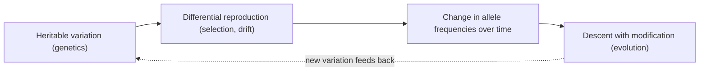
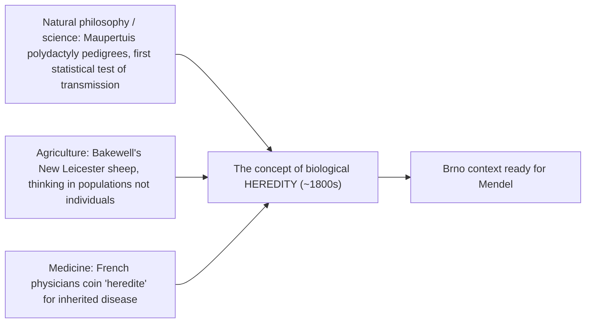
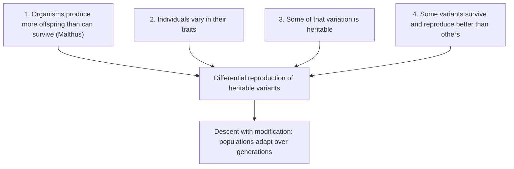
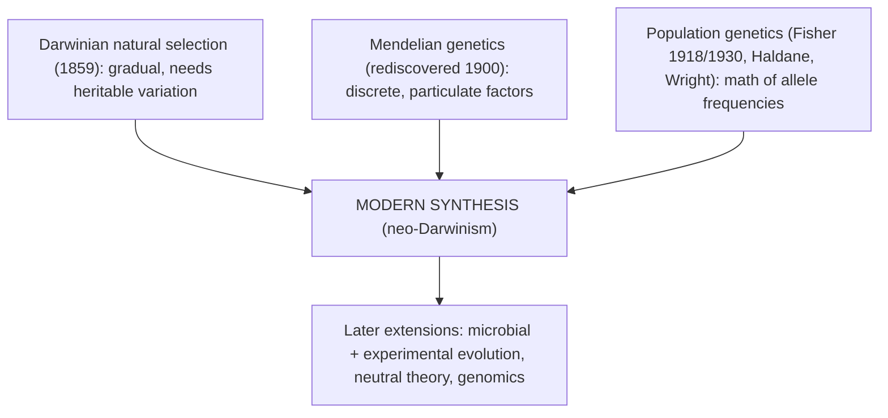

# Evolutionary Ideas

**Course:** BME333 / BIO333 Genetics (UNIST, 2026 Fall) · Lecture 01 · ~60 min
**Syllabus:** [← Course schedule](../../lectures/2026.BME333-BIO333-Syllabus.md) — Week 01 Mon, 2026-08-31
**Languages:** English · [한국어](../../ko/lectures/lec01_Evolutionary-Ideas.md)

## Learning Objectives
By the end of this lecture, students should be able to:
- Explain how pre-Darwinian ideas of heredity (blending, pangenesis, use/disuse) framed the questions genetics later answered.
- State the core logic of Darwin's theory: descent with modification by natural selection, and its dependence on heritable variation.
- Describe why Darwin lacked a working theory of inheritance and how this "missing mechanism" limited his argument.
- Define adaptation and fitness in a modern, testable sense, and distinguish natural selection from inclusive fitness.
- Situate the Modern Synthesis as the reconciliation of Darwinian selection with Mendelian and population genetics.

## Lecture

### 1. Course introduction & the genetics–evolution link (~8 min)

Welcome to Genetics. This course is about **heredity** — how biological information is stored, copied, varied, and passed from one generation to the next — and about the consequences of that transmission for populations, individuals, and molecules. We will move across three scales, and the course is organized to follow them: **population genetics** (how allele frequencies change in populations over time), **forward genetics** (from a phenotype, find the responsible gene), and **reverse genetics** (from a gene, find its phenotype). These are not separate subjects but three views of the same underlying process.

The conceptual backbone that ties them together is evolution. The geneticist Theodosius Dobzhansky's famous line — **"Nothing in biology makes sense except in the light of evolution"** — is the organizing principle of this whole course. Genetics and evolution are two halves of one theory: evolution is *change in heritable variation over time*, so it literally cannot be stated, let alone tested, without a theory of heredity. Conversely, the reason genes behave the way they do — why they mutate, recombine, and are selected — is that they are the product of billions of years of evolution. This first lecture traces how these two ideas grew up together, why they were separated for half a century, and how they were finally reunited.

**Figure — Genetics and evolution are one theory viewed from two sides.**


The historical puzzle we start with is this: Charles Darwin published a compelling theory of *how* species change in 1859, but he had **no correct theory of heredity** to power it. Gregor Mendel discovered the rules of heredity in the 1860s, but his work was ignored for 35 years. For half a century the two greatest ideas in biology sat unconnected. Understanding *why* — and how they were finally joined — is the story of this lecture and the doorway into the rest of the course.

### 2. Heredity before genetics (~12 min)

To appreciate Darwin's problem, we must first realize how recently the very *concept* of heredity came into being. As Cobb (2006) documents, **as recently as 200 years ago the word "heredity" had no biological meaning at all** (see [en](../../en/review/Cobb2006_NatRevGenet_HeredityBeforeGenetics.md) · [ko](../../ko/review/Cobb2006_NatRevGenet_HeredityBeforeGenetics.md)). Parent–offspring resemblance was lumped into a vast, confused category called **"generation"** that fused what we now separate into reproduction, genetics, and development. The raw phenomena seemed contradictory — children resemble sometimes one parent, sometimes neither, sometimes a grandparent — so no consistent theory emerged. The ancient Greeks bequeathed two frameworks: **Hippocrates's two-semen blending model** (both parents contribute a fluid that mixes) and **Aristotle's form/matter model** (the male provides form, the female provides matter). Neither could explain the patterns.

Cobb's key insight is that the modern concept of heredity was forged not by a single experiment but by **three converging strands**, each of which supplied data or language that biology lacked.

**Figure — Three strands converge to create the concept of "heredity" (Cobb 2006).**


- **Natural philosophy** contributed careful pedigrees. In the 18th century **Maupertuis** and Réaumur tracked **polydactyly** (extra fingers/toes) across three to four generations in German and Maltese families and found the trait reappearing in patterns preformationist theory could not predict. Maupertuis even calculated the odds that polydactyly could recur by chance over three generations — about **8 × 10¹² to 1** — arguably the first statistical test of hereditary transmission. Strikingly, this had no influence on later thinkers, and there is no evidence Mendel knew of it.
- **Agriculture** supplied the decisive practical model. The English sheep breeder **Robert Bakewell**, in the mid-18th century, systematically selected animals against explicit criteria to build the New Leicester breed. His conceptual leap was to think in terms of **populations rather than individuals** — the same shift population genetics would later formalize. Bakewell's methods spread across Europe; in Moravia, **Brno became a center of both sheep breeding and textile manufacture**, and by 1819 local thinkers were already outlining "genetic laws." This is the exact intellectual soil in which Mendel worked.
- **Medicine** supplied the *word*. French physicians studying heritable disease coined the noun **"hérédité"**; by the 1830s it was widespread in French medical literature, and the English "heredity" appeared in Spencer's writing around 1863 — the very moment Darwin was using it in his notes.

Against this backdrop, consider the theories of inheritance available to Darwin, all of which we now know to be wrong or incomplete. The default assumption was **blending inheritance**: offspring traits are an average of the parents', like mixing two paints. There was also **Lamarckism** — the inheritance of characters acquired through **use and disuse** during an individual's lifetime (the giraffe's neck stretched by reaching). Darwin himself, needing *some* mechanism, proposed **pangenesis**: every part of the body sheds tiny particles called **gemmules** that migrate to the reproductive organs and carry information — including newly acquired characters — into the next generation. Pangenesis is essentially a Lamarckian mechanism dressed in Victorian particulate language.

| Theory | Core claim | Fatal problem |
|---|---|---|
| **Blending inheritance** | Offspring = average of parents | Halves variation each generation; nothing left for selection |
| **Lamarckism (use/disuse)** | Traits acquired in life are inherited | No mechanism to write soma back into germ cells; not observed |
| **Pangenesis (Darwin)** | "Gemmules" from all body parts collect in gametes | Gemmules never found; cannot explain sterile-caste adaptation |
| **Particulate (Mendel/modern)** | Discrete factors pass intact, unchanged | *(correct — resolves all of the above)* |

The single most important idea to take from this segment is why **blending inheritance is fatal to natural selection**. If each generation's variation is halved by averaging, then the raw material selection needs — heritable *differences* — disappears within a few generations. This is not a quibble; it is a mathematical death sentence for Darwin's theory, and it was pointed out forcefully by a critic we meet next.

### 3. Darwin's argument (~12 min)

Darwin's theory of **natural selection**, set out in *On the Origin of Species* (1859), is at heart a short and rigorous logical argument — a syllogism. It requires only a handful of premises, all of them observable, and its conclusion follows necessarily.

**Figure — The logic of natural selection (Darwin's syllogism).**


Premise 1 — that populations tend to outgrow their resources — Darwin took directly from **Thomas Malthus's** *Essay on the Principle of Population*. As Orr (2009) stresses, both Darwin *and* Wallace independently credited Malthus as the trigger for the idea; the concept of natural selection was, in a real sense, suggested to biology *by economics* (see [en](../../en/review/Orr2009_Genetics_Darwin-SocialImplications.md) · [ko](../../ko/review/Orr2009_Genetics_Darwin-SocialImplications.md)). Premises 2–4 Darwin supported with an immense evidence base drawn from **artificial selection**: the achievements of pigeon fanciers, dog breeders, and — crucially — the horticultural and agricultural breeders whose named, stable varieties demonstrated that selection could reshape organisms dramatically (see [en](../../en/review/Olby2000_NatRevGenet_Horticulture.md) · [ko](../../ko/review/Olby2000_NatRevGenet_Horticulture.md)). If breeders could do it in decades, nature could do far more over geological time.

But note what premise 3 quietly assumes: **that variation is heritable and is not simply averaged away**. This is the fault line in Darwin's argument. He had a mechanism of *change* but no correct mechanism of *inheritance*, and the two are inseparable. The engineer **Fleeming Jenkin** delivered the sharpest blow: under blending inheritance, a favorable new variant would be diluted by half in each generation of mating with ordinary individuals, so **genetic variance decays by half per generation**, making permanent adaptive change impossible (see [en](../../en/review/Charlesworth2009_Genetics_Perspective-DarwinGenetics.md) · [ko](../../ko/review/Charlesworth2009_Genetics_Perspective-DarwinGenetics.md)). Darwin's answer — pangenesis — was itself inadequate, and he knew it: he candidly admitted it could not explain the adaptive traits of **sterile castes** in social insects, since a sterile worker leaves no offspring to inherit any character it acquires.

The deep irony, documented by the Charlesworths (2009), is that Darwin actually *held the answer in his own hands and could not read it*. In his crossing experiments on **Primula distyly** (the two flower forms of primroses) he obtained clean **1:1 and 3:1 ratios** — the very signatures of Mendelian segregation — but, lacking any framework of particulate inheritance, he could not interpret them. He was also unaware of Mendel's 1866 paper, published just two years before his own *Variation of Animals and Plants Under Domestication*. The mechanism that would have saved his theory existed, in print, in his own results — and the connection was not made for another half-century.

### 4. What is adaptation? Fitness and selection (~12 min)

Darwin's theory produces **adaptations** — traits shaped by natural selection to improve survival and reproduction. But to do science with this idea we need operational, testable definitions, not just intuition. Two terms must be pinned down.

**Fitness** is not "strength" or "health" in the everyday sense; it is a *measurable, relative quantity*: the expected reproductive contribution of a genotype to the next generation, relative to other genotypes in the same population. **Adaptation** is a trait that exists *because* it was favored by selection for its current function — which must be distinguished from traits that are merely incidental byproducts, or that persist by chance. The distinction matters because not every useful-looking trait is an adaptation, and demonstrating adaptation requires evidence about selective history, not just present utility.

Darwin believed evolution was far too slow to watch happen. Richard Lenski (2017) shows this belief was wrong, and that **adaptation by natural selection can be observed, quantified, and dissected in real time** (see [en](../../en/review/Lenski2017_PLoSgenet_WhatIsAdaptation.md) · [ko](../../ko/review/Lenski2017_PLoSgenet_WhatIsAdaptation.md)). The foundational result is the **Luria–Delbrück fluctuation test (1943)**, which established that mutations in bacteria arise **spontaneously**, *before* and independently of selection — not in response to it. This cleanly separates the two things Darwinism requires us to keep distinct: the **origin** of variation (random mutation) and its **fate** (non-random selection).

Lenski's own **Long-Term Evolution Experiment (LTEE)**, begun in **1988**, makes the process concrete. Twelve *E. coli* populations (six founded from each of two marked ancestral strains) are propagated purely asexually in minimal glucose medium, with a 1% serial transfer each day yielding about **6.7 generations per day**; the experiment has now passed **66,000 generations**. Three results are worth memorizing:

1. **Fitness climbs but decelerates** — a typical population raised its fitness by roughly **70% over 50,000 generations**, with big-effect mutations early and diminishing returns later (best fit by a power law with no ceiling, not by an asymptote).
2. **Evolution is repeatable yet divergent** — genome sequencing found that **over 50% of the beneficial (nonsynonymous) mutations landed in just ~2% of genes**, a strong statistical signature of natural selection targeting the same functions again and again.
3. **Historical contingency is real** — around generation **31,000, one population evolved the ability to use citrate aerobically**, a novel trait requiring a specific rearrangement on top of particular earlier "potentiating" mutations. Replay the tape from a different starting point and you get a different outcome.

**Figure — Adaptation as a rising, decelerating fitness trajectory in the LTEE.**
```
relative
fitness
  ~1.7 |                             . . . . . . .  (still rising, no ceiling)
       |                 . . . . . .
       |          . . .
       |     . .        <- big-effect mutations early, diminishing returns later
  1.0  | .
       +----------------------------------------------- generations
       0        10k       31k        50k       66k
                          ^
                   citrate use evolves (historical contingency)
```

Finally, selection does not always act on the individual. Darwin was troubled by **altruism** — sterile worker bees that sacrifice their own reproduction — calling it "one special difficulty, which at first appeared to me to be insuperable, and actually fatal to the whole theory." His own hint was that selection "may be applied to the family, as well as the individual." A full century later **William Hamilton** (1963–1964) formalized this as **inclusive fitness** (see [en](../../en/review/Dugatkin2007_Genetics_InclusiveFitness-DarwinHamilton.md) · [ko](../../ko/review/Dugatkin2007_Genetics_InclusiveFitness-DarwinHamilton.md)). The key insight uses the **coefficient of relatedness (*r*)** — a population-genetics quantity invented by Sewall Wright — the probability that a gene is shared between two relatives. Hamilton's Rule states that a gene for altruism spreads whenever the benefit to relatives, discounted by relatedness, exceeds the cost to the altruist:

**Figure — Hamilton's Rule: when altruism pays.**
```
   r · b  >  c
   |    |     |
   |    |     +-- c = fitness COST to the altruist
   |    +-------- b = fitness BENEFIT to the recipient
   +------------- r = relatedness (prob. the gene is shared)

  Haldane's quip: "I would lay down my life for two brothers (r=1/2 each)
  or eight cousins (r=1/8 each)."  -> 2·(1/2) = 1 ;  8·(1/8) = 1
```

Inclusive fitness is not a rival to natural selection but an *extension* of it: once we count copies of a gene rather than copies of an individual, apparently self-sacrificing behavior becomes ordinary Darwinian selection at the level of the gene.

### 5. Toward the Modern Synthesis (~10 min)

The reunion of Darwin and Mendel is called the **Modern Synthesis** (or neo-Darwinism). Mendel's laws were rediscovered in **1900**, but this did not immediately heal the rift — at first it *widened* it. As Olby (2000) shows, the early Mendelians (Bateson, de Vries) championed **discontinuous variation** and the origin of species by large mutations, which seemed to *deny* the gradual, small-step selection Darwin required; this put them in direct opposition to the Darwinian biometricians (see [en](../../en/review/Olby2000_NatRevGenet_Horticulture.md) · [ko](../../ko/review/Olby2000_NatRevGenet_Horticulture.md)). Genetics as a discipline nearly failed to take root in academic biology; it survived in England largely because the horticultural community — whose flower and fruit varieties visibly obeyed Mendelian ratios — embraced it, and it was at a 1906 horticultural conference that Bateson coined the word **"genetics."**

The reconciliation came from mathematics. **R. A. Fisher (1918)** proved that Mendelian particulate inheritance, acting on *many* genes of small effect, produces exactly the continuous, quantitative variation the biometricians measured — the two camps had been describing the same thing. Fisher's *Genetical Theory of Natural Selection* (1930) then showed that **all the difficulties of blending inheritance vanish under particulate inheritance**: variation is *conserved* across generations in the absence of evolutionary forces, which the Charlesworths call **a genetic analog of Galileo's law of inertia** (see [en](../../en/review/Charlesworth2009_Genetics_Perspective-DarwinGenetics.md) · [ko](../../ko/review/Charlesworth2009_Genetics_Perspective-DarwinGenetics.md)). Particulate genes do not blend, so selection finally has permanent variation to act on. Johannsen's pure-line experiments and the Nilsson-Ehle/East F2 studies confirmed empirically that apparent "blending" in F1 crosses is really the segregation of many Mendelian factors.

**Figure — The Modern Synthesis: independent streams merge (~1918–1950).**


The synthesis was built on **sexually reproducing plants and animals**, and its architects (Dobzhansky, Huxley) often explicitly set microbes aside. Bringing microbes back in both strengthened and complicated the picture. Experimental evolution — from the 1950s chemostat work to Lenski's LTEE — turned natural selection into something you can measure at the lab bench. But microbial genomics also revealed **lateral (horizontal) gene transfer**, which does not fit the tidy vertical, tree-like inheritance the synthesis assumed. Novick and Doolittle (2019) argue we should treat evolutionary theory not as a single true-or-false decree but as a **"toolkit" of explanatory resources** — natural selection, genetic drift, lateral transfer — each with a limited but real scope, to be combined as a given case demands (see [en](../../en/review/Novick2019_PLoSGenet_MicrobesModernSynthesis.md) · [ko](../../ko/review/Novick2019_PLoSGenet_MicrobesModernSynthesis.md)). This mature, non-dogmatic view — that no single mechanism is "the whole of evolution" — is the frame we carry into the rest of the course. (Lateral gene transfer and its challenge to the "tree of life" is the subject of Lecture 02.)

### 6. Social & historical context; wrap-up (~6 min)

Because *Origin* touched on humanity's place in nature, it was immediately read as having sweeping social implications. Orr (2009) argues that most of these were **"misconstrued or exaggerated," and that the influence often ran the *opposite* way — from society into biology**, not from biology into society (see [en](../../en/review/Orr2009_Genetics_Darwin-SocialImplications.md) · [ko](../../ko/review/Orr2009_Genetics_Darwin-SocialImplications.md)):

- **Economics.** "Social Darwinism" claimed natural selection justified laissez-faire competition. But the analogy is thin (biology has no analog of market *prices*), and historically the arrow pointed the other way: Darwin drew *from* Malthus and the Scottish economists. Following Lewontin, Orr suggests the theory might more honestly be called "Biological Competitive Capitalism."
- **Politics.** Darwin's insistence that adaptive change must be **gradual** (small individual differences, not monsters) parallels Edmund Burke's conservative argument that complex social systems must change "by insensible degrees." Fisher (1930) later gave this a mathematical basis: in a complex organism, small mutations are more likely to be beneficial because large changes have disastrous pleiotropic side effects. Again the gradualist idea was "in the air" politically before it was formalized biologically.
- **Religion.** Orr endorses the historians' **"complexity thesis"**: the popular image of perpetual "warfare" between science and religion is a 19th-century polemical invention; the real history is a mix of conflict, cooperation, and indifference. Rejecting biblical literalism is not the same as embracing atheism.

The lesson for a scientist is the distinction between the **context of discovery** (how an idea arises — often shaped by its time and place) and the **context of justification** (whether it is *true* — decided by evidence). Darwin's theory was both a product of Victorian culture *and* a correct description of nature; the two facts are independent.

**Wrap-up and the road ahead.** We have seen that evolution needs heredity, that Darwin lacked it, that Mendel supplied it, and that the two were fused into the Modern Synthesis and then broadened by microbial and molecular genetics. Next lecture we take the "descent with modification" idea literally and ask how we reconstruct it as a branching **tree of life** — and why lateral gene transfer turns that tree, near its base, into a network.

## Key Takeaways
- **Genetics and evolution are one theory:** evolution is change in heritable variation, so it cannot be stated without a theory of heredity — "nothing in biology makes sense except in the light of evolution."
- The **concept of heredity is recent** (~200 years old) and was forged by three converging strands — natural philosophy (pedigrees), agriculture (Bakewell, population thinking), and medicine (the word "hérédité") — the Brno context that produced Mendel.
- **Blending inheritance is fatal to selection** because it halves variation each generation; Fleeming Jenkin's critique exposed the central gap in Darwin's argument.
- **Darwin's syllogism** (overproduction + heritable variation + differential reproduction → descent with modification) is logically sound but *depends on* a correct, particulate theory of inheritance Darwin never had — even though his own Primula 3:1 ratios contained the answer.
- **Adaptation and fitness** are testable quantities; the Luria–Delbrück test (mutations arise spontaneously) and Lenski's LTEE (~70% fitness gain over 50,000 generations; citrate innovation at ~31,000) show selection can be watched and measured.
- **Inclusive fitness** (Hamilton's Rule, *rb > c*) extends Darwinian selection to altruism by counting shared genes, using Wright's relatedness *r*.
- The **Modern Synthesis** (Fisher 1918/1930) reconciled Mendelism with Darwinism — particulate genes conserve variation, "a genetic analog of the law of inertia" — and was later broadened by microbes into a *toolkit* view of evolutionary mechanisms.
- Distinguish the **context of discovery** from the **context of justification**: Darwin's ideas were shaped by Victorian economics and politics, yet their truth is settled by evidence, not origin.

## Textbook Reading
- **Evolution: Making Sense of Life (4e)** — Ch. 1 How Scientists Study Evolution; Ch. 2 From Natural Philosophy to Darwin. → [textbook ref](../../lectures/ref.Evolution-MakeSenseOfLife.md)
- **Genetics: From Genes to Genomes (8e)** — course introduction (front matter / Ch. 1 overview). → [textbook ref](../../lectures/ref.Genetics-FromGenesToGenomes.md)

## Notes in this vault
Reviews & articles to introduce in class (each has a bilingual en/ko pair):
- `Cobb2006_NatRevGenet_HeredityBeforeGenetics` — pre-genetics theories of heredity; sets up why Darwin's model was incomplete. · [en](../../en/review/Cobb2006_NatRevGenet_HeredityBeforeGenetics.md) · [ko](../../ko/review/Cobb2006_NatRevGenet_HeredityBeforeGenetics.md)
- `Charlesworth2009_Genetics_Perspective-DarwinGenetics` — Darwin's relationship to genetics and the inheritance problem he could not solve. · [en](../../en/review/Charlesworth2009_Genetics_Perspective-DarwinGenetics.md) · [ko](../../ko/review/Charlesworth2009_Genetics_Perspective-DarwinGenetics.md)
- `Orr2009_Genetics_Darwin-SocialImplications` — social and historical reception of Darwin's ideas; use for the wrap-up discussion. · [en](../../en/review/Orr2009_Genetics_Darwin-SocialImplications.md) · [ko](../../ko/review/Orr2009_Genetics_Darwin-SocialImplications.md)
- `Dugatkin2007_Genetics_InclusiveFitness-DarwinHamilton` — from Darwin to Hamilton's inclusive fitness; highlight for the fitness segment. · [en](../../en/review/Dugatkin2007_Genetics_InclusiveFitness-DarwinHamilton.md) · [ko](../../ko/review/Dugatkin2007_Genetics_InclusiveFitness-DarwinHamilton.md)
- `Lenski2017_PLoSgenet_WhatIsAdaptation` — a rigorous, testable definition of adaptation; anchor the "what is adaptation?" segment. · [en](../../en/review/Lenski2017_PLoSgenet_WhatIsAdaptation.md) · [ko](../../ko/review/Lenski2017_PLoSgenet_WhatIsAdaptation.md)
- `Olby2000_NatRevGenet_Horticulture` — horticulture and artificial selection as the empirical soil for both Darwin and Mendel. · [en](../../en/review/Olby2000_NatRevGenet_Horticulture.md) · [ko](../../ko/review/Olby2000_NatRevGenet_Horticulture.md)
- `Novick2019_PLoSGenet_MicrobesModernSynthesis` — the role of microbes in building the Modern Synthesis; bridges to experimental evolution. · [en](../../en/review/Novick2019_PLoSGenet_MicrobesModernSynthesis.md) · [ko](../../ko/review/Novick2019_PLoSGenet_MicrobesModernSynthesis.md)

## Discussion Questions
1. Fleeming Jenkin argued that blending inheritance makes natural selection impossible. State his argument precisely in terms of how variance changes each generation, and explain exactly why Mendelian particulate inheritance rescues Darwin's theory. Why did Fisher call this "a genetic analog of Galileo's law of inertia"?
2. Darwin obtained 1:1 and 3:1 ratios in his Primula crosses but could not interpret them. What conceptual framework was he missing, and what does this episode teach about the difference between *having* data and *understanding* it?
3. Using Hamilton's Rule (*rb > c*), explain how a gene for a self-sacrificing behavior (e.g., a sterile worker bee) can spread by natural selection. Is inclusive fitness a rival to Darwin's theory or an extension of it? Defend your answer.
4. Lenski's LTEE shows both striking *repeatability* (the same 2% of genes mutate again and again) and *contingency* (only one population evolved citrate use). How can evolution be both predictable and unpredictable? What does this imply about "replaying the tape of life"?
5. Orr argues that the social and political "implications" of Darwinism often flowed *from* society *into* biology, not the reverse. Give one example (economics, politics, or religion) and explain how distinguishing the context of discovery from the context of justification helps us evaluate whether a scientific theory is being misused.
