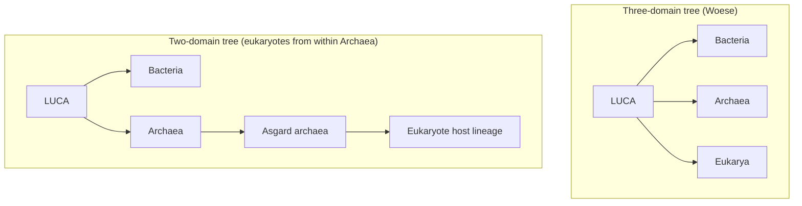
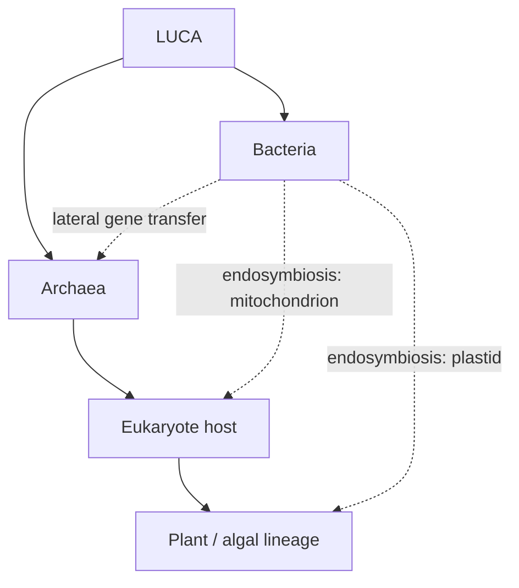
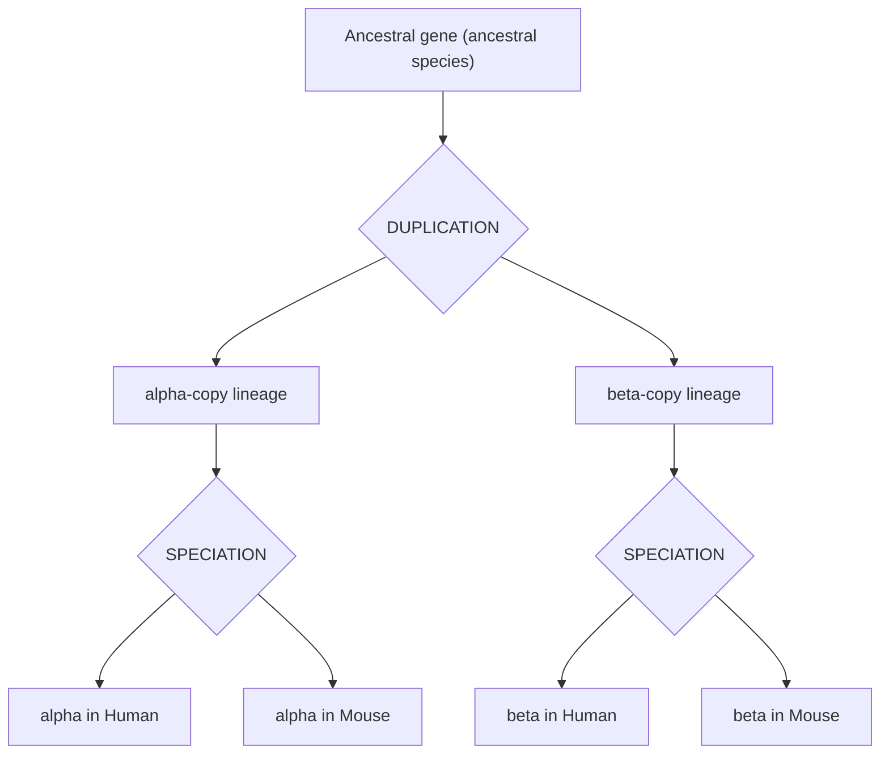
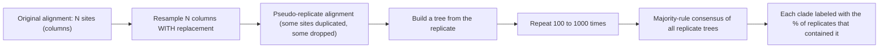
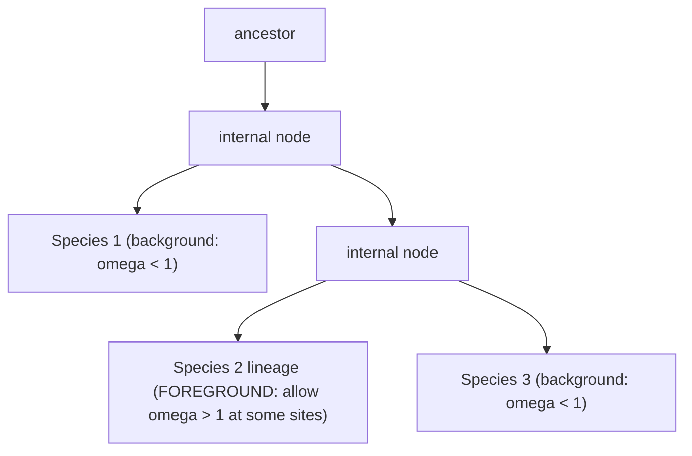
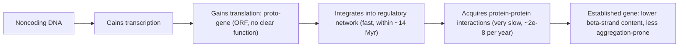

# Tree of Life, Orthology & Paralogy

**Course:** BME333 / BIO333 Genetics (UNIST, 2026 Fall) · Lecture 02 · ~60 min
**Syllabus:** [← Course schedule](../../lectures/2026.BME333-BIO333-Syllabus.md) — Week 01 Wed, 2026-09-02
**Languages:** English · [한국어](../../ko/lectures/lec02_Tree-of-Life-Orthology-Paralogy.md)

## Learning Objectives
By the end of this lecture, students should be able to:
- Read a phylogenetic tree correctly (nodes, branches, root, topology vs. branch length) and describe the tree of life concept and its limits (horizontal gene transfer, LUCA).
- Distinguish homology, orthology, and paralogy, and explain why the distinction matters for functional inference and genome annotation.
- Explain how trees are built and how node support is assessed with the bootstrap.
- Interpret dN/dS (Ka/Ks) as a signature of purifying, neutral, or positive selection, and describe branch-site tests.
- Explain the molecular clock and the concept of de novo gene birth.

## Lecture

### 1. The tree of life (~10 min)

The single illustration in Darwin's *On the Origin of Species* (1859) was a branching diagram — a **tree**. It captured his central metaphor: all species are related by **descent with modification** from common ancestors, so their relationships form a branching genealogy. What began as one hand-drawn figure has become an enormous research program: the **tree of life (TOL)**, the attempt to reconstruct the genealogy of all living things. Before we can ask whether that program succeeds, we must learn to read a tree.

**Figure — Anatomy of a phylogenetic tree.**
```
                (root = deepest common ancestor)
                       |
                 +-----+-----+          <- internal NODE = an inferred
                 |           |             common ancestor (a speciation event)
              +--+--+     +--+--+
              |     |     |     |
              A     B     C     D        <- TIPS = the taxa or sequences we observe

   TOPOLOGY   = the branching order (who shares a more recent ancestor with whom).
                Here (A,B) are sisters and (C,D) are sisters.
   BRANCH LEN = horizontal length can encode amount of evolutionary change or time.
   CLADE      = a node plus ALL its descendants (e.g. {C,D} or {A,B,C,D}).
```
Two properties are often confused. **Topology** is the *branching order* — the claim about who is most closely related to whom. **Branch length** is a *quantity* — how much change (or how much time) separates nodes. A tree can have a well-supported topology but uncertain branch lengths, or vice versa. Reading a tree means reading these separately.

The molecular era gave the TOL a new engine. In 1965 **Zuckerkandl and Pauling** proposed that trees built from *molecular sequences* could independently confirm the trees built from anatomy, because gene replication and mutation are themselves tree-like: a gene copies, its copies mutate, and lineages of the gene branch. For any **single gene without recombination this is approximately true**. The problem — the theme of Doolittle and Brunet's (2016) essay — is that **different genes often give different trees**, especially in prokaryotes, because of **lateral (horizontal) gene transfer (LGT)**: the movement of genes *across* lineages rather than straight down them (see [en](../../en/review/Doolittle2016_PLoSGenet_TreeOfLife.md) · [ko](../../ko/review/Doolittle2016_PLoSGenet_TreeOfLife.md)).

How pervasive is LGT? Only about **100 genes are found in nearly all prokaryotic genomes** — the "Nearly Universal Trees" (NUTs), overwhelmingly **ribosomal and transcriptional** genes. The **complexity hypothesis** (Jain et al. 1999) explains why: proteins that sit in large, multi-subunit machines have so many coevolved molecular partners that a foreign copy cannot function, so these genes resist transfer. Most *other* genes are fluid. A single *E. coli* strain carries roughly **5,000 genes**, but the **pangenome** of the species — the union of genes across all strains — approaches **100,000 gene families**, genes lost when useless and regained by LGT when needed. Because even the NUTs are not perfectly congruent, the best a universal tree can be is a **Statistical Tree of Life (STOL)** — the central tendency among the NUT topologies, a statistical construct rather than a literal record of ancestry.

The root of the whole tree is the **Last Universal Common Ancestor (LUCA)**. Weiss et al. (2018) reconstructed LUCA's likely gene content by demanding that a gene family be present in *both* Bacteria and Archaea, form a monophyletic group in each domain (an LGT filter), and appear in at least two phyla (see [en](../../en/article/Weiss2018_PLoSGenet_LastUniversal-CommonAncestor.md) · [ko](../../ko/article/Weiss2018_PLoSGenet_LastUniversal-CommonAncestor.md)). Of 11,093 gene families shared across the two domains, **only 355 (3%) survived the filters — meaning 97% of shared genes bear signatures of LGT.** Those 355 families paint a coherent portrait: LUCA was **anaerobic**, rich in oxygen-sensitive iron–sulfur enzymes, fixed carbon via the ancient **acetyl-CoA (Wood–Ljungdahl) pathway** using CO₂ and H₂, and — lacking its own ion-pumping machinery — probably harvested the natural pH gradient of **alkaline hydrothermal vents**. The earliest chemical traces of life (carbon-isotope signatures) date to about **3.95 billion years ago**, on an Earth whose oceans had condensed only ~4.2–4.3 Ga.

The classic picture of the tree's deepest structure was **Woese's three domains** — Bacteria, Archaea, Eukarya — each descending separately from LUCA. Newer phylogenomics and the discovery of the **Asgard archaea** support a **two-domain tree** in which eukaryotes arise from *within* Archaea. Eukaryotes are in fact **chimeras**: their cytoplasmic ribosomes are archaeal, their mitochondrial ribosomes bacterial, and bacterial-origin nuclear genes outnumber archaeal-origin ones ~3:1.

**Figure — The deep tree, two competing rootings.**


Endosymbiosis makes the point vivid: **mitochondria and plastids were once free-living bacteria** engulfed by a host cell. These are lineage *mergers*, not splits — so near its base and at these key nodes, the "tree" is really a **network**.

**Figure — Why the tree of life is a network near its base (LGT + endosymbiosis).**

The take-home: the TOL is an indispensable **heuristic** — a summary of life's history — but for prokaryotes it is an imperfect, statistical, partly reticulate one, not a literal bifurcating pedigree.

### 2. Homology, orthology, paralogy (~12 min)

The tree concept applies not only to species but to *genes*. To use it we need three precise terms. **Homology** means similarity due to **common ancestry** — two genes are homologous if they descend from a single ancestral gene. (Homology is a statement about history, not a percentage: sequences are either homologous or not; "% identity" is only evidence for it.) Homologous genes come in two flavors distinguished by *what event separated them*:

- **Orthologs** are homologs separated by a **speciation** event. When an ancestral species splits into two, each daughter inherits a copy of the gene; those two copies are orthologs.
- **Paralogs** are homologs separated by a **gene duplication** event *within* a genome. When a gene is duplicated, the two copies are paralogs and are free to diverge in function.

The cleanest way to see the difference is to draw the **gene tree** and label each internal node by the event that made it.

**Figure — Orthologs vs. paralogs: read the node that separates two genes.**

Now read pairs off the tree by finding the node where their lineages meet:

| Pair | Node that separates them | Relationship |
|---|---|---|
| alpha-Human vs. alpha-Mouse | SPECIATION | **Orthologs** |
| beta-Human vs. beta-Mouse | SPECIATION | **Orthologs** |
| alpha-Human vs. beta-Human | DUPLICATION | **Paralogs** |
| alpha-Human vs. beta-Mouse | DUPLICATION (deepest node) | **Paralogs** (out-paralogs) |

Notice that two genes in *different* species can still be paralogs (alpha-Human vs. beta-Mouse): the relationship is defined by the *separating event*, not by whether the genes are in the same organism. The globin family is the textbook case — α-globin and β-globin are paralogs born of an ancient duplication, while your β-globin and a chimpanzee's β-globin are orthologs.

Why does this matter? Because of the **ortholog conjecture**, the working assumption behind most genome annotation (*Genetics: From Genes to Genomes* 8e, Ch. 11). **Orthologs, having been separated only by speciation, tend to retain the ancestral function**, so if you know the function of a gene in one species you can transfer that annotation to its ortholog in another. **Paralogs are riskier**: after duplication, one copy is often free to acquire a new function (neofunctionalization) or split the old one (subfunctionalization), so assuming a paralog does the same job can be wrong. When a newly sequenced genome is annotated — assigning putative functions to thousands of genes — the pipeline is essentially: build gene families, identify orthologs across species, and transfer annotation along orthologous relationships. Getting orthology vs. paralogy right is therefore not academic bookkeeping; it is the foundation of how we assign function to genes we have never studied experimentally.

### 3. Building trees & node support (~12 min)

How do we actually *build* a tree from data, and how much should we trust it? Tree-building methods fall into two broad families. **Distance methods** first reduce the data to a matrix of pairwise distances and then fit a tree to those distances. **Character-based methods** keep the individual columns (sites) and score whole trees directly — **parsimony** picks the tree requiring the fewest changes; **maximum likelihood (ML)** picks the tree (and branch lengths) that make the observed data most probable under an explicit model of substitution.

These methods have a shared origin story. Edwards (2009) recounts how he and **Cavalli-Sforza**, working in Pavia in **1963–64** with an early computer and human **blood-group gene frequencies** (DNA sequences did not yet exist), invented three of the core approaches at once: a **least-squares additive tree**, **minimum evolution / parsimony**, and the **first application of maximum likelihood** to phylogenetics (see [en](../../en/review/Edwards2009_Genetics_Perspectives-EvolutionaryTreeStatistics.md) · [ko](../../ko/review/Edwards2009_Genetics_Perspectives-EvolutionaryTreeStatistics.md)). The lineage runs straight back to R. A. Fisher's statistical genetics — Edwards was the last undergraduate Fisher admitted — and forward to every modern tree program (PAUP, RAxML, BEAST). Edwards adds a historian's caution he learned the hard way: hunting for the single "first" discovery usually fails, because every advance is an intersection of earlier lines of thought.

A tree by itself is only a point estimate. We need to quantify **confidence in each clade**, and the standard tool is the **bootstrap**, introduced to phylogenetics by **Felsenstein (1985)** (see [en](../../en/article/Felsenstein1985_Evolution_Bootstrap-PhylogeneticTrees.md) · [ko](../../ko/article/Felsenstein1985_Evolution_Bootstrap-PhylogeneticTrees.md)). Felsenstein's key insight was identifying the correct **unit of resampling**: not the species (rows of the alignment) but the **characters — the columns/sites — resampled with replacement**, because sites can be modeled as independent, identically distributed draws given the true tree.

**Figure — The phylogenetic bootstrap.**


A **bootstrap value** is the percentage of pseudo-replicate trees in which a given clade appears; a clade is conventionally called well supported at **≥ 95%**, by analogy to a 5% significance level. Felsenstein derived a memorable special case for "perfectly compatible" (no-homoplasy) data — the **"rule of three"**: a clade reaches the 95% interval only if it is defined by **three or more characters**. Even in ideal data, one or two supporting characters are not enough. He also showed, using classic **fossil horse** data, that examining only the set of *most parsimonious* trees badly *underestimates* uncertainty — the bootstrap is more honest.

What does a bootstrap value actually *mean*? Hillis and Bull (1993) charged that bootstrap values are biased (too conservative). Efron, Halloran, and Holmes (1996) resolved the dispute: Felsenstein's bootstrap value is **not biased** — it simply answers a slightly different question than a classical p-value. Under a flat prior it is, in effect, a **Bayesian posterior probability that the clade is correct** (see [en](../../en/article/Efron1996_PNAS_Bootstrap-PhylogeneticTrees.md) · [ko](../../ko/article/Efron1996_PNAS_Bootstrap-PhylogeneticTrees.md)). Using malaria (*Plasmodium*) rRNA data, they showed a strong clade scoring **ã = 0.965** while a more exact "hypothesis-testing" level gave 0.942 — the discrepancy is real but small and can point either way, and computing the exact version costs ~20× more. The practical lesson: bootstrap values are a reasonable, cheap measure of confidence, but they are a statement about *sampling* consistency, **not a guarantee the clade is true** — and a bad inference method cannot be rescued by high bootstrap values.

### 4. Selection on sequences: dN/dS (~12 min)

Once we have a tree and aligned protein-coding sequences, we can ask a genetics question of deep importance: **what kind of selection has acted on this gene?** The tool is the **dN/dS ratio** (also written Ka/Ks or **ω**), the workhorse of molecular-evolution analysis reviewed by Yang and Bielawski (2000) (see [en](../../en/review/Yang2000_TrendsEcolEvol_dNdS.md) · [ko](../../ko/review/Yang2000_TrendsEcolEvol_dNdS.md)).

The logic rests on the redundancy of the genetic code. A DNA substitution in a codon is **synonymous** if it does not change the encoded amino acid, and **nonsynonymous** if it does. Because synonymous changes are (largely) invisible to selection on protein function, the synonymous rate **dS** estimates the neutral baseline mutation rate, while the nonsynonymous rate **dN** reflects mutation *plus* selection on the protein. Their ratio therefore reads out selection directly.

**Figure — Synonymous vs. nonsynonymous changes and what ω tells you.**
```
Codon CTT = Leucine
   synonymous:     CTT -> CTC   still Leucine        -> counts toward dS (neutral baseline)
   nonsynonymous:  CTT -> CCT   Leucine -> Proline   -> counts toward dN (protein change)

        omega (dN/dS)   interpretation
        -------------   -----------------------------------------
           < 1          PURIFYING selection: amino-acid changes removed (most genes)
           = 1          NEUTRAL: amino-acid changes not seen by selection
           > 1          POSITIVE (Darwinian) selection: changes actively favored
```

Two cautions from the review: naive counting methods can be off by **threefold** if they ignore transition/transversion bias and codon-usage bias (shown with human vs. orangutan α2-globin), so **maximum-likelihood codon models** are preferred; and — critically — **averaging ω over a whole gene is a very conservative test**, because a handful of positively selected sites are usually swamped by the majority under purifying constraint. The fix is **site models** that let ω vary *among codons*: pairs such as **M1 vs. M2** and **M7 vs. M8** are compared by a **likelihood-ratio test (LRT)**, and if the model allowing ω > 1 wins, Bayesian posterior probabilities pinpoint *which* residues are selected. Applied to **abalone sperm lysin**, this found ~27% of sites in a class with **ω = 3.065**, clustered on the protein surface — a molecular arms race with the egg-coat protein.

Selection is often **episodic**: confined to *particular sites* on *particular lineages* (e.g., after a gene gains a new role in one branch). Detecting that requires varying ω over **both** dimensions at once — the **branch-site test** analyzed by Yang and dos Reis (2011) (see [en](../../en/article/Yang2010_MBE_BranchSiteTest-PositiveSelection.md) · [ko](../../ko/article/Yang2010_MBE_BranchSiteTest-PositiveSelection.md)). You designate a **foreground branch** a priori and test whether a subset of codons has ω > 1 on it while the rest of the tree stays under constraint.

**Figure — The branch-site test: one foreground lineage, a few sites.**


Two subtleties are essential for using this test honestly. First, the **null distribution is not a plain χ²₁**: because the null fixes ω = 1 at the boundary of the allowed range, the correct reference is a **50:50 mixture of a point mass at 0 and χ²₁** (Chernoff 1954). Using it, simulated false-positive rates sit near the nominal **5%** with as few as 20–50 codons, and the test has far more power than branch-only tests (which can have ~0% power for episodic, site-restricted selection). Second, and practically most important: the branch-site test is a **magnifying glass that amplifies both true signal and data errors**. **Alignment mistakes** create fake runs of nonsynonymous differences that mimic positive selection — many "positively selected" genes reported on the chimpanzee lineage vanished once alignments were cleaned up. Good preprocessing matters as much as the test itself.

### 5. Molecular clock & de novo gene birth (~10 min)

If substitutions accumulate at a roughly steady rate, then **the number of differences between two sequences is a clock** — multiply by a calibrated rate and you can *date* their divergence. This is the **molecular clock**, whose history Takahata (2007) traces (see [en](../../en/review/Takahata2007_Genetics_MolecularClock.md) · [ko](../../ko/review/Takahata2007_Genetics_MolecularClock.md)). **Zuckerkandl and Pauling** proposed it in 1962–65 after finding that amino-acid substitutions in hemoglobins accumulated at a fairly constant rate, describable as a **Poisson process**. They realized a clock *requires* that substitutions be **nearly neutral** — a foreshadowing of Kimura's **neutral theory**.

**Figure — The molecular clock: substitutions accumulate with time.**
```
time  --->            (x = a fixed substitution)

split
  |----lineage A:   x---x-------x---x---x    fast tick (e.g. short generation time)
  |
  |----lineage B:   x------x------x------x   slow tick

  # substitutions  ~  rate  x  time
  => count substitutions, calibrate the rate with a fossil date, and DATE the split.
```

Takahata's provocative framing is that the clock is an **"anti-neo-Darwinian legacy"**: it was the *constancy* of the rate for each protein — not electrophoretic polymorphism — that Kimura took as the strongest evidence that most molecular change is driven by **mutation and drift, not selection**. A crucial companion idea is **selective constraint**: *the more stringent a molecule's functional requirement, the slower it evolves* — which is exactly why synonymous sites and pseudogenes evolve fastest, and why dN/dS < 1 for most genes. But the clock is not a precision instrument. Substitution counts are **overdispersed** (more variable than a pure Poisson), prompting Gillespie's "episodic clock." Rates vary systematically by lineage — the fossil-independent **relative-rate test** (Sarich & Wilson) let Wu and Li (1985) show **rodents evolve about twice as fast as humans**, largely a **generation-time effect**. Takahata distinguishes such **lineage effects** (mutation-rate differences among lineages, strong for silent sites) from **residual effects** (rate differences among proteins). The clock "ticks erratically," yet remains usable because idiosyncrasies of individual genes **average out when many loci are combined**.

Trees and clocks describe how *existing* genes diverge — but where do genes come from in the first place? The classic answer is **gene duplication** (making the paralogs of Segment 2). A newer, striking answer is **de novo gene birth**: entirely new genes emerging from previously **noncoding DNA**. Abrusan (2013), with the student primer by Frietze and Leatherman (2014), studied this in yeast using **proto-genes** — translated ORFs without a clear function — as snapshots of the intermediate stage (see [en](../../en/article/Abrusan2013_Genetics_DeNovoGeneBirth.md) · [ko](../../ko/article/Abrusan2013_Genetics_DeNovoGeneBirth.md); primer [en](../../en/review/Abrusan2013_Genetics_DeNovoGeneBirth-Frietze2014primer.md) · [ko](../../ko/review/Abrusan2013_Genetics_DeNovoGeneBirth-Frietze2014primer.md)).

**Figure — Stepwise de novo gene birth (Abrusan 2013).**


The data reveal two very different timescales. New genes are wired into **transcriptional regulatory networks quickly** (within roughly **14 million years**), but they **acquire stable protein–protein interactions extremely slowly** (~**2–2.25 × 10⁻⁸ interactions per year**). Structurally, **younger genes and proto-genes have higher β-strand content and higher aggregation propensity**, both of which *decrease* as genes age — a signature of ongoing selection for stable, non-toxic proteins. De novo birth shows that the gene repertoire is not fixed: the genome can mint genuinely new genes out of "junk," which is a fitting bridge from phylogenetic history to the population-genetic processes that shape genomes over time.

### 6. Synthesis & wrap-up (~4 min)

Phylogenetic thinking is not a niche topic — it is the connective tissue of genomics. **Trees** let us organize all of life and infer common ancestry, provided we remember that LGT and endosymbiosis turn the deepest branches into a **network** and reduce the universal tree to a statistical construct anchored on LUCA. **Orthology vs. paralogy** — read off gene trees by the event (speciation vs. duplication) that separates copies — is the logic that lets us **transfer functional annotation** to genes we have never studied (the ortholog conjecture). The **bootstrap** tells us how much to trust each clade. **dN/dS and branch-site tests** turn alignments into statements about **selection**, connecting molecular data to the natural-selection theory of Lecture 01. The **molecular clock** dates divergences and, through rate constancy and selective constraint, ties directly into the neutral theory and the population-genetics lectures ahead. And **de novo gene birth** reminds us that the genome is a living, changing repertoire. Every one of these tools reappears when we move from describing evolutionary history to modeling the population processes that generate it.

## Key Takeaways
- A phylogenetic tree encodes **topology** (branching order = who is related to whom) separately from **branch length** (amount of change or time); a **clade** is a node plus all its descendants.
- The **tree of life** is an essential heuristic but, for prokaryotes, a partly **reticulate network**: only ~100 "nearly universal" genes resist **lateral gene transfer** (complexity hypothesis), pangenomes dwarf single genomes, and eukaryotes are **chimeras** born of endosymbiosis.
- **LUCA** is reconstructed from just **355 gene families** (97% of shared genes show LGT) as an anaerobic, hydrothermal-vent organism using the acetyl-CoA pathway; the deep tree may be **two-domain** (eukaryotes from within Asgard Archaea) rather than three-domain.
- **Homology** = common ancestry; **orthologs** are split by **speciation**, **paralogs** by **duplication** — read the separating node off the gene tree. The **ortholog conjecture** (orthologs retain function) underlies genome annotation; paralogs may neo- or subfunctionalize.
- Trees are built by **distance, parsimony, and maximum-likelihood** methods (Cavalli-Sforza & Edwards, 1963–64); the **bootstrap** resamples **sites (columns), not taxa**, and clade support ≈ a Bayesian posterior under a flat prior — a measure of sampling consistency, not a guarantee of truth.
- **dN/dS (ω)** reads selection on proteins: **< 1 purifying, = 1 neutral, > 1 positive**; **site models** and the **branch-site test** detect selection restricted to specific codons and lineages — but the correct null is a **50:50 mixture of 0 and χ²₁**, and alignment errors cause false positives.
- The **molecular clock** dates divergences (substitutions ≈ rate × time); its **constancy** is key evidence for neutrality and **selective constraint** (stringent function → slower evolution), though it "ticks erratically" and needs calibration and many loci.
- **De novo gene birth** creates new genes from noncoding DNA via a proto-gene stage: regulatory integration is fast (~14 Myr) but protein-interaction integration is slow, and young proteins are more β-strand-rich and aggregation-prone.

## Textbook Reading
- **Evolution: Making Sense of Life (4e)** — Ch. 4 The Tree of Life (phylogeny); Ch. 8 The History in Our Genes. → [textbook ref](../../lectures/ref.Evolution-MakeSenseOfLife.md)
- **Genetics: From Genes to Genomes (8e)** — Ch. 11 Genome Annotation. → [textbook ref](../../lectures/ref.Genetics-FromGenesToGenomes.md)

## Notes in this vault
Reviews & articles to introduce in class (each has a bilingual en/ko pair):
- `Doolittle2016_PLoSGenet_TreeOfLife` — what "the tree of life" means and why HGT complicates it; frame the opening segment. · [en](../../en/review/Doolittle2016_PLoSGenet_TreeOfLife.md) · [ko](../../ko/review/Doolittle2016_PLoSGenet_TreeOfLife.md)
- `Weiss2018_PLoSGenet_LastUniversal-CommonAncestor` — reconstructing LUCA's gene content; the root of the tree. · [en](../../en/article/Weiss2018_PLoSGenet_LastUniversal-CommonAncestor.md) · [ko](../../ko/article/Weiss2018_PLoSGenet_LastUniversal-CommonAncestor.md)
- `Felsenstein1985_Evolution_Bootstrap-PhylogeneticTrees` — the founding paper introducing the bootstrap to phylogenetics. · [en](../../en/article/Felsenstein1985_Evolution_Bootstrap-PhylogeneticTrees.md) · [ko](../../ko/article/Felsenstein1985_Evolution_Bootstrap-PhylogeneticTrees.md)
- `Efron1996_PNAS_Bootstrap-PhylogeneticTrees` — the statistical interpretation of bootstrap support values. · [en](../../en/article/Efron1996_PNAS_Bootstrap-PhylogeneticTrees.md) · [ko](../../ko/article/Efron1996_PNAS_Bootstrap-PhylogeneticTrees.md)
- `Edwards2009_Genetics_Perspectives-EvolutionaryTreeStatistics` — historical perspective on the statistics of evolutionary trees. · [en](../../en/review/Edwards2009_Genetics_Perspectives-EvolutionaryTreeStatistics.md) · [ko](../../ko/review/Edwards2009_Genetics_Perspectives-EvolutionaryTreeStatistics.md)
- `Yang2000_TrendsEcolEvol_dNdS` — how to estimate and interpret dN/dS; anchor the selection segment. · [en](../../en/review/Yang2000_TrendsEcolEvol_dNdS.md) · [ko](../../ko/review/Yang2000_TrendsEcolEvol_dNdS.md)
- `Yang2010_MBE_BranchSiteTest-PositiveSelection` — branch-site test for detecting positive selection at specific sites/lineages. · [en](../../en/article/Yang2010_MBE_BranchSiteTest-PositiveSelection.md) · [ko](../../ko/article/Yang2010_MBE_BranchSiteTest-PositiveSelection.md)
- `Takahata2007_Genetics_MolecularClock` — the molecular clock concept and its assumptions. · [en](../../en/review/Takahata2007_Genetics_MolecularClock.md) · [ko](../../ko/review/Takahata2007_Genetics_MolecularClock.md)
- `Abrusan2013_Genetics_DeNovoGeneBirth` — how new genes arise de novo from non-coding DNA. · [en](../../en/article/Abrusan2013_Genetics_DeNovoGeneBirth.md) · [ko](../../ko/article/Abrusan2013_Genetics_DeNovoGeneBirth.md)
- `Abrusan2013_Genetics_DeNovoGeneBirth-Frietze2014primer` — a student-friendly primer on the de novo gene-birth study. · [en](../../en/review/Abrusan2013_Genetics_DeNovoGeneBirth-Frietze2014primer.md) · [ko](../../ko/review/Abrusan2013_Genetics_DeNovoGeneBirth-Frietze2014primer.md)

## Discussion Questions
1. Doolittle and Brunet argue that "the tree of life" is at best a statistical construct for prokaryotes. Explain how lateral gene transfer and endosymbiosis turn the base of the tree into a network, and why only ~100 genes (the complexity hypothesis) resist transfer. Is "tree" still a useful metaphor? Defend your view.
2. Draw a gene tree in which an ancestral gene duplicates and then the species splits. Label every pair of present-day genes as orthologs or paralogs. Why does the ortholog conjecture make orthologs (not paralogs) the safe basis for transferring functional annotation to a newly sequenced genome?
3. A published phylogeny shows a clade with 99% bootstrap support. Following Felsenstein (1985) and Efron et al. (1996), explain exactly what that number does and does not tell you. Why can a *wrong* tree still show high bootstrap values, and why is the resampling unit the site rather than the species?
4. You compute ω = dN/dS = 0.4 for a whole gene, yet suspect a few residues are under positive selection on one lineage. Why does the gene-wide average hide this, and how do site models and the branch-site test recover the signal? Why must the branch-site test use a 50:50 mixture null, and why are alignment errors so dangerous here?
5. The molecular clock is central to dating divergences yet "ticks erratically." Explain how rate constancy became evidence for the neutral theory, what generation-time (lineage) effects do to the clock, and why combining many loci still lets us estimate divergence times.
