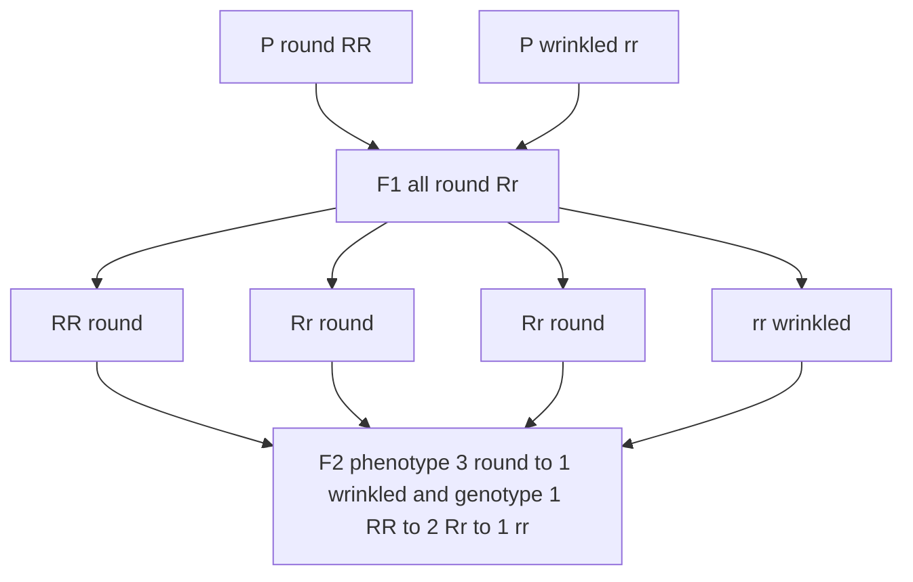
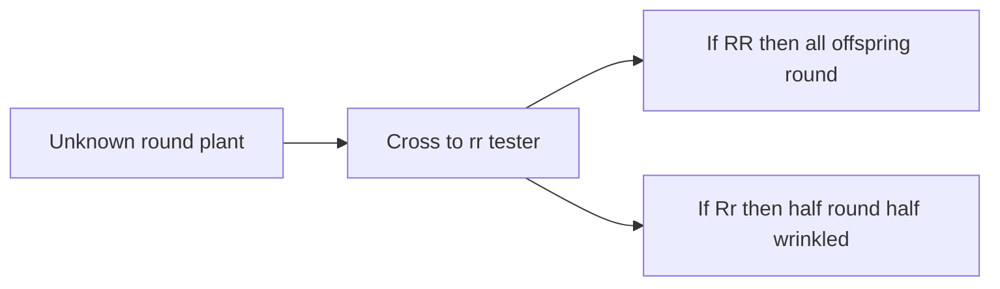

# Mendel's Principles of Heredity

**Course:** BME333 / BIO333 Genetics (UNIST, 2026 Fall) · Lecture 03 · ~60 min
**Syllabus:** [← Course schedule](../../lectures/2026.BME333-BIO333-Syllabus.md) — Week 02 Mon, 2026-09-07
**Languages:** English · [한국어](../../ko/lectures/lec03_Mendel-Principles.md)

## Learning Objectives
By the end of this lecture, students should be able to:
- State Mendel's Law of Segregation and Law of Independent Assortment and connect them to the particulate theory of inheritance.
- Predict monohybrid and dihybrid cross outcomes (3:1, 9:3:3:1) using Punnett squares and the product/sum rules.
- Explain why Mendel's choice of pea, discrete traits, and quantitative counting made his experiments decisive.
- Discuss the historiography of Mendel: his reasoning, the "too-good-to-be-true" data debate, and his rediscovery.
- Relate Mendel's classical traits to their molecular identities in the modern pea genome.

## Lecture

### 1. Why Mendel succeeded (~10 min)

Before Mendel, the dominant view of heredity was **blending inheritance**: the idea that the characteristics of two parents mix in their offspring like two paints stirred together, so that a tall parent and a short parent should yield offspring of intermediate height. Blending has a fatal problem — it destroys variation. Each generation of mixing would halve the differences in a population until everyone converged on an average, leaving nothing for natural selection to act on. Gregor Mendel's great achievement was to show, quantitatively, that this picture is wrong: hereditary information is **particulate**, carried by discrete "factors" (what we now call genes) that pass intact from generation to generation, neither diluted nor blended.

Mendel (1822–1884) was not a lucky amateur. Born to poor German-speaking peasant farmers in what is now the Czech Republic, he studied physics and combinatorial mathematics at the University of Vienna under Christian Doppler and Franz Unger, then entered the Augustinian abbey in Brünn (Brno). As Nasmyth (2022) memorably notes, Mendel was paradoxically **freed for research by twice failing his teaching-certificate exams** (see [en](../../en/review/Nasmyth2022_NatRevGenet_Mendel.md) · [ko](../../ko/review/Nasmyth2022_NatRevGenet_Mendel.md)). His central insight was uniquely biological: it is possible to measure the *transmission of hereditary information* without knowing anything about its material basis — to track the movement of information, not of substances.

Mendel's success rested on a set of deliberate methodological choices, all illustrated by his chosen organism, the **garden pea (*Pisum sativum*)**. In the opening of his 1866 paper he explains that a suitable experimental plant must satisfy three requirements (see [en](../../en/article/Abbott2016_Genetics_MendelHybridPaper.md) · [ko](../../ko/article/Abbott2016_Genetics_MendelHybridPaper.md)):

1. **Clearly distinguishable, constant traits** — discrete alternatives (round *or* wrinkled), not continuous gradations.
2. **Protection of the flowers from foreign pollen** — the pea flower self-pollinates inside a closed keel, so lines stay pure unless the experimenter deliberately crosses them.
3. **Full fertility of the hybrids** — so that large numbers of offspring can be scored across generations.

Two more choices were decisive. First, Mendel spent **two preliminary years testing 34 pea varieties and selecting 22** that bred true (were **true-breeding**, i.e. genetically pure and giving uniform offspring on self-pollination) for **seven pairs of contrasting traits**. Second — and this is what separated him from every predecessor — he **counted large numbers of offspring and reasoned about the ratios statistically**. Where earlier hybridizers such as Knight, Goss, Gärtner, and Laxton had *seen* the reappearance of hidden traits, only Mendel, with his mathematical training, recognized the recurring **3:1 ratio** as a law demanding explanation (see [en](../../en/review/vanDijk2022_NatGenet_MendelPerspective.md) · [ko](../../ko/review/vanDijk2022_NatGenet_MendelPerspective.md)). This is the "prepared mind" at work: the same observation is meaningless to one observer and revolutionary to another.

Two pieces of historical context deepen the story. The garden pea was not an arbitrary lab plant but a **horticultural workhorse** with centuries of catalogued, named varieties available to breeders — the horticultural community had, in effect, pre-assembled Mendel's toolkit of stable variants (see [en](../../en/review/Olby2000_NatRevGenet_Horticulture.md) · [ko](../../ko/review/Olby2000_NatRevGenet_Horticulture.md)). And Mendel's project was not purely abstract: van Dijk, Jessop, and Ellis (2022) uncovered an 1861 Brünn newspaper notice praising Mendel's peas, beans, and cucumbers, showing that he ran a **practical vegetable-breeding program alongside his scientific one** — the 3:1 ratios were quite possibly first noticed in ordinary breeding crosses (see [en](../../en/review/vanDijk2022_NatGenet_MendelPerspective.md) · [ko](../../ko/review/vanDijk2022_NatGenet_MendelPerspective.md)).

### 2. Segregation (first law) (~12 min)

Consider a single trait — say seed shape, **round (R)** versus **wrinkled (r)**. Mendel crossed a true-breeding round line with a true-breeding wrinkled line. This is a **monohybrid cross** (a cross tracking one trait). The parental generation is the **P generation**; their offspring the **first filial (F1)** generation; the F1's self-pollinated offspring the **F2**.

**Result 1 — F1 uniformity.** Every F1 plant was round. The wrinkled character had vanished. Mendel called the character that appears in the F1 the **dominant** character and the one that disappears the **recessive** character. Crucially, dominance did **not** depend on which parent contributed which trait — round pollen × wrinkled egg gave the same result as the reciprocal cross. This already refutes blending: the F1 is not intermediate; it looks exactly like one parent.

**Result 2 — F2 3:1 ratio.** When Mendel let the F1 self-pollinate, the recessive character *reappeared*. Across all seven traits the dominant:recessive ratio in the F2 averaged **2.98:1 ≈ 3:1**. His actual tallies (see [en](../../en/article/Abbott2016_Genetics_MendelHybridPaper.md) · [ko](../../ko/article/Abbott2016_Genetics_MendelHybridPaper.md)):

| Trait (dominant vs. recessive) | F2 counts | Ratio |
|---|---|---|
| Seed shape (round vs. wrinkled) | 5,474 : 1,850 | 2.96 : 1 |
| Cotyledon color (yellow vs. green) | 6,022 : 2,001 | 3.01 : 1 |
| Seed-coat color (grey-brown vs. white) | 705 : 224 | 3.15 : 1 |
| Pod form (inflated vs. constricted) | 882 : 299 | 2.95 : 1 |
| Pod color (green vs. yellow) | 428 : 152 | 2.82 : 1 |
| Flower position (axial vs. terminal) | 651 : 207 | 3.14 : 1 |
| Stem length (tall vs. dwarf) | 787 : 277 | 2.84 : 1 |

The reappearance of the recessive character intact in the F2 is impossible under blending but is exactly what particulate factors predict.

**Mendel's model.** Each plant carries **two factors** (alleles) for each trait, one inherited from each parent. During the formation of germ cells (gametes), the two factors **separate (segregate)** so that each gamete carries only one. This is the **Law of Segregation**: the two alleles of a gene separate equally into gametes, so half carry one allele and half the other. A true-breeding round plant is *RR* (**homozygous**); a true-breeding wrinkled plant is *rr*; the F1 is *Rr* (**heterozygous**) and round because *R* is dominant. The distinction between an organism's genetic makeup (**genotype**, e.g. *Rr*) and its outward appearance (**phenotype**, e.g. round) is the conceptual heart of Mendelism — and, as Olby (2000) notes, only some of Mendel's rediscoverers fully grasped this transmission-versus-expression distinction (see [en](../../en/review/Olby2000_NatRevGenet_Horticulture.md) · [ko](../../ko/review/Olby2000_NatRevGenet_Horticulture.md)).

**Why 3:1 falls out.** When the *Rr* F1 self-pollinates, each parent contributes *R* or *r* with equal probability. A **Punnett square** enumerates the equally likely combinations:

|       | **R** (½) | **r** (½) |
|-------|-----------|-----------|
| **R** (½) | RR | Rr |
| **r** (½) | Rr | rr |

The genotype ratio is **1 RR : 2 Rr : 1 rr** — Mendel's own "A + 2Aa + a" series. Because *RR* and *Rr* both look round, the *phenotype* ratio is **3 round : 1 wrinkled**. Mendel confirmed the hidden 1:2:1 by growing the F2 dominants a further generation: **two-thirds behaved as hybrids** (their offspring again segregated 3:1) and **one-third bred true**, exactly as the model requires.

**The monohybrid cross, generation by generation.**



**The testcross.** How can you tell a round plant that is *RR* from one that is *Rr*, since they look identical? Cross the unknown to a **homozygous recessive (*rr*)** tester. If the unknown is *RR*, all offspring are round (*Rr*). If it is *Rr*, offspring appear **1 round : 1 wrinkled**. The testcross reads the genotype directly off the phenotype of the offspring, and remains a workhorse of genetic analysis today.

**Testcross logic: the offspring reveal the unknown genotype.**



### 3. Independent assortment (second law) (~12 min)

Mendel next asked whether two different traits are inherited together or independently. He crossed a true-breeding line with **round, yellow** seeds (*RRYY*) to one with **wrinkled, green** seeds (*rryy*) — a **dihybrid cross** (two traits at once). The F1 were all round and yellow (*RrYy*), confirming that round and yellow are dominant.

The key question is the F2. If the two genes travel together, the F2 would show only the two parental combinations (round-yellow and wrinkled-green) in a 3:1 ratio. If instead each gene assorts independently, all four combinations — including the **new (recombinant) types** round-green and wrinkled-yellow — should appear. Mendel's F2 of **556 seeds** gave (see [en](../../en/article/Abbott2016_Genetics_MendelHybridPaper.md) · [ko](../../ko/article/Abbott2016_Genetics_MendelHybridPaper.md)):

- 315 round, yellow
- 101 wrinkled, yellow
- 108 round, green
- 32 wrinkled, green

That is very close to **9 : 3 : 3 : 1**. The appearance of the two recombinant classes in substantial numbers is the signature of the **Law of Independent Assortment**: the alleles of one gene segregate into gametes independently of the alleles of another gene. A heterozygous *RrYy* plant therefore produces four gamete types — *RY*, *Ry*, *rY*, *ry* — in **equal (¼ each)** frequency.

The 9:3:3:1 ratio is simply two independent 3:1 ratios multiplied together. A 4×4 Punnett square of the 16 equally likely offspring makes this concrete:

|        | **RY** | **Ry** | **rY** | **ry** |
|--------|--------|--------|--------|--------|
| **RY** | RRYY | RRYy | RrYY | RrYy |
| **Ry** | RRYy | RRyy | RrYy | Rryy |
| **rY** | RrYY | RrYy | rrYY | rrYy |
| **ry** | RrYy | Rryy | rrYy | rryy |

Counting phenotypes gives **9 round-yellow : 3 round-green : 3 wrinkled-yellow : 1 wrinkled-green**. Mendel generalized this to any number of traits: for **n pairs of differing characters** there are **3ⁿ genotype classes, 2ⁿ true-breeding (constant) combinations, and 4ⁿ equally likely gamete unions** — he verified the three-trait case (a 27-class series) directly. Nasmyth (2022) stresses a deep implication that is easy to overlook: independent assortment shows that *different aspects of an organism are specified by separate, independently transmitted elements handled by one common mechanism* — a direct conceptual ancestor of the "one gene, one enzyme" idea (see [en](../../en/review/Nasmyth2022_NatRevGenet_Mendel.md) · [ko](../../ko/review/Nasmyth2022_NatRevGenet_Mendel.md)).

Independent assortment holds **only for genes on different chromosomes (or far apart on the same chromosome)**. Genes physically close together on the same chromosome are **linked** and tend to be inherited together, breaking the 9:3:3:1 ratio — a phenomenon we return to in the linkage and gene-mapping lecture. Mendel's seven traits happened to behave independently, which is fortunate but, as we now know from the pea genome, not because they all lie on different chromosomes.

### 4. Probability tools (~8 min)

Punnett squares are intuitive but become unwieldy fast — a trihybrid needs a 64-cell grid. Two probability rules make prediction efficient.

**The product rule:** the probability that **two independent events both occur** is the product of their separate probabilities. Because each gene segregates independently, we can compute each trait separately and multiply. In an *RrYy* × *RrYy* cross, P(round) = ¾ and P(yellow) = ¾, so P(round *and* yellow) = ¾ × ¾ = **9/16** — the "9" in 9:3:3:1, obtained without drawing anything. Likewise P(wrinkled, green) = ¼ × ¼ = 1/16.

**The sum rule:** the probability of **either of two mutually exclusive events** is the sum of their probabilities. The probability that a seed is round-green *or* wrinkled-yellow is 3/16 + 3/16 = **6/16**.

**Branch (tree) diagrams** organize this trait by trait. Build the phenotype of an *RrYy* × *RrYy* dihybrid one gene at a time, multiplying along each path:

```
seed shape          seed color         combined (product rule)
                 ┌─ yellow (3/4) ───── round, yellow    = 3/4 × 3/4 = 9/16
   round (3/4) ──┤
                 └─ green  (1/4) ───── round, green     = 3/4 × 1/4 = 3/16
                 ┌─ yellow (3/4) ───── wrinkled, yellow = 1/4 × 3/4 = 3/16
   wrinkled(1/4)─┤
                 └─ green  (1/4) ───── wrinkled, green  = 1/4 × 1/4 = 1/16
```

The four products sum to 1 and reproduce **9:3:3:1** — the same answer as the 16-cell Punnett square, but scalable. For a *trihybrid* (*RrYyGg* × *RrYyGg*), the fraction that is triple-recessive is simply ¼ × ¼ × ¼ = **1/64**, and the fraction showing all three dominant phenotypes is ¾ × ¾ × ¾ = **27/64** — no 64-cell grid required. These are the everyday tools for pedigree analysis and genetic-counseling risk calculations later in the course.

Mendel himself used this logic in reverse to *test* his model. If a heterozygous hybrid really makes each gamete type in equal frequency, then crossing the hybrid back to a recessive parent should yield offspring classes in equal (1:1, or 1:1:1:1 for two traits) proportions. His **backcross experiments** confirmed exactly these equal-frequency gamete ratios — direct evidence for segregation and independent assortment at the level of the germ cells, not just the offspring counts (see [en](../../en/article/Abbott2016_Genetics_MendelHybridPaper.md) · [ko](../../ko/article/Abbott2016_Genetics_MendelHybridPaper.md)).

### 5. Mendel in historical & scientific context (~12 min)

Mendel presented his results in two 1865 lectures and published *Versuche über Pflanzen-Hybriden* ("Experiments on Plant Hybrids") in 1866. Understanding what he actually did — and what was later attributed to him — is part of thinking like a scientist.

**What did Mendel think he had discovered?** Hartl and Orel (1992) contrast the **orthodox** view (Mendel set out to discover universal laws of particulate inheritance) with the **revisionist** view (Mendel worked within the 19th-century plant-hybridization tradition, concerned with species stability and hybrid formation). They argue Mendel described a **"law of combination of differing traits"** — striking numerical regularities in hybrid offspring — and did *not* claim to have found the material units of heredity; the elevation of his ratios into foundational "laws of genetics" was largely the work of the 20th-century rediscoverers (see [en](../../en/review/Hartl1992_Genetics_MendelThinking.md) · [ko](../../ko/review/Hartl1992_Genetics_MendelThinking.md)). Van Dijk, Jessop, and Ellis (2022) add the practical origin story: the pattern likely surfaced first in **seed traits**, because a pea seed's cotyledons are the *F2 embryo tissue visible directly on the F1 plant* — no extra growing season needed — and roughly 60% of crosses among his 22 varieties would have differed for at least one seed trait (see [en](../../en/review/vanDijk2022_NatGenet_MendelPerspective.md) · [ko](../../ko/review/vanDijk2022_NatGenet_MendelPerspective.md)).

**Mendel and Darwin.** The familiar lament is that Darwin never read Mendel. Fairbanks and Abbott (2016) redirect attention to the reverse: **Mendel read Darwin**. Mendel owned the 1863 German translation of *On the Origin of Species*, annotated it in his own hand, and — as the density of Darwinian terminology in the final two sections of his paper shows — consciously framed his findings within an evolutionary context (see [en](../../en/review/Fairbank2016_Genetics_Darwin+Mendel.md) · [ko](../../ko/review/Fairbank2016_Genetics_Darwin+Mendel.md)). This overturns the myth of the isolated monk unaware of evolution and connects back to Lecture 01.

**The Fisher "too-good-to-be-true" controversy.** In 1936 R. A. Fisher reconstructed Mendel's experiments, defended their authenticity in most respects, yet concluded — in a finding he privately called "abominable" — that Mendel's data fit the expected ratios **too closely** to be real, hinting at data massaging. This charge, as Hartl and Fairbanks (2007) put it, "stuck to Mendel like dirt sticks to a candidate after a mud-slinging campaign" (see [en](../../en/review/Hartl2007_Genetics_MendelData-Falsification.md) · [ko](../../ko/review/Hartl2007_Genetics_MendelData-Falsification.md)). The statistical core involves the **progeny tests**: Mendel classified an F2 dominant as heterozygous if any of *i* = 10 grown offspring showed the recessive trait. With only 10 offspring, a true heterozygote has a ~(¾)¹⁰ ≈ 6% chance of *by chance* producing no recessive offspring and being misclassified as homozygous — which shifts the true expected ratio from Mendel's 2:1 to Fisher's corrected **1.7:1**. Mendel's pooled data (720 : 353) match 2:1 almost perfectly (*P* = 0.76) but deviate from 1.7:1 (*P* = 0.0045).

Hartl and Fairbanks resolve this **without invoking fraud**. Drawing on Fairbanks and Rytting (2001), they argue Fisher **misidentified the trait scored**: the relevant character was almost certainly **axillary (leaf-axil) pigmentation**, a pleiotropic effect of the anthocyanin (*A*) mutation visible in *seedlings* 2–3 weeks after germination. A skilled gardener like Mendel could raise and score **far more than 10 seedlings**, so the effective sample was larger than 10 and Fisher's bias disappears. Sewall Wright's (1966) complementary point: a tiny "leakage" penetrance (p ≈ 0.02) of the recessive trait in heterozygotes would erase the discrepancy too. Tellingly, Mendel's **Experiment 5** — the one he himself distrusted and *repeated* — fit Fisher's expectation almost exactly (*P* = 0.90); such candor is not the behavior of a fraud. Present this to students as a live case study in **research integrity, reporting bias, and the reanalysis of primary sources**, not a settled verdict.

**The Hieracium "failure."** After the peas, Mendel turned to hawkweed (*Hieracium*) and got the *opposite* of everything Pisum had shown: **variable F1** offspring and **uniform, non-segregating "F2"** progeny (see [en](../../en/review/Nogler2006_Genetics_Perspective-MendelHieracium.md) · [ko](../../ko/review/Nogler2006_Genetics_Perspective-MendelHieracium.md)). The modern explanation is **apomixis** — asexual seed production from unreduced egg cells, bypassing meiosis, so seeds are clones of the mother. Apomixis in *Hieracium* was not established until Juel (1898)/Ostenfeld (1904), decades after Mendel. Nogler (2006) stresses that Mendel *chose* this project himself and abandoned it because of eye strain from thousands of hand-emasculations and his crushing duties as Abbot — not because he was defeated. Van Dijk and Ellis (2016) go further: from a facsimile of Mendel's 1866 letter to Nägeli they argue a page is missing, and that Mendel deliberately studied **"constant hybrids"** (which do not segregate) as an *evolutionarily significant* complement to the variable pea hybrids — making Hieracium a broadening of his program, not a frustrated attempt to replicate peas (see [en](../../en/review/vanDijk2016_Genetics_MendelsGenetics.md) · [ko](../../ko/review/vanDijk2016_Genetics_MendelsGenetics.md)). The lesson: a correct law can appear violated when the organism's reproductive biology is not yet understood.

**Rediscovery and the birth of "genetics."** Mendel's paper was largely ignored for ~35 years, then "rediscovered" in 1900 by de Vries, Correns, and Tschermak. Olby (2000) corrects the tidy legend on several points: de Vries and Correns had *read* Mendel before their own work (Correns's dated notes survive), and only some rediscoverers understood the transmission-versus-expression distinction. Critically, **genetics survived in England because of horticulture, not academia**: the Royal Horticultural Society, whose breeders were producing new flower and fruit varieties that followed simple ratios, arranged the 1901 English translation and hosted the 1906 conference where William Bateson coined the word **"genetics"** (see [en](../../en/review/Olby2000_NatRevGenet_Horticulture.md) · [ko](../../ko/review/Olby2000_NatRevGenet_Horticulture.md)). Mainstream botanists and zoologists were often hostile because early Mendelians championed discontinuous variation *against* Darwinian gradualism — a rift healed only by Fisher's 1918 reconciliation of Mendelism with biometry. Nasmyth's (2022) "subtraction test" captures Mendel's singularity: because no one rediscovered his ideas for over three decades, he made the discovery **3–4 decades earlier than anyone else would have** (see [en](../../en/review/Nasmyth2022_NatRevGenet_Mendel.md) · [ko](../../ko/review/Nasmyth2022_NatRevGenet_Mendel.md)).

### 6. Mendel's genes today (~6 min)

We can now name the actual genes behind Mendel's seven traits — a triumphant bridge from classical to molecular genetics. By 2011, **four of the seven were cloned** (see [en](../../en/review/ReidRoss2011_Genetics_MendelsGenes.md) · [ko](../../ko/review/ReidRoss2011_Genetics_MendelsGenes.md)):

- **R (seed shape):** *Starch-Branching Enzyme 1 (SBE1)*. The recessive *r* allele carries an **~0.8-kb transposon insertion** (Ac/Ds-like) that knocks out SBE1; less starch means the drying seed collapses into a wrinkle.
- **Le (stem length):** *GA 3-oxidase1*, a gibberellin biosynthetic enzyme. Tall plants make ~10× more bioactive GA1; the dwarf *le* allele is a single **G→A substitution** (Ala→Thr) near the active site.
- **I (cotyledon color):** the *Stay-Green (SGR)* gene controlling chlorophyll breakdown; the *i* allele leaves cotyledons green.
- **A (flower/seed-coat color):** a **bHLH transcription factor** regulating anthocyanin synthesis; the common *a* allele is a splice-donor mutation. Because one gene controls pigment in flower, seed coat, *and* leaf axil, this is a clean example of **pleiotropy** — and the same locus is central to the Fisher controversy in Segment 5.

Notice the diversity of molecular lesions — transposon insertion, point mutation, splice-site change, small insertion — all producing clean dominant/recessive phenotypes where **dominance = functional allele, recessive = loss of function**.

The remaining three traits resisted cloning until modern genomics. The prerequisite was a **reference genome**. *Pisum sativum* (2n = 14) has a large (~4.45 Gb), **~76–83% repetitive** genome dominated by Ogre LTR retrotransposons, which long made assembly hard. Kreplak et al. (2019) produced the **first chromosome-level pea genome** (cultivar 'Caméor'), predicting ~44,756 genes and noting pea's unusually high fraction of singleton genes — perhaps why Mendel found so many clean single-gene variants (see [en](../../en/article/Kreplak2019_NatGenet_PeaGenome.md) · [ko](../../ko/article/Kreplak2019_NatGenet_PeaGenome.md)). Yang et al. (2022) delivered a far more contiguous assembly (**ZW6**; contig N50 improved 243-fold) plus a 116-accession pan-genome, and by QTL mapping re-identified the *R* and *Le* genes with very high LOD scores (see [en](../../en/article/Yang2022_NatGenet_PeaGenome2.md) · [ko](../../ko/article/Yang2022_NatGenet_PeaGenome2.md)).

Building on these genomes, Feng et al. (2025) in *Nature* **completed the set 160 years after Mendel**, deep-sequencing ~697 pea accessions (~155 million SNPs) and using GWAS plus linkage mapping (see [en](../../en/article/Feng2025_Nature_MendelsMissingTraits.md) · [ko](../../ko/article/Feng2025_Nature_MendelsMissingTraits.md); popular summary [en](../../en/review/Feng2025_Nature_MendelsMissingTraits-NV.md) · [ko](../../ko/review/Feng2025_Nature_MendelsMissingTraits-NV.md)):

- **Gp (pod color):** an ~100-kb deletion near the chlorophyll-synthase gene ***ChlG***; the deletion spawns aberrant transcript fusions that cut functional *ChlG* transcript to ~6% of normal, yellowing the pod. A striking case where "a gene" is really a **functional genomic region**, not a tidy coding sequence.
- **P and V (pod form):** *P* is a premature stop in ***PsCLE41*** (a CLE signaling peptide identical to Arabidopsis TDIF); *V* involves reduced expression of ***PsMYB26***, a master regulator of secondary-wall lignification — both controlling the sclerenchyma layer whose absence gives edible "sugar/snow pea" pods.
- **Fa (flower position/fasciation):** a 5-bp frameshift deletion in ***PsCIK2/3***, a CLAVATA-pathway co-receptor that maintains the shoot apical meristem; a modifier locus *Mfa* explains previously puzzling two-locus segregation reports.

The modern coda validates Mendel's judgment: **all seven traits are major-effect loci** with clean functional-vs-nonfunctional dominance — his experimental choices were, in genomic hindsight, close to ideal.

**160 years from paper to complete gene set.**


## Key Takeaways
- Heredity is **particulate**, not blending: discrete factors (genes) pass intact across generations, preserving variation.
- **Law of Segregation:** the two alleles of a gene separate equally into gametes; a monohybrid cross gives F1 uniformity and an F2 **3:1** phenotype ratio (genotype **1:2:1**).
- **Law of Independent Assortment:** alleles of different genes assort independently, giving the dihybrid **9:3:3:1** — but only for unlinked genes.
- Use the **product rule** (independent events, multiply) and **sum rule** (mutually exclusive events, add); the **testcross** reveals an unknown genotype.
- Mendel succeeded through a well-chosen model (pea), discrete true-breeding traits, huge sample sizes (~28,000 plants), and **quantitative statistical reasoning** — the "prepared mind."
- The **Fisher "data too good"** charge is best explained by seedling-scorable, pleiotropic traits (axil pigmentation) giving effective samples >10, not by fraud; treat it as a research-integrity case study.
- The **Hieracium "failure"** reflects apomixis (asexual seeds), not a flaw in Mendel's laws — reproductive biology can mask a correct mechanism.
- All **seven Mendelian trait genes are now identified** (four by 2011, the last three by Feng et al. 2025), each a major-effect locus where dominant = functional and recessive = loss-of-function.

## Textbook Reading
- **Genetics: From Genes to Genomes (8e)** — Ch. 1 Mendel's Principles. → [textbook ref](../../lectures/ref.Genetics-FromGenesToGenomes.md)

## Notes in this vault
Reviews & articles to introduce in class (each has a bilingual en/ko pair):
- `Abbott2016_Genetics_MendelHybridPaper` — close reading of Mendel's original hybrid paper. · [en](../../en/article/Abbott2016_Genetics_MendelHybridPaper.md) · [ko](../../ko/article/Abbott2016_Genetics_MendelHybridPaper.md)
- `vanDijk2016_Genetics_MendelsGenetics` — what Mendel actually discovered vs. what was later attributed to him. · [en](../../en/review/vanDijk2016_Genetics_MendelsGenetics.md) · [ko](../../ko/review/vanDijk2016_Genetics_MendelsGenetics.md)
- `vanDijk2022_NatGenet_MendelPerspective` — bicentennial perspective on Mendel's legacy. · [en](../../en/review/vanDijk2022_NatGenet_MendelPerspective.md) · [ko](../../ko/review/vanDijk2022_NatGenet_MendelPerspective.md)
- `Nasmyth2022_NatRevGenet_Mendel` — Mendel's reasoning re-examined by a modern geneticist. · [en](../../en/review/Nasmyth2022_NatRevGenet_Mendel.md) · [ko](../../ko/review/Nasmyth2022_NatRevGenet_Mendel.md)
- `Hartl1992_Genetics_MendelThinking` — how Mendel likely thought about his experiments. · [en](../../en/review/Hartl1992_Genetics_MendelThinking.md) · [ko](../../ko/review/Hartl1992_Genetics_MendelThinking.md)
- `Hartl2007_Genetics_MendelData-Falsification` — the Fisher "too-good data" controversy; good discussion prompt on data integrity. · [en](../../en/review/Hartl2007_Genetics_MendelData-Falsification.md) · [ko](../../ko/review/Hartl2007_Genetics_MendelData-Falsification.md)
- `ReidRoss2011_Genetics_MendelsGenes` — the molecular identity of Mendel's classic trait genes. · [en](../../en/review/ReidRoss2011_Genetics_MendelsGenes.md) · [ko](../../ko/review/ReidRoss2011_Genetics_MendelsGenes.md)
- `Fairbank2016_Genetics_Darwin+Mendel` — the Darwin–Mendel contrast; ties back to Lecture 01. · [en](../../en/review/Fairbank2016_Genetics_Darwin+Mendel.md) · [ko](../../ko/review/Fairbank2016_Genetics_Darwin+Mendel.md)
- `Feng2025_Nature_MendelsMissingTraits` — genomic mapping of Mendel's remaining, previously unidentified traits. · [en](../../en/article/Feng2025_Nature_MendelsMissingTraits.md) · [ko](../../ko/article/Feng2025_Nature_MendelsMissingTraits.md)
- `Feng2025_Nature_MendelsMissingTraits-NV` — News & Views summary of the 2025 missing-traits study. · [en](../../en/review/Feng2025_Nature_MendelsMissingTraits-NV.md) · [ko](../../ko/review/Feng2025_Nature_MendelsMissingTraits-NV.md)
- `Kreplak2019_NatGenet_PeaGenome` — the first pea reference genome. · [en](../../en/article/Kreplak2019_NatGenet_PeaGenome.md) · [ko](../../ko/article/Kreplak2019_NatGenet_PeaGenome.md)
- `Yang2022_NatGenet_PeaGenome2` — an improved/second pea genome assembly. · [en](../../en/article/Yang2022_NatGenet_PeaGenome2.md) · [ko](../../ko/article/Yang2022_NatGenet_PeaGenome2.md)
- `Nogler2006_Genetics_Perspective-MendelHieracium` — why Mendel's Hieracium work failed (apomixis); a cautionary tale. · [en](../../en/review/Nogler2006_Genetics_Perspective-MendelHieracium.md) · [ko](../../ko/review/Nogler2006_Genetics_Perspective-MendelHieracium.md)
- `Olby2000_NatRevGenet_Horticulture` — the horticultural context that made Mendel's crosses possible. · [en](../../en/review/Olby2000_NatRevGenet_Horticulture.md) · [ko](../../ko/review/Olby2000_NatRevGenet_Horticulture.md)

## Discussion Questions
1. Blending inheritance predicts that variation shrinks each generation; particulate inheritance predicts it is preserved. Using the F2 reappearance of the wrinkled trait, explain precisely why Mendel's 3:1 result is incompatible with blending.
2. Fisher argued Mendel's data were "too good to be true." Lay out the statistical basis of the charge (the 2:1 vs. 1.7:1 problem from 10-offspring progeny tests) and the Hartl–Fairbanks rebuttal (axillary pigmentation, seedling scoring, Wright's penetrance). Does misidentifying the scored trait fully dissolve the charge, or does some suspicion remain? What would count as decisive evidence either way?
3. Mendel's Hieracium experiments gave the *opposite* of his pea results. Was this a "failure"? Contrast the traditional narrative with the van Dijk–Ellis (2016) "constant hybrids" reinterpretation and the role of apomixis. What does this episode teach about interpreting data that seem to violate an established law?
4. The Feng et al. (2025) *Gp* locus turned out to be a ~100-kb deletion that disrupts a *neighboring* gene's transcription rather than a simple mutation in a coding sequence. In what sense is *Gp* still "a gene" in Mendel's sense? How does this complicate the definition of a gene?
5. Olby (2000) argues genetics survived in England because of horticulture and institutional politics, not intellectual inevitability. How should the messy, contingent social history of a discovery affect the clean way we teach its "laws"?
