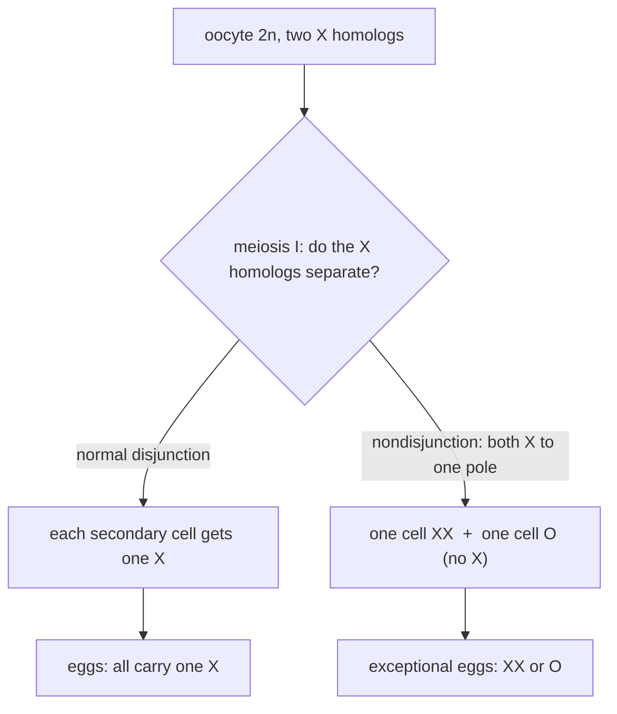
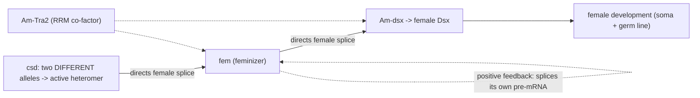
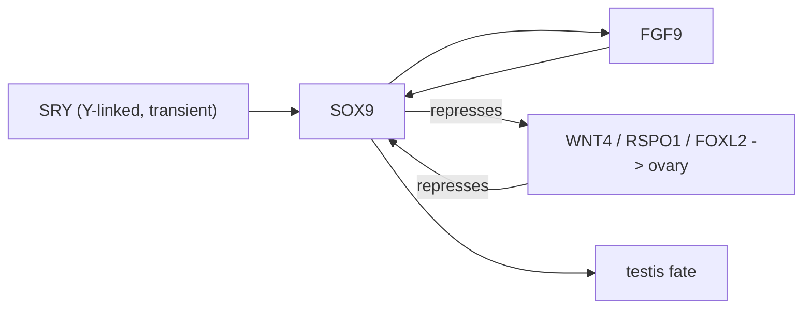
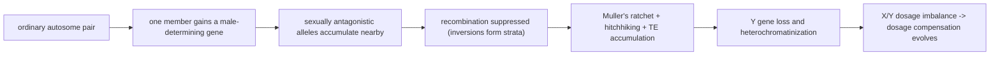

# Chromosomes & Sex Determination

**Course:** BME333 / BIO333 Genetics (UNIST, 2026 Fall) · Lecture 05 · ~60 min
**Syllabus:** [← Course schedule](../../lectures/2026.BME333-BIO333-Syllabus.md) — Week 03 Mon, 09-14
**Languages:** English · [한국어](../../ko/lectures/lec05_Chromosomes-Sex-Determination.md)

## Learning Objectives
By the end of this lecture, students should be able to:
- Explain the chromosome theory of heredity and cite the observational and genetic evidence that established it (Sutton, Boveri, Bridges).
- Relate meiotic chromosome behavior (segregation, independent assortment) to Mendel's laws.
- Describe how nondisjunction produces aneuploidy and how Bridges used it to prove genes reside on chromosomes.
- Compare the major sex-determination systems (XX/XY, ZZ/ZW, haplodiploidy, environmental) and explain why the mechanism is evolutionarily labile.
- Outline how sex chromosomes originate, degenerate, and drive dosage-compensation and gene-regulation adaptations.

## Lecture

### 1. From Mendel to chromosomes (~8 min)

Mendel's "factors" were an abstraction — he had no idea what physical thing carried them. The great synthesis of the early 1900s was realizing that his factors ride on **chromosomes**, the thread-like bodies that cytologists watched dividing under the microscope. The evidence for this was a *parallelism*: chromosomes behave in meiosis *exactly* as Mendel's laws require his factors to behave.

Recall the two cell divisions. **Mitosis** copies a cell faithfully: each daughter gets a full diploid (2n) set. **Meiosis** makes gametes and does two special things across its two divisions. In **meiosis I**, **homologous chromosomes** (the maternal and paternal copy of each pair) pair up and then *separate* to opposite poles — this is the **reductional division** that halves chromosome number from 2n to n. In **meiosis II**, sister chromatids separate (like a mitosis). The crucial point, first argued by Walter Sutton, is that when the homolog pairs (**bivalents**) line up at the meiosis-I equator, **each pair orients independently and at random** — maternal chromosome of pair 1 may face either pole regardless of which way pair 2 faces.

**Figure — Meiosis physically embodies Mendel's two laws.**

| Mendel's law (Lecture 03) | Meiotic behavior that produces it |
|---|---|
| **Segregation** — the two alleles separate, one per gamete | Homologous chromosomes separate at **meiosis I**; each gamete gets one homolog of each pair |
| **Independent assortment** — alleles of different genes assort independently | Different **bivalents orient at random** at the meiosis-I plate, independently of one another |
| Unlimited heritable variation | With **n** pairs, **2ⁿ** chromosomally distinct gametes are possible (Sutton's calculation) |

That last row is Sutton's own arithmetic: for humans (n = 23), independent assortment alone yields 2²³ ≈ 8.4 million gamete types, before recombination. Meiosis is the mechanism; Mendel's ratios are its statistical shadow.

### 2. The chromosome theory of heredity (~12 min)

The theory has two fathers who arrived independently. **Walter S. Sutton**, a graduate student in **Edmund B. Wilson's** laboratory at Columbia, studied spermatogenesis in the lubber grasshopper *Brachystola magna*. Remarkably, he states that he reached the paper's general conception *purely from cytology, before he knew Mendel's work* — which makes the convergence all the more compelling (see [en](../../en/article/Sutton1903_BiolBull_Chromosomes-Heredity.md) · [ko](../../ko/article/Sutton1903_BiolBull_Chromosomes-Heredity.md)). From five cytological observations — the germ-cell chromosomes form two equivalent (maternal and paternal) series; homologs pair by size at synapsis; the divisions separate the pairs; and each chromosome keeps its individuality across divisions — Sutton deduced that the **random orientation of bivalents** is the physical basis of both Mendelian laws. He went further than a restatement: citing Boveri, he argued each chromosome carries a *qualitatively distinct* set of hereditary potentials, and he **predicted genetic linkage** — that all the factors on one chromosome must be inherited together — a full decade before Morgan's group confirmed it.

The parallel, experimental case was built by **Theodor Boveri** (1862–1915), working with his collaborator and wife **Marcella O'Grady Boveri** on *Ascaris* worms and sea urchins (see [en](../../en/review/Satzinger2008_NatRevGenet_Boveri-Chromosomes.md) · [ko](../../ko/review/Satzinger2008_NatRevGenet_Boveri-Chromosomes.md)). Boveri's **1889 merogony experiment** — fertilizing an enucleated egg fragment with sperm of a *different* species and getting larvae with *paternal* traits — showed the nucleus, not the cytoplasm, carries heredity. His most elegant proof of **chromosomal individuality** was a **dispermy (polyspermy) experiment**: a sea-urchin egg fertilized by *two* sperm forms four centrosomes and two spindles, so chromosomes are parceled out *unequally* among the daughter cells. The resulting larvae were malformed in a pattern that matched a probability enumeration of the possible chromosome combinations — proving it was not the *amount* of chromatin but the *specific identity* of each of the 18 chromosomes that mattered. Boveri's 1904 monograph formalized what we now call the **Sutton–Boveri chromosome theory of heredity**. (He also proposed in 1914 that cancer arises from cells with chromosomal defects — a prescient hypothesis vindicated by modern cancer genomics.)

The theory was **not** immediately accepted — a recurring lesson in this course. **Thomas Hunt Morgan** himself resisted it for years, steeped in the **blending-inheritance** tradition and the empiricist "Entwicklungsmechanik" (developmental mechanics) philosophy that distrusted invisible particles (see [en](../../en/review/Benson2001_NatRevGenet_Morgan-Chromosome.md) · [ko](../../ko/review/Benson2001_NatRevGenet_Morgan-Chromosome.md)). Morgan famously complained he was "not in sympathy with all this modern way of referring everything to the chromosomes" and lived "in an atmosphere saturated with chromosomic acid and blue dyes." What converted him was his own **1910 discovery of the white-eye mutation** in *Drosophila*: its inheritance made sense *only* if the gene sat on the sex (X) chromosome. By 1915 Morgan, Sturtevant, Muller, and Bridges published *The Mechanism of Mendelian Heredity*, mapping genes onto chromosomes.

Even the founders made mistakes worth teaching. Hegreness and Meselson show that Sutton **misidentified which meiotic division is reductional** — he thought it was the second, when in fact **meiosis I** (homolog separation) is reductional (see [en](../../en/review/Hegreness2007_Genetics_Sutton+ChromosomeTheory.md) · [ko](../../ko/review/Hegreness2007_Genetics_Sutton+ChromosomeTheory.md)). **Eleanor Carothers** corrected this in **1913** by tracking *heteromorphic* (visibly unequal) bivalents through both divisions, yet the confusion persisted in textbooks into the 1930s. The chromosome theory was built by messy, iterative correction, not a single clean insight.

### 3. Genetic proof: nondisjunction (~12 min)

Correlation is not proof. Chromosomes and genes *behaved* alike, but skeptics could still say "the cell as a whole" transmits heredity. **Calvin B. Bridges** closed this gap in **1916**, in the *inaugural issue of the journal* Genetics, by exploiting an *error* in meiosis to nail a specific gene to a specific chromosome (see [en](../../en/article/Bridges1916_Genetics_NonDisjunction-SexChromosome.md) · [ko](../../ko/article/Bridges1916_Genetics_NonDisjunction-SexChromosome.md)).

The tool is **nondisjunction** — the failure of a chromosome pair to separate correctly. When the two X chromosomes of a *Drosophila* female fail to separate at meiosis I, she produces abnormal eggs: some carry **two X's (XX)**, others carry **no X (O)**.

**Figure — Normal disjunction vs. nondisjunction at meiosis I (an XX female germ cell).**

Now cross a **vermilion** (X-linked recessive) female that undergoes **primary nondisjunction** to a **wild-type male** (whose sperm carry either X or Y). The four fertilization outcomes are:

**Figure — Bridges' cross: exceptional offspring show reversed sex-linked inheritance.**

|  | **XX egg** (both mother's X) | **O egg** (no X) |
|---|---|---|
| **X sperm** (father's) | XXX — metafemale, usually dies | XO — **male, sterile** |
| **Y sperm** (father's) | XXY — **female, fertile** | OY — dies (no X at all) |

The prediction is startling and *opposite* to normal sex-linked inheritance: the surviving **XXY daughters carry only their mother's X's**, so they are **vermilion** (matroclinous — like the mother), while the **XO sons carry the father's X**, so they are **wild-type** (patroclinous — like the father). Bridges observed exactly this. Because these **exceptional** flies show a rigid identity between their *chromosome constitution* (verified cytologically) and their *sex-linked phenotype*, while their **autosomal** genes were inherited normally from both parents, the only possible conclusion is that the sex-linked genes *are physically on the X chromosome.* This is the "exception that proves the rule."

Bridges made it quantitative, too: the fertile **XXY females** produce further (**secondary**) nondisjunction at a rate of about **4.3%**, a number he *derived* from the frequency of X–Y pairing (heterosynapsis, ~16.5%) and confirmed across tens of thousands of flies. His work also produced the first systematic description of **sex-chromosome aneuploids** — the direct ancestor of human clinical cytogenetics.

### 4. Human chromosome number and karyotype (~6 min)

If chromosomes are that important, you would think we would have counted our own correctly. We did not — for over thirty years the textbook human number was **48**, established by Theophilus Painter in 1923 from poor paraffin sections (his own best preparations showed 46, but he deferred to expectation). It took until **1956** for **Joe Hin Tjio and Albert Levan** to get it right: **46** (see [en](../../en/review/Gartler2006_NatRevGenet_HumanChromosomeNumber.md) · [ko](../../ko/review/Gartler2006_NatRevGenet_HumanChromosomeNumber.md)). Their breakthrough was **technique**, not insight — **hypotonic shock** (swells cells and spreads chromosomes) plus **colchicine** (arrests cells in metaphase) gave "picture-perfect" spreads from cultured fetal cells; Ford and Hamerton independently confirmed 46 the same year. Gartler's lesson is a blend of genuine technical limitation and **cognitive bias ("preconception")** — authority suppressed a legitimate challenge for decades.

The correction was not academic. Within **three years** the new cytogenetics identified the chromosomal basis of major syndromes:

**Figure — Human aneuploidies discovered once the count was fixed (all via nondisjunction).**

| Karyotype | Condition | Sex-chromosome / autosome change |
|---|---|---|
| 47, +21 | **Down syndrome** (Lejeune 1959) | trisomy of autosome 21 |
| 45,X | **Turner syndrome** | single X (monosomy) |
| 47,XXY | **Klinefelter syndrome** | extra X in a male |
| 47,XYY | XYY | extra Y |

All arise by **nondisjunction** — the very mechanism Bridges dissected in flies — and medical cytogenetics (later chromosome **banding**, Caspersson, late 1960s) was born.

### 5. Sex-determination systems (~12 min)

Mammals make it tempting to think "male = Y chromosome" is universal. It is not. Across animals and plants, evolution has invented a startling **diversity** of ways to sort individuals into sexes — and it switches between them surprisingly often (see [en](../../en/review/Bachtrog2014_PLoSBiol_SexDetermination-ManyWays.md) · [ko](../../ko/review/Bachtrog2014_PLoSBiol_SexDetermination-ManyWays.md)).

**Figure — The major sex-determination systems.**

| System | Heterogametic sex | Primary trigger | Examples |
|---|---|---|---|
| **XX / XY** | male (XY) | Y-linked **SRY** (mammals); **X:autosome ratio** in *Drosophila* (its Y is *not* the switch) | mammals, fruit fly |
| **ZZ / ZW** | female (ZW) | **DMRT1** dosage on Z | birds, Lepidoptera, snakes |
| **Haplodiploidy / CSD** | (haploid males from unfertilized eggs) | **heterozygosity at the *csd* locus** | honeybee, ants, wasps |
| **Environmental (TSD/ESD)** | none | incubation **temperature** or social cues | all crocodiles, most turtles, many fish |
| **Polygenic** | variable | many small-effect loci, no master switch | zebrafish, some fish |

Bachtrog and colleagues demolish three "myths": that sex chromosomes are universal and stable (temperature and even *Wolbachia* bacteria override them in many species); that there is always a single master switch (the *silkworm* uses a W-derived piRNA, *Fem*, to silence the Z-linked *Masc*; zebrafish is polygenic); and that sex chromosomes inevitably degenerate (pythons ~140 Mya and ratite birds ~120 Mya keep ancient *homomorphic* sex chromosomes, nearly as old as the mammalian XY at ~180 Mya). Yet through all this diversity the **downstream** machinery is conserved: the **DM-domain (*doublesex/mab-3*) transcription factors** are a shared "toolkit" repeatedly rewired at the top.

**Case study — the honeybee's complementary sex determination (CSD).** In *Apis mellifera*, unfertilized (haploid) eggs *usually* become males and fertilized (diploid) eggs females — but ploidy is not the real signal. The real signal is **allelic composition** at a single locus, ***csd*** (complementary sex determiner): individuals **heterozygous** at *csd* become female; **hemizygous** (haploid) or **homozygous** (inbred diploid) individuals become male (see [en](../../en/article/Beye2003_Cell_Honeybee-SexDetermination.md) · [ko](../../ko/article/Beye2003_Cell_Honeybee-SexDetermination.md)). Beye et al. (2003) positionally cloned *csd*, showing it encodes an SR-type protein with a **hypervariable region** that lets alleles "recognize" whether two *different* copies are present; RNAi knockdown of *csd* turned 92% of genetic females into males. The pathway was then completed by later papers in the series:

**Figure — The honeybee csd → fem → dsx cascade.**

- **Hasselmann et al. (2008)** found ***fem*** just 12 kb upstream and showed *csd* arose by **gene duplication of *fem*** within the honeybee lineage (after the split from stingless/bumble bees ~70 Mya, before *Apis* species diverged ~10 Mya), then diverged under **strong positive selection** — a clean example of a *new* top-of-cascade gene being built from an old one (see [en](../../en/article/Hasselmann2008_Nature_Honeybee-SexDetermination.md) · [ko](../../ko/article/Hasselmann2008_Nature_Honeybee-SexDetermination.md)).
- **Gempe et al. (2009)** separated **induction** (heterozygous CSD triggers female *fem* splicing) from **maintenance** (Fem protein splices *its own* transcript in a **positive feedback loop**, locking in female fate after *csd* falls silent). Male splicing is the **default** requiring no signal (see [en](../../en/article/Gempe2009_PLoSBiol_Honeybee-SexDetermination.md) · [ko](../../ko/article/Gempe2009_PLoSBiol_Honeybee-SexDetermination.md)).
- **Nissen et al. (2012)** identified the missing RNA-binding co-factor, **Am-Tra2** (CSD and Fem lack an RRM), needed for female splicing of both *fem* and *Am-dsx* (see [en](../../en/article/Nissen2012_Genetics_Honeybee-SexDetermination.md) · [ko](../../ko/article/Nissen2012_Genetics_Honeybee-SexDetermination.md)).

**Case study — the vertebrate gonad as a bistable switch.** In vertebrates the early gonad is **bipotential** — it can become testis *or* ovary. Alfred Jost's classic rabbit gonadectomy experiments showed that primary sex determination is the *gonad* decision, which then drives everything else via hormones (see [en](../../en/review/Capel2017_NatRevGenet_VertebrateSexDetermination.md) · [ko](../../ko/review/Capel2017_NatRevGenet_VertebrateSexDetermination.md)). In mammals the Y-linked **SRY** tips the balance by activating **SOX9**, which forms a self-reinforcing loop with **FGF9** while *repressing* the female network (**WNT4 / RSPO1 / FOXL2**). The two networks mutually antagonize until one wins — a **bistable** switch.

**Figure — Mutual antagonism in the mammalian gonad decision.**

This same threshold logic explains the system's **plasticity**: gecko surveys found at least **25 evolutionary transitions** among XX/XY, ZZ/ZW, and TSD; in the dragon *Pogona vitticeps*, a single generation at high incubation temperature can eliminate the W chromosome and flip a genetic (GSD) population to temperature-dependent (TSD) sex — a stark climate-change warning. Fish are the champions of flexibility: **sequential hermaphroditism** (adult sex change) has evolved independently in at least **27 teleost families**, and even in adult mammals the decision must be *actively maintained* — deleting *Dmrt1* in adult testis cells derepresses *Foxl2* and partially transdifferentiates testis toward ovary (and vice versa).

### 6. Sex-chromosome evolution & dosage (~10 min)

Where do heteromorphic sex chromosomes (a big X, a stunted Y) come from, and why is the Y so gene-poor? The canonical model is a life cycle of decay (see [en](../../en/review/Bachtrog2013_NatRevGenet_Y-chromosomeEvolution.md) · [ko](../../ko/review/Bachtrog2013_NatRevGenet_Y-chromosomeEvolution.md)):

**Figure — The birth and degeneration of a Y chromosome.**

Once a male-determining gene appears, **sexually antagonistic** alleles (good for males, bad for females) accumulate near it and favor **suppression of recombination** between proto-X and proto-Y. A non-recombining Y is then prey to three population-genetic forces: **Muller's ratchet** (irreversible mutation accumulation in a finite non-recombining region), **genetic hitchhiking**, and the **"ruby-in-the-rubbish"** effect (good mutations lost because chained to bad ones). The result is dramatic gene loss: the human Y has only ~**78** protein-coding genes versus ~**800** on the X; *Drosophila*'s Y has just ~**13**. Comparative "neo-Y" chromosomes of different ages (*D. albomicans* ~0.1 Mya, *D. miranda* ~1 Mya, *D. pseudoobscura* ~15 Mya) let us watch this in near-real time — and reveal that **transcriptional silencing can precede coding-sequence decay** (~30% of *D. albomicans* neo-Y genes are already downregulated with little sequence damage). Shaw and White's **"degeneration by regulatory evolution" (DRE)** model formalizes this: *cis*-regulatory mutations, transposable-element/heterochromatin spread, and DNA methylation lower Y expression *first*, which then relaxes selection on the coding sequence (see [en](../../en/review/ShawWhite2022_TrendsGenet_SexChromosome-GeneRegulation.md) · [ko](../../ko/review/ShawWhite2022_TrendsGenet_SexChromosome-GeneRegulation.md)).

Importantly, decay is **not** a one-way ticket to extinction: theory predicts gene loss *decelerates* as the Y empties, and the human Y has been **stable for ~25 million years** — the popular "the Y is disappearing" headline is not supported. Plant Y chromosomes (e.g. *Silene latifolia*, >80% of Y genes still functional) degenerate more slowly, probably because **haploid selection in pollen** exposes deleterious alleles. Furman et al. stress that the "clean" linear model is riddled with informative **exceptions** — B chromosomes co-opted as Y's, *Wolbachia*-derived W's, inversions that *follow* rather than *cause* recombination suppression, and frequent **turnover** — so the process is better seen as a cyclical birth–death than a straight line (see [en](../../en/review/Furman2020_GBE_SexChromosome-ManyExceptions.md) · [ko](../../ko/review/Furman2020_GBE_SexChromosome-ManyExceptions.md)).

Losing Y genes creates a **dosage problem**: XX females would otherwise make twice the X-gene product of XY males. Solutions are diverse (see [en](../../en/review/Graves2015_NatRevGenet_SexChromosome-Evolution.md) · [ko](../../ko/review/Graves2015_NatRevGenet_SexChromosome-Evolution.md)): eutherian mammals silence one entire X via the **XIST lncRNA** (nearly chromosome-wide, near-complete); marsupials use a convergent, unrelated lncRNA **RSX** for a partial, always-paternal inactivation; monotremes (five X's!) barely compensate globally; birds compensate only partially and **gene-by-gene** (ZZ males express Z genes ~30–40% higher than ZW females, except near the *MHM* locus). Jennifer Graves calls this patchwork **"dumb design"** — senseless as engineering, sensible only as evolutionary history.

Finally, sex chromosomes tie back to **speciation**. **Haldane's Rule (1922)** states that when one sex of a species hybrid is absent, rare, or sterile, it is the **heterogametic** sex — hybrid *males* suffer in mammals/*Drosophila* (XY), hybrid *females* in birds/butterflies (ZW) (see [en](../../en/review/Laurie1997_Genetics_Haldane+Heterogametic.md) · [ko](../../ko/review/Laurie1997_Genetics_Haldane+Heterogametic.md)). The leading explanations are the **dominance theory** (Muller 1942; Orr–Turelli 1995: X-linked incompatibilities are partly recessive, so the hemizygous heterogametic sex is unbuffered) and the **faster-male theory** (Wu–Davis 1993: hybrid male sterility factors evolve ~10× faster, driven by sexual selection and the peculiarities of spermatogenesis). Both connect sex-chromosome biology to the **Dobzhansky–Muller incompatibilities** that build reproductive barriers — a bridge to the population- and speciation-genetics later in the course.

## Key Takeaways
- **Meiosis is the mechanism behind Mendel's laws:** homolog separation at meiosis I = segregation; random bivalent orientation = independent assortment; **n** pairs give **2ⁿ** gamete types.
- The **Sutton–Boveri chromosome theory** (1902–1904) rested on cytological *parallelism* and Boveri's dispermy proof of **chromosomal individuality**; even Morgan resisted it until his **1910 white-eye** X-linked result. Sutton wrongly thought meiosis II was reductional; Carothers (1913) corrected it.
- **Bridges (1916)** used **X nondisjunction** in *Drosophila* (matroclinous XXY daughters, patroclinous XO sons) to prove genes physically reside on chromosomes — the "exception that proves the rule," and the origin of human aneuploidy science (45,X, 47,XXY, 47,+21).
- The **human chromosome number** was wrong (48) for 30+ years until Tjio & Levan (1956) got **46** using hypotonic shock + colchicine — a lesson in technique and preconception.
- **Sex determination is diverse and labile:** XX/XY (SRY), ZZ/ZW (DMRT1), haplodiploid **CSD** (honeybee *csd → fem → Am-dsx*, with *csd* newly duplicated from *fem*), and temperature/environmental systems, all feeding a conserved **doublesex/DM** toolkit and a **bistable** gonad switch (SOX9/FGF9 vs. WNT4/FOXL2).
- **Y chromosomes degenerate** after recombination suppression (Muller's ratchet, hitchhiking, TEs; regulatory decay can precede coding decay), creating **dosage-compensation** solutions (XIST, RSX, partial bird compensation). The human Y is *stable*, not vanishing. **Haldane's Rule** links heterogamety to hybrid dysfunction and speciation.

## Textbook Reading
- **Genetics: From Genes to Genomes (8e)** — Ch. 3 Chromosomes & Inheritance; Ch. 4 Sex Chromosomes. → [textbook ref](../../lectures/ref.Genetics-FromGenesToGenomes.md)

## Notes in this vault
Reviews & articles to introduce in class (each has a bilingual en/ko pair):
- `Sutton1903_BiolBull_Chromosomes-Heredity` — the founding paper proposing chromosomes as the physical basis of Mendelian heredity. · [en](../../en/article/Sutton1903_BiolBull_Chromosomes-Heredity.md) · [ko](../../ko/article/Sutton1903_BiolBull_Chromosomes-Heredity.md)
- `Hegreness2007_Genetics_Sutton+ChromosomeTheory` — retrospective on how Sutton built the chromosome theory; good for the historical-reasoning discussion. · [en](../../en/review/Hegreness2007_Genetics_Sutton+ChromosomeTheory.md) · [ko](../../ko/review/Hegreness2007_Genetics_Sutton+ChromosomeTheory.md)
- `Satzinger2008_NatRevGenet_Boveri-Chromosomes` — Boveri's parallel contribution and the individuality of chromosomes. · [en](../../en/review/Satzinger2008_NatRevGenet_Boveri-Chromosomes.md) · [ko](../../ko/review/Satzinger2008_NatRevGenet_Boveri-Chromosomes.md)
- `Benson2001_NatRevGenet_Morgan-Chromosome` — Morgan's *Drosophila* school and how sex-linkage cemented the theory. · [en](../../en/review/Benson2001_NatRevGenet_Morgan-Chromosome.md) · [ko](../../ko/review/Benson2001_NatRevGenet_Morgan-Chromosome.md)
- `Bridges1916_Genetics_NonDisjunction-SexChromosome` — the classic nondisjunction proof that genes are carried on chromosomes. · [en](../../en/article/Bridges1916_Genetics_NonDisjunction-SexChromosome.md) · [ko](../../ko/article/Bridges1916_Genetics_NonDisjunction-SexChromosome.md)
- `Gartler2006_NatRevGenet_HumanChromosomeNumber` — cautionary tale on the human chromosome count; how expectation biased observation. · [en](../../en/review/Gartler2006_NatRevGenet_HumanChromosomeNumber.md) · [ko](../../ko/review/Gartler2006_NatRevGenet_HumanChromosomeNumber.md)
- `Bachtrog2014_PLoSBiol_SexDetermination-ManyWays` — panoramic survey of sex-determination mechanisms across the tree of life. · [en](../../en/review/Bachtrog2014_PLoSBiol_SexDetermination-ManyWays.md) · [ko](../../ko/review/Bachtrog2014_PLoSBiol_SexDetermination-ManyWays.md)
- `Capel2017_NatRevGenet_VertebrateSexDetermination` — molecular logic of the vertebrate gonad decision (SRY/Sox9 vs. Foxl2). · [en](../../en/review/Capel2017_NatRevGenet_VertebrateSexDetermination.md) · [ko](../../ko/review/Capel2017_NatRevGenet_VertebrateSexDetermination.md)
- `Bachtrog2013_NatRevGenet_Y-chromosomeEvolution` — why Y chromosomes decay after recombination is suppressed. · [en](../../en/review/Bachtrog2013_NatRevGenet_Y-chromosomeEvolution.md) · [ko](../../ko/review/Bachtrog2013_NatRevGenet_Y-chromosomeEvolution.md)
- `Graves2015_NatRevGenet_SexChromosome-Evolution` — evolution and turnover of sex chromosomes; mammalian Y in comparative view. · [en](../../en/review/Graves2015_NatRevGenet_SexChromosome-Evolution.md) · [ko](../../ko/review/Graves2015_NatRevGenet_SexChromosome-Evolution.md)
- `Furman2020_GBE_SexChromosome-ManyExceptions` — the many exceptions to canonical sex-chromosome models. · [en](../../en/review/Furman2020_GBE_SexChromosome-ManyExceptions.md) · [ko](../../ko/review/Furman2020_GBE_SexChromosome-ManyExceptions.md)
- `ShawWhite2022_TrendsGenet_SexChromosome-GeneRegulation` — how sex chromosomes reshape gene regulation and dosage. · [en](../../en/review/ShawWhite2022_TrendsGenet_SexChromosome-GeneRegulation.md) · [ko](../../ko/review/ShawWhite2022_TrendsGenet_SexChromosome-GeneRegulation.md)
- `Beye2003_Cell_Honeybee-SexDetermination` — identification of the honeybee *csd* complementary sex-determiner. · [en](../../en/article/Beye2003_Cell_Honeybee-SexDetermination.md) · [ko](../../ko/article/Beye2003_Cell_Honeybee-SexDetermination.md)
- `Gempe2009_PLoSBiol_Honeybee-SexDetermination` — the *csd → fem → dsx* regulatory cascade in bees. · [en](../../en/article/Gempe2009_PLoSBiol_Honeybee-SexDetermination.md) · [ko](../../ko/article/Gempe2009_PLoSBiol_Honeybee-SexDetermination.md)
- `Hasselmann2008_Nature_Honeybee-SexDetermination` — evolution of the complementary sex-determination locus. · [en](../../en/article/Hasselmann2008_Nature_Honeybee-SexDetermination.md) · [ko](../../ko/article/Hasselmann2008_Nature_Honeybee-SexDetermination.md)
- `Nissen2012_Genetics_Honeybee-SexDetermination` — genetic dissection of *csd* allele diversity and function. · [en](../../en/article/Nissen2012_Genetics_Honeybee-SexDetermination.md) · [ko](../../ko/article/Nissen2012_Genetics_Honeybee-SexDetermination.md)
- `Laurie1997_Genetics_Haldane+Heterogametic` — Haldane's rule and the heterogametic sex; links sex chromosomes to hybrid inviability/sterility. · [en](../../en/review/Laurie1997_Genetics_Haldane+Heterogametic.md) · [ko](../../ko/review/Laurie1997_Genetics_Haldane+Heterogametic.md)

## Discussion Questions
1. Chromosome behavior in meiosis "parallels" Mendel's laws. Map segregation and independent assortment onto specific meiotic events, and explain why Sutton's misidentification of the reductional division (corrected by Carothers) did not invalidate his overall argument.
2. Bridges called nondisjunction "the exception that proves the rule." Draw the vermilion-female × wild-type-male cross, explain why XXY daughters are matroclinous and XO sons patroclinous, and argue precisely why this rules out the "cell as a whole" alternative to the chromosome theory.
3. The honeybee determines sex by *allelic composition* at *csd*, not by chromosome dosage or a Y-linked gene. Contrast this with mammalian SRY and *Drosophila* X:A. What does the origin of *csd* by duplication from *fem* (under positive selection) teach about how new sex-determining genes arise?
4. Sex-determination mechanisms turn over rapidly (25+ transitions in geckos; single-generation GSD→TSD in *Pogona*) while the downstream *doublesex/DM* toolkit is conserved. Why might the top of the cascade be evolutionarily labile while the bottom is conserved?
5. Popular science claims the human Y chromosome is "disappearing." Using Muller's ratchet, the deceleration of gene loss, the DRE model, and the 25-million-year stability data, evaluate this claim. How do dosage-compensation systems (XIST, RSX, partial bird compensation) illustrate Graves' phrase "dumb design"?
