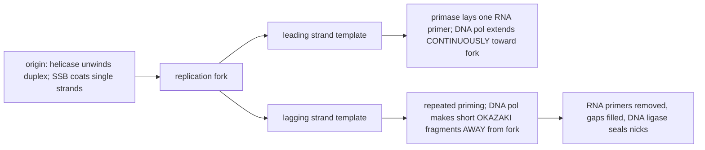
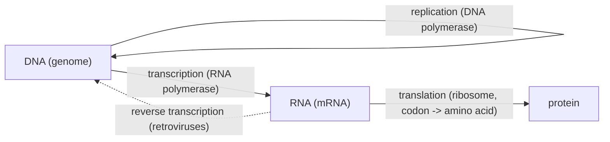
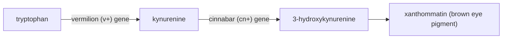

# Central Dogma, DNA Structure & Replication

**Course:** BME333 / BIO333 Genetics (UNIST, 2026 Fall) · Lecture 06 · ~60 min
**Syllabus:** [← Course schedule](../../lectures/2026.BME333-BIO333-Syllabus.md) — Week 03 Wed, 09-16
**Languages:** English · [한국어](../../ko/lectures/lec06_Central-Dogma-DNA-Structure-Replication.md)

## Learning Objectives
By the end of this lecture, students should be able to:
- Summarize the experimental evidence that DNA, not protein, is the hereditary material (Avery–MacLeod–McCarty; Hershey–Chase).
- Describe the Watson–Crick double helix and how base-pairing/antiparallel structure implies a copying mechanism.
- Explain semiconservative replication and the roles of the core replication machinery (helicase, primase, polymerase, ligase; leading vs. lagging strand).
- State the central dogma (DNA → RNA → protein) and the one-gene–one-enzyme concept with its historical evidence.
- Connect genotype to phenotype through the biochemical-genetics pathway logic (Neurospora, tryptophan synthase).

### 1. What is the genetic material? (~12 min)

By the 1930s biologists were sure genes rode on chromosomes (Lecture 05), but chromosomes are made of *two* kinds of molecule — **protein** and **DNA (deoxyribonucleic acid)** — and almost everyone bet on protein. Proteins are built from 20 different amino acids and seemed rich enough to encode life's complexity; DNA was thought to be a boring, repetitive **"tetranucleotide"** (a monotonous ...ATGC-ATGC... polymer) — an unlikely carrier of information. Overturning that intuition took three experiments.

**Figure — Three experiments that identified DNA as the hereditary material.**

| Experiment | Year | Design | Conclusion |
|---|---|---|---|
| **Griffith — transformation** | 1928 | Heat-killed virulent (smooth, S) pneumococci + live harmless (rough, R) cells → live *virulent* S cells appear | Some "transforming principle" passes heritable virulence between cells |
| **Avery, MacLeod & McCarty** | 1944 | Purify the transforming principle; destroy it with protease, RNase, or **DNase** in turn | Only **DNase** abolishes transformation → the transforming principle is **DNA** |
| **Hershey & Chase** | 1952 | Label phage protein with ³⁵S and phage DNA with ³²P; infect bacteria; blend and spin | Only ³²P (**DNA**) enters the cell to direct new phage → DNA is the genetic material |

The **Avery–MacLeod–McCarty (1944)** paper is the hinge. Joshua Lederberg, who read it as an undergraduate, later called it the opening of the "molecular phase" of genetics; his own notes at the time read *"unlimited in its implications."* Their argument had three tiers: pneumococci have heritable capsular traits; those traits transfer via a cell-free extract (**transformation**); and the chemical carrier is DNA *to the exclusion of protein* (see [en](../../en/review/Lederberg1994_Genetics_AveryMacLeodMcCarty.md) · [ko](../../ko/review/Lederberg1994_Genetics_AveryMacLeodMcCarty.md)). Yet the paper was **not** instantly accepted — Alfred Mirsky and others, anchored to the tetranucleotide view, doubted that trace protein contamination had really been excluded. Lederberg argues this skepticism was *good science*, not obstruction: it spurred Chargaff's base-composition work, the Hershey–Chase experiment, and ultimately Watson and Crick. (He notes the paper drew ~300 citations in 1945–54, so unlike Mendel it was not "premature" — merely contested. Avery died in 1955 without the Nobel Prize, a famous omission.)

### 2. DNA structure (~12 min)

Knowing DNA is the genetic material immediately raised the question: what *structure* lets one molecule both **store** information and **copy** it faithfully? Two clues converged in 1953.

**Chargaff's rules (1950).** Erwin Chargaff measured base composition across species and found a hidden regularity: the amount of **adenine equals thymine**, and **guanine equals cytosine**, so purines always equal pyrimidines — even though the overall A+T vs. G+C content varies between species.

**Figure — Chargaff's base-pairing regularities.**

| Rule | Statement | Structural meaning (in hindsight) |
|---|---|---|
| %A = %T | adenine equals thymine | A pairs with T |
| %G = %C | guanine equals cytosine | G pairs with C |
| purines = pyrimidines | (A+G) = (T+C) | one purine faces one pyrimidine across the helix |
| A+T : G+C varies by species | base *ratio* is species-specific | composition can carry information |

Add **Rosalind Franklin's** X-ray diffraction images (the famous "Photo 51"), which showed DNA is a **helix** of regular diameter, and **James Watson and Francis Crick (1953)** could assemble the model: two sugar-phosphate backbones wound into a **double helix**, running **antiparallel** (one strand 5′→3′, the other 3′→5′), with the bases paired *inside* by hydrogen bonds — **A with T (two H-bonds), G with C (three H-bonds)**. This explains Chargaff exactly: every rung is a purine–pyrimidine pair.

**Figure — Antiparallel strands and complementary base pairing.**
```
   5' ---A === T--- 3'          A = T   (2 hydrogen bonds)
        |       |               G === C (3 hydrogen bonds)
        T === A                 each strand is the TEMPLATE for the other
        |       |
        G ===== C
        |       |
        C ===== G
   3' ---T === A--- 5'
        (antiparallel: 5'->3' on the left, 3'->5' on the right)
```

The structure's most celebrated feature is its understatement, in Watson and Crick's words, that the specific pairing "immediately suggests a possible copying mechanism." Because each base dictates its partner, **each strand is a complete template for rebuilding the other.** Separate the strands, pair free nucleotides against each one, and you get two identical daughter helices. Structure *implied* mechanism — the subject of the next segment.

### 3. Semiconservative replication (~12 min)

The base-pairing logic allows three ways to copy DNA: **semiconservative** (each daughter = one old strand + one new), **conservative** (the old duplex stays intact, a wholly new duplex is made), or **dispersive** (strands are patchworks of old and new). **Matthew Meselson and Franklin Stahl (1958)** decided among them with an experiment often called "the most beautiful in biology." They grew *E. coli* for many generations in heavy-nitrogen (**¹⁵N**) medium so all DNA was dense, then switched cells to normal **¹⁴N** and sampled at each generation, separating DNA by density in a CsCl gradient.

**Figure — The Meselson–Stahl result (density of DNA per generation).**
```
Generation 0 (all 15N)   [======== HEAVY ========]
Generation 1             [==== HYBRID (15N/14N) ====]     -> rules out CONSERVATIVE
Generation 2      [= LIGHT =]        [==== HYBRID ====]   -> 1 light : 1 hybrid
```
After **one** round every molecule was a single **hybrid** band — killing the conservative model (which predicts one heavy + one light band). After **two** rounds, half the DNA was hybrid and half was light — exactly the **semiconservative** prediction. Replication conserves *one* parental strand per daughter duplex.

Mechanistically, copying happens at a **replication fork**, run by a cast of enzymes each with one job. DNA polymerase can only add nucleotides to an existing 3′ end and only synthesizes **5′→3′**, which forces an asymmetry between the two template strands.

**Figure — The replication fork and its enzymes.**


Step by step: **helicase** unwinds the double helix; **single-strand binding (SSB) proteins** keep the strands apart; **primase** lays down a short RNA **primer** to give polymerase a 3′ end to start from; **DNA polymerase** extends the primer, synthesizing the **leading strand** continuously toward the fork and the **lagging strand** in short pieces (**Okazaki fragments**) pointing away from the fork; finally the RNA primers are removed, the gaps filled with DNA, and **DNA ligase** seals the remaining nicks. Fidelity is remarkable — DNA polymerase **proofreads** with a 3′→5′ exonuclease that removes misincorporated bases, keeping error rates near one in 10⁹ — which is why heredity is *particulate and stable* rather than blending (a callback to Lecture 03).

### 4. The central dogma (~10 min)

DNA stores and copies information; but information must also be *used*. Crick's **central dogma** states the normal direction of information flow: **DNA → RNA → protein.** DNA is **transcribed** (by RNA polymerase) into **messenger RNA (mRNA)**, which is **translated** (by the ribosome, reading three-base **codons**) into a chain of amino acids that folds into a protein. "**Gene expression**" is exactly this two-step conversion of a DNA sequence into a functional product.

**Figure — The central dogma of molecular biology.**

The dotted arrow is the famous exception: **retroviruses** use **reverse transcriptase** to copy RNA back into DNA, integrating into the host genome — one reason the "one-way" dogma needed qualification.

This is a good moment to complicate the very word **genome**. The intuitive NIH definition — "an organism's complete set of DNA... all the information needed to build and maintain that organism" — is, as Goldman and Landweber argue, both oversimplified and self-contradictory (see [en](../../en/review/Goldman2016_PLoSgenet_WhatIsGenome.md) · [ko](../../ko/review/Goldman2016_PLoSgenet_WhatIsGenome.md)). Their evidence is striking: retroviruses cease to exist as a separate physical molecule once integrated; the ciliate **Oxytricha** keeps a scrambled **germline genome (~1 Gb, ~250,000 gene segments)** and unscrambles it into a **somatic** genome of ~16,000 tiny "nanochromosomes" (only 5–10% of the germline) using **RNA templates** — so information flows DNA → RNA → DNA *across generations*; and a synthetic *Mycoplasma* genome existed first as a **computer file** before being re-instantiated as DNA. Add epigenetic inheritance and GWAS "missing heritability," and the genome is better seen as an **informational entity** — usually, but not always, DNA — that specifies *possibilities* realized together with other information. This reframing prepares students for gene regulation and epigenetics later in the course.

### 5. One gene–one enzyme (~14 min)

The central dogma says a gene specifies a protein — but *how many* proteins per gene, and how is genotype connected to the *phenotype* an organism actually shows? The answer is **biochemical genetics**: genes act by specifying **enzymes** that catalyze specific steps in metabolic **pathways**.

The idea began with **George Beadle and Boris Ephrussi (1936)**, who transplanted eye-disc tissue between *Drosophila* larvae and found that two eye-color mutants, **vermilion** and **cinnabar**, were *non-autonomous* — a mutant disc could be rescued by a diffusible substance made elsewhere in a host of different genotype (see [en](../../en/review/Horowitz1996_Genetics_BiochemGenetics.md) · [ko](../../ko/review/Horowitz1996_Genetics_BiochemGenetics.md)). Those substances turned out to be **intermediates of a biosynthetic pathway**, with each gene controlling one step:

**Figure — The Drosophila eye-pigment pathway (each gene = one step).**

The *v⁺* substance was identified as **kynurenine** (Butenandt 1940; confirmed by Tatum), the *cn⁺* substance as **3-hydroxykynurenine** — the first genetically defined metabolic intermediates.

**Beadle and Tatum (1941)** turned this insight into a *general method* using the mold **Neurospora crassa**, a "revolution" that Horowitz says "changed the genetic landscape for all time" (see [en](../../en/review/Horowitz1991_Genetics_Neurospora-Revolution.md) · [ko](../../ko/review/Horowitz1991_Genetics_Neurospora-Revolution.md)). *Neurospora* is ideal: it grows on a **chemically defined minimal medium**, and its entire meiotic tetrad can be recovered. Their trick was to recover otherwise-lethal metabolic mutations as **nutritional requirements (auxotrophy)**: X-ray a spore, then find mutants that grow on *complete* medium but *not* on minimal medium — meaning they can no longer synthesize something essential. Their first three such mutants each needed a *different* supplement (pyridoxine, thiamine, p-aminobenzoic acid), each inherited as a **single gene** (the pyridoxineless mutant No. 299 was the breakthrough). The logic that orders a pathway is elegant: a mutant blocked at an *early* step can be rescued by *any* later intermediate, while a mutant blocked *late* is rescued *only* by the final product.

**Figure — Reading pathway order from growth tests (schematic auxotroph screen).**

| Supplement added to minimal medium → | (none) | intermediate B | intermediate C | end product D |
|---|---|---|---|---|
| **mutant blocked before B** | no growth | **grows** | **grows** | **grows** |
| **mutant blocked B→C** | no growth | no growth | **grows** | **grows** |
| **mutant blocked C→D** | no growth | no growth | no growth | **grows** |

The pattern of "grows / no growth" places each gene at a specific step: *the more supplements that rescue a mutant, the earlier its block.* This gave the **one gene–one enzyme hypothesis** (Nobel Prize 1958) — later refined to **one gene–one polypeptide** once proteins with multiple subunits were understood. Horowitz is careful about credit: Archibald Garrod's *Inborn Errors of Metabolism* (1909) prefigured the idea, but Garrod could not have held the one-gene–one-enzyme concept — in 1909 the word "gene" had just been coined and enzymes were not even known to be proteins (Sumner crystallized urease only in 1926).

The final proof that a gene and its protein correspond *residue by residue* — **colinearity** — came from **Charles Yanofsky's** work on **tryptophan synthase** (see [en](../../en/review/Yanofsky2005_Genetics_TryptophanSynthase-OneGeneOneEnzyme.md) · [ko](../../ko/review/Yanofsky2005_Genetics_TryptophanSynthase-OneGeneOneEnzyme.md)). Yanofsky recalls that in 1951 the believers in one-gene–one-enzyme "could be counted on the fingers of one hand"; a cascade of 1950s discoveries — Avery, Hershey–Chase, Watson–Crick, Meselson–Stahl, Sanger's linear insulin sequence, Benzer's fine-structure mapping, and Ingram's single-amino-acid sickle-cell change — reframed the question as whether the *sequence* of the gene matches the *sequence* of the protein. Working in *E. coli*, Yanofsky's group built a **fine-structure genetic map** of the *trpA* gene and separately **sequenced the mutant proteins**, showing by **1964** that the **order of mutation sites on the map matched the order of altered amino acids in the protein.**

**Figure — Colinearity of gene and protein (Yanofsky, trpA).**
```
gene trpA:      5'--[site1]----[site2]--------[site3]----[site4]--3'
                     |           |             |          |
protein TrpA:   N ---aa'1--------aa'2----------aa'3-------aa'4---- C
   RESULT: the LINEAR ORDER of mutable sites on the gene ==
           the LINEAR ORDER of the amino-acid changes in the protein
```
The complete TrpA amino-acid sequence (1967) and the *trpA* DNA sequence (1979) confirmed the genetic conclusions exactly, and Sarabhai, Brenner, and colleagues reached the same result independently with phage T4 head protein. Colinearity is the molecular capstone of classical genetics: it is *why* we can predict a protein sequence from a DNA sequence, engineer point mutations, and interpret missense variants in genomic medicine — the foundation of everything that follows.

## Key Takeaways
- **DNA is the genetic material:** Griffith's transformation (1928) → Avery–MacLeod–McCarty's DNase test (1944) → Hershey–Chase's ³²P/³⁵S phage experiment (1952). Acceptance was gradual and *contested* (the tetranucleotide prejudice), not instant.
- **Structure implies mechanism:** Chargaff's rules (%A=%T, %G=%C) + Franklin's diffraction gave Watson–Crick's **antiparallel double helix** with **A–T / G–C** base pairing; each strand templates the other.
- **Replication is semiconservative** (Meselson–Stahl: hybrid band after 1 generation, 1 hybrid : 1 light after 2). The fork uses **helicase, SSB, primase, DNA polymerase (leading continuous / lagging Okazaki fragments), and ligase**, with proofreading for high fidelity.
- **Central dogma:** DNA → RNA → protein (transcription, then translation of codons); reverse transcription is the retroviral exception. The "genome" is best understood as an **informational entity**, not simply a fixed DNA molecule (Oxytricha, synthetic genomes).
- **Biochemical genetics maps genotype to phenotype:** Beadle–Ephrussi's *Drosophila* eye-pigment pathway and Beadle–Tatum's *Neurospora* auxotrophs gave **one gene–one enzyme** (→ one polypeptide); Yanofsky's tryptophan-synthase work proved **gene–protein colinearity**.

## Textbook Reading
- **Genetics: From Genes to Genomes (8e)** — Ch. 6 DNA Structure, Replication & Recombination; Ch. 9 Gene Expression (DNA→RNA→Protein). → [textbook ref](../../lectures/ref.Genetics-FromGenesToGenomes.md)

## Notes in this vault
Reviews & articles to introduce in class (each has a bilingual en/ko pair):
- `Lederberg1994_Genetics_AveryMacLeodMcCarty` — Lederberg's appraisal of the Avery experiment that identified DNA as the transforming principle. · [en](../../en/review/Lederberg1994_Genetics_AveryMacLeodMcCarty.md) · [ko](../../ko/review/Lederberg1994_Genetics_AveryMacLeodMcCarty.md)
- `Goldman2016_PLoSgenet_WhatIsGenome` — frames "what a genome is," useful for grounding the central-dogma / information view. · [en](../../en/review/Goldman2016_PLoSgenet_WhatIsGenome.md) · [ko](../../ko/review/Goldman2016_PLoSgenet_WhatIsGenome.md)
- `Yanofsky2005_Genetics_TryptophanSynthase-OneGeneOneEnzyme` — colinearity of gene and protein; the molecular capstone of one-gene–one-enzyme. · [en](../../en/review/Yanofsky2005_Genetics_TryptophanSynthase-OneGeneOneEnzyme.md) · [ko](../../ko/review/Yanofsky2005_Genetics_TryptophanSynthase-OneGeneOneEnzyme.md)
- `Horowitz1996_Genetics_BiochemGenetics` — history of biochemical genetics and how metabolic pathways were dissected. · [en](../../en/review/Horowitz1996_Genetics_BiochemGenetics.md) · [ko](../../ko/review/Horowitz1996_Genetics_BiochemGenetics.md)
- `Horowitz1991_Genetics_Neurospora-Revolution` — the *Neurospora* revolution and the Beadle–Tatum one-gene–one-enzyme hypothesis. · [en](../../en/review/Horowitz1991_Genetics_Neurospora-Revolution.md) · [ko](../../ko/review/Horowitz1991_Genetics_Neurospora-Revolution.md)

## Discussion Questions
1. The tetranucleotide hypothesis made most biologists bet on protein, not DNA, as the genetic material. Trace how Griffith → Avery–MacLeod–McCarty → Hershey–Chase progressively excluded protein, and explain why Lederberg calls the initial skepticism "good science" rather than obstruction.
2. Watson and Crick wrote that base pairing "immediately suggests a possible copying mechanism." Explain precisely how antiparallel, complementary strands make semiconservative replication possible, and how Meselson–Stahl's density-gradient bands distinguished it from conservative and dispersive models.
3. DNA polymerase only synthesizes 5′→3′ and needs a primer. Show how these two constraints force the leading/lagging-strand asymmetry, and name the enzyme that solves each problem at the fork (unwinding, priming, joining Okazaki fragments, proofreading).
4. Using the *Neurospora* auxotroph growth-test logic, explain how you would order three enzymes in a biosynthetic pathway given a set of mutants and candidate intermediates. Why was recovering lethal metabolic defects as *nutritional requirements* such a powerful methodological advance?
5. Goldman and Landweber argue the standard definition of "genome" is oversimplified. Using retroviruses, Oxytricha's germline/somatic rearrangement, and synthetic genomes, assess whether "genome" is better defined as a physical DNA molecule or as an informational entity. How does the central dogma's reverse-transcription exception fit this debate?
