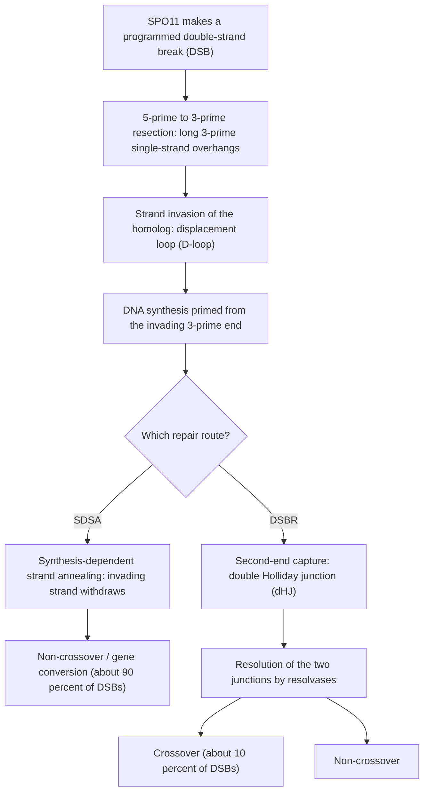
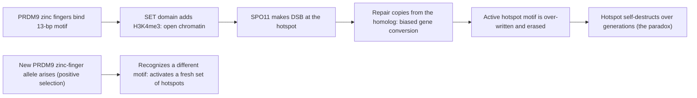

# Recombination & Linkage

**Course:** BME333 / BIO333 Genetics (UNIST, 2026 Fall) · Lecture 07 · ~60 min
**Syllabus:** [← Course schedule](../../lectures/2026.BME333-BIO333-Syllabus.md) — Week 04 Mon, 09-21
**Languages:** English · [한국어](../../ko/lectures/lec07_Recombination-Linkage.md)

## Learning Objectives
By the end of this lecture, students should be able to:
- Distinguish linked from independently assorting genes and interpret recombination frequency as a genetic distance.
- Build a genetic map from two- and three-point cross data, including interference.
- Explain the molecular basis of meiotic recombination (crossing over, double-strand-break repair) and where crossovers occur (hotspots).
- Define linkage disequilibrium and explain how it is used for association mapping and haplotype inference.
- Apply LOD scores to test for linkage in human pedigrees and appreciate the historical role of blood-group markers.

## Lecture

### 1. Linkage vs. independent assortment (~10 min)

Mendel's Law of Independent Assortment (Lecture 03) says the alleles of two different genes enter gametes independently, giving a dihybrid **9:3:3:1** and, in a testcross, four gamete classes in equal (1:1:1:1) frequency. That law works only when the two genes sit on **different chromosomes** — or very far apart on the same one. When two genes lie **close together on the same chromosome**, they tend to be transmitted as a unit: they are **linked**, and their testcross progeny depart sharply from 1:1:1:1. Explaining and *quantifying* that departure is the whole business of this lecture, and it is the historical bridge from abstract "factors" to physical genes arranged in a line along a chromosome.

Consider a doubly heterozygous individual carrying alleles at two linked loci. The arrangement matters. If the two dominant (or two mutant) alleles came in on the *same* homolog — written **AB / ab** — the genes are in **coupling** (cis). If they came in on *opposite* homologs — **Ab / aB** — they are in **repulsion** (trans). At meiosis, gametes that preserve the parental arrangement are **parental (non-recombinant)**; gametes that carry a new combination are **recombinant**. Recombinants are produced by **crossing over**: a physical exchange between homologous chromosomes during meiosis I, visible cytologically as a **chiasma**.

**Figure — Coupling vs. repulsion and the origin of recombinants.**
```
Coupling (cis)  AB / ab            Repulsion (trans)  Ab / aB
   A---------B                        A---------b
   ------------  (homolog pair)       ------------
   a---------b                        a---------B

 No crossover between A and B  ->  parental gametes  (AB, ab  or  Ab, aB)
 Crossover between A and B     ->  recombinant gametes (Ab, aB  or  AB, ab)
```

The **recombination frequency (RF)** is the fraction of all gametes (scored as testcross progeny) that are recombinant:

> RF = (number of recombinant progeny) / (total progeny)

For **unlinked** genes RF = 50% (the four classes are equal, half of them recombinant — indistinguishable from independent assortment). For **completely linked** genes with no crossing over RF = 0%. Real linked genes fall in between. The crucial insight, due to **Thomas Hunt Morgan** and his undergraduate student **Alfred Sturtevant** (1913), is that **RF is a monotonic measure of physical distance**: the farther apart two genes are, the more room there is for a crossover between them, so the larger the RF. Sturtevant defined the **map unit** or **centimorgan (cM)** so that **1 cM = 1% recombination**, and used RFs among several genes to draw the first **genetic map** — an ordered, additive, one-dimensional array of loci. That linear additivity is itself strong evidence that genes are physically strung along the chromosome. Morgan's *Drosophila* group turned genetic screens into gene maps (the same systematic-screen tradition later applied to meiosis itself; see [en](../../en/review/Hawley1993_Genetics_MeioticMutants-Drosophila.md) · [ko](../../ko/review/Hawley1993_Genetics_MeioticMutants-Drosophila.md)).

RF saturates at 50% because with enough distance, an *odd* number of crossovers (which yields recombinant gametes) becomes as likely as an *even* number (which restores the parental arrangement). Genes on the same chromosome that are far enough apart therefore *appear* unlinked. This is why RF is a good ruler only over short distances — and why we build long maps by summing many short intervals rather than measuring end-to-end.

### 2. Genetic mapping (~12 min)

A **two-point cross** measures the RF between two genes and gives one distance. But two-point data cannot, on their own, tell you gene *order* when you have three or more loci, and they systematically *underestimate* long distances because they miss **double crossovers** (two exchanges between the same two markers restore the parental combination and are silently scored as "parental"). The **three-point testcross** solves both problems at once and is the classic workhorse of genetic mapping.

Set up a **trihybrid** for three linked genes, e.g. `A B C / a b c`, and testcross it to a triple homozygous recessive `a b c / a b c`. Every one of the eight progeny classes reports directly which of the trihybrid's gametes it received. Two features of the eight classes decode the map:

- The **two most frequent** reciprocal classes are the **parentals** (no crossover). They tell you the coupling arrangement.
- The **two rarest** reciprocal classes are the **double crossovers (DCOs)**. Comparing a DCO class to a parental class, exactly **one gene will have "switched" sides — that gene is in the middle.** This single comparison fixes gene order.

**Figure — Worked three-point testcross (illustrative data, 1000 progeny).**

| Gamete from trihybrid | Count | Class |
|---|---|---|
| A B C | 355 | parental |
| a b c | 355 | parental |
| A B c | 95 | single CO, region II (B–C) |
| a b C | 95 | single CO, region II (B–C) |
| A b c | 45 | single CO, region I (A–B) |
| a B C | 45 | single CO, region I (A–B) |
| A b C | 5 | double crossover |
| a B c | 5 | double crossover |

Parentals are `ABC`/`abc`; the rarest (DCO) classes are `AbC`/`aBc`. Comparing `ABC` to `AbC`, only the **B** allele flipped — so **B is the middle gene** and the true order is **A–B–C**.

Now compute distances. An interval's map distance is the percentage of progeny that are recombinant *within that interval*, and this **must include the double-crossover classes**, which are recombinant in both intervals:

- **A–B (region I):** recombinants = single-CO-I (45+45) + DCO (5+5) = 100 / 1000 = **10 cM**
- **B–C (region II):** recombinants = single-CO-II (95+95) + DCO (5+5) = 200 / 1000 = **20 cM**
- Total map: **A —10 cM— B —20 cM— C**

**Figure — The resulting linkage map.**
```
   A                   B                                       C
   |------ 10 cM ------|---------------- 20 cM ----------------|
        region I                     region II
   (A-B recombination)          (B-C recombination)
```

Notice that the naive **two-point A–C** estimate would have counted only progeny recombinant for A vs. C (the single-CO classes: 45+45+95+95 = 280, i.e. 28%), *missing* the double crossovers (in which A and C revert to the parental combination). The true A–C distance from the three-point analysis is 10 + 20 = **30 cM**. This is exactly why three-point (and multi-point) crosses give more accurate maps than chained two-point measurements.

Finally, **crossovers are not independent**. If they were, the expected DCO frequency would be the product of the two interval RFs: 0.10 × 0.20 = 0.02, i.e. 20 progeny. We observed only 10. The **coefficient of coincidence (c.o.c.)** = observed DCO / expected DCO = 10/20 = **0.5**, and **interference (I) = 1 − c.o.c. = 0.5**. Positive interference means one crossover **suppresses a second crossover nearby** — a real physical constraint (a chiasma discourages another close by). Interference is a recurring theme: it reflects **crossover interference operating over physical (micron) distance**, which is also why female maps are longer than male maps (less-compacted female chromatids give more physical length for spaced crossovers; see [en](../../en/review/Paigen2010_NatRevGenet_RecombinationHotspots-Mammals.md) · [ko](../../ko/review/Paigen2010_NatRevGenet_RecombinationHotspots-Mammals.md)).

Modern crosses reach far finer scales. Smukowski Heil & Noor's primer describes screening **92,105 male progeny** in the *Drosophila* garnet–scalloped region to recover 6,716 recombinants (7.3 cM overall), then using target-enriched sequencing of 451 markers across 2.1 Mb to expose a **90-fold range of local recombination rate** (0.3–27 cM/Mb) at the 5-kb scale — variation invisible to classical mapping (see [en](../../en/review/Singh2013_Heil2013_GeneticsPrimer_Recombination.md) · [ko](../../ko/review/Singh2013_Heil2013_GeneticsPrimer_Recombination.md)).

### 3. Molecular mechanism of recombination (~12 min)

What physical event *is* a crossover? Meiotic recombination begins with a deliberate, programmed **double-strand break (DSB)** in the DNA, catalyzed by the topoisomerase-like enzyme **SPO11**. This is a striking idea: the cell purposely breaks its own chromosomes to recombine them, because in most organisms crossovers also create the physical **chiasmata** that hold homologs together and ensure their correct segregation at meiosis I. DSBs are then processed and repaired using the **homologous chromosome** (not the sister chromatid) as template, and *how* that repair resolves determines whether we get a crossover.

**Figure — Meiotic double-strand-break repair: two outcomes.**


The steps: after the DSB, **5′→3′ resection** leaves 3′ single-stranded overhangs. One overhang, coated by strand-exchange proteins, **invades** the homolog and pairs with the complementary strand, forming a **displacement loop (D-loop)**; the invading 3′ end primes new DNA synthesis. From here the pathway forks (see [en](../../en/review/Paigen2010_NatRevGenet_RecombinationHotspots-Mammals.md) · [ko](../../ko/review/Paigen2010_NatRevGenet_RecombinationHotspots-Mammals.md)):

- **Synthesis-dependent strand annealing (SDSA):** the extended invading strand is displaced and re-anneals to the other broken end. No exchange of flanking markers results — a **non-crossover (NCO)**, often detectable only as a small patch of **gene conversion** (non-reciprocal transfer of a short sequence from donor to recipient).
- **Double-strand-break repair (DSBR):** the second broken end is captured, producing a **double Holliday junction (dHJ)**. Depending on how the two junctions are cut ("resolved"), the outcome is a **crossover** (reciprocal exchange of flanking markers) or a non-crossover.

A key quantitative fact: in mammals only **~10% of DSBs mature into crossovers**; the other ~90% resolve as non-crossover gene conversions (see [en](../../en/review/Paigen2010_NatRevGenet_RecombinationHotspots-Mammals.md) · [ko](../../ko/review/Paigen2010_NatRevGenet_RecombinationHotspots-Mammals.md)). Crossover *exchange points* spread over roughly 500–2,000 bp, whereas non-crossover conversions are tightly clustered at the DSB center. This 10% is not accidental — cells enforce **crossover homeostasis** (a stable number of crossovers per bivalent even if DSB numbers change) and **interference** (the physical spacing we met in Segment 2), because too few crossovers risk nondisjunction and too many risk instability.

Where crossovers are *allowed* is also controlled. Crossovers are strongly **suppressed near centromeres**, because a crossover next to the kinetochore disrupts the tension-sensing that ensures proper biorientation, causing nondisjunction. Kuhl et al. (2020) used a clever **dCas9 tethering system** in budding yeast — fusing catalytically dead Cas9 to individual kinetochore subunits and recruiting them to an ectopic locus — to show that the **Ctf19** subunit alone is sufficient to suppress crossovers there. Ctf19 does not reduce DSB formation; instead, through DDK phosphorylation of its N-terminus it recruits the **Scc2–Scc4 cohesin loader**, biasing repair toward the non-crossover pathway. This is a beautiful demonstration that crossover *placement* is an actively regulated, position-dependent decision, and a modern example of repurposing CRISPR machinery as a programmable recruitment tool rather than for editing (see [en](../../en/article/Kuhl2020_Genetics_dCas9+Ctf19+Recombination.md) · [ko](../../ko/article/Kuhl2020_Genetics_dCas9+Ctf19+Recombination.md)). Classical *Drosophila* meiotic-mutant screens reached the same architecture from the genetic side, separating the **chiasmate** from the **achiasmate (distributive)** segregation systems and cloning genes such as *nod* (a kinesin-like protein) that ensure faithful disjunction (see [en](../../en/review/Hawley1993_Genetics_MeioticMutants-Drosophila.md) · [ko](../../ko/review/Hawley1993_Genetics_MeioticMutants-Drosophila.md)).

### 4. Recombination hotspots (~10 min)

Crossovers are **not spread uniformly** along chromosomes. Instead they cluster into discrete **recombination hotspots**, typically **1–2 kb** wide, where crossover frequency is far above the genomic average, separated by long "coldspots" essentially devoid of exchange (see [en](../../en/review/Hey2004_PLoSBiol_RecombinationHotspots.md) · [ko](../../ko/review/Hey2004_PLoSBiol_RecombinationHotspots.md)). Hotspots coincide with the **DSB hotspots** of Segment 3, so the question "where do crossovers happen?" becomes "where does SPO11 cut?"

In mammals, the answer is largely one gene: **PRDM9**. Paigen & Petkov's review synthesizes how PRDM9 works and why it matters (see [en](../../en/review/Paigen2010_NatRevGenet_RecombinationHotspots-Mammals.md) · [ko](../../ko/review/Paigen2010_NatRevGenet_RecombinationHotspots-Mammals.md)). PRDM9 is a trans-acting protein with three functional parts: a **KRAB** domain, a **SET** domain that **trimethylates histone H3 lysine 4 (H3K4me3)** to open local chromatin, and a long array of **zinc fingers** that bind a specific DNA motif (a degenerate 13-bp consensus, `CCNCCNTNNCCNC`, enriched at human hotspots). By binding the motif and marking the chromatin, PRDM9 tells SPO11 where to cut.

**Figure — PRDM9 specifies hotspots, and the hotspot paradox.**


PRDM9 also resolves the **"hotspot paradox."** Because recombination repairs the broken chromatid using the homolog as template, the **active hotspot sequence is progressively over-written** (**biased gene conversion**) — hotspots erode themselves out of existence, yet hotspots are everywhere. The resolution: PRDM9 is under strong **positive selection**, with rapid change concentrated in its zinc-finger DNA-binding residues; a new PRDM9 allele recognizes a new motif and **creates an entirely new population of hotspots**, replacing those being lost. This predicts fast turnover of hotspot *locations* — confirmed by the near-complete non-overlap of **human and chimpanzee** hotspots, and by the estimate that individual human hotspots can arise within ~70,000 years by single base changes (see [en](../../en/review/Hey2004_PLoSBiol_RecombinationHotspots.md) · [ko](../../ko/review/Hey2004_PLoSBiol_RecombinationHotspots.md) and [en](../../en/review/Paigen2010_NatRevGenet_RecombinationHotspots-Mammals.md) · [ko](../../ko/review/Paigen2010_NatRevGenet_RecombinationHotspots-Mammals.md)). PRDM9 also doubles as the mouse **hybrid-sterility gene Hst1**, tying hotspot control directly to **speciation**. Not all taxa use this system: *Drosophila* and *C. elegans* assemble the synaptonemal complex **independently of DSBs** and lack discrete hotspots, showing only broad regional rate variation — evidence that hotspots may be byproducts of the DSB–SC coupling seen in yeast and mammals rather than universally selected features (see [en](../../en/review/Hey2004_PLoSBiol_RecombinationHotspots.md) · [ko](../../ko/review/Hey2004_PLoSBiol_RecombinationHotspots.md)).

### 5. Linkage disequilibrium & association (~10 min)

Everything above tracks recombination *within a single meiosis*. **Linkage disequilibrium (LD)** is the population-level echo of many meioses accumulated over generations. LD is the **non-random association of alleles at different loci** in a population: if allele *A* at one locus is found with allele *B* at a nearby locus more (or less) often than expected from their separate frequencies, the two loci are in LD. LD is generated by mutation, drift, selection, and admixture, and it is **broken down by recombination** — each crossover between two loci shuffles their alleles toward independence (**linkage equilibrium**). Nearby loci, rarely separated by crossovers, stay in strong LD for many generations; distant loci reach equilibrium fast.

The genome therefore has a **block-like haplotype structure**: long stretches of high LD (**haplotype blocks**) bounded by recombination hotspots, so that a handful of "tag" SNPs can capture most of the variation in a block. This is the logical foundation of the **HapMap** project and of **genome-wide association studies (GWAS)**: because a genotyped SNP is in LD with unobserved nearby variants, an association signal at the tag SNP flags a causal variant somewhere in the block, which **fine-mapping** then narrows (see [en](../../en/review/Hey2004_PLoSBiol_RecombinationHotspots.md) · [ko](../../ko/review/Hey2004_PLoSBiol_RecombinationHotspots.md)).

**Figure — Recombination erodes LD into tag-able haplotype blocks.**
```
Ancestral haplotype:   ==A======B======C==D===   (alleles travel together = high LD)

  many generations of recombination, cutting mostly at hotspots (X):
                        ==A==X===B======C=X=D===

Result: blocks of high internal LD, separated at hotspots
        [ A ... B ]  X  [ C ... D ]
         one tag SNP     one tag SNP     <- captures the whole block for GWAS
```

Turning LD patterns into recombination *rates* requires a statistical model. **Li & Stephens (2003)** provided the one that reshaped the field: their **"copying" or Product of Approximate Conditionals (PAC) model** treats each new haplotype as an **imperfect mosaic of previously observed haplotypes**, stitched together by a hidden Markov process whose **switch (jump) rate is proportional to the local recombination rate** (ρ = 4Nc) — more switches mean more recombination (see [en](../../en/article/Li2003_Genetics_LD+Modeling.md) · [ko](../../ko/article/Li2003_Genetics_LD+Modeling.md)). This runs in **~30 seconds** versus ~30 hours for full coalescent MCMC, while detecting hotspots with ~90% power. Song's retrospective explains why this "conditional sampling probability" approximation became foundational: the same copying model underlies **haplotype phasing, genotype imputation** (IMPUTE, MaCH — filling in ungenotyped SNPs to boost GWAS power), **local-ancestry inference**, and fine-scale recombination maps (LDhat) — one elegant biological idea (a genealogy is a mosaic of copies) propagating across a decade of genomics (see [en](../../en/review/Song2016_Genetics_Li+Stephens+LD.md) · [ko](../../ko/review/Song2016_Genetics_Li+Stephens+LD.md)).

### 6. Linkage in human pedigrees (~6 min)

Humans cannot be bred in designed crosses, so early human geneticists had to detect linkage in **whatever families nature provided** — small, variable pedigrees where phase is often unknown. **Newton Morton** solved the statistics with the **LOD score** (**LOD = logarithm of the odds**): for a hypothesized recombination fraction θ, compute the likelihood of the observed pedigree data under linkage at θ versus the likelihood under no linkage (θ = 0.5), and take the base-10 log of the ratio (see [en](../../en/review/Morton1995_Genetics_LODs.md) · [ko](../../ko/review/Morton1995_Genetics_LODs.md)):

> Z(θ) = log₁₀ [ L(data | recombination fraction = θ) / L(data | θ = 0.5) ]

The LOD's decisive property is **additivity**: because independent likelihoods multiply, LODs from different families simply **add**, so evidence accumulates across pedigrees and even across labs and decades. Morton adapted **Wald's sequential analysis** to give stopping rules and, crucially, accounted for the **low prior probability that two random loci are even syntenic** (~0.05). That prior is why the famous thresholds are asymmetric and conservative:

**Figure — LOD-score decision rule.**

| LOD score Z | Odds for/against linkage | Decision |
|---|---|---|
| Z ≥ +3 | ≥ 1000 : 1 in favor | **Accept linkage** |
| −2 < Z < +3 | inconclusive | Collect more families |
| Z ≤ −2 | ≥ 100 : 1 against | **Reject linkage** |

The Z > 3 rule looks strict, but with a ~5% prior on synteny it makes most "significant" results genuinely true — the same multiple-testing logic that reappears as the **genome-wide significance threshold** in modern GWAS. Historically, the first human autosomal linkages were found with highly penetrant **blood-group markers**, and the most elegant case is R. A. Fisher's 1943 analysis of the **Rhesus (Rh) system**. From tangled serology alone Fisher deduced **three tightly linked loci — C, D, E**, each with a pair of allelic antigens, representing the eight haplotypes as the corners of a cube; he even predicted an unobserved antibody (anti-d) and explained rare haplotypes as products of **crossing over** in heterozygotes. Because the loci are tightly linked, the haplotypes are in strong **linkage disequilibrium** — falling into common, rare, and effectively absent classes rather than the equilibrium frequencies — a real-data illustration of everything in Segment 5. Molecular biology later vindicated him: **D is one gene (RHD)** while **C and E are alternative splice forms of a second gene (RHCE)** — "Fisher's solution is recognizable beneath the modern molecular detail" (see [en](../../en/review/Edwards2007_Genetics_Fisher-RhesusBloodGroup.md) · [ko](../../ko/review/Edwards2007_Genetics_Fisher-RhesusBloodGroup.md)).

## Key Takeaways
- **Linked genes** on the same chromosome violate independent assortment; **recombination frequency (RF)** measures the fraction of recombinant gametes and is an additive genetic distance (**1 cM = 1% recombination**), saturating at 50% for distant/unlinked loci.
- A **three-point testcross** reads gene *order* from the double-crossover class (the gene that "flipped" is in the middle) and gives corrected interval distances by counting DCOs in each interval; **interference (I = 1 − c.o.c.)** shows crossovers suppress nearby crossovers.
- Crossovers arise from programmed **SPO11 DSBs** repaired off the homolog; **DSBR** can yield crossovers via a double Holliday junction, while **SDSA** yields non-crossovers/gene conversions. Only **~10% of DSBs become crossovers**, and crossovers are actively **suppressed near centromeres** (Ctf19/cohesin).
- Recombination clusters in **1–2 kb hotspots** specified in mammals by **PRDM9** (motif binding + H3K4me3); biased gene conversion erodes hotspots (the **hotspot paradox**), resolved by rapid, positively selected turnover of PRDM9 zinc fingers.
- **Linkage disequilibrium** is population-level allele association broken down by recombination, giving **haplotype blocks** that make **GWAS/imputation** possible; the **Li–Stephens copying model** turns LD patterns into recombination rates and underlies modern phasing/imputation tools.
- **LOD scores** detect linkage in human pedigrees (additive across families; **Z > 3** to accept, **Z < −2** to reject), with the synteny prior foreshadowing genome-wide significance; Fisher's **Rhesus** analysis is the classic case of inferring linkage, allelism, and LD from phenotype alone.

## Textbook Reading
- **Genetics: From Genes to Genomes (8e)** — Ch. 5 Linkage, Recombination & Gene Mapping; Ch. 6 DNA Structure, Replication & Recombination. → [textbook ref](../../lectures/ref.Genetics-FromGenesToGenomes.md)

## Notes in this vault
Reviews & articles to introduce in class (each has a bilingual en/ko pair):
- `Singh2013_Heil2013_GeneticsPrimer_Recombination` — a teaching primer on recombination; good scaffold for the mechanism segment. · [en](../../en/review/Singh2013_Heil2013_GeneticsPrimer_Recombination.md) · [ko](../../ko/review/Singh2013_Heil2013_GeneticsPrimer_Recombination.md)
- `Hey2004_PLoSBiol_RecombinationHotspots` — accessible introduction to why recombination clusters into hotspots. · [en](../../en/review/Hey2004_PLoSBiol_RecombinationHotspots.md) · [ko](../../ko/review/Hey2004_PLoSBiol_RecombinationHotspots.md)
- `Paigen2010_NatRevGenet_RecombinationHotspots-Mammals` — mammalian hotspots and their genetic control (PRDM9). · [en](../../en/review/Paigen2010_NatRevGenet_RecombinationHotspots-Mammals.md) · [ko](../../ko/review/Paigen2010_NatRevGenet_RecombinationHotspots-Mammals.md)
- `Li2003_Genetics_LD+Modeling` — foundational modeling of linkage disequilibrium and haplotype structure. · [en](../../en/article/Li2003_Genetics_LD+Modeling.md) · [ko](../../ko/article/Li2003_Genetics_LD+Modeling.md)
- `Song2016_Genetics_Li+Stephens+LD` — the Li–Stephens copying model and its role in modern LD/inference methods. · [en](../../en/review/Song2016_Genetics_Li+Stephens+LD.md) · [ko](../../ko/review/Song2016_Genetics_Li+Stephens+LD.md)
- `Kuhl2020_Genetics_dCas9+Ctf19+Recombination` — engineering/targeting recombination with dCas9 tethering; a modern tool angle. · [en](../../en/article/Kuhl2020_Genetics_dCas9+Ctf19+Recombination.md) · [ko](../../ko/article/Kuhl2020_Genetics_dCas9+Ctf19+Recombination.md)
- `Hawley1993_Genetics_MeioticMutants-Drosophila` — meiotic mutants dissecting the recombination/segregation machinery in *Drosophila*. · [en](../../en/review/Hawley1993_Genetics_MeioticMutants-Drosophila.md) · [ko](../../ko/review/Hawley1993_Genetics_MeioticMutants-Drosophila.md)
- `Morton1995_Genetics_LODs` — the LOD-score method for human linkage analysis. · [en](../../en/review/Morton1995_Genetics_LODs.md) · [ko](../../ko/review/Morton1995_Genetics_LODs.md)
- `Edwards2007_Genetics_Fisher-RhesusBloodGroup` — Fisher and the Rhesus blood group as an early human linkage marker system. · [en](../../en/review/Edwards2007_Genetics_Fisher-RhesusBloodGroup.md) · [ko](../../ko/review/Edwards2007_Genetics_Fisher-RhesusBloodGroup.md)

## Discussion Questions
1. Two genes show a two-point RF of 28%, but a three-point cross that spans them gives interval distances summing to 30 cM. Explain precisely why the two-point estimate is *smaller*, and why chaining short intervals gives a more accurate long-range map. What happens to a two-point RF as the true distance grows past ~50 cM?
2. In a three-point testcross the double-crossover classes are the rarest. Explain the two distinct jobs those classes do — fixing gene order *and* revealing interference — and work through how you would compute the coefficient of coincidence from the eight class counts.
3. Only ~10% of meiotic DSBs become crossovers, yet cells deliberately make many DSBs. Why would a cell break its own chromosomes so freely, and what would go wrong (in segregation and in genome stability) if the crossover fraction were pushed to 100% or down to 0%?
4. PRDM9 both *creates* hotspots and, through biased gene conversion, *destroys* the very sequences it binds. Lay out the "hotspot paradox" and explain how positive selection on PRDM9's zinc fingers resolves it. What does the near-complete non-overlap of human vs. chimpanzee hotspots predict about hotspot maps a million years from now?
5. GWAS rarely genotypes the causal variant directly; it relies on LD with tag SNPs. Using the haplotype-block picture and the Li–Stephens copying model, explain how a signal at a tag SNP localizes a causal variant — and why recombination hotspots set the resolution limit of fine-mapping.
6. Morton set the LOD linkage threshold at Z > 3 partly because the prior probability that two random loci are syntenic is only ~5%. Explain how a low prior justifies a stringent threshold, and connect this reasoning to genome-wide significance thresholds in modern GWAS.
