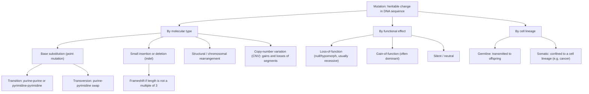
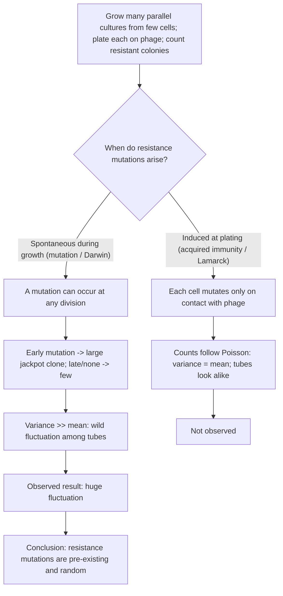
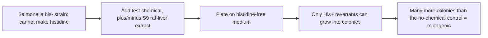

# Mutation & Copy Number Variation

**Course:** BME333 / BIO333 Genetics (UNIST, 2026 Fall) · Lecture 08 · ~60 min
**Syllabus:** [← Course schedule](../../lectures/2026.BME333-BIO333-Syllabus.md) — Week 04 Wed, 09-23
**Languages:** English · [한국어](../../ko/lectures/lec08_Mutation-CNV.md)

## Learning Objectives
By the end of this lecture, students should be able to:
- Define mutation and classify mutations by molecular type (point, indel, structural, copy-number) and by functional effect.
- Explain the Luria–Delbrück fluctuation test and what it proved about the origin (pre-existing vs. induced) of mutations.
- Describe major mutagenesis mechanisms and how mutation became an experimental, controllable variable.
- Explain the Ames test and the principle of using reversion to screen for mutagens/carcinogens.
- Describe copy-number variation and transposable elements as sources of genomic variation and disease.

## Lecture

### 1. What is a mutation? (~10 min)

A **mutation** is a heritable change in the DNA sequence of a cell or organism. Mutation is the ultimate source of all genetic variation — without it there would be no alleles for Mendel to track, no recombinants to map, and nothing for natural selection to act on. Yet "mutation" is not a single thing; it is a family of molecular events of very different sizes and consequences, and classifying them properly is the first step to reasoning about them.

**Figure — Classifying mutations three ways.**


By **molecular type**, the smallest change is a **base substitution (point mutation)**, subdivided into **transitions** (purine↔purine or pyrimidine↔pyrimidine, e.g. A↔G, C↔T) and **transversions** (purine↔pyrimidine). Next come **small insertions and deletions (indels)**; when an indel in a coding region is *not* a multiple of three, it causes a **frameshift** that garbles every codon downstream. At larger scales come **structural rearrangements** (Lecture 09) and **copy-number variants (CNVs)** — gains or losses of kilobase-to-megabase segments (Segment 5).

By **functional effect**, the key distinction is **loss-of-function** (a hypomorphic or null allele that reduces or abolishes activity — usually recessive, because one working copy often suffices) versus **gain-of-function** (a new or excessive activity — frequently dominant). Recall from Lecture 03 that Mendel's recessive alleles are almost all loss-of-function lesions where **dominant = functional, recessive = non-functional**. Within coding sequence, a substitution can be **synonymous (silent)**, **missense** (changes an amino acid), or **nonsense** (creates a premature stop).

**Figure — Consequences of a substitution or indel in a coding sequence.**

| Change | Effect on protein | Typical consequence |
|---|---|---|
| Synonymous (silent) | same amino acid | usually neutral |
| Missense | one amino acid changed | variable; can be null, partial, or gain |
| Nonsense | premature stop codon | truncated/absent protein (loss-of-function) |
| In-frame indel (×3) | residues added/removed | often partial function retained |
| Frameshift indel | reading frame shifted downstream | usually null (garbled + early stop) |

By **cell lineage**, a **germline** mutation is transmitted to offspring, whereas a **somatic** mutation affects only a descendant cell clone — the basis of cancer.

Finally, a conceptual subtlety worth flagging early: are mutations truly **random**? The classical (and, as we will see, experimentally proven) answer is yes — mutations arise independently of whether they would be useful. But Fitzgerald & Rosenberg argue for a careful reading: the *identity* of a change at a given site remains unpredictable, yet the overall **mutation rate is a regulated, evolvable trait**. Under stress, cells can switch to **error-prone repair**: nutrient-starved *E. coli* trigger the **SOS response** (RecA filaments cleave the LexA repressor, derepressing error-prone polymerases Pol IV/Pol V), and **mutagenic break repair** clusters mutations around double-strand breaks — echoing the **kataegis** clusters seen in cancer genomes (see [en](../../en/review/Fitzgerald2019_PLoSgenet_WhatIsMutation.md) · [ko](../../ko/review/Fitzgerald2019_PLoSgenet_WhatIsMutation.md)). This does not resurrect Lamarck; it says the *rate*, not the *direction*, responds to physiology. Historically, the very idea that "a gene" is a discrete mutable unit — Muller's **autocatalysis vs. heterocatalysis** — was the reductionist frame that made mutation studyable, even though molecular genetics later showed genes to be scientist-drawn divisions of continuous DNA (see [en](../../en/review/Falk2010_Genetics_Mutagenesis-ResearchStrategy.md) · [ko](../../ko/review/Falk2010_Genetics_Mutagenesis-ResearchStrategy.md)).

### 2. The Luria–Delbrück fluctuation test (~14 min)

Before 1943 a fundamental question was open: when bacteria survive a lethal challenge (say, bacteriophage), do the survivors carry **pre-existing** resistance mutations that arose *before* they ever met the phage (the Darwinian "mutation" view), or does contact with the phage **induce** resistance in some cells (the Lamarckian "acquired immunity" view)? Both hypotheses predict the same endpoint — a few resistant colonies — so simply seeing survivors settles nothing. **Salvador Luria** and **Max Delbrück** designed an experiment whose *statistics*, not its averages, could tell the two apart (see [en](../../en/article/LuriaDelbruck1943_Genetics_VirusResistance.md) · [ko](../../ko/article/LuriaDelbruck1943_Genetics_VirusResistance.md)).

Luria's insight came, famously, while watching a **slot machine** at a 1942 faculty dance: most plays pay nothing, but a rare early jackpot pays huge. Translate to bacteria grown in many separate tubes: if resistance mutations occur **spontaneously during growth**, a mutation that happens **early** in one tube is copied into a huge **"jackpot" clone** by the time of plating, while other tubes, mutating late or not at all, yield few or none — producing **enormous tube-to-tube variance**. If instead resistance is **induced at the moment of plating**, every tube's cells face the phage simultaneously and independently, so counts follow a **Poisson distribution**, whose defining property is **variance = mean**. The two hypotheses make sharply different predictions about **fluctuation**.

**Figure — The logic of the fluctuation test.**


The design has two parts. A **control** (many samples drawn from a *single* large culture) verifies that the plating/counting step itself is Poisson — sampling variation only. The **key experiment** grows **many independent parallel cultures** from tiny inocula, then challenges each separately. The comparison of these two is the entire argument, and — as Meneely's teaching primer stresses — it is understandable **without the differential equations**: just compare the spread of the two tables (see [en](../../en/review/LuriaDelbruck1943_Meneely2016_GeneticsClassic.md) · [ko](../../ko/review/LuriaDelbruck1943_Meneely2016_GeneticsClassic.md)).

**Figure — Signature of pre-existing mutation (Experiment 16, from the 1943 paper).**

| Quantity | Value | Interpretation |
|---|---|---|
| Mean resistant colonies per culture | 11.35 | if Poisson, variance should ≈ 11 |
| Cultures with **zero** resistant colonies | 11 of 20 | many tubes never mutated |
| Cultures with 35–107 resistant colonies | 3 of 20 | **jackpots** from early mutations |
| Observed variance | ≫ mean | incompatible with Poisson / acquired immunity |

The huge excess variance — many zeros alongside a few jackpots — is impossible under acquired immunity and is exactly what pre-existing random mutation predicts. Luria and Delbrück also extracted a **mutation rate** two ways (from the fraction of zero-mutant cultures, P₀ = e⁻ʰ, and from the mean), obtaining ~**2.45 × 10⁻⁸ mutations per bacterium per division** — remarkably close to modern whole-genome estimates. The conclusion is a cornerstone of the Modern Synthesis: **selection reveals pre-existing variation; it does not create it.** The same logic explains **antibiotic resistance** today — resistant mutants are present before the drug, which merely selects them (see [en](../../en/review/LuriaDelbruck1943_Meneely2016_GeneticsClassic.md) · [ko](../../ko/review/LuriaDelbruck1943_Meneely2016_GeneticsClassic.md)).

A statistical coda worth teaching: Luria and Delbrück could not derive the full distribution, citing "considerable mathematical difficulties." **J.B.S. Haldane** worked out a combinatorial solution in 1946 (the number of ways to make *x* mutants maps onto partitions of *x* into powers of 2) but never formally published it. Haldane also showed, presciently, that **four non-ideal factors** (plating only part of a culture, asynchronous division, cell death, slower mutant growth) all *reduce* variance — so a merely low variance cannot by itself prove directed mutation. That caveat became central when Cairns et al. (1988) revived the "directed mutation" debate (see [en](../../en/review/Sarkar1991_Genetics_LuriaDelbruck+Haldane.md) · [ko](../../ko/review/Sarkar1991_Genetics_LuriaDelbruck+Haldane.md)).

### 3. Mutation as an experimental tool (~10 min)

Luria and Delbrück showed mutations arise on their own. The prior, equally transformative step was learning to **make** them on demand — turning mutation from an "unreachable god" into "a researchable subject." That step was **Hermann J. Muller's** 1927 demonstration that **X-rays induce mutations** (see [en](../../en/review/Crow1997_Genetics_Mutation-BecomesExperimental.md) · [ko](../../ko/review/Crow1997_Genetics_Mutation-BecomesExperimental.md)). Muller consciously modeled the work on Rutherford's *transmutation* of atoms, titling his paper "Artificial Transmutation of the Gene," and reported a mutation-rate increase of "fifteen thousand percent." Curiously the 1927 paper contained **no data** — inviting skepticism from T. H. Morgan — which Muller answered with a full 1928 account.

Crow and Abrahamson emphasize that Muller's deeper contribution was **method**, not radiation per se. Mutations are rare, so scoring them reliably is the real problem. Muller's solutions are still taught:

- **Score recessive lethals, not visible mutations.** Lethals are far more numerous and unambiguous — "no survivors" removes the "personal equation," letting an average technician score as well as a sharp-eyed expert.
- **Use balanced-lethal / crossover-suppressor stocks.** Muller's famous **ClB** chromosome (**C** = crossover suppressor, later shown to be an **inversion**; **l** = recessive **l**ethal; **B** = **B**ar marker) let X-linked lethal rates be read almost by eye: an F₂ culture **lacking males** signaled a new lethal.
- **Show the rate is tunable.** Before radiation, Muller spent years testing whether **temperature** changed the mutation rate (reasoning that a chemical-like reaction should roughly double per 10 °C), using wet cloths and fans in the Texas heat. Merely showing the rate *could be moved* proved mutation was a physical process.

These tools launched **radiation genetics** and the **linear dose–response** relationship (point mutations = "single-hit" targets; rearrangements need ≥2 breaks), which drew physicists into biology: the **target theory** of Timoféeff-Ressovsky, Zimmer & Delbrück (1935) tried to size the gene, and Delbrück's quantum view of the gene inspired Schrödinger's *What Is Life?* Muller's hope that chemical mutagens would reveal the gene's chemistry was realized only later by **Charlotte Auerbach** (mustard gas), and the gene's nature came instead from DNA structure (see [en](../../en/review/Falk2010_Genetics_Mutagenesis-ResearchStrategy.md) · [ko](../../ko/review/Falk2010_Genetics_Mutagenesis-ResearchStrategy.md)). Mutagenesis remained the backbone of genetics — Benzer's fine-structure *rII* mapping, transition/transversion classification with base analogs, and acridine frameshifts establishing the triplet code — and today mutability *itself* (mutator genes, repair fidelity, cancer mutational signatures) has become a research **target** rather than only a tool (see [en](../../en/review/Falk2010_Genetics_Mutagenesis-ResearchStrategy.md) · [ko](../../ko/review/Falk2010_Genetics_Mutagenesis-ResearchStrategy.md)).

### 4. Detecting mutagens: the Ames test (~10 min)

If mutation can be induced, then chemicals in our environment might be mutagens — and because mutation drives cancer, mutagens are candidate **carcinogens**. **Bruce Ames** turned this into a fast, cheap bacterial assay built on **reversion** (see [en](../../en/review/Goodson-Gregg2009_Genetics_AmesTest.md) · [ko](../../ko/review/Goodson-Gregg2009_Genetics_AmesTest.md)). The trick is elegant: start with a **his⁻** *Salmonella typhimurium* strain that **cannot synthesize histidine** and so cannot grow on histidine-free medium. A **reversion mutation** that restores histidine biosynthesis lets a cell grow into a **His⁺ colony**. The **number of revertant colonies** measures how strongly a test chemical raises the mutation rate.

**Figure — The Ames reversion assay.**


Two design features make the test powerful. First, **metabolic activation with S9**: many chemicals are harmless until the liver's enzymes convert them into reactive **promutagens**. Adding a mammalian **S9 liver extract** lets the plate mimic this activation, so the assay catches carcinogens that require metabolism. Second, **strain-specific reversion reveals mutation spectrum**: the teaching version uses **TA1535** (a **missense** allele, *hisG46*) and **TA1538** (a **frameshift** allele, *hisD3052*). A mutagen that causes base substitutions (sodium azide, NaN₃) reverts **only TA1535**, whereas a frameshift mutagen (4-nitro-o-phenylenediamine, 4NOP) reverts **only TA1538** — a direct, hands-on demonstration that **different mutagens make different kinds of mutations**. Sequencing revertants makes the point molecular: TA1535 revertants are mostly C→T transitions or C→A transversions within a 2-bp window, while TA1538 revertants show diverse indels across ~30 bp that restore the reading frame **without** returning to wild-type sequence — many DNA sequences, one functional phenotype (see [en](../../en/review/Goodson-Gregg2009_Genetics_AmesTest.md) · [ko](../../ko/review/Goodson-Gregg2009_Genetics_AmesTest.md)). The broad correlation between Ames-positivity and carcinogenicity is the enduring public-health payoff.

### 5. Copy-number variation (~8 min)

Not all variation is single-base. **Copy-number variants (CNVs)** are gains (duplications) or losses (deletions) of DNA segments ranging from ~1 kb to several Mb, so that individuals carry **different numbers of copies** of a stretch of genome. CNVs are a **major class of human structural variation**, collectively affecting more base pairs than SNPs do, and they matter for disease through **gene dosage** (too many or too few copies of dosage-sensitive genes).

A principal mechanism is **non-allelic homologous recombination (NAHR)**: the genome is littered with near-identical repeated sequences, and during meiosis these can **misalign** so that recombination occurs between *non-allelic* copies. An unequal exchange then deletes the intervening segment on one product and duplicates it on the reciprocal product.

**Figure — Non-allelic homologous recombination generates a CNV.**
```
Normal alignment:      ==[repeat]==geneX==[repeat]==
                       ==[repeat]==geneX==[repeat]==

Misalignment of repeats (the two repeats pair out of register):
                       ==[repeat]==geneX==[repeat]==
                            \________________/
                       ==[repeat]==geneX==[repeat]==

Unequal crossover products:
   Deletion:   ==[repeat]==          (geneX lost)   -> dosage too low
   Duplication:==[repeat]==geneX==geneX==[repeat]==  -> dosage too high
```

The repeated substrates for NAHR are often **transposable-element copies** (Segment 6): **Alu–Alu** recombination alone has been implicated in **>70 monogenic diseases**, and **L1–L1** recombination has deleted >40 kb spanning *COL4A5/COL4A6* in Alport syndrome (see [en](../../en/review/Payer2019_NatRevGenet_TE-Disease.md) · [ko](../../ko/review/Payer2019_NatRevGenet_TE-Disease.md)). CNVs are detected by array comparative genomic hybridization and increasingly by short- and long-read sequencing; because a single event can change the dosage of many genes at once, CNVs sit conceptually between point mutation and the whole-chromosome imbalances of Lecture 09.

### 6. Transposable elements (~8 min)

**Transposable elements (TEs)** are mobile DNA sequences that copy or move themselves around the genome — mutagens that the genome carries within itself. They are not a fringe curiosity: TE-derived sequence makes up roughly **half of the human genome**. The most consequential class today are **retrotransposons**, which mobilize via an RNA intermediate that is reverse-transcribed and inserted at a new site by **target-primed reverse transcription (TPRT)** (see [en](../../en/review/Payer2019_NatRevGenet_TE-Disease.md) · [ko](../../ko/review/Payer2019_NatRevGenet_TE-Disease.md)).

**Figure — The main human transposable elements.**

| Element | Class | ~Genome fraction | Autonomy |
|---|---|---|---|
| **LINE-1 (L1)** | autonomous retrotransposon | ~17% | encodes ORF1p (RNA-binding) and ORF2p (endonuclease + reverse transcriptase) |
| **Alu** (SINE) | non-autonomous | ~11% | hijacks L1 machinery to move |
| **SVA** | non-autonomous | small | hijacks L1 machinery to move |
| **ERV** (LTR) | endogenous retrovirus | — | largely inactivated in modern humans |

**L1** is the only currently autonomous human retrotransposon; **Alu** and **SVA** are non-autonomous "parasites of a parasite" that co-opt L1's enzymes. TE insertions are distinctive: unlike a generic CNV, an insertion **brings functional sequence with it** — promoters, splice signals, and secondary structures — so it can disrupt genes in many ways: insertion into a **coding exon** (frameshift/premature stop; the first reported example was a de novo L1 causing **hemophilia A**, 1988), **splice-site disruption** or intronic insertion causing exon skipping (e.g. *NF1*), **exonization** by donating a splice signal (e.g. within *RB1*), or insertions accompanied by **large flanking deletions** (an SVA triggering an 867-kb deletion at *NF1*). At the population level, single insertions can be common disease alleles — an SVA in the *FKTN* 3′ UTR accounts for **80%** of Fukuyama congenital muscular dystrophy alleles in Japan, and an SVA in *TAF1* causes X-linked dystonia-parkinsonism in the Filipino population. Over **16,000 polymorphic TEs** segregate in humans (~24% of known structural variants), some acting as eQTLs near GWAS signals (see [en](../../en/review/Payer2019_NatRevGenet_TE-Disease.md) · [ko](../../ko/review/Payer2019_NatRevGenet_TE-Disease.md)).

TEs are normally silenced by **DNA methylation and heterochromatin**, but this control breaks down in cancer: L1 promoter **hypomethylation**, elevated ORF1p, and somatic retrotransposition are common in tumors. And as we saw in Segment 5, even *inactive*, fixed TE copies remain dangerous long-term as the **repeat substrates for NAHR**. TEs thus tie together the whole lecture: they are point-scale mutagens (insertions), structural mutagens (deletions), copy-number contributors, and, when de-repressed, drivers of somatic mutation in disease.

## Key Takeaways
- A **mutation** is a heritable DNA change; classify by **molecular type** (substitution = transition/transversion; indel/frameshift; structural; CNV), by **functional effect** (loss- vs. gain-of-function; silent/missense/nonsense), and by **lineage** (germline vs. somatic).
- The **Luria–Delbrück fluctuation test** distinguishes hypotheses by **variance**: pre-existing random mutations give huge tube-to-tube fluctuation ("jackpots," variance ≫ mean), whereas phage-induced mutation would give a Poisson distribution (variance = mean). The data proved **selection reveals pre-existing variation** (mutation rate ~2.45 × 10⁻⁸/division).
- **Muller** made mutation experimental (X-rays, 1927) chiefly through **method** — scoring recessive lethals, the **ClB** crossover-suppressor/balancer trick, and showing the rate is tunable — launching radiation genetics and the linear dose–response.
- The **Ames test** scores **reversion** of *Salmonella his⁻* auxotrophs (with **S9** activation) to detect mutagens; strain-specific reversion (missense TA1535 vs. frameshift TA1538) exposes mutation spectra, and Ames-positivity broadly predicts carcinogenicity.
- **CNVs** (kb–Mb gains/losses) act largely through **gene dosage** and arise by **NAHR** between repeated sequences (often Alu/L1), a major class of human structural variation.
- **Transposable elements** (~half the genome; L1 ~17% autonomous, Alu ~11% and SVA non-autonomous) are internal mutagens causing disease by insertion, splice disruption, exonization, flanking deletions, and — even when inactive — by serving as NAHR substrates; normally silenced by methylation, they reactivate in cancer.

## Textbook Reading
- **Genetics: From Genes to Genomes (8e)** — Ch. 7 Mutation; Ch. 12 Analyzing Genomic Variation. → [textbook ref](../../lectures/ref.Genetics-FromGenesToGenomes.md)

## Notes in this vault
Reviews & articles to introduce in class (each has a bilingual en/ko pair):
- `LuriaDelbruck1943_Genetics_VirusResistance` — the original fluctuation-test paper on the origin of bacterial mutations. · [en](../../en/article/LuriaDelbruck1943_Genetics_VirusResistance.md) · [ko](../../ko/article/LuriaDelbruck1943_Genetics_VirusResistance.md)
- `LuriaDelbruck1943_Meneely2016_GeneticsClassic` — Genetics "Classic" commentary making the 1943 experiment accessible for teaching. · [en](../../en/review/LuriaDelbruck1943_Meneely2016_GeneticsClassic.md) · [ko](../../ko/review/LuriaDelbruck1943_Meneely2016_GeneticsClassic.md)
- `Sarkar1991_Genetics_LuriaDelbruck+Haldane` — historical/statistical context, including Haldane's related thinking on mutation. · [en](../../en/review/Sarkar1991_Genetics_LuriaDelbruck+Haldane.md) · [ko](../../ko/review/Sarkar1991_Genetics_LuriaDelbruck+Haldane.md)
- `Crow1997_Genetics_Mutation-BecomesExperimental` — how mutation became an experimentally tractable variable. · [en](../../en/review/Crow1997_Genetics_Mutation-BecomesExperimental.md) · [ko](../../ko/review/Crow1997_Genetics_Mutation-BecomesExperimental.md)
- `Falk2010_Genetics_Mutagenesis-ResearchStrategy` — mutagenesis as a deliberate research strategy in genetics. · [en](../../en/review/Falk2010_Genetics_Mutagenesis-ResearchStrategy.md) · [ko](../../ko/review/Falk2010_Genetics_Mutagenesis-ResearchStrategy.md)
- `Fitzgerald2019_PLoSgenet_WhatIsMutation` — a modern conceptual framing of "what a mutation is." · [en](../../en/review/Fitzgerald2019_PLoSgenet_WhatIsMutation.md) · [ko](../../ko/review/Fitzgerald2019_PLoSgenet_WhatIsMutation.md)
- `Goodson-Gregg2009_Genetics_AmesTest` — the Ames reversion assay for detecting mutagens and carcinogens. · [en](../../en/review/Goodson-Gregg2009_Genetics_AmesTest.md) · [ko](../../ko/review/Goodson-Gregg2009_Genetics_AmesTest.md)
- `Payer2019_NatRevGenet_TE-Disease` — transposable elements as mutagens and their roles in human disease. · [en](../../en/review/Payer2019_NatRevGenet_TE-Disease.md) · [ko](../../ko/review/Payer2019_NatRevGenet_TE-Disease.md)

## Discussion Questions
1. Both the "acquired immunity" and "spontaneous mutation" hypotheses predict a few resistant colonies after phage challenge. Explain precisely why measuring the *variance* across parallel cultures — rather than the mean — distinguishes them, and interpret the Experiment 16 numbers (11 of 20 tubes with zero; 3 with 35–107).
2. Haldane showed that four "non-ideal" experimental factors all *reduce* the variance of the mutant distribution. Why does this mean that a merely low variance cannot, by itself, prove "directed" mutation? Connect this to the 1988 Cairns adaptive-mutation controversy and to the stress-induced-mutagenesis view of Fitzgerald & Rosenberg.
3. Muller argued his greatest contribution was method, not the discovery that X-rays mutate. Explain why scoring recessive lethals and using the ClB crossover-suppressor stock were so powerful, and what "removing the personal equation" bought him quantitatively.
4. The Ames test uses two *Salmonella* strains (missense TA1535, frameshift TA1538) and an S9 liver extract. Explain what each design element contributes, and why a chemical that is harmless to bacteria in a dish might still be a carcinogen that the S9 step is meant to catch.
5. A single transposable-element insertion can behave like a point mutation, a splice mutation, a CNV, and a driver of later rearrangements. Walk through each mode using examples (hemophilia A L1 exon insertion; NF1 splice/deletion; Alu–Alu NAHR), and explain why "insertion brings functional sequence with it" makes TEs qualitatively different from generic CNVs.
6. CNVs act largely through gene dosage. Using the NAHR misalignment diagram, explain why the *same* event produces a deletion on one meiotic product and a duplication on the other, and why repeated sequences (Alu, L1) are the usual culprits.
