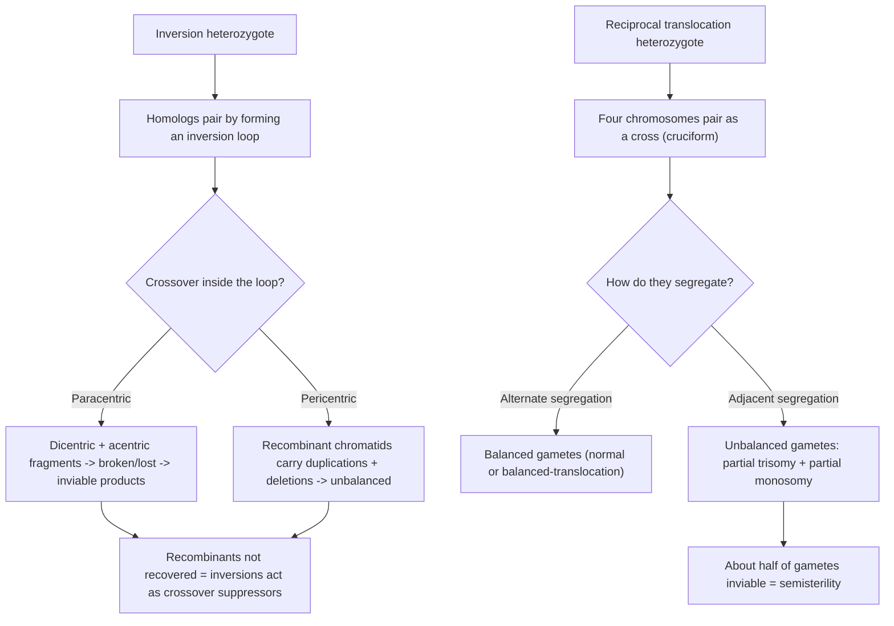
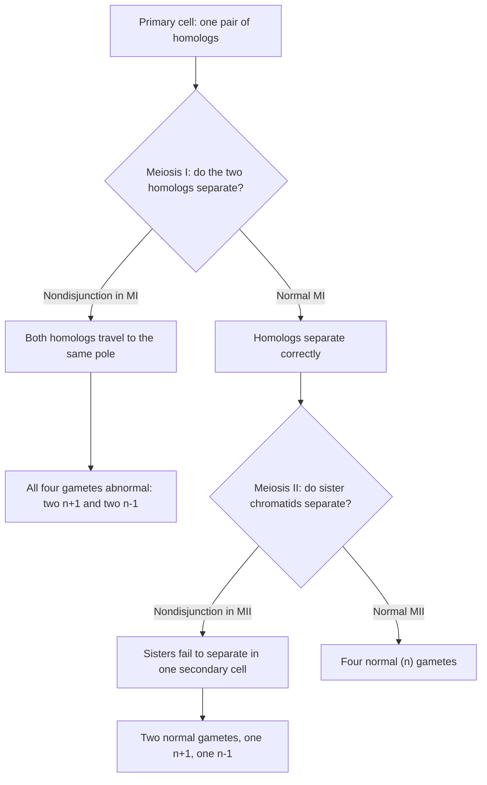
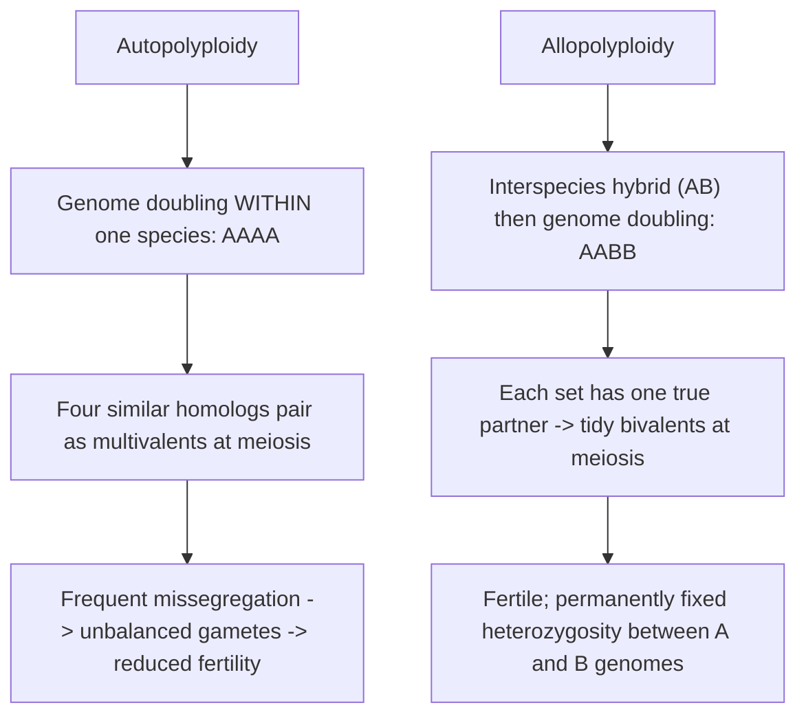
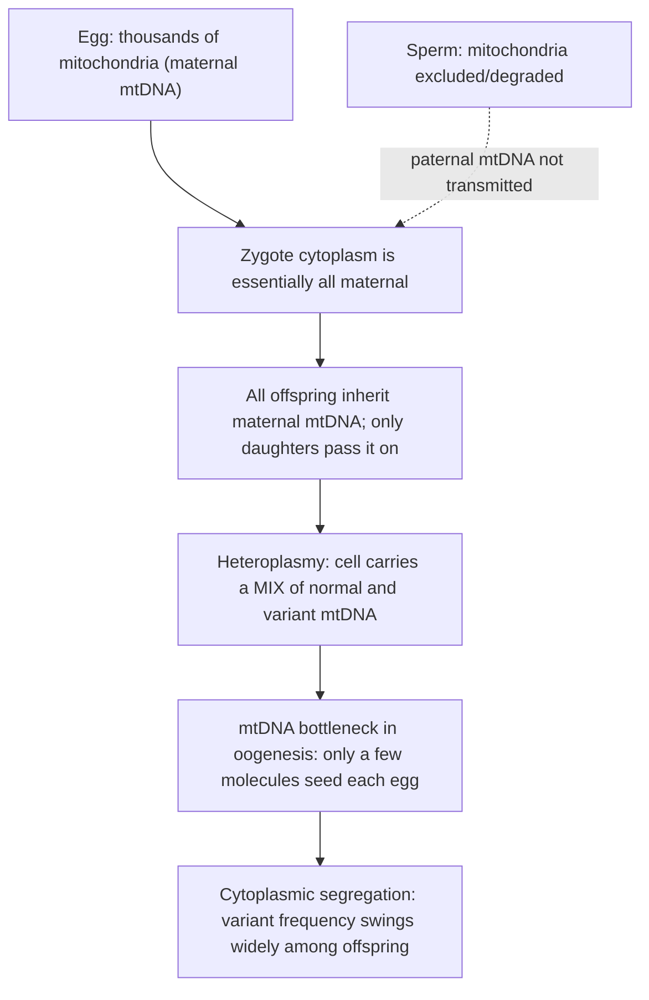

# Rearrangement, Ploidy & Organellar Inheritance

**Course:** BME333 / BIO333 Genetics (UNIST, 2026 Fall) · Lecture 09 · ~60 min
**Syllabus:** [← Course schedule](../../lectures/2026.BME333-BIO333-Syllabus.md) — Week 05 Wed, 09-30
**Languages:** English · [한국어](../../ko/lectures/lec09_Rearrangement-Ploidy-Organellar.md)

## Learning Objectives
By the end of this lecture, students should be able to:
- Classify the major chromosomal rearrangements (deletions, duplications, inversions, translocations) and predict their meiotic and phenotypic consequences.
- Distinguish euploidy from aneuploidy and explain how nondisjunction generates aneuploids such as trisomies.
- Compare autopolyploidy and allopolyploidy and evaluate the evolutionary advantages and costs of whole-genome duplication.
- Describe organellar (mitochondrial/chloroplast) inheritance and contrast it with Mendelian nuclear inheritance (maternal inheritance, heteroplasmy, cytoplasmic segregation).

## Lecture

### 1. Chromosomal rearrangements (~15 min)

The previous lecture treated mutations up to the copy-number scale. Now we zoom out to changes in **chromosome structure** — rearrangements that move, delete, duplicate, or reorient whole blocks of a chromosome. These matter for two reasons: they alter **gene dosage and gene order**, and, because a carrier is usually **heterozygous** for the rearrangement (one normal chromosome, one rearranged), they force the homologs into contorted pairing configurations at meiosis that generate abnormal, often unbalanced, gametes. There are four canonical types.

**Figure — The four structural rearrangements (o = centromere).**
```
Normal:              A — B — o — C — D — E — F — G

Deletion (loses C D):A — B — o — · — · — E — F — G      dosage too low
Duplication (C D):   A — B — o — C — D — C — D — E — F — G   dosage too high
Paracentric inv.:    A — B — o — E — D — C — F — G      (inverted block excludes centromere)
Pericentric inv.:    A — C — o — B — D — E — F — G      (inverted block spans centromere)
Reciprocal transloc.:A — B — o — C — [T U V]           two NON-homologs exchange ends
                     P — Q — o — R — [D E F G]
```

A **deletion** removes a segment; a large deletion is usually harmful because it lowers dosage and can **unmask recessive alleles** on the remaining homolog (**pseudodominance**). A **duplication** adds a copy — raising dosage but also, over evolutionary time, providing **raw material for new genes** (recall subfunctionalization/neofunctionalization in Lecture 03 and Segment 3 below). **Inversions** flip a segment: a **paracentric** inversion lies entirely on one arm (the centromere is *outside* the loop), whereas a **pericentric** inversion *includes* the centromere. **Translocations** move a segment to a non-homologous chromosome; a **reciprocal** translocation is a two-way swap of ends between two non-homologs.

The genetically important behavior appears in **heterozygotes** at meiosis, when the rearranged and normal chromosomes still try to pair gene-for-gene.

**Figure — Meiotic consequences of inversion and translocation heterozygotes.**


To pair with its normal partner, an **inversion heterozygote** must throw the inverted segment into an **inversion loop**. A crossover *within* that loop is catastrophic: for a **paracentric** inversion it yields a **dicentric** chromatid (two centromeres, pulled apart and broken) and an **acentric** fragment (no centromere, lost) — so recombinant products die; for a **pericentric** inversion the recombinants carry **duplications and deletions** and are unbalanced. Either way, **recombinant chromatids are not recovered**, so inversions behave as **crossover suppressors** — exactly the property Muller exploited in his ClB **balancer** chromosome (Lecture 08). This is a satisfying cross-link: the "C" in ClB is an inversion.

A **reciprocal translocation heterozygote** cannot pair as two simple bivalents; the four participating chromosomes align as a **cross (cruciform)**. Segregation from this cross then determines gamete balance. **Alternate segregation** (the two normal chromosomes to one pole, the two translocated to the other) yields **balanced** gametes; **adjacent segregation** yields **unbalanced** gametes with duplications and deletions. Because roughly half the gametes are unbalanced and inviable, translocation heterozygotes typically show **semisterility** (~50% viable gametes) — the diagnostic hallmark. Translocations also **alter linkage**, moving genes onto new chromosomes and thereby changing which genes assort together. A special case is the **Robertsonian translocation**: two **acrocentric** chromosomes fuse near their centromeres to form one metacentric chromosome, **reducing the chromosome count**. Robertsonian fusions explain heritable, **familial** forms of Down syndrome (a 14;21 fusion carrier is phenotypically normal but transmits an extra chromosome-21 dose) — connecting rearrangements directly to the aneuploidy of Segment 2.

### 2. Aneuploidy (~12 min)

**Euploid** cells contain a whole-number multiple of the complete chromosome set (haploid *n*, diploid 2*n*, and so on). **Aneuploidy** is a departure from an exact multiple — the gain or loss of **individual** chromosomes: **monosomy** (2*n* − 1), **trisomy** (2*n* + 1), and the like. Aneuploidy is the leading known cause of human miscarriage and of congenital syndromes, and it matters precisely because chromosomes carry many **dosage-sensitive** genes: having one or three copies instead of two throws off the stoichiometry of large numbers of gene products at once.

Aneuploidy arises chiefly from **nondisjunction** — the failure of chromosomes to separate properly during cell division. The *stage* of failure determines the pattern of abnormal gametes.

**Figure — Nondisjunction in meiosis I vs. meiosis II.**


**Meiosis-I nondisjunction** (homologs fail to separate) makes **all four** products aneuploid; **meiosis-II nondisjunction** (sister chromatids fail to separate) leaves two normal gametes and two aneuploid. Fertilization of an *n* + 1 gamete gives a trisomic zygote; an *n* − 1 gamete gives a monosomic zygote. In humans, most autosomal monosomies and trisomies are lethal early; the survivable ones involve gene-poor or dosage-tolerant chromosomes and the sex chromosomes.

**Figure — Common human aneuploidies.**

| Condition | Karyotype | Chromosome imbalance |
|---|---|---|
| Down syndrome | 47,XX(or XY) +21 | trisomy 21 (extra autosome 21) |
| Edwards syndrome | 47,+18 | trisomy 18 |
| Patau syndrome | 47,+13 | trisomy 13 |
| Turner syndrome | 45,X | monosomy for X (sex chromosome) |
| Klinefelter syndrome | 47,XXY | extra X (sex chromosome) |

That we can even *speak* of "47,+21" is a surprisingly recent achievement. For over three decades the human diploid number was miscounted as **48**, following Painter's 1920s work, until **Tjio and Levan** established **46** in 1956 using cell culture, **hypotonic shock**, and **colchicine** to spread metaphase chromosomes cleanly. Gartler stresses that the long error reflected both poor technique *and* cognitive **preconception** — earlier workers had *seen* 46 but deferred to the accepted figure. The payoff was immediate: within three years the correct count enabled identification of **trisomy 21, 45,X, and 47,XXY**, founding medical cytogenetics (see [en](../../en/review/Gartler2006_NatRevGenet_HumanChromosomeNumber.md) · [ko](../../ko/review/Gartler2006_NatRevGenet_HumanChromosomeNumber.md)). Counting chromosomes was the prerequisite for recognizing that a chromosome was miscounted per cell.

A subtler consequence of aneuploidy closes this segment. Beyond the average effect of extra or missing genes, aneuploidy makes genetically identical cells behave **differently from one another**. Beach et al. built an inducible chromosome-missegregation system in budding yeast and showed that cells with the **same** aneuploid karyotype have **greatly elevated cell-to-cell variability** in cell-cycle timing, stress responses, and gene expression — variability that scales with the *degree* of aneuploidy. This "**non-genetic individuality**" is not inherited (cell-cycle durations across a cell's own divisions were uncorrelated) and is driven partly by stochastic DNA damage (deleting the *RAD9* checkpoint reduced it). The effect held up in **trisomy-13 and trisomy-19 mouse embryos**, which showed variable facial morphology, edema, and hemorrhage among genetically identical littermates (see [en](../../en/article/Beach2017_Cell_Aneuploidy-NonGeneticIndividuality.md) · [ko](../../ko/article/Beach2017_Cell_Aneuploidy-NonGeneticIndividuality.md)). This gives a mechanistic reason why aneuploidy syndromes — and aneuploid cancers — show such variable presentation and drug response: dosage imbalance erodes the **robustness** of many cellular networks at once.

### 3. Ploidy and whole-genome duplication (~15 min)

Where aneuploidy changes *individual* chromosomes, changes in **ploidy** alter the number of **complete sets**. **Polyploidy** — three or more full sets (triploid 3*n*, tetraploid 4*n*, etc.) — is spectacularly common in plants and occurs in some fish and amphibians, and genome analysis shows that many lineages, **including humans**, have **polyploid ancestors** (see [en](../../en/review/Comai2005_NatRevGenet_AdvantagesDisadvantages-BeingPolyploid.md) · [ko](../../ko/review/Comai2005_NatRevGenet_AdvantagesDisadvantages-BeingPolyploid.md)). Polyploidy arises when errors in mitosis or meiosis produce gametes carrying extra chromosome sets. Two routes give two fundamentally different kinds of polyploid.

**Figure — Autopolyploidy vs. allopolyploidy.**


An **autopolyploid** doubles a single species' genome (AAAA); its four near-identical homologs tend to pair as **multivalents**, segregate unevenly, and produce unbalanced gametes — reduced fertility. An **allopolyploid** combines **interspecific hybridization with doubling** (AABB); because each chromosome now has exactly one closely matching partner, meiosis proceeds through orderly **bivalents**, and the polyploid is fertile. Many crops (wheat, cotton, canola) are allopolyploids, which is no accident given the advantages in Segment 4.

An immediate rule falls out: **odd ploidy is sterile.** A triploid (3*n*) cannot partition three sets evenly into gametes — every gamete is unbalanced — so triploids are largely **sterile**. This is exploited agriculturally: seedless watermelons and bananas and many ornamental plants are deliberately triploid. In flowering plants, new polyploids form at ~1 in 100,000, but in higher vertebrates polyploidy tolerance is low — roughly **10% of human spontaneous abortions** are polyploid (see [en](../../en/review/Comai2005_NatRevGenet_AdvantagesDisadvantages-BeingPolyploid.md) · [ko](../../ko/review/Comai2005_NatRevGenet_AdvantagesDisadvantages-BeingPolyploid.md)).

Polyploidy is not only a germline, whole-organism phenomenon; it also happens in **somatic** cells, developmentally and on demand. Many differentiated cells become polyploid by **endoreplication (the endocycle)** — repeated S phases *without* mitosis — a normal feature of liver, placenta, and insect tissues. Grendler et al. show this can be an **adaptive injury response**: in the post-mitotic adult *Drosophila* abdominal epithelium, wounding activates the Hippo-pathway co-activator **Yorkie (Yki)**, which induces **Myc** and **E2f1** to drive **wound-induced polyploidization (WIP)**. Myc alone is sufficient to make 96% of epithelial nuclei polyploid. Crucially, because the tissue constitutively expresses **Fizzy-related (Fzr)** (which degrades mitotic cyclins) and suppresses CycA/CycB, cell-cycle re-entry is **channeled into endoreplication rather than mitosis**. When the authors forced true mitosis (overexpressing *stg* and knocking down *fzr*), wound repair **failed** — with micronuclei and chromatin bridges — because the epithelium constitutively carries low-level DNA damage. Endoreplication **silences the p53-responsive DNA-damage checkpoint**, letting damaged cells grow and heal where mitosis would trigger catastrophe (see [en](../../en/article/Grendler2019_Development_WoundPolyploidy.md) · [ko](../../ko/article/Grendler2019_Development_WoundPolyploidy.md)). Polyploidy, in other words, is a physiological growth strategy, not merely an evolutionary curiosity — with mammalian parallels in kidney tubules, cornea, and cardiomyocytes.

### 4. Advantages and disadvantages of being polyploid (~8 min)

Why is polyploidy so evolutionarily successful in plants yet so costly in vertebrates? Comai frames it as a balance sheet (see [en](../../en/review/Comai2005_NatRevGenet_AdvantagesDisadvantages-BeingPolyploid.md) · [ko](../../ko/review/Comai2005_NatRevGenet_AdvantagesDisadvantages-BeingPolyploid.md)).

**Figure — The polyploidy balance sheet.**

| Advantages | Disadvantages |
|---|---|
| **Heterosis (hybrid vigor):** allopolyploids permanently fix heterozygosity between diverged genomes | **Cell-geometry mismatch:** volume rises faster than nuclear-envelope surface area (~3/2 power), stressing stoichiometry |
| **Gene redundancy / buffering:** extra copies mask recessive deleterious/lethal alleles | **Meiotic & mitotic errors:** multivalents and checkpoint bypass generate aneuploids (30–40% of autotetraploid plant progeny) |
| **Raw material for innovation:** duplicated genes allow sub-/neofunctionalization | **Epigenetic instability:** ~5% of the allopolyploid *Arabidopsis* transcriptome is non-additive, mostly silenced |
| **Reproductive flexibility:** can break self-incompatibility; enables apomixis | **Low tolerance in some lineages:** ~10% of human miscarriages are polyploid |

The central advantage is that whole-genome duplication is a font of **evolutionary novelty**: a duplicated gene is freed to acquire new functions (**neofunctionalization**) or divide the ancestral job (**subfunctionalization**) while the other copy keeps the cell alive. In **allopolyploids**, heterozygosity between the two parental genomes is **permanently fixed** — unlike a diploid F₁ hybrid, which loses half its heterozygosity each generation — so **heterosis** is locked in, a fact of enormous agricultural value. Against this stand real costs: **aneuploidy** (autotetraploids throw 30–40% aneuploid offspring, linking polyploidy to the chromosomal instability seen in cancer), **cell-geometry** imbalances, and pervasive **epigenetic remodeling** (in synthetic *Arabidopsis* allopolyploids ~5% of genes deviate from mid-parent expression, mostly toward silencing). Successful polyploids resolve the tension over time through **diploidization** — losing or repurposing duplicate genes until the genome behaves like a stable diploid, its polyploid origin visible only in the genome sequence (see [en](../../en/review/Comai2005_NatRevGenet_AdvantagesDisadvantages-BeingPolyploid.md) · [ko](../../ko/review/Comai2005_NatRevGenet_AdvantagesDisadvantages-BeingPolyploid.md)).

### 5. Organellar inheritance (~10 min)

Everything so far concerned **nuclear** chromosomes, which obey Mendel because meiosis distributes them equally to gametes. But cells carry additional genomes in their **mitochondria** and (in plants) **chloroplasts**, and these break Mendel's rules in instructive ways. The organellar genomes are small, circular, present in **many copies per cell**, and — decisively — transmitted through the **cytoplasm**, not through the nucleus.

The first consequence is **uniparental (usually maternal) inheritance**. The egg contributes essentially all of the zygote's cytoplasm and therefore essentially all of its organelles; the sperm contributes a nucleus but few or no persisting mitochondria (paternal mitochondria are typically excluded or degraded). So a trait encoded by mtDNA passes from **mother to all offspring**, sons and daughters alike, but is transmitted onward **only by daughters** — a pedigree signature utterly unlike autosomal or X-linked patterns, and one that yields **no Mendelian ratios** in reciprocal crosses (the phenotype tracks the maternal parent).

**Figure — Maternal inheritance, heteroplasmy, and the mtDNA bottleneck.**


The second consequence follows from the many copies. A cell can carry a **mixture** of mtDNA variants — **heteroplasmy** — rather than the clean homo-/heterozygous states of nuclear genes. During cell divisions, organelles are partitioned **randomly** to daughter cells (**cytoplasmic segregation**), so the proportion of a variant can **drift** up or down between lineages with no meiotic bookkeeping. This drift is amplified in the female germline by the **mtDNA bottleneck**: only a small sample of the mother's mtDNA molecules seeds each egg, so a mother of intermediate heteroplasmy can produce offspring ranging from nearly all-normal to nearly all-mutant. This explains the notoriously **variable severity** of mitochondrial diseases within a single family and the existence of a **threshold effect** — a variant causes disease only once its proportion exceeds the level the tissue can tolerate, with energy-hungry tissues (brain, muscle, heart) affected first. Organellar inheritance thus rounds out the lecture's theme: departures from the tidy diploid, meiotic bookkeeping of Mendelian genetics — here not by rearranging or multiplying chromosomes, but by housing genes in a separate, maternally transmitted, multi-copy compartment.

## Key Takeaways
- The four **chromosomal rearrangements** — deletions and duplications (dosage changes), inversions (**paracentric** excludes / **pericentric** includes the centromere), and translocations (**reciprocal**; **Robertsonian** fusion reduces chromosome number) — cause trouble mainly in **heterozygotes** at meiosis.
- **Inversion heterozygotes** form loops; crossing over inside yields dicentric/acentric (paracentric) or duplication/deletion (pericentric) products, so inversions act as **crossover suppressors** (Muller's balancer). **Reciprocal translocation heterozygotes** pair as a cross; **adjacent segregation** gives unbalanced gametes and **~50% semisterility**.
- **Aneuploidy** (monosomy/trisomy) arises by **nondisjunction** — in **MI** all four gametes are abnormal; in **MII** two are — and is harmful through **gene dosage**; human examples: **trisomy 21** (Down), **45,X** (Turner), **47,XXY** (Klinefelter). The human count was fixed at **46** only in 1956 (Tjio & Levan), founding medical cytogenetics; aneuploidy also causes **non-genetic cell-to-cell individuality** (Beach et al.).
- **Polyploidy** changes whole sets: **autopolyploids** (AAAA) pair as multivalents and are semi-sterile; **allopolyploids** (AABB) pair as bivalents and are fertile; **odd ploidy (3n) is sterile** (seedless crops). Polyploidy also occurs somatically via **endoreplication** — an adaptive, p53-checkpoint-silencing **wound-repair** strategy (Grendler et al.).
- Polyploidy's **advantages** (fixed heterosis, gene-redundancy buffering, duplicate genes for sub-/neofunctionalization) trade off against **costs** (aneuploidy, cell-geometry mismatch, epigenetic silencing), resolved over time by **diploidization**.
- **Organellar genomes** are inherited **uniparentally (maternally)** through the cytoplasm, exist in many copies allowing **heteroplasmy**, and segregate randomly (**cytoplasmic segregation**) with an oogenesis **bottleneck** — producing non-Mendelian pedigrees, variable disease severity, and threshold effects.

## Textbook Reading
- **Genetics: From Genes to Genomes (8e)** — Ch. 14 Chromosomal Rearrangements; Ch. 15 Ploidy; Ch. 17 Organellar Inheritance. → [textbook ref](../../lectures/ref.Genetics-FromGenesToGenomes.md)

## Notes in this vault
Reviews & articles to introduce in class (each has a bilingual en/ko pair):
- `Comai2005_NatRevGenet_AdvantagesDisadvantages-BeingPolyploid` — Framework review for the trade-offs of polyploidy; anchor for the ploidy segment. · [en](../../en/review/Comai2005_NatRevGenet_AdvantagesDisadvantages-BeingPolyploid.md) · [ko](../../ko/review/Comai2005_NatRevGenet_AdvantagesDisadvantages-BeingPolyploid.md)
- `Grendler2019_Development_WoundPolyploidy` — Somatic/developmental polyploidy induced by wounding — shows ploidy change as a physiological, not just germline, phenomenon. · [en](../../en/article/Grendler2019_Development_WoundPolyploidy.md) · [ko](../../ko/article/Grendler2019_Development_WoundPolyploidy.md)
- `Gartler2006_NatRevGenet_HumanChromosomeNumber` — History of establishing the human chromosome number; motivates why counting chromosomes (euploidy/aneuploidy) mattered. · [en](../../en/review/Gartler2006_NatRevGenet_HumanChromosomeNumber.md) · [ko](../../ko/review/Gartler2006_NatRevGenet_HumanChromosomeNumber.md)
- `Beach2017_Cell_Aneuploidy-NonGeneticIndividuality` — Aneuploidy as a source of cell-to-cell non-genetic variability; connects chromosome dosage to phenotypic heterogeneity. · [en](../../en/article/Beach2017_Cell_Aneuploidy-NonGeneticIndividuality.md) · [ko](../../ko/article/Beach2017_Cell_Aneuploidy-NonGeneticIndividuality.md)

## Discussion Questions
1. A paracentric and a pericentric inversion both suppress the recovery of crossover products in heterozygotes, but by different physical outcomes. Trace a crossover inside the loop for each case and explain why one yields dicentric/acentric products and the other yields duplication/deletion chromatids. How did Muller exploit this suppression in the ClB balancer of Lecture 08?
2. A reciprocal-translocation heterozygote is phenotypically normal but ~50% semisterile. Using the cruciform pairing figure, explain how alternate vs. adjacent segregation produces balanced vs. unbalanced gametes, and why semisterility is the diagnostic signature.
3. Distinguish the gametes produced by meiosis-I versus meiosis-II nondisjunction. If a child has trisomy 21, what does it take to determine whether the error occurred in MI or MII, and in which parent?
4. Beach et al. argue aneuploidy causes "non-genetic individuality." What evidence shows the cell-to-cell variability is not inherited, and how could this mechanism explain the variable clinical severity of Down syndrome or the drug-resistance heterogeneity of aneuploid cancers — beyond what allelic differences explain?
5. Autopolyploids are often semi-sterile while allopolyploids are fertile, and triploids are essentially sterile. Explain each outcome in terms of how chromosomes pair and segregate at meiosis, and why seedless watermelons are made triploid on purpose.
6. Grendler et al. show that a wounded fly epithelium heals by endoreplication (polyploidy) and heals *worse* when forced into mitosis. Given that the tissue carries chronic DNA damage, explain why polyploid growth is adaptive here, and what this implies about the role of the p53 checkpoint.
7. Mitochondrial mutations produce pedigrees that look nothing like autosomal or X-linked inheritance. Explain how maternal transmission, heteroplasmy, cytoplasmic segregation, and the oogenesis bottleneck together account for a mother of intermediate heteroplasmy having children with widely different disease severity.
