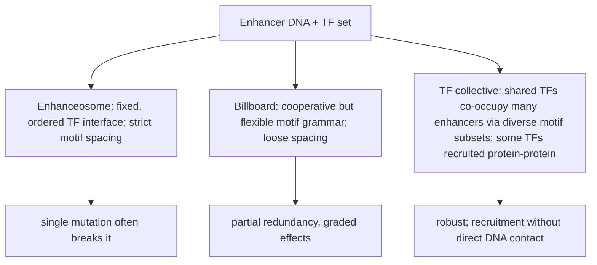
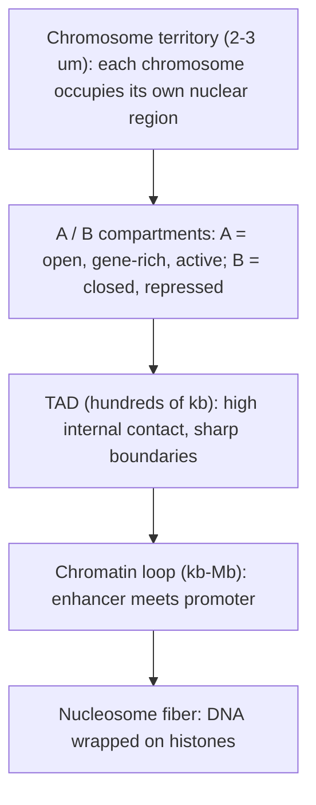
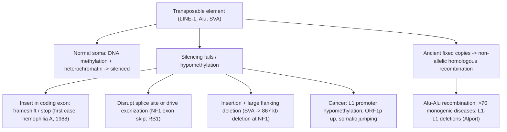

# Gene Regulation & Epigenetics

**Course:** BME333 / BIO333 Genetics (UNIST, 2026 Fall) · Lecture 10 · ~60 min
**Syllabus:** [← Course schedule](../../lectures/2026.BME333-BIO333-Syllabus.md) — Week 06 Wed, 10-07
**Languages:** English · [한국어](../../ko/lectures/lec10_Gene-Regulation-Epigenetics.md)

## Learning Objectives
By the end of this lecture, students should be able to:
- Contrast prokaryotic operon logic with the combinatorial, enhancer-driven regulation of eukaryotic genes.
- Explain how transcription factors, enhancers, and super-enhancers control cell-type-specific transcription.
- Describe how 3D genome organization (TADs, chromatin loops, Hi-C) links distant regulatory elements to their target promoters.
- Define epigenetic regulation (chromatin accessibility, DNA methylation, transposable-element control) and explain its role in cell-type identity and disease.

## Lecture

### 1. From operons to eukaryotic complexity (~8 min)

Every cell in your body carries essentially the same genome, yet a neuron, a red blood cell, and a liver cell look and behave nothing alike. The difference is not *which* genes they carry but *which genes they express, when, and how strongly*. **Gene regulation** — the control of when and how much a gene is transcribed — is therefore the central problem that connects a static genome sequence to the dynamic, differentiated cells of a living organism. We begin with the simplest, best-understood case (bacteria) and then confront the much larger challenge eukaryotes solve.

In prokaryotes, related genes are frequently grouped into an **operon**: a cluster of co-transcribed genes controlled by a single promoter and producing one polycistronic mRNA. The classic example is the ***lac* operon** of *E. coli*, which encodes the enzymes to import and cleave lactose. Its logic is built from two kinds of regulatory protein. A **repressor** is a protein that binds a DNA sequence called the **operator** (overlapping the promoter) and physically blocks RNA polymerase; an **activator** is a protein that binds near the promoter and *helps* recruit polymerase. Regulation is achieved because small-molecule signals change the DNA-binding shape of these proteins (**allosteric control**).

The *lac* operon integrates two signals through this logic. Lactose (via its isomer allolactose) is an **inducer**: it binds the LacI repressor, prying it off the operator so transcription can proceed — this makes the operon **inducible** (off by default, switched on by the substrate). Glucose acts through **catabolite repression**: when glucose is scarce, cyclic AMP rises, cAMP binds the activator **CAP (CRP)**, and CAP–cAMP binds upstream to strongly recruit polymerase. The operon fires hard only when lactose is present *and* glucose is absent — a biological AND gate built from one repressor and one activator.

**Figure — The *lac* operon as a two-input logic gate.**

| Lactose (inducer) | Glucose | LacI repressor | CAP–cAMP activator | Transcription |
|---|---|---|---|---|
| absent | present | bound to operator (blocks) | inactive (low cAMP) | **OFF** (no need) |
| absent | absent | bound to operator (blocks) | active (high cAMP) | **OFF** (no substrate) |
| present | present | released | inactive (low cAMP) | **LOW** (basal) |
| present | absent | released | active, recruits Pol | **HIGH** (full induction) |

Operons work because bacteria face fast, discrete environmental switches and have small genomes with little non-coding DNA. Eukaryotic development poses a fundamentally harder problem: a single genome must specify hundreds of stable cell types, each expressing a distinct combination of thousands of genes, and each state must be *heritable through cell division*. Eukaryotes meet this with three features bacteria largely lack: (1) genes are individually transcribed (no operons), so each needs its own controls; (2) DNA is wrapped in **chromatin**, which can hide or expose regulatory DNA; and (3) regulation is **combinatorial and long-range** — many transcription factors act together through elements that can sit tens of kilobases to megabases away from the gene they control. The rest of this lecture unpacks these three ideas.

**Figure — Two regulatory paradigms contrasted.**

| Feature | Prokaryote (operon) | Eukaryote |
|---|---|---|
| Gene grouping | polycistronic operon | one gene, one transcript |
| Distance of control | operator at promoter | enhancers kb–Mb away |
| Packaging | naked DNA, freely accessible | nucleosomal chromatin (gated) |
| Logic | few inputs, fast switch | many TFs, combinatorial |
| Heritability of state | not needed | epigenetic memory across divisions |
| Signal | small-molecule allostery | signaling → TF activity + chromatin |

### 2. Transcription factors and enhancers (~12 min)

A **transcription factor (TF)** is a protein that binds a specific DNA sequence and thereby influences transcription of nearby genes. The paradox at the heart of eukaryotic regulation is that TFs recognize only **short, degenerate motifs of ~6–12 bp** (see [en](../../en/review/Spitz2012_NatRevGenet_TF-Enhancers.md) · [ko](../../ko/review/Spitz2012_NatRevGenet_TF-Enhancers.md)). A 6–8 bp motif occurs by chance roughly every few kilobases, so a single TF's motif appears millions of times across a genome — far too imprecise to explain the exquisite specificity of, say, turning on one gene in one tissue at one moment. Specificity must therefore come from *additional layers* beyond intrinsic binding affinity.

The primary solution is **combinatorial binding**: precise expression is achieved not by one TF but by the *co-occupancy of several TFs* whose expression domains overlap only in the target cells. The canonical demonstration is the **gap-gene enhancers of early *Drosophila* segmentation**, where combinations of maternal and gap TFs read positional gradients to draw sharp stripes of expression; in vertebrates, SMAD proteins acquire specificity through cell-type-specific partner factors (see [en](../../en/review/Spitz2012_NatRevGenet_TF-Enhancers.md) · [ko](../../ko/review/Spitz2012_NatRevGenet_TF-Enhancers.md)). TFs bind **cooperatively** — directly (protein–protein contact between adjacent sites) or indirectly (shared co-factor recruitment, **assisted loading** where one TF keeps a nucleosome displaced so another can bind, or DNA-bending by architectural proteins like HMG factors). Cooperativity converts graded inputs into **switch-like ON/OFF outputs**, buffering noise in TF concentration and producing crisp expression boundaries in developmental gradients.

These TFs assemble on **enhancers** — cis-regulatory DNA elements that activate transcription of a target promoter **independent of their distance and orientation**, often acting from tens or hundreds of kilobases away. This "action at a distance" is the defining and, at first, most counterintuitive property of eukaryotic regulation.

**Figure — An enhancer acts at a distance on a promoter.**
```
   enhancer (bound by TF combination)                promoter        gene body
   [====oooo====]······················ (10-100+ kb) ·····[TATA]===[ exon1  exon2 ...]==>
        ||||                                                 |
     TF1 TF2 TF3  --- co-activators (Mediator, p300) --- RNA Pol II
        \_______________ DNA loops to bring the two together _______________/
```

How can an enhancer physically influence a promoter across such distances? The DNA **loops**, bringing the enhancer-bound TF complex into direct contact with the promoter and its polymerase machinery, bridged by co-activators such as **Mediator** and the acetyltransferase **p300/CBP**. This looping is the microscopic reason the 3D folding of the genome (Segment 4) matters so much.

Enhancers themselves come in different architectural "grammars," and which model applies has real consequences for how mutations behave (see [en](../../en/review/Spitz2012_NatRevGenet_TF-Enhancers.md) · [ko](../../ko/review/Spitz2012_NatRevGenet_TF-Enhancers.md)):

**Figure — Three models of enhancer architecture.**


A critical subtlety for interpreting genomic data: a large fraction of TF-binding events detected by **ChIP-seq (chromatin immunoprecipitation + sequencing)** — roughly 75–90% in higher eukaryotes — do **not** correlate with any change in the neighboring gene's expression (see [en](../../en/review/Spitz2012_NatRevGenet_TF-Enhancers.md) · [ko](../../ko/review/Spitz2012_NatRevGenet_TF-Enhancers.md)). Binding is not the same as function. Some of this "silent" binding reflects redundancy, some is transient/kinetic, and some is **priming** by **pioneer factors** — TFs (FOXA1, MyoD, PU.1, PAX5) that can engage nucleosomal DNA that other factors cannot, recruit remodelers, deposit the enhancer mark **H3K4me1**, and protect the DNA from methylation, thereby readying an enhancer for activation at a *later* developmental stage. In *Drosophila*, the pioneer **Zelda** globally primes the genome for zygotic activation at the maternal-to-zygotic transition. This explains why knocking out a master TF often produces a phenotype only later in development, and why the same enhancer can be "poised" long before its gene turns on.

### 3. Super-enhancers and cell identity (~8 min)

If ordinary enhancers switch genes on, are there elements that switch on the *identity-defining* genes? The term **super-enhancer** was coined for clusters of enhancers with unusually high co-activator loading. The original operational definition, applied to mouse embryonic stem cells (mESCs), had three steps (see [en](../../en/review/Pott2015_NatGenet_SuperEnhancers.md) · [ko](../../ko/review/Pott2015_NatGenet_SuperEnhancers.md)): (1) find enhancers as ChIP-seq peaks for the master TFs Oct4, Sox2, and Nanog; (2) **stitch** together enhancers lying within 12.5 kb of one another into a single unit; (3) rank the stitched units by total **Mediator (Med1)** signal and call the top tail — fewer than ~3% of regions, above an inflection point on the ranked curve — "super-enhancers."

Their reported properties are striking: they are large (median ~8,667 bp vs ~703 bp for typical mESC enhancers), heavily enriched for RNA Pol II, eRNA transcription, p300/CBP, cohesin, and the marks H3K27ac and H3K4me1, and they sit next to the genes that *define the cell*: in mESCs the pluripotency genes Oct4/Sox2/Nanog; in cancer cells, oncogenes such as *MYC*. They are cell-type-specific and are enriched for disease-associated SNPs in a cell-type-specific manner — making them attractive targets (see [en](../../en/review/Pott2015_NatGenet_SuperEnhancers.md) · [ko](../../ko/review/Pott2015_NatGenet_SuperEnhancers.md)).

But Pott and Lieb's review is deliberately skeptical, and the skepticism is a good lesson in reading genomics critically. They raise five concerns: (1) the definition is **circular** — high Mediator is both the identification criterion and the claimed source of function; (2) clustering is neither necessary nor sufficient (15% of mESC super-enhancers are single, un-stitched enhancers; only 15% of stitched regions qualify); (3) the threshold is an **arbitrary inflection point** on a continuous distribution, with no biological discontinuity; (4) their constituent enhancers are individually strong, consistent with ordinary cooperativity rather than an emergent new mechanism; and (5) they overlap substantially with regulatory entities defined years earlier — **locus control regions (LCRs)**, clusters of open regulatory elements, and stretch enhancers. The verdict: "super-enhancer" is a *useful operational label* for cataloguing strong, identity-associated regulatory regions, but the claim that it is a mechanistically novel class is not yet proven. The proper test is **reverse genetics** — CRISPR-Cas9 deletion of individual constituent enhancers to ask whether they cooperate or merely add up.

**Figure — How super-enhancers are defined (and why the threshold is contested).**
```
Med1 ChIP-seq signal per (stitched) enhancer, ranked high -> low

signal |*
       | *
       |  *
       |   *   <-- arbitrary "inflection point": everything left = super-enhancer (<3%)
       |    *_
       |      *___
       |          *________
       |                   *_______________________  (thousands of "typical" enhancers)
       +----------------------------------------------------> rank
        few identity genes (Oct4, Sox2, Nanog, MYC)      most genes
```

### 4. 3D genome architecture (~13 min)

Because enhancers act across large linear distances, the *physical folding* of chromosomes in the nucleus is not incidental — it is a layer of regulation in its own right. The tool that made this measurable is **Hi-C** (see [en](../../en/article/Lieberman-Aiden2009_Science_HiC-3DGenome.md) · [ko](../../ko/article/Lieberman-Aiden2009_Science_HiC-3DGenome.md)). Hi-C works by **proximity ligation**: crosslink cells with formaldehyde (freezing DNA segments that are close in 3D), digest with a restriction enzyme, fill the ends with a **biotinylated** nucleotide, ligate under dilute conditions so that only crosslinked (physically neighboring) fragments join, shear, pull down the biotin junctions, and sequence paired ends. Each read pair reports "these two loci were touching." Applied to a human lymphoblastoid line at 1-Mb resolution, the first Hi-C generated **6.7 million long-range contacts** — the first genome-wide 3D contact map (see [en](../../en/article/Lieberman-Aiden2009_Science_HiC-3DGenome.md) · [ko](../../ko/article/Lieberman-Aiden2009_Science_HiC-3DGenome.md)).

Hi-C revealed a nested hierarchy of organization (see [en](../../en/review/Matharu2015_PLoSGenet_TAD-ChromatinLoops.md) · [ko](../../ko/review/Matharu2015_PLoSGenet_TAD-ChromatinLoops.md), [en](../../en/review/Misteli2020_Cell_3Dgenome-SelfOrganizing.md) · [ko](../../ko/review/Misteli2020_Cell_3Dgenome-SelfOrganizing.md)):

**Figure — The hierarchy of 3D genome organization.**


Three findings from that first paper anchor the picture (see [en](../../en/article/Lieberman-Aiden2009_Science_HiC-3DGenome.md) · [ko](../../ko/article/Lieberman-Aiden2009_Science_HiC-3DGenome.md)). First, **chromosome territories** were confirmed genome-wide: intrachromosomal contacts always exceed interchromosomal ones, and small gene-rich chromosomes (16, 17, 19–22) cluster together near the nuclear center while gene-poor chromosome 18 stays peripheral — matching decades-old FISH microscopy. Second, a "plaid" pattern in the contact matrix revealed two spatial **compartments**: **A** (correlated with gene density, active transcription, DNaseI accessibility, H3K36me3) and **B** (denser, closed, repressed) — a molecular counterpart to the old cytological euchromatin/heterochromatin distinction. Third, within compartments, contact probability scaled as **s⁻¹** between 500 kb and 7 Mb, matching a **fractal (knot-free) globule** rather than an equilibrium globule (which predicts s^-3/2); a fractal globule is attractive because it packs ~2 m of DNA without knots and can be locally unfolded and refolded for transcription.

Later, higher-resolution Hi-C revealed **topologically associating domains (TADs)** — genomic regions, typically hundreds of kb, of high internal contact frequency bounded by sharp drops. TAD boundaries are enriched for the insulator protein **CTCF** and the ring-shaped complex **cohesin**, are conserved between human and mouse, and coincide with DNA replication-timing transitions (see [en](../../en/review/Matharu2015_PLoSGenet_TAD-ChromatinLoops.md) · [ko](../../ko/review/Matharu2015_PLoSGenet_TAD-ChromatinLoops.md)). TADs are formed largely by **loop extrusion**: cohesin reels DNA through its ring, growing a loop until it is halted by CTCF sites in convergent orientation, so a TAD is effectively an insulated regulatory neighborhood in which enhancers can reach their promoters but not those in the next domain.

**Figure — Loop extrusion builds a TAD; CTCF marks the fence.**
```
CTCF>                                                  <CTCF   (convergent CTCF halt sites)
  |------------------- one TAD (insulated neighborhood) -------------------|
  |   enh --- promoter A     promoter B                                    |
  |     \_______/  (loops OK inside)                                       |
  |                                                                        |
  cohesin ring extrudes DNA -> -> growing loop -> stops at CTCF boundaries
  ---||====================( enhancer can find promoters here )============||---  next TAD -->
```

Why does this matter clinically? Because disrupting a boundary rewires which enhancer talks to which gene — producing **"TADopathies"** (see [en](../../en/review/Matharu2015_PLoSGenet_TAD-ChromatinLoops.md) · [ko](../../ko/review/Matharu2015_PLoSGenet_TAD-ChromatinLoops.md)). Examples: inversions that place ectopic enhancers next to oncogenes in leukemia; a SNP that weakens looping at the *OCA2* pigmentation locus; a ~660-kb deletion that erases a TAD so that *LMNB1* is "adopted" by foreign enhancers, causing adult-onset leukodystrophy; and rearrangements at the chromosome-2q35 cluster (*WNT6/IHH*, *EPHA4*, *PAX3*) that produce *different* limb malformations depending on *which* boundary is broken. This is why a "silent" non-coding variant can be pathogenic: it changes the genome's 3D wiring, not any protein.

Misteli's synthesis reframes all of this as **self-organization** rather than a hard-wired blueprint (see [en](../../en/review/Misteli2020_Cell_3Dgenome-SelfOrganizing.md) · [ko](../../ko/review/Misteli2020_Cell_3Dgenome-SelfOrganizing.md)). Loops, TADs, and compartments emerge from four interacting principles: (1) **polymer physics** — computational models of a self-avoiding polymer with only local diffusion and homotypic (like-with-like) contacts spontaneously generate loops/TADs/compartments, and adding CTCF/cohisin sites sharpens them; (2) **dynamics** — chromatin diffuses within ~1 μm and TFs spend >95% of their time diffusing or in non-specific contacts, so structures persist as *dynamic steady states* despite rapid component exchange; (3) **phase separation** — proteins with intrinsically disordered regions form liquid-like condensates (HP1α at heterochromatin; Pol II/Mediator hubs at super-enhancers); (4) **architectural constraints** — the nuclear lamina tethers repressive **lamina-associated domains (LADs)** to the periphery. A key consequence: **most individual chromatin loops occur in only 5–30% of cells at any moment** — the genome is ordered on average but heterogeneous cell-to-cell, with each cell-type expression program acting as a stable "attractor" state.

### 5. Chromatin accessibility and methods (~7 min)

All of the above depends on whether a regulatory element is physically reachable. Eukaryotic DNA is packaged into **nucleosomes** — 147 bp of DNA wrapped around a histone octamer — and a nucleosome-occluded site is generally inert. **Chromatin accessibility** — whether a region is "open" or "closed" — is therefore the gatekeeper of regulation: open regions coincide with active enhancers, promoters, and insulators, and only open DNA permits TF binding (see [en](../../en/review/Klein2020_ChromosomeRes_DNAAccessibility-Methods.md) · [ko](../../ko/review/Klein2020_ChromosomeRes_DNAAccessibility-Methods.md)). Measuring accessibility (and where proteins bind) is thus the experimental foundation of modern regulatory genomics.

**Figure — Methods for reading chromatin state.**

| Method | What it detects | Principle | Notable point |
|---|---|---|---|
| **DNase-seq** | open chromatin (DHS) | DNase I cuts unprotected DNA | ENCODE mapped **>2.9 million** DHSs across human tissues |
| **FAIRE-seq** | open chromatin | phenol extraction of nucleosome-free DNA | simple but low signal-to-noise |
| **MNase-seq** | nucleosome positions | MNase digests linker DNA | maps nucleosomes + sub-nucleosomal TF footprints |
| **ATAC-seq** | open chromatin | hyperactive Tn5 inserts adapters into accessible DNA | fast 2-step; works at **single-cell** scale |
| **ChIP-seq** | where a given protein binds | crosslink + antibody pull-down | field workhorse (>23,000 papers); needs good antibody |
| **DamID** | protein binding | Dam methyltransferase marks nearby GATC | antibody-free; ~5 kb resolution |
| **CUT&RUN** | where a protein binds | Protein A-MNase cleaves at antibody site in intact nuclei | near-bp resolution, low background, ~1,000 cells (2017) |

The trend the review emphasizes is toward **single cells and precious samples** (see [en](../../en/review/Klein2020_ChromosomeRes_DNAAccessibility-Methods.md) · [ko](../../ko/review/Klein2020_ChromosomeRes_DNAAccessibility-Methods.md)): scDNase-seq, single-cell ATAC-seq, and single-cell CUT&RUN now profile regulatory states in rare progenitors, patient biopsies, and early embryos where bulk assays would be swamped by cell-type mixing. Each method is a trade-off among resolution, cell input, antibody dependence, and artifact — and the future lies in *integrating* accessibility, TF binding, histone marks, and 3D contacts in the same cell.

### 6. Epigenetics: methylation, TEs, and cell types (~12 min)

We can now assemble the last piece: how regulatory states become *heritable* across cell divisions, and how they build — and misbuild — cell identity. **Epigenetics** refers to heritable changes in gene expression that do not alter the DNA sequence itself — carried by chromatin modifications, nucleosome positioning, and **DNA methylation** (addition of a methyl group to cytosine, typically at CpG sites, generally repressive when dense at promoters). Together with the histone marks met earlier (H3K4me1 at enhancers, H3K27ac at active elements, H3K9me2/3 and H3K27me3 at repressed chromatin and LADs), these constitute a cell's **epigenome** — a state that can be copied when the cell divides, giving cells *memory* of what they are.

A dramatic application of this repressive machinery is the control of **transposable elements (TEs)** — mobile, repetitive sequences that make up roughly **half the human genome** (see [en](../../en/review/Payer2019_NatRevGenet_TE-Disease.md) · [ko](../../ko/review/Payer2019_NatRevGenet_TE-Disease.md)). The only autonomously active human TE is **LINE-1 (L1)**, ~6 kb long, encoding ORF1p (RNA-binding) and ORF2p (endonuclease + reverse transcriptase); L1 makes up ~17% of the genome and copies itself by **target-primed reverse transcription**. Non-autonomous **Alu** elements (~11% of the genome) and SVAs hijack L1's proteins to move. Left unchecked, these are mutagens — so the cell **silences them by heterochromatinization and DNA methylation**. When that silencing fails, disease follows.

**Figure — TE control and the consequences of its failure.**


The disease catalog is instructive (see [en](../../en/review/Payer2019_NatRevGenet_TE-Disease.md) · [ko](../../ko/review/Payer2019_NatRevGenet_TE-Disease.md)): the first reported de novo L1 insertion caused hemophilia A (1988); an SVA in the *FKTN* 3′UTR accounts for **80%** of Fukuyama congenital muscular dystrophy alleles in Japan; an SVA in *TAF1* causes X-linked dystonia-parkinsonism in the Filipino population. Over **16,000 polymorphic TEs** segregate in humans (~24% of known structural variants; >6,500 common enough to affect complex-disease risk), and some act as eQTLs — e.g., an Alu near *CD58* linked to multiple sclerosis. TEs are thus a major, historically underappreciated source of functional genetic variation, distinct from ordinary copy-number variants because they carry their *own* promoters and splice signals.

Finally, this regulatory/epigenetic machinery is what *creates* new cell types over evolution. Arendt et al. redefine a **cell type** not by morphology but as an **evolutionary unit** — a set of cells that evolves with some independence because it uses its own genomic regulatory information (see [en](../../en/review/Arendt2016_NatRevGenet_OriginEvolution-CellTypes.md) · [ko](../../ko/review/Arendt2016_NatRevGenet_OriginEvolution-CellTypes.md)). The molecular core of cell identity is the **core regulatory complex (CoRC)** — a set of terminal-selector TFs and their interactions that maintains the cell-type-specific expression program. The spinal-cord example is clean: V2a interneurons and motor neurons *share* Lhx3 and NLI, but motor neurons add **Isl1** to form a distinct complex — a small change in protein–protein interaction that switches fate and represses the alternative. New cell types arise by **genetic individuation** (an initially uniform population diverging into distinct "sister" cell types) plus new cellular modules (**apomeres**) built by integrating or diverging pre-existing modules — as the neuronal synapse integrated adhesion, secretory, and receptor machinery, and as rod/cone phototransduction cascades diverged after whole-genome duplication. Crucially, developmental lineage and evolutionary lineage need not coincide, so comparing regulatory signatures (CoRCs) — now feasible at scale with single-cell RNA-seq — is a more reliable guide to cell-type relationships than morphology. Gene regulation, in other words, is not only how a genome runs a cell; over evolutionary time it is how genomes invent new kinds of cells.

## Key Takeaways
- **Regulation, not gene content, distinguishes cell types**: all cells share a genome; identity is set by which genes are expressed.
- **Prokaryotic operons** use a few repressors/activators under allosteric control (the *lac* operon as an AND gate: on only when lactose is present and glucose absent); **eukaryotes** use one-gene transcripts, chromatin gating, and combinatorial long-range control.
- **TFs bind short degenerate motifs**, so specificity comes from **combinatorial, cooperative** binding at **enhancers** that act at a distance via DNA looping; **pioneer factors** pre-prime enhancers, and most ChIP-seq binding events (~75–90%) are not directly functional.
- **Super-enhancers** are large, Mediator-rich clusters near identity/oncogene loci — operationally useful but defined by an arbitrary threshold; their novelty must be tested by CRISPR deletion.
- **Hi-C** revealed a nested 3D hierarchy — chromosome territories, A/B compartments, TADs (built by cohesin loop extrusion, fenced by CTCF), and enhancer–promoter loops; disrupting TAD boundaries causes **"TADopathies."**
- The genome is **self-organizing** (polymer physics + dynamics + phase separation + lamina constraints): ordered on average, heterogeneous cell-to-cell.
- **Chromatin accessibility** gates TF binding; ATAC-seq, DNase-seq, ChIP-seq, and CUT&RUN (now at single-cell scale) read regulatory state.
- **Epigenetic silencing** (methylation + heterochromatin) restrains transposable elements (~half the genome); its failure causes disease, and regulatory/epigenetic programs (CoRCs) build and diversify cell types over evolution.

## Textbook Reading
- **Genetics: From Genes to Genomes (8e)** — Ch. 18 Gene Regulation in Prokaryotes; Ch. 19 Gene Regulation in Eukaryotes; Ch. 20 Epigenetics. → [textbook ref](../../lectures/ref.Genetics-FromGenesToGenomes.md)

## Notes in this vault
Reviews & articles to introduce in class (each has a bilingual en/ko pair):
- `Spitz2012_NatRevGenet_TF-Enhancers` — Core review of transcription factors and enhancer function; anchor for the cis-regulation segment. · [en](../../en/review/Spitz2012_NatRevGenet_TF-Enhancers.md) · [ko](../../ko/review/Spitz2012_NatRevGenet_TF-Enhancers.md)
- `Pott2015_NatGenet_SuperEnhancers` — Critical look at super-enhancers and what defines them; use to discuss cell-identity genes. · [en](../../en/review/Pott2015_NatGenet_SuperEnhancers.md) · [ko](../../ko/review/Pott2015_NatGenet_SuperEnhancers.md)
- `Matharu2015_PLoSGenet_TAD-ChromatinLoops` — TADs and chromatin loops as the structural basis of enhancer–promoter regulation. · [en](../../en/review/Matharu2015_PLoSGenet_TAD-ChromatinLoops.md) · [ko](../../ko/review/Matharu2015_PLoSGenet_TAD-ChromatinLoops.md)
- `Misteli2020_Cell_3Dgenome-SelfOrganizing` — Conceptual synthesis of the genome as a self-organizing 3D system. · [en](../../en/review/Misteli2020_Cell_3Dgenome-SelfOrganizing.md) · [ko](../../ko/review/Misteli2020_Cell_3Dgenome-SelfOrganizing.md)
- `Lieberman-Aiden2009_Science_HiC-3DGenome` — The landmark Hi-C paper that made 3D genome folding measurable. · [en](../../en/article/Lieberman-Aiden2009_Science_HiC-3DGenome.md) · [ko](../../ko/article/Lieberman-Aiden2009_Science_HiC-3DGenome.md)
- `Klein2020_ChromosomeRes_DNAAccessibility-Methods` — Methods for measuring chromatin accessibility; grounds the epigenomics techniques. · [en](../../en/review/Klein2020_ChromosomeRes_DNAAccessibility-Methods.md) · [ko](../../ko/review/Klein2020_ChromosomeRes_DNAAccessibility-Methods.md)
- `Payer2019_NatRevGenet_TE-Disease` — Transposable elements, their regulation, and disease consequences of derepression. · [en](../../en/review/Payer2019_NatRevGenet_TE-Disease.md) · [ko](../../ko/review/Payer2019_NatRevGenet_TE-Disease.md)
- `Arendt2016_NatRevGenet_OriginEvolution-CellTypes` — How regulatory/epigenetic programs give rise to and diversify cell types. · [en](../../en/review/Arendt2016_NatRevGenet_OriginEvolution-CellTypes.md) · [ko](../../ko/review/Arendt2016_NatRevGenet_OriginEvolution-CellTypes.md)

## Discussion Questions
1. The *lac* operon achieves two-input logic with a single repressor and a single activator. Sketch how a eukaryotic gene might achieve comparable "AND" logic using enhancers and combinatorial TF binding. Why can eukaryotes not simply copy the operon strategy for a gene that must be on only in one tissue at one developmental stage?
2. Roughly 75–90% of ChIP-seq TF-binding events show no correlation with neighboring gene expression. List at least three explanations (redundancy, kinetics, pioneer/priming) and describe an experiment that would distinguish a *functional* enhancer-bound TF from a non-functional binding event.
3. Pott and Lieb argue the super-enhancer threshold is an arbitrary inflection point on a continuous distribution. Does an operational definition need a mechanistic basis to be scientifically useful? Design a CRISPR experiment that would test whether super-enhancer constituents truly *cooperate* rather than simply add.
4. A patient carries a non-coding deletion that removes a CTCF-bound TAD boundary but no protein-coding sequence, yet has a limb malformation. Using the concept of TADopathies, explain mechanistically how a "silent" variant causes disease, and what data (Hi-C, expression) you would gather to prove it.
5. Transposable elements make up ~half the genome and are normally silenced by methylation and heterochromatin. Discuss the tension between TEs as pathogenic mutagens and TEs as raw material for regulatory innovation (e.g., co-option into gene-regulatory networks and cell-type evolution). When is derepression a bug, and when is it a feature?
