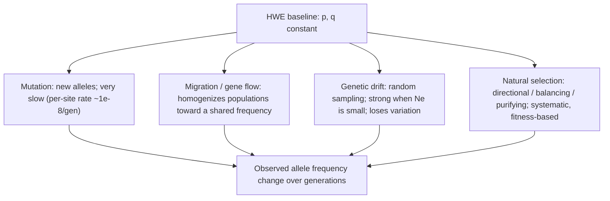

# Real World Genetics — Variation in Population

**Course:** BME333 / BIO333 Genetics (UNIST, 2026 Fall) · Lecture 11 · ~60 min
**Syllabus:** [← Course schedule](../../lectures/2026.BME333-BIO333-Syllabus.md) — Week 07 Mon, 10-12
**Languages:** English · [한국어](../../ko/lectures/lec11_Population-Variation.md)

## Learning Objectives
By the end of this lecture, students should be able to:
- State the Hardy–Weinberg principle, its assumptions, and use it to compute allele and genotype frequencies.
- Explain how mutation, migration, drift, and selection perturb allele frequencies away from HWE.
- Define effective population size and describe how it shapes levels of genetic variation.
- Interpret measures of population variation (heterozygosity, runs of homozygosity, genomic islands of divergence) from real datasets such as the HGDP.

## Lecture

### 1. Hardy–Weinberg equilibrium (~14 min)

Mendel taught us how alleles pass from one individual to its offspring. Population genetics asks a different question: what happens to allele frequencies across a *whole population* over generations? The foundation — the "null model" against which all evolution is measured — is the **Hardy–Weinberg principle**. It states that in a large, randomly mating population free of evolutionary forces, both **allele frequencies** and **genotype frequencies** stay constant across generations, and the genotype frequencies are a simple function of the allele frequencies.

Consider one gene with two alleles, *A* (frequency **p**) and *a* (frequency **q**), where by definition **p + q = 1**. If mating is random, forming a zygote is like drawing two gametes at random from the population gene pool. The probability of drawing *A* is *p* and of *a* is *q*, so the genotype frequencies follow directly from multiplying the gamete frequencies:

**Figure — The Hardy–Weinberg genotype frequencies as a gamete-union table.**

|                | sperm **A** (p) | sperm **a** (q) |
|----------------|-----------------|-----------------|
| **egg A** (p)  | AA = p²         | Aa = pq         |
| **egg a** (q)  | Aa = pq         | aa = q²         |

Summing the cells gives the **Hardy–Weinberg equation**:

$$p^2 + 2pq + q^2 = 1$$

so genotype frequencies are **p² AA : 2pq Aa : q² aa**. The crucial results are: (1) after a *single* generation of random mating, genotype frequencies reach these proportions regardless of the starting genotype mix; and (2) thereafter they, and the allele frequencies, stay put forever — the population is at **equilibrium**. There is no inherent tendency for a dominant allele to increase or a recessive allele to disappear.

That last point is exactly why the principle was discovered. In 1908 the geneticist Udny Yule argued that if brachydactyly (short-fingeredness) were dominant, the population should drift toward three brachydactylous people per one normal (see [en](../../en/article/Hardy1908_Science_HardyWeinberg.md) · [ko](../../ko/article/Hardy1908_Science_HardyWeinberg.md)). R. C. Punnett could not immediately refute this and took the question to his mathematician friend **G. H. Hardy** at Trinity College, Cambridge. Hardy showed with "multiplication-table mathematics" that dominance is irrelevant: starting from any ratio *p : 2q : r*, one round of random mating gives (p+q)² : 2(p+q)(q+r) : (q+r)², and the distribution is stable when *q² = pr* — reached immediately in the next generation (see [en](../../en/article/Hardy1908_Science_HardyWeinberg.md) · [ko](../../ko/article/Hardy1908_Science_HardyWeinberg.md)). His numerical example: a dominant trait at 1:10,000 merely doubles to ~2:10,000 and then holds; a recessive one drops once and holds. The same result had actually been derived *earlier the same year* by **Wilhelm Weinberg** in Stuttgart (13 January 1908), starting from arbitrary homozygote frequencies and using the binomial theorem directly — hence "**Hardy–Weinberg**" (see [en](../../en/review/Edwards2008_Genetics_HWE.md) · [ko](../../ko/review/Edwards2008_Genetics_HWE.md)). Edwards's historical review stresses the deeper irony: HWE is nothing more than a direct consequence of **Mendel's first law**, and the only reason it took years to state was the bitter feud between Pearson's biometricians and Bateson's Mendelians, which kept people from reading Mendel carefully (see [en](../../en/review/Edwards2008_Genetics_HWE.md) · [ko](../../ko/review/Edwards2008_Genetics_HWE.md)).

The power of HWE lies in its **five assumptions**, because each assumption that fails corresponds to a real evolutionary force. HWE is the "nothing is happening" baseline; departures from it are how we *detect* that something is happening.

**Figure — The five HWE assumptions and the force that violates each.**

| Assumption | If violated → force | Effect on the population |
|---|---|---|
| No **mutation** | mutation | slowly introduces/changes alleles |
| No **migration** (gene flow) | migration | mixes allele frequencies between populations |
| **Infinite** population size | genetic drift | random change in small populations |
| **Random** mating | non-random mating / inbreeding | shifts *genotype* frequencies (excess homozygotes) — not allele frequencies alone |
| No **selection** | natural selection | systematically favors some genotypes |

A practical use: for a recessive disease with incidence q² = 1/10,000, the allele frequency is q = 0.01, carrier frequency 2pq ≈ 0.0198 (about 1 in 50) — a calculation used constantly in genetic counseling. Note also that inbreeding by itself changes *genotype* frequencies (more homozygotes) without changing *allele* frequencies — an important distinction we return to with runs of homozygosity.

### 2. Measuring variation in real populations (~12 min)

HWE tells us how allele frequencies behave, but a prior empirical question is: **how much genetic variation do natural populations actually carry?** For decades this was fiercely debated between two camps. The **classical** school held that most individuals are homozygous "wild type" at nearly every locus, with rare deleterious mutants; the **balance** school held that populations are richly polymorphic, with variation actively maintained. The debate was unresolvable because there was no way to sample genetic variation without bias — you could only study loci that already had visible mutant phenotypes.

The breakthrough came in 1966 with the two companion papers of **Hubby and Lewontin** on *Drosophila pseudoobscura*, which introduced **protein electrophoresis** as an unbiased molecular assay (see [en](../../en/article/Hubby1966_Genetics_PopulationHeterogeneity1.md) · [ko](../../ko/article/Hubby1966_Genetics_PopulationHeterogeneity1.md), [en](../../en/article/Lewontin1966_Genetics_PopulationHeterogeneity2.md) · [ko](../../ko/article/Lewontin1966_Genetics_PopulationHeterogeneity2.md)). The method separates protein variants by their migration in an electric field: an amino-acid change that alters net charge changes mobility, revealing an allele. Crucially, one can pick enzymes and larval proteins *at random*, without knowing in advance whether they vary — removing the ascertainment bias that had crippled the classical/balance debate. The electrophoretic patterns behaved as simple **Mendelian codominant** markers, so heterozygotes were directly visible.

The results were startling in their magnitude. Paper I examined 21 loci across 43 strains from five North American sites and Bogotá, and found allelic variation at 9 loci; esterase-5 alone had 6 alleles (see [en](../../en/article/Hubby1966_Genetics_PopulationHeterogeneity1.md) · [ko](../../ko/article/Hubby1966_Genetics_PopulationHeterogeneity1.md)). Paper II quantified the population-genetic summaries (see [en](../../en/article/Lewontin1966_Genetics_PopulationHeterogeneity2.md) · [ko](../../ko/article/Lewontin1966_Genetics_PopulationHeterogeneity2.md)):

**Figure — How much variation? The Hubby–Lewontin (1966) estimates.**

| Quantity | Value | Meaning |
|---|---|---|
| Loci polymorphic across the species | ~39% | fraction of genes with >1 common allele |
| Loci polymorphic per population | ~30% (avg) | within a single location |
| **Heterozygosity** per individual | **~12%** (range 8–15%) | fraction of an individual's loci that are heterozygous |
| Most variable locus | esterase-5 (6 alleles) | no single dominant allele |

**Heterozygosity (H)** — the probability that a random individual is heterozygous at a random locus (computed here from allele frequencies assuming HWE) — became *the* summary statistic for population variation. An average individual heterozygous at ~1 locus in 8 was far more variation than the classical school predicted, apparently favoring the balance view. But it created a new puzzle, the **genetic load paradox**: if heterozygote advantage (**heterosis**) maintained variation at thousands of loci simultaneously, the cumulative fitness cost of all those homozygotes would drive mean population fitness to essentially zero (see [en](../../en/article/Lewontin1966_Genetics_PopulationHeterogeneity2.md) · [ko](../../ko/article/Lewontin1966_Genetics_PopulationHeterogeneity2.md)). Lewontin and Hubby suggested that perhaps <10% of polymorphisms are under selection at any time, the rest being relics — a suggestion that directly foreshadowed Kimura's **neutral theory** (1968) and the modern debate over how much of the genome is under selection.

### 3. Forces that change allele frequencies (~12 min)

Because HWE is the "no-change" baseline, the four forces that break its assumptions are the engines of evolution. Each shifts allele frequencies in a characteristic way.

**Figure — The four forces perturbing allele frequency away from HWE.**


- **Mutation** is the ultimate source of all new alleles, but per-generation rates are tiny (~10⁻⁸ per site), so mutation alone changes frequencies extremely slowly; its importance is as the *raw material* the other forces act on.
- **Migration (gene flow)** moves alleles between populations and tends to *homogenize* them, opposing differentiation.
- **Genetic drift** is random change in allele frequency due to finite sampling of gametes each generation. It is directionless but relentless in small populations, eventually fixing some alleles and losing others — the topic of Segment 4.
- **Natural selection** systematically changes frequencies according to fitness. **Directional** selection drives a favored allele up; **purifying** (negative) selection removes deleterious alleles; **balancing** selection maintains multiple alleles (via overdominance or frequency dependence).

The **neutral theory** of Motoo Kimura (1968) provides the essential baseline for interpreting real diversity: it proposes that *most* molecular variation is selectively neutral and governed by the balance of mutation and drift, not selection (see [en](../../en/review/Hurst2009_NatRevGenet_GeneticsUnderstanding-Selection.md) · [ko](../../ko/review/Hurst2009_NatRevGenet_GeneticsUnderstanding-Selection.md)). Under neutrality, expected heterozygosity is **H = 4Nₑμ / (1 + 4Nₑμ)**, tying diversity directly to population size and mutation rate. Strict neutral theory failed quantitatively — for instance, the observed heterozygosity gap between humans and *Drosophila* is far smaller than their population-size difference predicts — and was refined into **nearly neutral theory** (Ohta 1973), which sorts mutations by the product **Nₑs** (Segment 4). Selection can also act *indirectly* on linked sites: **hitchhiking** drags neutral variants to high frequency alongside a swept beneficial allele, while **background selection** removes neutral variants linked to deleterious ones being purged — both reduce diversity, especially in low-recombination regions (the **Hill–Robertson effect**) (see [en](../../en/review/Hurst2009_NatRevGenet_GeneticsUnderstanding-Selection.md) · [ko](../../ko/review/Hurst2009_NatRevGenet_GeneticsUnderstanding-Selection.md)). A recurring theme, and a live open problem, is that **positive and negative selection can leave nearly identical diversity footprints**, so distinguishing them from genomic data is genuinely hard (see [en](../../en/review/NeutralDiversity_Wright2016_GeneticsClassic_Charlesworth.md) · [ko](../../ko/review/NeutralDiversity_Wright2016_GeneticsClassic_Charlesworth.md)).

Detecting selection from data uses several tests, each with limits (see [en](../../en/review/Hurst2009_NatRevGenet_GeneticsUnderstanding-Selection.md) · [ko](../../ko/review/Hurst2009_NatRevGenet_GeneticsUnderstanding-Selection.md)): the **Kₐ/Kₛ ratio** (nonsynonymous vs synonymous substitution rate; >1 signals positive selection), the **McDonald–Kreitman test** (comparing polymorphism vs divergence at synonymous/nonsynonymous sites), and **Tajima's D** (comparing pairwise diversity to the number of segregating sites). Estimates that ~9% of human protein-coding genes show positive selection illustrate both the power and the method-dependence of these approaches. Selection can also spread alleles that *harm* the organism — via **selfish genetic elements** and **meiotic drive** (e.g., *Drosophila* Segregation Distorter, the mouse *t*-complex, maternally transmitted *Wolbachia*) — a reminder that "fittest allele" and "fittest organism" are not always the same (see [en](../../en/review/Hurst2009_NatRevGenet_GeneticsUnderstanding-Selection.md) · [ko](../../ko/review/Hurst2009_NatRevGenet_GeneticsUnderstanding-Selection.md)).

### 4. Effective population size and drift (~8 min)

The strength of drift, and the efficiency of selection, both hinge on one parameter: the **effective population size (Nₑ)**, introduced by Sewall Wright. Nₑ is *not* the census count of individuals; it is the size of an idealized **Wright–Fisher** population (random mating, Poisson offspring number, constant size) that would drift — or inbreed — at the same rate as the real population under study (see [en](../../en/review/Charlesworth2009_NatRevGenet_EffectivePopulation-SizePatterns.md) · [ko](../../ko/review/Charlesworth2009_NatRevGenet_EffectivePopulation-SizePatterns.md)). In the ideal model, neutral variation is lost, and neutral alleles diverge, at a rate proportional to **1/(2Nₑ)**. So Nₑ simultaneously sets the equilibrium level of neutral diversity *and* the efficiency of selection.

Real populations almost always have **Nₑ < N** (census size), for many biological reasons: unequal sex ratios among breeders, high variance in offspring number, inbreeding, non-autosomal inheritance (X, Y, mitochondria), age structure, and — most dramatically — **bottlenecks**, because Nₑ over time is a *harmonic mean* and is therefore dominated by the smallest past sizes. Strikingly, the human Nₑ estimated from DNA diversity is only ~**10,000–20,000**, despite a census of billions — the signature of a long history of small populations and very recent expansion (see [en](../../en/review/Charlesworth2009_NatRevGenet_EffectivePopulation-SizePatterns.md) · [ko](../../ko/review/Charlesworth2009_NatRevGenet_EffectivePopulation-SizePatterns.md)).

**Figure — Effective population size shapes diversity and the reach of selection.**

| Species | Approx. Nₑ | Consequence |
|---|---|---|
| Human | ~10,400 | small Nₑ → weak selection often behaves neutrally; modest diversity |
| *Drosophila* (African) | ~1,150,000 | large Nₑ → efficient weak selection; high diversity |
| *E. coli* | ~25,000,000 | very large Nₑ → even tiny selection coefficients "seen" by selection |

The interaction of drift and selection is captured by the product **Nₑs** (see [en](../../en/review/Charlesworth2009_NatRevGenet_EffectivePopulation-SizePatterns.md) · [ko](../../ko/review/Charlesworth2009_NatRevGenet_EffectivePopulation-SizePatterns.md)): when **Nₑs ≪ 0.25** a variant behaves as effectively **neutral** (drift dominates); when **Nₑs > 2**, drift essentially cannot fix a deleterious allele; for beneficial alleles, fixation behaves as in an infinite population once Nₑs > 1. This one product explains why bacteria and flies purge slightly deleterious mutations that humans, with our small Nₑ, effectively tolerate — the core insight of **nearly neutral theory**.

Nₑ is also **not uniform across the genome**. Balancing selection locally *raises* Nₑ (diversity peaks, e.g., the MHC); selective sweeps and **background selection** locally *lower* it (see [en](../../en/review/NeutralDiversity_Wright2016_GeneticsClassic_Charlesworth.md) · [ko](../../ko/review/NeutralDiversity_Wright2016_GeneticsClassic_Charlesworth.md)). Charlesworth, Morgan, and Charlesworth (1993) showed that background selection alone — purifying selection removing chromosomes carrying deleterious mutations, taking linked neutral variants with them — can produce the well-known positive correlation between **recombination rate and diversity** first seen in *Drosophila* (Begun & Aquadro 1992), without invoking frequent positive selection (see [en](../../en/review/NeutralDiversity_Wright2016_GeneticsClassic_Charlesworth.md) · [ko](../../ko/review/NeutralDiversity_Wright2016_GeneticsClassic_Charlesworth.md)). Background selection is now recognized as a major sculptor of genome-wide diversity, contributing to low diversity on Y chromosomes and in selfing/asexual lineages.

### 5. Genomic signatures of population history (~14 min)

With whole-genome data we can now *read a population's history directly off its DNA*. Three genomic signatures are especially informative.

**Runs of homozygosity (ROH)** are long stretches where an individual inherited *identical haplotypes from both parents* (autozygosity) (see [en](../../en/review/Ceballos2018_NatRevGenet_RunsOfHomozygosity.md) · [ko](../../ko/review/Ceballos2018_NatRevGenet_RunsOfHomozygosity.md)). Their **length is a clock**: recombination breaks shared haplotypes each generation, so *long* ROH indicate *recent* shared ancestry (recent inbreeding or a recent bottleneck), while *short* ROH reflect *ancient* reductions in population size.

**Figure — Reading population history from ROH length classes.**
```
chromosome (each | = 1 Mb):

very short ROH (10s-100s kb)  -> ancient LD, deep shared ancestry
   ....|xx|.........|x|...........|xx|.......

intermediate ROH (100s kb - 2 Mb) -> background relatedness / drift
   .......|xxxxx|...........|xxxxxx|.........

long ROH (>1-2 Mb)          -> RECENT inbreeding / consanguinity / bottleneck
   ..|xxxxxxxxxxxxxxxxxxxxxx|.......|xxxxxxxxxxxxxxx|..

(x = homozygous segment; . = heterozygous)
```

Global ROH patterns mirror demographic history precisely (see [en](../../en/review/Ceballos2018_NatRevGenet_RunsOfHomozygosity.md) · [ko](../../ko/review/Ceballos2018_NatRevGenet_RunsOfHomozygosity.md)): African populations have the *fewest* ROH (largest Nₑ); indigenous American groups such as the Karitiana carry the *greatest* ROH burden (bottleneck + isolation); West Asian and Pakistani populations show many *long* ROH from consanguineous marriage; isolates (Amish, Hutterites, rural Sardinians) are elevated. A secular trend is visible too — over the past century the ROH burden of European Americans fell ~14% (number) and ~24% (total length) as urbanization broke down geographic isolation. ROH matter medically because they concentrate recessive deleterious variants in the homozygous state, providing the mechanism for **inbreeding depression** (via **directional dominance**) and the basis for **homozygosity mapping** of recessive disease. Ancient DNA extends the reach: Mesolithic hunter-gatherers show high ROH, and the **Altai Neanderthal** had an inbreeding coefficient **F ≈ 0.125** (equivalent to a half-sib/avuncular mating); mountain gorillas exceed even the most homozygous humans.

The second signature is **islands of genomic divergence** between populations or incipient species (see [en](../../en/review/Wolf2016_NatRevGenet_MakingSense-GenomicIslands.md) · [ko](../../ko/review/Wolf2016_NatRevGenet_MakingSense-GenomicIslands.md)). The genic model of speciation predicts that a few loci under divergent selection resist gene flow, so **differentiation** should pile up around them. The most-used statistic is **Fₛₜ**, a *relative* measure of between-population differentiation — but Wolf and Ellegren's central warning is that **high-Fₛₜ "islands" need not mean divergent selection**. Because Fₛₜ rises whenever *within*-population diversity falls, linked selection (sweeps or background selection) can manufacture Fₛₜ peaks with no role in speciation at all.

**Figure — Fₛₜ vs d_xy: telling divergent selection from linked selection.**

| Statistic | Type | Confounded by low within-pop diversity? | Signal of a true barrier locus |
|---|---|---|---|
| **Fₛₜ** | relative differentiation | **Yes** — inflated when diversity drops | Fₛₜ peak (ambiguous alone) |
| **d_xy** | absolute divergence | No | elevated d_xy accompanying Fₛₜ peak |
| **π** (nucleotide diversity) | within-pop | — | reduced π under linked selection |

The diagnostic (from Cruickshank & Hahn's meta-analysis) is that most Fₛₜ islands sit in regions of *low* **d_xy** — i.e., they arise from reduced within-population diversity, not from elevated absolute divergence, and so reflect linked selection rather than speciation genes (see [en](../../en/review/Wolf2016_NatRevGenet_MakingSense-GenomicIslands.md) · [ko](../../ko/review/Wolf2016_NatRevGenet_MakingSense-GenomicIslands.md)). Good practice is to interpret **Fₛₜ, d_xy, π, Tajima's D, and haplotype statistics together**, to estimate gene flow explicitly (70% of surveyed studies did not), and to beware sex chromosomes, which sort faster because of their lower Nₑ — flycatcher W chromosomes reached Fₛₜ = 0.96–1.00 against only 0.27–0.40 on autosomes, easily mistaken for "speciation genes."

The third topic is the **Human Genome Diversity Project (HGDP)** — the reference dataset for real-world human variation (see [en](../../en/review/Cavalli-Sforza2005_NatRevGenet_HGDP.md) · [ko](../../ko/review/Cavalli-Sforza2005_NatRevGenet_HGDP.md)). Conceived alongside the Human Genome Project, the HGDP assembled **1,064 renewable lymphoblastoid cell lines from 52 populations** across all continents (sampled to predate the 15th–16th-century diasporas), while navigating serious ethical concerns about "bio-piracy" and misuse for "scientific racism" — leading to strong informed-consent, non-profit-access, and anti-patenting safeguards. The landmark analysis (Rosenberg et al. 2002) genotyped 1,056 individuals at 377 microsatellites and found that **only 5–7% of human genetic variation lies *between* the 52 populations; 93–95% lies *within* them** (see [en](../../en/review/Cavalli-Sforza2005_NatRevGenet_HGDP.md) · [ko](../../ko/review/Cavalli-Sforza2005_NatRevGenet_HGDP.md)). STRUCTURE analysis at K=5 recovered clusters matching the continental regions and the out-of-Africa expansion ~50,000 years ago; consistent with that bottleneck, non-African populations show *longer* linkage-disequilibrium blocks than Africans, complementing the HapMap project's LD maps for disease mapping. The overriding message — most human variation is shared within, not partitioned between, populations — directly refutes any genetic definition of human "race" and closes the loop from the abstract HWE model to the real structure of human diversity.

## Key Takeaways
- **Hardy–Weinberg** is the null model: with random mating and no evolutionary forces, allele frequencies are constant and genotypes settle in **one generation** to **p² : 2pq : q²**. Dominance does not change frequencies (Hardy 1908; Weinberg 1908).
- HWE's **five assumptions** map onto the five forces — **mutation, migration, drift, non-random mating, selection** — so *departures from HWE reveal evolution in action*.
- Hubby & Lewontin (1966) used **protein electrophoresis** to show natural populations are far more variable than expected (**~12% heterozygosity** in *D. pseudoobscura*), triggering the neutral-vs-selection debate and the **genetic-load paradox**.
- The **neutral theory** (diversity from mutation–drift balance) is the baseline; **nearly neutral theory** uses **Nₑs** to sort mutations; **positive and negative (background) selection can mimic each other's diversity footprints**.
- **Effective population size Nₑ** (not census N) sets both diversity (∝1/2Nₑ) and the reach of selection (via Nₑs); humans have a surprisingly small Nₑ ≈ 10,000–20,000, and Nₑ varies across the genome with recombination and linked selection.
- **Runs of homozygosity** date shared ancestry (long = recent inbreeding), explain inbreeding depression, and record demographic history (down to Neanderthal F ≈ 0.125).
- **Genomic islands** of high **Fₛₜ** are often artifacts of linked selection, not speciation genes — use **d_xy** and multiple statistics; the **HGDP** shows **93–95% of human variation is within populations**, refuting genetic "race."

## Textbook Reading
- **Genetics: From Genes to Genomes (8e)** — Ch. 24 Variation and Selection in Populations. → [textbook ref](../../lectures/ref.Genetics-FromGenesToGenomes.md)
- **Evolution: Making Sense of Life (4e)** — Ch. 5 Raw Material: Heritable Variation; Ch. 6 The Ways of Change: Drift & Selection. → [textbook ref](../../lectures/ref.Evolution-MakeSenseOfLife.md)

## Notes in this vault
Reviews & articles to introduce in class (each has a bilingual en/ko pair):
- `Hardy1908_Science_HardyWeinberg` — Hardy's original note; read as the primary source for the equilibrium principle. · [en](../../en/article/Hardy1908_Science_HardyWeinberg.md) · [ko](../../ko/article/Hardy1908_Science_HardyWeinberg.md)
- `Edwards2008_Genetics_HWE` — Historical/conceptual perspective on Hardy–Weinberg; clarifies assumptions and priority. · [en](../../en/review/Edwards2008_Genetics_HWE.md) · [ko](../../ko/review/Edwards2008_Genetics_HWE.md)
- `Hubby1966_Genetics_PopulationHeterogeneity1` — First of the classic Hubby–Lewontin pair quantifying molecular variation. · [en](../../en/article/Hubby1966_Genetics_PopulationHeterogeneity1.md) · [ko](../../ko/article/Hubby1966_Genetics_PopulationHeterogeneity1.md)
- `Lewontin1966_Genetics_PopulationHeterogeneity2` — Companion paper estimating heterozygosity in Drosophila; landmark for measured variation. · [en](../../en/article/Lewontin1966_Genetics_PopulationHeterogeneity2.md) · [ko](../../ko/article/Lewontin1966_Genetics_PopulationHeterogeneity2.md)
- `Ceballos2018_NatRevGenet_RunsOfHomozygosity` — Runs of homozygosity as a readout of inbreeding and demographic history. · [en](../../en/review/Ceballos2018_NatRevGenet_RunsOfHomozygosity.md) · [ko](../../ko/review/Ceballos2018_NatRevGenet_RunsOfHomozygosity.md)
- `Charlesworth2009_NatRevGenet_EffectivePopulation-SizePatterns` — Effective population size and its genome-wide effects on variation. · [en](../../en/review/Charlesworth2009_NatRevGenet_EffectivePopulation-SizePatterns.md) · [ko](../../ko/review/Charlesworth2009_NatRevGenet_EffectivePopulation-SizePatterns.md)
- `Cavalli-Sforza2005_NatRevGenet_HGDP` — The Human Genome Diversity Project; real-world dataset for population variation. · [en](../../en/review/Cavalli-Sforza2005_NatRevGenet_HGDP.md) · [ko](../../ko/review/Cavalli-Sforza2005_NatRevGenet_HGDP.md)
- `Hurst2009_NatRevGenet_GeneticsUnderstanding-Selection` — How to detect and interpret natural selection from genetic data. · [en](../../en/review/Hurst2009_NatRevGenet_GeneticsUnderstanding-Selection.md) · [ko](../../ko/review/Hurst2009_NatRevGenet_GeneticsUnderstanding-Selection.md)
- `Wolf2016_NatRevGenet_MakingSense-GenomicIslands` — Genomic islands of divergence and how to interpret them. · [en](../../en/review/Wolf2016_NatRevGenet_MakingSense-GenomicIslands.md) · [ko](../../ko/review/Wolf2016_NatRevGenet_MakingSense-GenomicIslands.md)
- `NeutralDiversity_Wright2016_GeneticsClassic_Charlesworth` — Classic-paper commentary on neutral diversity and Wright's legacy; frames the neutral baseline. · [en](../../en/review/NeutralDiversity_Wright2016_GeneticsClassic_Charlesworth.md) · [ko](../../ko/review/NeutralDiversity_Wright2016_GeneticsClassic_Charlesworth.md)

## Discussion Questions
1. A recessive disease occurs in 1 in 2,500 births. Assuming Hardy–Weinberg, compute the allele frequency and the carrier frequency. Then list two reasons the real carrier frequency might differ from your HWE estimate, naming the specific assumption each violates.
2. Hubby and Lewontin found ~12% heterozygosity and immediately confronted the "genetic load paradox." Explain the paradox, and describe how the neutral theory dissolved it. Why did *strict* neutral theory nonetheless fail, and how does the product Nₑs rescue the framework?
3. Human census size is billions, yet Nₑ ≈ 10,000–20,000. Explain why census size and effective size diverge so dramatically, and what this small Nₑ implies for how efficiently natural selection removes slightly deleterious mutations in humans versus in *Drosophila*.
4. You find a sharp Fₛₜ peak between two bird populations and are tempted to call it a "speciation gene." Using the Fₛₜ/d_xy/π toolkit and the sex-chromosome caveat, design the analysis that would distinguish divergent selection from linked (background) selection before you make that claim.
5. The HGDP shows 93–95% of human genetic variation lies within populations. Explain precisely how this statistic refutes a genetic concept of "race," and discuss why the *ethical* framework the HGDP developed (consent, non-profit access, anti-patenting) is inseparable from the *scientific* value of the resource.
