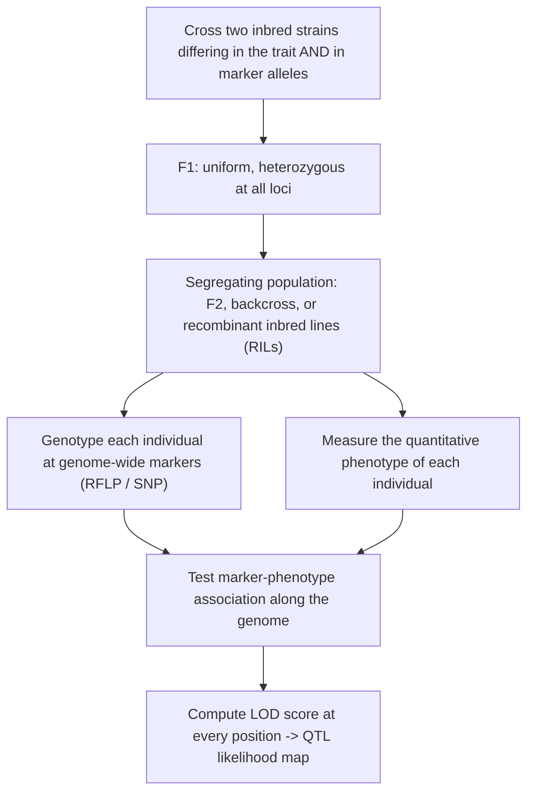

# Real World Genetics — Complex Traits & QTL

**Course:** BME333 / BIO333 Genetics (UNIST, 2026 Fall) · Lecture 12 · ~60 min
**Syllabus:** [← Course schedule](../../lectures/2026.BME333-BIO333-Syllabus.md) — Week 07 Wed, 10-14
**Languages:** English · [한국어](../../ko/lectures/lec12_Complex-Traits-QTL.md)

## Learning Objectives
By the end of this lecture, students should be able to:
- Explain the polygenic (multiple-factor) model and how it reconciles Mendelian inheritance with continuous variation.
- Partition phenotypic variance into genetic and environmental components and define broad- and narrow-sense heritability.
- Describe the principle of QTL mapping — using marker–trait linkage to localize genes underlying quantitative traits.
- Interpret a LOD-score QTL scan and discuss the strengths and limitations of QTL analysis.

## Lecture

### 1. Continuous variation and the multiple-factor hypothesis (~12 min)

Mendel's peas were round *or* wrinkled, tall *or* dwarf — clean, discrete categories. But most traits we actually care about — human height, blood pressure, crop yield, disease risk — vary **continuously**: measure any large sample and you get a smooth, roughly bell-shaped (normal) distribution, not a handful of discrete classes. A **quantitative** (or **complex**) **trait** is one that varies continuously and is shaped by *many* genes plus the environment. Reconciling such traits with Mendel's discrete factors was the founding problem of quantitative genetics, and at the turn of the 20th century it split biology into two warring camps: the **biometricians** (Galton, Pearson, Weldon), who described continuous traits with correlation and regression and doubted Mendel applied to them, and the **Mendelians** (Bateson), who insisted inheritance was particulate (see [en](../../en/review/Visscher2019_Genetics_Fisher1918GWAS.md) · [ko](../../ko/review/Visscher2019_Genetics_Fisher1918GWAS.md)).

The resolution is the **multiple-factor (polygenic) hypothesis**: continuous variation arises when **many genes, each of small effect, act additively**, and their combined output is further blurred by environmental variation. The logic is simple but powerful. One gene with two alleles gives 3 genotype classes; two genes give up to 5 additive classes; *n* genes give many classes whose combined distribution — by the same logic as the central limit theorem — approaches a smooth normal curve, especially once environmental noise fills the gaps.

**Figure — How discrete Mendelian factors sum to a continuous curve.**
```
1 gene (2 alleles):  3 classes          |  |  |
                                        aa Aa AA

2 genes (additive):  5 classes        | || ||| || |
                                       0  1  2  3  4   "increasing" alleles

many genes + environment: ~normal        .-''''-.
                                        .'        '.
                                      .'            '.
                                   _.'                '._
                                 low     phenotype      high
```

The founding empirical demonstration is **E. M. East's 1916 study of corolla (flower-tube) length in tobacco (*Nicotiana longiflora*)**, published in the inaugural issue of *Genetics* (see [en](../../en/article/East1916_Genetics_SizeInheritance.md) · [ko](../../ko/article/East1916_Genetics_SizeInheritance.md)). East crossed two highly inbred varieties and tracked corolla length across generations. The data satisfy every prediction of the multiple-factor model:

**Figure — East (1916): size inheritance in *Nicotiana* corolla length.**

| Generation | Mean (mm) | Variance (mm²) | Interpretation |
|---|---|---|---|
| Parent 330 | 40.5 | 3.5 | true-breeding short (low genetic variance) |
| Parent 383 | 93.3 | 5.1 | true-breeding long (low genetic variance) |
| F1 | 63.5 | 8.5 | **intermediate**, uniform (all heterozygous) |
| F2 (n=244) | 68.7 | **40.5** | **greatly inflated variance** from segregation |

The key signatures (see [en](../../en/article/East1916_Genetics_SizeInheritance.md) · [ko](../../ko/article/East1916_Genetics_SizeInheritance.md)): the F1 is **intermediate and uniform** (like the parents, low variance — all individuals share one hybrid genotype); the F2 has a mean near the F1 but a **dramatically inflated variance** (~40.5 vs ~8.5), because segregation and independent assortment now generate a spectrum of genotypes; and **no F2 plant recovered either parental extreme** — expected if ≥5 loci contribute, since reconstituting a full parental genotype would occur at frequency <1/1000. Finally, F3 families derived from *different* F2 plants had *different* means and variances, proving the F2 variation was **heritable and segregating**, not environmental noise. This is Mendelism producing a continuous distribution.

East's data became the classic teaching case for the **Wright–Castle estimator** of the minimum number of contributing loci: **n = (P₁ − P₂)² / [8(V_F2 − V_E)]**, where V_E (environmental variance) is estimated from the low-variance parental/F1 lines. Applied to East's numbers it yields **n ≈ 9.6 loci** (see [en](../../en/review/East1916_Turelli2016_GeneticsClassic.md) · [ko](../../ko/review/East1916_Turelli2016_GeneticsClassic.md)). (Sewall Wright derived the formula as a graduate student; Castle published it in 1921 without crediting him — a recurring theme in the history of credit.) Together with Johannsen's pure-line beans and Nilsson-Ehle's additive three-locus model of wheat kernel color, East's work laid the empirical foundation for Fisher's 1918 synthesis (see [en](../../en/review/East1916_Turelli2016_GeneticsClassic.md) · [ko](../../ko/review/East1916_Turelli2016_GeneticsClassic.md)). One cautionary footnote: East himself *misread* his data as "discrediting" Galtonian regression, when in fact they beautifully *reconciled* Mendel and Galton — a lesson that the same data can be right or wrong depending on the interpretive framework (see [en](../../en/review/East1916_Turelli2016_GeneticsClassic.md) · [ko](../../ko/review/East1916_Turelli2016_GeneticsClassic.md)).

### 2. Fisher's reconciliation and heritability (~12 min)

The decisive theoretical unification came from **R. A. Fisher's 1918 paper**, "The Correlation between Relatives on the Supposition of Mendelian Inheritance," which proved mathematically that if many genes each obey Mendel's rules and contribute additively, continuous traits are *fully* explained within a Mendelian framework — ending the biometrician–Mendelian war (see [en](../../en/review/Visscher2019_Genetics_Fisher1918GWAS.md) · [ko](../../ko/review/Visscher2019_Genetics_Fisher1918GWAS.md)). Fisher's tools became the vocabulary of the entire field: he *invented the word "variance"* and the method of **analysis of variance (ANOVA)** in this very paper.

Fisher's central move is **variance partitioning**. The total observed variation in a trait, the **phenotypic variance V_P**, is split into a genetic part and an environmental part, and the genetic part is split further:

**Figure — Partitioning phenotypic variance.**
```
                      V_P  (total phenotypic variance)
                     /                          \
                  V_G (genetic)              V_E (environmental)
                /     |      \
             V_A     V_D      V_I
         additive  dominance  interaction
        (breeding   (within-  (epistasis,
          value)     locus)   between-loci)
```

- **V_A (additive variance)** — the variance in the "average effect of allele substitution," summed over loci. This is the part that *predictably passes to offspring* and on which selection acts.
- **V_D (dominance variance)** — from interactions between the two alleles *at the same locus*.
- **V_I (epistatic/interaction variance)** — from interactions *between loci*.
- **V_E (environmental variance)** — everything non-genetic.

From this partition come the two **heritabilities**, which quantify *what fraction of trait variation is genetic*:

$$H^2 = \frac{V_G}{V_P} \quad \text{(broad-sense)} \qquad h^2 = \frac{V_A}{V_P} \quad \text{(narrow-sense)}$$

**Broad-sense heritability (H²)** is the fraction of phenotypic variance due to *all* genetic effects; **narrow-sense heritability (h²)** is the fraction due to *additive* effects only. Narrow-sense h² is the one that matters for *resemblance between relatives* and for *response to selection* (the "breeder's equation," R = h²S), because only additive effects are reliably transmitted. Fisher showed that knowing the variance components alone — *without* knowing any individual gene — predicts phenotypic correlations among relatives (parent–offspring, full sibs), and he worked out how **positive assortative mating** (like mating with like) inflates V_A by building correlations between alleles at different loci (see [en](../../en/review/Visscher2019_Genetics_Fisher1918GWAS.md) · [ko](../../ko/review/Visscher2019_Genetics_Fisher1918GWAS.md)).

Two conceptual warnings are essential. First, **heritability is a property of a population in an environment, not of an individual or a trait in the abstract.** A trait can be highly heritable in one setting and less so in another, because changing V_E changes the ratio. Second, **high heritability does NOT mean environment is powerless**: even with h² = 0.8 for height, the environmental component still has a standard deviation of ~3.1 cm — environmental interventions can move the mean substantially (see [en](../../en/review/Visscher2019_Genetics_Fisher1918GWAS.md) · [ko](../../ko/review/Visscher2019_Genetics_Fisher1918GWAS.md)).

The modern genomic era has strikingly *confirmed* Fisher (see [en](../../en/review/Visscher2019_Genetics_Fisher1918GWAS.md) · [ko](../../ko/review/Visscher2019_Genetics_Fisher1918GWAS.md), [en](../../en/review/Charlesworth2022_NatGenet_MendelPerspectives.md) · [ko](../../ko/review/Charlesworth2022_NatGenet_MendelPerspectives.md)): GWAS shows virtually every heritable trait is **highly polygenic** (human height has **>3,000** significant loci, yet they explain only ~1/3 of additive variance — the "missing heritability" problem); genetic variance is **overwhelmingly additive** across species (dominance and epistasis contribute little to *variance*, even where they act mechanistically); the standard GWAS regression of phenotype on SNP dosage (0/1/2) *is* Fisher's average-effect model; and assortative mating is measurable in GWAS data for height and educational attainment. W. G. Hill's theoretical work explained *why* additive variance dominates even under gene interaction, and why long-term artificial selection keeps responding — because new mutations continually replenish V_A (see [en](../../en/review/Charlesworth2022_NatGenet_MendelPerspectives.md) · [ko](../../ko/review/Charlesworth2022_NatGenet_MendelPerspectives.md)).

### 3. QTL mapping principle (~14 min)

Heritability tells us *how much* of a trait is genetic, but not *where* the genes are. For most of the 20th century the genes behind quantitative traits were a "statistical fog" — an abstraction with no chromosomal address (see [en](../../en/review/Mauricio2001_NatRevGenet_QTL.md) · [ko](../../ko/review/Mauricio2001_NatRevGenet_QTL.md)). A **quantitative trait locus (QTL)** is a region of the genome that contains one or more genes affecting a quantitative trait. **QTL mapping** lifts the fog by finding **statistical associations between genetic markers and the trait**: if individuals carrying marker allele *M₁* are, on average, larger than those carrying *M₂*, then a trait-affecting gene must lie *near that marker*, because marker and gene are physically **linked** and co-inherited.

The general experimental logic:

**Figure — The QTL mapping workflow.**


The transformative paper is **Lander and Botstein (1989)**, which turned QTL mapping from ad-hoc single-marker tests into a rigorous genome-wide method built on **RFLP linkage maps** (see [en](../../en/article/LanderBotstein1989_Genetics_QTL.md) · [ko](../../ko/article/LanderBotstein1989_Genetics_QTL.md), [en](../../en/review/LanderBotstein1989_Churchill2016_GeneticsClassic.md) · [ko](../../ko/review/LanderBotstein1989_Churchill2016_GeneticsClassic.md)). It introduced three innovations that defined the field for decades.

**(1) Interval mapping.** Traditional **single-marker** analysis has four flaws: it *underestimates* a QTL's effect when the QTL sits between markers; it *cannot distinguish* tight linkage to a weak QTL from loose linkage to a strong one; it *localizes poorly*; and testing many markers inflates false positives. **Interval mapping** fixes these by using *flanking marker pairs* to compute, by **maximum likelihood**, the evidence for a QTL at *every position* in every marker interval — treating the unknown QTL genotype as missing data handled by the **EM algorithm** (see [en](../../en/article/LanderBotstein1989_Genetics_QTL.md) · [ko](../../ko/article/LanderBotstein1989_Genetics_QTL.md)). The evidence is reported as a **LOD score** (log₁₀ of the odds ratio: likelihood of "QTL here" ÷ likelihood of "no QTL"). Their software **MAPMAKER-QTL** made this practical.

**Figure — Single-marker vs interval vs composite mapping.**

| Method | How it tests | Strength / weakness |
|---|---|---|
| **Single-marker** | one marker at a time (t-test / regression) | simple; biased effects, poor localization, no position |
| **Interval mapping** | flanking marker pair, ML at every point | unbiased effects, gives position + support interval |
| **Composite interval mapping** | interval + covariates for other QTL | removes "ghost" peaks between two real QTL |
| **Multiple interval mapping** | all QTL + interactions jointly | estimates number, positions, effects, epistasis together |

**(2) A genome-wide significance threshold.** Testing thousands of positions demands a corrected threshold. Lander and Botstein proved that, under the null of no QTL, the LOD score varies across the genome like the *square of an Ornstein–Uhlenbeck diffusion process*, yielding an analytic threshold that depends on genome size and marker density (see [en](../../en/article/LanderBotstein1989_Genetics_QTL.md) · [ko](../../ko/article/LanderBotstein1989_Genetics_QTL.md)). For a tomato genome with a 20-cM map, the required threshold is **LOD ≈ 2.4**; using the naive per-test threshold (LOD > 0.83, α = 0.05) would give a >90% chance of at least one false positive somewhere in the genome. (In practice, **permutation testing** — Churchill & Doerge 1994 — later became the standard empirical way to set thresholds.)

**(3) Design tools.** Using Wright's formula **k = D²/16σ²_G** they showed how to pick parental strains likely to segregate large-effect QTL and to bound the minimum detectable effect. **Selective genotyping** — phenotyping a large population but genotyping only the top and bottom ~5% (±2 SD) — extracts nearly the same linkage information from ~5.5-fold fewer genotypings (at the cost of growing more progeny), provided one uses missing-data ML rather than plain regression (see [en](../../en/article/LanderBotstein1989_Genetics_QTL.md) · [ko](../../ko/article/LanderBotstein1989_Genetics_QTL.md)).

### 4. Reading and interpreting QTL scans (~12 min)

The output of interval mapping is a **QTL likelihood map**: LOD score plotted along each chromosome. Reading it is a core skill.

**Figure — A LOD-score QTL scan.**
```
LOD
 6 |                     .*.  <- QTL peak (LOD 6, well above threshold)
 5 |                    .   .
 4 |                   .     .
 3 |___________.______._______.___________________ significance threshold (~LOD 3, permutation-set)
 2 |          . .    .         .          .*.  <- suggestive peak (below threshold: ignore/replicate)
 1 |    .*.  .   .  .            .       .   .
 0 |___.___.___._.__________________.__.______.____
    |----chr 1----|----chr 2----|----chr 3----|   genome position (cM)
        ^                              ^
   one-LOD support interval      confidence interval = positions within 1 LOD of the peak
```

Four things to read off the scan (see [en](../../en/article/LanderBotstein1989_Genetics_QTL.md) · [ko](../../ko/article/LanderBotstein1989_Genetics_QTL.md), [en](../../en/review/Barton2002_NatRevGenet_QTL.md) · [ko](../../ko/review/Barton2002_NatRevGenet_QTL.md)):

1. **Peaks above threshold** are declared QTL; their **height** reflects statistical evidence (and, loosely, effect size × sample size), not effect size alone.
2. **Position and confidence** are given by the **one-LOD support interval** — the range of positions whose LOD is within 1 unit of the peak. These intervals are often broad (many cM, hundreds of genes), the fundamental resolution limit of linkage mapping.
3. **Effect size** — how much of the phenotypic variance the QTL explains.
4. **Below-threshold "suggestive" peaks** should be treated skeptically or reserved for replication.

Two systematic biases must temper interpretation — and both are exam-worthy (see [en](../../en/review/Barton2002_NatRevGenet_QTL.md) · [ko](../../ko/review/Barton2002_NatRevGenet_QTL.md), [en](../../en/review/Mauricio2001_NatRevGenet_QTL.md) · [ko](../../ko/review/Mauricio2001_NatRevGenet_QTL.md)):

- QTL studies **underestimate the number of QTL and overestimate their effects.** Closely linked QTL with opposing effects cancel and are missed; and the **Beavis effect** means that in small samples (< ~500 individuals), the QTL that happen to clear the significance threshold have *inflated* estimated effects (winner's curse). Fewer than ~500 progeny gives little power for small-effect QTL, regardless of marker density.
- **QTL × environment interactions** are pervasive. In a tomato study across three environments, only **4 of 29** detected QTL replicated across all three; 15 appeared in just one (see [en](../../en/review/Mauricio2001_NatRevGenet_QTL.md) · [ko](../../ko/review/Mauricio2001_NatRevGenet_QTL.md)). A QTL is a statement about a *population in an environment*, not a universal constant.

What genetic architecture do scans reveal? It varies. Fisher's **geometric/infinitesimal** view predicted many loci of tiny effect; Orr's refinement predicts effects roughly **exponentially distributed** — a few large-effect QTL plus many small ones (see [en](../../en/review/Barton2002_NatRevGenet_QTL.md) · [ko](../../ko/review/Barton2002_NatRevGenet_QTL.md)). Real data span the range: some traits (e.g., aspects of maize domestication) hinge on a few large-effect QTL, others are strongly polygenic, with no universal rule. Sustained artificial-selection experiments — *Drosophila* bristle number responding over **85+ generations** (a 16-SD increase), flight speed over 100 generations (2 → 170 cm/s) — show responses far longer than standing large-effect alleles could sustain, implicating continual input of new mutation and reconciling the "few big genes" and "infinitesimal" pictures (see [en](../../en/review/Barton2002_NatRevGenet_QTL.md) · [ko](../../ko/review/Barton2002_NatRevGenet_QTL.md)).

### 5. From QTL to gene, and to humans (~10 min)

A QTL is an *interval*, not a gene — and closing that gap is the hard part. The tomato fruit-weight QTL **fw2.2** took **over 10 years** of fine mapping and transgenic testing to narrow to a single open reading frame (see [en](../../en/review/Mauricio2001_NatRevGenet_QTL.md) · [ko](../../ko/review/Mauricio2001_NatRevGenet_QTL.md), [en](../../en/review/Barton2002_NatRevGenet_QTL.md) · [ko](../../ko/review/Barton2002_NatRevGenet_QTL.md)). Other successes: **teosinte branched1 (tb1)**, cloned from a QTL, explains the major architectural change in maize domestication from teosinte; comparative QTL mapping across sorghum, rice, and maize found seed-size, flowering, and shattering QTL at *conserved* positions across ~65 million years of divergence — suggesting farmers on three continents independently selected homologous genes (see [en](../../en/review/Mauricio2001_NatRevGenet_QTL.md) · [ko](../../ko/review/Mauricio2001_NatRevGenet_QTL.md)).

QTL thinking works in animals too, well before molecular tools existed. **Dunn and Charles (1937)**, in the first volume of *Genetics*, studied the wildly variable coat spotting of mice homozygous for the *piebald (s)* mutation. Lacking any way to map genes, they built inbred strains for extreme phenotypes, invented a **quantitative grading scale**, and used F1s and backcrosses to show the variation was controlled by multiple **modifier loci** on a genetic background — "a modern QTL study minus the gene mapping" (see [en](../../en/review/DunnCharles1937_Schimenti2016_GeneticsClassic_MouseQTL.md) · [ko](../../ko/review/DunnCharles1937_Schimenti2016_GeneticsClassic_MouseQTL.md)). The *s* gene is now known to be **Ednrb** (endothelin receptor B; the human orthologue underlies Hirschsprung disease and Waardenburg syndrome), and their modifier analysis prefigured modern studies of why single-gene mutations show variable **penetrance and expressivity** depending on background.

Finally, the bridge to human genetics runs through a deceptively "simple" trait: **PTC (phenylthiocarbamide) tasting** (see [en](../../en/article/Wooding2006_Genetics_PhenylThioCarbamide.md) · [ko](../../ko/article/Wooding2006_Genetics_PhenylThioCarbamide.md)). Discovered by accident in 1930, tasting was long taught as a clean dominant/recessive Mendelian trait. Molecularly, most variation traces to the bitter-receptor gene **TAS2R38**, whose three amino-acid positions (49, 262, 296) define two main haplotypes:

**Figure — TAS2R38 haplotypes and PTC tasting.**

| Haplotype | Positions 49–262–296 | Phenotype |
|---|---|---|
| **PAV** | Pro–Ala–Val | taster |
| **AVI** | Ala–Val–Ile | non-taster |
| (minor haplotypes) | various | intermediate; frequencies differ by population |

But PTC sensitivity is actually **continuously distributed** (some "non-tasters" respond at high concentrations), and other genes plus environment contribute — so even this textbook Mendelian trait is really a small-scale complex trait (see [en](../../en/article/Wooding2006_Genetics_PhenylThioCarbamide.md) · [ko](../../ko/article/Wooding2006_Genetics_PhenylThioCarbamide.md)). Population genetics adds a twist: both haplotypes are ancient (coalescing ~3 million years ago) and the taster/non-taster polymorphism is *shared with chimpanzees* — exactly what Fisher, Ford, and Huxley predicted in 1939 as a signature of **balancing selection** maintaining both alleles (though the selective agent remains debated — perhaps toxin detection or thyroid effects) (see [en](../../en/article/Wooding2006_Genetics_PhenylThioCarbamide.md) · [ko](../../ko/article/Wooding2006_Genetics_PhenylThioCarbamide.md)).

This closes the arc of the lecture and points to what comes next. Linkage-based **QTL mapping** in designed crosses gives broad intervals; the same statistical logic, scaled to whole populations and dense **SNP** panels, becomes the **genome-wide association study (GWAS)** — which is nothing more than Fisher's 1918 additive model applied genome-wide, with the **r² linkage-disequilibrium** metric (from Hill & Robertson 1968) deciding how many markers are needed to tag causal variants (see [en](../../en/review/Charlesworth2022_NatGenet_MendelPerspectives.md) · [ko](../../ko/review/Charlesworth2022_NatGenet_MendelPerspectives.md), [en](../../en/review/Visscher2019_Genetics_Fisher1918GWAS.md) · [ko](../../ko/review/Visscher2019_Genetics_Fisher1918GWAS.md)). From East's tobacco flowers to a GWAS of three thousand height loci, it is one continuous intellectual thread — Mendelian factors, summed.

## Key Takeaways
- **Continuous traits** arise from **many genes of small effect acting additively**, plus environment — the **multiple-factor (polygenic) hypothesis**, empirically nailed by **East (1916)**: intermediate uniform F1, variance-inflated F2, heritable F3 differences (Wright–Castle estimate ≈ 9.6 loci).
- **Fisher (1918)** unified Mendel and biometry by **partitioning variance**: V_P = V_G + V_E, with V_G = V_A + V_D + V_I; he invented "variance" and ANOVA.
- **Heritability**: broad-sense **H² = V_G/V_P**; narrow-sense **h² = V_A/V_P** (the one governing resemblance and selection response). It is a **population-and-environment-specific ratio**; high h² does *not* mean environment is powerless.
- **QTL mapping** finds marker–trait linkage; **Lander–Botstein (1989)** introduced **interval mapping** (ML LOD scores at every position), a **genome-wide LOD threshold** (~2–3, tomato ≈ 2.4), and **selective genotyping**.
- **Reading a LOD scan**: peaks above the (permutation-set) threshold = QTL; **one-LOD support intervals** give position; beware the **Beavis effect** (inflated effects in small samples), missed linked QTL, and **QTL × environment** interactions (tomato: only 4/29 QTL replicated across environments).
- **QTL → gene is slow** (fw2.2 took >10 years); classic successes include *tb1* (maize) and modifier loci of mouse *s/Ednrb* (Dunn & Charles 1937).
- Even "simple" human traits are complex: **PTC/TAS2R38** is continuously distributed and shows **ancient balancing selection** (shared with chimps). QTL mapping scaled to populations + dense SNPs becomes **GWAS** — Fisher's additive model genome-wide.

## Textbook Reading
- **Genetics: From Genes to Genomes (8e)** — Ch. 25 Genetic Analysis of Complex Traits. → [textbook ref](../../lectures/ref.Genetics-FromGenesToGenomes.md)
- **Evolution: Making Sense of Life (4e)** — Ch. 7 Beyond Alleles: Quantitative Genetics. → [textbook ref](../../lectures/ref.Evolution-MakeSenseOfLife.md)

## Notes in this vault
Reviews & articles to introduce in class (each has a bilingual en/ko pair):
- `LanderBotstein1989_Genetics_QTL` — The foundational interval-mapping paper; core of the QTL segment. · [en](../../en/article/LanderBotstein1989_Genetics_QTL.md) · [ko](../../ko/article/LanderBotstein1989_Genetics_QTL.md)
- `LanderBotstein1989_Churchill2016_GeneticsClassic` — Classic-paper commentary putting Lander–Botstein in modern context. · [en](../../en/review/LanderBotstein1989_Churchill2016_GeneticsClassic.md) · [ko](../../ko/review/LanderBotstein1989_Churchill2016_GeneticsClassic.md)
- `Barton2002_NatRevGenet_QTL` — Review of QTL concepts and the genetic architecture of quantitative traits. · [en](../../en/review/Barton2002_NatRevGenet_QTL.md) · [ko](../../ko/review/Barton2002_NatRevGenet_QTL.md)
- `Mauricio2001_NatRevGenet_QTL` — QTL mapping applied to natural variation and evolutionary questions. · [en](../../en/review/Mauricio2001_NatRevGenet_QTL.md) · [ko](../../ko/review/Mauricio2001_NatRevGenet_QTL.md)
- `East1916_Genetics_SizeInheritance` — East's original multiple-factor experiments on size inheritance. · [en](../../en/article/East1916_Genetics_SizeInheritance.md) · [ko](../../ko/article/East1916_Genetics_SizeInheritance.md)
- `East1916_Turelli2016_GeneticsClassic` — Classic-paper commentary on East 1916 and the birth of quantitative genetics. · [en](../../en/review/East1916_Turelli2016_GeneticsClassic.md) · [ko](../../ko/review/East1916_Turelli2016_GeneticsClassic.md)
- `DunnCharles1937_Schimenti2016_GeneticsClassic_MouseQTL` — Early mouse quantitative genetics; historical QTL example. · [en](../../en/review/DunnCharles1937_Schimenti2016_GeneticsClassic_MouseQTL.md) · [ko](../../ko/review/DunnCharles1937_Schimenti2016_GeneticsClassic_MouseQTL.md)
- `Visscher2019_Genetics_Fisher1918GWAS` — Fisher 1918 as the bridge from Mendel to heritability and modern GWAS. · [en](../../en/review/Visscher2019_Genetics_Fisher1918GWAS.md) · [ko](../../ko/review/Visscher2019_Genetics_Fisher1918GWAS.md)
- `Charlesworth2022_NatGenet_MendelPerspectives` — Perspective linking Mendelian and quantitative views of inheritance. · [en](../../en/review/Charlesworth2022_NatGenet_MendelPerspectives.md) · [ko](../../ko/review/Charlesworth2022_NatGenet_MendelPerspectives.md)
- `Wooding2006_Genetics_PhenylThioCarbamide` — PTC tasting as a tractable human trait bridging single-gene and quantitative variation. · [en](../../en/article/Wooding2006_Genetics_PhenylThioCarbamide.md) · [ko](../../ko/article/Wooding2006_Genetics_PhenylThioCarbamide.md)

## Discussion Questions
1. East's F1 tobacco plants were uniform with *low* variance, but the F2 variance ballooned to ~40 mm². Explain, in terms of segregation and independent assortment of multiple additive loci, why the F1 is uniform yet the F2 is variable — and why no F2 plant matched a parental extreme.
2. A trait has h² = 0.8 in a population. A student concludes "environment doesn't matter for this trait, so intervention is pointless." Using the definition of narrow-sense heritability and the height example (V_E SD ≈ 3.1 cm), explain precisely why this conclusion is wrong. What would raising or lowering V_E do to h²?
3. Contrast single-marker analysis with Lander–Botstein interval mapping. Why does single-marker analysis confound a weak QTL near a marker with a strong QTL far from it, and how does using *flanking* markers with maximum likelihood resolve both the effect-size bias and the localization problem?
4. You run a QTL scan on 150 F2 individuals and find one peak at LOD 3.5 explaining 40% of the variance. Given the Beavis effect and typical one-LOD support intervals, how much should you trust the 40% figure and the location? Design a follow-up (sample size, replication, environments) that would test your result.
5. PTC/TAS2R38 is taught as a simple dominant trait yet shows continuous sensitivity, multiple haplotypes, and ancient balancing selection shared with chimpanzees. Use this example to argue that the "Mendelian vs quantitative" distinction is a spectrum, not a dichotomy. How does scaling QTL logic to dense SNPs across a whole population turn linkage mapping into GWAS?
