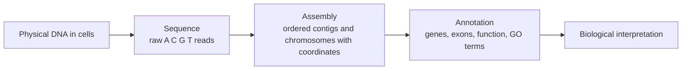
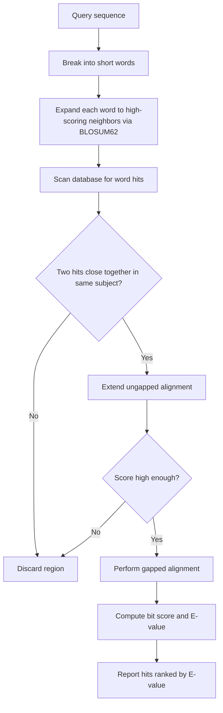
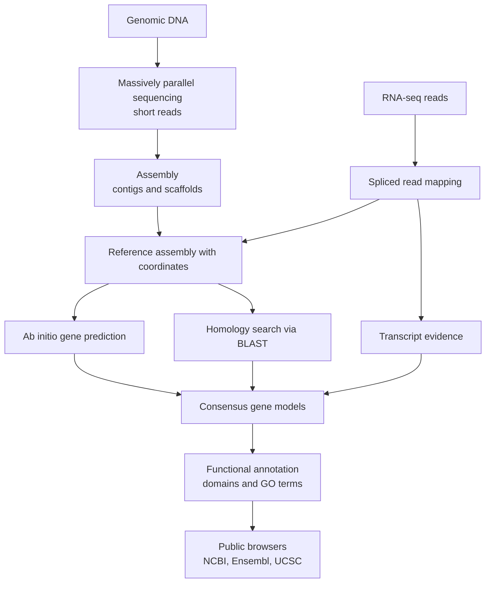

# Real World Genetics — Genome Annotation & Resources

**Course:** BME333 / BIO333 Genetics (UNIST, 2026 Fall) · Lecture 13 · ~60 min
**Syllabus:** [← Course schedule](../../lectures/2026.BME333-BIO333-Syllabus.md) — Week 09, 2026-10-26 (Mon)
**Languages:** English · [한국어](../../ko/lectures/lec13_Genome-Annotation-Resources.md)

## Learning Objectives
By the end of this lecture, students should be able to:
- Define what a "genome" is and distinguish sequence, assembly, and annotation.
- Explain how short reads are generated and mapped to a reference genome.
- Describe how genes and functional elements are annotated (ab initio, homology, and evidence-based approaches).
- Use sequence-similarity search (BLAST) and understand its scoring machinery (dynamic programming, substitution matrices such as BLOSUM62).
- Navigate the major public genome resources (NCBI, Ensembl, UCSC) and recognize the limits of current annotations.

## Lecture

### 1. What is a genome, really? (~8 min)

Most textbooks define a **genome** the way the NIH does: "an organism's complete set of DNA, including all of the genes… all of the information needed to build and maintain that organism." This is a useful starting point, but Goldman and Landweber (2016) argue it is both oversimplified and internally contradictory, and picking it apart is the best way to understand what the rest of this lecture actually produces (see [en](../../en/review/Goldman2016_PLoSgenet_WhatIsGenome.md) · [ko](../../ko/review/Goldman2016_PLoSgenet_WhatIsGenome.md)).

Two problems undermine the tidy definition. First, **physical permanence** fails in many systems. Retroviruses carry their genome as single-stranded RNA, reverse-transcribe it to double-stranded DNA, and integrate into the host — ceasing to exist as a separate molecule. The ciliate *Oxytricha* is more dramatic: it keeps a **germline** genome (~1 Gb, ~250,000 scrambled, inverted gene segments) and a rearranged **somatic** genome of >16,000 tiny "nanochromosomes" that encode only 5–10% of the germline sequence. After mating, RNA templates from the *previous* generation guide the DNA rearrangement, so information flows DNA → RNA → DNA across generations — there is no single physical molecule you can point to as "the genome." Synthetic biology makes the same point from the other side: the *Mycoplasma* genome that Gibson et al. booted into a living cell existed first as a **computer file**, a string of letters, before it was ever chemically synthesized. Second, **informational completeness** fails: epigenetic marks (DNA methylation, histone modifications, non-coding RNAs) carry heritable information alongside the DNA, and GWAS "missing heritability" shows that sequence alone does not predict phenotype.

The practical upshot for this lecture is the crucial distinction the NIH definition blurs. What we call "a genome" in a database is not the physical DNA in an organism's cells. It is a **model** built in three layers, and the rest of the hour is about how each layer is constructed:

- **Sequence** — the raw order of A, C, G, T read off the DNA (billions of short fragments).
- **Assembly** — those fragments stitched into long, ordered, coordinate-bearing contigs/chromosomes: the "reference" you look things up against.
- **Annotation** — the layer of biological meaning laid over the assembly: where the genes are, what they encode, what each region does.

**Figure — The genome is a three-layer model, not a physical object.**



Because each layer is inferred, not observed directly, "the genome" is always provisional — which is why even "finished" genomes keep changing (Segment 7).

### 2. From reads to a reference: sequencing & assembly (~10 min)

DNA sequencing does not read a chromosome end to end. Instead it shatters the genome into fragments and reads short stretches called **reads**. **Sanger sequencing** (the 1977 chain-termination method) reads ~500–1000 bp per reaction with high accuracy but is slow and expensive per base. **Massively parallel** ("next-generation") sequencing — the technology reviewed by Shendure and Fields (2016) and Hobert (2010) — instead runs millions to billions of short reactions in parallel, producing **short reads** of ~25–150 bp at a tiny per-base cost (see [en](../../en/review/Shendure2016_Genetics_MassiveParallelGenetics.md) · [ko](../../ko/review/Shendure2016_Genetics_MassiveParallelGenetics.md); [en](../../en/review/Hobert2010_Genetics_WholeGenomeSequencing.md) · [ko](../../ko/review/Hobert2010_Genetics_WholeGenomeSequencing.md)). Hobert notes the scale of the shift concretely: by 2010 a *C. elegans* genome at 10× coverage cost under ~$2,000 and took about five days, with capacity doubling on a Moore's-law-like curve — the change that made routine whole-genome work possible.

Two ideas govern turning reads into a reference. **Coverage (depth)** is the average number of reads covering each base: at 30× coverage, every position is read ~30 times on average, so random sequencing errors in individual reads are outvoted by the consensus. Higher depth means higher confidence. **Assembly** is the jigsaw puzzle of finding overlaps between reads and merging them into longer stretches:

- **Contigs** — contiguous stretches assembled from overlapping reads, with no gaps.
- **Scaffolds** — contigs ordered and oriented relative to one another (using paired-end / long-range information), with sized **gaps** where sequence is still missing.
- **Reference assembly** vs. **de novo assembly** — mapping reads onto an existing reference (fast, for resequencing a known species) versus assembling a brand-new genome from scratch (hard, for a species with no reference).

**Figure — Coverage, contigs, scaffolds, and gaps.**

```
genome  ================================================================
reads   ---- ----   ---- ----  ---- ----   ---- ----   ---- ----   (each read ~100 bp)
         ----  ---- ----  ---- ----  ---- ----  ---- ----  ----    (overlapping, ~depth 2-3x here)
        [====contig 1====]  gap  [======contig 2======]  gap  [=contig 3=]
        |<---------------------- scaffold ---------------------->|
```

The hard part is **repeats**: sequence that occurs in many near-identical copies cannot be placed unambiguously from short reads, so assemblies break at repeats and gaps form there. This is exactly why the pea genome (Lecture 03) was so hard to assemble, and why long-read technologies (Segment 7) matter.

### 3. Read mapping (~8 min)

Once a reference exists, most experiments — resequencing a mutant, RNA-seq, ChIP-seq — produce reads that must be **mapped**: found their place on the reference. Trapnell and Salzberg (2009) frame the two challenges (see [en](../../en/review/Trapnell2009_NatBiotech_ShortReadMapping-primer.md) · [ko](../../ko/review/Trapnell2009_NatBiotech_ShortReadMapping-primer.md)). First, **scale**: mapping billions of reads with a general tool like BLAST would take hundreds to thousands of CPU hours; purpose-built mappers do hundreds of millions of reads per hour on a desktop. Second, **repeats**: a read from a repetitive element may match many genomic copies, forcing the program to report multiple locations or make a heuristic choice — a **multi-mapping** read whose true origin is uncertain.

Two algorithmic strategies solve the scale problem. **Spaced-seed indexing** (used by Maq) splits each read into four seeds; because at most two mismatches leave at least two seeds matching perfectly, indexing pairs of seeds quickly finds candidate positions — but the index needs tens of gigabytes of RAM. The **Burrows-Wheeler transform** (used by Bowtie) is a reversible compression that shrinks the whole human-genome index to under 2 GB and aligns a read one character at a time, narrowing the set of candidate positions as it goes — over 30× faster than Maq. This "index once, query fast" idea, plus the **seed-and-extend** logic (find short exact anchors, then extend the alignment around them), is the same conceptual engine behind BLAST in Segment 5.

RNA-seq adds a twist: a read spanning an **exon–exon junction** does not exist contiguously in the genome. **Spliced mappers** handle this — annotation-based tools (ERANGE) build junction sequences from known exon coordinates, while annotation-free tools (TopHat) first map the easy reads with Bowtie, infer likely junctions, then align the rest across them. Typical overall mapping success is only 70–75%, and many reads map to multiple sites — a reminder that mapping is probabilistic, not perfect.

### 4. Sequence alignment fundamentals (~10 min)

Underneath mapping and homology search lies **pairwise sequence alignment**: lining up two sequences to maximize their similarity, inserting **gaps** for insertions/deletions. Eddy (2004) explains that the exact solution comes from **dynamic programming (DP)** — an algorithm formalized by Richard Bellman in the 1950s that solves a big optimization by breaking it into overlapping sub-problems and storing each answer once, turning an exponential search into polynomial time (see [en](../../en/review/Eddy2004_NatureBiotechPrimer_DynamicProgramming.md) · [ko](../../ko/review/Eddy2004_NatureBiotechPrimer_DynamicProgramming.md)). BLAST, FASTA, CLUSTALW, HMMER, and GENSCAN are all DP or fast approximations of it.

For sequences x (length M) and y (length N), the best score of aligning the prefixes up to positions i and j, S(i,j), is the maximum of three moves: align x_i to y_j (diagonal, add substitution score σ), align x_i to a gap (up, add gap penalty γ), or align y_j to a gap (left, add γ). This recursion works only because the scoring is **column-independent** — each aligned column contributes a score that does not depend on the others. You fill an (M+1)×(N+1) matrix from the boundaries, then **trace back** from the bottom-right corner to recover the alignment. Cost is proportional to M×N, so aligning two 200-mers takes 4× as long as two 100-mers — the very cost that motivates BLAST's heuristics.

**Figure — A dynamic-programming alignment matrix (match +1, mismatch/gap −1).** Each cell is the best score of aligning the prefixes; the bold path is the traceback.

|       |   – |   G |   A |   T |   T |
|-------|----:|----:|----:|----:|----:|
| **–** |  0  | −1  | −2  | −3  | −4  |
| **G** | −1  | **1** |  0  | −1  | −2  |
| **A** | −2  |  0  | **2** |  1  |  0  |
| **T** | −3  | −1  |  1  | **3** |  2  |
| **C** | −4  | −2  |  0  |  2  | **2** |

The score at the corner (here 2) is the optimal alignment score of GATC vs GATT. A key caveat: DP guarantees the **mathematically** optimal alignment *for a given scoring system*, but whether that is the **biologically** correct alignment depends entirely on the scores you choose — which is where substitution matrices come in.

For proteins, the substitution score σ comes from a matrix such as **BLOSUM62**. Eddy (2004) explains that every entry is a **log-odds score**: s(a,b) = (1/λ)·log(p_ab / f_a·f_b), the log of how often residues a and b are aligned in true homologs (p_ab) versus how often they would align by chance (f_a·f_b) (see [en](../../en/review/Eddy2004_NatureBiotechPrimer_BLOSUM62.md) · [ko](../../ko/review/Eddy2004_NatureBiotechPrimer_BLOSUM62.md)). Positive = conservative substitution (seen more than chance); negative = non-conservative. Crucially, "conservative" here is a **statistical**, not a biochemical, judgment. That explains a famous surprise: W/W scores **+11** but L/L only **+4** — not because tryptophan is chemically special, but because it is rare (f_W ≈ 0.013 vs f_L ≈ 0.099), so a W-to-W match is far more surprising by chance. The "62" means the matrix was built from protein blocks sharing ≤62% identity; BLOSUM45 (more divergent) and BLOSUM80 (more similar) target different evolutionary distances.

**Figure — Selected BLOSUM62 scores (positive = favored over chance).**

| Pair | Score | Reading |
|------|------:|---------|
| W / W | +11 | rare residue → exact match highly surprising |
| L / L | +4  | common residue → match less surprising |
| K / E | +1  | different residues, but co-occur in homologs more than chance |
| A / L | −1  | co-occur *less* than chance despite both being common |
| W / C | −2  | dissimilar, rarely aligned in true homologs |

### 5. BLAST and homology search (~8 min)

Filling a full DP matrix against an entire database is far too slow, so **BLAST** (Basic Local Alignment Search Tool) uses a word-based heuristic to find *local* similarities fast. Kerfeld and Scott (2011) walk through the logic, which is worth teaching because it wraps molecular evolution, biochemistry, and statistics into one tool (see [en](../../en/review/Kerfeld2011_PLoSBiol_BLAST.md) · [ko](../../ko/review/Kerfeld2011_PLoSBiol_BLAST.md)). BLAST breaks the query into short **words**, expands each into a neighborhood of high-scoring synonyms (using BLOSUM62), scans the database for those word hits, and only where two hits fall close together does it invest in extending — first ungapped, then, if promising, a gapped DP alignment. This is **seed-and-extend** again: cheap exact anchors first, expensive alignment only where warranted.

**Figure — BLAST decision logic (seed → extend → score).**



The output is quantified in two steps. The **raw score S** sums substitution scores minus gap penalties (the gap-*open* penalty exceeds the gap-*extend* penalty because starting an indel is biologically rarer than lengthening one). S is normalized to a database-independent **bit score S'**, then converted to an **E-value**: the expected number of hits scoring this well *by chance* in a database of this size, roughly E = (n·m)/2^S', where n is the database size and m the query length. A low E-value (say 1e−50) means such a match is astronomically unlikely by chance — strong evidence of shared ancestry (**homology**). Because E scales with database size, the *same* two sequences give a *larger* (less significant) E-value as databases grow — a subtlety students must internalize before trusting a BLAST hit.

### 6. Annotation pipelines & public resources (~10 min)

**Annotation** is the layer of meaning laid over the assembly, and it has two parts. **Structural annotation** finds where genes are (exons, introns, start/stop, UTRs); **functional annotation** says what they do (protein domains, Gene Ontology terms, pathways). Gene prediction combines three lines of evidence, each with a characteristic failure mode:

- **Ab initio** — statistical models (e.g. GENSCAN, a DP-based tool) recognize the sequence signatures of genes (splice sites, codon bias, reading frames). Works with no other data, but is error-prone on unusual gene structures.
- **Homology-based** — align the region to known genes/proteins in other species via BLAST (Segment 5); conservation flags likely coding regions. Misses genes with no known homolog.
- **Evidence-based (RNA-seq)** — map transcript reads (Segment 3) to show which regions are actually transcribed and how exons splice together. The most direct evidence, but only captures genes expressed in the sampled tissue/condition.

**Figure — The genome annotation pipeline, from DNA to a browsable resource.**



The finished product lives in three overlapping public resources, and a working geneticist must know all three. Because they use independent pipelines and, sometimes, different assembly versions, the same gene can have slightly different coordinates in each — which is why **version control of assemblies** (e.g. human GRCh37 vs GRCh38) is not a bookkeeping detail but a source of real error when coordinates are compared across sources.

| Resource | Run by | Strength |
|----------|--------|----------|
| **NCBI** (GenBank, RefSeq, BLAST) | US NIH | Primary sequence archive; RefSeq curated gene set; the BLAST server |
| **Ensembl** | EMBL-EBI / Sanger | Automated, evidence-based gene annotation across vertebrates; comparative genomics |
| **UCSC Genome Browser** | UC Santa Cruz | Flexible visual browser; overlaying many annotation "tracks" on one assembly |

### 7. Limits & open problems (~6 min)

The three-layer model from Segment 1 is never truly finished, and honest genomics keeps its limits in view. Assemblies still contain **gaps** and **hard-to-map regions** — repeats, segmental duplications, and centromeres that short reads cannot resolve. Annotations contain errors: genes missed (no expression in the sampled tissue, no known homolog), genes wrongly predicted, and function guessed by homology rather than measured.

Huddleston and Eichler (2016) give the sharpest illustration using human **structural variation (SV)** — insertions, deletions, inversions, and duplications ≥50 bp (see [en](../../en/review/Huddleston2016_Genetics_IncompleteHumanQTL.md) · [ko](../../ko/review/Huddleston2016_Genetics_IncompleteHumanQTL.md)). Even the 1000 Genomes Project (>2,500 genomes at 6–7× short-read coverage; 84.7 million SNVs catalogued) **missed more than 80% of insertions/deletions between 50 bp and 1 kb**, plus 68% of inversions and 35% of duplications, and only 44% of duplications could be imputed from nearby SNVs. This matters because SVs are ~**50-fold more enriched as eQTLs** than SNVs — per variant, they have far larger effects on gene expression — yet they are systematically excluded from most GWAS. Undetected SVs are a plausible source of "missing heritability": an **unknown unknown** hiding in the gaps.

The fixes are already reshaping genomics. **Long-read** technologies (PacBio SMRT, Oxford Nanopore) span repeats and large SVs directly; deeper coverage and **haplotype-resolved assembly** (assembling each parental copy separately) resolve heterozygous SVs invisible to short reads; and **pan-genome** references — many genomes instead of one — replace the fiction of a single reference. The lesson for students: a genome resource is a living, versioned, incomplete model — treat its annotations as well-supported hypotheses, not settled facts.

## Key Takeaways
- A **genome** in a database is a three-layer *model* — **sequence → assembly → annotation** — not a physical molecule; Goldman & Landweber show even the physical/informational definition breaks down (retroviruses, *Oxytricha*, synthetic genomes, epigenetics).
- **Massively parallel sequencing** yields billions of cheap short reads; **coverage/depth** buys confidence, and **assembly** stitches reads into **contigs → scaffolds** with **gaps**, breaking at **repeats**.
- **Read mapping** places reads on a reference fast using indexing (spaced seeds vs. **Burrows-Wheeler**) and **seed-and-extend**; **spliced mappers** handle RNA-seq junctions; multi-mapping makes it probabilistic.
- **Dynamic programming** gives the optimal pairwise alignment (cost ∝ M×N); the **scoring system** (gap penalties + a log-odds matrix like **BLOSUM62**) encodes the biology — "conservative" is statistical, not chemical (W/W +11 vs L/L +4).
- **BLAST** = word seeds → neighbor expansion → seed-and-extend → gapped alignment → **bit score** and **E-value**; the E-value is the number of chance hits expected and *grows with database size*.
- **Annotation** combines **ab initio**, **homology**, and **RNA-seq evidence** for gene structure, then adds functional annotation (domains, GO); browse and cross-check at **NCBI, Ensembl, UCSC**, minding **assembly versions**.
- Genomes are never "finished": **structural variation** is badly undercounted by short reads (>80% of 50 bp–1 kb indels missed) yet ~50× enriched as eQTLs — **long-read** and **pan-genome** approaches are the current fix.

## Textbook Reading
- **Genetics: From Genes to Genomes (8e)** — Ch. 10 Digital Analysis of DNA; Ch. 11 Genome Annotation. → [textbook ref](../../lectures/ref.Genetics-FromGenesToGenomes.md)

## Notes in this vault
Reviews & articles to introduce in class (each has a bilingual en/ko pair):
- `Goldman2016_PLoSgenet_WhatIsGenome` — Framing piece: what we actually mean by "genome"; use to open the lecture. · [en](../../en/review/Goldman2016_PLoSgenet_WhatIsGenome.md) · [ko](../../ko/review/Goldman2016_PLoSgenet_WhatIsGenome.md)
- `Hobert2010_Genetics_WholeGenomeSequencing` — Whole-genome sequencing as a routine tool; connects sequencing to gene identification. · [en](../../en/review/Hobert2010_Genetics_WholeGenomeSequencing.md) · [ko](../../ko/review/Hobert2010_Genetics_WholeGenomeSequencing.md)
- `Shendure2016_Genetics_MassiveParallelGenetics` — Massively parallel sequencing/assays; the technology behind modern annotation. · [en](../../en/review/Shendure2016_Genetics_MassiveParallelGenetics.md) · [ko](../../ko/review/Shendure2016_Genetics_MassiveParallelGenetics.md)
- `Trapnell2009_NatBiotech_ShortReadMapping-primer` — Primer on short-read mapping (incl. spliced alignment); illustrates the reads-to-reference step. · [en](../../en/review/Trapnell2009_NatBiotech_ShortReadMapping-primer.md) · [ko](../../ko/review/Trapnell2009_NatBiotech_ShortReadMapping-primer.md)
- `Eddy2004_NatureBiotechPrimer_DynamicProgramming` — Accessible primer on dynamic-programming alignment; core algorithm for the alignment segment. · [en](../../en/review/Eddy2004_NatureBiotechPrimer_DynamicProgramming.md) · [ko](../../ko/review/Eddy2004_NatureBiotechPrimer_DynamicProgramming.md)
- `Eddy2004_NatureBiotechPrimer_BLOSUM62` — Where substitution scores come from; pair with the dynamic-programming primer. · [en](../../en/review/Eddy2004_NatureBiotechPrimer_BLOSUM62.md) · [ko](../../ko/review/Eddy2004_NatureBiotechPrimer_BLOSUM62.md)
- `Kerfeld2011_PLoSBiol_BLAST` — Practical guide to running and interpreting BLAST; hands-on companion for the homology-search segment. · [en](../../en/review/Kerfeld2011_PLoSBiol_BLAST.md) · [ko](../../ko/review/Kerfeld2011_PLoSBiol_BLAST.md)
- `Huddleston2016_Genetics_IncompleteHumanQTL` — Reminder that reference genomes and annotations remain incomplete; use in the "limits" segment. · [en](../../en/review/Huddleston2016_Genetics_IncompleteHumanQTL.md) · [ko](../../ko/review/Huddleston2016_Genetics_IncompleteHumanQTL.md)

## Discussion Questions
1. Goldman & Landweber argue "the genome" is an *informational* entity that is "often but not always manifest as DNA." Using *Oxytricha* (germline vs. somatic genomes, RNA-templated rearrangement) and the synthetic *Mycoplasma* genome, explain why a single physical DNA molecule fails as a definition. How does the three-layer (sequence/assembly/annotation) view help?
2. Why does mapping billions of short reads with BLAST take thousands of CPU hours, while Bowtie does it on a desktop? Compare spaced-seed indexing and the Burrows-Wheeler transform on speed vs. memory, and explain how repeats produce multi-mapping reads.
3. Dynamic programming is *guaranteed* to find the optimal alignment for a given scoring system, yet the result can still be biologically wrong. Explain this apparent contradiction using the role of BLOSUM62 and gap penalties. Why does W/W score +11 while L/L scores only +4?
4. A BLAST hit with E = 1e−40 today may have had E = 1e−45 five years ago against the *same* two sequences. Why does the E-value change even though the sequences did not? What does this imply for reproducibility of "significant" homology calls over time?
5. Huddleston & Eichler show that >80% of mid-size indels and most inversions were missed by short-read sequencing, even though SVs are ~50× enriched as eQTLs. Argue whether "missing heritability" in GWAS is better explained by undetected structural variation or by many small-effect SNVs — and what evidence would distinguish the two.
