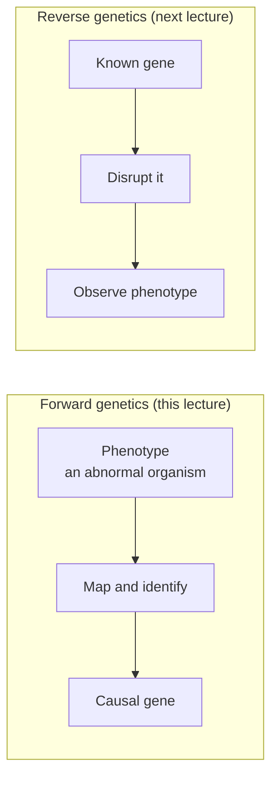
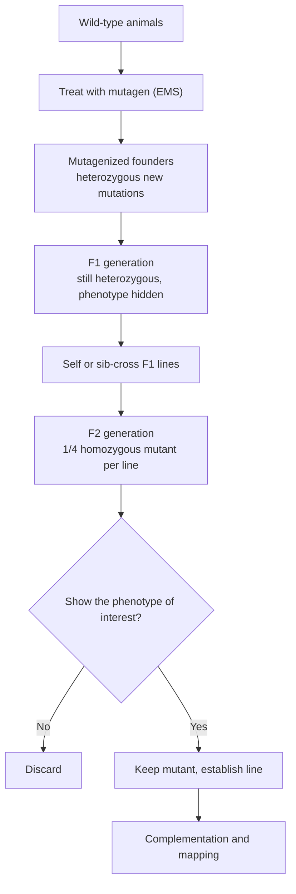
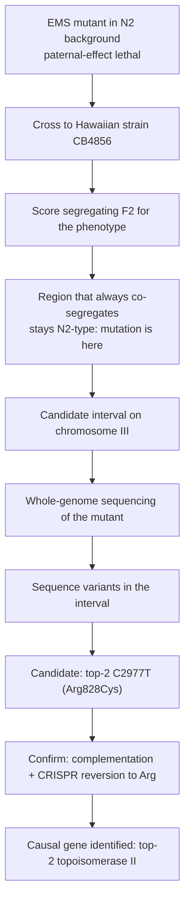

# Forward Genetics

**Course:** BME333 / BIO333 Genetics (UNIST, 2026 Fall) · Lecture 14 · ~60 min
**Syllabus:** [← Course schedule](../../lectures/2026.BME333-BIO333-Syllabus.md) — Week 09, 2026-10-28 (Wed)
**Languages:** English · [한국어](../../ko/lectures/lec14_Forward-Genetics.md)

## Learning Objectives
By the end of this lecture, students should be able to:
- Define forward genetics ("phenotype → gene") and contrast it with reverse genetics.
- Design a mutagenesis screen: mutagen choice, generations, and phenotype scoring.
- Explain complementation and how mutants are grouped into genes.
- Describe how a mutation is mapped and identified, from classical linkage to whole-genome sequencing.
- Recognize the role of model organisms and modifier/suppressor screens in dissecting biological pathways.

## Lecture

### 1. What is forward genetics? (~7 min)

**Forward genetics** starts from a **phenotype** and works backward to the **gene** responsible: *phenotype → gene*. You find (or induce) an organism that behaves abnormally — a fly with the wrong number of body segments, a yeast cell that divides too small, a worm whose sperm kill the embryo — and you ask, "which gene, when broken, causes this?" This is the opposite of **reverse genetics** (next lecture), which starts from a known gene and asks what happens when you disrupt it (*gene → phenotype*).

**Figure — The two directions of genetic analysis.**



The great virtue of forward genetics is that it is **unbiased** and **assumption-free**: you do not need to know in advance which genes matter. Hobert (2010) calls the classic forward-genetic screen conceptually beautiful precisely because its unpredictability rewards the adventurous — it hands you genes you would never have guessed to test (see [en](../../en/review/Hobert2010_Genetics_WholeGenomeSequencing.md) · [ko](../../ko/review/Hobert2010_Genetics_WholeGenomeSequencing.md)). His examples are landmarks: Ed Lewis's homeotic mutants revealing the genes that specify body plan, and the discovery of the first microRNA (*lin-4*) — neither predictable from prior knowledge. Bonini and Berger (2017) make the historical case that these unbiased screens in **model organisms** (yeast, fly, worm, zebrafish) repeatedly won Nobel Prizes — cell-cycle control, body-plan specification, programmed cell death — and remain indispensable even in the genome era, because a model organism lets you *prove* which gene is causal through experiment (see [en](../../en/review/Bonini2017_Genetics_ModelOrganism.md) · [ko](../../ko/review/Bonini2017_Genetics_ModelOrganism.md)).

Hobert stresses the crucial second step that students often skip: a phenotype alone is not the answer. The mechanistic insight comes only when you identify the **actual molecular lesion** — the specific DNA change — and historically that identification was the bottleneck of the whole enterprise. Segments 2–5 follow the classic pipeline; Segment 5 shows how sequencing dissolved the bottleneck.

### 2. Mutagenesis (~10 min)

Spontaneous mutants are too rare to screen for efficiently, so forward genetics begins by **mutagenesis** — deliberately raising the mutation rate with a **mutagen**. Hobert (2010) lays out the two broad classes and their trade-offs, which drive every later design choice.

**Chemical mutagens** — **EMS** (ethyl methanesulfonate) in worms/flies/plants, **ENU** in mice — alkylate bases and cause mostly **point mutations**. Their advantages are decisive: high mutation frequency, **no positional bias** (any gene can be hit), and a rich **spectrum of allele types**, from complete loss of function to subtle changes. Their historical drawback was that the lesion is a single invisible base change that had to be located by tedious mapping.

**Physical mutagens** — **X-rays / ionizing radiation** — break DNA and tend to cause **rearrangements** (deletions, translocations, inversions) rather than clean point mutations.

**Insertional / biological mutagens** — **transposons**, viruses, plasmids — disrupt a gene by inserting into it, leaving a known DNA sequence as a **molecular tag ("footprint")**. This makes the gene trivial to find (you know the inserted sequence), which is why many labs favored them — but they carry **positional bias** (they prefer certain insertion sites), so some genes are never hit.

The allele spectrum from chemical mutagens is worth naming, because it recurs throughout genetics:

| Allele class | Effect on gene activity | Typical dominance |
|--------------|------------------------|-------------------|
| **Amorph (null)** | complete loss of function | usually recessive |
| **Hypomorph** | reduced function | usually recessive |
| **Hypermorph** | increased normal function | often dominant |
| **Neomorph** | new/ectopic function | dominant |
| **Antimorph** | dominant-negative (interferes with wild type) | dominant |

A practical constraint governs dosage: more mutagen means more mutations per genome but lower survival, so screens tune the dose to a compromise — roughly one mutation in the gene of interest per screened individual, without killing everyone. The choice of mutagen is strategic: point mutations from EMS are ideal for dissecting protein function and building **allelic series**, while transposons trade breadth for easy cloning.

### 3. Designing a screen (~10 min)

A **genetic screen** systematically searches a mutagenized population for individuals with the phenotype of interest. Three design decisions define it.

**A scorable phenotype.** You can only find what you can see. The phenotype must be reliable and efficient to score across thousands of individuals — colony size on a plate, eye morphology under a dissecting scope, survival at a given temperature, a fluorescent readout.

**Generations: dominant vs. recessive.** A **dominant** mutation shows in the **F1** (the mutagenized generation's offspring) — fast, but most loss-of-function alleles are recessive. To recover **recessive** mutations you must breed to the **F2**, where a heterozygous carrier's self-cross or sib-cross makes the mutation homozygous and the phenotype visible. This F1/F2 logic is the backbone of the classic screen.

**Figure — A classic F2 recessive mutagenesis screen (the required workflow).**



**Saturation.** The goal is often **mutational saturation** — hitting *every* gene able to produce the phenotype, usually enough times that each gene is represented by multiple independent alleles. When new alleles keep landing in genes you already have (rather than new genes), the screen is saturated and you can argue you have found the whole set. Hobert (2010) notes that whole-genome sequencing brings this "holy grail" of near-complete saturation within practical reach.

**Essential genes need a trick.** If a gene is essential, its loss-of-function mutant is dead and cannot be propagated or scored. The solution is a **conditional allele**, most commonly **temperature-sensitive (ts)**: the mutant protein works at a **permissive** temperature (so the strain lives) but fails at a **restrictive** temperature (so you can trigger and study the defect on demand). This trick pervades the worked examples below — the *wee* and *top-2* studies both hinge on ts alleles of essential cell-division genes.

### 4. Complementation & allelic series (~8 min)

A screen yields many mutants — but how many *genes* do they represent? Two mutants with the same phenotype might be broken in the same gene or in two different genes. The **complementation test** answers this: cross two recessive mutants and look at the F1 (which carries one copy of each mutation).

- If the F1 is **wild-type**, the two mutations **complement** — each parent supplies a good copy of the gene the other lacks, so they are in **different genes**.
- If the F1 is **mutant**, the mutations **fail to complement** — neither can supply a working copy, so they are in the **same gene** (the same **complementation group**).

**Figure — Reading a complementation test.**

```
                cross mutant a  x  mutant b, examine F1
   F1 wild-type  -->  mutations in DIFFERENT genes   (a fixes b, b fixes a)
   F1 mutant     -->  mutations in the SAME gene      (neither supplies function)
```

Sorting all mutants into complementation groups tells you the number of genes, and the group sizes hint at saturation. The classic *wee* screen in fission yeast is a clean illustration (see [en](../../en/article/Nurse1980_Genetics_Wee+Spombe.md) · [ko](../../ko/article/Nurse1980_Genetics_Wee+Spombe.md); [en](../../en/review/Murray2016_Genetics_Nurse+Thuriaux+Wee+CellCycle.md) · [ko](../../ko/review/Murray2016_Genetics_Nurse+Thuriaux+Wee+CellCycle.md)). Paul Nurse and Pierre Thuriaux isolated **52 *wee* mutants** — cells that divide at roughly *half* the normal size, "wee" being Scots for small. Genetic mapping showed **51 of 52 mapped to a single gene, *wee1***, and just **one exceptional mutant (*cdc2-1w*)** lay in a different gene, *cdc2*.

That one exception carried the whole insight, and it shows the value of an **allelic series** (multiple alleles of one gene). Previously known *cdc2* alleles were temperature-sensitive **loss-of-function** mutations that *blocked* mitosis (the cell-division-cycle "cdc" arrest). The new *cdc2-1w* allele in the *same gene* did the **opposite** — it caused *premature*, undersized division (the *wee* phenotype). Two opposite phenotypes from one gene are most simply explained if **Cdc2 is a positive activator of mitosis**: complete loss prevents division, while an altered-activity allele fires mitosis too early. Gene-dosage experiments completed the logic: **halving *wee1* dosage** shrank division size (so Wee1 is a **dosage-sensitive inhibitor**), whereas **halving *cdc2* dosage** barely mattered (so it is a specific *aspect* of Cdc2 activity, not its amount, that sets timing — later revealed to be inhibitory phosphorylation by Wee1). This forward screen defined the antagonistic Wee1–Cdc2 (CDK1) circuit that is conserved to humans, work for which Nurse shared the 2001 Nobel Prize.

### 5. From mutant to gene: mapping (~12 min)

You have a mutant and know it defines a gene — but *which* gene, and *which* base change? This is **mapping**, historically the slowest step. The classical route is **recombination (linkage) mapping** and **positional cloning**: cross the mutant to a strain carrying many known markers, and measure how often the mutation is inherited together with each marker. The **closer** a marker lies to the mutation, the **less** they recombine, so co-inheritance frequency reports genetic distance. This narrows the mutation to an interval, which you then clone and sequence — a process Hobert vividly calls the "wastelands of genetic mapping."

Whole-genome sequencing collapsed this. Hobert (2010) argues that **WGS lets you exploit chemical mutagens without their drawback**: instead of laboriously locating an EMS point mutation, you simply **read out every sequence difference** between the mutant and the reference (see [en](../../en/review/Hobert2010_Genetics_WholeGenomeSequencing.md) · [ko](../../ko/review/Hobert2010_Genetics_WholeGenomeSequencing.md)). His lab identified the molecular basis of >10 *C. elegans* neuronal-development mutants this way; sequencing a worm genome at 10× then cost <$2,000 and took ~5 days. The remaining problem — distinguishing the *causal* variant from harmless background variants — is solved by combining WGS with rough mapping and by validating candidates (transformation rescue, RNAi phenocopy, or, most powerfully, resequencing multiple independent alleles of the same locus).

The *top-2* study (Jaramillo-Lambert et al. 2016) is a textbook worked example that fuses both approaches (see [en](../../en/article/Jaramillo-Lambert2016_Genetics_top2.md) · [ko](../../ko/article/Jaramillo-Lambert2016_Genetics_top2.md); primer [en](../../en/review/Jaramillo-Lambert2016_Boeteng2018_GeneticsPrimer_top2.md) · [ko](../../ko/review/Jaramillo-Lambert2016_Boeteng2018_GeneticsPrimer_top2.md)). They had a **paternal-effect embryonic lethal** mutant — embryos die when the mutant *male* contributes sperm but survive with wild-type sperm, so the defect is in the sperm. To find the gene they used **Hawaiian SNP mapping + WGS**: the Hawaiian strain **CB4856** differs from the standard **N2 Bristol** reference at thousands of SNPs across the genome, so by crossing to it and tracking which SNP region always co-segregates with the phenotype, they narrowed the mutation to a region of chromosome III.

**Figure — Hawaiian SNP mapping + WGS: from mutant to causal base (top-2).**



WGS pinpointed a **C2977T** change causing an **Arg828Cys** missense in ***top-2*** (topoisomerase II). Confirmation was rigorous: complementation tests plus a **precise CRISPR-Cas9 reversion** that restored the arginine codon and rescued the phenotype. The biology followed — at the restrictive temperature all 953 mutant spermatids were **anucleate** (no chromatin at all) versus normal chromatin in wild type, showing TOP-2 is essential for meiotic chromosome segregation. This is forward genetics end to end: phenotype → screen → map → sequence → confirm → mechanism.

### 6. Modifier and suppressor screens (~8 min)

A standard screen finds genes whose loss *alone* produces a phenotype. But many biologically important genes are missed because their loss alone does nothing (redundancy) or is lethal. **Modifier screens** overcome this by starting from a **sensitized background** — an organism already carrying a defect — and screening for *second* mutations that make it **worse (enhancers)** or **better (suppressors)**. Because both mutations act on the same process, the modifiers tend to be functional partners of the first gene, illuminating an entire pathway.

**Figure — Suppressor and enhancer logic on a sensitized background.**

```
                sensitized starting phenotype (partial defect)
                                |
        add a second mutation --+--------------------------+
                                |                          |
                     SUPPRESSOR: phenotype improves   ENHANCER: phenotype worsens
                     (partner acts against, or          (partner acts with, or
                      bypasses, the first gene)           in parallel to, first gene)
```

Kankel et al. (2020) show the power of this at genome scale for human disease (see [en](../../en/article/Kankel2020_Genetics_Drosophila-ALS-modifier.md) · [ko](../../ko/article/Kankel2020_Genetics_Drosophila-ALS-modifier.md)). To find modifiers of **ALS** (amyotrophic lateral sclerosis), they built sensitized *Drosophila* by driving eye-specific expression of human ALS proteins (mutant **FUS** or **TDP-43**) with the **GAL4-UAS system**, producing a degenerating-eye phenotype. Screening **15,500 transposon insertions**, they scored each for suppressing or enhancing that degeneration, recovering **637 FUS modifiers and 553 TDP-43 modifiers**, with **432 shared** between the two independent models. Requiring a modifier to work in *both* models is a clever filter — it selects for shared disease pathways over model-specific noise. Convergent analysis flagged the **phospholipase D (PLD) pathway**; knocking down *dPld* suppressed degeneration in FUS, TDP-43, *and* C9orf72 models, and PLD inhibition gave modest motor improvement in SOD1 mutant mice — a candidate therapeutic target reached by pure forward genetics.

Suppressor logic also builds gene networks around a hard-to-study gene, previewing next lecture: Garen (1992) recounts the classic use of lethal-mutant screens to dissect *Drosophila* development, estimating ~1,000 zygotic genes control imaginal-disc fate and using maternal-effect screens to probe the earliest positional "blueprint" (see [en](../../en/review/Garen1992_Genetics_Homunculus.md) · [ko](../../ko/review/Garen1992_Genetics_Homunculus.md)).

### 7. Strengths, limits & wrap-up (~5 min)

Forward genetics' defining strength is that it is **unbiased**: it discovers the genes that actually matter for a process, including ones nobody would have nominated — the reason it keeps yielding Nobel-winning surprises (Bonini & Berger 2017) and, in the Kankel study, drug targets. Its costs are equally real. **Redundancy**: if two genes back each other up, losing one produces no phenotype and the screen misses it (this is precisely what modifier and reverse-genetic approaches recover). **Lethality**: essential genes are invisible unless you build **conditional (ts) alleles**. **Mapping effort**: historically the rate-limiting step, though WGS has largely removed it. And screens see only what their phenotype assay can score.

The through-line for the course is that forward genetics answers *"which genes cause this phenomenon?"* without prior assumptions, while **reverse genetics** (Lecture 15) answers the complementary *"what does this specific gene do?"* — and modern biology weaves the two together: a forward screen names the genes, and reverse-genetic perturbation then tests each one's role precisely.

## Key Takeaways
- **Forward genetics** goes *phenotype → gene*: an unbiased, assumption-free search for the genes that cause a trait; **reverse genetics** goes the other way (*gene → phenotype*).
- **Mutagens** trade off cleanly: **EMS/ENU** give unbiased point mutations and a rich allele spectrum (amorph/hypomorph/hypermorph/neomorph/antimorph) but need mapping; **X-rays** cause rearrangements; **transposons** self-tag the gene but are positionally biased.
- A **screen** needs a scorable phenotype, the right generation (**F1** for dominant, **F2** for recessive), and aims at **saturation**; **essential genes** require **conditional (temperature-sensitive)** alleles.
- The **complementation test** counts genes: F1 wild-type = different genes (complement); F1 mutant = same gene — as in *wee* (51/52 → *wee1*, the exception *cdc2-1w* revealing Cdc2 as a mitotic activator).
- Mapping went from **recombination/positional cloning** to **WGS**; combining WGS with **Hawaiian SNP mapping** and confirmation (complementation + CRISPR reversion) identified *top-2* (C2977T, Arg828Cys) as essential for meiotic chromosome segregation.
- **Modifier/suppressor screens** on a **sensitized background** find pathway partners and disease modifiers — the *Drosophila* ALS screen (15,500 insertions, FUS + TDP-43) converged on the **PLD pathway** as a therapeutic target.
- Forward genetics is uniquely **unbiased** but limited by **redundancy** and **lethality**; it pairs naturally with reverse genetics.

## Textbook Reading
- **Genetics: From Genes to Genomes (8e)** — Ch. 8 Using Mutations to Study Genes. → [textbook ref](../../lectures/ref.Genetics-FromGenesToGenomes.md)

## Notes in this vault
Reviews & articles to introduce in class (each has a bilingual en/ko pair):
- `Bonini2017_Genetics_ModelOrganism` — Why model organisms make forward screens powerful; sets the stage. · [en](../../en/review/Bonini2017_Genetics_ModelOrganism.md) · [ko](../../ko/review/Bonini2017_Genetics_ModelOrganism.md)
- `Hobert2010_Genetics_WholeGenomeSequencing` — WGS as the modern route from mutant to causal gene; the mapping segment. · [en](../../en/review/Hobert2010_Genetics_WholeGenomeSequencing.md) · [ko](../../ko/review/Hobert2010_Genetics_WholeGenomeSequencing.md)
- `Nurse1980_Genetics_Wee+Spombe` — Classic *wee* screen in fission yeast; forward genetics dissecting cell-cycle control. · [en](../../en/article/Nurse1980_Genetics_Wee+Spombe.md) · [ko](../../ko/article/Nurse1980_Genetics_Wee+Spombe.md)
- `Murray2016_Genetics_Nurse+Thuriaux+Wee+CellCycle` — Retrospective on the *wee1/cdc* work; context for the Nurse 1980 article. · [en](../../en/review/Murray2016_Genetics_Nurse+Thuriaux+Wee+CellCycle.md) · [ko](../../ko/review/Murray2016_Genetics_Nurse+Thuriaux+Wee+CellCycle.md)
- `Jaramillo-Lambert2016_Genetics_top2` — Forward-genetic identification of a *top2* allele in *C. elegans*; a worked example. · [en](../../en/article/Jaramillo-Lambert2016_Genetics_top2.md) · [ko](../../ko/article/Jaramillo-Lambert2016_Genetics_top2.md)
- `Jaramillo-Lambert2016_Boeteng2018_GeneticsPrimer_top2` — Teaching primer for the *top2* study; use to unpack the screen logic. · [en](../../en/review/Jaramillo-Lambert2016_Boeteng2018_GeneticsPrimer_top2.md) · [ko](../../ko/review/Jaramillo-Lambert2016_Boeteng2018_GeneticsPrimer_top2.md)
- `Kankel2020_Genetics_Drosophila-ALS-modifier` — Modifier screen in *Drosophila* for ALS; showcases suppressor/enhancer screens. · [en](../../en/article/Kankel2020_Genetics_Drosophila-ALS-modifier.md) · [ko](../../ko/article/Kankel2020_Genetics_Drosophila-ALS-modifier.md)
- `Garen1992_Genetics_Homunculus` — Historical perspective on genetic dissection of development; framing/wrap-up. · [en](../../en/review/Garen1992_Genetics_Homunculus.md) · [ko](../../ko/review/Garen1992_Genetics_Homunculus.md)

## Discussion Questions
1. You want to find recessive loss-of-function mutations in genes required for a viable process. Walk through why the phenotype appears only in the F2, not the F1, and how you would decide when your screen has reached saturation.
2. In the *wee* screen, 51 of 52 mutants mapped to *wee1* but one (*cdc2-1w*) mapped to *cdc2* and gave the *opposite* dominance/phenotype behavior of known *cdc2* alleles. Explain, using an allelic series and the gene-dosage results, how these data show Cdc2 is an activator and Wee1 a dosage-sensitive inhibitor.
3. Compare classical recombination mapping with the Hawaiian-SNP + WGS strategy used for *top-2*. Why was mapping historically the bottleneck of forward genetics, and what specifically did WGS change? Why were complementation and CRISPR reversion still necessary after sequencing found the candidate?
4. A standard single-gene screen would miss a gene whose loss is buffered by redundancy. Explain how the *Drosophila* ALS modifier screen recovered such genes, and why requiring modifiers to act in *both* the FUS and TDP-43 models strengthens the conclusion that the PLD pathway is disease-relevant.
5. Forward genetics is "unbiased" but blind to redundant and essential genes; reverse genetics is targeted but assumes you know which gene to test. Design a two-step strategy that combines them to dissect a pathway where several genes act redundantly.
