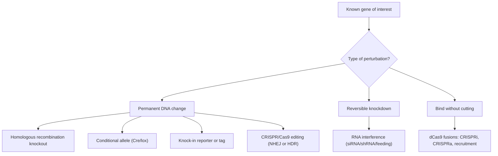
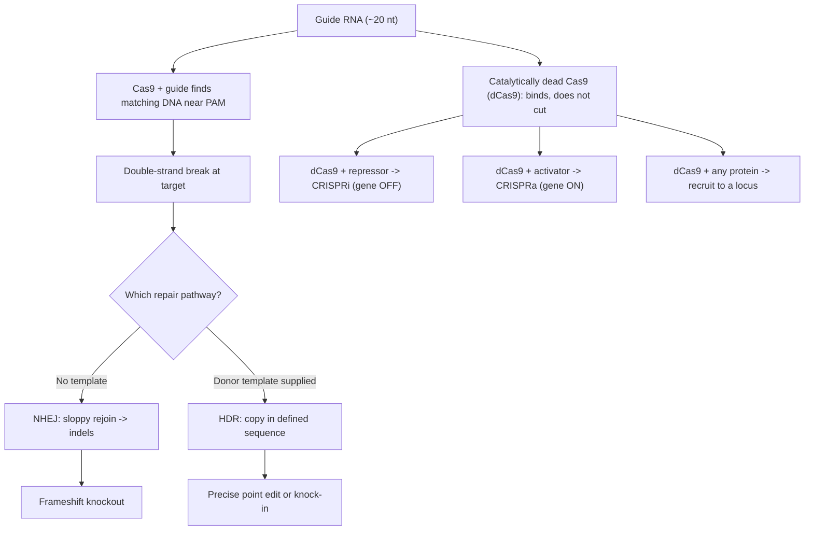
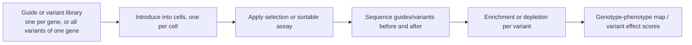

# Reverse Genetics

**Course:** BME333 / BIO333 Genetics (UNIST, 2026 Fall) · Lecture 15 · ~60 min
**Syllabus:** [← Course schedule](../../lectures/2026.BME333-BIO333-Syllabus.md) — Week 10, 2026-11-02 (Mon)
**Languages:** English · [한국어](../../ko/lectures/lec15_Reverse-Genetics.md)

## Learning Objectives
By the end of this lecture, students should be able to:
- Define reverse genetics ("gene → phenotype") and contrast it with forward genetics.
- Compare the main perturbation tools: knockouts, knock-ins, RNAi, and CRISPR/Cas.
- Explain how CRISPR/Cas9 and dCas9 fusions enable targeted mutation, activation, and repression.
- Describe massively parallel / multiplexed approaches that scale reverse genetics to whole genomes.
- Interpret phenotypes from targeted perturbations, including redundancy and off-target caveats.

## Lecture

### 1. What is reverse genetics? (~7 min)

**Reverse genetics** begins with a **known gene or sequence** and asks what its loss or alteration does to the organism: *gene → phenotype*. It is the mirror image of forward genetics (Lecture 14), which starts from a phenotype and hunts for the gene. The two are complementary halves of a single logic. Forward genetics is unbiased but blind to redundant and essential genes; reverse genetics is precise and hypothesis-driven but requires you to already know which gene to interrogate. In the genome era, reverse genetics has become the dominant everyday mode: sequencing hands us thousands of genes of unknown function, and the natural question — Bonini and Berger (2017) frame this as the central use of model organisms — is to disrupt each one and watch (see the forward-genetics companion note; the same model-organism logic applies here). The De Stasio (2012) primer states the definition plainly for *C. elegans*: reverse genetics is the **gene-to-phenotype** strategy, exemplified by feeding worms bacteria that knock down a chosen gene (see [en](../../en/review/Polly2012_Stacio2012_GeneticsPrimer_LIN-35.md) · [ko](../../ko/review/Polly2012_Stacio2012_GeneticsPrimer_LIN-35.md)).

The field is really a **toolkit of perturbations**, graded from permanent DNA changes to reversible knockdowns. The rest of the lecture builds this toolkit up, tool by tool.

**Figure — The reverse-genetics perturbation toolkit (the required overview).**



### 2. Making targeted mutations (~10 min)

The oldest reverse-genetic tool is the **gene knockout by homologous recombination (HR)**. You build a DNA construct in which the target gene is interrupted (often by a selectable marker) but flanked by sequence identical to the gene's genomic neighbors. The cell's own HR machinery swaps the construct in for the native locus, replacing the working gene with a disabled one. This is how the classic yeast and mouse knockouts were made, and Bonini and Berger (2017) note that whole-genome **knockout libraries** in yeast (every gene deleted, one strain at a time) became a foundational resource.

A plain whole-body knockout has two problems: if the gene is essential the animal dies before you can study it, and you cannot tell *where* or *when* the gene acts. **Conditional alleles** solve both. The most widely used system is **Cre/lox**: you flank ("flox") the gene with two short **loxP** sites, then supply the **Cre recombinase**, which excises whatever lies between them. By expressing Cre only in a chosen tissue or only after a drug is given, you delete the gene in **space** and **time** of your choosing — a **tissue-specific** or **inducible** knockout.

**Figure — Cre/lox conditional deletion.**

```
before Cre:   ---[loxP]===GENE===[loxP]---     gene intact (animal develops normally)
                              |  add Cre (in chosen tissue / at chosen time)
                              v
after Cre:    ---[loxP]---                      gene excised only there / then
```

The same targeting logic runs in reverse to *add* rather than remove sequence: a **knock-in** inserts a defined element at a precise locus — most usefully a **reporter** (e.g. GFP fused to the gene, revealing where and when the protein is made) or an epitope **tag** for biochemistry. Knock-ins convert an endogenous gene into a readout of its own expression and localization, without the artifacts of overexpression from a transgene.

### 3. RNA interference (~8 min)

**RNA interference (RNAi)** knocks a gene *down* rather than out, at the RNA level. Double-stranded RNA matching the target's sequence is processed into short guides that direct the cell's machinery to destroy the matching mRNA, so less protein is made. Its appeal is speed and scale: no need to engineer the genome, and you can target essentially any gene by simply supplying the right sequence. In *C. elegans* this is astonishingly easy — **feeding RNAi**, where worms eat bacteria expressing the dsRNA, lets one lab knock down thousands of genes in parallel (De Stasio 2012 highlights this as a defining strength of the worm system; see [en](../../en/review/Polly2012_Stacio2012_GeneticsPrimer_LIN-35.md) · [ko](../../ko/review/Polly2012_Stacio2012_GeneticsPrimer_LIN-35.md)). Bonini and Berger (2017) note genome-wide RNAi libraries covering every worm gene.

But RNAi comes with caveats that students must weigh against a true mutation. Hobert (2010) — writing from the forward-genetics side — lists them precisely: RNAi gives only **partial knockdown** (a hypomorph, not a null), suffers **variable penetrance**, and produces **off-target effects** where an imperfect sequence match silences the wrong gene. This is exactly why RNAi phenotypes must be confirmed, and why CRISPR (which makes clean, heritable null alleles) has displaced RNAi for many purposes. Still, RNAi's reversibility and scalability keep it valuable, especially for essential genes (a partial knockdown may be viable where a null is lethal) and for rapid genome-wide screens.

### 4. CRISPR/Cas genome editing (~12 min)

**CRISPR/Cas9** made precise genome editing routine. The system has two parts: the **Cas9** nuclease and a **guide RNA (gRNA)** whose ~20-nucleotide sequence is complementary to the target DNA. Cas9 uses the guide to find the matching genomic site (next to a short **PAM** motif) and cuts both DNA strands, making a **double-strand break (DSB)** at a programmable location. What happens next depends on which repair pathway the cell uses — and this fork is the key to what CRISPR can do.

- **Non-homologous end joining (NHEJ)** re-ligates the broken ends directly but sloppily, often leaving small insertions or deletions (**indels**). An indel in a coding exon usually shifts the reading frame and destroys the gene — so NHEJ is the route to a **knockout**.
- **Homology-directed repair (HDR)** uses a supplied **donor template** to copy in a defined sequence at the break — so HDR is the route to a **precise edit or knock-in**: install an exact point mutation, correct a mutation, or insert a tag.

**Figure — CRISPR/Cas9 editing and dCas9 fusions (the required CRISPR/dCas9 diagram).**



Two refinements sharpen precision by avoiding the DSB altogether. **Base editors** fuse a catalytically impaired Cas9 to a nucleotide-modifying enzyme, chemically converting one base to another (e.g. C→T) at the target without cutting both strands. **Prime editors** fuse Cas9 to a reverse transcriptase and use an extended guide that both specifies the target and templates the new sequence, writing small defined edits directly. Both reduce the random indels and cell-toxicity of DSB repair. The McVey primer (2022) sets CRISPR's arrival in context: the Doudna–Charpentier 2012 work made programmable cutting possible, after which "guide RNA plus a protein" became a universal targeting device (see [en](../../en/review/Kuhl2020_Genetics_dCas9+Ctf19+Recombination-McVey2022primer.md) · [ko](../../ko/review/Kuhl2020_Genetics_dCas9+Ctf19+Recombination-McVey2022primer.md)).

### 5. dCas9 and beyond cutting (~8 min)

The insight that turned CRISPR from an editing tool into a general-purpose toolkit is that the **targeting** (guide RNA finds the site) and the **cutting** (nuclease activity) are separable. **Catalytically dead Cas9 (dCas9)** has its nuclease domains disabled: it still binds wherever the guide directs, but it does not cut. On its own that is inert — but fuse *any* protein domain to dCas9 and you have, in the McVey primer's phrase, a **programmable "molecular GPS"** that can deliver any activity to any chosen locus (see [en](../../en/review/Kuhl2020_Genetics_dCas9+Ctf19+Recombination-McVey2022primer.md) · [ko](../../ko/review/Kuhl2020_Genetics_dCas9+Ctf19+Recombination-McVey2022primer.md)).

The canonical uses tune transcription without touching the DNA sequence:

| Tool | dCas9 fused to | Effect on target gene |
|------|----------------|-----------------------|
| **CRISPRi** (interference) | a transcriptional repressor domain | turns the gene **OFF** (reversible knockdown) |
| **CRISPRa** (activation) | a transcriptional activator domain | turns the gene **ON** / up |
| **dCas9 recruitment** | any protein of interest | brings that protein's activity to a defined locus |

The recruitment idea reaches well beyond transcription, as Kuhl et al. (2020) demonstrate elegantly (see [en](../../en/article/Kuhl2020_Genetics_dCas9+Ctf19+Recombination.md) · [ko](../../ko/article/Kuhl2020_Genetics_dCas9+Ctf19+Recombination.md)). Meiotic crossovers are normally **suppressed near centromeres**, because a crossover too close to the kinetochore disrupts tension-sensing and causes chromosome nondisjunction — but *which* kinetochore protein enforces this suppression was unknown. The authors fused dCas9 to individual subunits of the yeast **Ctf19** kinetochore complex and used guide RNAs to **recruit each one to an ectopic, non-centromeric locus**, then measured local crossover frequency. Only **Ctf19** suppressed crossovers there; the activity mapped to its N-terminal 30 residues, required **DDK phosphorylation** of nine serine/threonine sites, and worked by recruiting the **Scc2-Scc4 cohesin loader**, channeling repair toward non-crossover outcomes. The point for this lecture is methodological: this is reverse genetics not by mutating a gene but by **placing a protein where it does not normally act** and reading the consequence — an entirely new experimental degree of freedom that dCas9 opened up.

### 6. Scaling up: multiplexed & massively parallel reverse genetics (~10 min)

Because a CRISPR or RNAi reagent is just a short guide sequence, you can make **libraries** of them — one guide per gene, or thousands of guides tiling one gene — and apply them all at once in a **pooled screen**. Cells are transduced so that each cell receives one guide, subjected to a selection (survival, drug resistance, a sortable marker), and then the guides are **sequenced** before and after: guides that grow enriched or depleted point to genes whose perturbation helped or hurt. This scales reverse genetics from one gene at a time to whole genomes in a single experiment.

The De Stasio (2012) primer gives a concrete genome-scale example (see [en](../../en/review/Polly2012_Stacio2012_GeneticsPrimer_LIN-35.md) · [ko](../../ko/review/Polly2012_Stacio2012_GeneticsPrimer_LIN-35.md)). *lin-35* is the worm ortholog of the human **retinoblastoma (Rb)** tumor suppressor; losing *lin-35* alone barely matters, but combined with loss of *slr-2* it causes lethal early-larval (L1) arrest — a **synthetic phenotype** visible only when two genes are hit together. Polley and Fay maintained the double mutant with a rescuing GFP-marked transgene, then **fed 16,757 different RNAi bacteria** (one gene each) and looked for knockdowns that let the otherwise-arrested double mutants survive. Any such gene is a **suppressor** of the synthetic-lethal interaction; the suppressors fell into ribosome-biogenesis genes, known synMuv genes, and prohibitins — mapping a genetic network around Rb that single-gene analysis could never reveal.

At the finest scale, **deep mutational scanning (DMS)** applies the same logic to every possible variant of a single gene. Shendure and Fields (2016) argue that observational human genetics must be supplemented by **perturbational massively parallel functional assays** to interpret what variants actually do (see [en](../../en/review/Shendure2016_Genetics_MassiveParallelGenetics.md) · [ko](../../ko/review/Shendure2016_Genetics_MassiveParallelGenetics.md)). Their five-step framework: (1) generate a large **allelic series**, (2) introduce the variants into a model system, (3) measure their functional effects in a **multiplexed assay**, (4) partition variants by effect size, and (5) calibrate to human phenotypes.

**Figure — Massively parallel reverse genetics: from a variant library to a genotype–phenotype map.**



The flagship application is **BRCA1**: thousands of clinical **variants of uncertain significance (VUS)** cannot be classified as pathogenic from observation alone, but saturation genome editing scores every variant's effect on cell function at once, producing a comprehensive variant-effect map that turns variant interpretation from passive observation into active experiment.

### 7. Caveats & synthesis (~5 min)

Every reverse-genetic result must be read against three recurring caveats. **Genetic redundancy**: if a paralog buffers the target, knocking it out yields *no* phenotype even though the gene is functional — the *lin-35* case is a paradigm, invisible until *slr-2* was also removed. **Incomplete penetrance / partial effects**: RNAi in particular gives graded, variable knockdown, so a weak or absent phenotype may reflect residual protein rather than a gene that does nothing. **Off-target effects**: both RNAi (imperfect-match silencing) and CRISPR (guides cutting similar sequences elsewhere) can produce phenotypes from the *wrong* locus — which is why rigorous studies confirm with multiple independent guides/alleles, rescue experiments, and, as in *top-2* (Lecture 14), precise reversion.

The synthesis for the course is that forward and reverse genetics are two directions on one road. A forward screen answers *"which genes cause this?"* without assumptions; reverse genetics answers *"what does this gene do?"* with precision. Modern work chains them: a forward screen or a GWAS nominates genes and variants, and reverse-genetic perturbation — CRISPR editing, dCas9 recruitment, pooled screens, deep mutational scanning — then tests each one's function at scale. Together they convert a genome sequence (Lecture 13) into a mechanistic understanding of what every gene, and every variant, actually does.

## Key Takeaways
- **Reverse genetics** goes *gene → phenotype*: start from a known gene and perturb it; it is the precise, hypothesis-driven complement to unbiased forward genetics.
- The **toolkit** runs from permanent to reversible: **HR knockouts**, **Cre/lox** conditional (tissue-/time-specific) alleles, **knock-in** reporters/tags, **RNAi** knockdown, and **CRISPR/Cas9** editing.
- **RNAi** is fast and scalable (worm **feeding RNAi**, genome-wide libraries) but only a partial knockdown with **variable penetrance and off-target** effects.
- **CRISPR/Cas9** cuts a programmable DSB; **NHEJ** → frameshift **knockout**, **HDR + donor** → precise **edit/knock-in**; **base and prime editors** write defined changes without a DSB.
- **dCas9** separates targeting from cutting — a programmable "molecular GPS": **CRISPRi** (off), **CRISPRa** (on), or **recruit any protein** to a locus, as in Kuhl et al.'s dCas9-**Ctf19** mapping of pericentromeric crossover suppression.
- **Pooled screens** and **deep mutational scanning** scale reverse genetics genome-wide; the *lin-35;slr-2* RNAi suppressor screen (16,757 clones) revealed a **synthetic** network, and Shendure & Fields' 5-step massively parallel framework classifies **BRCA1** VUS.
- Always weigh **redundancy, incomplete penetrance, and off-target effects**; confirm with multiple alleles/guides and rescue. Forward + reverse genetics together turn a genome into mechanism.

## Textbook Reading
- **Genetics: From Genes to Genomes (8e)** — Ch. 21 Manipulating the Genomes of Eukaryotes. → [textbook ref](../../lectures/ref.Genetics-FromGenesToGenomes.md)

## Notes in this vault
Reviews & articles to introduce in class (each has a bilingual en/ko pair):
- `Kuhl2020_Genetics_dCas9+Ctf19+Recombination` — dCas9 fusion (Ctf19) to steer a locus-specific process; worked example of dCas9 beyond editing. · [en](../../en/article/Kuhl2020_Genetics_dCas9+Ctf19+Recombination.md) · [ko](../../ko/article/Kuhl2020_Genetics_dCas9+Ctf19+Recombination.md)
- `Kuhl2020_Genetics_dCas9+Ctf19+Recombination-McVey2022primer` — Teaching primer for the dCas9/Ctf19 study; use to unpack the design. · [en](../../en/review/Kuhl2020_Genetics_dCas9+Ctf19+Recombination-McVey2022primer.md) · [ko](../../ko/review/Kuhl2020_Genetics_dCas9+Ctf19+Recombination-McVey2022primer.md)
- `Polly2012_Stacio2012_GeneticsPrimer_LIN-35` — Primer illustrating targeted analysis of a defined gene (*lin-35*) in *C. elegans*. · [en](../../en/review/Polly2012_Stacio2012_GeneticsPrimer_LIN-35.md) · [ko](../../ko/review/Polly2012_Stacio2012_GeneticsPrimer_LIN-35.md)
- `Shendure2016_Genetics_MassiveParallelGenetics` — Massively parallel assays that scale reverse genetics genome-wide. · [en](../../en/review/Shendure2016_Genetics_MassiveParallelGenetics.md) · [ko](../../ko/review/Shendure2016_Genetics_MassiveParallelGenetics.md)

## Discussion Questions
1. Define reverse genetics and contrast it with forward genetics using a concrete gene. When would you *have* to use reverse genetics rather than a forward screen, and when would the reverse be true?
2. After a Cas9 cut, the same guide can produce either a knockout or a precise edit depending on the cell. Explain the NHEJ vs. HDR fork and how you would bias the outcome toward each. Why do base and prime editors avoid the double-strand break, and what do they gain by doing so?
3. dCas9 "separates targeting from cutting." Explain how this single idea yields CRISPRi, CRISPRa, and protein recruitment. In Kuhl et al., why was recruiting Ctf19 to an *ectopic* locus a more decisive test than simply deleting it at the centromere?
4. RNAi and CRISPR can give the same apparent phenotype for different reasons. Compare their failure modes (partial knockdown, penetrance, off-target) and design the controls you would use to prove a phenotype truly reflects loss of your intended gene.
5. The *lin-35* single knockout is nearly silent, yet *lin-35;slr-2* is lethal. Explain how genetic redundancy defeats naive reverse-genetic knockouts, and how synthetic-phenotype and pooled screens (and deep mutational scanning for VUS like BRCA1) recover the information a single-gene knockout would miss.
