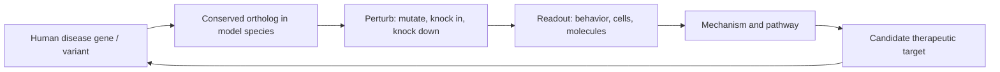
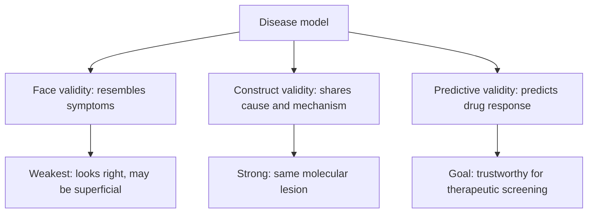
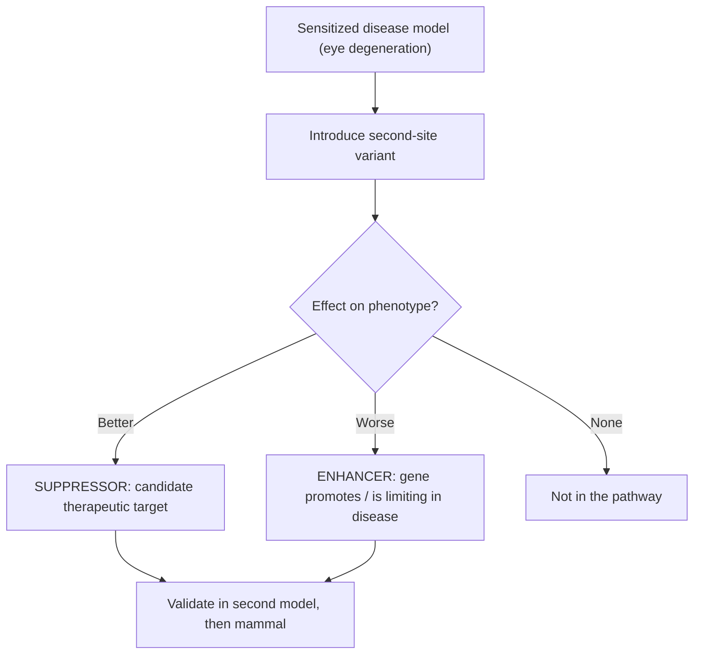
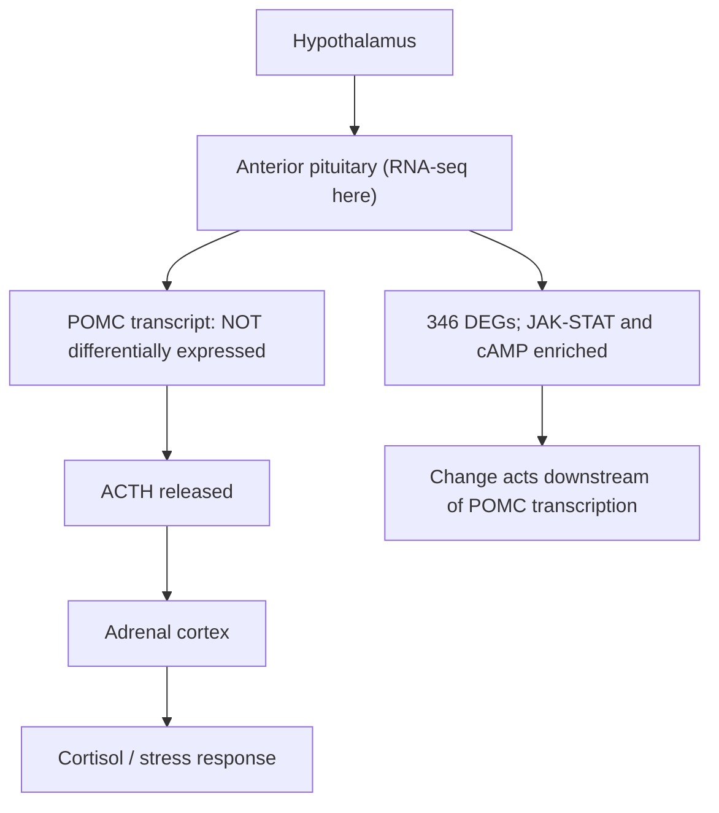

# Genetics in Disease Modeling

**Course:** BME333 / BIO333 Genetics (UNIST, 2026 Fall) · Lecture 16 · ~60 min
**Syllabus:** [← Course schedule](../../lectures/2026.BME333-BIO333-Syllabus.md) — Week 10, 2026-11-04 (Wed)
**Languages:** English · [한국어](../../ko/lectures/lec16_Disease-Modeling.md)

## Learning Objectives
By the end of this lecture, students should be able to:
- Explain why model organisms are used to study human disease and what makes a model valid.
- Distinguish face, construct, and predictive validity of a disease model.
- Describe how conserved genes and pathways allow disease modeling across species.
- Use modifier/suppressor screens in models to find disease-relevant genes and therapeutic targets.
- Critically evaluate the strengths and limits of animal models for human genetic disease.

## Lecture

### 1. Why model organisms for disease? (~8 min)

A **model organism** is a non-human species studied intensively so that discoveries in it illuminate biology shared with humans. The logic rests on a single deep fact: the core machinery of life — the cell cycle, DNA replication and repair, signal transduction, programmed cell death, development — is **conserved** across enormous evolutionary distances. A gene that runs the cell cycle in budding yeast has a recognizable counterpart running the cell cycle in a human neuron. Because of this conservation, we can study a human disease *gene* in an organism that a human researcher can breed, mutate, image, and kill by the thousands — none of which is possible with patients.

Why not simply sequence patients now that DNA sequencing is cheap? Nancy Bonini and Shelley Berger confront exactly this question and answer it emphatically: model organisms remain **indispensable**, not obsolete, in the genomic era (see [en](../../en/review/Bonini2017_Genetics_ModelOrganism.md) · [ko](../../ko/review/Bonini2017_Genetics_ModelOrganism.md)). Sequencing a patient tells you *which* base is changed; it does not tell you *what the gene does*, *which pathway it sits in*, or *whether a candidate variant is actually causal*. Those are functional questions, and functional questions are answered by perturbing the gene in a living system. Sequencing therefore multiplies the demand for model-organism work: every genome throws up dozens of variants of unknown significance that need a functional test.

The historical **return on investment** is staggering. Unbiased genetic screens in "simple" organisms — done for curiosity, with no disease in mind — repeatedly uncovered machinery that turned out to be central to human medicine and won Nobel Prizes: **cell-cycle control** (yeast), **body-plan specification** by homeotic genes (Lewis 1978; Nüsslein-Volhard and Wieschaus 1980 in *Drosophila*), and **programmed cell death / apoptosis** (Ellis and Horvitz 1986 in *C. elegans*) (see [en](../../en/review/Bonini2017_Genetics_ModelOrganism.md) · [ko](../../ko/review/Bonini2017_Genetics_ModelOrganism.md)). Genome sequencing then revealed just how broadly genes are conserved, which is what makes it legitimate to study a human disease-gene homolog in a fly or a worm. Roughly **75% of known human disease genes have a recognizable *Drosophila* ortholog** (see [en](../../en/review/Kankel2020_Genetics_Drosophila-ALS-modifier.Banerjee2020primer.md) · [ko](../../ko/review/Kankel2020_Genetics_Drosophila-ALS-modifier.Banerjee2020primer.md)) — so the fly is not a metaphor for human biology, it shares most of the actual parts list.

**Figure — The model-organism logic of disease study.**


### 2. What makes a good model (~8 min)

Not every organism carrying a mutated gene is a good *disease* model. Validity is judged along three axes borrowed from experimental psychology, and keeping them separate is essential to reading the literature critically.

- **Face validity** — does the model *look like* the disease? Does a model of a motor-neuron disease actually show motor decline, or a model of neurodegeneration show cell loss? Face validity is about resemblance of symptoms and is the easiest to over-interpret: a phenotype can look right for the wrong reason.
- **Construct validity** — does the model share the *underlying cause and mechanism*? The strongest construct validity comes from putting the **exact human mutation into the endogenous gene** — a **knock-in** or **humanized allele** — rather than merely overexpressing a foreign protein. Construct validity is what licenses the leap from model to patient, because it means the same molecular lesion is driving both.
- **Predictive validity** — does the model *predict responses to intervention*? If a drug that helps patients also helps the model (and one that fails patients fails the model), the model can be trusted to screen new therapies. Predictive validity is the property you most want and the hardest to establish.

Bonini and Berger argue explicitly for **"better" models** built by *in situ* modification of the endogenous gene rather than transgenic overexpression, precisely to raise construct validity, and for using model assays to **validate candidate variants** coming out of patient sequencing (see [en](../../en/review/Bonini2017_Genetics_ModelOrganism.md) · [ko](../../ko/review/Bonini2017_Genetics_ModelOrganism.md)). CRISPR-Cas9 now makes it routine to install a precise human variant at the orthologous locus, so the field is steadily shifting from "overexpress a disease protein and see what breaks" toward "reproduce the exact lesion."

**Figure — Three validities of a disease model.**


### 3. Building a disease model (~12 min)

To build a model you must (i) introduce the disease genotype and (ii) get a phenotype you can measure at scale. The premier engine for step (i) in *Drosophila* is the **GAL4-UAS system**, a two-part expression switch borrowed from yeast (see [en](../../en/review/Kankel2020_Genetics_Drosophila-ALS-modifier.Banerjee2020primer.md) · [ko](../../ko/review/Kankel2020_Genetics_Drosophila-ALS-modifier.Banerjee2020primer.md)). One fly line carries the yeast transcription factor **GAL4** under a tissue-specific promoter (a "driver"); another carries the gene of interest downstream of a **UAS** (Upstream Activation Sequence) that GAL4 binds. Neither line expresses the gene on its own. Cross them, and only in the tissue where GAL4 is made does GAL4 bind UAS and switch on the transgene. Swap the driver and you redirect expression to a new tissue; put an RNAi hairpin behind the UAS instead of a cDNA and you knock the gene *down* in that tissue. This modularity is why the fly is so powerful for disease work.

**Figure — The GAL4-UAS binary expression system.**
```
  Driver line                         Responder line
  [tissue promoter]--[GAL4]           [UAS]--[human disease gene]
            |                                    ^
            | makes GAL4 protein                 | GAL4 binds UAS
            v                                    |
        GAL4 protein  ---------------------------+
                                                 v
                 expression ONLY in the driver tissue
```

For step (ii), the trick is to route the disease process into a tissue whose damage is easy to score. The **Drosophila eye** is the classic choice: it is a precise crystalline array of ommatidia, non-essential for viability, and externally visible, so degeneration reads out as a rough, disordered, or reduced eye that can be graded by eye under a dissection scope. In the ALS work we study next, an eye-specific GAL4 drives a human ALS protein (**hFUS^R521C** or **hTDP-43^M337V**), and its toxicity produces a degenerated eye (see [en](../../en/article/Kankel2020_Genetics_Drosophila-ALS-modifier.md) · [ko](../../ko/article/Kankel2020_Genetics_Drosophila-ALS-modifier.md)). Readouts scale from **behavioral** (motility, climbing, lifespan) through **cellular** (neuron counts, eye morphology) to **molecular** (protein aggregation, transcript levels) — and the finer the readout, the closer the mechanism.

The disease being modeled here is **amyotrophic lateral sclerosis (ALS)**, a fatal disease of selective **motor-neuron death**. Its genetics are informative: familial ALS is caused by mutations in **FUS**, **TDP-43**, **C9orf72**, and **SOD1**, and pathological aggregation of **TDP-43** is seen in ~**97%** of all ALS patients (see [en](../../en/article/Kankel2020_Genetics_Drosophila-ALS-modifier.md) · [ko](../../ko/article/Kankel2020_Genetics_Drosophila-ALS-modifier.md)). FUS and TDP-43 are normally nuclear **RNA-binding proteins** that in disease mislocalize and form cytoplasmic aggregates that kill motor neurons (see [en](../../en/review/Kankel2020_Genetics_Drosophila-ALS-modifier.Banerjee2020primer.md) · [ko](../../ko/review/Kankel2020_Genetics_Drosophila-ALS-modifier.Banerjee2020primer.md)). Expressing the human mutant protein in flies recapitulates this toxicity — good face validity — and because FUS and TDP-43 are separate genes, having *both* models lets researchers separate disease-specific effects from generic neurodegeneration.

### 4. Modifier screens for disease genes (~12 min)

Once a model has a measurable disease phenotype, it becomes a **sensitized background** — an organism poised on the edge of a phenotype, so that a second genetic change can push it either way. A **modifier screen** systematically introduces second-site mutations and asks which ones make the phenotype worse (**enhancers**) or better (**suppressors**). The logic is that genes able to modify the disease phenotype are functionally connected to the disease process — they name pathway components and, when suppressors, candidate **therapeutic targets** (a gene whose *loss* relieves the disease is a target you would want to *inhibit* with a drug). Because many modifiers act in a single dose, this is often a screen for **dominant modifiers** — variants that shift the phenotype while heterozygous, revealing gene-dosage sensitivity (see [en](../../en/review/Kankel2020_Genetics_Drosophila-ALS-modifier.Banerjee2020primer.md) · [ko](../../ko/review/Kankel2020_Genetics_Drosophila-ALS-modifier.Banerjee2020primer.md)).

**Figure — The logic of a modifier (enhancer/suppressor) screen.**


Kankel et al. (2020) ran exactly this screen at genome scale (see [en](../../en/article/Kankel2020_Genetics_Drosophila-ALS-modifier.md) · [ko](../../ko/article/Kankel2020_Genetics_Drosophila-ALS-modifier.md)). They crossed **15,500 Exelixis transposon-insertion** lines — a near-genome-wide mutant collection — into the fly ALS eye models and scored each for suppression or enhancement of eye degeneration. The screen returned **637 modifiers of the FUS model**, **553 modifiers of the TDP-43 model**, and, crucially, **432 modifiers shared** by both. The shared set is the payoff: because FUS and TDP-43 are independent ALS genes, modifiers common to both are enriched for the **shared molecular pathway** of ALS rather than model-specific artifacts.

Gene-ontology analysis of the shared suppressors converged on the **phospholipase D (PLD) pathway**, with six components turning up as suppressors in both screens: **dPld** (phospholipase D itself), **ArfGAP3**, **Plc21C** (phospholipase C), **Rho1**, **Ras85D**, and **Rgl**. RNAi knockdown of **dPld** suppressed eye degeneration in the FUS *and* TDP-43 models — and, tellingly, also suppressed a third, **C9orf72** ALS model, extending the result across a distinct ALS etiology (see [en](../../en/article/Kankel2020_Genetics_Drosophila-ALS-modifier.md) · [ko](../../ko/article/Kankel2020_Genetics_Drosophila-ALS-modifier.md)). The chain from fly to mammal then closed: PLD-pathway inhibition in **SOD1-mutant mice** produced modest motor-function improvement, suggesting PLD suppression may be neuroprotective across multiple ALS causes.

**Figure — From screen to target: the ALS modifier study.**

| Step | Result |
|---|---|
| Mutant collection screened | 15,500 Exelixis transposon insertions |
| FUS-model modifiers | 637 |
| TDP-43-model modifiers | 553 |
| Shared modifiers (both models) | 432 |
| Convergent pathway | Phospholipase D (dPld, ArfGAP3, Plc21C, Rho1, Ras85D, Rgl) |
| Cross-model validation | dPld RNAi also rescues C9orf72 model |
| Mammalian validation | PLD inhibition → modest motor gains in SOD1 mice |

The methodological lesson is that classic **forward genetics** — start from a phenotype, screen blindly, let the biology name the genes — remains one of the most powerful routes to therapeutic targets, complementing rather than replaced by biochemistry and cell-based "disease in a dish" assays (see [en](../../en/review/Bonini2017_Genetics_ModelOrganism.md) · [ko](../../ko/review/Bonini2017_Genetics_ModelOrganism.md)).

### 5. Comparative & cross-species modeling (~10 min)

Not all disease modeling uses engineered mutations in standard lab organisms. Sometimes a **naturally occurring** phenotype in a non-traditional model illuminates human biology — and behavior is a domain where this is especially valuable, since behavioral traits are hard to engineer. The **Belyaev/Trut silver-fox experiment** (Novosibirsk, 1959–present) is the landmark case: foxes were selected across dozens of generations solely for **tameness** versus **aggression** toward humans, producing lines whose behavior diverged dramatically along with the correlated traits of the **"domestication syndrome"** (see [en](../../en/article/Hekman2019_G3_APtx+Fox.md) · [ko](../../ko/article/Hekman2019_G3_APtx+Fox.md)).

Hekman et al. asked what changed *molecularly* by RNA-sequencing the **anterior pituitary** — the hub of the **HPA (hypothalamic-pituitary-adrenal) axis** that releases **ACTH** to drive the stress response — from 6 tame and 6 aggressive foxes. They found **346 differentially expressed genes** (FDR < 0.05), with GO enrichment in JAK-STAT signaling and cAMP regulation, and differential splicing in 36 genes (see [en](../../en/article/Hekman2019_G3_APtx+Fox.md) · [ko](../../ko/article/Hekman2019_G3_APtx+Fox.md)). A subtle and important negative result: **POMC**, the precursor protein for ACTH, was **not** differentially expressed at the transcript level — implying that behavioral selection altered ACTH output **downstream** (post-translational processing or secretion), not by changing how much POMC message is made. This is comparative disease-relevant modeling: a naturally selected behavioral phenotype pointing to specific neuroendocrine mechanisms of the stress response.

**Figure — The HPA axis and where the fox study localized the change.**


Comparative modeling extends beyond foxes: naturally occurring disease variants in dogs, cats, and other outbred animals — living, breeding, and aging in real environments — can capture aspects of complex human disease that inbred lab strains miss. The general principle is that **natural variation is a screen nature has already run**; the geneticist's job is to read it.

### 6. Limits and translation (~7 min)

Models inform, but they do **not guarantee**, human outcomes — and knowing why keeps a scientist honest. Three limits recur. First, **genetic background**: the same mutation gives different phenotypes in different strains because thousands of background variants modify it — the very phenomenon modifier screens exploit is also a caution that a result in one strain may not transfer. Second, **incomplete penetrance and variable expressivity**: a disease genotype may produce the phenotype only sometimes, or to varying degrees, so a "clean" model phenotype can be misleadingly reproducible relative to messy human disease. Third, **species differences**: a fly eye is not a human motor neuron, and a mouse's short lifespan and physiology differ from ours — which is exactly why the ALS study insisted on *cross-model* (FUS, TDP-43, C9orf72) and then *cross-species* (mouse) validation before claiming a target (see [en](../../en/article/Kankel2020_Genetics_Drosophila-ALS-modifier.md) · [ko](../../ko/article/Kankel2020_Genetics_Drosophila-ALS-modifier.md)).

The honest framing, which Bonini and Berger endorse, is a **hierarchy of evidence**: a modifier in one model is a hypothesis; convergence across independent models makes it a lead; validation in a mammal makes it a candidate; and only human trials make it a therapy (see [en](../../en/review/Bonini2017_Genetics_ModelOrganism.md) · [ko](../../ko/review/Bonini2017_Genetics_ModelOrganism.md)). Models are the fast, cheap, mechanistic front end of a pipeline whose back end is unavoidably human. This is also the bridge to the human-genetics units: candidate genes from models must ultimately be checked against **patient GWAS and whole-genome sequencing** data before they can be trusted (see [en](../../en/review/Kankel2020_Genetics_Drosophila-ALS-modifier.Banerjee2020primer.md) · [ko](../../ko/review/Kankel2020_Genetics_Drosophila-ALS-modifier.Banerjee2020primer.md)).

### 7. Wrap-up (~3 min)

Disease modeling integrates everything in this course. **Reverse genetics** installs a defined human lesion (GAL4-UAS, CRISPR knock-in); **forward genetics** then runs an unbiased modifier screen on that sensitized background to name the pathway and its druggable nodes; **comparative genetics** reads phenotypes nature has already selected. Conservation is what makes the whole enterprise legitimate, the three validities are how we judge a model's trustworthiness, and the evidence hierarchy is how a fly result becomes, cautiously, a claim about people.

## Key Takeaways
- Model organisms remain **indispensable** in the genomic era because sequencing finds variants but only functional perturbation reveals what genes *do*; ~75% of human disease genes have a *Drosophila* ortholog.
- Judge a model by **face** (resembles symptoms), **construct** (shares mechanism — best via knock-in of the exact human allele), and **predictive** (predicts drug response) validity.
- The **GAL4-UAS** system drives a human disease gene in a chosen, easily scored tissue (e.g., the fly eye), turning disease into a measurable phenotype.
- A **modifier screen** on a sensitized disease background finds **enhancers** and **suppressors**; suppressors are candidate therapeutic targets. Kankel et al. screened 15,500 insertions across two ALS models and converged on the **PLD pathway**, validated in C9orf72 flies and SOD1 mice.
- **Comparative models** exploit natural variation: the tame/aggressive foxes revealed 346 pituitary DEGs and localized altered ACTH output *downstream* of POMC transcription.
- Models **inform but do not guarantee** human outcomes; genetic background, penetrance, and species differences demand an evidence hierarchy — cross-model, then mammalian, then human validation.

## Textbook Reading
- **Genetics: From Genes to Genomes (8e)** — Ch. 22 Genetic Analysis of Development. → [textbook ref](../../lectures/ref.Genetics-FromGenesToGenomes.md)

## Notes in this vault
Reviews & articles to introduce in class (each has a bilingual en/ko pair):
- `Bonini2017_Genetics_ModelOrganism` — The case for model organisms in understanding human disease; opens the lecture. · [en](../../en/review/Bonini2017_Genetics_ModelOrganism.md) · [ko](../../ko/review/Bonini2017_Genetics_ModelOrganism.md)
- `Kankel2020_Genetics_Drosophila-ALS-modifier` — *Drosophila* modifier screen for ALS; central case study for disease modeling. · [en](../../en/article/Kankel2020_Genetics_Drosophila-ALS-modifier.md) · [ko](../../ko/article/Kankel2020_Genetics_Drosophila-ALS-modifier.md)
- `Kankel2020_Genetics_Drosophila-ALS-modifier.Banerjee2020primer` — Teaching primer for the ALS modifier study; unpack the screen and its disease relevance. · [en](../../en/review/Kankel2020_Genetics_Drosophila-ALS-modifier.Banerjee2020primer.md) · [ko](../../ko/review/Kankel2020_Genetics_Drosophila-ALS-modifier.Banerjee2020primer.md)
- `Hekman2019_G3_APtx+Fox` — A naturally occurring disease-relevant phenotype in a non-traditional model (fox/ataxia); comparative disease modeling. · [en](../../en/article/Hekman2019_G3_APtx+Fox.md) · [ko](../../ko/article/Hekman2019_G3_APtx+Fox.md)

## Discussion Questions
1. Distinguish face, construct, and predictive validity using the fly ALS eye model as an example. Which validity does eye-specific overexpression of human FUS most and least satisfy, and how would a CRISPR knock-in of the exact patient allele change your answer?
2. The ALS screen found 637 FUS and 553 TDP-43 modifiers but emphasized the 432 *shared* ones. Explain the reasoning: why are shared modifiers more likely to be disease-relevant than model-specific ones, and what could a shared modifier still be an artifact of?
3. A suppressor is a candidate *therapeutic target*. If knocking down *dPld* relieves the phenotype, what does that imply you would want a drug to do — and what risks come from inhibiting a normal cellular enzyme? Use the SOD1-mouse result to discuss how strong the evidence is.
4. In the fox study, POMC transcript was unchanged even though ACTH output differed between behavioral lines. Explain what this negative result rules in and rules out about the mechanism, and why transcriptomics alone cannot settle it.
5. "Models inform but do not guarantee human outcomes." Lay out the evidence hierarchy from a single-model modifier to a human therapy, and argue where in that chain most candidate therapies fail and why.
