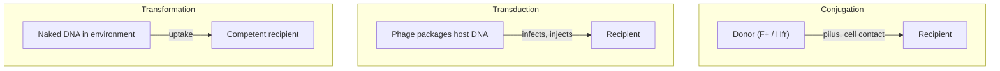
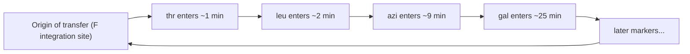
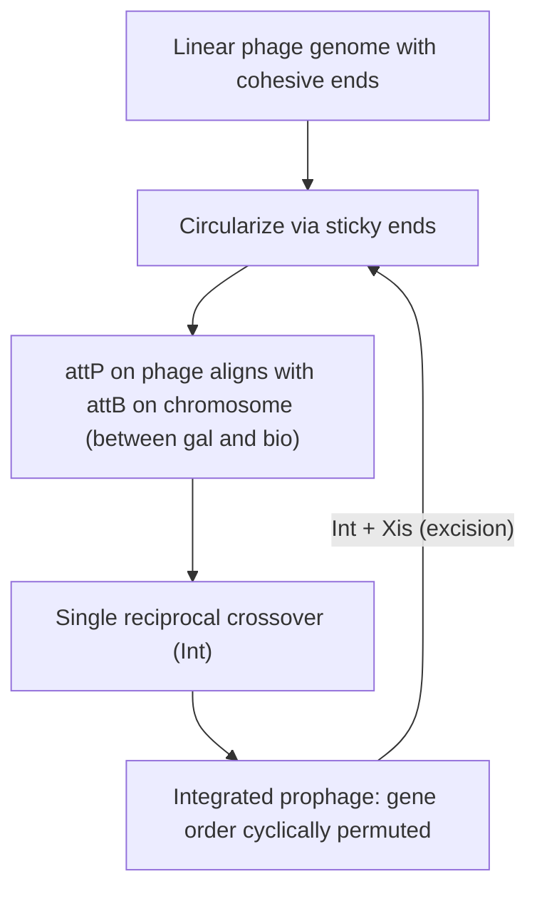
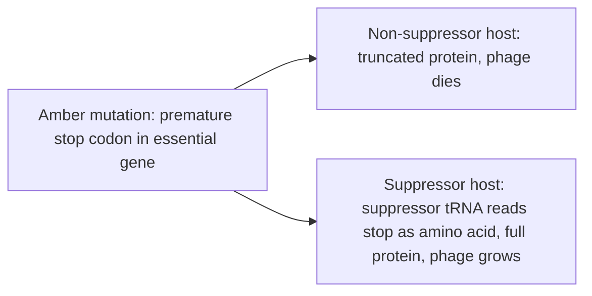

# Genetic Model — E. coli and Bacteria

**Course:** BME333 / BIO333 Genetics (UNIST, 2026 Fall) · Lecture 17 · ~60 min
**Syllabus:** [← Course schedule](../../lectures/2026.BME333-BIO333-Syllabus.md) — Week 11 Mon, 2026-11-09
**Languages:** English · [한국어](../../ko/lectures/lec17_Model-Ecoli-Bacteria.md)

## Learning Objectives
By the end of this lecture, students should be able to:
- Explain why *E. coli* and its phages became the workhorse of molecular genetics (rapid growth, haploid genome, easy selection).
- Distinguish the three modes of horizontal gene transfer in bacteria: conjugation, transduction, and transformation.
- Describe how conjugation and interrupted-mating mapping revealed the circular *E. coli* chromosome.
- Explain lysogeny and site-specific prophage integration (the Campbell model) and how phage genetics established the fine structure of the gene.
- Connect classic bacterial genetics to modern genome engineering and the "microbes in the Modern Synthesis" perspective.

## Lecture

### 1. Why bacteria? The rise of the microbial model (~8 min)

For the first half of the twentieth century, genetics meant plants, flies, and mice. Bacteria were thought to lack genes in any Mendelian sense — no visible chromosomes, no sex, no crosses. That view collapsed in the 1940s, and bacteria then took over molecular genetics because they offer a nearly ideal experimental package. **Generation time** is minutes (an *E. coli* culture doubles every ~20 min), so you can grow *billions* of individuals overnight. Bacteria are **haploid** with a single chromosome, so a recessive mutation shows its phenotype immediately — there is no second allele to mask it. They grow on chemically **defined media**, so you can demand a specific metabolic capability. And, most powerfully, they permit **selection**: plate 10⁹ cells on a medium only a rare variant can survive, and you recover that one-in-a-billion cell as a colony. Selection lets bacterial genetics see events — recombinants, mutants, transfers — at frequencies (one per million or rarer) that are utterly invisible in a fly cross.

These features made bacteria the substrate for the deepest questions of the gene. But there was also a conceptual obstacle to be cleared: did microbes even belong in the theory of evolution and genetics that the **Modern Synthesis** had built around sexual, diploid populations? Novick and Doolittle note that the architects of the Synthesis (Dobzhansky, Huxley) **often explicitly excluded microbes**, and that phenomena like lateral gene transfer were later cast as "jeopardizing" the Synthesis (see [en](../../en/review/Novick2019_PLoSGenet_MicrobesModernSynthesis.md) · [ko](../../ko/review/Novick2019_PLoSGenet_MicrobesModernSynthesis.md)). Their resolution is to treat evolutionary theory as a **toolkit of explanatory resources** rather than a single true-or-false law: microbes do not refute the Synthesis so much as **expand the toolkit while clarifying the limited scope** of its original claims. Keep that framing in mind — bacterial genetics did not just add facts, it forced concepts (species, the gene, heredity) to be rebuilt.

**Figure — Why bacteria are ideal for high-resolution genetics.**

| Feature | Consequence for genetics |
|---|---|
| ~20-min generation time | Billions of cells overnight; rare events become observable |
| Haploid single chromosome | Recessive mutations show phenotype immediately |
| Defined minimal media | Can demand a specific metabolic capability |
| Strong selection | Recover one recombinant/mutant in 10⁶–10⁹ as a colony |
| Scorable markers | Auxotrophy, phage resistance, sugar fermentation (color), antibiotic resistance |

### 2. Mutation is spontaneous: fluctuation and pre-existing variants (~8 min)

Before bacteria could be a *genetic* model, one had to prove that bacterial variation is genetic — that resistant survivors arise by **mutation**, not by the environment *instructing* the cell. When phage is added to a sensitive culture, almost all cells lyse but a few resistant survivors grow up. Two hypotheses competed: the **acquired-immunity (Lamarckian)** view, that contact with the phage *induces* resistance; and the **mutation (Darwinian)** view, that rare resistant mutants arose **before** exposure and the phage merely **selects** them (see [en](../../en/article/LuriaDelbruck1943_Genetics_VirusResistance.md) · [ko](../../ko/article/LuriaDelbruck1943_Genetics_VirusResistance.md)).

Luria and Delbrück (1943) distinguished the two with the **fluctuation test** — a triumph of statistical reasoning. Luria's insight (watching a slot machine pay out) was that timing predicts *variance*. If resistance is induced by the phage at plating, every culture should throw up survivors independently, giving a **Poisson** distribution where variance ≈ mean. But if resistance arises by spontaneous mutation *during* growth, a mutation that happens early founds a large "**jackpot**" clone, so counts across independent parallel cultures should **fluctuate wildly (variance ≫ mean)**. The data were decisive: in Experiment 16 the mean was 11.35 resistant cells, yet **11 of 20 cultures had zero** and **3 had 35–107** — impossible under Poisson (see [en](../../en/article/LuriaDelbruck1943_Genetics_VirusResistance.md) · [ko](../../ko/article/LuriaDelbruck1943_Genetics_VirusResistance.md)). Across ten experiments the mutation rate to resistance averaged **2.45 × 10⁻⁸ per bacterium per division** — remarkably close to modern whole-genome estimates. This is the founding proof that **selection reveals pre-existing variation rather than creating it**, and it is the direct microbial ancestor of our understanding of antibiotic resistance.

**Figure — The fluctuation test logic.**

| | Acquired immunity (Lamarck) | Spontaneous mutation (Darwin) |
|---|---|---|
| When does resistance arise? | At phage exposure | During prior growth, before exposure |
| Distribution across parallel cultures | Poisson (variance ≈ mean) | Highly skewed, "jackpots" (variance ≫ mean) |
| Luria–Delbrück result | rejected | **supported** (Exp. 16: mean 11.35, but many 0s and a few 100+) |

The principle that mutation is **random with respect to fitness** is so central that genetics polices it vigilantly. Decades later, Cairns and colleagues claimed "directed" or **adaptive mutation** — that some mutations arise specifically because they are useful. Franklin Stahl's *Unicorns Revisited* is a model of how the field handles such an extraordinary claim: not by dismissing it, but by "climbing over the fence to look" — testing and dismantling candidate mechanisms one by one, including, with notable honesty, **his own** (see [en](../../en/review/Stahl1992_Genetics_UnicornsRevisited.md) · [ko](../../ko/review/Stahl1992_Genetics_UnicornsRevisited.md)). The episode was eventually explained by stress-induced mutagenesis and gene amplification — mechanisms that modulate mutation *rate* without "directing" *which* mutation occurs, leaving the Luria–Delbrück principle intact.

### 3. Conjugation and chromosome mapping (~12 min)

Bacteria have no meiosis, yet they exchange genes by three distinct routes of **horizontal (lateral) gene transfer**, and telling them apart is the core of bacterial genetics. In **conjugation**, DNA passes from a donor to a recipient through **direct cell contact** (a pilus/mating bridge). In **transduction**, a **bacteriophage** accidentally packages host DNA and injects it into a new cell. In **transformation**, a cell takes up **naked DNA** released from the environment. The diagnostic difference — contact-dependent vs. filterable vs. DNase-sensitive — is exactly what the classic experiments exploited.

**Figure — Three modes of horizontal gene transfer in bacteria.**

Joshua Lederberg (with Tatum, 1946) discovered conjugation by mixing two **auxotrophic** *E. coli* K-12 strains, each unable to make different nutrients, and plating on minimal medium: rare **prototrophic recombinants** appeared at ~one per million, and doubly marked parents ruled out simple reversion (see [en](../../en/review/Lederberg1987_Genetics_EcoliRecombination.md) · [ko](../../ko/review/Lederberg1987_Genetics_EcoliRecombination.md)). Skeptics (famously Delbrück) suspected artifacts, so Lederberg showed that **unselected markers** — including phage-T1 resistance — segregated cleanly into stable classes among the recombinants, which a mere cell mixture or nuclear-fusion heterokaryon could not produce. Accumulating eight markers whose non-random co-segregation implied a **single linkage group**, he drew the first genetic map of *E. coli*.

The map, however, misbehaved: new markers refused to fit a line, and Lederberg's 1951 "branched" map was mistakenly taken literally (Watson and Hayes even proposed three chromosomes). The resolution came from the mechanism of transfer. Some donors, called **Hfr** ("high frequency of recombination"), carry the **F fertility factor integrated into the chromosome**; during conjugation an Hfr injects its chromosome **linearly, starting at a fixed origin and always in the same direction**, one gene at a time over ~100 minutes. Wollman and Jacob's **interrupted-mating** experiment made this visible: they let Hfr × F⁻ matings proceed, then violently agitated the culture in a **blender** at successive times to break the mating bridges, and scored which donor markers had entered. **Genes appear as a function of time** — the earlier a gene enters, the closer it is to the origin — so *time is distance* (measured in minutes). Because different Hfr strains have F integrated at different sites and orientations, each gives a different linear order, but **all the orders are consistent with a single circle**. That is how the **circular *E. coli* chromosome** was proven (see [en](../../en/review/Lederberg1987_Genetics_EcoliRecombination.md) · [ko](../../ko/review/Lederberg1987_Genetics_EcoliRecombination.md)).

**Figure — Interrupted-mating maps the chromosome in minutes and reveals a circle.**

### 4. Transduction: phage-mediated gene transfer (~10 min)

Norton Zinder, a 22-year-old in Lederberg's lab, set out to find conjugation in *Salmonella typhimurium* and instead discovered a **third** transfer mode (see [en](../../en/review/Zinder1992_Genetics_BacterialTransduction.md) · [ko](../../ko/review/Zinder1992_Genetics_BacterialTransduction.md)). Crossing strains LT-2 × LT-22 (on 5 October 1950) gave prototrophs at high frequency — but the phenomenon behaved unlike conjugation: it was **asymmetric**, moved only **one marker at a time**, and required **no cell contact**. Zinder adapted Bernard Davis's **U-tube** experiment, which had *ruled out* a filterable agent in *E. coli* conjugation: he separated the two strains by a **sintered-glass filter** that blocks cells but passes molecules and small particles. In *Salmonella*, transfer **still occurred across the filter** — a **filterable agent** ("FA") was doing the work. The agent turned out to be a **temperate phage** (P22) carried by LT-22 that could grow on LT-2, package host genes, and carry them back. Lederberg named the process **transduction**.

Two flavors matter. In **generalized transduction**, the phage occasionally mispackages **any** fragment of host DNA, so it can transfer essentially any gene — the property that makes transduction a fine-mapping tool: two genes are **cotransduced** only if they lie close enough to fit in one phage head, so cotransduction frequency measures short-range linkage. In **specialized transduction**, a phage integrated at a **specific chromosomal site** (like λ, next section) mispackages only the **neighboring** genes when it excises imprecisely (e.g., λ picking up *gal* or *bio*). Zinder's careful controls — showing the transducing potential tracked the **genotype of the last host**, that there was no mutant-vs-wildtype directionality, and that FA co-purified with phage — established transduction as genuine transfer of **bacterial genetic material packaged in a phage**, all *before* Hershey–Chase and Watson–Crick (see [en](../../en/review/Zinder1992_Genetics_BacterialTransduction.md) · [ko](../../ko/review/Zinder1992_Genetics_BacterialTransduction.md)).

**Figure — Generalized vs. specialized transduction.**

| | Generalized | Specialized |
|---|---|---|
| Which genes transferred | Any region of host genome | Only genes flanking the prophage site (e.g., *gal*, *bio*) |
| Origin of transducing DNA | Random mispackaging of host DNA | Aberrant excision of an integrated prophage |
| Phage type | Often lytic (e.g., P22, P1) | Temperate, site-specific (e.g., λ) |
| Genetic use | Short-range cotransduction mapping | Move/amplify specific loci |

### 5. Lysogeny and prophage integration (~10 min)

A **temperate** phage such as **λ** faces a choice on infection: replicate and burst the cell (the **lytic** cycle) or integrate quietly into the host chromosome and be copied along with it (**lysogeny**), lying dormant as a **prophage** until a stress signal triggers excision and lysis. How does a linear phage genome insert itself into a bacterial chromosome? Allan Campbell's 1961 model answered this with pure genetic logic, before any physical proof existed (see [en](../../en/review/Campbell1993_Genetics_ProphageInsertion.md) · [ko](../../ko/review/Campbell1993_Genetics_ProphageInsertion.md)).

The **Campbell model** has two steps. First, the linear λ genome **circularizes** by joining its complementary single-stranded **cohesive ("sticky") ends**. Second, a **single reciprocal crossover** between a phage attachment site (**attP**) and a homologous chromosomal site (**attB**, located between the *gal* and *bio* operons) inserts the whole circle into the chromosome. The model made a sharp, testable prediction: because insertion opens the phage circle at *attP*, the **gene order of the integrated prophage is a cyclic permutation** of the order in the free phage. Observing exactly that permutation was the model's first triumph. Integration and excision are catalyzed by phage-encoded enzymes: **Int** (integrase) suffices for insertion, while excision requires **Int plus Xis** (excisionase), together with host factors — an asymmetry that lets the cell control the direction of the reaction and hence the lysogeny/lysis decision (see [en](../../en/review/Campbell1993_Genetics_ProphageInsertion.md) · [ko](../../ko/review/Campbell1993_Genetics_ProphageInsertion.md)).

**Figure — The Campbell model of λ prophage integration.**

The historical importance runs deeper than λ. Campbell built the model partly to settle whether a chromosome is a **single continuous molecule** with added elements covalently intercalated, versus alternatives where genes hang off a protein backbone — genetics answered "single molecule" before restriction mapping and sequencing could. λ integration became the **first well-characterized programmed DNA rearrangement**, and it directly inspired the (correct) idea that **gene rearrangement generates immunoglobulin diversity (V(D)J recombination)** and shaped early thinking on transposons and retroviral integration. Int is now recognized as the founding member of a large **site-specific recombinase (integrase) family** used across biology and in genetic engineering (e.g., Gateway cloning) (see [en](../../en/review/Campbell1993_Genetics_ProphageInsertion.md) · [ko](../../ko/review/Campbell1993_Genetics_ProphageInsertion.md)).

### 6. Phage genetics and the fine structure of the gene (~8 min)

Phages gave genetics its highest resolution because their huge progeny numbers let rare recombinants within a *single gene* be detected. The key tool was the **conditional-lethal mutation** — a mutation lethal in one condition but not another, so an essential gene can be kept alive for study. Two classes dominate: **temperature-sensitive (ts)** mutants (functional at low but not high temperature) and **amber (nonsense)** mutants. The **amber mutants of phage T4**, discovered by Epstein, Edgar, and colleagues in 1959–1963, are the classic case (see [en](../../en/review/Stahl1995_Genetics_AmberMutants-PhageT4.md) · [ko](../../ko/review/Stahl1995_Genetics_AmberMutants-PhageT4.md)). Amber mutants carry a premature **chain-termination (nonsense) codon**; they grow on a "permissive" host that carries a **suppressor tRNA** (which reads the stop codon as an amino acid) but not on a non-suppressing host — giving a clean on/off assay for any essential gene. Complementation of the T4 ambers unexpectedly revealed about **twenty genes** (Delbrück's reaction: "How dull!"), but Epstein saw that these genome-wide, generic markers made a **complete developmental analysis** of the phage tractable.

The amber mutants delivered landmark results: they demonstrated the **circularity of the T4 linkage map**, revealed **functional clustering** of genes, and — with Sarabhai et al. (1964) — proved the **colinearity of gene and polypeptide**, that the order of codons in a gene matches the order of amino acids in its protein (see [en](../../en/review/Stahl1995_Genetics_AmberMutants-PhageT4.md) · [ko](../../ko/review/Stahl1995_Genetics_AmberMutants-PhageT4.md)). This work sat alongside Benzer's fine-structure dissection of the T4 **rII** region, which mapped recombination *within* a gene and redefined the gene as a divisible linear array of mutable sites. Bacteria and phage thus took the gene from an abstract Mendelian "factor" down to nucleotide-level structure.

**Figure — How an amber (nonsense) mutation gives a conditional-lethal phenotype.**

Bacterial genetics also proved that even **behavior** is genetically dissectable: Adler and Parkinson isolated *E. coli* **chemotaxis** mutants, treating the flow of sensory information through receptors and signaling proteins as a pathway to be reconstructed by mutation — "behavioral genetics with bacteria" (see [en](../../en/review/Parkinson1987_Genetics_BehavioralGenetics-Bacteria.md) · [ko](../../ko/review/Parkinson1987_Genetics_BehavioralGenetics-Bacteria.md)). And the same selection-and-recombination logic scales straight into the present: from IS elements and transposition (Shapiro's "natural genetic engineering," an intellectual precursor to genome editing) to today's designer genomes, *E. coli* remains the platform where genomes are read *and rewritten* (see [en](../../en/review/Shapiro2009_Genetics_Perspective-Ecoli-GenomeEng.md) · [ko](../../ko/review/Shapiro2009_Genetics_Perspective-Ecoli-GenomeEng.md)).

### 7. Wrap-up & discussion (~4 min)

In one lecture we went from proving that bacterial variation is genetic (Luria–Delbrück) to mapping a chromosome by the clock (interrupted mating), to three mechanisms of gene transfer (conjugation, transduction, transformation), to the molecular anatomy of prophage integration (Campbell) and the gene itself (T4 ambers, rII). The through-line is that **strong selection plus huge numbers plus clever crosses** let bacteria and phage resolve genetics finer than any eukaryote could — and that this classical foundation runs directly into modern genome engineering and the ongoing reappraisal of how microbes fit evolutionary theory.

## Key Takeaways
- Bacteria are ideal for high-resolution genetics: **fast growth, haploid single chromosome, defined media, and powerful selection** make one-in-a-million events visible.
- The **Luria–Delbrück fluctuation test** proved mutations are **spontaneous and pre-selective** (jackpots ⇒ variance ≫ mean; rate ~2.45 × 10⁻⁸), the basis for understanding antibiotic resistance.
- Bacteria exchange genes by three routes: **conjugation** (contact), **transduction** (phage-mediated), and **transformation** (naked DNA).
- **Interrupted-mating** with **Hfr** donors maps genes in **minutes** (time = distance); combining Hfr strains proved the *E. coli* chromosome is **circular**.
- **Transduction** (Zinder & Lederberg) is generalized or specialized; **cotransduction frequency** measures short-range linkage.
- The **Campbell model**: λ circularizes via sticky ends and inserts by a **single crossover** (attP × attB), cyclically permuting gene order; **Int** integrates, **Int+Xis** excise — the first programmed DNA rearrangement and the conceptual parent of V(D)J recombination.
- **Amber (nonsense) and ts conditional-lethal** mutants in phage T4 established the circular map, gene clustering, and **gene–protein colinearity**, taking the gene down to nucleotide resolution.

## Textbook Reading
- **Genetics: From Genes to Genomes (8e)** — Ch. 16 Bacterial Genetics. → [textbook ref](../../lectures/ref.Genetics-FromGenesToGenomes.md)

## Notes in this vault
Reviews & articles to introduce in class (each has a bilingual en/ko pair):
- `Lederberg1987_Genetics_EcoliRecombination` — first-hand account of discovering recombination/conjugation in *E. coli*; anchors the chromosome-mapping story. · [en](../../en/review/Lederberg1987_Genetics_EcoliRecombination.md) · [ko](../../ko/review/Lederberg1987_Genetics_EcoliRecombination.md)
- `LuriaDelbruck1943_Genetics_VirusResistance` — the fluctuation test; mutations are spontaneous and pre-selective — the founding quantitative experiment. · [en](../../en/article/LuriaDelbruck1943_Genetics_VirusResistance.md) · [ko](../../ko/article/LuriaDelbruck1943_Genetics_VirusResistance.md)
- `Zinder1992_Genetics_BacterialTransduction` — discovery of transduction; introduces phage-mediated gene transfer for mapping. · [en](../../en/review/Zinder1992_Genetics_BacterialTransduction.md) · [ko](../../ko/review/Zinder1992_Genetics_BacterialTransduction.md)
- `Campbell1993_Genetics_ProphageInsertion` — the Campbell model of site-specific prophage integration; core of the lysogeny segment. · [en](../../en/review/Campbell1993_Genetics_ProphageInsertion.md) · [ko](../../ko/review/Campbell1993_Genetics_ProphageInsertion.md)
- `Parkinson1987_Genetics_BehavioralGenetics-Bacteria` — bacterial chemotaxis as "behavioral genetics," showing bacteria as a model for signaling and behavior. · [en](../../en/review/Parkinson1987_Genetics_BehavioralGenetics-Bacteria.md) · [ko](../../ko/review/Parkinson1987_Genetics_BehavioralGenetics-Bacteria.md)
- `Stahl1992_Genetics_UnicornsRevisited` — reflections on phage recombination and the logic of genetic crosses. · [en](../../en/review/Stahl1992_Genetics_UnicornsRevisited.md) · [ko](../../ko/review/Stahl1992_Genetics_UnicornsRevisited.md)
- `Stahl1995_Genetics_AmberMutants-PhageT4` — amber (nonsense) conditional mutants in T4; how phage genetics dissected gene function. · [en](../../en/review/Stahl1995_Genetics_AmberMutants-PhageT4.md) · [ko](../../ko/review/Stahl1995_Genetics_AmberMutants-PhageT4.md)
- `Novick2019_PLoSGenet_MicrobesModernSynthesis` — historical/conceptual framing of how microbes entered evolutionary genetics. · [en](../../en/review/Novick2019_PLoSGenet_MicrobesModernSynthesis.md) · [ko](../../ko/review/Novick2019_PLoSGenet_MicrobesModernSynthesis.md)
- `Shapiro2009_Genetics_Perspective-Ecoli-GenomeEng` — from classical *E. coli* genetics toward genome engineering; bridges to the modern era. · [en](../../en/review/Shapiro2009_Genetics_Perspective-Ecoli-GenomeEng.md) · [ko](../../ko/review/Shapiro2009_Genetics_Perspective-Ecoli-GenomeEng.md)

## Discussion Questions
1. Under the acquired-immunity hypothesis, resistant-cell counts across parallel cultures should be Poisson (variance ≈ mean); under the mutation hypothesis they should fluctuate wildly. Explain why an *early* spontaneous mutation produces a "jackpot," and how Experiment 16 (mean 11.35, many zeros, a few >100) decides between the models.
2. Interrupted-mating experiments treat *time as distance*. Explain how blending an Hfr × F⁻ mating at successive times yields a gene order, and why combining several Hfr strains — each giving a different linear order — proves the chromosome is circular rather than linear.
3. Compare the U-tube results for *E. coli* conjugation and *Salmonella* transduction. What does "a filterable agent crosses the sintered-glass filter" tell you about the mechanism, and how did it distinguish transduction from conjugation?
4. The Campbell model predicts that the integrated prophage's gene order is a *cyclic permutation* of the free phage's. Walk through circularization → single crossover to show why, and explain why excision needs Xis in addition to Int.
5. Amber mutants are lethal on one host but not another. Explain how a suppressor tRNA rescues a nonsense mutation, and why genome-wide conditional-lethal markers made a *complete developmental analysis* of phage T4 possible where random radiation damage could not.
