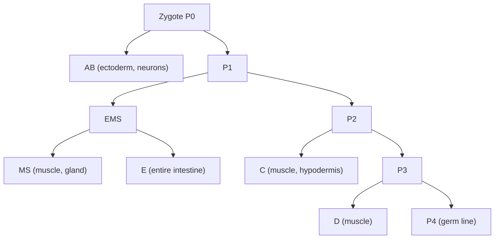
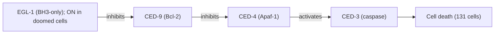
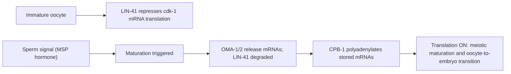
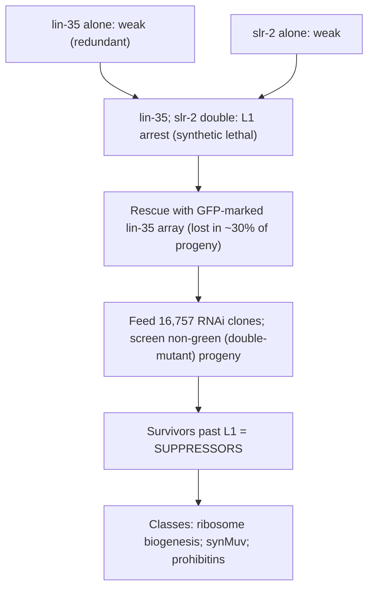

# Genetic Model — C. elegans

**Course:** BME333 / BIO333 Genetics (UNIST, 2026 Fall) · Lecture 18 · ~60 min
**Syllabus:** [← Course schedule](../../lectures/2026.BME333-BIO333-Syllabus.md) — Week 11 Wed, 2026-11-11
**Languages:** English · [한국어](../../ko/lectures/lec18_Model-Celegans.md)

## Learning Objectives
By the end of this lecture, students should be able to:
- Explain why Sydney Brenner chose *C. elegans* and what features make it a premier metazoan genetic model (transparency, invariant cell lineage, hermaphroditic self-fertilization, short life cycle).
- Describe the complete cell lineage and the connectome as foundational resources.
- Outline how forward genetic screens in *C. elegans* identify genes controlling development, cell death, and behavior.
- Explain how the worm is used to dissect oocyte maturation, chromosome dynamics (e.g., topoisomerase II), and cell-cycle/tumor-suppressor pathways (e.g., LIN-35/Rb).
- Appreciate the worm's role as a disease-modeling and functional-genomics platform.

## Lecture

### 1. Brenner's vision and why the worm (~10 min)

By the early 1960s the founders of molecular biology had, in effect, solved the gene. Sydney Brenner had helped: with Crick and colleagues he demonstrated the existence of **messenger RNA** (1961), helped establish that the genetic code is read in **triplets** (1961), and identified **stop codons** (1965) (see [en](../../en/review/GeneticsClassic_SydneyBrennder_Celegans.md) · [ko](../../ko/review/GeneticsClassic_SydneyBrennder_Celegans.md)). But Brenner felt the basic questions were becoming "inevitable," and in a now-famous 1963 letter he declared he wanted to **"tame a small metazoan organism to study development directly"** — to turn the tools of genetics on the two hardest problems left: how a fertilized egg builds a body, and how a nervous system generates behavior.

His design criteria dictated the organism. He wanted an animal **small enough to fit in the field of a transmission electron microscope** (so the whole nervous system could be reconstructed), with **fewer neurons than a fruit fly**, and **easy and cheap to grow**. A microscopic soil nematode, ***Caenorhabditis elegans*** — about **1 mm** long, feeding on *E. coli* on agar plates — fit perfectly (see [en](../../en/review/Brenner2009_Genetics_Celegans.md) · [ko](../../ko/review/Brenner2009_Genetics_Celegans.md)). Four features make it a genetic dream:

- **Transparency** — every cell is visible in the living animal under a light microscope, so development can be *watched*, not just inferred.
- **Invariant cell lineage** — every individual produces the **same cells in the same pattern** (see Segment 2), so a cell can be studied by name.
- **Self-fertilizing hermaphrodite** — the hermaphrodite makes its own sperm and eggs, so a heterozygote **self-fertilizes to homozygose recessive mutations automatically**, while rare **males** allow deliberate crosses. This is the single most important genetic advantage.
- **Short life cycle** (~3 days) and large broods (~300 self-progeny), so screens are fast and cheap.

Brenner launched his first EMS mutant hunt in October 1967, obtaining "a grand total of two mutants" — **E1**, named **"dumpy"** for its short fat body, and **E2**, "variable abnormal" — then rapidly improved to 25–30 mutants per screen (see [en](../../en/review/Brenner2009_Genetics_Celegans.md) · [ko](../../ko/review/Brenner2009_Genetics_Celegans.md)). The landmark 1974 paper *The Genetics of Caenorhabditis elegans* reported **~300 EMS-induced mutants** mapping to **~100 genes (96 loci) on six linkage groups** — matching the chromosome number — together with a full manual of hermaphrodite genetics that is *still* ritually cited in worm papers today (see [en](../../en/review/GeneticsClassic_SydneyBrennder_Celegans.md) · [ko](../../ko/review/GeneticsClassic_SydneyBrennder_Celegans.md)). John Sulston's method for **freezing worms** was the technical prerequisite that made long-term stock-keeping — and hence a whole research community — possible.

**Figure — Why *C. elegans* is a premier metazoan genetic model.**

| Feature | Genetic payoff |
|---|---|
| Transparent, ~1 mm, ~959 somatic cells | Watch every cell live; single-cell resolution |
| Invariant cell lineage | Study any cell by name; reproducible fate |
| Self-fertilizing hermaphrodite | Recessives homozygose automatically on selfing |
| Rare males (cross-fertilize) | Controlled crosses and complementation |
| ~3-day life cycle, ~300 progeny | Fast, cheap, large-scale screens |

### 2. Foundational resources: lineage & connectome (~10 min)

The worm's defining resource is its **invariant cell lineage** — the complete, cell-by-cell genealogy from the fertilized egg to the adult, worked out (largely by Sulston) by direct microscopic observation. In the adult **hermaphrodite there are exactly 959 somatic cells**, and every one arises through the **same sequence of divisions in every individual**. This determinism is extraordinary and it changes what genetics can do: because you know that a *named* cell always arises from a *named* precursor, you can ask precisely which gene a mutation disrupts *in which cell at which division* — single-cell genetic dissection that is impossible in animals with variable lineages.

The lineage begins with asymmetric divisions of the zygote (P0) that set up the **founder cells** (AB, MS, E, C, D) and the germline (P4). Every tissue traces back through this tree.

**Figure — The invariant cell lineage (founder-cell skeleton).**

The second great resource is the **connectome** — the complete wiring diagram of the hermaphrodite nervous system's **~302 neurons**, reconstructed by serial-section electron microscopy (the reason Brenner demanded an EM-sized animal). Together, the lineage and connectome make *C. elegans* the only animal whose every cell and every neural connection is catalogued — a fixed anatomical coordinate system onto which every mutant phenotype can be mapped. Along this trail the worm community completed the lineage, mapped the connectome, and discovered **programmed cell death** and **RNA interference**, work recognized with multiple Nobel Prizes (Brenner shared the 2002 prize) (see [en](../../en/review/GeneticsClassic_SydneyBrennder_Celegans.md) · [ko](../../ko/review/GeneticsClassic_SydneyBrennder_Celegans.md)).

### 3. Forward genetics in the worm (~12 min)

**Forward genetics** starts from a phenotype and works back to the gene. The worm's workflow is: mutagenize with **EMS (ethyl methanesulfonate)**, a chemical that induces point mutations; let the mutagenized hermaphrodites **self-fertilize** so that recessive mutations become homozygous automatically in the F2 (no mating needed); then screen for the phenotype of interest. Because most interesting mutations are recessive and would be lethal or sterile as homozygotes, **balancer chromosomes** — rearrangements that suppress recombination and carry a visible marker — are used to maintain lethal mutations as heterozygous stocks. This machinery has driven landmark screens for **vulval development**, **chemosensation** (behavioral genetics), and — the paradigm case — **programmed cell death**.

Programmed cell death (**apoptosis**) is developmentally hard-wired in the worm: of the cells generated during development, **exactly 131 die** on a fixed schedule in every hermaphrodite. Because the lineage is invariant, a mutant in which those deaths *fail* is detectable as extra surviving cells — and this is how Horvitz and colleagues isolated the **ced ("cell death abnormal")** genes (Ellis and Horvitz 1986) (see [en](../../en/review/Bonini2017_Genetics_ModelOrganism.md) · [ko](../../ko/review/Bonini2017_Genetics_ModelOrganism.md) for the Nobel context). Genetic **epistasis** — asking which mutant phenotype wins when two mutations are combined — ordered the genes into a pathway. In cells fated to die, **egl-1** is switched on; EGL-1 **inhibits CED-9**; free from CED-9, **CED-4** activates **CED-3**, a protease that executes the cell. The conservation is exact and profound: **CED-9 = Bcl-2, CED-4 = Apaf-1, CED-3 = caspase** — the worm pathway *is* the human apoptosis pathway, discovered first in the worm.

**Figure — The core apoptosis pathway (worm genes; human orthologs).**

The take-home is methodological: an **invariant lineage turns a subtle biological process (which cells die) into a countable, screenable phenotype**, and epistasis converts a collection of mutants into an ordered molecular pathway — a template the field then applied to development, behavior, and beyond.

### 4. Chromosome dynamics and oocyte maturation (~12 min)

**Chromosome segregation — topoisomerase II.** Jaramillo-Lambert et al. (2016) used the worm to dissect how chromosomes are physically disentangled during meiosis (see [en](../../en/article/Jaramillo-Lambert2016_Genetics_top2.md) · [ko](../../ko/article/Jaramillo-Lambert2016_Genetics_top2.md)). They began with a **paternal-effect embryonic-lethal (Pel)** mutation — one where embryos die if the *father* supplies the sperm but survive with wild-type sperm, localizing the defect to the sperm. To find the gene, they combined **Hawaiian SNP mapping** (the Hawaiian strain **CB4856** differs from the **N2 Bristol** reference at thousands of SNPs, so mutation-linked chromosomal regions can be tracked) with **whole-genome sequencing**, narrowing the locus to chromosome III and pinpointing a **C2977T** substitution in ***top-2*** (topoisomerase II; the worm ortholog of human TOP2A/2B) causing an **Arg828Cys** missense change. **CRISPR-Cas9 reversion** of the codon back to arginine confirmed causality — a clean demonstration of modern mutation identification.

The phenotype was dramatic: at the restrictive temperature (25 °C), **all 953 spermatids** from *top-2(it7ts)* males were **anucleate** (completely lacking chromatin), versus **all 733 spermatids** from wild-type males containing normal chromatin (see [en](../../en/article/Jaramillo-Lambert2016_Genetics_top2.md) · [ko](../../ko/article/Jaramillo-Lambert2016_Genetics_top2.md)). Anaphase I showed **chromatin bridges** — chromosomes failing to separate — proving TOP-2 resolves the topological catenation (interlinking) of chromosomes so homologs can part. Crucially, a **double mutant with *spo-11*** (which makes meiotic double-strand breaks) did **not** suppress the *top-2* defect, showing TOP-2's disentangling role is **independent of crossover recombination**. Because TOP2 inhibitors (doxorubicin, etoposide) are frontline chemotherapeutics, meiosis-specific TOP2 biology also bears on fertility.

**Figure — *top-2* mapping and phenotype.**

| Step | Result |
|---|---|
| Starting phenotype | Paternal-effect embryonic lethal (defect in sperm) |
| Mapping method | Hawaiian (CB4856) SNP mapping + whole-genome sequencing |
| Lesion | *top-2* C2977T → Arg828Cys (chr III); confirmed by CRISPR reversion |
| Spermatid phenotype (25 °C) | 953/953 mutant spermatids anucleate vs 733/733 WT with chromatin |
| Anaphase I | Chromatin bridges (unresolved catenation) |
| *spo-11* double mutant | No suppression → TOP-2 role independent of DSB/crossover |

**Oocyte maturation — a translational switch.** Tsukamoto et al. (2017) used the worm to dissect how a dormant oocyte is triggered to mature and become an embryo (see [en](../../en/article/Tsukamoto2017_Genetics_CelegansOocyeMaturation.md) · [ko](../../ko/article/Tsukamoto2017_Genetics_CelegansOocyeMaturation.md)). The trigger is a sperm signal: **major sperm protein (MSP)** acts not only as a cytoskeletal element but as a **hormone** that tells the oocyte to mature (see [en](../../en/review/Tsukamoto2017_Thurtle-Schmidt2018_GeneticsPrimer_CelegansOocyteMaturation.md) · [ko](../../ko/review/Tsukamoto2017_Thurtle-Schmidt2018_GeneticsPrimer_CelegansOocyteMaturation.md)). The control is a **translational repression-to-activation switch** built from RNA-binding proteins. In immature oocytes, the **TRIM-NHL protein LIN-41** binds target mRNAs (notably ***cdk-1***) and **represses their translation**, preventing premature meiotic entry. When maturation is triggered, **OMA-1/OMA-2** proteins act to **release the mRNAs**; LIN-41 is degraded, and **CPB-1 (a CPEB ortholog)** promotes **polyadenylation** that turns the stored messages into actively translated ones — flipping repression to activation and driving the **oocyte-to-embryo transition**.

**Figure — The LIN-41 / OMA translational switch.**

This work also showcases how classical worm genetics fuses with modern genomics: the targets were mapped with **PAR-CLIP** and **RIP**, transcriptomes with **RNA-seq**, and poly(A)-tail dynamics with **PAT-seq** — a systems-level dissection made possible by the worm's transparent, manipulable germline (see [en](../../en/article/Tsukamoto2017_Genetics_CelegansOocyeMaturation.md) · [ko](../../ko/article/Tsukamoto2017_Genetics_CelegansOocyeMaturation.md)).

### 5. Cell-cycle and tumor-suppressor pathways (~10 min)

The worm is also a clean system for the **retinoblastoma (Rb) tumor-suppressor** pathway. **LIN-35** is the *C. elegans* ortholog of mammalian **Rb**, which represses **E2F** transcription factors to enforce cell-cycle arrest and suppress cancer (see [en](../../en/review/Polly2012_Stacio2012_GeneticsPrimer_LIN-35.md) · [ko](../../ko/review/Polly2012_Stacio2012_GeneticsPrimer_LIN-35.md)). But *lin-35* loss alone gives only a weak phenotype — the classic problem of **genetic redundancy**, where a second gene covers for the first. The worm's solution is the **synthetic phenotype**: a severe defect that appears only when **two** genes are lost together. Combining *lin-35* with loss of ***slr-2*** (a zinc-finger transcription factor) causes **early L1 larval arrest** from intestinal failure, even though neither single mutant does — evidence that LIN-35 and SLR-2 act in **partially redundant** intestinal pathways, a relationship invisible to single-gene analysis. This is the logic of the *C. elegans* **synMuv** (synthetic multivulva) genetics writ large.

Polley and Fay (2012) then turned this synthetic-lethal interaction into a discovery engine via a **genome-wide RNAi suppressor screen** — a beautiful example of **reverse genetics** (gene → phenotype). Because *lin-35; slr-2* double mutants die at L1, they kept them alive with a rescuing wild-type *lin-35* transgene on an **extrachromosomal array** marked with **GFP**; such arrays are **lost in ~30% of offspring**, so non-green progeny are the arrested double mutants. Feeding the GFP-positive mothers **16,757 different RNAi bacterial clones** (each knocking down one gene) and looking for **non-green progeny that survive past L1** identifies any gene whose knockdown **suppresses** the synthetic-lethal arrest (see [en](../../en/review/Polly2012_Stacio2012_GeneticsPrimer_LIN-35.md) · [ko](../../ko/review/Polly2012_Stacio2012_GeneticsPrimer_LIN-35.md)). Suppressors fell into three classes: **ribosome-biogenesis** genes, known **synMuv** suppressors, and **prohibitins**.

**Figure — Synthetic phenotype and the RNAi suppressor screen.**

### 6. The worm as a disease and functional-genomics model (~4 min)

These case studies generalize. Because *C. elegans* is uniquely susceptible to **feeding-based RNAi** — simply feeding worms bacteria expressing a double-stranded RNA knocks down the matching gene — **genome-scale RNAi libraries** let researchers systematically knock down **every gene** and read out a phenotype, an approach Bonini and Berger highlight as a hallmark of modern functional genomics (see [en](../../en/review/Bonini2017_Genetics_ModelOrganism.md) · [ko](../../ko/review/Bonini2017_Genetics_ModelOrganism.md)). Combined with deep **conservation** (the apoptosis pathway = human Bcl-2/Apaf-1/caspase; LIN-35 = Rb; LIN-41 = TRIM71; TOP-2 = human TOP2), the worm serves as a rapid, in-vivo platform for testing human disease-gene function, dissecting conserved pathways, and screening for modifiers — the disease-modeling logic of Lecture 16, executed in a transparent 1-mm animal.

### 7. Wrap-up & discussion (~2 min)

Brenner's bet — that a tiny, transparent, self-fertilizing nematode with a countable set of cells could crack development and behavior — paid off spectacularly. Its **invariant lineage** and **connectome** give a fixed coordinate system; its **hermaphroditic selfing** makes recessive screens trivial; its **feeding RNAi** enables genome-scale reverse genetics; and its **deep conservation** carries every discovery back to human biology, from apoptosis to the Rb pathway.

## Key Takeaways
- Brenner chose *C. elegans* to study development and the nervous system directly: **transparent, ~959 somatic cells, EM-sized, ~3-day cycle**, and a **self-fertilizing hermaphrodite** (with rare males) that homozygoses recessives automatically.
- The **invariant cell lineage** (every cell named and reproducible) and the **~302-neuron connectome** are a fixed anatomical framework for single-cell genetic dissection.
- **Forward genetics** = EMS mutagenesis + self-fertilization + (balancers for lethals); the **apoptosis** screen (exactly 131 developmental deaths) defined the conserved **EGL-1 ⊣ CED-9 ⊣ CED-4 → CED-3** pathway (= BH3/Bcl-2/Apaf-1/caspase).
- **top-2** was mapped by Hawaiian SNP mapping + WGS (Arg828Cys, CRISPR-confirmed); TOP-2 resolves chromosome catenation (953/953 mutant spermatids anucleate) **independently of SPO-11/crossovers**.
- **Oocyte maturation** is a **LIN-41 → OMA translational repression-to-activation switch** triggered by the sperm hormone **MSP**, converting stored mRNAs to active translation at the oocyte-to-embryo transition.
- **LIN-35/Rb** shows **genetic redundancy**: the *lin-35; slr-2* **synthetic-lethal** phenotype enabled a genome-wide **RNAi suppressor screen** (16,757 clones; GFP-array trick) — a paradigm of reverse-genetic pathway dissection.
- Feeding-based **RNAi libraries** plus deep **conservation** make the worm a rapid functional-genomics and disease-modeling platform.

## Textbook Reading
- **Genetics: From Genes to Genomes (8e)** — Ch. 8 Using Mutations to Study Genes; Ch. 22 Genetic Analysis of Development (model-organism context). → [textbook ref](../../lectures/ref.Genetics-FromGenesToGenomes.md)

## Notes in this vault
Reviews & articles to introduce in class (each has a bilingual en/ko pair):
- `Brenner2009_Genetics_Celegans` — Brenner's own account of establishing *C. elegans*; the founding rationale for the model. · [en](../../en/review/Brenner2009_Genetics_Celegans.md) · [ko](../../ko/review/Brenner2009_Genetics_Celegans.md)
- `GeneticsClassic_SydneyBrennder_Celegans` — Genetics "Classic" commentary on Brenner's seminal worm-genetics paper. · [en](../../en/review/GeneticsClassic_SydneyBrennder_Celegans.md) · [ko](../../ko/review/GeneticsClassic_SydneyBrennder_Celegans.md)
- `Tsukamoto2017_Genetics_CelegansOocyeMaturation` — primary study of oocyte maturation control in the worm. · [en](../../en/article/Tsukamoto2017_Genetics_CelegansOocyeMaturation.md) · [ko](../../ko/article/Tsukamoto2017_Genetics_CelegansOocyeMaturation.md)
- `Tsukamoto2017_Thurtle-Schmidt2018_GeneticsPrimer_CelegansOocyteMaturation` — teaching primer that unpacks the oocyte-maturation paper for students. · [en](../../en/review/Tsukamoto2017_Thurtle-Schmidt2018_GeneticsPrimer_CelegansOocyteMaturation.md) · [ko](../../ko/review/Tsukamoto2017_Thurtle-Schmidt2018_GeneticsPrimer_CelegansOocyteMaturation.md)
- `Jaramillo-Lambert2016_Genetics_top2` — topoisomerase II function in worm chromosome segregation; a forward-genetics case study. · [en](../../en/article/Jaramillo-Lambert2016_Genetics_top2.md) · [ko](../../ko/article/Jaramillo-Lambert2016_Genetics_top2.md)
- `Polly2012_Stacio2012_GeneticsPrimer_LIN-35` — primer on LIN-35/Rb and synMuv genetics; illustrates pathway/genetic-interaction dissection. · [en](../../en/review/Polly2012_Stacio2012_GeneticsPrimer_LIN-35.md) · [ko](../../ko/review/Polly2012_Stacio2012_GeneticsPrimer_LIN-35.md)

## Discussion Questions
1. Self-fertilization is called the worm's single greatest genetic advantage. Explain how selfing a heterozygote automatically homozygoses a recessive mutation in the F2, and why this makes recessive screens far easier in worms than in flies or mice.
2. The apoptosis pathway was ordered by epistasis into EGL-1 ⊣ CED-9 ⊣ CED-4 → CED-3. Given that exactly 131 cells normally die, predict the phenotype (extra cells vs. missing cells) of a *ced-3* loss-of-function mutant and of an *egl-1* gain-of-function mutant, and explain how the invariant lineage makes these phenotypes scorable.
3. In the *top-2* study, a *spo-11* double mutant failed to suppress the defect. Explain what SPO-11 does, and why this negative result shows TOP-2 acts on chromosome catenation independently of crossover recombination.
4. LIN-41 and OMA proteins both influence CDK-1 activation yet have opposite mutant phenotypes, and *lin-35* alone is nearly silent. Use "translational repression-to-activation switch" and "genetic redundancy / synthetic phenotype" to explain why single-gene analysis was insufficient in each case.
5. The *lin-35; slr-2* suppressor screen relied on an extrachromosomal GFP array that is lost in ~30% of progeny. Explain how array loss is used to identify double mutants, and why a genome-wide RNAi feeding library makes this a *reverse*-genetic (gene-to-phenotype) approach.
