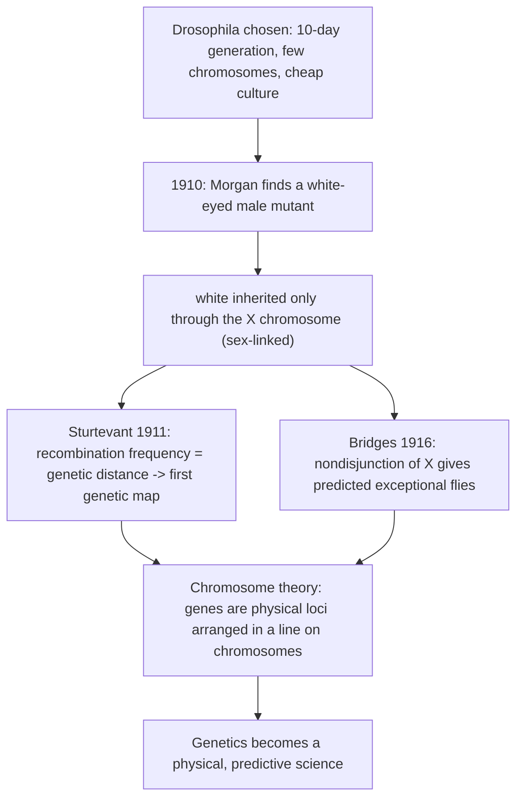
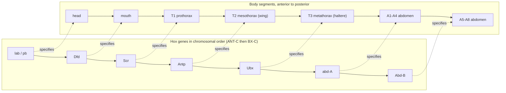
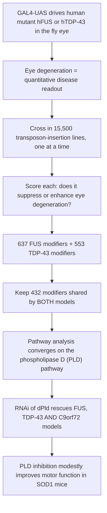

# Genetic Model — Fruitfly (Drosophila)

**Course:** BME333 / BIO333 Genetics (UNIST, 2026 Fall) · Lecture 19 · ~60 min
**Syllabus:** [← Course schedule](../../lectures/2026.BME333-BIO333-Syllabus.md) — Week 12 Mon, 2026-11-16
**Languages:** English · [한국어](../../ko/lectures/lec19_Model-Fruitfly.md)

## Learning Objectives
By the end of this lecture, students should be able to:
- Explain why *Drosophila melanogaster* became the founding model for chromosomal and developmental genetics.
- Trace how the Morgan group used *Drosophila* (white gene, nondisjunction) to prove the chromosome theory of heredity and build the first genetic maps.
- Describe how meiotic-mutant and mapping tools established recombination and gene order.
- Explain how homeotic genes (Antennapedia/Bithorax complexes) revealed the genetic control of body plan.
- Appreciate the modern use of *Drosophila* for disease modeling (e.g., ALS modifier screens).

## Lecture

### 1. Morgan's fly room: birth of a model (~10 min)

By 1900 Mendel's laws had been rediscovered, but they were abstract: nobody knew what a "factor" physically *was* or where it lived in the cell. The organism that turned Mendelian bookkeeping into cell biology was the **fruit fly, *Drosophila melanogaster*** — a 3-mm insect that Thomas Hunt Morgan began breeding around 1908 in a cramped room at Columbia University that became famous as the **"fly room."** The fly's advantages were, and remain, decisive: a **generation time of about ten days**, **hundreds of offspring per female**, cheap culture in milk bottles on mashed banana, and — crucially — only **four pairs of chromosomes** (2n = 8), one of which is the tiny "dot" fourth. Few chromosomes and many offspring are exactly what you need to track inheritance statistically and to correlate breeding results with what you can see down a microscope.

Morgan himself was an unlikely convert. He was an **embryologist**, initially skeptical of Mendelism, which he dismissed as "superior jugglery" — the invocation of invisible factors to explain results after the fact (see [en](../../en/review/Green2010_Genetics_WhiteGene-DrosophilaCentury.md) · [ko](../../ko/review/Green2010_Genetics_WhiteGene-DrosophilaCentury.md)). He started breeding flies partly to test Mendelism critically for himself. What converted him was a single mutant (Segment 2), and what made the conversion revolutionary was the group of talented students he gathered: **Alfred Sturtevant**, **Calvin Bridges**, and **Hermann Muller**. The fly room's culture was collaborative and intensely competitive; a **"treasure your exceptions"** ethic prevailed, because nearly every advance came from a puzzling fly that did not behave as expected.

A defining product of that culture was the first **genetic map**. In 1911, still an undergraduate, Sturtevant realized that the frequency of recombination between two genes could be used as a **measure of the distance between them** on a chromosome, and overnight he laid out the first **linear genetic map** of six sex-linked genes — the founding act of genetic **mapping** (see [en](../../en/review/Provine1991_Genetics_Sturtevant-Drosophila.md) · [ko](../../ko/review/Provine1991_Genetics_Sturtevant-Drosophila.md)). Sturtevant was also the group's deepest evolutionary thinker: in 1919 he showed that what everyone had called "*Drosophila melanogaster*" was in fact two species, naming the sibling species ***Drosophila simulans***, and used clever allelism tests (since all hybrids were sterile) to demonstrate parallel mutations, cytoplasmic maternal effects, and chromosomal inversions between them — anticipating even random genetic drift before the term existed (see [en](../../en/review/Provine1991_Genetics_Sturtevant-Drosophila.md) · [ko](../../ko/review/Provine1991_Genetics_Sturtevant-Drosophila.md)).

**Figure — The logic of the fly room: from one mutant to the chromosome theory.**



### 2. The white gene and the chromosome theory (~10 min)

In **January 1910** Morgan found, among thousands of red-eyed flies, a single male with **white eyes**. He named the gene ***white*** — and this one locus would become a lens on a century of genetics (see [en](../../en/review/Green2010_Genetics_WhiteGene-DrosophilaCentury.md) · [ko](../../ko/review/Green2010_Genetics_WhiteGene-DrosophilaCentury.md)). The immediate puzzle was its inheritance pattern. When Morgan crossed the white male to a normal red female, the F1 were all red (red is **dominant**). But the F2 was strange: white eyes reappeared in the expected ~1/4 of flies, yet **only in males**. The trait behaved as though it were tied to sex.

Morgan's explanation was the birth of the **chromosome theory of heredity** in concrete form. Female flies carry two X chromosomes (XX); males carry one X and one Y (XY). If *white* sits **on the X chromosome** and the Y carries no counterpart, then the inheritance of the trait must track the inheritance of the X — this is **sex linkage**. A male has only one X, so whatever allele he carries there is expressed; there is no second copy to mask it. This was the **first localization of a specific gene to a specific chromosome**, and it transformed Mendel's abstract "factors" into physical objects riding on visible structures.

The reciprocal cross makes the logic vivid and is the classic demonstration of **criss-cross inheritance** — a trait passing from a mother to her sons.

**Figure — Reciprocal white-eye crosses reveal X-linkage.** (X carrying white = Xw; wild-type X = X+.)

| Cross | F1 daughters | F1 sons |
|---|---|---|
| white male (Xw Y) × red female (X+ X+) | X+ Xw — **all red** | X+ Y — **all red** |
| red male (X+ Y) × white female (Xw Xw) | X+ Xw — **all red** | Xw Y — **all white** (criss-cross) |

In the second cross, sons receive their only X from their white mother and are therefore all white, while daughters receive a wild-type X from their father and are red carriers — a pattern impossible to explain unless the gene physically resides on the X. Over the following century the *white* locus went on to illustrate almost every major genetic phenomenon: **position-effect variegation** (Muller, 1930 — moving *white* next to centromeric heterochromatin by inversion silences it patchily, revealing chromatin-based, epigenetic regulation), **dosage compensation** (equalizing X-linked expression between XX and XY), **mobile DNA elements** (unstable *white* alleles caused by transposon insertions, paralleling McClintock's maize elements), and it became the **first *D. melanogaster* gene ever cloned** (the *white-apricot* allele, tagged by the *copia* transposon, in 1981) (see [en](../../en/review/Green2010_Genetics_WhiteGene-DrosophilaCentury.md) · [ko](../../ko/review/Green2010_Genetics_WhiteGene-DrosophilaCentury.md)).

### 3. Nondisjunction as proof of chromosome theory (~10 min)

Morgan's sex-linkage argument was powerful, but a skeptic could still object that genes and chromosomes merely *correlate* — perhaps "the cell as a whole" carries heredity and the chromosome parallel is coincidence. Calvin **Bridges** demolished this objection in the inaugural 1916 issue of the journal *Genetics* with a paper whose logic remains a model of rigor: **"Non-disjunction as proof of the chromosome theory of heredity"** (see [en](../../en/article/Bridges1916_Genetics_NonDisjunction-SexChromosome.md) · [ko](../../ko/article/Bridges1916_Genetics_NonDisjunction-SexChromosome.md)).

The key idea is to use a **rare mistake in chromosome behavior to test a prediction exactly**. **Nondisjunction** is the failure of paired chromosomes to separate during meiosis. In a female carrying two X chromosomes bearing a sex-linked recessive marker (Bridges used ***vermilion***, a recessive eye-color mutation), **primary nondisjunction** occasionally sends both X's into the same egg (an XX egg) and none into its sister (an "O" egg with no X). If genes ride on chromosomes, then these abnormal eggs, when fertilized, must produce offspring whose *chromosome constitution* and whose *sex-linked phenotype* match in a strictly predictable way — a relationship Bridges called an **identity of distribution**.

**Figure — Exceptional offspring predicted by X-chromosome nondisjunction.** Mother = vermilion female (Xv Xv) undergoing nondisjunction; father = wild-type male (X+ Y).

| Egg (from mother) | Sperm (from father) | Zygote | Sex / fate | Eye phenotype |
|---|---|---|---|---|
| X+ (normal) | X+ | X+ Xv | normal daughter | wild-type |
| Xv (normal) | Y | Xv Y | normal son | vermilion |
| **Xv Xv** (nondisj.) | Y | **Xv Xv Y** | **exceptional daughter** (fertile) | **vermilion (matroclinous — like mother)** |
| **O** (nondisj.) | X+ | **X+ O** | **exceptional son** (sterile) | **wild-type (patroclinous — like father)** |
| Xv Xv | X+ | Xv Xv X+ (XXX) | usually dies | — |
| O | Y | O Y (no X) | dies | — |

The two exceptional classes are the crux. A **matroclinous XXY daughter** shows her mother's recessive trait (she got both her X's from her mother) and an **XO son** shows his father's trait (his only X came from the father) — the exact reverse of normal sex-linked inheritance. Bridges confirmed these predicted karyotypes **cytologically** under the microscope. He then went further: XXY females are themselves fertile and undergo **secondary nondisjunction** at a rate he calculated from the frequency of X–Y pairing (~16.5%) to be about **4.3%**, a figure he verified across tens of thousands of flies. He also showed that **autosomal genes were inherited normally** in these exceptional flies — only the X-linked characters showed the aberrant pattern, proving the disturbance was specific to the sex chromosomes. When a quantitative prediction derived purely from chromosome behavior matches the breeding data to a fraction of a percent, coincidence is no longer tenable: **genes are on chromosomes**. As a bonus, this was the first systematic description of **sex-chromosome aneuploidy** (XO, XXY, XYY), the direct ancestor of our understanding of human conditions such as Turner (45,X) and Klinefelter (47,XXY) syndromes.

### 4. Recombination, linkage, and meiotic mutants (~8 min)

Sturtevant's map worked because genes on the same chromosome are **linked** — inherited together more often than not — but linkage is incomplete because **crossing over** during meiosis shuffles alleles between homologous chromosomes. The **recombination frequency** between two loci, measured as the percentage of offspring that are recombinant, is proportional to the physical distance between them; **1% recombination = 1 map unit (centimorgan)**. Genes far apart recombine so often they appear unlinked (approaching 50%, Mendel's independent assortment); genes close together rarely recombine and travel as a unit.

**Figure — A schematic sex-linked (X) linkage map, in the spirit of Sturtevant's 1911 map.** Distances are illustrative map units (cM) between ordered loci.

```
X chromosome (Drosophila)
  |------8.0------|----5.5----|-------20.0-------|----10.5----|
 yellow        white      vermilion          miniature      rudimentary
 (body)        (eye)        (eye)             (wing)          (wing)
  0.0          1.5          33.0               36.1            54.5   (cM positions)
```

But recombination and chromosome segregation are not automatic — they are executed by **machinery encoded by genes**, and those genes can themselves be mutated and studied. This was the insight behind the first systematic **meiotic-mutant screens**. Before 1968 only three meiotic mutants were known in *Drosophila*, each stumbled upon by chance. Then Sandler, Lindsley and colleagues (1968) ran the **first deliberate screen designed to isolate meiotic mutants** (see [en](../../en/review/Hawley1993_Genetics_MeioticMutants-Drosophila.md) · [ko](../../ko/review/Hawley1993_Genetics_MeioticMutants-Drosophila.md)). Lacking a good chemical mutagen at the time, they applied **Hardy–Weinberg reasoning**: recessive meiotic mutations should exist in wild populations as heterozygotes at a frequency near the *square root* of the mutation rate — far more common than freshly induced mutations. So they literally collected flies from around Rome (including a winery and the wholesale fruit market), made the recovered chromosomes homozygous, and tested for elevated **nondisjunction**. Of 118 chromosome complements tested in females, 11 significantly raised nondisjunction. Baker and Carpenter (1972) followed with an EMS-based screen recovering the mutants — *mei-9, mei-41, mei-218, nod* — that drove two decades of research.

These mutants **dissected meiosis into genetically separable steps**. They confirmed that *Drosophila* females run **two segregation systems**: a **chiasmate** system (segregation guided by crossovers) and a separate **distributive/achiasmate** system for chromosomes that fail to recombine (the gene *nod*, later shown to encode a kinesin-like motor protein, is central here). Others (*mei-S332, ord*) govern **sister-chromatid cohesion**. Strikingly, many recombination-defective mutants were *also* mutagen-sensitive and DNA-repair-defective, physically linking the machinery of meiotic recombination to DNA repair — a connection now central to understanding cancer predisposition and human aneuploidy (see [en](../../en/review/Hawley1993_Genetics_MeioticMutants-Drosophila.md) · [ko](../../ko/review/Hawley1993_Genetics_MeioticMutants-Drosophila.md)).

### 5. Genetic control of development: homeotic genes (~12 min)

Morgan the embryologist never abandoned his original question — how do genes build a body? — and the fly's greatest legacy is arguably in **developmental genetics**. An early, almost hidden clue appears in Morgan's own idiosyncratic gene notation around 1912. As Falk and Schwartz (1993) show, Morgan symbolized wing mutants so that each gene represented a distinct **developmental step**: losing one factor did not abolish the wing but left the "**residuum**" built by the remaining factors, since (Morgan wrote) there might be "hundreds of factors that enter into the production of wings" (see [en](../../en/review/Falk1993_Genetics_Morgan-GeneticControlDevelopment.md) · [ko](../../ko/review/Falk1993_Genetics_Morgan-GeneticControlDevelopment.md)). Embedded here are two ideas we still teach: the **many-to-many relationship** between genes and traits, and **pleiotropy** (one gene affecting many traits). Morgan abandoned the notation as impractical, but the underlying insight — that development is a *stepwise, gene-controlled program* — was resurrected by Beadle and Ephrussi's 1936 pigment-pathway work, foreshadowing "one gene–one enzyme."

The concept of a stable developmental "program" was made concrete by the study of **imaginal discs** — pouches of cells in the larva that are already *determined* to become specific adult organs (leg, wing, eye) long before they *differentiate*. Garen and Shearn's 1967 screen for disc-defective lethals estimated that **~1,000 genes** specifically control the imaginal pathway, and framed the "**homunculus**" not as a preformed miniature but as a *dynamic process*: maternal genes sketch a rough positional blueprint during oogenesis, refined by zygotic genes after the blastoderm forms (see [en](../../en/review/Garen1992_Genetics_Homunculus.md) · [ko](../../ko/review/Garen1992_Genetics_Homunculus.md)). How a field of cells reads its position was later given molecular form for the **leg**: the 1970s **polar-coordinate model** (a phenomenological description of regeneration) was replaced by the **boundary model**, in which signaling molecules **Wingless (Wg)**, **Hedgehog (Hh)**, and **Decapentaplegic (Dpp)** form gradients from compartment boundaries, and transcription factors (*Dll, dac, hth*) read gradient strength to assign proximodistal position (see [en](../../en/review/Baker2009_Genetics-Perspective-FlyLeg.md) · [ko](../../ko/review/Baker2009_Genetics-Perspective-FlyLeg.md)).

The most spectacular discovery was the **homeotic genes** — genes whose mutation transforms one body part into the likeness of another. Ed **Lewis** spent decades dissecting the **bithorax complex (BX-C)**, showing it contains a cluster of genes each conferring the identity of a particular posterior segment (see [en](../../en/review/CrowBender2014_Genetics_EdLewis.md) · [ko](../../ko/review/CrowBender2014_Genetics_EdLewis.md)). Deleting BX-C function produced his iconic **four-winged fly**, in which the third thoracic segment (normally bearing tiny balancers called halteres) is transformed into a copy of the second (bearing wings). Lewis discovered the profound rule of **colinearity**: the genes lie on the chromosome in the *same order* as the body segments they control. In parallel, Thom Kaufman defined the anterior counterpart, the **Antennapedia complex (ANT-C)**, using **saturation mutagenesis** (isolating mutations in every function of a chromosomal interval) and complementation analysis — a method that also uncovered non-homeotic developmental genes such as the segmentation gene *fushi tarazu* (see [en](../../en/review/Denell1994_Genetics_AntennapediaComplex.md) · [ko](../../ko/review/Denell1994_Genetics_AntennapediaComplex.md)). When both complexes were cloned in 1985, they were found to share a conserved **homeobox** encoding a DNA-binding domain, marking these genes as **transcription factors** — and the same clustered, colinear **Hox** genes turned up in vertebrates, making Lewis's fly rule a universal principle of animal body-plan construction (Nobel Prize, 1995, shared with Nüsslein-Volhard and Wieschaus).

**Figure — Hox colinearity: gene order on the chromosome matches the body axis.**



### 6. Modern Drosophila: disease modeling (~7 min)

A century after the white-eyed male, the fly remains a front-line tool — now for **human disease**. Its power comes from **deep conservation** (many human disease genes have clear fly counterparts), an unmatched genetic toolkit, and one especially clever device: the **GAL4–UAS system**, a two-part switch (a tissue-specific *GAL4* driver plus a *UAS*-linked target gene) that lets researchers express any gene — including a **human** disease gene — in any chosen tissue. Point it at the eye, whose regular lattice of facets makes even subtle degeneration easy to score, and you have a fast, visible readout of a disease process.

Kankel et al. (2020) applied this to **amyotrophic lateral sclerosis (ALS)**, a fatal motor-neuron disease (see [en](../../en/article/Kankel2020_Genetics_Drosophila-ALS-modifier.md) · [ko](../../ko/article/Kankel2020_Genetics_Drosophila-ALS-modifier.md)). They built fly ALS models by driving eye-specific expression of human mutant proteins — **hFUS^R521C^** and **hTDP-43^M337V^** — each of which degrades the eye. They then ran a **genome-wide modifier screen**: crossing in **15,500 transposon-insertion lines** and scoring each for its ability to **suppress or enhance** the eye phenotype. A modifier that changes the disease phenotype points to a gene in the relevant pathway. The critical design trick was to run **two independent ALS models** and keep only the **shared modifiers**, filtering out effects specific to one gene from those hitting a **common disease mechanism**.

**Figure — A Drosophila genome-wide modifier screen for ALS.**



The screen converged on the **phospholipase D (PLD) pathway**: six of its components (*dPld, ArfGAP3, Plc21C, Rho1, Ras85D, Rgl*) suppressed both models, RNAi knockdown of *dPld* rescued FUS, TDP-43, **and** a third (C9orf72) ALS model, and PLD inhibition even produced modest motor improvement in **SOD1 mutant mice** — nominating PLD as a candidate therapeutic target across multiple ALS causes. The broader lesson, echoed by Bonini and Berger's argument that model organisms remain indispensable in the genomics era, is that **unbiased forward-genetic screens** in a "simple" animal still discover pathways and drug targets that pure sequencing of patients cannot.

### 7. Wrap-up (~3 min)

From a single white-eyed male in a milk bottle to genome-wide screens for ALS drugs, *Drosophila* has been the workhorse that turned genetics from bookkeeping into mechanism: it localized genes to chromosomes, gave us mapping and the chromosome theory, dissected meiosis, and revealed the conserved genetic logic of the body plan. Next lecture moves from insect to mammal — the **mouse** — where the same forward-genetic spirit meets the reverse-genetic power of gene targeting.

## Key Takeaways
- ***Drosophila*** was ideal — fast generations, huge broods, cheap culture, only four chromosome pairs — turning Mendelian abstractions into physical cell biology in Morgan's "fly room."
- The **white gene** (Morgan, 1910), being **X-linked**, gave the first localization of a gene to a chromosome and the concrete birth of the **chromosome theory**; reciprocal crosses show criss-cross (sex-linked) inheritance.
- **Sturtevant** (1911) invented **genetic mapping** — recombination frequency = distance (1% = 1 cM) — and defined the sibling species *D. simulans*.
- **Bridges** (1916) proved genes are on chromosomes by showing X **nondisjunction** produces exactly the predicted exceptional flies (matroclinous XXY daughters, patroclinous XO sons), confirmed cytologically and to ~4.3% quantitative precision.
- **Meiotic-mutant screens** (Sandler 1968; Baker & Carpenter 1972) dissected meiosis into separable steps — chiasmate vs. distributive segregation, sister-chromatid cohesion — and linked recombination to DNA repair.
- **Homeotic genes** (Lewis's BX-C, Kaufman's ANT-C) revealed **Hox colinearity**: clustered transcription factors whose chromosomal order matches the body axis, a universal, conserved principle of animal development.
- Modern flies model human disease: a **GAL4–UAS** eye assay plus a **genome-wide modifier screen** identified the **PLD pathway** as a shared, druggable ALS target across FUS, TDP-43, C9orf72 and SOD1 models.

## Textbook Reading
- **Genetics: From Genes to Genomes (8e)** — Ch. 22 Genetic Analysis of Development. → [textbook ref](../../lectures/ref.Genetics-FromGenesToGenomes.md)

## Notes in this vault
Reviews & articles to introduce in class (each has a bilingual en/ko pair):
- `Bridges1916_Genetics_NonDisjunction-SexChromosome` — Bridges' nondisjunction study; physical proof of the chromosome theory. · [en](../../en/article/Bridges1916_Genetics_NonDisjunction-SexChromosome.md) · [ko](../../ko/article/Bridges1916_Genetics_NonDisjunction-SexChromosome.md)
- `Green2010_Genetics_WhiteGene-DrosophilaCentury` — a century of the *white* gene; the emblematic *Drosophila* locus. · [en](../../en/review/Green2010_Genetics_WhiteGene-DrosophilaCentury.md) · [ko](../../ko/review/Green2010_Genetics_WhiteGene-DrosophilaCentury.md)
- `Denell1994_Genetics_AntennapediaComplex` — history and genetics of the Antennapedia complex; homeotic control of identity. · [en](../../en/review/Denell1994_Genetics_AntennapediaComplex.md) · [ko](../../ko/review/Denell1994_Genetics_AntennapediaComplex.md)
- `Hawley1993_Genetics_MeioticMutants-Drosophila` — meiotic mutants dissecting recombination and segregation. · [en](../../en/review/Hawley1993_Genetics_MeioticMutants-Drosophila.md) · [ko](../../ko/review/Hawley1993_Genetics_MeioticMutants-Drosophila.md)
- `Falk1993_Genetics_Morgan-GeneticControlDevelopment` — Morgan's transition toward the genetic control of development. · [en](../../en/review/Falk1993_Genetics_Morgan-GeneticControlDevelopment.md) · [ko](../../ko/review/Falk1993_Genetics_Morgan-GeneticControlDevelopment.md)
- `Kankel2020_Genetics_Drosophila-ALS-modifier` — modern modifier screen using the fly to model ALS. · [en](../../en/article/Kankel2020_Genetics_Drosophila-ALS-modifier.md) · [ko](../../ko/article/Kankel2020_Genetics_Drosophila-ALS-modifier.md)
- `Garen1992_Genetics_Homunculus` — the "homunculus" perspective on pattern formation in the fly. · [en](../../en/review/Garen1992_Genetics_Homunculus.md) · [ko](../../ko/review/Garen1992_Genetics_Homunculus.md)
- `Baker2009_Genetics-Perspective-FlyLeg` — perspective on fly-leg development and appendage patterning. · [en](../../en/review/Baker2009_Genetics-Perspective-FlyLeg.md) · [ko](../../ko/review/Baker2009_Genetics-Perspective-FlyLeg.md)
- `Provine1991_Genetics_Sturtevant-Drosophila` — Sturtevant and the origins of genetic mapping in *Drosophila*. · [en](../../en/review/Provine1991_Genetics_Sturtevant-Drosophila.md) · [ko](../../ko/review/Provine1991_Genetics_Sturtevant-Drosophila.md)
- `CrowBender2014_Genetics_EdLewis` — Ed Lewis and the Bithorax complex; foundation of homeotic gene clusters. · [en](../../en/review/CrowBender2014_Genetics_EdLewis.md) · [ko](../../ko/review/CrowBender2014_Genetics_EdLewis.md)

## Discussion Questions
1. Morgan initially dismissed Mendelism as "superior jugglery." What was it about the *white* mutant and its sex-linked inheritance that turned a skeptical embryologist into the founder of chromosomal genetics? Why is sex-linkage more decisive evidence than an autosomal 3:1 ratio?
2. Bridges used a *rare error* (nondisjunction) to prove a *normal rule* (genes on chromosomes). Explain precisely why matroclinous XXY daughters and patroclinous XO sons could not be explained if heredity were carried by "the cell as a whole." What made his quantitative prediction (~4.3% secondary exceptions) so persuasive?
3. Sandler and Lindsley collected wild flies rather than inducing mutations, reasoning from Hardy–Weinberg that recessive meiotic mutants would be common as heterozygotes. Reconstruct that argument quantitatively. What are the trade-offs of screening natural variation versus induced mutagenesis?
4. Lewis's four-winged fly and the rule of Hox colinearity are often called one of biology's most beautiful results. What exactly does "colinearity" mean, and why is it surprising that the *linear order of genes on a chromosome* should correspond to positions along an animal's body?
5. The Kankel et al. ALS screen kept only modifiers shared between two independent disease models. What kinds of false leads does this design eliminate, and what might it miss? Given that the fly has no motor neurons like ours, why should a fly *eye* screen tell us anything about human ALS therapy?
