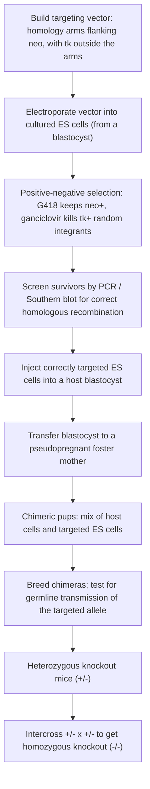
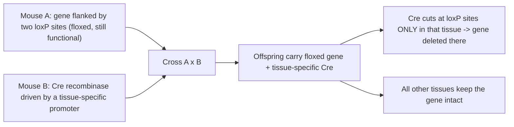

# Genetic Model — Mouse

**Course:** BME333 / BIO333 Genetics (UNIST, 2026 Fall) · Lecture 20 · ~60 min
**Syllabus:** [← Course schedule](../../lectures/2026.BME333-BIO333-Syllabus.md) — Week 12 Wed, 2026-11-18
**Languages:** English · [한국어](../../ko/lectures/lec20_Model-Mouse.md)

## Learning Objectives
By the end of this lecture, students should be able to:
- Explain why the mouse is the premier mammalian genetic model and its relevance to human biology and disease.
- Describe the classical mouse-genetics toolkit: inbred strains, coat-color and morphological mutants, and early linkage/QTL mapping.
- Explain how molecular genetics transformed the mouse (transgenesis, ES cells, gene targeting/knockouts).
- Distinguish forward (mutagenesis, mapping) from reverse (targeted knockout/knock-in) approaches in the mouse.
- Connect mouse genetics to quantitative-trait and disease-modeling applications.

## Lecture

### 1. Why the mouse? (~8 min)

Everything in the previous lectures — worm, fly — used **invertebrates**, which are wonderfully tractable but separated from us by ~600 million years of evolution. The **house mouse (*Mus musculus*)** is a **mammal**: it shares our body plan, our organ systems, a placenta, a mammalian immune and nervous system, and roughly **99% of its genes have a human counterpart**. If you want to model a human genetic disease in a living animal whose physiology resembles ours, the mouse is the default choice. Practically, it is also the most tractable mammal we have: a **generation time of ~10 weeks**, litters of 5–10 pups, small size, and — uniquely among mammals — a **century-old collection of defined genetic stocks**.

That last point is historical and lucky. Long before genetics existed as a science, **mouse "fanciers"** in Europe, America, and especially East Asia bred mice for unusual coat colors and behaviors, producing many stable, distinctive variants. When early-20th-century geneticists needed a mammalian Mendel-organism, this ready-made library of heritable variation was waiting. Fanciers' stocks became the founding material for the **inbred strains** that define modern mouse genetics. The mouse is thus the bridge organism of this course: it carries the classical, forward-genetic tradition of the fly *and* became the arena where **reverse genetics** — deliberately altering a chosen gene — was invented (see [en](../../en/review/Dove1987_Genetics_MouseMolecularGenetics.md) · [ko](../../ko/review/Dove1987_Genetics_MouseMolecularGenetics.md)).

### 2. Classical mouse genetics (~12 min)

The cornerstone of mouse genetics is the **inbred strain**: a line bred by brother–sister mating for **20+ generations**, after which every animal is essentially **homozygous at every locus and genetically identical to its siblings** — a mammalian equivalent of a true-breeding line, but genome-wide. Inbred strains (C57BL/6, BALB/c, DBA, and dozens more) give reproducible genetic backgrounds so that any phenotypic difference between two strains must be genetic. Two derived tools are essential: **congenic strains**, made by repeatedly backcrossing a single chromosomal region (say, a disease allele) onto a standard background so the allele can be studied in isolation; and **recombinant inbred (RI) panels**, made by crossing two inbred strains and then inbreeding the offspring into many new lines, each a fixed mosaic of the two parental genomes — a permanent, reusable mapping resource.

Classical mouse genetics ran largely on **natural variants**, especially **coat-color and morphology mutants** that are easy to score by eye. Many were what J.B.S. Haldane called **"patent lethals"** — alleles that give a visible **heterozygous** phenotype but are **lethal when homozygous**, betraying an essential developmental gene (see [en](../../en/review/Dove1987_Genetics_MouseMolecularGenetics.md) · [ko](../../ko/review/Dove1987_Genetics_MouseMolecularGenetics.md)).

**Figure — Emblematic classical mouse loci.**

| Locus (allele) | Visible phenotype | Notes |
|---|---|---|
| *Agouti-yellow* (A^y) | yellow coat (heterozygote) | homozygous lethal — a "patent lethal" |
| *Dominant white-spotting* (W / *Kit*) | white belly spots, anemia | later shown to be the *Kit* receptor |
| *Steel* (Sl / *Kitl*) | pigment & blood defects | encodes the ligand for the *Kit* receptor |
| *piebald* (s / *Ednrb*) | variable white spotting | modifier-controlled variation (see below) |
| *t* haplotypes (chr 17) | transmission distortion, tail/lethal effects | recombination-suppressed variant complex |

The **recessive *t* haplotypes** of chromosome 17 illustrate both the richness and the frustration of natural variants: a set of shared **inversions suppresses recombination** with the normal chromosome, genetically "freezing" the region so it accumulates a plethora of polymorphisms (~0.007 substitutions per base pair) and many developmental defects — a treasure trove of biology, but a molecular tangle that was nearly impossible to resolve gene-by-gene (see [en](../../en/review/Dove1987_Genetics_MouseMolecularGenetics.md) · [ko](../../ko/review/Dove1987_Genetics_MouseMolecularGenetics.md)).

Mouse geneticists also pioneered the study of **continuous (quantitative) traits** in a mammal. A beautiful early example is Dunn and Charles's 1937 analysis of **piebald spotting** (see [en](../../en/review/DunnCharles1937_Schimenti2016_GeneticsClassic_MouseQTL.md) · [ko](../../ko/review/DunnCharles1937_Schimenti2016_GeneticsClassic_MouseQTL.md)). Mice homozygous for the single *piebald* mutation (gene *s*) show a huge range of coat patterns, from nearly all-white to nearly fully pigmented. Was this variation genetic, random, or both? Dunn and his student built inbred lines selected for extreme phenotypes, devised a **quantitative grading scale** for the amount of white, and ran F1 and backcrosses. Reading the grades across large cohorts, they showed the variation was governed by **multiple unlinked modifier loci** — some of which caused pigment defects on their own — and that inbreeding made phenotypes more uniform, confirming a heritable basis. This is, in essence, a **QTL study** minus the molecular gene mapping (impossible in 1937). The payoff came decades later: the *s* gene is now known to be ***Ednrb*** (endothelin receptor type B), whose human mutations cause **Hirschsprung disease** and **Waardenburg syndrome** — and the modifier concept underlies why single-gene disorders vary so much between patients (**penetrance** and **expressivity**).

### 3. The molecular-genetics revolution (~15 min)

Classical genetics goes **phenotype → gene**: find a mutant, then hunt for the affected gene. The molecular revolution added the reverse route, **gene → phenotype**: start with a cloned gene and ask what it does by deliberately altering it in a living mouse. Two technologies made this possible.

**Transgenesis.** The first step was simply to *add* DNA. Injecting a cloned gene into the pronucleus of a fertilized egg produces a **transgenic mouse** that stably carries and expresses the added sequence. This is powerful for gain-of-function studies — overexpress a gene, or express a human disease gene — but it is crude: the transgene inserts **randomly**, in variable copy number, subject to position effects, and it does not touch the animal's own copy of a gene.

**Embryonic stem (ES) cells and gene targeting.** The transformative advance was the ability to change a **specific, chosen** gene at its **native locus**. It rested on two ingredients. First, **embryonic stem (ES) cells**: cells derived from the inner cell mass of a mouse blastocyst that can be grown and manipulated in culture yet remain **pluripotent** — able, if returned to an embryo, to contribute to every tissue including the germ line. Second, **gene targeting by homologous recombination**: a DNA construct sharing sequence ("homology arms") with the target gene will, at low frequency, recombine precisely into that gene, replacing or disrupting it. To find the rare correctly targeted cells among many random integrants, the classic design uses **positive–negative selection**: a *neo* (neomycin-resistance) cassette *inside* the homology arms selects for cells that took up the construct (survive G418), while a *tk* (herpes thymidine kinase) cassette placed *outside* the arms is lost during correct homologous recombination but retained during random insertion — so ganciclovir kills the random integrants. Cells surviving both selections are enriched for true homologous recombinants. This work earned Capecchi, Evans, and Smithies the 2007 Nobel Prize.

**Figure — Making a knockout mouse: ES-cell gene targeting.**



The targeted ES cells are injected into a **host blastocyst** and implanted into a **foster mother**, producing a **chimera** — a mouse built partly from host cells and partly from the engineered ES cells. If the ES-derived cells populate the germ line, the chimera's offspring inherit the targeted allele, giving **heterozygous knockouts**; intercrossing them yields **homozygous knockout (−/−) mice** in which the chosen gene is completely inactivated. The same machinery, with a subtler construct, produces a **knock-in**, replacing a gene with a precisely altered version (e.g., installing an exact human disease mutation). This is genetics run backwards — from a sequence to a whole-animal phenotype — and it made the mouse the definitive testbed for gene function in a mammal.

### 4. Forward vs. reverse genetics in the mouse (~12 min)

The mouse is unusual in supporting **both** great strategies of genetics at full power. It is worth stating the contrast explicitly, because choosing the right one is a core research skill.

**Figure — Two directions of genetic analysis in the mouse.**

| | **Forward genetics** | **Reverse genetics** |
|---|---|---|
| Starting point | a phenotype of interest | a gene of interest |
| Direction | phenotype → gene | gene → phenotype |
| Core method | random **mutagenesis** (ENU) or natural variants, then **mapping/positional cloning** | **gene targeting** (knockout / knock-in), transgenes |
| Bias | unbiased — finds any gene that gives the phenotype | hypothesis-driven — tests one chosen gene |
| Main cost | mapping the mutation to a gene is laborious | you must already suspect the gene |

**Forward genetics** in the mouse leans on **ENU (ethylnitrosourea)** mutagenesis. As William Dove explained, ENU is a potent alkylating agent that needs no metabolic activation, causes predominantly **GC→AT point mutations**, and — as Russell's Oak Ridge specific-locus tests established — produces forward-mutation frequencies of about **7 × 10⁻⁴ per locus** in spermatogonia, high enough that a lab handling only a few hundred pedigrees a year can recover mutants (see [en](../../en/review/Dove1987_Genetics_MouseMolecularGenetics.md) · [ko](../../ko/review/Dove1987_Genetics_MouseMolecularGenetics.md)). Dove's own work applied the fly concept of **saturation mutagenesis** — trying to hit *every* gene in a region — to the *t*/*T–H-2* region of chromosome 17, uncovering an estimated **50–100 lethal complementation groups**. The hard part of forward genetics is the last step: connecting a mutant phenotype to a specific stretch of DNA. Dove framed this as the **genetic-to-physical map gap** — the yawning distance between a genetic map measured in **centimorgans** and a physical clone measured in **kilobases**.

**Figure — The genetic-to-physical map gap that positional cloning had to close.**

```
GENETIC MAP     |----------- 1 centimorgan (cM) -----------|   ~ 2,000 kb of DNA in the mouse
                                     ...
PHYSICAL CLONE                              [~50 kb cosmid]
                to assign a point mutation to one cosmid-sized clone
                you must map to ~0.02 cM  <-- far beyond classical resolution
```

Dove estimated only **~5,000–10,000 single-copy vital genes** genome-wide (spaced no closer than ~250 kb), and noted a puzzle still alive today: **vital loci are up to tenfold rarer than transcribed genes** — most genes, when mutated, give *no* obvious phenotype. He attributed this to **genetic redundancy** buffering the genome ("the rest of the iceberg is invisible to us") — the same problem now probed genome-wide by CRISPR screens (see [en](../../en/review/Dove1987_Genetics_MouseMolecularGenetics.md) · [ko](../../ko/review/Dove1987_Genetics_MouseMolecularGenetics.md)).

**Reverse genetics** solves the "which gene?" problem by construction, but plain knockouts have two limits: if the gene is essential, the knockout **dies as an embryo** (you learn it is vital, but little else), and a whole-body knockout cannot tell you *where* or *when* the gene acts. The elegant fix is the **conditional (Cre/lox) knockout**. Short **loxP** sequences are placed flanking ("floxing") the target gene by targeting, leaving it fully functional. A second mouse expresses the **Cre recombinase** under a **tissue- or time-specific promoter**; Cre excises whatever lies between two loxP sites. Cross the two lines and the gene is deleted **only in the Cre-expressing cells** — letting you knock a gene out in, say, only the liver, or only in adulthood.

**Figure — Conditional (tissue-specific) knockout with Cre/lox.**



### 5. Quantitative traits and disease models (~10 min)

Most medically important traits — blood pressure, body weight, diabetes risk, cancer susceptibility — are **quantitative**: continuously varying and controlled by **many genes plus environment**. The mouse is the mammal in which these can be dissected genetically. The strategy descends directly from Dunn and Charles: cross two inbred strains that differ in the trait, then in the F2 or in an **RI panel** look for **chromosomal regions whose genotype correlates with the trait value** — a **quantitative trait locus (QTL)**. Because inbred strains fix the alleles and RI panels are reusable and densely genotyped, a mapping population made once can be phenotyped for any trait, by any lab, for decades. Modern **QTL mapping** is exactly Dunn's 1937 logic — grade a continuous phenotype, follow modifier loci across a cross — now equipped with genome-wide molecular markers and, ultimately, sequencing to name the underlying gene (see [en](../../en/review/DunnCharles1937_Schimenti2016_GeneticsClassic_MouseQTL.md) · [ko](../../ko/review/DunnCharles1937_Schimenti2016_GeneticsClassic_MouseQTL.md)).

Two disease-modeling themes follow. First, **modifier genetics**: the *piebald*/*Ednrb* story shows that a single disease allele can produce wildly different phenotypes depending on the **genetic background** — the same principle that explains variable **penetrance and expressivity** in human patients carrying identical mutations, and a major reason we still need whole-animal genetics rather than the mutation alone. Second, **engineered disease models**: combining reverse-genetic tools, researchers build mice carrying the *exact* human disease allele (knock-ins), **"humanized"** mice in which a mouse gene is swapped for its human counterpart, and **conditional** models that switch a cancer or neurodegeneration gene on in a chosen tissue at a chosen age. These recapitulate human disease in a living mammal for mechanistic study and drug testing — the endpoint of the arc from fanciers' coat-color mice to precision genome engineering.

### 6. Wrap-up (~3 min)

The mouse earns its place as the premier mammalian model by uniting three eras: the classical genetics of inbred strains and coat-color mutants, the reverse-genetic revolution of ES cells and gene targeting, and the quantitative/disease genetics of QTL panels and humanized models — all in an animal 99% of whose genes we share. Next we turn to the **zebrafish**, a vertebrate that trades the mouse's mammalian fidelity for transparent embryos and the throughput to run saturation screens across a whole vertebrate body plan.

## Key Takeaways
- The **mouse** is the premier mammalian model: ~99% gene homology with humans, a mammalian body plan, and a century-old library of fanciers'-derived **inbred strains**.
- **Classical mouse genetics** ran on inbred strains, **congenics**, and **RI panels**, and on natural coat-color/morphology mutants — including "patent lethals" (*Agouti-yellow*, *Steel*, *W/Kit*) and the recombination-suppressed *t* haplotypes.
- **Dunn & Charles (1937)** analyzed *piebald* (*s* = *Ednrb*) spotting as a **quantitative trait** controlled by multiple **modifier loci** — a QTL study before molecular mapping existed; modifiers underlie variable penetrance/expressivity.
- The **molecular revolution** added **transgenesis** and, decisively, **ES-cell gene targeting** (homologous recombination + positive–negative selection → chimeras → germline **knockouts/knock-ins**).
- The mouse supports both **forward** (ENU mutagenesis + positional cloning; the cM-vs-kb map gap) and **reverse** (targeted alleles; **Cre/lox conditional** knockouts) genetics.
- Most disease-relevant traits are **quantitative**; **QTL mapping** in crosses/RI panels plus engineered and humanized disease models make the mouse the definitive mammalian testbed.

## Textbook Reading
- **Genetics: From Genes to Genomes (8e)** — Ch. 22 Genetic Analysis of Development; Ch. 21 Manipulating the Genomes of Eukaryotes. → [textbook ref](../../lectures/ref.Genetics-FromGenesToGenomes.md)

## Notes in this vault
Reviews & articles to introduce in class (each has a bilingual en/ko pair):
- `Dove1987_Genetics_MouseMolecularGenetics` — overview of the molecular-genetics transformation of the mouse model. · [en](../../en/review/Dove1987_Genetics_MouseMolecularGenetics.md) · [ko](../../ko/review/Dove1987_Genetics_MouseMolecularGenetics.md)
- `DunnCharles1937_Schimenti2016_GeneticsClassic_MouseQTL` — Genetics "Classic" on early mouse quantitative-trait analysis; bridges classical to QTL genetics. · [en](../../en/review/DunnCharles1937_Schimenti2016_GeneticsClassic_MouseQTL.md) · [ko](../../ko/review/DunnCharles1937_Schimenti2016_GeneticsClassic_MouseQTL.md)

## Discussion Questions
1. What exactly makes an **inbred strain** so useful, and why can a phenotypic difference between two inbred strains be attributed to genetics with confidence? How do congenic and recombinant-inbred lines extend this power?
2. Dove framed the central problem of 1980s mouse genetics as the gap between **centimorgans** and **kilobases**. Explain why a 1-cM genetic interval is far too large to point to a single gene, and how positional cloning (and later whole-genome sequencing) closed the gap.
3. Walk through **ES-cell gene targeting** and explain the role of each element: homology arms, the *neo* cassette, the *tk* cassette, positive–negative selection, the chimera, and germline transmission. Why is germline transmission the make-or-break step?
4. Contrast a **conventional** knockout with a **Cre/lox conditional** knockout. Give a concrete example of a biological question that *only* the conditional design can answer, and explain why.
5. Dunn and Charles showed in 1937 that a single-gene defect (*piebald*) varies enormously depending on **modifier loci**. How does this classical result illuminate why two human patients with the *same* disease mutation can have very different outcomes? What does it imply about studying a mutation in isolation?
