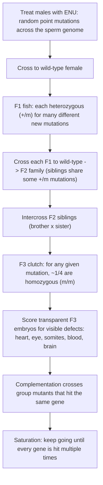
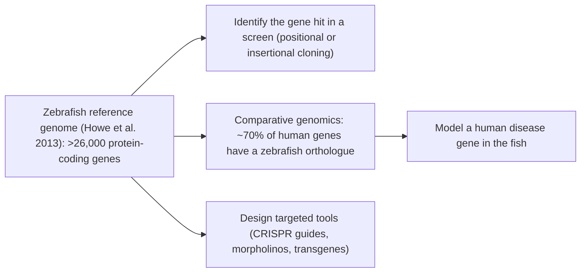

# Genetic Model — Zebrafish

**Course:** BME333 / BIO333 Genetics (UNIST, 2026 Fall) · Lecture 21 · ~60 min
**Syllabus:** [← Course schedule](../../lectures/2026.BME333-BIO333-Syllabus.md) — Week 13 Mon, 2026-11-23
**Languages:** English · [한국어](../../ko/lectures/lec21_Model-Zebrafish.md)

## Learning Objectives
By the end of this lecture, students should be able to:
- Explain why the zebrafish (*Danio rerio*) became a leading **vertebrate** genetic model — external fertilization, optically transparent embryos, rapid development, and high fecundity.
- Describe how large-scale ENU and insertional mutagenesis screens identified genes essential for vertebrate development, and how they differ in throughput and gene-cloning ease.
- Compare the zebrafish saturation-screen strategy with the invertebrate screens (*C. elegans*, *Drosophila*) covered in prior lectures.
- Summarize the value of the zebrafish reference genome for comparative genomics and human-disease orthology (~70% of human genes have a zebrafish orthologue).
- Evaluate the strengths and limitations of zebrafish as a model of human genetic disease.

## Lecture

### 1. Why a vertebrate model? Zebrafish biology (~10 min)

The fly and the worm are superb for genetics, but they are **invertebrates**: no backbone, no neural crest, no closed circulatory system, no bony skeleton, no vertebrate organs built the way ours are. The mouse is a mammal, but it develops **inside the mother**, one small litter at a time — you cannot watch a mouse heart form, and you cannot easily run a screen across thousands of mouse embryos. The **zebrafish (*Danio rerio*)**, a small tropical freshwater fish, fills exactly this gap: a **vertebrate** you can breed and screen with almost invertebrate throughput, and watch develop with your own eyes.

Its advantages follow from its reproductive biology. Fertilization is **external** — eggs are fertilized and develop in a dish, fully accessible to observation and manipulation from the one-cell stage. The embryos are **optically transparent**, so under a simple microscope you can watch the beating heart, the forming somites, the migrating neural crest, and the wiring of the nervous system **in a living animal**, in real time. Development is **fast**: the major organ systems are laid down within the first day or two, and a **generation takes about three months**. And a single female lays **hundreds of eggs per clutch**, providing the large numbers that genetic screens demand. Together these traits make the zebrafish the organism in which the powerful **forward-genetic screen** — pioneered in fly and worm — could finally be applied to **vertebrate development** at scale (see [en](../../en/review/Bonini2017_Genetics_ModelOrganism.md) · [ko](../../ko/review/Bonini2017_Genetics_ModelOrganism.md)).

**Figure — Where the zebrafish sits among genetic models.**

| Feature | *C. elegans* / *Drosophila* | **Zebrafish** | Mouse |
|---|---|---|---|
| Body plan | invertebrate | **vertebrate** | mammal |
| Fertilization / embryo | external / small | **external, transparent** | internal, opaque |
| Live imaging of organogenesis | limited | **excellent** | difficult |
| Generation time | days | **~3 months** | ~10 weeks |
| Offspring number | very high | **hundreds/clutch** | 5–10/litter |
| Screen throughput | high | **high** | low |
| Closeness to human | low | intermediate | **high** |

### 2. Forward genetics: the ENU saturation screens (~15 min)

The zebrafish arrived on the world stage in **1996**, when two laboratories — Christiane Nüsslein-Volhard's in Tübingen and Wolfgang Driever's in Boston — published the results of massive **forward-genetic screens** for mutations affecting embryonic development. These are the vertebrate counterpart of Nüsslein-Volhard and Wieschaus's famous *Drosophila* segmentation screen. The Tübingen screen alone identified genes with "unique and essential functions in the development of the zebrafish" across essentially every organ system (Haffter et al. 1996; see Additional reading below).

The logic is pure **forward genetics** — **phenotype first, gene later** — but with a wrinkle imposed by biology: the interesting developmental mutations are **recessive**, so a mutation must be made **homozygous** before its phenotype appears, and that takes three generations of breeding. The mutagen is **ENU (ethylnitrosourea)**, the same potent point mutagen used in the mouse (Lecture 20); males are soaked in ENU to induce random point mutations throughout their sperm.

**Figure — The three-generation ENU screen for recessive developmental mutations.**

Two concepts from this scheme are central. The first is **genetic saturation**. A single mutation tells you a gene *can* affect a process; a screen becomes powerful only when it is run until **essentially every gene** capable of giving the phenotype has been hit — and hit **more than once**. Recovering multiple independent mutations (**alleles**) of the same gene is the signal that you are approaching saturation: you keep finding the same genes again rather than new ones. The second is the **complementation test**, the tool that decides whether two independently isolated mutants are in the **same gene or different genes**. Cross two recessive mutants with similar phenotypes: if the offspring are **mutant** (fail to complement), the two mutations disrupt the *same* gene; if the offspring are **wild-type** (complement), the mutations lie in *different* genes and the two functions can be restored by each parent supplying the other's good copy. Complementation is how a heap of mutant fish gets sorted into a defined **set of genes** — the same principle used in the fly ANT-C and worm screens covered earlier.

Compared with the invertebrate screens, the zebrafish screen is far more **laborious per genome** — three generations, large aquaria, thousands of crosses — but its payoff is unique: it interrogates **vertebrate-specific** structures (a chambered heart, a segmented vertebral column, blood and vasculature, a complex brain) that simply do not exist in worm or fly. It brought the unbiased, saturation-screen philosophy of Morgan and Nüsslein-Volhard into vertebrate biology.

### 3. Insertional mutagenesis & gene cloning (~12 min)

ENU screens have one serious drawback that reappears from the mouse discussion: a point mutation leaves **no molecular tag**. Once you have a beautiful mutant, you still face the hard, slow work of **positional cloning** — mapping the mutation to a chromosomal region and hunting down the responsible base change. Amsterdam and colleagues (1999) solved this with a fundamentally different mutagen: **retroviral insertional mutagenesis** (Amsterdam et al. 1999; see Additional reading). Instead of chemically nicking bases, they used a **retrovirus** to insert its DNA (a **provirus**) at random sites in the genome; when a provirus lands in or near a gene, it disrupts it — creating a mutation exactly as ENU would.

The decisive advantage is that the inserted provirus is a **known DNA sequence sitting inside the broken gene** — a molecular **tag**. To find the disrupted gene you simply sequence outward from the known proviral DNA into the flanking genomic sequence, and the gene falls out in days rather than months. This converts the painful cloning step into a routine one.

**Figure — ENU vs. insertional mutagenesis: a throughput-vs-cloning trade-off.**

| | **ENU point mutagenesis** | **Retroviral insertional mutagenesis** |
|---|---|---|
| Nature of lesion | random base changes | provirus inserted in/near a gene |
| Mutagenesis efficiency | **high** — many mutations per genome | **lower** — fewer hits per genome |
| Molecular tag? | **no** — invisible point change | **yes** — known proviral sequence |
| Cloning the gene | slow **positional cloning** | **fast** — sequence out from the provirus |
| Best use | maximize phenotype yield | rapid gene identification |

The two methods are complementary, and the trade-off is instructive: ENU maximizes the **number of mutants** but makes each **gene hard to identify**, whereas insertional screens recover **fewer mutants** but hand you the **gene immediately**. This is a recurring theme across model organisms (recall the same tension in the mouse, [en](../../en/review/Bonini2017_Genetics_ModelOrganism.md) · [ko](../../ko/review/Bonini2017_Genetics_ModelOrganism.md), and Dove's insertional-vs-chemical mutagenesis discussion from Lecture 20): you often choose your mutagen based on whether your bottleneck is *finding phenotypes* or *finding genes*.

### 4. The zebrafish reference genome & human orthology (~12 min)

A forward screen ultimately delivers a **gene name** only if you have a genome to name it in. The zebrafish **reference genome**, reported by Howe and colleagues in 2013, provided a high-quality assembly encoding **more than 26,000 protein-coding genes** and, crucially, established the fish's relationship to our own genome: **about 70% of human genes have at least one zebrafish orthologue**, and roughly **82% of human disease-associated genes** have a zebrafish counterpart (Howe et al. 2013; see Additional reading). This is the number that makes the zebrafish medically relevant: most human genes you might care about have a fish version you can mutate and watch.

**Figure — What the reference genome delivers.**

One vertebrate-specific complication must be flagged. Early in teleost fish evolution the entire genome was **duplicated** (the **teleost-specific whole-genome duplication**). As a result, many genes that are **single-copy in humans exist as two paralogues in zebrafish** (often labelled *gene-a* and *gene-b*). This matters practically: the two copies may **share the function** (so knocking out one gives no phenotype, because its partner compensates) or may have **split the ancestral job** between them (subfunctionalization). Either way, interpreting a zebrafish mutant sometimes requires accounting for a second copy — a caveat with no equivalent in the fly or mouse. Comparative genomics from the reference sequence is what lets researchers recognize these paralogue pairs and design experiments accordingly.

### 5. Modern tools & disease modeling; wrap-up (~11 min)

Forward screens tell you *which* genes matter; **reverse-genetic** tools let you test a *chosen* gene, and the zebrafish now has a full kit. **Morpholino antisense oligonucleotides** are injected into the one-cell embryo to transiently **knock down** a gene's expression (by blocking translation or splicing) — fast and cheap, but temporary and prone to off-target effects, so results must be confirmed. **Transgenesis** is routine: because the embryo is transparent, fluorescent reporters (e.g., GFP driven by a tissue-specific promoter) let researchers **watch specific cell types glow and move in a living fish**. Most powerfully, **CRISPR/Cas9** now provides precise, heritable **gene editing** — targeted knockouts and knock-ins in the fish's own genome — giving the zebrafish the same targeted reverse genetics that ES cells gave the mouse, but with far less effort.

These tools make the zebrafish a serious **model of human genetic disease** (Penberthy, Shafizadeh & Lin 2002; see Additional reading). Its **strengths** are distinctive: transparent embryos allow **live imaging** of a disease process as it unfolds; the high fecundity enables **large-scale chemical (drug) and genetic screens** in whole living vertebrates, including screens for compounds that rescue a mutant phenotype; and organ systems (heart, blood, kidney, eye, nervous system) are vertebrate-like. Its **limitations** are equally real: the **genome duplication/paralogue** problem can mask phenotypes; a fish is not a mammal, lacking some organs (lungs, limbs, mammary glands) and having a different physiology; and **some human genes have no zebrafish orthologue** at all. As Bonini and Berger argue, no single model is sufficient — the zebrafish **complements**, rather than replaces, the worm, fly, and mouse, and the strongest disease genetics uses several models together (see [en](../../en/review/Bonini2017_Genetics_ModelOrganism.md) · [ko](../../ko/review/Bonini2017_Genetics_ModelOrganism.md)).

**Wrap-up.** The zebrafish extended the unbiased saturation screen from invertebrates into a transparent, high-throughput **vertebrate**, delivered thousands of developmental genes, and — with a reference genome, ~70% human orthology, and modern CRISPR/imaging tools — became a workhorse of disease modeling. Next lecture turns to the **dog**, a model not of laboratory screens but of **natural variation and artificial selection** across breeds.

## Key Takeaways
- The **zebrafish** is the leading *vertebrate* screening model: **external fertilization**, **transparent embryos** (live imaging of organogenesis), **~3-month generations**, and **hundreds of eggs per clutch** give near-invertebrate throughput in a backboned animal.
- The **1996 ENU saturation screens** (Tübingen and Boston) applied phenotype-first forward genetics to vertebrate development using a **three-generation** breeding scheme to reveal recessive mutations; **saturation** and the **complementation test** convert mutant fish into a defined gene set.
- **Retroviral insertional mutagenesis** trades lower mutagenesis efficiency for a built-in **molecular tag**, making gene cloning fast — the classic **throughput-vs-cloning** trade-off against ENU.
- The **reference genome** (Howe et al. 2013) encodes **>26,000 genes**; **~70% of human genes** (and ~82% of disease genes) have a zebrafish orthologue, enabling comparative genomics and disease modeling.
- The **teleost genome duplication** leaves many human single-copy genes as **paralogue pairs** in fish — a vertebrate-specific caveat that can mask or split gene functions.
- Modern tools — **morpholino** knockdown, fluorescent **transgenesis**, and **CRISPR/Cas9** editing — plus live imaging and chemical screens make zebrafish a powerful disease model that **complements** worm, fly, and mouse.

## Textbook Reading
- **Genetics: From Genes to Genomes (8e)** — Ch. 8 Using Mutations to Study Genes; Ch. 22 Genetic Analysis of Development (forward screens & development in a vertebrate model). → [textbook ref](../../lectures/ref.Genetics-FromGenesToGenomes.md)

## Notes in this vault
Reviews & articles to introduce in class (each has a bilingual en/ko pair):
- `Bonini2017_Genetics_ModelOrganism` — general case for why model organisms drive genetic discovery; use to frame zebrafish alongside worm, fly, and mouse (optional mention). · [en](../../en/review/Bonini2017_Genetics_ModelOrganism.md) · [ko](../../ko/review/Bonini2017_Genetics_ModelOrganism.md)

## Additional reading (PubMed)
The vault has no dedicated zebrafish note, so the following authoritative papers are drawn from PubMed (attribution: According to PubMed):
- Haffter et al. 1996. The identification of genes with unique and essential functions in the development of the zebrafish, *Danio rerio*. *Development* 1996;123:1-36. [DOI](https://doi.org/10.1242/dev.123.1.1) · PMID 9007226 — the Tübingen ENU saturation screen; landmark forward-genetic dissection of vertebrate development.
- Amsterdam et al. 1999. A large-scale insertional mutagenesis screen in zebrafish. *Genes Dev* 1999;13(20):2713-24. [DOI](https://doi.org/10.1101/gad.13.20.2713) · PMID 10541557 — retroviral insertional screen that tags and enables rapid cloning of disrupted developmental genes.
- Howe et al. 2013. The zebrafish reference genome sequence and its relationship to the human genome. *Nature* 2013;496(7446):498-503. [DOI](https://doi.org/10.1038/nature12111) · PMID 23594743 — high-quality genome assembly; ~70% of human genes have a zebrafish orthologue.
- Penberthy, Shafizadeh & Lin 2002. The zebrafish as a model for human disease. *Front Biosci* 2002;7:d1439-53. [DOI](https://doi.org/10.2741/penber) · PMID 12045008 — foundational review of the strengths and limitations of zebrafish for modeling human genetic disease.

## Discussion Questions
1. List the specific biological features that make the zebrafish suited to genetic screens, and explain why each matters. Which of these does the mouse *lack*, and how does that shape what questions each model can answer?
2. Why does a screen for **recessive** developmental mutations require **three** generations of breeding? Draw the crosses and identify at which generation the homozygous mutant phenotype first appears, and in what fraction of the clutch.
3. Explain **genetic saturation** and the **complementation test**. How does recovering multiple independent alleles of the same gene tell you a screen is approaching saturation, and how does complementation sort mutants into genes?
4. ENU and retroviral insertional mutagenesis embody a throughput-vs-cloning trade-off. If your goal were to *maximize the number of developmental genes discovered*, which would you choose, and why? What if your goal were to *clone one specific gene as fast as possible*?
5. About 70% of human genes have a zebrafish orthologue, yet the teleost genome duplication leaves many as paralogue pairs. Give a concrete scenario in which this duplication could cause you to wrongly conclude that a gene is dispensable, and describe how you would guard against that error.
