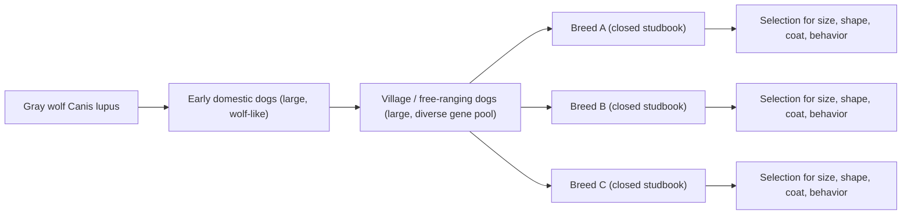
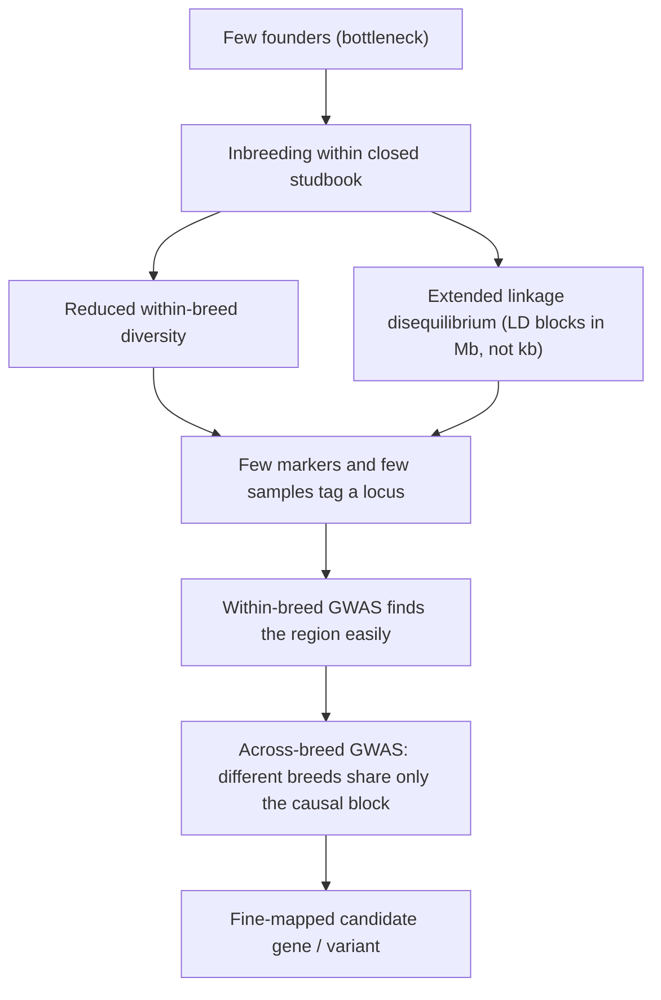
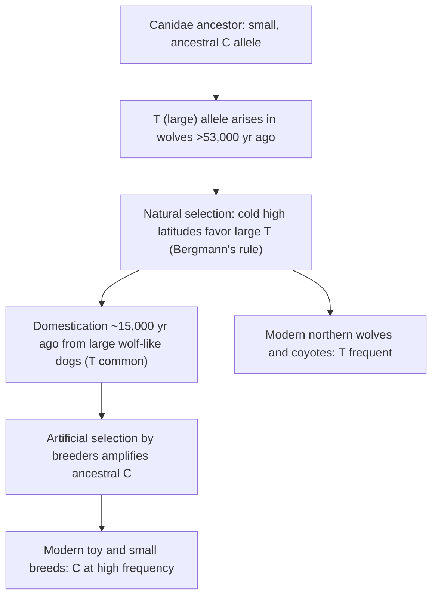

# Genetic Model — Dog

**Course:** BME333 / BIO333 Genetics (UNIST, 2026 Fall) · Lecture 22 · ~60 min
**Syllabus:** [← Course schedule](../../lectures/2026.BME333-BIO333-Syllabus.md) — Week 13 Wed, 2026-11-25
**Languages:** English · [한국어](../../ko/lectures/lec22_Model-Dog.md)

## Learning Objectives
By the end of this lecture, students should be able to:
- Explain why the domestic dog (*Canis familiaris*) is a powerful natural model for the genetics of variation and selection: strong artificial selection, breed structure, and extreme morphological diversity within one species.
- Describe how breed formation creates long linkage blocks and reduced within-breed diversity that make GWAS and mapping of trait loci unusually tractable.
- Connect dog domestication and breeding to the textbook themes of variation and selection in populations.
- Summarize the genetic architecture of a classic dog trait — body size — and the role of a small number of large-effect loci (e.g., *IGF1* and related variants).
- Discuss how dog genetics informs both dog biology and comparable human traits and diseases.

## Lecture

### 1. The dog as a natural experiment in selection (~10 min)

Every trait we have studied so far — Mendel's peas, *Drosophila* eye color, quantitative height — has an underlying rule: **variation** is the raw material and **selection** is the sieve that shapes it. The domestic dog is the single most spectacular demonstration of that rule available in one species. **Artificial selection** — deliberate breeding by humans for chosen traits — has, over only a few thousand years and mostly the last ~200, produced an **~40-fold range in body mass**, from a 1-kg Chihuahua to a 50-kg-plus mastiff, plus enormous variation in leg length, skull shape, coat length and color, ear carriage, tail form, and behavior. That is the greatest body-size diversity of any land mammal, and it all sits inside one interbreeding species (see [en](../../en/article/Rimbault2013_GenomeRes_DogSizeReduction.md) · [ko](../../ko/article/Rimbault2013_GenomeRes_DogSizeReduction.md)).

This was not lost on Darwin. He opened *On the Origin of Species* with **domestication under artificial selection** precisely because it makes the abstract idea of "descent with modification by selection" visible on a human timescale: breeders play the role of nature, and the results accumulate before your eyes. The dog closes the loop we opened in Lecture 01 — it is Darwin's argument, made genomic.

**Domestication.** Dogs descend from **gray wolves (*Canis lupus*)**, diverging on the order of ~15,000–40,000 years ago (the exact date and number of domestication events are still debated; some data support a dual origin). Domestication began with **large, wolf-like animals**, and only much later did humans amplify pre-existing small-size variation to make toy breeds (see [en](../../en/article/Plassais2022_CurrBiol_DogBodySize-NonCodingVariant.md) · [ko](../../ko/article/Plassais2022_CurrBiol_DogBodySize-NonCodingVariant.md)). Domestication also produced the **domestication syndrome** — a suite of correlated changes (tameness, floppy ears, curled tails, altered coat, shifted stress physiology) that appear together when animals are selected simply for reduced fear of humans, most famously reproduced from scratch in the Belyaev/Trut silver-fox experiment (1959–present; see [en](../../en/article/Hekman2019_G3_APtx+Fox.md) · [ko](../../ko/article/Hekman2019_G3_APtx+Fox.md)).

**Figure — From one wolf population to hundreds of breeds.**


### 2. Breed structure & why dog genetics is tractable (~12 min)

Why is the dog not just charismatic but genetically *convenient*? The answer is **breed structure**. A modern breed is a **closed breeding population**: a studbook is established, a small number of founders define the breed, and thereafter animals are bred only to others of the same breed. Two population-genetic consequences follow, and both make gene mapping easier.

First, each breed passed through a **population bottleneck** (few founders) followed by **inbreeding** to fix the breed "look." This **reduces within-breed genetic diversity**: individuals in a breed share long stretches of identical DNA inherited from the same few founders. Second — and this is the key for mapping — bottlenecks and inbreeding create **extended linkage disequilibrium (LD)**. **Linkage disequilibrium** is the non-random association of alleles at nearby loci: when a causal variant is inherited, so is a long surrounding **haplotype** (a block of linked markers). In humans, LD decays within tens of kilobases; **within a dog breed, LD blocks extend for megabases**. That means you can "tag" a causal locus with far fewer markers and far fewer animals than a human study would need.

The trade-off is resolution. Long LD makes it **easy to find the region** but **hard to pinpoint the exact gene**, because the associated block contains many genes. The elegant solution used in dog genetics is a **two-stage strategy**: map coarsely *within* a breed (few markers needed, long LD), then map finely *across many breeds* (because different breeds broke the ancestral haplotype at different points, the shared associated interval shrinks to the causal variant). This "across-breed mapping" turns the diversity of hundreds of independently bred lineages into a fine-mapping engine.

**Figure — Why breed structure makes dog GWAS work (breed structure → long LD → mapping logic).**


**Figure — Dog GWAS vs. human GWAS for the same kind of trait.**

| Feature | Within a dog breed | Human population |
|---|---|---|
| Effective founders | few (bottleneck) | large, outbred |
| LD block length | megabases | tens of kb |
| Markers needed to tag a locus | few | many (millions) |
| Sample size for genome-wide significance | hundreds | tens of thousands–millions |
| Genetic architecture of size | few large-effect loci | many small-effect loci |
| Variance in body size explained by top loci | ~half to ~95% (see below) | ~10% for height (180+ loci) |

This contrast is the pedagogical payoff of the whole lecture: the *same trait* (body size) has a **simple architecture in dogs** and a **highly polygenic architecture in humans**, and the difference is a direct product of the *breeding history*, not of the underlying biology of growth (see [en](../../en/article/Rimbault2013_GenomeRes_DogSizeReduction.md) · [ko](../../ko/article/Rimbault2013_GenomeRes_DogSizeReduction.md)).

### 3. Whole-genome variation & across-breed GWAS (~13 min)

The first generation of canine GWAS used **SNP chips** — fixed arrays of ~170,000 markers (Vaysse et al. 2011) or ~61,000 markers (the CanMap project, Boyko et al. 2010). These are fast and cheap, but because they only *tag* haplotypes, the associated interval spans the whole LD block and rarely names the causal base. The field's methodological leap was to move to **whole-genome sequencing (WGS)**, which reads (in principle) every variant directly.

Plassais et al. (2019) built the anchor dataset for this approach: **WGS of 722 canids** — 144 domestic breeds, 54 wild canid species, and 104 village dogs — yielding a catalog of **>91 million SNVs and small indels** (76.5 million high-quality biallelic SNVs after filtering; median depth 18×) (see [en](../../en/article/Plassais2019_NatComm_DogGenomes+GWAS.md) · [ko](../../ko/article/Plassais2019_NatComm_DogGenomes+GWAS.md)). The design is worth dissecting because it embodies two population-genetic tools:

- **Wild canids as an outgroup** let you infer the **ancestral vs. derived allele** at each site — i.e., which allele existed before domestication and which arose (or was amplified) during breed formation. This gives the *direction* of selection.
- **Village (free-ranging) dogs** are a large, minimally selected reference pool — the "before" picture against which intensively selected breeds are the "after."

They then ran GWAS on **16 morphological traits** defined by American Kennel Club breed standards (weight, height, coat length, ear shape, tail shape, leg length, longevity, etc.) using **GEMMA**, a **linear mixed model** that corrects for sex and, crucially, for **population stratification** (the confounding that arises because breeds differ genome-wide, not just at the causal locus). Applying a stringent Bonferroni threshold (−log₁₀P ≈ 8.46), they found **28 genome-wide-significant associations, including 12 previously unknown candidate genes**. Highlights:

| Trait | Locus / gene | Nature of the variant |
|---|---|---|
| Body size | 14 genes incl. *IGF1, LCORL, HMGA2, GHR, STC2, SMAD2, IGF1R* | collectively explain ~95% of standard breed weight variance |
| Very large body (>41 kg) | *LCORL* | 1-bp insertion → premature stop (p.S1221*), losing a DNA-binding domain; derived allele freq 0.67 in large breeds, 0 in small |
| Long legs | *ESR1* (estrogen receptor 1) | intronic variant; Irish Wolfhounds/Whippets show 20–70× higher *ESR1* expression |
| Drop ("floppy") ears | a single lncRNA on CFA10 | exonic variant in TCONS_00016758/16759 |
| Lifespan | *LCORL, HMGA2, IGF1* | body weight negatively correlated with lifespan (r ≈ 0.72): big dogs die younger |

To confirm that these loci were **shaped by selection** rather than sitting there by chance, the authors applied **selective-sweep statistics** — **XP-CLR** and **XP-EHH**, tests that detect the signature of a rapidly swept haplotype by comparing populations. Positive selection was confirmed at **13 of 18 GWAS candidate genes**, tying the association signal directly to the artificial-selection history. The single most striking number in the paper: **just 14 genes explain ~95% of body-size variance across breeds**, versus **~10% of human height variance explained by 180+ loci** — the simplified architecture predicted in Segment 2, now measured.

### 4. Case study: the genetics of body size (~13 min)

Body size is the model quantitative trait of dog genetics because it is (a) hugely variable, (b) easily measured (breed standard weight), and (c), it turns out, controlled by a **small number of large-effect loci** — the opposite of the "infinitesimal" many-small-effects picture of human height.

**A combinatorial, step-like architecture.** Rimbault et al. (2013) fine-mapped four CanMap body-size QTLs, then genotyped the top variants at **six genes** plus *IGF1* and *IGF1R* in 500 dogs from 93 breeds (see [en](../../en/article/Rimbault2013_GenomeRes_DogSizeReduction.md) · [ko](../../ko/article/Rimbault2013_GenomeRes_DogSizeReduction.md)). The six size genes and their signals:

| Gene (chromosome) | Variant | Biology |
|---|---|---|
| *GHR* (CFA4) | two missense SNPs (E191K, P177L) in exon 5 | growth-hormone receptor; syntenic human exon carries **Laron-syndrome** dwarfism SNPs |
| *HMGA2* (CFA10) | 5′-UTR SNP | *Hmga2*-knockout mice are "pygmy"; D/D mean weight 4.7 kg |
| *STC2* (CFA4) | SNP 20 kb downstream | growth suppressor, GH/IGF1-independent |
| *SMAD2* (CFA7) | ~9.9-kb deletion downstream | TGF-β signaling transcription factor |
| *IGF1* (CFA15) | intronic SNP + SINE insertion (in LD) | insulin-like growth factor 1; the master small-size locus |
| *IGF1R* (CFA3) | R204H missense | IGF1 receptor; D/D mean weight 4.6 kg |

Using **wild canids** (26 gray wolves, 2 red wolves, 2 coyotes) as the ancestral reference, they showed the **derived (mutant) alleles are the size-reducing ones** selected during breed formation. The architecture is beautifully **step-like**: as breed size decreases, the number of loci carrying the derived, size-reducing allele increases. Dogs under 11.3 kg overwhelmingly (98%) carry the *IGF1* derived allele and carry derived alleles at three or more loci; giant breeds (≥40.8 kg) are near-homozygous ancestral at almost every marker. A linear model on breed-averaged allele frequencies explained **46–52% of size variance** after correcting for population structure (86% without correction) — but only **8.4% in giant breeds**, telling us that **making a dog small and making a dog giant are genetically different problems**. (Extra-large size involves hard-to-map X-chromosome loci spanning megabases.)

**Figure — Small dogs stack size-reducing derived alleles (step-like architecture).**
```
Breed weight       Derived size-reducing alleles carried
GIANT  >=41 kg     [ancestral at nearly all loci]                       ~8% variance explained
LARGE              [IGF1 - - - - -]
MEDIUM             [IGF1 GHR - - -]
SMALL              [IGF1 GHR HMGA2 STC2 -]
TOY    <11 kg      [IGF1 GHR HMGA2 STC2 IGF1R SMAD2]  <- 98% carry IGF1  ~64% variance explained
```

**Finding the causal base at *IGF1*.** For over 15 years *IGF1* was known as the main small-size locus (~15% of variance) but the **functional variant** was unknown. Plassais et al. (2022) analyzed **1,431 genomes** — 1,156 modern breed dogs, village dogs, a dingo, plus 33 **ancient** dog genomes, gray wolves, and other canids — and found the causal SNP **rs22397284** (chr15:41,219,654, T>C, p ≈ 10⁻²⁹). Remarkably it lies **not in *IGF1*'s coding sequence but in the last exon of an antisense long non-coding RNA (*IGF1-AS*)** that overlaps *IGF1* by 182 bp and can form an RNA duplex with *IGF1* mRNA (see [en](../../en/article/Plassais2022_CurrBiol_DogBodySize-NonCodingVariant.md) · [ko](../../ko/article/Plassais2022_CurrBiol_DogBodySize-NonCodingVariant.md)). The **C allele is "small"** (75% of CC dogs have breed mass <15 kg), the **T allele is "large"** (75% of TT dogs >25 kg), and genotype tracks serum IGF-1 protein levels. Validation is clean: miniature schnauzers are nearly fixed for C, giant schnauzers fixed for T — a 6-fold size difference within one schnauzer lineage.

**A deep evolutionary twist.** The "small" **C allele is ancestral** (ferret, panda, and cat all carry C; the Canidae ancestor was small). The "large" **T allele arose >53,000 years ago in wolves** — it is present, heterozygous, in a 53,000-year-old Pleistocene Siberian wolf, tens of millennia before dogs existed. In Pleistocene wolves the T allele rose to high frequency at high latitudes (northern ancient dogs T ≈ 0.75; southern C ≈ 0.79), consistent with **Bergmann's rule** (larger bodies in colder climates) — that is **natural selection**. Then, after domestication, **human breeders amplified the ancestral C allele** to make the small breeds that dominate today — that is **artificial selection**. The very same standing variant was pushed one way by nature and the other by humans.

**Figure — One variant, two selective forces (IGF1-AS body-size allele).**


### 5. From dog traits to human biology; wrap-up (~12 min)

Dog genetics pays off twice: it explains the dog, and it illuminates **human** biology through shared genes and shared diseases.

**Morphology → human growth disorders.** The size genes are not dog curiosities; they are the mammalian growth machinery. *GHR* variants in dogs sit in the exon whose human counterpart causes **Laron syndrome** (GH-insensitivity dwarfism); *HMGA2* and *IGF1* are among the very loci found in **human height** GWAS (Weedon 2008; Lango Allen 2010). The dog therefore offers an *in vivo*, naturally replicated allelic series for genes we cannot manipulate in people — the reason dog studies "translate."

**Behavior and the domestication syndrome.** Dogs are also a model for **behavioral genetics**, the hardest kind of complex trait. The Belyaev/Trut fox experiment selected foxes purely for tameness and, as a correlated response, reproduced the domestication syndrome. Hekman et al. profiled the **anterior pituitary transcriptome** of tame vs. aggressive foxes — the pituitary being the hub of the **HPA (hypothalamic-pituitary-adrenal) stress axis** that releases **ACTH** — and found **346 differentially expressed genes**, implicating altered ACTH regulation rather than a change in *POMC* transcription (the ACTH precursor was not differentially expressed, pointing to downstream processing/secretion) (see [en](../../en/article/Hekman2019_G3_APtx+Fox.md) · [ko](../../ko/article/Hekman2019_G3_APtx+Fox.md)). This is forward-genetic reasoning applied to behavior, with transcriptomics as the readout — and it directly connects breeding-for-behavior to a concrete neuroendocrine mechanism.

**Dogs as a disease model.** Because breeds are semi-isolated populations with characteristic disease burdens (e.g., osteosarcoma in tall sighthounds, tied to the *ESR1* long-leg locus), the dog is a natural model for **comparative oncology** and other human diseases — a bridge to the next lecture on **human cancer genetics** (Lecture 23).

**The single big idea.** Dogs are a natural experiment in which **intense artificial selection acting on standing variation simplified the genetic architecture of complex traits** — few large-effect loci instead of thousands of tiny ones — and **breed structure** (bottlenecks → long LD → shared haplotypes) made that architecture unusually easy to map. That is why one companion animal has taught us so much about variation, selection, and the genotype-to-phenotype map.

## Key Takeaways
- The domestic dog shows an **~40-fold body-size range** within one species — the greatest of any land mammal — a living demonstration of **artificial selection acting on variation** (Darwin's opening argument, made genomic).
- **Breed structure** (few founders → bottleneck → inbreeding) yields **reduced within-breed diversity** and **megabase-scale LD**, so few markers and few animals map a locus; **across-breed mapping** then fine-maps the causal variant.
- WGS of 722 canids catalogued **>91 million variants** and found **28 trait associations**; **selective-sweep tests (XP-CLR, XP-EHH)** confirmed selection at most candidate genes.
- Body size has a **simple, step-like architecture**: ~6–14 large-effect loci; small dogs stack size-reducing **derived** alleles. Compare **~10% of human height variance from 180+ loci** — the difference is breeding history, not growth biology.
- The causal *IGF1* variant is a SNP in the antisense lncRNA ***IGF1-AS***; the small **C allele is ancestral**, the large **T allele arose in wolves >53,000 years ago** — one variant shaped by **natural selection** (Bergmann's rule) and then **artificial selection** (small breeds).
- Dog genes (*GHR*, *HMGA2*, *IGF1*) map onto **human growth disorders**; the fox-domestication/HPA-axis work extends the model to **behavior**; breed disease burdens make dogs a **comparative disease model**.

## Textbook Reading
- **Genetics: From Genes to Genomes (8e)** — Ch. 24 Variation and Selection in Populations (domestication & morphology). → [textbook ref](../../lectures/ref.Genetics-FromGenesToGenomes.md)

## Notes in this vault
Reviews & articles to introduce in class (each has a bilingual en/ko pair):
- `Plassais2019_NatComm_DogGenomes+GWAS` — large multi-breed dog genome dataset with GWAS of morphological traits; anchor for the across-breed mapping segment. · [en](../../en/article/Plassais2019_NatComm_DogGenomes+GWAS.md) · [ko](../../ko/article/Plassais2019_NatComm_DogGenomes+GWAS.md)
- `Plassais2022_CurrBiol_DogBodySize-NonCodingVariant` — a non-coding *IGF1*-associated variant controlling body size; centerpiece of the body-size case study. · [en](../../en/article/Plassais2022_CurrBiol_DogBodySize-NonCodingVariant.md) · [ko](../../ko/article/Plassais2022_CurrBiol_DogBodySize-NonCodingVariant.md)
- `Rimbault2013_GenomeRes_DogSizeReduction` — loci driving the dramatic reduction in dog body size; use for the large-effect-locus discussion. · [en](../../en/article/Rimbault2013_GenomeRes_DogSizeReduction.md) · [ko](../../ko/article/Rimbault2013_GenomeRes_DogSizeReduction.md)
- `Hekman2019_G3_APtx+Fox` — behavior/physiology genetics in canids (fox comparison); use to bridge morphology to behavior and human relevance. · [en](../../en/article/Hekman2019_G3_APtx+Fox.md) · [ko](../../ko/article/Hekman2019_G3_APtx+Fox.md)

## Discussion Questions
1. Within a single dog breed, LD extends for megabases, but across many breeds it collapses to kilobases. Explain the population-genetic reason for each, and why a **two-stage** (within-breed then across-breed) design fine-maps a causal variant that neither stage could resolve alone.
2. Fourteen genes explain ~95% of dog body-size variance, but 180+ loci explain only ~10% of human height variance — even though both traits are highly heritable. Reconcile these facts. Is the *biology* of growth different in dogs and humans, or is something else responsible?
3. The *IGF1-AS* T allele arose in wolves >53,000 years ago and was favored by natural selection at cold latitudes, while breeders later amplified the ancestral C allele. Using this example, explain the difference between **natural** and **artificial** selection acting on the **same standing variation**. What evidence distinguishes selection on a new mutation from selection on standing variation?
4. The causal body-size variant lies in a long non-coding antisense RNA, not in the *IGF1* coding sequence. Why are so many trait- and disease-modifying variants (in dogs and humans) **non-coding and regulatory**? What does this imply for interpreting a patient's genome?
5. The fox experiment selected only for tameness yet produced a whole "domestication syndrome" and altered HPA-axis gene expression. How can selection on one behavioral trait change morphology and physiology together? What does this suggest about pleiotropy and correlated selection responses?
