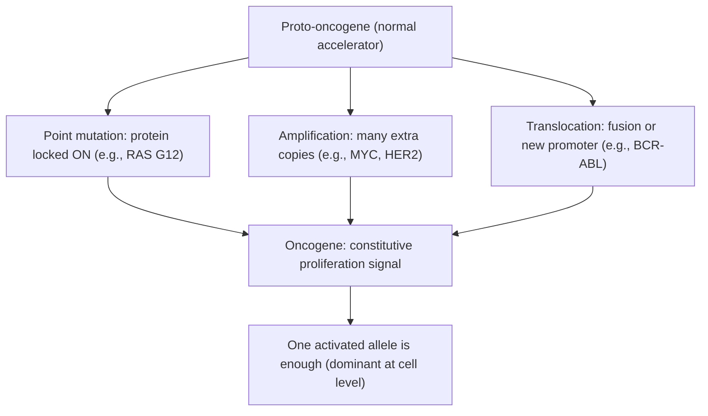
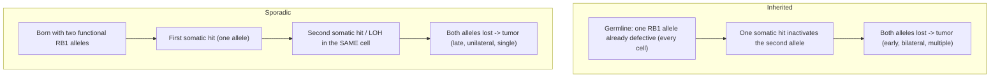
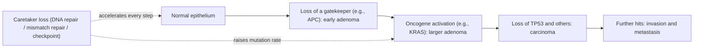
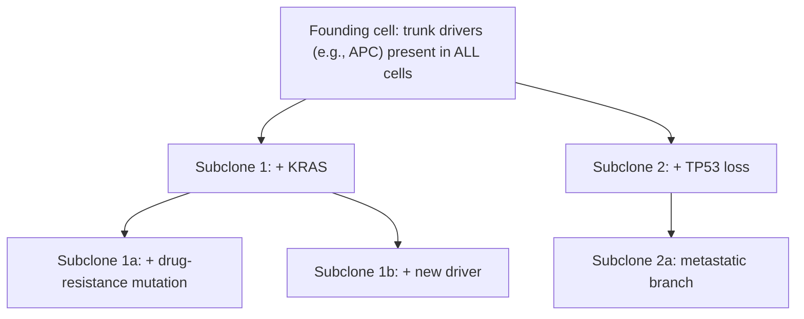

# Human Genetics — Cancer

**Course:** BME333 / BIO333 Genetics (UNIST, 2026 Fall) · Lecture 23 · ~60 min
**Syllabus:** [← Course schedule](../../lectures/2026.BME333-BIO333-Syllabus.md) — Week 14, 2026-11-30 (Mon)
**Languages:** English · [한국어](../../ko/lectures/lec23_Human-Cancer.md)

## Learning Objectives
By the end of this lecture, students should be able to:
- Explain cancer as a genetic disease of somatic cells that arises through the stepwise accumulation of mutations (the multistep/clonal-evolution model).
- Distinguish oncogenes (gain-of-function, dominant) from tumor-suppressor genes (loss-of-function, recessive at the cell level), and apply Knudson's two-hit hypothesis to inherited vs. sporadic cancer.
- Describe how driver mutations are separated from passenger mutations and why somatic mutations accumulate even in normal tissue.
- Interpret a tumor as an evolving population of cells and explain how phylogenetic/population-genetic principles apply to intratumor heterogeneity.
- Connect inherited cancer-predisposition syndromes (e.g., hereditary breast cancer, retinoblastoma) to the same genes disrupted in sporadic tumors.

## Lecture

### 1. Cancer as a genetic disease of somatic cells (~8 min)

Cancer is, at bottom, **a genetic disease** — but usually **not an inherited** one. It is a disease of **somatic cells**: the mutations that cause most cancers arise in the DNA of ordinary body cells during a person's lifetime (from replication errors, chemical damage, radiation, or defective repair) and are *not* present in the egg or sperm. This is the key distinction from the Mendelian disorders of Lecture 24: a **germline** mutation is in every cell and is heritable; a **somatic** mutation is confined to a cell and its descendants and is not passed to offspring.

A tumor is **clonal**: it descends from a single cell that acquired a growth advantage, so the tumor cells share that founding cell's mutations. Cancer is best understood as the **loss of normal control over cell number** — the balance between proliferation, differentiation, and death (apoptosis) is broken. The behaviors a cell must acquire to become malignant are often summarized as the **hallmarks of cancer**: sustained proliferative signaling, evasion of growth suppressors, resistance to cell death, replicative immortality, induced angiogenesis, and activation of invasion and metastasis — with **genome instability** and **inflammation** as enabling characteristics. Every hallmark traces back to altered genes.

The genes that matter come in two great functional classes, which are the organizing idea of the whole lecture:

**Figure — The two gene classes behind cancer.**

| | Proto-oncogene → **oncogene** | **Tumor-suppressor gene** |
|---|---|---|
| Normal job | promote cell division / survival (the accelerator) | restrain division; repair DNA; trigger apoptosis (the brakes) |
| Cancer-causing change | **gain of function** | **loss of function** |
| Alleles that must change | **one** (dominant at the cell level) | usually **both** (recessive at the cell level) |
| Typical mutation | point mutation, gene amplification, translocation | point/truncating mutation, deletion, loss of heterozygosity, silencing |
| Examples | *RAS*, *MYC*, *BCR-ABL* | *RB1*, *TP53*, *BRCA1/2*, *APC*, *NF1*, mismatch-repair genes |

A useful analogy: an oncogene is a **stuck accelerator** (one jammed pedal is enough), a tumor-suppressor loss is a **failed brake** (you need to lose both of a paired braking system before the car runs away).

### 2. Oncogenes and proto-oncogenes (~10 min)

A **proto-oncogene** is a perfectly normal gene whose job is to *promote* cell division or survival — a growth-factor, a receptor, a signal-transducer like **RAS**, or a transcription factor like **MYC**. A mutation that makes such a gene **hyperactive or constitutively "on"** converts it into an **oncogene**. Because a single overactive allele suffices to push the cell toward proliferation, oncogene mutations are **dominant at the cellular level** — one hit is enough.

There are three classic routes to gain of function, and each maps to a real example:

- **Point mutation** locking a protein "on." The *RAS* GTPase normally cycles between an active GTP-bound state and an inactive GDP-bound state; a single missense mutation (e.g., at codon 12) blocks GTP hydrolysis, so RAS is stuck signaling "divide." (This same RAS/MAPK pathway is the one restrained by the *NF1* tumor suppressor — see Segment 6.)
- **Gene amplification** — the cell makes dozens of extra copies of the gene, over-producing a normal protein (e.g., *MYC* or *ERBB2/HER2* amplification), which floods the growth pathway.
- **Chromosomal translocation** — a break-and-rejoin fuses two genes or moves a gene next to a strong promoter. The textbook case is the **Philadelphia chromosome**, a t(9;22) translocation that fuses *BCR* to *ABL*, creating a constitutively active tyrosine kinase that drives chronic myeloid leukemia (and is the target of the drug imatinib).

**Figure — Three ways a proto-oncogene becomes an oncogene (one hit is dominant).**

### 3. Tumor-suppressor genes and the two-hit hypothesis (~10 min)

**Tumor-suppressor genes** are the brakes: they slow the cell cycle, sense and repair DNA damage, and order damaged cells to die. Cancer arises when these genes **lose function**, and because a cell typically carries **two copies (alleles)**, *both* must usually be knocked out before the brake fails. Loss of function is therefore **recessive at the cellular level** — the opposite of oncogenes.

**Knudson's two-hit hypothesis (1971)** is the elegant reasoning that established this, and it explains one of genetics' great puzzles: why the *same* cancer (retinoblastoma, an eye tumor of children caused by loss of ***RB1***) comes in an **inherited** form (early, often bilateral, multiple tumors) and a **sporadic** form (later, usually one eye, single tumor). Alfred Knudson reasoned that **two mutational events ("hits")** are needed to inactivate *both RB1* alleles in a cell:

- In **inherited** retinoblastoma, the child is **born with one defective *RB1* allele in every cell** (the first hit is germline). Only **one further somatic hit** — in any of the millions of retinal cells — is needed to lose the second allele. That single remaining step happens easily and often, hence **early, multiple, bilateral** tumors and a dominant *family* pedigree (even though the mechanism is recessive in the cell).
- In **sporadic** retinoblastoma, the child starts with **two good alleles**, so **two independent somatic hits must strike the same cell** — a rare coincidence, hence **later, single, unilateral** tumors and no family history.

The second hit is frequently not a fresh point mutation but **loss of heterozygosity (LOH)** — the cell loses the whole chromosome region carrying the remaining good allele (by chromosome loss, deletion, or mitotic recombination), unmasking the mutation already present on the other copy. LOH is a molecular fingerprint of tumor-suppressor involvement.

**Figure — Knudson's two-hit model: inherited vs. sporadic retinoblastoma.**

The two-hit logic generalizes to the major inherited-cancer genes (*BRCA1/2*, *TP53*, *APC*, mismatch-repair genes): carriers inherit one defective allele in every cell and need only one somatic second hit, which is why their cancer risk is high and onset early.

### 4. Multistep tumorigenesis and genome instability (~8 min)

A single mutation almost never makes a cancer. Malignancy requires the **stepwise accumulation of several driver mutations** over years — activating oncogenes *and* inactivating tumor suppressors — each conferring an additional growth advantage. The classic illustration is the **Fearon–Vogelstein colorectal progression model**: normal epithelium → *APC* loss (early adenoma) → *KRAS* activation (adenoma growth) → additional losses including *TP53* → carcinoma → metastasis. Each genetic step corresponds to a histological step.

**Figure — Multistep tumorigenesis (the accelerating accumulation of drivers).**

Why do enough mutations ever accumulate? Because a special class of tumor suppressors — **caretaker genes** — normally keeps the mutation rate low. Caretakers include **DNA-repair and mismatch-repair (MMR) genes** and **cell-cycle checkpoint** genes. Losing a caretaker does not itself drive growth, but it produces **genome instability**, dramatically raising the mutation rate so that driver mutations arise far faster — a **mutator phenotype**. Instability comes in flavors: **chromosomal instability (CIN)**, **microsatellite instability (MIN/MSI)** from MMR loss (the basis of Lynch syndrome), and localized hypermutation such as **APOBEC**-driven deamination (see [en](../../en/review/Schwartz2017_NatRevGenet_EvolutionTumour-PhylogeneticsPrinciples.md) · [ko](../../ko/review/Schwartz2017_NatRevGenet_EvolutionTumour-PhylogeneticsPrinciples.md)).

This raises the central interpretive problem of cancer genomics: **driver vs. passenger**. A **driver mutation** causally contributes to the cancer (it is positively selected); a **passenger mutation** is a bystander that happened to be present in the founding cell or arose along the way and confers no advantage. A hypermutated tumor may carry thousands of mutations of which only a handful are drivers. One statistical way to tell them apart is **dN/dS**, borrowed from evolutionary biology: an excess of protein-changing (non-synonymous) over silent mutations at a gene signals **positive selection** and marks it as a driver (see [en](../../en/article/Oliver2025_NatGenet_SomaticMutation-CancerIndependent.md) · [ko](../../ko/article/Oliver2025_NatGenet_SomaticMutation-CancerIndependent.md)).

### 5. Cancer as an evolving cell population (~10 min)

The deepest way to think about a tumor is **Darwinian**. Peter Nowell's **clonal evolution theory (1976)** proposed that a tumor is a **population of cells** subject to the same three ingredients as any evolving population: **mutation** (generating heritable variation), **selection** (variants that grow faster or survive better expand), and **clonal expansion** (drift and growth). Over time this produces **intratumor heterogeneity** — a single tumor is a patchwork of genetically distinct subclones related by descent (see [en](../../en/review/Schwartz2017_NatRevGenet_EvolutionTumour-PhylogeneticsPrinciples.md) · [ko](../../ko/review/Schwartz2017_NatRevGenet_EvolutionTumour-PhylogeneticsPrinciples.md)).

Because subclones are related by descent, their relationships can be reconstructed as a **phylogenetic tree** — the field of **tumor phylogenetics**. Shared "trunk" mutations were present in the common ancestor (early drivers, present in every cell); private "branch" mutations arose later in particular subclones. This is not a metaphor: the same tree-building methods used for species (maximum parsimony, maximum likelihood, Bayesian/MCMC, neighbour-joining) are applied to tumor data from bulk multi-region, or single-cell, sequencing.

**Figure — A tumor as a branching clonal phylogeny.**

Schwartz & Schäffer (2017) stress that **tumor evolution differs from species evolution** in four ways that must be respected or the trees mislead: mutation *types* (whole-chromosome gains/losses, copy-neutral LOH — events that violate standard sequence models), far **higher mutation rates**, **selection strength that changes dramatically under therapy**, and pervasive **heterogeneity**. They also flag a live controversy: whether pre-treatment tumors evolve mostly by **Darwinian selection** or by largely **neutral** growth (the **"big bang" model** of Sottoriva et al., in which most diversity is generated in an early burst and then drifts). The disagreement partly reflects which marker type (SNV vs CNV) and method were used — a caution that **data, model, and algorithm must all match the biology**.

Clinically, this evolutionary view is why cancer is so hard to cure: therapy is a **strong new selective pressure**, and any pre-existing **resistant subclone** — a branch already carrying a resistance mutation — will be selected to expand, causing relapse. Reconstructing the tree tells you which clones to target and helps anticipate resistance.

### 6. Inherited cancer predisposition (~8 min)

Although most cancer is sporadic, **~5–10% of cancers** run in families because a person inherits a **germline mutation in a cancer gene** — usually a tumor suppressor, so the two-hit logic of Segment 3 applies directly: the carrier is "one hit ahead" in every cell.

**Figure — Major inherited cancer-predisposition syndromes.**

| Syndrome | Gene(s) | Class / function | Cancers |
|---|---|---|---|
| Hereditary breast/ovarian cancer | *BRCA1*, *BRCA2* | tumor suppressor / DNA double-strand-break repair (caretaker) | breast, ovarian |
| Li–Fraumeni | *TP53* | tumor suppressor ("guardian of the genome"; apoptosis + checkpoint) | sarcoma, breast, brain, adrenal — many |
| Lynch syndrome (HNPCC) | *MLH1, MSH2*, MMR genes | caretaker / mismatch repair → MSI | colorectal, endometrial |
| Familial retinoblastoma | *RB1* | tumor suppressor / cell-cycle brake | retinoblastoma, osteosarcoma |
| Familial adenomatous polyposis | *APC* | tumor suppressor / gatekeeper | colorectal |
| Neurofibromatosis type 1 | *NF1* | tumor suppressor / RAS-MAPK negative regulator | neurofibromas, gliomas, JMML |

Two teaching points. First, **the same genes drive sporadic tumors**: *TP53* is somatically mutated in a large fraction of all sporadic cancers, and *BRCA*-pathway defects occur somatically too. Inherited and sporadic cancer are the same disease reached by different routes. Second, **comparative genetics** can find **moderate-penetrance, common** risk alleles that are invisible to family studies (which capture only rare, high-penetrance genes like *BRCA1/2* — under 25% of inherited risk). Gould's program mapped rat mammary-cancer susceptibility loci (*Mcs1–5*) and translated them to humans: fine-mapping the compound *Mcs5a* QTL to a ~100-kb region let his team test just that orthologous interval in 12,000 women (slashing the multiple-testing penalty of a genome-wide scan) and find real breast-cancer associations at noncoding variants — with a rat model in hand to work out the mechanism (see [en](../../en/review/Gould2009_Genetics_ComparativeGenetics-BreastCancer.md) · [ko](../../ko/review/Gould2009_Genetics_ComparativeGenetics-BreastCancer.md)). This bridges sporadic tumor genetics, inherited predisposition, and QTL mapping, and underpins **genetic counseling**: knowing a carrier's genotype quantifies risk and guides screening or prevention.

### 7. Somatic mutation beyond cancer & wrap-up (~6 min)

A striking recent discovery complicates the tidy picture: **somatic mutations, including cancer-driver mutations under positive selection, accumulate in histologically normal tissue with age** — no tumor required. Normal skin, colon, esophagus, and blood are mosaics of competing mutant clones.

The Oliver et al. (2025) *NF1* study makes this concrete and directly extends Knudson. In children with **neurofibromatosis type 1** (germline *NF1* first hit in every cell), the team sequenced 838 microdissected cell groups and found **multiple independent somatic second hits in *NF1*** — truncating mutations and **LOH** — scattered across *histologically normal* brain, nerve, and other neuroectodermal tissue, and *absent* from unaffected children (see [en](../../en/article/Oliver2025_NatGenet_SomaticMutation-CancerIndependent.md) · [ko](../../ko/article/Oliver2025_NatGenet_SomaticMutation-CancerIndependent.md)). **dN/dS analysis showed positive selection** for truncating *NF1* variants in normal tissue: *NF1*-null cells clonally expand because losing neurofibromin (a RAS-MAPK brake) confers a growth advantage. The crucial nuance: **the two-hit ("both alleles lost") state is common in normal tissue but is *not sufficient* for cancer** — most double-hit clones never become tumors. So the classical assumption that "second hit = neoplasia" is too simple: second hits are widespread, and additional cooperating events or contexts are needed for transformation. This also sharpens the **driver-vs-passenger** problem — a "driver" mutation found in a tumor may also be sitting, positively selected, in the patient's normal tissue.

**Synthesis.** Cancer is a **somatic genetic disease** built by the **stepwise accumulation of driver mutations** — activating **oncogenes** (one dominant hit) and inactivating **tumor suppressors** (two recessive hits, per **Knudson**) — accelerated by **caretaker loss and genome instability**, and playing out as **Darwinian clonal evolution** that generates heterogeneity and therapy resistance. Inherited predisposition is the same disease with the first hit pre-loaded in the germline. And the newest twist — pervasive, positively selected somatic mutation in normal tissue — reminds us that the boundary between "normal aging" and "cancer" is a matter of degree and cooperation, not a single switch.

## Key Takeaways
- Cancer is a **genetic disease of somatic cells**: clonal, driven by mutations in the cell's own DNA, mostly **not** inherited; it is loss of normal growth control.
- **Oncogenes** = **gain of function**, **dominant** at the cell level, **one hit** (point mutation, amplification, translocation — e.g., *RAS*, *MYC*, *BCR-ABL*). **Tumor suppressors** = **loss of function**, **recessive**, usually **both alleles** lost (e.g., *RB1*, *TP53*, *BRCA1/2*).
- **Knudson's two-hit hypothesis** explains inherited (germline first hit → one somatic hit → early/bilateral) vs. sporadic (two somatic hits in one cell → late/unilateral) cancer; the second hit is often **loss of heterozygosity (LOH)**.
- Malignancy is **multistep**: several drivers accumulate; **caretaker-gene loss** causes **genome instability** (CIN, MSI, APOBEC), accelerating mutation. **Driver vs. passenger** can be separated by positive-selection signals such as **dN/dS**.
- A tumor is a **Darwinian population** (mutation + selection + clonal expansion) with **intratumor heterogeneity**, reconstructable as a **phylogenetic tree**; **therapy selects resistant subclones** (relapse). Beware neutral "big bang" vs. selection debates and CNV-model pitfalls.
- **Inherited predisposition** (*BRCA1/2*, *TP53*/Li–Fraumeni, Lynch/MMR, *RB1*, *APC*, *NF1*) uses the same genes as sporadic tumors; comparative genetics finds common, moderate-penetrance risk alleles.
- **Somatic driver mutations under positive selection pervade normal tissue** with age (*NF1* second hits in normal nerve/brain); the two-hit state is common but **not sufficient** for cancer — transformation needs cooperating events.

## Textbook Reading
- **Genetics: From Genes to Genomes (8e)** — Ch. 23 The Genetics of Cancer. → [textbook ref](../../lectures/ref.Genetics-FromGenesToGenomes.md)

## Notes in this vault
Reviews & articles to introduce in class (each has a bilingual en/ko pair):
- `Oliver2025_NatGenet_SomaticMutation-CancerIndependent` — Somatic mutation accumulates in normal tissue independent of cancer; use to nuance the "driver vs. passenger" and aging discussion. · [en](../../en/article/Oliver2025_NatGenet_SomaticMutation-CancerIndependent.md) · [ko](../../ko/article/Oliver2025_NatGenet_SomaticMutation-CancerIndependent.md)
- `Schwartz2017_NatRevGenet_EvolutionTumour-PhylogeneticsPrinciples` — Applies phylogenetic principles to tumor evolution; anchor for the "cancer as an evolving population" segment. · [en](../../en/review/Schwartz2017_NatRevGenet_EvolutionTumour-PhylogeneticsPrinciples.md) · [ko](../../ko/review/Schwartz2017_NatRevGenet_EvolutionTumour-PhylogeneticsPrinciples.md)
- `Gould2009_Genetics_ComparativeGenetics-BreastCancer` — Comparative genetics of breast cancer; bridges sporadic tumor genetics with inherited predisposition. · [en](../../en/review/Gould2009_Genetics_ComparativeGenetics-BreastCancer.md) · [ko](../../ko/review/Gould2009_Genetics_ComparativeGenetics-BreastCancer.md)

## Discussion Questions
1. Retinoblastoma occurs in an inherited form (early, bilateral, multiple tumors) and a sporadic form (later, unilateral, single). Use Knudson's two-hit hypothesis to explain both patterns, and explain why the inherited form is *dominant* in family pedigrees even though *RB1* loss is *recessive* at the cellular level.
2. Oncogene mutations are dominant (one hit) while tumor-suppressor mutations are recessive (two hits) at the cell level. Explain the mechanistic reason for this difference, and describe how **loss of heterozygosity** delivers the second hit to a tumor suppressor.
3. Distinguish **driver** from **passenger** mutations. Why does losing a **caretaker** gene make it easier for drivers to accumulate, and how can **dN/dS** be used to identify a gene under positive selection in tumor (or normal) tissue?
4. In what specific ways does tumor evolution differ from species evolution (Schwartz & Schäffer)? Choose one difference and explain how ignoring it could produce a misleading phylogenetic tree or a wrong conclusion about selection vs. neutral ("big bang") evolution.
5. Oliver et al. found that *NF1* second hits under positive selection pervade *normal* tissue in NF1 patients, yet most such clones never become cancer. How does this finding both **support** and **complicate** Knudson's model? What does it imply for using "driver mutations" as biomarkers of cancer risk?
