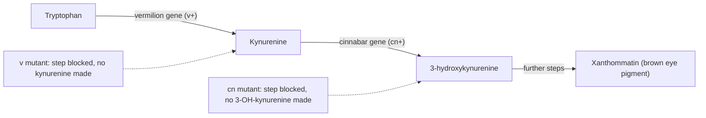
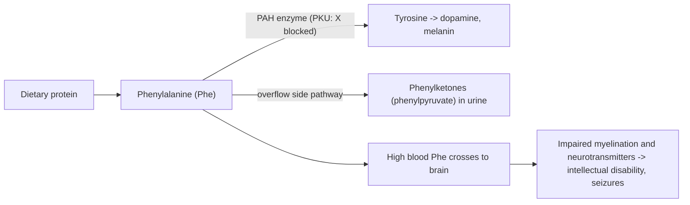
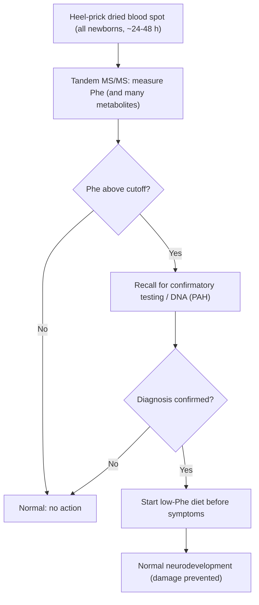
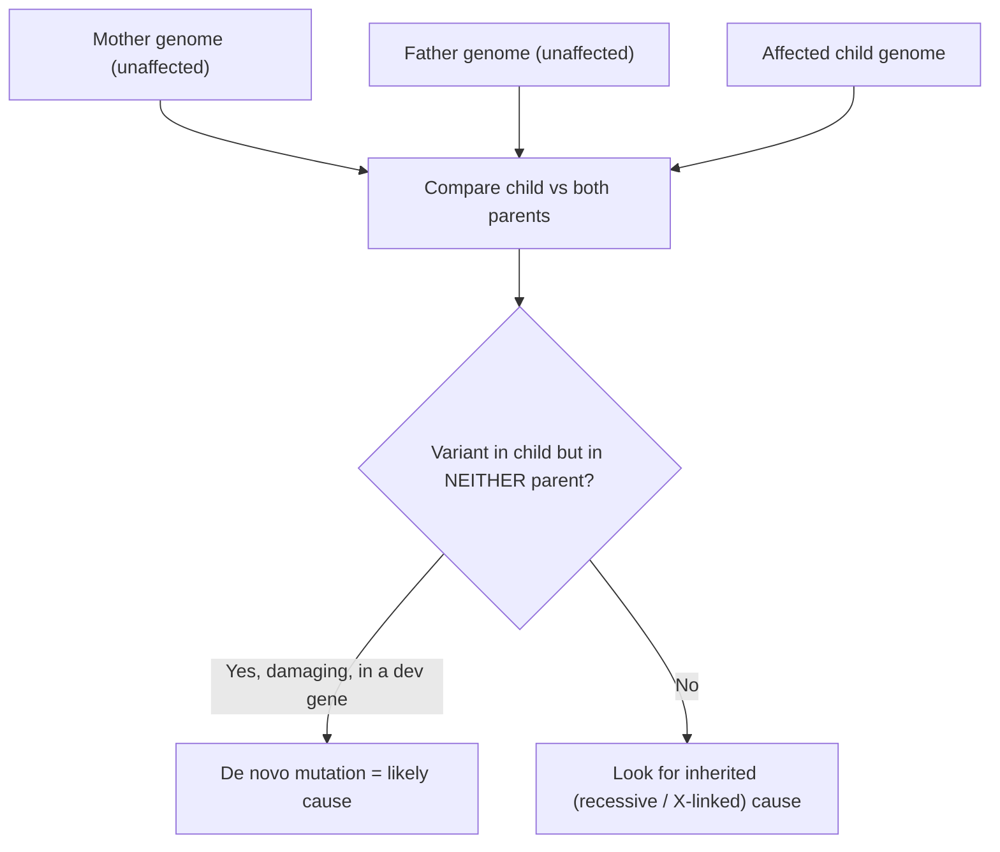
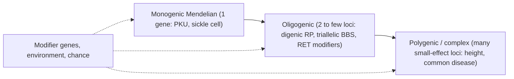

# Human Genetics — Developmental & Metabolic Disorder

**Course:** BME333 / BIO333 Genetics (UNIST, 2026 Fall) · Lecture 24 · ~60 min
**Syllabus:** [← Course schedule](../../lectures/2026.BME333-BIO333-Syllabus.md) — Week 14, 2026-12-02 (Wed)
**Languages:** English · [한국어](../../ko/lectures/lec24_Human-Dev-Metabolic-Disorder.md)

## Learning Objectives
By the end of this lecture, students should be able to:
- Explain how a single-gene defect in a metabolic enzyme produces disease, tracing the "one gene–one enzyme" logic from Garrod's inborn errors to modern inherited metabolic disorders.
- Classify inborn errors of metabolism (intoxication, energy, and storage/complex-molecule groups) and explain the rationale for newborn screening (e.g., PKU).
- Describe how developmental disorders arise from disruption of genes controlling embryonic development, including the major role of de novo mutations.
- Distinguish simple Mendelian inheritance from oligogenic/modifier effects and variable expressivity in human disease.
- Connect genotype to phenotype and to therapeutic/dietary intervention for treatable disorders.

## Lecture

### 1. From Garrod to genomes: the one gene–one enzyme foundation (~10 min)

The whole logic of inherited metabolic disease rests on a single idea: **a gene specifies an enzyme, an enzyme catalyzes a step in a metabolic pathway, and a mutation that disables the enzyme breaks that step.** This is the **one gene–one enzyme hypothesis**, and its story is one of the clean triumphs of classical genetics.

The first glimpse came from the physician **Archibald Garrod**, who in 1908 described **alkaptonuria** and other conditions as **"inborn errors of metabolism."** Alkaptonuria patients excrete urine that turns black on standing because they cannot break down homogentisic acid — Garrod correctly inferred a **blocked chemical step**, inherited as a recessive trait, decades before anyone knew what a gene was made of. He had, in effect, proposed that a hereditary defect equals a missing enzyme activity.

The experimental proof came from **George Beadle** and colleagues. First, the **Beadle–Ephrussi *Drosophila* eye-disc transplantation experiments (1936)**: transplanting eye imaginal discs between larvae, they found that the mutants **vermilion (v)** and **cinnabar (cn)** were **non-autonomous** — the transplanted disc's color depended on the *host's* genotype, meaning the host supplied a **diffusible chemical** that the mutant could not make (see [en](../../en/review/Horowitz1996_Genetics_BiochemGenetics.md) · [ko](../../ko/review/Horowitz1996_Genetics_BiochemGenetics.md)). Those diffusible substances were later identified biochemically (the v⁺ substance as **kynurenine**, the cn⁺ substance as **3-hydroxykynurenine**), mapping an eye-pigment pathway in which **each gene controls one step**:

**Figure — One gene, one enzyme: each step needs its own gene (Drosophila eye-pigment pathway).**


Beadle and **Edward Tatum** then made the logic systematic with the mold ***Neurospora crassa*** (1941): they irradiated spores, isolated mutants that could no longer grow unless a specific nutrient was supplied, and showed **each mutation knocked out one enzyme in one biosynthetic pathway** — the formal **one gene–one enzyme hypothesis** (1958 Nobel Prize). The idea was later refined to **"one gene–one polypeptide"** and then to **gene–protein colinearity** — the demonstration by **Charles Yanofsky** that the linear order of mutation sites in the *E. coli trpA* gene matches, step for step, the linear order of altered amino acids in tryptophan synthase (see [en](../../en/review/Yanofsky2005_Genetics_TryptophanSynthase-OneGeneOneEnzyme.md) · [ko](../../ko/review/Yanofsky2005_Genetics_TryptophanSynthase-OneGeneOneEnzyme.md)). That is the molecular bridge from Mendel's abstract "factors" to real proteins — and to disease, because **a mutated gene means a defective (or missing) protein**.

### 2. Inborn errors of metabolism: logic and classification (~10 min)

An **inborn error of metabolism (IEM)** is a genetic disease in which a defective enzyme (or transporter/cofactor) breaks a metabolic pathway. Individually each IEM is **rare**, but **collectively they are common** (hundreds of disorders sum to a significant birth prevalence) — which is exactly why population screening pays off (Segment 4). Almost all follow **autosomal recessive** inheritance: with two defective alleles the enzyme activity falls below the threshold needed, while heterozygous carriers, with ~50% activity, are usually healthy.

The clinical consequences follow directly from **where the block sits** in the pathway. Blocking a step has two possible effects, and both can cause disease:

**Figure — The logic of an enzymatic block.**
```
            enzyme (gene product)
 SUBSTRATE  ─────X (block)─────►  PRODUCT  ───► downstream product
    │                                 │
    │ accumulates                     │ deficient / missing
    ▼                                 ▼
 TOXIC BUILD-UP                  LOSS OF NEEDED PRODUCT
 (e.g., Phe in PKU)             (e.g., no melanin in albinism)
    │
    ▼
 may spill into an
 alternative (side) pathway → abnormal metabolites
```

From this single diagram you can predict a disease's character, which is the basis of the standard **pathophysiologic classification** into three groups (Saudubray):

**Figure — Three pathophysiologic classes of IEM.**

| Class | Core mechanism | Typical presentation | Examples |
|---|---|---|---|
| **Intoxication** | a small toxic molecule accumulates upstream of the block | symptom-free interval then acute/progressive poisoning; often treatable by removing/restricting the substrate | PKU, maple syrup urine disease, urea-cycle defects, galactosemia |
| **Energy metabolism** | failure to produce or use energy (mito/fatty-acid oxidation, glycolysis) | hypoglycemia, lactic acidosis, cardiomyopathy, weakness — organs with high energy demand | fatty-acid oxidation defects, mitochondrial disorders |
| **Storage / complex molecule** | a large molecule cannot be broken down and accumulates in lysosomes/organelles | chronic, progressive storage; organomegaly, neurodegeneration | lysosomal storage diseases (Gaucher, Tay–Sachs) |

The **position of the block predicts the clinical picture**: an upstream toxic build-up gives an *intoxication* disease that responds to dietary restriction; a broken energy step gives an *energy* disease hitting brain, heart, and muscle; a failure to degrade a macromolecule gives a *storage* disease that worsens over time. This framework converts a bewildering catalog of rare diseases into a small set of predictable patterns.

### 3. Phenylketonuria as a model IEM (~8 min)

**Phenylketonuria (PKU)** is the archetype of a *treatable* genetic disease and the reason newborn screening exists. It is caused by recessive loss of **phenylalanine hydroxylase (PAH)**, the liver enzyme that converts the amino acid **phenylalanine (Phe)** to **tyrosine (Tyr)**. Block that step and Phe — supplied continuously by dietary protein — **accumulates to toxic levels** (a classic *intoxication* IEM), while its downstream product Tyr becomes relatively deficient.

**Figure — The PKU metabolic block.**


Untreated, high blood Phe damages the developing brain, causing **severe, irreversible intellectual disability, seizures, and reduced pigmentation** (less melanin because Tyr, melanin's precursor, is low). The tragedy is that **the child is born neurologically normal** — the damage accumulates only after feeding begins. That single fact makes PKU the perfect target for early detection: **if you find it before symptoms and simply restrict dietary Phe, the child develops normally.** Genotype maps to phenotype and to a concrete intervention — the theme of the whole lecture.

### 4. Newborn screening & treatment principles (~8 min)

Because a **presymptomatic, treatable** window exists, PKU launched **population newborn screening**. Robert Guthrie's 1960s bacterial-inhibition assay on a dried **blood spot** ("heel-prick" card) was the first mass screen; today a single blood spot is analyzed by **tandem mass spectrometry (MS/MS)**, which quantifies dozens of metabolites at once and so screens for **many IEMs simultaneously** from one sample. The logic is a public-health decision rule:

**Figure — Newborn-screening logic (PKU as the model).**


Screening is only worthwhile when a treatment exists. The therapeutic strategies for IEMs follow directly from the block diagram of Segment 2 — **four generic approaches**:

**Figure — Four therapeutic strategies for IEMs.**

| Strategy | Rationale (relative to the block) | PKU / other example |
|---|---|---|
| **Restrict the substrate** | lower the toxic upstream metabolite | low-phenylalanine diet |
| **Supply the deficient product** | replace what the pathway can no longer make | tyrosine supplementation; thyroxine in other IEMs |
| **Remove/detoxify the toxic metabolite** | drain the poison via an alternative route | ammonia scavengers in urea-cycle defects |
| **Boost residual enzyme activity** | help a partially functional enzyme | BH₄ (sapropterin) cofactor in BH₄-responsive PKU; enzyme-replacement therapy in storage diseases |

PKU is managed chiefly by the first strategy (lifelong low-Phe diet), with cofactor therapy for responsive genotypes. The principle generalizes: **understanding the pathway tells you both what goes wrong and how to intervene.** (For the field's arc from Garrod's 1908 inborn errors through newborn screening to enzyme-replacement and gene therapy, see the Arnold and Saudubray reviews below.)

### 5. Genetics of developmental disorders (~10 min)

Metabolic disorders break a *chemical* pathway; **developmental disorders** break a *developmental* program — the genes that pattern the embryo and build organs. Development is directed by a hierarchy of regulatory genes (signaling molecules, receptors, and transcription factors, including the **Hox** patterning genes) that switch other genes on and off in the right cells at the right time. Disrupt one and you get **congenital malformations** (structural birth defects) or **neurodevelopmental disorders** (intellectual disability, autism, epilepsy).

A crucial genetic feature distinguishes many severe developmental disorders from the recessive IEMs: the outsized role of ***de novo* mutations**. A **de novo mutation** is a new mutation present in the child but **in neither parent** — it arose in a parental germ cell (egg or sperm) or very early in the embryo. This matters because severe developmental disorders often **reduce fertility**, so the causal alleles cannot be passed on and instead must be **regenerated each generation by fresh mutation**. Such cases show **no family history** and do not follow a classic Mendelian pedigree, yet they are still single-gene, highly penetrant disorders.

The diagnostic revolution here is **trio sequencing** — exome or genome sequencing of the **affected child plus both unaffected parents**. Comparing the three genomes lets you flag variants present only in the child (de novo) and pinpoint the causal gene even for a brand-new mutation:

**Figure — Trio sequencing identifies a de novo cause.**


The scale of this contribution is large: the Kaplanis et al. (2020) trio study of tens of thousands of families found that **de novo mutations are a major cause of developmental disorders** and, by combining healthcare and research data, defined 28 disorders — see the PubMed list below. Trio sequencing has become the front-line diagnostic test for children with unexplained developmental disorders.

### 6. Beyond simple Mendel: modifiers and expressivity (~8 min)

Real human disease often refuses to behave like textbook Mendelism. Even a "classic Mendelian disorder" like **sickle cell disease** — a single point mutation (HBB^E6V) producing sickle hemoglobin, recessive in HbS homozygotes — is not strictly monogenic: **modifier genes** such as ***BCL11A*** raise fetal hemoglobin (HbF) and **ameliorate** the disease, and the same HbS allele is **protective (dominant)** against severe malaria in heterozygotes — the *same molecule* showing different dominance for different traits (see [en](../../en/review/Makani2022_NatRevGenet_MendelianDisorder.md) · [ko](../../ko/review/Makani2022_NatRevGenet_MendelianDisorder.md)). Between clean single-gene traits and fully polygenic ones lies **oligogenic inheritance** — disease that depends on **two to a few interacting loci** (see [en](../../en/review/Badano2002_NatRevGenet_BeyondMendel.md) · [ko](../../ko/review/Badano2002_NatRevGenet_BeyondMendel.md)):

- **Digenic inheritance:** disease requires mutations at **two** genes together. In one form of retinitis pigmentosa, only **double heterozygotes** at *ROM1* and *RDS/peripherin* are affected — neither mutation alone suffices.
- **Triallelic inheritance:** in **Bardet–Biedl syndrome (BBS)**, two mutations at one *BBS* gene *plus* a third mutation at a **second** *BBS* gene modulate whether and how severely disease appears — a "2 + 1" allele model.
- **Modifier loci:** in Hirschsprung disease, a primary *RET* mutation's severity is tuned by *EDNRB* and other loci.

Two mechanisms are proposed: a **dosage model** (total functional gene product from all loci falls below a threshold) and a **poison model** (a mutant product actively interferes with partners). These frameworks explain two clinical puzzles that pure Mendelism cannot: **incomplete penetrance** (some genotype carriers are unaffected) and **variable expressivity** (the same causal genotype gives different severities in different people) — differences that come from **modifier alleles**, environment, and chance.

**Figure — A spectrum from one gene to many.**


### 7. Synthesis & clinical outlook (~6 min)

The connecting thread of this lecture is **genotype-to-phenotype reasoning**. Garrod, Beadle–Tatum, and Yanofsky established that **a gene makes a protein and a broken gene breaks a pathway** — the founding logic of medical genetics. **Inborn errors of metabolism** are that logic at its cleanest: know the enzyme, predict the accumulating toxin or missing product, classify the disease (intoxication / energy / storage), and design a rational therapy (restrict substrate, supply product, detoxify, or boost enzyme). **PKU** shows the full arc — from a single enzyme defect to population **newborn screening** to a diet that prevents disability.

**Developmental disorders** extend the same reasoning to the genes that build the embryo, where ***de novo* mutations** and **trio sequencing** now dominate diagnosis. And **"beyond Mendel"** — modifiers, oligogenic and triallelic inheritance, incomplete penetrance, and variable expressivity — reminds us that even single-gene diseases play out on a genetic background that shapes the phenotype.

Clinically the field is moving from testing one gene at a time to **genome-based diagnosis**: trio exome/genome sequencing raises diagnostic yield, MS/MS newborn screening catches treatable IEMs before symptoms, and gene- and enzyme-replacement therapies (already reality for sickle cell disease and lysosomal storage diseases) turn genotype knowledge into cures. The path from Garrod's 1908 "inborn errors" to CRISPR correction is the story of one idea — one gene, one protein, one pathway — followed to its therapeutic conclusion.

## Key Takeaways
- **One gene–one enzyme** (Garrod → Beadle–Ephrussi → Beadle–Tatum → Yanofsky colinearity): a gene specifies a protein; a mutation breaks a pathway step, so **substrate accumulates** and/or **product is deficient**.
- **Inborn errors of metabolism** are individually rare but collectively common, mostly **autosomal recessive**; classify by mechanism into **intoxication**, **energy**, and **storage/complex-molecule** groups — the **block's position predicts the clinical picture**.
- **PKU** = recessive **PAH** deficiency → toxic **phenylalanine** build-up → brain damage in an infant *born normal*; the archetypal **treatable** IEM and origin of newborn screening.
- **Newborn screening** (dried blood spot → **tandem MS/MS**) works because a **presymptomatic, treatable** window exists; the **four therapies** are restrict substrate, supply product, remove toxin, boost residual enzyme.
- **Developmental disorders** disrupt embryonic-patterning genes; ***de novo* mutations** are a major cause (no family history), and **trio (child + parents) sequencing** is the diagnostic key.
- **Beyond Mendel:** **oligogenic** (digenic RP), **triallelic** (Bardet–Biedl), and **modifier** effects (sickle cell *BCL11A*; Hirschsprung *RET*/*EDNRB*) explain **incomplete penetrance** and **variable expressivity** — the same genotype, different phenotypes.

## Textbook Reading
- **Genetics: From Genes to Genomes (8e)** — Ch. 22 Genetic Analysis of Development; Ch. 2 Extensions to Mendel (single-gene disorders context). → [textbook ref](../../lectures/ref.Genetics-FromGenesToGenomes.md)

## Notes in this vault
Reviews & articles to introduce in class (each has a bilingual en/ko pair):
- `Yanofsky2005_Genetics_TryptophanSynthase-OneGeneOneEnzyme` — One gene–one enzyme and a metabolic pathway worked out in molecular detail; historical anchor for the metabolic-disorder logic. · [en](../../en/review/Yanofsky2005_Genetics_TryptophanSynthase-OneGeneOneEnzyme.md) · [ko](../../ko/review/Yanofsky2005_Genetics_TryptophanSynthase-OneGeneOneEnzyme.md)
- `Horowitz1996_Genetics_BiochemGenetics` — History of biochemical genetics; sets up how enzyme deficiencies became understood as inherited disease. · [en](../../en/review/Horowitz1996_Genetics_BiochemGenetics.md) · [ko](../../ko/review/Horowitz1996_Genetics_BiochemGenetics.md)
- `Makani2022_NatRevGenet_MendelianDisorder` — Sickle cell disease as a paradigm Mendelian disorder; genotype-to-phenotype and treatment trajectory. · [en](../../en/review/Makani2022_NatRevGenet_MendelianDisorder.md) · [ko](../../ko/review/Makani2022_NatRevGenet_MendelianDisorder.md)
- `Badano2002_NatRevGenet_BeyondMendel` — Oligogenic inheritance and modifiers (Bardet-Biedl); use in the "beyond simple Mendel" segment. · [en](../../en/review/Badano2002_NatRevGenet_BeyondMendel.md) · [ko](../../ko/review/Badano2002_NatRevGenet_BeyondMendel.md)

## Additional reading (PubMed)
According to PubMed:
- Arnold GL. Inborn errors of metabolism in the 21st century: past to present. *Ann Transl Med* 2018;6(24):467. [DOI](https://doi.org/10.21037/atm.2018.11.36) · PMID 30740398 — traces the field from Garrod's 1908 inborn errors through newborn screening to enzyme-replacement and gene therapy.
- Saudubray JM, Garcia-Cazorla À. Inborn Errors of Metabolism Overview: Pathophysiology, Manifestations, Evaluation, and Management. *Pediatr Clin North Am* 2018;65(2):179–208. [DOI](https://doi.org/10.1016/j.pcl.2017.11.002) · PMID 29502909 — modern pathophysiologic classification and clinical approach to IEM.
- Kaplanis J, Samocha KE, Wiel L, et al. Evidence for 28 genetic disorders discovered by combining healthcare and research data. *Nature* 2020;586(7831):757–762. [DOI](https://doi.org/10.1038/s41586-020-2832-5) · PMID 33057194 — large trio-sequencing study defining de novo mutation as a major cause of developmental disorders.

## Discussion Questions
1. Trace the "one gene–one enzyme" idea from Garrod's alkaptonuria through the Beadle–Ephrussi transplantation experiments to Yanofsky's colinearity. What did each step add, and why could the hypothesis not be *proven* until the 1950s–60s?
2. Using the enzyme-block diagram, explain why some IEMs cause disease by **toxic accumulation** and others by **product deficiency** — and how the **position of the block** lets you predict whether a disorder will be an intoxication, energy, or storage disease.
3. PKU children are born neurologically normal but become impaired if untreated. Explain why this single fact makes PKU ideal for **newborn screening**, and map each of the four IEM therapeutic strategies onto the PKU pathway.
4. Contrast the inheritance and diagnostic approach for a **recessive IEM** (e.g., PKU) versus a severe **developmental disorder caused by a de novo mutation**. Why are *de novo* mutations so important for the latter, and why is **trio sequencing** the right tool?
5. Sickle cell disease is called a "classic Mendelian disorder," yet its severity depends on *BCL11A* and its heterozygous form protects against malaria. Using this and Bardet–Biedl triallelic inheritance, explain how **modifier genes** and **oligogenic effects** produce **incomplete penetrance** and **variable expressivity**. Is "one gene, one disease" ever strictly true?
