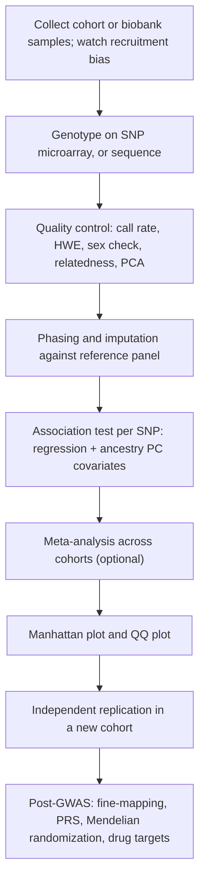
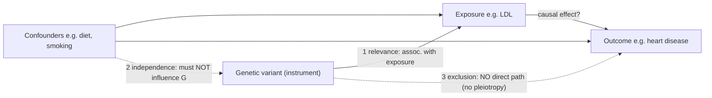

# Human Genetics — Genome-Wide Association Studies (GWAS)

**Course:** BME333 / BIO333 Genetics (UNIST, 2026 Fall) · Lecture 25 · ~60 min
**Syllabus:** [← Course schedule](../../lectures/2026.BME333-BIO333-Syllabus.md) — Week 15 Mon, 2026-12-07
**Languages:** English · [한국어](../../ko/lectures/lec25_Human-GWAS.md)

## Learning Objectives
By the end of this lecture, students should be able to:
- Explain the logic of a GWAS: testing common SNPs genome-wide for association with a trait or disease, exploiting linkage disequilibrium (LD) as the reason a tag SNP can flag a causal variant.
- Interpret a Manhattan plot and a QQ plot, and justify the genome-wide significance threshold (p < 5×10⁻⁸) and the need for genomic-control / population-structure correction.
- Distinguish association from causation, and describe how Mendelian randomization (MR) uses genetic variants as instrumental variables to test causal exposure–outcome hypotheses.
- Summarize the population-genetics foundations (allele frequencies, LD, polygenicity/Fisher's infinitesimal model) that make and limit GWAS.
- Discuss translational uses (polygenic scores, biobanks, drug-target prioritization) and the portability/diversity limitations of GWAS findings.

## Lecture

### 1. Why GWAS? From family linkage to population association (~8 min)

Earlier in the course we mapped genes by **linkage analysis** — following a marker and a disease allele through a pedigree and asking how often they are co-inherited. Linkage is superb for **rare, high-penetrance, single-gene (Mendelian) disorders** where one mutation in one family tracks cleanly with disease (think cystic fibrosis or Huntington's). But it largely fails for **common, complex diseases** — type 2 diabetes, coronary artery disease, schizophrenia — where no single variant is necessary or sufficient, effects are small, and the risk alleles are *common* in the population rather than confined to one family. For those, we need a **population** design, not a family one.

That design is the **genome-wide association study (GWAS)**: genotype a large sample of unrelated individuals at up to ~1 million **single-nucleotide polymorphisms (SNPs)** spread across the genome, then test *each SNP* for a statistical association between its allele counts and the trait (see [en](../../en/review/Pearson2008_JAMA_InterpretingGWAS.md) · [ko](../../ko/review/Pearson2008_JAMA_InterpretingGWAS.md)). The animating assumption is the **common-disease/common-variant (CDCV) hypothesis**: that a meaningful part of the heritability of common diseases is carried by allelic variants that are themselves common (minor allele frequency, **MAF**, above ~1–5%) (see [en](../../en/review/Pearson2008_JAMA_InterpretingGWAS.md) · [ko](../../ko/review/Pearson2008_JAMA_InterpretingGWAS.md)).

The reason we can survey the whole genome with "only" a million SNPs — rather than sequencing every base — is **linkage disequilibrium (LD)**: the non-random co-inheritance of alleles at nearby loci. Because recombination is rare over short distances, stretches of chromosome are inherited as intact **haplotype blocks**, so the genotype at a measured **tag SNP** is highly correlated with the genotypes of many *unmeasured* neighbors — including, potentially, the true **causal variant**. The International HapMap Project catalogued this block structure across populations, and that catalogue is what makes array-based GWAS feasible: a platform of 500,000–1,000,000 SNPs captures roughly **67–89% of common SNP variation** in European and Asian populations (see [en](../../en/review/Pearson2008_JAMA_InterpretingGWAS.md) · [ko](../../ko/review/Pearson2008_JAMA_InterpretingGWAS.md)).

**Figure — Why a tag SNP flags a hidden causal variant (linkage disequilibrium).**
```
Haplotype block (inherited as one unit, little recombination)
5'====[SNP-a]=======[TAG SNP]=========[causal variant]======[SNP-b]====3'
         |              |    \_______________/                  |
     genotyped      GENOTYPED   strong LD (r^2 high)       genotyped
                        |                                       
   We never measure the causal variant directly.               
   The tag SNP is statistically correlated (in LD) with it,    
   so an association at the TAG reports the neighborhood,       
   not necessarily the culprit base -> "fine-mapping" needed later.
```

The upshot: a GWAS "hit" almost never points at the causal base directly. It points at a **locus** — a haplotype in which the causal variant sits somewhere. Untangling which variant and which gene actually drives the signal is the job of the **post-GWAS** analyses we reach in Segment 6.

### 2. Anatomy of a GWAS (~12 min)

A GWAS is a pipeline, and every stage has a purpose. The definitive modern walk-through is the *Nature Reviews Methods Primers* primer (see [en](../../en/review/Uffelmann2021_NatRevMethodsPrimer_GWAS.md) · [ko](../../ko/review/Uffelmann2021_NatRevMethodsPrimer_GWAS.md)); we use its workflow as the backbone here.

**Figure — The GWAS workflow, end to end.**


**Study design.** Two shapes dominate. In a **case–control** design, we compare allele frequencies between people with a disease (cases) and people without (controls); it is the most common and cost-efficient design but is vulnerable to population stratification and selection bias. In a **quantitative-trait** design, we regress a measured continuous phenotype (height, LDL cholesterol) on genotype. There is also the **trio/family** design (affected child plus parents), which is immune to population stratification but exquisitely sensitive to genotyping error, and the **cohort** design, which adds environmental covariates at the cost of expense and time (see [en](../../en/review/Pearson2008_JAMA_InterpretingGWAS.md) · [ko](../../ko/review/Pearson2008_JAMA_InterpretingGWAS.md)).

**Genotyping and imputation.** Samples are typed on a SNP array (or, increasingly, sequenced). Because the array measures only a subset of variants, we then **impute** the untyped ones: using the LD structure in a reference panel (the **1000 Genomes Project**, or the deeper **TOPMed** panel), we statistically fill in the most probable genotypes at millions of sites we never actually measured (see [en](../../en/review/Uffelmann2021_NatRevMethodsPrimer_GWAS.md) · [ko](../../ko/review/Uffelmann2021_NatRevMethodsPrimer_GWAS.md)). Imputation is LD in action — the same correlation that lets a tag SNP flag a neighbor lets us reconstruct that neighbor's genotype.

**Association testing.** For each SNP we fit a regression with genotype coded as an allele **dosage** (0, 1, or 2 copies of the minor allele): **linear regression** for continuous traits, **logistic regression** for binary case/control status, always including covariates for age, sex, and — crucially — the top **ancestry principal components** (Segment 3). The output per SNP is an **effect size** (a beta, or an odds ratio for disease) and a **p-value**.

**Reading the Manhattan plot.** Plot every SNP with its genomic position on the x-axis and its **−log₁₀(p)** on the y-axis. Bigger −log₁₀(p) means smaller p-value, so real signals rise as "skyscrapers." Because SNPs in the same LD block all show elevated significance, a true locus appears as a **tower** of points, not a single dot.

**Figure — A Manhattan plot schematic (why hits look like towers).**
```
 -log10(p)
   20 |                                  *
      |                                 ***            (a strong locus:
   15 |          *                     *****            LD makes neighbors
      |         ***                    *****            all light up)
   10 |        *****            *                        
  7.3 |==*====*****====*======***========*****====*==  genome-wide sig.
      |  *  . ***** .  ***  . ***** . .  ***** . *  .   line  p = 5e-8
    3 |. . . ..... . ..... . ..... . . . ..... . . .   (noise floor)
    0 +----------------------------------------------
       chr1   chr2   chr3  ...        chr9    ...  chrX
```

**The genome-wide significance threshold.** If we tested one SNP at p < 0.05 we would tolerate a 5% false-positive rate. But a GWAS runs ~1,000,000 tests, so at p = 0.05 we would expect **~50,000 false positives** by chance alone (see [en](../../en/review/Pearson2008_JAMA_InterpretingGWAS.md) · [ko](../../ko/review/Pearson2008_JAMA_InterpretingGWAS.md)). To control this, we apply a **Bonferroni correction** across ~1 million *independent* common variants: 0.05 / 10⁶ = **5×10⁻⁸**, the field's standard **genome-wide significance threshold** (see [en](../../en/review/Uffelmann2021_NatRevMethodsPrimer_GWAS.md) · [ko](../../ko/review/Uffelmann2021_NatRevMethodsPrimer_GWAS.md)). (More stringent thresholds are appropriate when imputation reaches lower-MAF variants or in populations with larger effective size.) Notably, the field arrived here empirically: the landmark WTCCC study (Segment 3) argued *against* naive Bonferroni and used a Bayesian argument to settle on p < 5×10⁻⁷ as its practical line (see [en](../../en/article/WTCCC2007_Nature.md) · [ko](../../ko/article/WTCCC2007_Nature.md)); 5×10⁻⁸ became the durable consensus.

**Effect size vs. allele frequency.** There is an unavoidable tradeoff: **common variants have small effects, large-effect variants are rare.** Most GWAS-discovered common variants carry odds ratios of just **1.1–1.3** (see [en](../../en/review/Pearson2008_JAMA_InterpretingGWAS.md) · [ko](../../ko/review/Pearson2008_JAMA_InterpretingGWAS.md)). Detecting such tiny effects is why GWAS needs tens or hundreds of thousands of participants.

### 3. Confounders and quality control (~10 min)

A GWAS is only as trustworthy as its quality control, because the whole enterprise compares allele frequencies — and allele frequencies differ between human groups for reasons that have nothing to do with disease.

**Population stratification** is the central confounder. If cases and controls are drawn from subtly different ancestral backgrounds, then *any* allele that happens to differ in frequency between those backgrounds will look "associated" with disease — a spurious signal. The classic remedy is **principal component analysis (PCA)**: the top principal components of the genome-wide genotype matrix capture continental and fine-scale ancestry, and including them as regression covariates absorbs the confounding. **Linear mixed models** (implemented in tools such as **SAIGE** and **BOLT-LMM**) go further, modeling relatedness and structure directly, and are now standard at biobank scale (see [en](../../en/review/Uffelmann2021_NatRevMethodsPrimer_GWAS.md) · [ko](../../ko/review/Uffelmann2021_NatRevMethodsPrimer_GWAS.md), [en](../../en/article/Sakaue2021_NatGenet_BiobankJapan.md) · [ko](../../ko/article/Sakaue2021_NatGenet_BiobankJapan.md)).

**Reading the QQ plot and genomic control.** A **quantile–quantile (QQ) plot** graphs observed test statistics against those expected under the null of no association. Under a well-controlled study, the bulk of points lie on the diagonal, with only the true hits departing in the extreme upper tail. If instead the *entire* line lifts off the diagonal early, that inflation signals residual stratification or cryptic relatedness. The inflation is quantified by the **genomic-control factor λ** (the ratio of observed to expected median chi-square); λ near 1.0 is clean.

**Figure — QQ plot: good study vs. stratified study.**
```
 observed                              observed
 -log10(p)   . (true hits              -log10(p)  . 
    |       /   depart in tail)           |      /  . . . . .  (whole line
    |      /                              |    /. .  . . .      inflated ->
    |    /                               |  / . . .            stratification
    |  /___ (bulk on diagonal)          | / . .               or relatedness)
    |/_____________ expected            |/________________ expected
        lambda ~ 1.0 (GOOD)                lambda >> 1.0 (BAD)
```

**The WTCCC template.** The 2007 **Wellcome Trust Case Control Consortium** study is the founding example that established this QC framework, and it is worth knowing in detail (see [en](../../en/article/WTCCC2007_Nature.md) · [ko](../../ko/article/WTCCC2007_Nature.md)). It genotyped ~**2,000 cases per disease** across seven common diseases plus **~3,000 shared controls** (the 1958 British Birth Cohort and UK Blood Services donors), on the Affymetrix 500K array. Its innovations became conventions: a new genotype-calling algorithm (**CHIAMO**) with an error rate below 0.2%; visual inspection of **cluster plots** for the top hits; exclusion of 809 samples for contamination, non-European ancestry, or relatedness; and demonstration that after excluding 153 ancestry outliers, λ fell to **1.03–1.11** — minimal stratification. Crucially, it proved that a **single shared control group** can serve many case sets at once — an economical design copied by every consortium since.

**Figure — WTCCC 2007: seven diseases, and signals that anchored the field.**

| Disease | Notable locus (gene) | Significance highlight |
|---|---|---|
| Crohn's disease (CD) | *IL23R*, *ATG16L1*, *NOD2* (9 loci) | immune-regulation pathways |
| Rheumatoid arthritis (RA) | *PTPN22*, MHC (6p21) | MHC p < 5×10⁻⁷⁶ |
| Type 1 diabetes (T1D) | MHC, *PTPN22*, *CTLA4* (7 loci) | MHC p < 10⁻¹³⁴ |
| Type 2 diabetes (T2D) | *TCF7L2* (10q25), *FTO* | *TCF7L2* confirmed a prior hit |
| Coronary artery disease (CAD) | 9p21.3 (rs1333049) near *CDKN2A/B* | novel locus, p = 1.8×10⁻¹⁴ |
| Bipolar disorder (BD) | 16p12 (rs420259) | one signal |
| Hypertension (HT) | (few genome-wide hits) | hardest trait — very polygenic |

Effect sizes were **modest (OR 1.2–2.0)** at nearly every locus, and 58 additional sub-threshold signals were flagged for follow-up — an early, empirical demonstration of the polygenic reality below.

**Winner's curse.** A final QC-adjacent trap: an effect size estimated from the *same* data in which the SNP just barely crossed significance is **systematically overestimated** (see [en](../../en/review/Pearson2008_JAMA_InterpretingGWAS.md) · [ko](../../ko/review/Pearson2008_JAMA_InterpretingGWAS.md)). Replication studies powered on that inflated estimate are therefore under-powered. This is one of several reasons **independent replication** — the same phenotype, population, SNP, allele, and direction of effect — remains the gold standard for separating true from false associations.

### 4. The polygenic reality (~8 min)

The single most important empirical lesson of two decades of GWAS is that common traits are **massively polygenic**: influenced not by a handful of genes but by thousands of variants, each contributing a sliver of risk. Remarkably, this was predicted mathematically a century before the data existed.

In **1918**, R. A. Fisher's paper "The Correlation between Relatives on the Supposition of Mendelian Inheritance" resolved the bitter feud between the **Biometricians** (Pearson: continuous traits like height cannot be Mendelian) and the **Mendelians** (Bateson: inheritance is particulate). Fisher proved that if **many** Mendelian genes each contribute a small additive effect, the sum produces exactly the smooth, continuous, normally distributed variation the biometricians measured — the **infinitesimal model** (see [en](../../en/review/Visscher2019_Genetics_Fisher1918GWAS.md) · [ko](../../ko/review/Visscher2019_Genetics_Fisher1918GWAS.md)). In doing so he invented the word **variance** and the method of **ANOVA**, and he partitioned total phenotypic variance into genetic (with an **additive** component V_A and a **dominance** component V_D) and environmental parts.

GWAS is the empirical vindication of Fisher's model, and Visscher & Goddard make the connection explicit (see [en](../../en/review/Visscher2019_Genetics_Fisher1918GWAS.md) · [ko](../../ko/review/Visscher2019_Genetics_Fisher1918GWAS.md)):
- **Polygenicity is real.** Human **height** has **>3,000** genome-wide-significant loci, yet these still explain only about **one-third** of the additive genetic variance.
- **Additive variance dominates.** Across species and traits, most genetic variance is additive; dominance and epistasis exist but contribute little to total variance.
- **GWAS regression *is* Fisher's model.** Regressing a trait on SNP dosage (0,1,2) is precisely Fisher's regression; a GWAS effect size should be read as the **average effect of an allele substitution** in Fisher's exact sense.

**Heritability, missing heritability, and polygenic scores.** **Heritability (h²)** is the fraction of phenotypic variance attributable to genetic variance. GWAS repeatedly finds that genome-wide-significant hits explain only a *portion* of the known heritability — the **missing heritability** problem (see [en](../../en/review/Pearson2008_JAMA_InterpretingGWAS.md) · [ko](../../ko/review/Pearson2008_JAMA_InterpretingGWAS.md)). The gap is now attributed to many sub-threshold common variants of tiny effect, plus rare variants poorly tagged by arrays, plus measurement error. Practically, we can aggregate *all* variants — not just the significant ones — weighted by their estimated effects, into a single **polygenic (risk) score (PRS/PGS)** per individual, a genome-wide estimate of genetic liability (see [en](../../en/review/Uffelmann2021_NatRevMethodsPrimer_GWAS.md) · [ko](../../ko/review/Uffelmann2021_NatRevMethodsPrimer_GWAS.md)). PRS is the direct clinical descendant of Fisher's additive model — and its portability across ancestries is the central equity problem of Segment 6.

Fisher's framework also warns against common misreadings (see [en](../../en/review/Visscher2019_Genetics_Fisher1918GWAS.md) · [ko](../../ko/review/Visscher2019_Genetics_Fisher1918GWAS.md)): high heritability does **not** mean environment is powerless (even h² = 0.8 for height leaves an environmental SD of ~3.1 cm), and additive variance does **not** assume the absence of dominance — dominance is subsumed into the average allele-substitution effect.

### 5. From association to causation: Mendelian randomization (~12 min)

A GWAS reports **association**, and — the mantra of the course — association is not causation. Observational epidemiology is riddled with **confounding** (a third factor drives both exposure and outcome; e.g., smoking confounds alcohol–blood pressure) and **reverse causation** (early disease alters the exposure). **Mendelian randomization (MR)** is the clever fix: it uses genetic variants as **instrumental variables (IVs)** to test whether a *modifiable exposure* causally affects an *outcome* (see [en](../../en/review/Emdin2017_JAMA_MendelianRandomization.md) · [ko](../../ko/review/Emdin2017_JAMA_MendelianRandomization.md), [en](../../en/review/Davies2018_BMJ_MendelianRandomization-overview.md) · [ko](../../ko/review/Davies2018_BMJ_MendelianRandomization-overview.md)).

The logic rests directly on **Mendel's laws** (Lecture 03): alleles segregate and assort essentially at random at conception, so a genotype that raises, say, LDL cholesterol is allocated to individuals **independently of lifestyle confounders and fixed before disease onset**. Nature has, in effect, run a randomized trial — genotype is the "treatment assignment" (see [en](../../en/review/Sanderson2022_NatRevMethodsPrimer_MendelianRandomization.md) · [ko](../../ko/review/Sanderson2022_NatRevMethodsPrimer_MendelianRandomization.md)).

**Figure — Mendelian randomization as a natural randomized trial (the IV assumptions).**


**The three IV assumptions** (see [en](../../en/review/Davies2018_BMJ_MendelianRandomization-overview.md) · [ko](../../ko/review/Davies2018_BMJ_MendelianRandomization-overview.md), [en](../../en/review/Sanderson2022_NatRevMethodsPrimer_MendelianRandomization.md) · [ko](../../ko/review/Sanderson2022_NatRevMethodsPrimer_MendelianRandomization.md)):
1. **Relevance** — the variant is genuinely associated with the exposure. This *is* testable, via the first-stage **F statistic** (rule of thumb F > 10 to avoid "weak-instrument" bias).
2. **Independence (exchangeability)** — the variant shares no cause with the outcome (no confounding of the variant–outcome link). Not directly provable; assessed by covariate-balance checks.
3. **Exclusion restriction** — the variant affects the outcome *only* through the exposure, i.e. **no horizontal pleiotropy**. Not directly provable; assessed by sensitivity analyses.

**Horizontal vs. vertical pleiotropy.** The threat is **horizontal pleiotropy** — the variant reaches the outcome by a *side* pathway independent of the exposure, biasing the estimate. **Vertical pleiotropy** (the variant's effect is mediated *through* the exposure) is fine (see [en](../../en/review/Sanderson2022_NatRevMethodsPrimer_MendelianRandomization.md) · [ko](../../ko/review/Sanderson2022_NatRevMethodsPrimer_MendelianRandomization.md)). Sensitivity methods that tolerate some invalid instruments include **MR-Egger** (a non-zero regression intercept flags directional pleiotropy), the **weighted median** (valid if >50% of instrument weight is valid), and the **weighted mode**.

**One-sample vs. two-sample MR.** With individual-level data (genotype, exposure, outcome all in one sample) we use **two-stage least squares (2SLS)**; for a single variant, the **Wald ratio** = (variant→outcome) ÷ (variant→exposure). The modern powerhouse is **two-sample MR**: take the variant→exposure estimate from one large GWAS and the variant→outcome estimate from a *separate* large GWAS, then combine variants by **inverse-variance-weighted (IVW)** meta-analysis. This lets us plug in enormous consortia (e.g. GIANT N≈693,529 for anthropometry) using only published **summary statistics** (see [en](../../en/review/Davies2018_BMJ_MendelianRandomization-overview.md) · [ko](../../ko/review/Davies2018_BMJ_MendelianRandomization-overview.md), [en](../../en/review/Sanderson2022_NatRevMethodsPrimer_MendelianRandomization.md) · [ko](../../ko/review/Sanderson2022_NatRevMethodsPrimer_MendelianRandomization.md)).

**The canonical worked example — HDL is not what it seemed.** Observational studies for decades showed high HDL ("good cholesterol") tracks with *lower* heart disease. MR overturned the causal reading (see [en](../../en/review/Emdin2017_JAMA_MendelianRandomization.md) · [ko](../../ko/review/Emdin2017_JAMA_MendelianRandomization.md)):

**Figure — MR untangles the lipids: what is actually causal for coronary heart disease?**

| Exposure (genetically instrumented) | MR effect on coronary heart disease | Interpretation |
|---|---|---|
| **LDL cholesterol** ↑ | risk **↑** (concordant with observation) | **causal** — later confirmed by PCSK9-inhibitor RCTs |
| **HDL cholesterol** ↑ 1 SD (~14 mg/dL) | OR **0.96** (95% CI 0.89–1.03) | **not causal** — observational link is confounding |
| **Triglycerides** ↑ 1 SD (~89 mg/dL) | OR **1.43** (95% CI 1.28–1.60) | **causal** |
| *ABCA1* LoF variant (HDL −17 mg/dL) | OR **0.93** (0.53–1.62), >80% power | no risk change → early doubt on HDL |

MR predicted, *before the trials read out*, that HDL-raising drugs would fail to prevent heart attacks — and they did (see [en](../../en/review/Davies2018_BMJ_MendelianRandomization-overview.md) · [ko](../../ko/review/Davies2018_BMJ_MendelianRandomization-overview.md)). A parallel East Asian instrument is **ALDH2 rs671**: its minor A allele slows acetaldehyde clearance, causes the alcohol "flush," and slashes drinking (men with two A alleles drank ~1.1 g/day vs. 23.7 g/day), giving a natural instrument for the causal effect of alcohol on blood pressure (see [en](../../en/review/Davies2018_BMJ_MendelianRandomization-overview.md) · [ko](../../ko/review/Davies2018_BMJ_MendelianRandomization-overview.md)).

**The essential caveat.** Because genotype is fixed at conception, MR estimates the effect of a **lifelong** difference in exposure, not of a short-term drug course; MR and RCT magnitudes can therefore legitimately differ, and clinical guidelines should not be rewritten on MR alone (see [en](../../en/review/Davies2018_BMJ_MendelianRandomization-overview.md) · [ko](../../ko/review/Davies2018_BMJ_MendelianRandomization-overview.md)).

### 6. Translation, biobanks & diversity (~10 min)

**From hit to drug target.** GWAS pays off clinically when a signal points at a druggable gene. The cleanest case is **IL23R** in Crohn's disease: the protective missense variant rs11209026 (p.Arg381Gln) *disrupts* IL-23 receptor signaling, and the protective *direction* implies that **pharmacologically inhibiting IL-23 should help** — which is exactly what the antibodies **ustekinumab** (anti-p40) and **risankizumab** (anti-p19), originally psoriasis drugs, now do in Crohn's disease (see [en](../../en/review/Reay2021_NatRevGenet_GWAS-DrugRepurposing.md) · [ko](../../ko/review/Reay2021_NatRevGenet_GWAS-DrugRepurposing.md)). This "drug **repurposing**" from a GWAS signal to regulatory approval is the field's flagship translational success. Beyond single loci, the same review lays out the broader toolkit — **TWAS** (integrating eQTLs to predict which *gene's expression* drives risk, and in which direction), **gene-set/pathway** enrichment (flagging whole drug classes for polygenic traits), **MR for drug-target validation**, and pharmacologically weighted **PRS** for trial enrichment (see [en](../../en/review/Reay2021_NatRevGenet_GWAS-DrugRepurposing.md) · [ko](../../ko/review/Reay2021_NatRevGenet_GWAS-DrugRepurposing.md)). Drug targets with human genetic support are roughly twice as likely to survive clinical development — the economic argument for GWAS.

**Biobank scale and cross-population discovery.** GWAS power scales with sample size, and national **biobanks** (UK Biobank ~500,000; **BioBank Japan**; FinnGen; China Kadoorie) now enable well-powered GWAS across *hundreds* of traits at once (see [en](../../en/review/Uffelmann2021_NatRevMethodsPrimer_GWAS.md) · [ko](../../ko/review/Uffelmann2021_NatRevMethodsPrimer_GWAS.md)). The **BioBank Japan** cross-population atlas is the anchor example: **220 phenotypes** in ~179,000 Japanese participants, meta-analyzed with UK Biobank and FinnGen (total N ≈ 628,000), yielding ~5,000 new loci (see [en](../../en/article/Sakaue2021_NatGenet_BiobankJapan.md) · [ko](../../ko/article/Sakaue2021_NatGenet_BiobankJapan.md)). Two lessons stand out. First, **deep phenotyping pays**: text-mining electronic medical records expanded pulmonary-tuberculosis cases from 549 to 7,800 and added 121 new disease endpoints without collecting a single new sample. Second, **different ancestries reveal different biology**: the East-Asian variant rs140780894 at MHC associates with tuberculosis (OR 1.2, p = 2.9×10⁻²³) but is **entirely absent in Europeans** (allele count zero) — a locus no European GWAS could ever find. Reassuringly, the median genetic correlation between Japanese and European GWAS was **0.82**, and 94% of BBJ loci replicated in the same direction in Europeans — architecture is broadly shared, but the *specific tag variants and frequencies are not*.

**The diversity problem — and why it limits PRS.** Historically the overwhelming majority of GWAS participants have been of **European ancestry**. This Eurocentric bias is not just an equity failing; it is a *technical* limitation, because **LD patterns and allele frequencies differ between populations**, so a tag SNP that flags a causal variant in Europeans may be poorly correlated with it elsewhere. The direct casualty is **polygenic-score portability**: a PRS trained in Europeans predicts substantially *worse* in African, East Asian, or Latin American individuals, and deploying such scores clinically would risk *widening* health disparities (see [en](../../en/review/Uffelmann2021_NatRevMethodsPrimer_GWAS.md) · [ko](../../ko/review/Uffelmann2021_NatRevMethodsPrimer_GWAS.md), [en](../../en/article/Sakaue2021_NatGenet_BiobankJapan.md) · [ko](../../ko/article/Sakaue2021_NatGenet_BiobankJapan.md)). Initiatives such as **H3Africa**, the **Million Veteran Program**, and BioBank Japan itself are beginning to close the gap, but coordinated investment in diverse cohorts across Africa, Asia, and Latin America is the field's defining unfinished task.

**Where GWAS is heading.** As sequencing costs fall, arrays are giving way to **whole-genome sequencing** that captures rare and structural variants directly; **fine-mapping** and functional genomics (eQTLs, chromatin conformation, CRISPR screens) are resolving loci to causal variants and effector genes; and **multi-trait** methods exploit pleiotropy for discovery (see [en](../../en/review/Uffelmann2021_NatRevMethodsPrimer_GWAS.md) · [ko](../../ko/review/Uffelmann2021_NatRevMethodsPrimer_GWAS.md)). The through-line from Fisher (1918) to a biobank of a million genomes is one continuous idea — that heritable variation is the sum of many small, Mendelian, additive effects.

## Key Takeaways
- **GWAS** tests up to ~1M common SNPs across unrelated individuals for association with a trait; it exists because **linkage** finds rare family variants but not common-disease alleles (the **common-disease/common-variant** hypothesis).
- **Linkage disequilibrium** is the engine: a genotyped **tag SNP** is correlated with unmeasured neighbors, so a hit flags a *locus*, not the causal base — which **imputation** exploits and **fine-mapping** later resolves.
- Read the **Manhattan plot** (−log₁₀ p vs. position; LD makes hits into towers) against the **genome-wide threshold p < 5×10⁻⁸** (Bonferroni over ~1M tests); read the **QQ plot** + **λ** for residual **population stratification**, corrected by **PCA / mixed models**.
- The **WTCCC 2007** seven-disease study set the QC and design conventions (shared controls, cluster-plot review, λ ≈ 1); most common-variant effects are tiny (**OR 1.1–1.3**), confirming a **polygenic** architecture — Fisher's **1918 infinitesimal model** realized (height: >3,000 loci).
- **Mendelian randomization** turns GWAS variants into **instrumental variables** to test causation under three assumptions (relevance, independence, exclusion/no pleiotropy); the **HDL vs. LDL/triglyceride** result shows MR overturning a confounded observational association and predicting trial outcomes.
- Translation runs through **drug-target/repurposing** (IL23R → ustekinumab), **biobanks** (BioBank Japan: cross-population, EMR deep phenotyping), and **polygenic scores** — whose **portability across ancestries is limited** by the field's Eurocentric bias, making diversity both an equity and a technical imperative.

## Textbook Reading
- **Genetics: From Genes to Genomes (8e)** — Ch. 24 Variation and Selection in Populations. → [textbook ref](../../lectures/ref.Genetics-FromGenesToGenomes.md)
- **Genetics: From Genes to Genomes (8e)** — Ch. 25 Genetic Analysis of Complex Traits. → [textbook ref](../../lectures/ref.Genetics-FromGenesToGenomes.md)

## Notes in this vault
Reviews & articles to introduce in class (each has a bilingual en/ko pair):
- `Uffelmann2021_NatRevMethodsPrimer_GWAS` — the primary how-GWAS-works primer; use its workflow figure as the backbone of segment 2. · [en](../../en/review/Uffelmann2021_NatRevMethodsPrimer_GWAS.md) · [ko](../../ko/review/Uffelmann2021_NatRevMethodsPrimer_GWAS.md)
- `Pearson2008_JAMA_InterpretingGWAS` — how to read and critically interpret a GWAS result; good for the Manhattan/QQ discussion. · [en](../../en/review/Pearson2008_JAMA_InterpretingGWAS.md) · [ko](../../ko/review/Pearson2008_JAMA_InterpretingGWAS.md)
- `WTCCC2007_Nature` — the landmark 7-disease Wellcome Trust study that set the QC and significance conventions still in use. · [en](../../en/article/WTCCC2007_Nature.md) · [ko](../../ko/article/WTCCC2007_Nature.md)
- `Sakaue2021_NatGenet_BiobankJapan` — cross-population biobank GWAS across many traits; anchors the diversity/portability point. · [en](../../en/article/Sakaue2021_NatGenet_BiobankJapan.md) · [ko](../../ko/article/Sakaue2021_NatGenet_BiobankJapan.md)
- `Reay2021_NatRevGenet_GWAS-DrugRepurposing` — translating hits into drug targets; the "why we care" for segment 6. · [en](../../en/review/Reay2021_NatRevGenet_GWAS-DrugRepurposing.md) · [ko](../../ko/review/Reay2021_NatRevGenet_GWAS-DrugRepurposing.md)
- `Visscher2019_Genetics_Fisher1918GWAS` — ties GWAS polygenicity back to Fisher's infinitesimal model (segment 4). · [en](../../en/review/Visscher2019_Genetics_Fisher1918GWAS.md) · [ko](../../ko/review/Visscher2019_Genetics_Fisher1918GWAS.md)
- `Emdin2017_JAMA_MendelianRandomization` — concise clinical intro to MR; use for the IV logic. · [en](../../en/review/Emdin2017_JAMA_MendelianRandomization.md) · [ko](../../ko/review/Emdin2017_JAMA_MendelianRandomization.md)
- `Davies2018_BMJ_MendelianRandomization-overview` — practitioner's guide to MR assumptions and pitfalls. · [en](../../en/review/Davies2018_BMJ_MendelianRandomization-overview.md) · [ko](../../ko/review/Davies2018_BMJ_MendelianRandomization-overview.md)
- `Sanderson2022_NatRevMethodsPrimer_MendelianRandomization` — the MR methods primer for students who want the formal treatment. · [en](../../en/review/Sanderson2022_NatRevMethodsPrimer_MendelianRandomization.md) · [ko](../../ko/review/Sanderson2022_NatRevMethodsPrimer_MendelianRandomization.md)

## Discussion Questions
1. A GWAS reports a genome-wide-significant SNP in an intron with no known function. Using the concept of linkage disequilibrium, explain why this SNP is probably *not* the causal variant, and outline what post-GWAS steps (fine-mapping, eQTL/TWAS, functional assays) you would take to find the real culprit gene.
2. Why is p < 5×10⁻⁸ the standard threshold rather than 0.05? Work through the multiple-testing arithmetic, then explain how a QQ plot and the λ factor would let you distinguish genuine polygenic signal from uncorrected population stratification.
3. Observational studies said high HDL protects the heart; MR said it does not. Lay out the three instrumental-variable assumptions and explain precisely how MR's design defeats the confounding that misled the observational studies. What could still make an MR estimate wrong (pleiotropy, weak instruments, lifelong-vs-acute effects)?
4. Fisher's 1918 infinitesimal model predicted that continuous traits are the sum of many small Mendelian effects. How do the >3,000 height loci and the modest odds ratios of the WTCCC hits empirically confirm this? What does "missing heritability" tell us about what GWAS arrays fail to capture?
5. A polygenic risk score trained in UK Biobank predicts poorly in an African-ancestry patient. Explain the population-genetics reasons (LD, allele frequency) for this failure, why deploying such scores could worsen health disparities, and what the BioBank Japan tuberculosis example (a variant absent in Europeans) implies about the scientific — not just ethical — cost of non-diverse GWAS.
