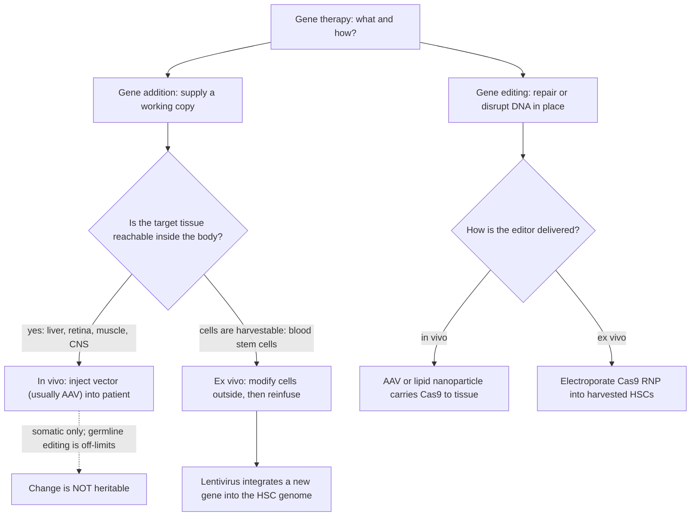
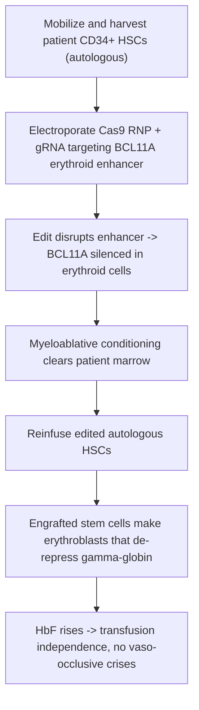

# Human Genetics — Gene Therapy

**Course:** BME333 / BIO333 Genetics (UNIST, 2026 Fall) · Lecture 26 · ~60 min
**Syllabus:** [← Course schedule](../../lectures/2026.BME333-BIO333-Syllabus.md) — Week 15 Wed, 2026-12-09
**Languages:** English · [한국어](../../ko/lectures/lec26_Human-Gene-Therapy.md)

## Learning Objectives
By the end of this lecture, students should be able to:
- Define gene therapy and distinguish its major modalities: gene addition vs. gene editing, in vivo vs. ex vivo delivery, and somatic vs. germline (and why germline editing is off-limits clinically).
- Compare the main delivery vehicles (AAV, lentivirus, electroporation of CRISPR-Cas9 into ex-vivo HSCs) and match each to disease context (tissue, cell type, transient vs. permanent).
- Trace two contrasting landmark trials — in vivo AAV gene transfer (hemophilia B, RPE65 retinal dystrophy) and ex-vivo CRISPR editing (sickle cell/β-thalassemia) — and explain why each design fits its target.
- Articulate the key risks and open problems: immune responses to vector/capsid, insertional mutagenesis, off-target editing, durability, and cost/access.
- Connect gene therapy to the genome-manipulation toolkit (CRISPR/Cas9, dCas9) covered earlier in the course.

## Lecture

### 1. What is gene therapy? (~8 min)

**Gene therapy** is the treatment of disease by altering the genetic material of a patient's cells — either by *supplying* a missing function or by *rewriting* the DNA sequence itself. It is the clinical payoff of everything the course has built: knowing the causal gene (Mendelian genetics, GWAS), and owning the tools to manipulate it (recombinant DNA, viral vectors, CRISPR/Cas9). After decades of false starts, it now works: as of the mid-2020s, several one-time gene therapies are FDA-approved and, in some cases, effectively curative (see PubMed: Anguela & High 2019).

Three orthogonal design choices define any gene therapy, and every real trial is a specific combination of them.

**Gene addition vs. gene editing.** In **gene addition**, you deliver a functional copy of a gene into the cell, which produces the missing protein — you never touch the broken endogenous copy. This is ideal for **loss-of-function, recessive** diseases where simply restoring the protein is enough (hemophilia, RPE65 blindness). In **gene editing**, you use a programmable nuclease — **CRISPR/Cas9** — to cut a precise genomic site and *repair or disrupt the sequence in place*. Editing is required when you must fix a **dominant-negative** allele, or when disrupting a specific regulatory element is the therapeutic goal (as in the fetal-hemoglobin strategy below).

**In vivo vs. ex vivo.** In **in vivo** therapy, the vector is administered directly into the patient (an IV infusion, or an injection under the retina) and does its work inside the body — the only option for tissues you cannot remove, like liver or retina. In **ex vivo** therapy, target cells (classically **CD34⁺ hematopoietic stem cells, HSCs**) are harvested, modified in the lab where conditions are controlled and editing can be quality-checked, and then reinfused. Ex vivo suits blood and immune disorders because HSCs are accessible and self-renewing.

**Somatic vs. germline.** All approved gene therapies are **somatic** — they modify the patient's body cells only, so the change is not heritable. **Germline** editing (altering eggs, sperm, or embryos) *would* be passed to descendants and is, by scientific and regulatory consensus, **off-limits clinically**: the risks are irreversible, propagate to people who never consented, and raise profound ethical concerns. This is a hard ethical line, not a technical one.

**Figure — Choosing a gene-therapy strategy (the decision tree).**


### 2. Delivery toolbox (~12 min)

Gene therapy lives or dies by **delivery** — getting the therapeutic cargo into the right cells, at the right level, for the right duration, without provoking a dangerous immune response. Three platforms dominate, each with a distinct physics and a distinct set of trade-offs (see PubMed: Anguela & High 2019).

**Adeno-associated virus (AAV)** is the workhorse of *in vivo* gene addition. AAV is a small, non-pathogenic virus whose genome, once delivered, remains largely **episomal** (it stays as a free circle in the nucleus rather than integrating into the chromosome). Episomal residence means a **low insertional-mutagenesis risk**, but also that the therapeutic DNA is **diluted out as cells divide** — so AAV works best in **long-lived, non-dividing cells** (hepatocytes, photoreceptors, neurons, muscle). Different natural and engineered **serotypes** (AAV2, AAV8, AAV9, …) have different **tissue tropisms**: AAV8 homes to liver, AAV2 is used for retina, AAV9 crosses into the CNS. Its two big limitations are a **small payload** (~4.7 kb, too small for large genes) and **capsid immunity** — many people carry pre-existing anti-AAV antibodies, and the immune response to the capsid is the central clinical challenge (Segment 3).

**Lentivirus** (an engineered, replication-deficient relative of HIV) is the workhorse of *ex vivo* gene addition. Unlike AAV, lentivirus **integrates** its cargo into the host genome, so the added gene is **permanently inherited by all daughter cells** — exactly what you want when modifying **dividing HSCs** whose progeny must carry the gene for life. It also accepts a **larger payload**. The cost of integration is a real, if now much-reduced, **insertional-mutagenesis** risk (Segment 5).

**Non-viral electroporation of Cas9 ribonucleoprotein (RNP)** is the workhorse of *ex vivo* gene editing. Here there is no virus at all: a brief electrical pulse opens transient pores in harvested cells, allowing a pre-assembled **Cas9 protein + guide RNA complex** to enter. Because the RNP is a *protein* that is degraded within days, editing is **transient and hit-and-run** — the nuclease cuts, the cell repairs, and no foreign DNA lingers. This **minimizes off-target editing and eliminates integration risk**, and is the approach behind the first approved CRISPR therapy.

**Figure — Matching the delivery vehicle to the job.**

| Property | **AAV** | **Lentivirus** | **Cas9 RNP (electroporation)** |
|---|---|---|---|
| Typical use | in vivo gene addition | ex vivo gene addition | ex vivo gene editing |
| Integrates into genome? | No (episomal) | **Yes** | No (transient protein) |
| Persists in dividing cells? | No — diluted out | **Yes** — heritable in daughters | Edit is permanent; editor is not |
| Payload capacity | small (~4.7 kb) | larger | n/a (delivers editor, not a gene) |
| Insertional mutagenesis risk | low | present (much reduced today) | none |
| Main liability | capsid/pre-existing immunity | integration site risk | off-target cuts; ex vivo only |
| Best-fit cells | liver, retina, neuron, muscle | blood/immune stem cells (HSC) | harvestable HSCs |

The logic is unforgiving and worth memorizing: **non-dividing tissue you cannot remove → in vivo AAV; dividing blood stem cells you can harvest → ex vivo lentivirus (add) or Cas9 RNP (edit).** The two landmark case studies that follow are the two ends of this table.

The editing chemistry itself descends from the CRISPR toolkit developed earlier in the course. The same **dCas9** ("dead" Cas9, catalytically inactive) that was repurposed as a programmable *recruitment* and interrogation platform (see [en](../../en/article/Kuhl2020_Genetics_dCas9+Ctf19+Recombination.md) · [ko](../../ko/article/Kuhl2020_Genetics_dCas9+Ctf19+Recombination.md)) is the molecular cousin of the active Cas9 nuclease used therapeutically — a reminder that a single protein scaffold underlies both basic-science tools and clinical cures.

### 3. In vivo AAV gene addition — landmark trials (~12 min)

**Hemophilia B — one infusion, lasting clotting.** Hemophilia B is an X-linked bleeding disorder caused by deficiency of **coagulation factor IX (FIX)**. It is an ideal first target for in vivo AAV: the liver naturally makes FIX, hepatocytes are long-lived (so episomal AAV persists), and even a modest rise in circulating FIX — from <1% to a few percent of normal — converts severe disease to mild. In the landmark trial, a **single intravenous infusion of AAV8 carrying the FIX gene** transduced hepatocytes and raised FIX to therapeutic levels, reducing spontaneous bleeding and factor-concentrate use (see PubMed: Nathwani et al. 2011). AAV8's liver tropism is what makes an IV dose land where it is needed.

**RPE65 retinal dystrophy — the first FDA-approved in vivo gene therapy.** Inherited retinal dystrophy caused by biallelic **RPE65** mutations blinds patients because the retinal pigment epithelium cannot regenerate visual pigment. The therapy **voretigene neparvovec (Luxturna)** delivers a functional *RPE65* gene in an **AAV2** vector by **subretinal injection** — placed directly against the target cells. Its phase-3 trial showed improved functional vision (measured by a mobility test in dim light), and it became the **first FDA-approved in vivo gene therapy** (see PubMed: Russell et al. 2017). The eye is an especially favorable in vivo target because it is small (a tiny vector dose suffices), accessible, and **immune-privileged**, limiting the capsid-immunity problem.

**Figure — Two in vivo AAV successes at a glance.**

| Trial | Disease | Vector / serotype | Route | Strategy | Landmark status |
|---|---|---|---|---|---|
| Nathwani 2011 | Hemophilia B (FIX deficiency) | AAV8-FIX | single IV infusion | gene addition to hepatocytes | first durable in vivo AAV clotting-factor restoration |
| Russell 2017 | RPE65 retinal dystrophy | AAV2-hRPE65v2 (voretigene) | subretinal injection | gene addition to retinal pigment epithelium | **first FDA-approved in vivo gene therapy (Luxturna)** |

**The capsid-immunity problem.** The recurring clinical wrinkle for AAV is the immune response to the **viral capsid**. In the hemophilia B trials, some patients developed a **transient transaminase elevation** — a sign that cytotoxic T cells were recognizing and attacking transduced hepatocytes displaying capsid fragments, threatening to erase the therapeutic effect. The standard mitigation is a **short course of corticosteroids** ("the transaminase/steroid issue") to damp the T-cell response and preserve transduced cells (see PubMed: Nathwani et al. 2011). Pre-existing neutralizing antibodies against common AAV serotypes can also exclude patients outright — a major reason capsid engineering is an active field.

### 4. Ex vivo gene editing — CRISPR for hemoglobinopathies (~14 min)

The other end of the table — ex vivo editing of blood stem cells — produced the first approved **CRISPR** therapy, and the disease is one we have followed since Lecture 03: **sickle cell disease**.

**The disease.** Sickle cell disease (SCD) is a textbook **Mendelian disorder**: a single point mutation in the β-globin gene, **HBB (E6V, Glu→Val at codon 6)**, produces **sickle hemoglobin (HbS)** (see [en](../../en/review/Makani2022_NatRevGenet_MendelianDisorder.md) · [ko](../../ko/review/Makani2022_NatRevGenet_MendelianDisorder.md)). When deoxygenated, HbS polymerizes, deforming red cells into rigid sickles that occlude vessels (**vaso-occlusive crises**) and hemolyze — causing lifelong pain, organ damage, and early death. It is recessive in **SS homozygotes**, while heterozygotes are protected against severe malaria (a beautiful illustration that dominance depends on the trait being scored). SCD affects ~5 million people, overwhelmingly in Africa — a population still underrepresented in genomic data (see [en](../../en/review/Makani2022_NatRevGenet_MendelianDisorder.md) · [ko](../../ko/review/Makani2022_NatRevGenet_MendelianDisorder.md)).

**The therapeutic trick — reawaken fetal hemoglobin.** Rather than repair the *HBB* mutation directly, the approved therapy exploits a developmental switch. Before birth we make **fetal hemoglobin (HbF, α₂γ₂)**; after birth a repressor, **BCL11A**, silences the γ-globin genes and switches us to adult hemoglobin. **BCL11A** is precisely the *modifier gene* long known to raise HbF and ameliorate SCD (see [en](../../en/review/Makani2022_NatRevGenet_MendelianDisorder.md) · [ko](../../ko/review/Makani2022_NatRevGenet_MendelianDisorder.md)). The strategy: use CRISPR to disrupt the **erythroid-specific enhancer** of *BCL11A* in the patient's own HSCs. This turns BCL11A **off only in the red-cell lineage**, de-represses γ-globin, and floods red cells with HbF — which does not sickle and dilutes the HbS. Editing the enhancer (not the coding gene) confines the effect to erythroid cells, sparing BCL11A's other essential roles.

**Figure — Sickle cell disease and the fetal-hemoglobin fix.**
```
NORMAL   HBB (Glu6) --> beta-globin --> HbA (alpha2 beta2), stays soluble
SICKLE   HBB E6V (Val6) --> HbS --> polymerizes when deoxygenated
         --> rigid sickled red cell --> vaso-occlusion, hemolysis, pain crises

THERAPY  BCL11A normally silences gamma-globin (HBG) after birth.
         CRISPR cut of the BCL11A ERYTHROID ENHANCER
            --> BCL11A OFF only in red-cell lineage
            --> gamma-globin ON --> fetal hemoglobin HbF (alpha2 gamma2) returns
            --> HbF does not sickle, dilutes HbS --> disease relieved
```

**Figure — The ex vivo CRISPR workflow (exa-cel / Casgevy).**


**The result.** In the landmark trial, editing the BCL11A erythroid enhancer in autologous CD34⁺ HSCs gave patients **transfusion independence** (β-thalassemia) and **freedom from vaso-occlusive crises** (sickle cell disease) (see PubMed: Frangoul et al. 2021). This therapy — **exagamglogene autotemcel (exa-cel / Casgevy)** — became the **first approved CRISPR-based medicine**, closing the arc from Mendel's peas through the molecular definition of SCD to a genome-edited cure (see [en](../../en/review/Makani2022_NatRevGenet_MendelianDisorder.md) · [ko](../../ko/review/Makani2022_NatRevGenet_MendelianDisorder.md)). Note why the design fits: HSCs are harvestable and self-renewing (so ex vivo is possible and the fix is lifelong), and RNP electroporation leaves no integrating vector behind.

### 5. Risks, durability & access (~8 min)

Gene therapy's power comes with a distinctive risk profile, and honesty about it is part of the field's maturation (see PubMed: Anguela & High 2019).

- **Insertional mutagenesis.** An integrating vector can land inside or near a proto-oncogene and switch it on. This is not hypothetical: early **SCID-X1** ("bubble boy" immunodeficiency) trials cured the disease but caused **leukemias** when the retroviral vector activated the *LMO2* oncogene. Modern **self-inactivating lentiviral** vectors, and non-integrating strategies (AAV, RNP editing), were developed largely in response.
- **Off-target editing.** CRISPR can cut sequences resembling its target elsewhere in the genome. Ex vivo editing helps because edited cells can be **sequenced and quality-controlled before reinfusion** — a safety advantage of the ex vivo route.
- **Immune responses.** As in hemophilia B, **anti-capsid immunity** (pre-existing antibodies, or T cells attacking transduced cells) can neutralize an in vivo dose or destroy the cells that took it up — the transaminase/steroid problem.
- **Durability.** For **episomal AAV**, expression can **wane as cells turn over** or as promoters are silenced; and because anti-capsid immunity blocks re-dosing with the same serotype, a fading in vivo therapy is hard to top up. Integrating and ex vivo-stem-cell approaches are inherently more durable.
- **Cost and access.** One-time cures carry extraordinary price tags (often >$1–2 million per patient), raising acute equity questions — sharpest for sickle cell disease, whose burden falls overwhelmingly on low-resource settings in Africa (see [en](../../en/review/Makani2022_NatRevGenet_MendelianDisorder.md) · [ko](../../ko/review/Makani2022_NatRevGenet_MendelianDisorder.md)).

**Figure — Risk maps onto the delivery choice.**

| Risk | Which platform | Mitigation |
|---|---|---|
| Insertional mutagenesis (oncogene activation) | integrating lentivirus (historically retrovirus, SCID-X1) | self-inactivating vectors; non-integrating AAV/RNP |
| Off-target editing | CRISPR editing | ex vivo QC/sequencing before reinfusion; high-fidelity Cas9 |
| Capsid immunity / transaminitis | in vivo AAV | corticosteroid course; capsid engineering; screen for antibodies |
| Loss of expression over time | episomal AAV in dividing cells | target non-dividing cells; ex vivo stem-cell approaches |
| Cost / inequity | all one-time cures | manufacturing and access models, esp. for SCD in Africa |

### 6. The field, and where it's going (~6 min)

Why does gene therapy finally work, after decades of disappointment? The synthesis review by **Anguela & High (2019)** attributes it to the convergence of better **vectors** (safer, tissue-targeted AAV and self-inactivating lentivirus), the **CRISPR revolution** in precise editing, and hard-won clinical know-how (immune management, conditioning regimens) — turning a string of failures into approved cures (see PubMed: Anguela & High 2019).

The near-term frontier is **more precise, in vivo editing**. **Base editing** and **prime editing** — CRISPR derivatives that use a catalytically impaired Cas9 fused to an enzyme to rewrite single bases (or short sequences) *without* a double-strand break — promise to reduce off-target and unintended-rearrangement risks. The larger prize is moving editing **in vivo** (e.g. lipid-nanoparticle-delivered Cas9 to the liver), which would eliminate the costly, toxic myeloablative conditioning that ex vivo HSC therapies require and dramatically broaden access. Alongside this, capsid engineering aims to defeat pre-existing immunity and expand the range of treatable tissues. The genetic principles that opened the course — Mendel's particulate inheritance, the molecular definition of a mutation, the CRISPR toolkit — now close it as clinical reality (see [en](../../en/review/Makani2022_NatRevGenet_MendelianDisorder.md) · [ko](../../ko/review/Makani2022_NatRevGenet_MendelianDisorder.md), [en](../../en/article/Kuhl2020_Genetics_dCas9+Ctf19+Recombination.md) · [ko](../../ko/article/Kuhl2020_Genetics_dCas9+Ctf19+Recombination.md)).

## Key Takeaways
- **Gene therapy** treats disease by altering a patient's DNA, along three axes: **gene addition vs. editing**, **in vivo vs. ex vivo**, and **somatic vs. germline** — with germline editing off-limits clinically because the change is heritable and irreversible.
- **Delivery dictates design:** **AAV** = non-integrating, tissue-tropic, small-payload, immunogenic → *in vivo* gene addition to non-dividing tissue; **lentivirus** = integrating, durable → *ex vivo* gene addition to dividing HSCs; **Cas9 RNP electroporation** = transient, non-integrating → *ex vivo* editing.
- **In vivo AAV landmarks:** a single IV **AAV8-FIX** infusion restores clotting in **hemophilia B** (Nathwani 2011); subretinal **AAV2 voretigene (Luxturna)** for **RPE65** dystrophy is the first FDA-approved in vivo gene therapy (Russell 2017); watch **capsid immunity / transaminitis**, managed with steroids.
- **Ex vivo CRISPR landmark:** disrupting the **BCL11A erythroid enhancer** in autologous CD34⁺ HSCs reactivates **fetal hemoglobin (HbF)**, curing sickle cell disease and β-thalassemia — **exa-cel/Casgevy**, the first approved CRISPR therapy (Frangoul 2021).
- **Sickle cell disease** — a single *HBB* E6V mutation — is the through-line from Mendel to a genome-edited cure, and its African disease burden makes **cost/access** a central equity issue.
- **Key risks:** insertional mutagenesis (SCID-X1 leukemias), off-target editing, immune clearance, waning durability, and extreme cost; the field advances toward **base/prime editing and in vivo editing** (Anguela & High 2019).

## Textbook Reading
- **Genetics: From Genes to Genomes (8e)** — Ch. 21 Manipulating the Genomes of Eukaryotes. → [textbook ref](../../lectures/ref.Genetics-FromGenesToGenomes.md)

## Notes in this vault
Reviews & articles to introduce in class (each has a bilingual en/ko pair):
- `Makani2022_NatRevGenet_MendelianDisorder` — sickle cell disease from Mendelian disorder toward cure; sets up the CRISPR hemoglobinopathy case. · [en](../../en/review/Makani2022_NatRevGenet_MendelianDisorder.md) · [ko](../../ko/review/Makani2022_NatRevGenet_MendelianDisorder.md)
- `Kuhl2020_Genetics_dCas9+Ctf19+Recombination` — dCas9 as a programmable targeting tool; connects the editing chemistry to therapeutic editing. · [en](../../en/article/Kuhl2020_Genetics_dCas9+Ctf19+Recombination.md) · [ko](../../ko/article/Kuhl2020_Genetics_dCas9+Ctf19+Recombination.md)

## Additional reading (PubMed)
*The following are drawn from PubMed; DOI links included per attribution requirements.*
- Nathwani AC, et al. Adenovirus-associated virus vector-mediated gene transfer in hemophilia B. N Engl J Med 2011. [DOI](https://doi.org/10.1056/NEJMoa1108046) · PMID 22149959 — landmark in vivo AAV gene-addition trial (single IV dose restores factor IX).
- Russell S, et al. Efficacy and safety of voretigene neparvovec (AAV2-hRPE65v2) in patients with RPE65-mediated inherited retinal dystrophy: a randomised, controlled, open-label, phase 3 trial. Lancet 2017. [DOI](https://doi.org/10.1016/S0140-6736(17)31868-8) · PMID 28712537 — pivotal trial behind the first FDA-approved in vivo gene therapy (Luxturna).
- Frangoul H, et al. CRISPR-Cas9 gene editing for sickle cell disease and β-thalassemia. N Engl J Med 2021. [DOI](https://doi.org/10.1056/NEJMoa2031054) · PMID 33283989 — landmark ex-vivo CRISPR editing (BCL11A enhancer) underlying exa-cel/Casgevy, the first approved CRISPR therapy.
- Anguela XM, High KA. Entering the modern era of gene therapy. Annu Rev Med 2019. [DOI](https://doi.org/10.1146/annurev-med-012017-043332) · PMID 30477394 — authoritative field review of vectors, successes, and challenges.

## Discussion Questions
1. A patient has hemophilia B (a liver-made clotting factor is missing) and another has sickle cell disease (a point mutation in a blood-cell gene). Using the gene-addition/editing and in vivo/ex vivo axes, explain why one is treated with an in vivo AAV infusion and the other with ex vivo CRISPR editing of harvested stem cells. What property of each target tissue drives the choice?
2. AAV is non-integrating and lentivirus integrates. For each of (a) a photoreceptor in the retina and (b) a self-renewing blood stem cell, argue which property is an advantage and which is a liability, and connect your answer to durability and insertional-mutagenesis risk.
3. The sickle cell therapy does *not* repair the *HBB* mutation; it disrupts the erythroid enhancer of *BCL11A* to reawaken fetal hemoglobin. Explain the developmental logic of this "detour," and why editing the enhancer rather than the coding gene matters for confining the effect to red cells.
4. Early SCID-X1 gene therapy cured the immune disease but caused leukemia. What went wrong mechanistically, and how do modern vector designs (self-inactivating lentivirus) and non-integrating strategies (AAV, Cas9 RNP) reduce that risk? What residual risks remain for CRISPR editing?
5. Sickle cell disease affects ~5 million people, mostly in Africa, yet the approved cure costs on the order of $1–2 million per patient and requires myeloablative conditioning. Discuss how in vivo editing (base/prime editing delivered by nanoparticles) might change the access equation, and what non-technical barriers would remain.
