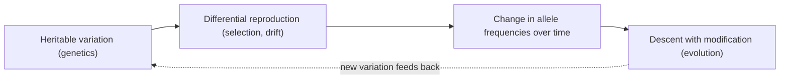
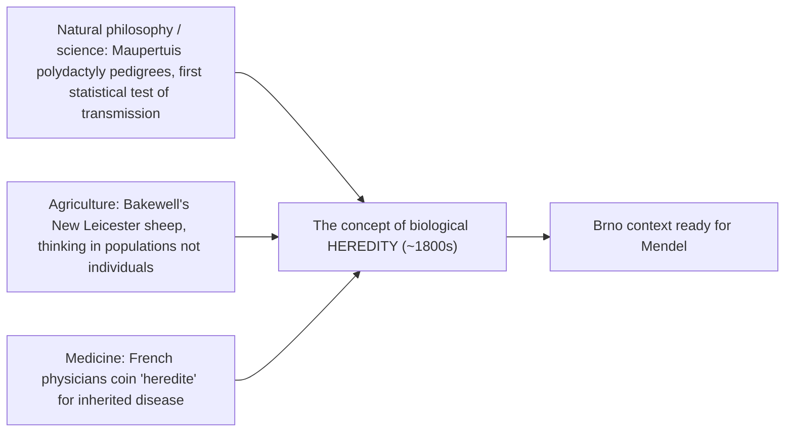
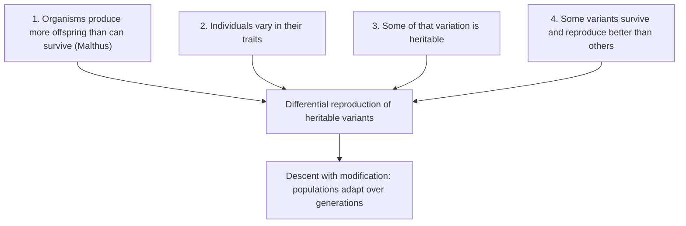
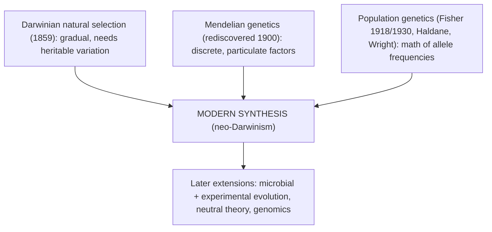

# 진화 사상

**강의:** BME333 / BIO333 유전학 (UNIST, 2026 가을) · 1강 · ~60분
**강의계획서:** [← 강의계획서](../../lectures/2026.BME333-BIO333-Syllabus.md) — 1주차 월, 2026-08-31
**언어:** [English](../../en/lectures/lec01_Evolutionary-Ideas.md) · 한국어

## 학습 목표
이 강의를 마치면 학생들은 다음을 할 수 있어야 한다:
- 다윈 이전의 유전 관념(혼합, 범생설, 용불용)이 훗날 유전학이 답하게 될 질문들을 어떻게 틀 지웠는지 설명한다.
- 다윈 이론의 핵심 논리, 즉 자연선택에 의한 변화를 동반한 유래(descent with modification)와 그것이 유전 가능한 변이에 의존한다는 점을 진술한다.
- 다윈이 왜 작동하는 유전 이론을 갖지 못했는지, 그리고 이 "빠진 메커니즘"이 그의 논증을 어떻게 제한했는지 기술한다.
- 적응(adaptation)과 적합도(fitness)를 현대적이고 검증 가능한 의미로 정의하고, 자연선택과 포괄 적합도(inclusive fitness)를 구별한다.
- 현대적 종합(Modern Synthesis)을 다윈적 선택을 멘델 유전학 및 집단유전학과 화해시킨 것으로 자리매김한다.

## 강의

### 1. 강의 소개와 유전학–진화의 연결 (~8분)

유전학에 오신 것을 환영한다. 이 과목은 **유전(heredity)** — 생물학적 정보가 어떻게 저장되고, 복제되고, 변형되며, 한 세대에서 다음 세대로 전달되는가 — 그리고 그 전달이 집단, 개체, 분자에 미치는 결과를 다룬다. 우리는 세 가지 척도를 넘나들 것이며, 과목 자체가 그것들을 따라 구성되어 있다. **집단유전학(population genetics)**(대립유전자 빈도가 집단 내에서 시간에 따라 어떻게 변하는가), **정방향 유전학(forward genetics)**(표현형에서 출발해 책임 유전자를 찾는 것), **역방향 유전학(reverse genetics)**(유전자에서 출발해 그 표현형을 찾는 것)이다. 이들은 별개의 주제가 아니라 동일한 기저 과정을 바라보는 세 가지 관점이다.

이 셋을 하나로 묶는 개념적 뼈대는 진화이다. 유전학자 테오도시우스 도브잔스키(Theodosius Dobzhansky)의 유명한 문장 — **"진화의 관점 없이는 생물학의 그 무엇도 의미를 갖지 못한다(Nothing in biology makes sense except in the light of evolution)"** — 은 이 과목 전체를 조직하는 원리이다. 유전학과 진화는 하나의 이론의 두 반쪽이다. 진화는 *유전 가능한 변이가 시간에 따라 변하는 것*이므로, 유전 이론 없이는 진술은커녕 검증조차 할 수 없다. 반대로 유전자가 지금과 같이 행동하는 이유 — 왜 돌연변이하고, 재조합하며, 선택되는가 — 는 그것들이 수십억 년에 걸친 진화의 산물이기 때문이다. 이 첫 강의는 이 두 관념이 어떻게 함께 자라났고, 왜 반세기 동안 갈라져 있었으며, 어떻게 마침내 재결합되었는지를 추적한다.

**그림 — 유전학과 진화는 하나의 이론을 두 측면에서 본 것이다.**


우리가 출발점으로 삼는 역사적 수수께끼는 이것이다. 찰스 다윈은 종이 *어떻게* 변하는지에 대한 설득력 있는 이론을 1859년에 발표했으나, 그것을 구동할 **올바른 유전 이론이 없었다**. 그레고어 멘델은 1860년대에 유전의 규칙을 발견했으나, 그의 연구는 35년 동안 무시되었다. 반세기 동안 생물학의 가장 위대한 두 관념은 서로 연결되지 못한 채 놓여 있었다. 그 *이유* — 그리고 그것들이 마침내 어떻게 연결되었는지 — 를 이해하는 것이 이 강의의 이야기이며, 나머지 과목으로 들어가는 문이다.

### 2. 유전학 이전의 유전 (~12분)

다윈의 문제를 제대로 이해하려면, 먼저 유전이라는 *개념* 자체가 얼마나 최근에 생겨났는지를 깨달아야 한다. Cobb(2006)이 기록하듯, **불과 200년 전만 해도 "유전(heredity)"이라는 단어에는 생물학적 의미가 전혀 없었다**([en](../../en/review/Cobb2006_NatRevGenet_HeredityBeforeGenetics.md) · [ko](../../ko/review/Cobb2006_NatRevGenet_HeredityBeforeGenetics.md) 참조). 부모–자식 닮음은 우리가 지금 생식, 유전, 발생으로 구분하는 것을 뒤섞은, **"생성(generation)"**이라 불리는 방대하고 혼란스러운 범주에 뭉뚱그려져 있었다. 원 현상 자체가 모순되어 보였다 — 자식은 때로 한쪽 부모를, 때로는 어느 쪽도 아닌, 때로는 조부모를 닮았다 — 그래서 일관된 이론이 나오지 못했다. 고대 그리스인들은 두 가지 틀을 물려주었다. **히포크라테스의 두 정액 혼합 모델**(양쪽 부모가 액체를 기여하고 그것이 섞인다)과 **아리스토텔레스의 형상/질료 모델**(수컷은 형상을, 암컷은 질료를 제공한다)이다. 어느 쪽도 그 양상을 설명할 수 없었다.

Cobb의 핵심 통찰은, 유전의 현대적 개념이 단 하나의 실험이 아니라 **수렴하는 세 갈래**에 의해 벼려졌으며, 각 갈래가 생물학에 없던 데이터나 언어를 공급했다는 것이다.

**그림 — 세 갈래가 수렴하여 "유전"의 개념을 만들어낸다 (Cobb 2006).**


- **자연철학(natural philosophy)**은 정밀한 가계도를 기여했다. 18세기에 **Maupertuis**와 Réaumur는 독일과 몰타 가문에서 **다지증(polydactyly)**(여분의 손·발가락)을 3~4세대에 걸쳐 추적했고, 그 형질이 전성설(preformationism)로는 예측할 수 없는 양상으로 재출현함을 발견했다. Maupertuis는 다지증이 세 세대에 걸쳐 우연히 재발할 확률까지 계산했는데 — 약 **8 × 10¹² 대 1** — 이는 논쟁의 여지는 있으나 유전 전달에 대한 최초의 통계적 검정이라 할 만하다. 놀랍게도 이는 후대 사상가들에게 아무런 영향을 주지 않았으며, 멘델이 이를 알았다는 증거도 없다.
- **농업(agriculture)**은 결정적인 실용적 모델을 공급했다. 영국의 양 육종가 **로버트 베이크웰(Robert Bakewell)**은 18세기 중반에 명시적 기준에 따라 동물을 체계적으로 선발하여 뉴 레스터(New Leicester) 품종을 만들었다. 그의 개념적 도약은 **개체가 아니라 집단(populations rather than individuals)**의 관점에서 사고한 것이었는데 — 이는 훗날 집단유전학이 형식화하게 될 바로 그 전환이다. 베이크웰의 방법은 유럽 전역으로 퍼졌고, 모라비아에서는 **브르노(Brno)가 양 육종과 직물 제조의 중심지**가 되었으며, 1819년경에는 지역 사상가들이 이미 "유전 법칙"의 윤곽을 그리고 있었다. 이것이 멘델이 일했던 바로 그 지적 토양이다.
- **의학(medicine)**은 그 *단어*를 공급했다. 유전 질환을 연구하던 프랑스 의사들이 명사 **"hérédité"**를 만들어냈고, 1830년대에는 프랑스 의학 문헌에 널리 퍼졌으며, 영어 "heredity"는 1863년경 스펜서의 글에 등장했는데 — 바로 다윈이 자신의 노트에서 그것을 쓰고 있던 그 순간이다.

이러한 배경 위에서, 다윈이 이용할 수 있었던 유전 이론들을 살펴보자. 이 모두는 오늘날 우리가 틀렸거나 불완전하다고 아는 것들이다. 기본 가정은 **혼합 유전(blending inheritance)**이었다. 자식의 형질은 부모 형질의 평균이라는 것이다 — 두 물감을 섞듯이. 또한 **라마르크주의(Lamarckism)**도 있었는데, 개체의 생애 동안 **용불용(use and disuse)**을 통해 획득된 형질이 유전된다는 것이었다(기린이 목을 뻗어 늘어난 목). 다윈 자신도 *어떤* 메커니즘이 필요했기에 **범생설(pangenesis)**을 제안했다. 몸의 모든 부분이 **제뮬(gemmules)**이라 불리는 작은 입자들을 방출하고, 이것들이 생식 기관으로 이동하여 — 새로 획득된 형질을 포함한 — 정보를 다음 세대로 나른다는 것이다. 범생설은 본질적으로 빅토리아 시대의 입자적 언어로 옷을 입힌 라마르크식 메커니즘이다.

| 이론 | 핵심 주장 | 치명적 문제 |
|---|---|---|
| **혼합 유전(Blending inheritance)** | 자식 = 부모의 평균 | 세대마다 변이를 절반으로 줄임; 선택에 남길 것이 없음 |
| **라마르크주의(용불용)** | 생애 중 획득한 형질이 유전됨 | 체세포를 생식세포로 되쓸 메커니즘이 없음; 관찰되지 않음 |
| **범생설(다윈)** | 모든 신체 부위의 "제뮬"이 생식세포에 모임 | 제뮬은 발견된 적 없음; 불임 계급의 적응을 설명 못 함 |
| **입자적 유전(멘델/현대)** | 이산적 인자가 온전히, 변하지 않고 전달됨 | *(옳음 — 위의 모든 문제를 해결함)* |

이 단락에서 반드시 가져가야 할 가장 중요한 관념은 왜 **혼합 유전이 자연선택에 치명적인가** 하는 것이다. 각 세대의 변이가 평균화로 절반씩 줄어든다면, 선택이 필요로 하는 원재료 — 유전 가능한 *차이* — 는 몇 세대 안에 사라진다. 이는 말꼬리 잡기가 아니라, 다윈 이론에 대한 수학적 사형 선고이며, 다음에 만날 한 비판가가 강력하게 지적한 것이다.

### 3. 다윈의 논증 (~12분)

*종의 기원(On the Origin of Species)*(1859)에서 제시된 다윈의 **자연선택(natural selection)** 이론은 본질적으로 짧고 엄밀한 논리적 논증 — 하나의 삼단논법이다. 그것은 소수의 전제만을 요구하며, 그 전제들은 모두 관찰 가능하고, 결론은 필연적으로 따라나온다.

**그림 — 자연선택의 논리 (다윈의 삼단논법).**


전제 1 — 집단은 자원을 초과하여 늘어나는 경향이 있다 — 을 다윈은 **토머스 맬서스(Thomas Malthus)**의 *인구론(Essay on the Principle of Population)*에서 직접 가져왔다. Orr(2009)가 강조하듯, 다윈 *과* 월리스는 *둘 다* 독립적으로 맬서스를 이 착상의 방아쇠로 인정했다. 자연선택 개념은 실로 어떤 의미에서 *경제학이* 생물학에 제안한 것이었다([en](../../en/review/Orr2009_Genetics_Darwin-SocialImplications.md) · [ko](../../ko/review/Orr2009_Genetics_Darwin-SocialImplications.md) 참조). 전제 2~4를 다윈은 **인위선택(artificial selection)**에서 끌어온 방대한 증거 기반으로 뒷받침했다. 비둘기 애호가, 개 육종가, 그리고 — 결정적으로 — 이름 붙고 안정된 품종으로 선택이 생물을 극적으로 재형성할 수 있음을 입증한 원예·농업 육종가들의 성취이다([en](../../en/review/Olby2000_NatRevGenet_Horticulture.md) · [ko](../../ko/review/Olby2000_NatRevGenet_Horticulture.md) 참조). 육종가가 수십 년 안에 그것을 해낼 수 있다면, 자연은 지질학적 시간에 걸쳐 훨씬 더 많은 일을 할 수 있다.

그러나 전제 3이 조용히 가정하는 것에 주목하라. **변이는 유전 가능하며 단순히 평균으로 사라지지 않는다**는 것이다. 이것이 다윈 논증의 단층선이다. 그는 *변화*의 메커니즘은 가졌으나 올바른 *유전*의 메커니즘은 없었고, 이 둘은 분리될 수 없다. 공학자 **플리밍 젠킨(Fleeming Jenkin)**이 가장 날카로운 일격을 가했다. 혼합 유전 하에서는 유리한 새 변이가 평범한 개체와의 교배 세대마다 절반으로 희석되므로, **유전적 분산이 세대마다 절반씩 감소하여** 영구적인 적응적 변화가 불가능해진다는 것이다([en](../../en/review/Charlesworth2009_Genetics_Perspective-DarwinGenetics.md) · [ko](../../ko/review/Charlesworth2009_Genetics_Perspective-DarwinGenetics.md) 참조). 다윈의 답 — 범생설 — 은 그 자체가 불충분했고, 그도 그것을 알았다. 그는 사회성 곤충의 **불임 계급(sterile castes)**의 적응 형질을 설명할 수 없음을 솔직히 인정했는데, 불임 일꾼은 자신이 획득한 어떤 형질도 물려줄 자손을 남기지 않기 때문이다.

Charlesworth 부부(2009)가 기록한 깊은 아이러니는, 다윈이 실제로 *답을 자신의 손안에 쥐고 있었으나 그것을 읽지 못했다*는 것이다. **앵초 이형 화주성(Primula distyly)**(앵초의 두 꽃 형태)에 대한 교배 실험에서 그는 깔끔한 **1:1 및 3:1 비율** — 멘델식 분리의 바로 그 징표 — 을 얻었으나, 입자적 유전의 어떤 틀도 없었기에 그것을 해석할 수 없었다. 그는 또한 자신의 *사육·재배 동식물의 변이(Variation of Animals and Plants Under Domestication)*보다 불과 2년 앞서 발표된 멘델의 1866년 논문을 알지 못했다. 그의 이론을 구했을 메커니즘은 인쇄되어, 그 자신의 결과 안에 존재했으나 — 그 연결은 또 반세기 동안 이루어지지 않았다.

### 4. 적응이란 무엇인가? 적합도와 선택 (~12분)

다윈의 이론은 **적응(adaptations)** — 생존과 번식을 향상시키도록 자연선택에 의해 빚어진 형질 — 을 만들어낸다. 그러나 이 관념으로 과학을 하려면, 단순한 직관이 아니라 조작적이고 검증 가능한 정의가 필요하다. 두 용어를 못 박아야 한다.

**적합도(fitness)**는 일상적 의미의 "힘"이나 "건강함"이 아니다. 그것은 *측정 가능한 상대적 양*으로, 같은 집단 내 다른 유전자형에 대비한, 어떤 유전자형이 다음 세대에 기대되는 번식 기여도이다. **적응(adaptation)**은 그 현재 기능을 위해 선택에 의해 선호되었기 *때문에* 존재하는 형질이며 — 단지 부수적 부산물이거나 우연히 존속하는 형질과 구별되어야 한다. 이 구별이 중요한 이유는, 유용해 보이는 모든 형질이 적응은 아니며, 적응을 입증하려면 현재의 유용성만이 아니라 선택의 역사에 대한 증거가 필요하기 때문이다.

다윈은 진화가 너무 느려서 일어나는 것을 지켜볼 수 없다고 믿었다. Richard Lenski(2017)는 이 믿음이 틀렸으며, **자연선택에 의한 적응은 실시간으로 관찰되고, 정량화되고, 해부될 수 있음**을 보여준다([en](../../en/review/Lenski2017_PLoSgenet_WhatIsAdaptation.md) · [ko](../../ko/review/Lenski2017_PLoSgenet_WhatIsAdaptation.md) 참조). 기초가 되는 결과는 **루리아–델브뤼크 변동 검정(Luria–Delbrück fluctuation test, 1943)**으로, 세균의 돌연변이가 선택에 반응하여서가 아니라, 선택 이전에 그리고 그와 무관하게 **자발적으로(spontaneously)** 생겨남을 확립했다. 이는 다윈주의가 우리에게 반드시 구별하라고 요구하는 두 가지 — 변이의 **기원(origin)**(무작위 돌연변이)과 그 **운명(fate)**(비무작위적 선택) — 를 깔끔하게 분리한다.

Lenski 자신의 **장기 진화 실험(Long-Term Evolution Experiment, LTEE)**은 **1988년**에 시작되어 이 과정을 구체화한다. 12개의 *E. coli* 집단(표지된 두 조상 균주 각각에서 6개씩 창시)이 최소 포도당 배지에서 순수 무성적으로 계대되며, 매일 1% 계대 이식으로 하루 약 **6.7세대**를 산출한다. 실험은 이제 **66,000세대**를 넘어섰다. 기억해 둘 만한 세 가지 결과가 있다.

1. **적합도는 상승하되 감속한다** — 전형적인 집단은 **50,000세대에 걸쳐 적합도를 약 70% 높였으며**, 초기에는 큰 효과의 돌연변이가, 후기에는 수확 체감이 나타났다(점근선이 아니라 상한이 없는 멱법칙에 가장 잘 들어맞았다).
2. **진화는 반복적이면서도 발산한다** — 게놈 서열 분석 결과 **유익한(비동의) 돌연변이의 50% 이상이 단 ~2%의 유전자에 떨어졌는데**, 이는 자연선택이 동일한 기능을 거듭 표적으로 삼는다는 강력한 통계적 징표이다.
3. **역사적 우발성은 실재한다** — 약 **31,000세대**경, 한 집단이 **시트르산(citrate)을 호기적으로 이용하는 능력**을 진화시켰는데, 이는 특정한 앞선 "잠재력 부여(potentiating)" 돌연변이 위에 특정한 재배열을 요구하는 새로운 형질이다. 테이프를 다른 출발점에서 되감으면 다른 결과가 나온다.

**그림 — LTEE에서 상승하며 감속하는 적합도 궤적으로서의 적응.**
```
relative
fitness
  ~1.7 |                             . . . . . . .  (still rising, no ceiling)
       |                 . . . . . .
       |          . . .
       |     . .        <- big-effect mutations early, diminishing returns later
  1.0  | .
       +----------------------------------------------- generations
       0        10k       31k        50k       66k
                          ^
                   citrate use evolves (historical contingency)
```

끝으로, 선택이 언제나 개체에 작용하는 것은 아니다. 다윈은 **이타성(altruism)** — 자신의 번식을 희생하는 불임 일벌 — 때문에 괴로워하며, 이를 "처음에는 나에게 극복 불가능하고 실제로 이론 전체에 치명적으로 보였던 하나의 특수한 난점"이라 불렀다. 그 자신의 힌트는 선택이 "개체뿐 아니라 가족에도 적용될 수 있다"는 것이었다. 꼬박 한 세기 뒤 **윌리엄 해밀턴(William Hamilton)**(1963–1964)이 이를 **포괄 적합도(inclusive fitness)**로 형식화했다([en](../../en/review/Dugatkin2007_Genetics_InclusiveFitness-DarwinHamilton.md) · [ko](../../ko/review/Dugatkin2007_Genetics_InclusiveFitness-DarwinHamilton.md) 참조). 핵심 통찰은 **혈연계수(coefficient of relatedness, *r*)** — 시월 라이트(Sewall Wright)가 고안한 집단유전학 양으로, 두 혈연 사이에서 어떤 유전자가 공유될 확률 — 를 이용한다. 해밀턴의 법칙(Hamilton's Rule)은, 이타성 유전자는 혈연에게 주는 이익을 혈연도로 할인한 값이 이타주의자에게 미치는 비용을 초과할 때마다 퍼진다고 말한다.

**그림 — 해밀턴의 법칙: 이타성이 언제 득이 되는가.**
```
   r · b  >  c
   |    |     |
   |    |     +-- c = fitness COST to the altruist
   |    +-------- b = fitness BENEFIT to the recipient
   +------------- r = relatedness (prob. the gene is shared)

  Haldane's quip: "I would lay down my life for two brothers (r=1/2 each)
  or eight cousins (r=1/8 each)."  -> 2·(1/2) = 1 ;  8·(1/8) = 1
```

포괄 적합도는 자연선택의 경쟁 상대가 아니라 그 *확장(extension)*이다. 개체의 복사본이 아니라 유전자의 복사본을 셈하는 순간, 겉보기에 자기희생적인 행동은 유전자 수준에서의 평범한 다윈적 선택이 된다.

### 5. 현대적 종합을 향하여 (~10분)

다윈과 멘델의 재결합을 **현대적 종합(Modern Synthesis)**(또는 신다윈주의, neo-Darwinism)이라 부른다. 멘델의 법칙은 **1900년**에 재발견되었으나, 이것이 곧바로 균열을 치유하지는 못했다 — 처음에는 오히려 *넓혔다*. Olby(2000)가 보여주듯, 초기 멘델주의자들(Bateson, de Vries)은 **불연속 변이(discontinuous variation)**와 큰 돌연변이에 의한 종의 기원을 옹호했는데, 이는 다윈이 요구한 점진적이고 소단계적인 선택을 *부정*하는 듯 보였고, 이 때문에 그들은 다윈주의 생물측정학자들(biometricians)과 정면으로 대립하게 되었다([en](../../en/review/Olby2000_NatRevGenet_Horticulture.md) · [ko](../../ko/review/Olby2000_NatRevGenet_Horticulture.md) 참조). 유전학은 하나의 학문 분야로서 학계 생물학에 뿌리내리지 못할 뻔했다. 영국에서 그것이 살아남은 것은 주로 원예 공동체 덕분이었는데 — 그들의 꽃과 과일 품종이 눈에 띄게 멘델식 비율을 따랐다 — 그리고 Bateson이 **"유전학(genetics)"**이라는 단어를 만든 것은 1906년의 한 원예 학회에서였다.

화해는 수학에서 왔다. **R. A. 피셔(Fisher, 1918)**는 *다수*의 작은 효과 유전자에 작용하는 멘델식 입자적 유전이 정확히 생물측정학자들이 측정한 연속적·양적 변이를 만들어냄을 증명했다 — 두 진영은 같은 것을 기술하고 있었던 것이다. 이어서 피셔의 *자연선택의 유전학적 이론(Genetical Theory of Natural Selection)*(1930)은 **혼합 유전의 모든 난점이 입자적 유전 하에서 사라짐**을 보였다. 진화적 힘이 없을 때 변이는 세대에 걸쳐 *보존(conserved)*되는데, Charlesworth 부부는 이를 **갈릴레오의 관성 법칙에 대한 유전학적 유비(a genetic analog of Galileo's law of inertia)**라 부른다([en](../../en/review/Charlesworth2009_Genetics_Perspective-DarwinGenetics.md) · [ko](../../ko/review/Charlesworth2009_Genetics_Perspective-DarwinGenetics.md) 참조). 입자적 유전자는 혼합되지 않으므로, 선택은 마침내 작용할 영구적 변이를 갖는다. Johannsen의 순계 실험과 Nilsson-Ehle/East의 F2 연구는 F1 교배에서 겉보기 "혼합"이 실은 다수의 멘델식 인자의 분리임을 경험적으로 확증했다.

**그림 — 현대적 종합: 독립적인 흐름들이 합류한다 (~1918–1950).**


이 종합은 **유성생식을 하는 식물과 동물**을 기반으로 세워졌으며, 그 설계자들(Dobzhansky, Huxley)은 종종 미생물을 명시적으로 제쳐두었다. 미생물을 다시 끌어들이는 것은 그림을 강화하는 동시에 복잡하게 만들었다. 실험 진화 — 1950년대 케모스탯 연구부터 Lenski의 LTEE까지 — 는 자연선택을 실험실 벤치에서 측정할 수 있는 무언가로 바꾸어 놓았다. 그러나 미생물 게놈학은 또한 **수평(측면) 유전자 전달(lateral/horizontal gene transfer)**을 드러냈는데, 이는 종합이 가정한 깔끔한 수직적·나무 모양의 유전에 들어맞지 않는다. Novick와 Doolittle(2019)은 진화 이론을 참·거짓의 단일한 포고령이 아니라, **설명 자원의 "도구상자(toolkit)"** — 자연선택, 유전적 부동(genetic drift), 측면 전달 — 로 다루어야 하며, 각각은 제한적이지만 실재하는 적용 범위를 가지고, 주어진 사례가 요구하는 대로 조합되어야 한다고 주장한다([en](../../en/review/Novick2019_PLoSGenet_MicrobesModernSynthesis.md) · [ko](../../ko/review/Novick2019_PLoSGenet_MicrobesModernSynthesis.md) 참조). 어떤 단일 메커니즘도 "진화의 전부"가 아니라는 이 성숙하고 비독단적인 관점이 우리가 나머지 과목으로 가져갈 틀이다. (측면 유전자 전달과 그것이 "생명의 나무"에 던지는 도전은 2강의 주제이다.)

### 6. 사회적·역사적 맥락; 마무리 (~6분)

*종의 기원*은 자연 속 인류의 위치를 건드렸기에, 즉시 광범위한 사회적 함의를 지닌 것으로 읽혔다. Orr(2009)는 이 함의의 대부분이 **"오해되거나 과장되었으며, 영향은 종종 *반대* 방향 — 사회에서 생물학으로 — 로 흘렀지, 생물학에서 사회로가 아니었다"**고 주장한다([en](../../en/review/Orr2009_Genetics_Darwin-SocialImplications.md) · [ko](../../ko/review/Orr2009_Genetics_Darwin-SocialImplications.md) 참조):

- **경제학.** "사회 다윈주의(Social Darwinism)"는 자연선택이 자유방임 경쟁을 정당화한다고 주장했다. 그러나 그 유비는 빈약하고(생물학에는 시장 *가격*의 유사물이 없다), 역사적으로 화살은 반대쪽을 가리켰다. 다윈은 맬서스와 스코틀랜드 경제학자들*로부터* 끌어왔다. Lewontin을 따라, Orr는 이 이론을 "생물학적 경쟁 자본주의(Biological Competitive Capitalism)"라 부르는 편이 더 정직할지 모른다고 제안한다.
- **정치.** 적응적 변화가 반드시 **점진적**(괴물이 아니라 작은 개체 차이)이어야 한다는 다윈의 주장은, 복잡한 사회 체계가 "감지할 수 없는 정도로" 변해야 한다는 에드먼드 버크(Edmund Burke)의 보수적 논변과 나란히 간다. 피셔(1930)는 훗날 이에 수학적 근거를 주었다. 복잡한 생물에서는 큰 변화가 파국적인 다면발현(pleiotropic) 부작용을 낳기 때문에 작은 돌연변이가 유익할 가능성이 더 높다는 것이다. 여기서도 점진주의적 관념은 생물학적으로 형식화되기 전에 정치적으로 "공기 중에" 있었다.
- **종교.** Orr는 역사가들의 **"복잡성 명제(complexity thesis)"**를 지지한다. 과학과 종교 사이의 끊임없는 "전쟁"이라는 대중적 이미지는 19세기의 논쟁적 발명품이며, 실제 역사는 갈등, 협력, 무관심의 혼합이라는 것이다. 성서 문자주의를 거부하는 것은 무신론을 받아들이는 것과 같지 않다.

과학자를 위한 교훈은 **발견의 맥락(context of discovery)**(관념이 어떻게 생겨나는가 — 흔히 그 시대와 장소에 의해 형성됨)과 **정당화의 맥락(context of justification)**(그것이 *참인가* — 증거에 의해 결정됨)의 구별이다. 다윈의 이론은 빅토리아 문화의 산물*인 동시에* 자연에 대한 올바른 기술이었다. 이 두 사실은 서로 독립적이다.

**마무리와 앞으로의 길.** 우리는 진화가 유전을 필요로 하고, 다윈이 그것을 갖지 못했으며, 멘델이 그것을 공급했고, 그 둘이 현대적 종합으로 융합된 뒤 미생물·분자 유전학에 의해 넓혀졌음을 보았다. 다음 강의에서는 "변화를 동반한 유래"라는 관념을 문자 그대로 받아들여, 우리가 그것을 어떻게 가지 치는 **생명의 나무(tree of life)**로 재구성하는지 — 그리고 왜 측면 유전자 전달이 그 나무를, 뿌리 근처에서, 하나의 네트워크로 바꾸어 놓는지 — 를 묻는다.

## 핵심 정리
- **유전학과 진화는 하나의 이론이다.** 진화는 유전 가능한 변이의 변화이므로, 유전 이론 없이는 진술될 수 없다 — "진화의 관점 없이는 생물학의 그 무엇도 의미를 갖지 못한다."
- **유전의 개념은 최근의 것(~200년)**이며, 세 갈래의 수렴 — 자연철학(가계도), 농업(베이크웰, 집단 사고), 의학("hérédité"라는 단어) — 에 의해 벼려졌다. 이것이 멘델을 낳은 브르노의 맥락이다.
- **혼합 유전은 선택에 치명적**인데, 세대마다 변이를 절반으로 줄이기 때문이다. 플리밍 젠킨의 비판이 다윈 논증의 핵심 공백을 폭로했다.
- **다윈의 삼단논법**(과잉번식 + 유전 가능한 변이 + 차등 번식 → 변화를 동반한 유래)은 논리적으로 건전하지만, 다윈이 결코 갖지 못한 올바른 입자적 유전 이론에 *의존한다* — 비록 그 자신의 앵초 3:1 비율에 답이 담겨 있었음에도.
- **적응과 적합도**는 검증 가능한 양이다. 루리아–델브뤼크 검정(돌연변이는 자발적으로 생긴다)과 Lenski의 LTEE(50,000세대에 걸친 ~70% 적합도 증가; ~31,000세대의 시트르산 혁신)는 선택을 지켜보고 측정할 수 있음을 보여준다.
- **포괄 적합도**(해밀턴의 법칙, *rb > c*)는 공유된 유전자를 셈함으로써, 라이트의 혈연도 *r*을 이용하여 다윈적 선택을 이타성으로 확장한다.
- **현대적 종합**(피셔 1918/1930)은 멘델주의를 다윈주의와 화해시켰으며 — 입자적 유전자는 변이를 보존하는 "관성 법칙의 유전학적 유비"이다 — 훗날 미생물에 의해 진화 메커니즘의 *도구상자* 관점으로 넓혀졌다.
- **발견의 맥락**과 **정당화의 맥락**을 구별하라. 다윈의 관념은 빅토리아 경제학과 정치에 의해 형성되었지만, 그 진리성은 기원이 아니라 증거로 결정된다.

## 교재 참고
- **Evolution: Making Sense of Life (4e)** — Ch. 1 How Scientists Study Evolution; Ch. 2 From Natural Philosophy to Darwin. → [textbook ref](../../lectures/ref.Evolution-MakeSenseOfLife.md)
- **Genetics: From Genes to Genomes (8e)** — 과목 소개 (front matter / Ch. 1 개관). → [textbook ref](../../lectures/ref.Genetics-FromGenesToGenomes.md)

## 이 저장소의 노트
수업에서 소개할 리뷰와 논문 (각각 en/ko 이중언어 쌍이 있음):
- `Cobb2006_NatRevGenet_HeredityBeforeGenetics` — 유전학 이전의 유전 이론들; 다윈의 모델이 왜 불완전했는지를 설정한다. · [en](../../en/review/Cobb2006_NatRevGenet_HeredityBeforeGenetics.md) · [ko](../../ko/review/Cobb2006_NatRevGenet_HeredityBeforeGenetics.md)
- `Charlesworth2009_Genetics_Perspective-DarwinGenetics` — 유전학에 대한 다윈의 관계와 그가 풀 수 없었던 유전 문제. · [en](../../en/review/Charlesworth2009_Genetics_Perspective-DarwinGenetics.md) · [ko](../../ko/review/Charlesworth2009_Genetics_Perspective-DarwinGenetics.md)
- `Orr2009_Genetics_Darwin-SocialImplications` — 다윈 관념의 사회적·역사적 수용; 마무리 토론에 활용. · [en](../../en/review/Orr2009_Genetics_Darwin-SocialImplications.md) · [ko](../../ko/review/Orr2009_Genetics_Darwin-SocialImplications.md)
- `Dugatkin2007_Genetics_InclusiveFitness-DarwinHamilton` — 다윈에서 해밀턴의 포괄 적합도까지; 적합도 단락에서 강조. · [en](../../en/review/Dugatkin2007_Genetics_InclusiveFitness-DarwinHamilton.md) · [ko](../../ko/review/Dugatkin2007_Genetics_InclusiveFitness-DarwinHamilton.md)
- `Lenski2017_PLoSgenet_WhatIsAdaptation` — 엄밀하고 검증 가능한 적응의 정의; "적응이란 무엇인가?" 단락의 닻. · [en](../../en/review/Lenski2017_PLoSgenet_WhatIsAdaptation.md) · [ko](../../ko/review/Lenski2017_PLoSgenet_WhatIsAdaptation.md)
- `Olby2000_NatRevGenet_Horticulture` — 다윈과 멘델 모두에게 경험적 토양이 된 원예와 인위선택. · [en](../../en/review/Olby2000_NatRevGenet_Horticulture.md) · [ko](../../ko/review/Olby2000_NatRevGenet_Horticulture.md)
- `Novick2019_PLoSGenet_MicrobesModernSynthesis` — 현대적 종합 구축에서 미생물의 역할; 실험 진화로 이어주는 다리. · [en](../../en/review/Novick2019_PLoSGenet_MicrobesModernSynthesis.md) · [ko](../../ko/review/Novick2019_PLoSGenet_MicrobesModernSynthesis.md)

## 토론 문제
1. 플리밍 젠킨은 혼합 유전이 자연선택을 불가능하게 만든다고 주장했다. 세대마다 분산이 어떻게 변하는지의 관점에서 그의 논증을 정확히 진술하고, 멘델식 입자적 유전이 왜 다윈의 이론을 구하는지 정확히 설명하라. 피셔는 왜 이것을 "갈릴레오의 관성 법칙에 대한 유전학적 유비"라 불렀는가?
2. 다윈은 앵초 교배에서 1:1 및 3:1 비율을 얻었으나 그것을 해석할 수 없었다. 그에게 빠져 있던 개념적 틀은 무엇이며, 이 일화는 데이터를 *가지는 것*과 그것을 *이해하는 것*의 차이에 대해 무엇을 가르쳐 주는가?
3. 해밀턴의 법칙(*rb > c*)을 이용하여, 자기희생적 행동(예: 불임 일벌)에 대한 유전자가 어떻게 자연선택으로 퍼질 수 있는지 설명하라. 포괄 적합도는 다윈 이론의 경쟁 상대인가 아니면 그 확장인가? 답을 옹호하라.
4. Lenski의 LTEE는 놀라운 *반복성*(동일한 2%의 유전자가 거듭 돌연변이함)과 *우발성*(오직 한 집단만 시트르산 이용을 진화시킴)을 모두 보여준다. 진화가 어떻게 예측 가능하면서 동시에 예측 불가능할 수 있는가? 이것은 "생명의 테이프를 되감는 것"에 대해 무엇을 함의하는가?
5. Orr는 다윈주의의 사회적·정치적 "함의"가 종종 사회*로부터* 생물학*으로* 흘렀지 그 반대가 아니었다고 주장한다. 한 예(경제학, 정치, 또는 종교)를 들고, 발견의 맥락과 정당화의 맥락을 구별하는 것이 과학 이론이 오용되고 있는지를 평가하는 데 어떻게 도움이 되는지 설명하라.
