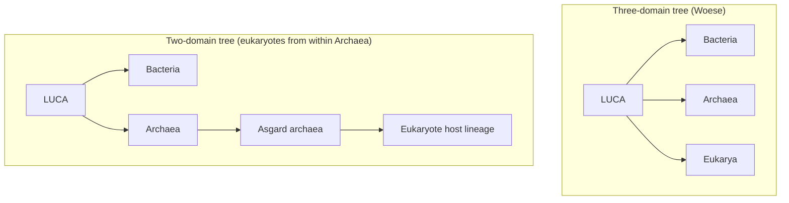
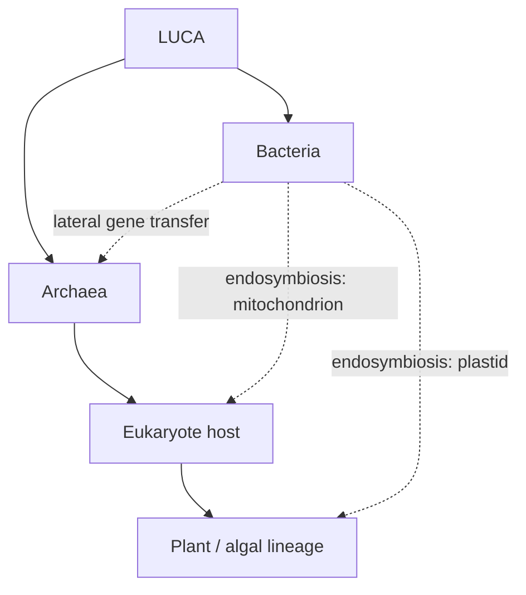
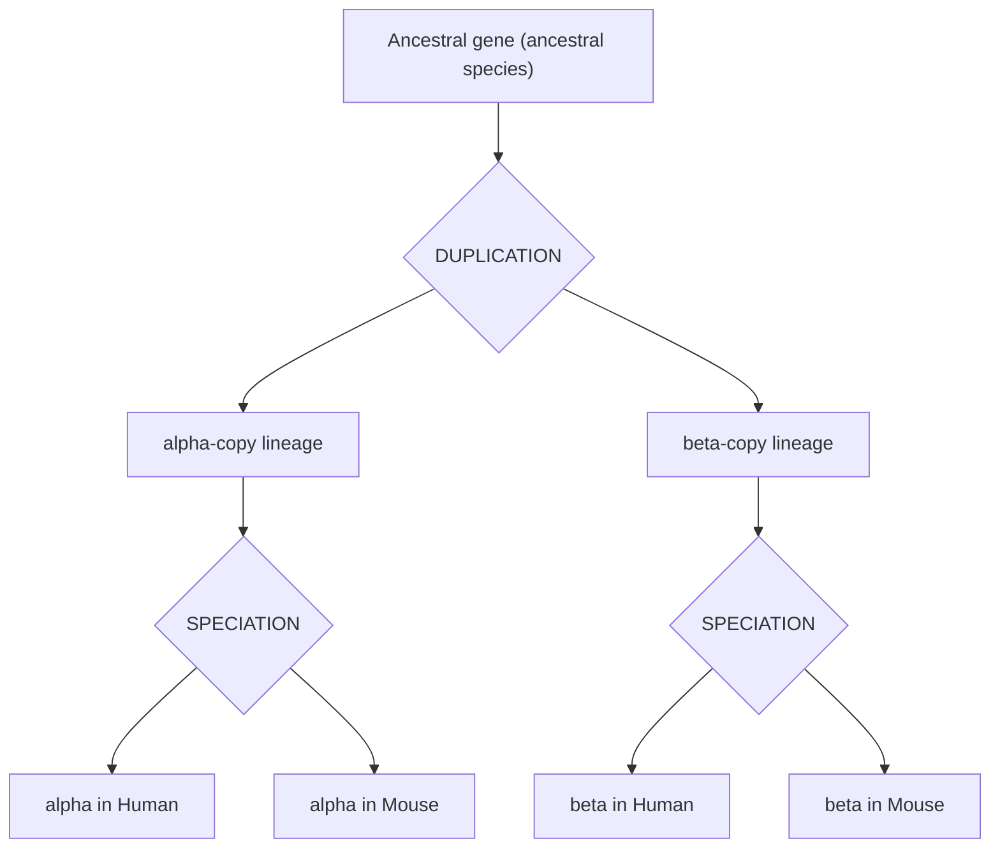
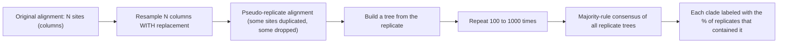
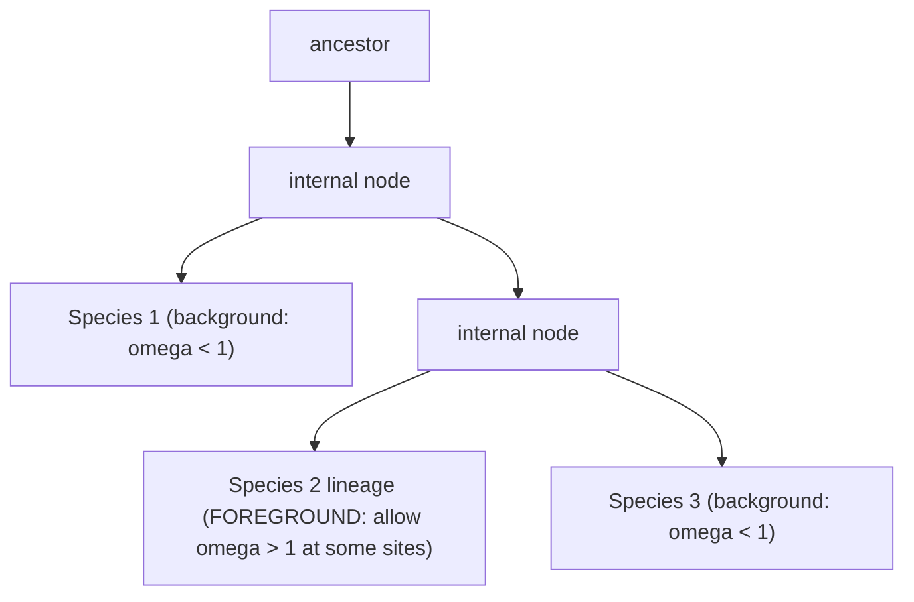
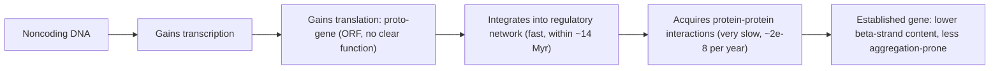

# 생명의 나무, 오솔로지와 패럴로지

**강의:** BME333 / BIO333 유전학 (UNIST, 2026 가을) · 2강 · ~60분
**강의계획서:** [← 강의계획서](../../lectures/2026.BME333-BIO333-Syllabus.md) — 1주차 수, 2026-09-02
**언어:** [English](../../en/lectures/lec02_Tree-of-Life-Orthology-Paralogy.md) · 한국어

## 학습 목표
이 강의를 마치면 학생들은 다음을 할 수 있어야 한다:
- 계통수(phylogenetic tree)를 올바르게 읽고(노드, 가지, 뿌리, 위상 대 가지 길이), 생명의 나무 개념과 그 한계(수평 유전자 전달, LUCA)를 기술한다.
- 상동성(homology), 오솔로지(orthology), 패럴로지(paralogy)를 구별하고, 그 구별이 왜 기능 추론과 게놈 주석에 중요한지 설명한다.
- 나무가 어떻게 만들어지며 부트스트랩(bootstrap)으로 노드 지지도를 어떻게 평가하는지 설명한다.
- dN/dS(Ka/Ks)를 정화(purifying), 중립(neutral), 양성(positive) 선택의 징표로 해석하고, 가지-부위(branch-site) 검정을 기술한다.
- 분자시계(molecular clock)와 신생 유전자 탄생(de novo gene birth) 개념을 설명한다.

## 강의

### 1. 생명의 나무 (~10분)

다윈의 *종의 기원(On the Origin of Species)*(1859)에 실린 단 하나의 삽화는 가지 치는 도표 — 하나의 **나무(tree)**였다. 그것은 그의 중심 은유를 포착했다. 모든 종은 공통 조상으로부터의 **변화를 동반한 유래(descent with modification)**로 연결되어 있으므로, 그 관계는 가지 치는 계보를 이룬다는 것이다. 한 장의 손으로 그린 그림에서 시작된 것이 거대한 연구 프로그램이 되었다. 바로 모든 생물의 계보를 재구성하려는 시도인 **생명의 나무(tree of life, TOL)**이다. 그 프로그램이 성공하는지 물을 수 있기 전에, 우리는 나무를 읽는 법을 배워야 한다.

**그림 — 계통수의 해부학.**
```
                (root = deepest common ancestor)
                       |
                 +-----+-----+          <- internal NODE = an inferred
                 |           |             common ancestor (a speciation event)
              +--+--+     +--+--+
              |     |     |     |
              A     B     C     D        <- TIPS = the taxa or sequences we observe

   TOPOLOGY   = the branching order (who shares a more recent ancestor with whom).
                Here (A,B) are sisters and (C,D) are sisters.
   BRANCH LEN = horizontal length can encode amount of evolutionary change or time.
   CLADE      = a node plus ALL its descendants (e.g. {C,D} or {A,B,C,D}).
```
두 성질이 자주 혼동된다. **위상(topology)**은 *가지 치는 순서(branching order)* — 누가 누구와 가장 가까운 관계인가에 대한 주장이다. **가지 길이(branch length)**는 *양(quantity)* — 얼마나 많은 변화(또는 얼마나 많은 시간)가 노드들을 갈라놓는가이다. 어떤 나무는 잘 지지되는 위상을 가지되 불확실한 가지 길이를 가질 수 있고, 그 반대일 수도 있다. 나무를 읽는다는 것은 이 둘을 따로 읽는 것이다.

분자 시대는 TOL에 새로운 엔진을 주었다. 1965년 **Zuckerkandl과 Pauling**은 *분자 서열*로 만든 나무가 해부학으로 만든 나무를 독립적으로 확증할 수 있다고 제안했는데, 유전자의 복제와 돌연변이 자체가 나무 모양이기 때문이다. 유전자가 복제되고, 그 복사본이 돌연변이하며, 유전자의 계통이 가지 친다. **재조합이 없는 단일 유전자에 대해서는 이것이 근사적으로 참이다**. 문제는 — Doolittle과 Brunet(2016)의 에세이의 주제인데 — **서로 다른 유전자가 흔히 서로 다른 나무를 준다**는 것이며, 특히 원핵생물에서 그러한데, 이는 **측면(수평) 유전자 전달(lateral/horizontal gene transfer, LGT)**, 즉 유전자가 계통을 곧장 따라 내려오는 것이 아니라 계통을 *가로질러* 이동하기 때문이다([en](../../en/review/Doolittle2016_PLoSGenet_TreeOfLife.md) · [ko](../../ko/review/Doolittle2016_PLoSGenet_TreeOfLife.md) 참조).

LGT는 얼마나 만연한가? 거의 모든 원핵생물 게놈에서 발견되는 유전자는 약 **100개**뿐이다 — "거의 보편적인 나무(Nearly Universal Trees, NUTs)"로, 압도적으로 **리보솜 및 전사 관련** 유전자이다. **복잡성 가설(complexity hypothesis)**(Jain et al. 1999)이 그 이유를 설명한다. 크고 다중 소단위인 기계 안에 자리 잡은 단백질은 함께 진화한 분자 파트너가 너무 많아서 외래 복사본이 기능할 수 없으므로, 이런 유전자는 전달에 저항한다. *다른* 대부분의 유전자는 유동적이다. 단일 *E. coli* 균주는 대략 **5,000개의 유전자**를 지니지만, 그 종의 **판게놈(pangenome)** — 모든 균주에 걸친 유전자의 합집합 — 은 **10만 개의 유전자 패밀리**에 육박하는데, 쓸모없을 때 잃고 필요할 때 LGT로 되찾는 유전자들이다. NUTs조차 완벽하게 일치하지 않기 때문에, 보편적 나무가 될 수 있는 최선은 **통계적 생명의 나무(Statistical Tree of Life, STOL)** — NUT 위상들 사이의 중심 경향으로, 조상 관계의 문자 그대로의 기록이 아니라 통계적 구성물이다.

전체 나무의 뿌리는 **최후 보편 공통 조상(Last Universal Common Ancestor, LUCA)**이다. Weiss et al.(2018)은 어떤 유전자 패밀리가 세균(Bacteria)과 고세균(Archaea) *둘 다*에 존재하고, 각 도메인에서 단계통군(monophyletic group)을 이루며(LGT 필터), 적어도 두 문(phyla)에 나타날 것을 요구함으로써 LUCA의 유력한 유전자 구성을 재구성했다([en](../../en/article/Weiss2018_PLoSGenet_LastUniversal-CommonAncestor.md) · [ko](../../ko/article/Weiss2018_PLoSGenet_LastUniversal-CommonAncestor.md) 참조). 두 도메인에 걸쳐 공유된 11,093개의 유전자 패밀리 중 **오직 355개(3%)만이 필터를 통과했는데 — 이는 공유 유전자의 97%가 LGT의 징표를 지닌다는 뜻이다.** 그 355개 패밀리는 일관된 초상을 그린다. LUCA는 **혐기성(anaerobic)**이었고, 산소에 민감한 철-황(iron–sulfur) 효소가 풍부했으며, CO₂와 H₂를 이용하는 고대의 **아세틸-CoA(Wood–Ljungdahl) 경로**로 탄소를 고정했고, 자체 이온 펌프 기계가 없었기에 아마도 **알칼리성 열수 분출구(alkaline hydrothermal vents)**의 자연적 pH 기울기를 활용했을 것이다. 생명의 가장 이른 화학적 흔적(탄소 동위원소 징표)은 약 **39.5억 년 전**으로 거슬러 올라가는데, 그 지구의 바다는 겨우 ~42~43억 년 전에야 응결되었다.

나무의 가장 깊은 구조에 대한 고전적 그림은 **Woese의 세 도메인(three domains)** — 세균, 고세균, 진핵생물(Eukarya) — 으로, 각각 LUCA에서 따로 유래한다는 것이었다. 더 새로운 계통유전체학과 **아스가르드 고세균(Asgard archaea)**의 발견은 진핵생물이 고세균 *안에서* 생겨나는 **두 도메인 나무(two-domain tree)**를 지지한다. 진핵생물은 사실 **키메라(chimeras)**이다. 세포질 리보솜은 고세균적이고, 미토콘드리아 리보솜은 세균적이며, 세균 기원의 핵 유전자가 고세균 기원의 것을 ~3:1로 능가한다.

**그림 — 깊은 나무, 경합하는 두 가지 뿌리 내리기.**


내부공생(endosymbiosis)이 이 점을 생생하게 만든다. **미토콘드리아와 색소체(plastids)는 한때 자유생활을 하던 세균**으로 숙주 세포에 삼켜졌다. 이것들은 계통의 *분기*가 아니라 *합병(mergers)*이다 — 그래서 뿌리 근처와 이 핵심 노드들에서 "나무"는 실은 **네트워크(network)**이다.

**그림 — 왜 생명의 나무는 뿌리 근처에서 네트워크인가 (LGT + 내부공생).**

요점: TOL은 없어서는 안 될 **발견법적 도구(heuristic)** — 생명의 역사의 요약 — 이지만, 원핵생물에 대해서는 불완전하고, 통계적이며, 부분적으로 그물형(reticulate)인 것이지, 문자 그대로 이분지하는 가계도가 아니다.

### 2. 상동성, 오솔로지, 패럴로지 (~12분)

나무 개념은 종에만이 아니라 *유전자*에도 적용된다. 그것을 쓰려면 세 가지 정밀한 용어가 필요하다. **상동성(homology)**은 **공통 조상(common ancestry)**에 기인한 유사성을 뜻한다 — 두 유전자가 단일 조상 유전자에서 유래하면 그것들은 상동이다. (상동성은 백분율이 아니라 역사에 관한 진술이다. 서열은 상동이거나 아니거나 둘 중 하나이며, "% 동일성"은 그것의 증거일 뿐이다.) 상동 유전자는 *무슨 사건이 그것들을 갈라놓았는가*에 따라 구별되는 두 종류로 나뉜다.

- **오솔로그(Orthologs)**는 **종분화(speciation)** 사건으로 갈라진 상동유전자이다. 조상 종이 둘로 나뉠 때 각 딸 계통은 그 유전자의 복사본을 물려받는데, 그 두 복사본이 오솔로그이다.
- **패럴로그(Paralogs)**는 하나의 게놈 *안에서* **유전자 중복(gene duplication)** 사건으로 갈라진 상동유전자이다. 유전자가 중복될 때 두 복사본은 패럴로그이며, 기능이 발산할 자유를 갖는다.

차이를 가장 깔끔하게 보는 방법은 **유전자 나무(gene tree)**를 그리고 각 내부 노드를 그것을 만든 사건으로 표지하는 것이다.

**그림 — 오솔로그 대 패럴로그: 두 유전자를 갈라놓는 노드를 읽으라.**

이제 각 쌍의 계통이 만나는 노드를 찾아 나무에서 쌍을 읽어내자.

| 쌍 | 그들을 갈라놓는 노드 | 관계 |
|---|---|---|
| alpha-Human vs. alpha-Mouse | SPECIATION | **오솔로그** |
| beta-Human vs. beta-Mouse | SPECIATION | **오솔로그** |
| alpha-Human vs. beta-Human | DUPLICATION | **패럴로그** |
| alpha-Human vs. beta-Mouse | DUPLICATION (가장 깊은 노드) | **패럴로그** (외부 패럴로그, out-paralogs) |

*서로 다른* 종의 두 유전자도 여전히 패럴로그일 수 있음에 주목하라(alpha-Human vs. beta-Mouse). 그 관계는 유전자가 같은 생물 안에 있는지가 아니라 *갈라놓는 사건*에 의해 정의된다. 글로빈(globin) 패밀리가 교과서적 사례이다 — α-글로빈과 β-글로빈은 고대의 중복에서 태어난 패럴로그이고, 당신의 β-글로빈과 침팬지의 β-글로빈은 오솔로그이다.

이것이 왜 중요한가? 대부분의 게놈 주석 뒤에 있는 작업 가정인 **오솔로그 추측(ortholog conjecture)** 때문이다(*Genetics: From Genes to Genomes* 8e, Ch. 11). **오솔로그는 종분화로만 갈라졌으므로 조상의 기능을 유지하는 경향이 있다.** 따라서 한 종에서 어떤 유전자의 기능을 안다면 그 주석을 다른 종의 오솔로그로 옮길 수 있다. **패럴로그는 더 위험하다.** 중복 이후 한 복사본은 흔히 새 기능을 획득하거나(신기능화, neofunctionalization) 옛 기능을 나누는(하위기능화, subfunctionalization) 자유를 가지므로, 패럴로그가 같은 일을 한다고 가정하면 틀릴 수 있다. 새로 서열 분석된 게놈에 주석을 달 때 — 수천 개의 유전자에 추정 기능을 부여할 때 — 파이프라인은 본질적으로 다음과 같다: 유전자 패밀리를 구축하고, 종에 걸쳐 오솔로그를 식별하며, 오솔로그 관계를 따라 주석을 옮긴다. 따라서 오솔로지 대 패럴로지를 옳게 판단하는 것은 학술적 장부 정리가 아니라, 우리가 실험적으로 연구한 적 없는 유전자에 기능을 부여하는 방식의 토대이다.

### 3. 나무 만들기와 노드 지지도 (~12분)

우리는 실제로 데이터에서 어떻게 나무를 *만들며*, 그것을 얼마나 신뢰해야 하는가? 나무 만들기 방법은 두 큰 갈래로 나뉜다. **거리 방법(distance methods)**은 먼저 데이터를 쌍별 거리 행렬로 축약한 뒤 그 거리에 나무를 맞춘다. **형질 기반 방법(character-based methods)**은 개별 열(부위, sites)을 유지하며 나무 전체를 직접 채점한다 — **최대절약법(parsimony)**은 변화가 가장 적게 필요한 나무를 고르고, **최대우도법(maximum likelihood, ML)**은 명시적 치환 모델 하에서 관찰된 데이터를 가장 그럴듯하게 만드는 나무(와 가지 길이)를 고른다.

이 방법들에는 공통의 기원 이야기가 있다. Edwards(2009)는 자신과 **Cavalli-Sforza**가 파비아(Pavia)에서 **1963–64년**에 초기 컴퓨터와 인간 **혈액형 유전자 빈도(blood-group gene frequencies)**(DNA 서열은 아직 존재하지 않았다)를 가지고 어떻게 핵심 접근법 셋을 한꺼번에 고안했는지 이야기한다. **최소제곱 가법 나무(least-squares additive tree)**, **최소 진화/최대절약(minimum evolution / parsimony)**, 그리고 계통학에 대한 **최대우도의 첫 적용(first application of maximum likelihood)**이다([en](../../en/review/Edwards2009_Genetics_Perspectives-EvolutionaryTreeStatistics.md) · [ko](../../ko/review/Edwards2009_Genetics_Perspectives-EvolutionaryTreeStatistics.md) 참조). 그 계보는 곧장 R. A. 피셔의 통계 유전학으로 거슬러 올라가고 — Edwards는 피셔가 받아들인 마지막 학부생이었다 — 앞으로는 모든 현대 나무 프로그램(PAUP, RAxML, BEAST)으로 이어진다. Edwards는 어렵게 배운 역사가의 경고를 덧붙인다. 단 하나의 "최초" 발견을 사냥하는 일은 대개 실패하는데, 모든 진보는 앞선 사고의 선들이 교차하는 지점이기 때문이다.

나무 그 자체는 하나의 점 추정치일 뿐이다. 우리는 **각 분기군(clade)에 대한 신뢰도**를 정량화해야 하며, 표준 도구는 **Felsenstein(1985)**이 계통학에 도입한 **부트스트랩(bootstrap)**이다([en](../../en/article/Felsenstein1985_Evolution_Bootstrap-PhylogeneticTrees.md) · [ko](../../ko/article/Felsenstein1985_Evolution_Bootstrap-PhylogeneticTrees.md) 참조). Felsenstein의 핵심 통찰은 올바른 **재표집 단위(unit of resampling)**를 식별한 것이었다. 종(정렬의 행)이 아니라 **형질 — 열/부위 — 을 복원추출(with replacement)로 재표집**하는 것인데, 참 나무가 주어졌을 때 부위들은 독립적이고 동일하게 분포하는 추출로 모형화될 수 있기 때문이다.

**그림 — 계통학적 부트스트랩.**


**부트스트랩 값(bootstrap value)**은 주어진 분기군이 나타나는 유사 반복(pseudo-replicate) 나무의 백분율이다. 분기군은 관례적으로 **≥ 95%**에서 잘 지지된다고 부르는데, 5% 유의수준에 대한 유비이다. Felsenstein은 "완벽하게 양립 가능한"(동형질성 없음, no-homoplasy) 데이터에 대한 기억할 만한 특수 경우 — **"3의 규칙(rule of three)"** — 을 유도했다. 어떤 분기군은 **세 개 이상의 형질**로 정의될 때에만 95% 구간에 도달한다는 것이다. 이상적인 데이터에서조차 한두 개의 지지 형질로는 충분하지 않다. 그는 또한 고전적인 **화석 말(fossil horse)** 데이터를 이용하여, *가장 절약적인* 나무 집합만 살피는 것은 불확실성을 심하게 *과소평가*함을 보였다 — 부트스트랩이 더 정직하다.

부트스트랩 값은 실제로 무엇을 *의미하는가*? Hillis와 Bull(1993)은 부트스트랩 값이 편향되어 있다(너무 보수적이다)고 비판했다. Efron, Halloran, Holmes(1996)가 이 논쟁을 해결했다. Felsenstein의 부트스트랩 값은 **편향되지 않았으며** — 단지 고전적 p-값과는 약간 다른 질문에 답할 뿐이다. 평평한 사전분포(flat prior) 하에서 그것은 사실상 **그 분기군이 옳을 베이지안 사후확률(Bayesian posterior probability)**이다([en](../../en/article/Efron1996_PNAS_Bootstrap-PhylogeneticTrees.md) · [ko](../../ko/article/Efron1996_PNAS_Bootstrap-PhylogeneticTrees.md) 참조). 말라리아(*Plasmodium*) rRNA 데이터를 이용하여, 그들은 어떤 강한 분기군이 **ã = 0.965**를 얻는 반면 더 정확한 "가설 검정" 수준은 0.942를 준다는 것을 보였다 — 그 불일치는 실재하지만 작고 어느 쪽으로든 갈 수 있으며, 정확한 버전을 계산하는 데는 약 20배의 비용이 든다. 실용적 교훈: 부트스트랩 값은 합리적이고 값싼 신뢰도 척도이지만, 그것은 *표집(sampling)* 일관성에 관한 진술이지 **분기군이 참이라는 보장이 아니며** — 나쁜 추론 방법은 높은 부트스트랩 값으로도 구제될 수 없다.

### 4. 서열에 대한 선택: dN/dS (~12분)

나무와 정렬된 단백질 암호화 서열을 얻고 나면, 우리는 깊은 중요성을 지닌 유전학 질문을 던질 수 있다. **이 유전자에 어떤 종류의 선택이 작용했는가?** 그 도구는 Yang과 Bielawski(2000)가 리뷰한 분자진화 분석의 일꾼인 **dN/dS 비율**(Ka/Ks 또는 **ω**로도 표기)이다([en](../../en/review/Yang2000_TrendsEcolEvol_dNdS.md) · [ko](../../ko/review/Yang2000_TrendsEcolEvol_dNdS.md) 참조).

그 논리는 유전 암호의 중복성(redundancy)에 근거한다. 코돈 내 DNA 치환은 암호화된 아미노산을 바꾸지 않으면 **동의(synonymous)**, 바꾸면 **비동의(nonsynonymous)**이다. 동의 변화는 (대체로) 단백질 기능에 대한 선택에 보이지 않으므로, 동의 비율 **dS**는 중립 기저 돌연변이율을 추정하는 반면, 비동의 비율 **dN**은 돌연변이 *에 더해* 단백질에 대한 선택을 반영한다. 따라서 그 비율은 선택을 직접 읽어낸다.

**그림 — 동의 대 비동의 변화, 그리고 ω가 말해주는 것.**
```
Codon CTT = Leucine
   synonymous:     CTT -> CTC   still Leucine        -> counts toward dS (neutral baseline)
   nonsynonymous:  CTT -> CCT   Leucine -> Proline   -> counts toward dN (protein change)

        omega (dN/dS)   interpretation
        -------------   -----------------------------------------
           < 1          PURIFYING selection: amino-acid changes removed (most genes)
           = 1          NEUTRAL: amino-acid changes not seen by selection
           > 1          POSITIVE (Darwinian) selection: changes actively favored
```

리뷰에서 나온 두 가지 경고: 소박한 계수 방법은 전이/전환(transition/transversion) 편향과 코돈 사용(codon-usage) 편향을 무시하면 **세 배**까지 어긋날 수 있으므로(인간 대 오랑우탄 α2-글로빈으로 보임), **최대우도 코돈 모델(maximum-likelihood codon models)**이 선호된다. 그리고 — 결정적으로 — **유전자 전체에 걸쳐 ω를 평균 내는 것은 매우 보수적인 검정**인데, 양성 선택을 받는 소수의 부위가 대개 정화 제약 하의 다수에 파묻히기 때문이다. 해법은 ω가 *코돈 사이에서* 변하도록 허용하는 **부위 모델(site models)**이다. **M1 대 M2**, **M7 대 M8** 같은 쌍을 **우도비 검정(likelihood-ratio test, LRT)**으로 비교하고, ω > 1을 허용하는 모델이 이기면 베이지안 사후확률이 *어떤* 잔기가 선택되었는지를 짚어낸다. **전복 정자 라이신(abalone sperm lysin)**에 적용했더니, **ω = 3.065**인 부류에 ~27%의 부위가 있었고, 이는 단백질 표면에 몰려 있었다 — 난막 단백질과의 분자적 군비 경쟁이다.

선택은 흔히 **간헐적(episodic)**이다. *특정 계통*의 *특정 부위*에 국한된다(예: 유전자가 한 가지에서 새 역할을 얻은 뒤). 그것을 탐지하려면 ω를 **두** 차원에서 동시에 변화시켜야 한다 — Yang과 dos Reis(2011)가 분석한 **가지-부위 검정(branch-site test)**이다([en](../../en/article/Yang2010_MBE_BranchSiteTest-PositiveSelection.md) · [ko](../../ko/article/Yang2010_MBE_BranchSiteTest-PositiveSelection.md) 참조). **전경 가지(foreground branch)**를 사전에 지정하고, 나머지 나무는 제약 하에 머무는 동안 코돈의 한 부분집합이 그 위에서 ω > 1을 갖는지 검정한다.

**그림 — 가지-부위 검정: 하나의 전경 계통, 소수의 부위.**


이 검정을 정직하게 쓰려면 두 가지 미묘한 점이 필수적이다. 첫째, **귀무분포는 단순한 χ²₁이 아니다.** 귀무가설이 허용 범위의 경계에서 ω = 1로 고정하기 때문에, 올바른 기준은 **0에서의 점질량(point mass)과 χ²₁의 50:50 혼합**이다(Chernoff 1954). 이를 사용하면 모의 위양성률(false-positive rate)이 20~50개의 코돈만으로도 명목값 **5%** 근처에 놓이며, 이 검정은 가지만 다루는 검정(간헐적·부위 제한 선택에 대해 검정력이 ~0%일 수 있다)보다 훨씬 큰 검정력을 갖는다. 둘째, 그리고 실용적으로 가장 중요한 것: 가지-부위 검정은 **참 신호와 데이터 오류를 모두 증폭하는 돋보기**이다. **정렬 실수(alignment mistakes)**는 양성 선택을 흉내 내는 가짜 비동의 차이의 연속을 만들어낸다 — 침팬지 계통에서 보고된 많은 "양성 선택" 유전자는 정렬을 정리하자 사라졌다. 좋은 전처리가 검정 자체만큼이나 중요하다.

### 5. 분자시계와 신생 유전자 탄생 (~10분)

치환이 대략 일정한 속도로 축적된다면, **두 서열 사이의 차이 수는 하나의 시계**이다 — 보정된 속도를 곱하면 그것들의 분기 시점을 *연대 측정*할 수 있다. 이것이 **분자시계(molecular clock)**이며, 그 역사를 Takahata(2007)가 추적한다([en](../../en/review/Takahata2007_Genetics_MolecularClock.md) · [ko](../../ko/review/Takahata2007_Genetics_MolecularClock.md) 참조). **Zuckerkandl과 Pauling**은 헤모글로빈의 아미노산 치환이 상당히 일정한 속도로 축적됨을 발견한 뒤 1962–65년에 이를 제안했으며, 이는 **포아송 과정(Poisson process)**으로 기술될 수 있다. 그들은 시계가 치환이 **거의 중립적(nearly neutral)**일 것을 *요구*함을 깨달았는데 — 이는 Kimura의 **중립설(neutral theory)**의 예고였다.

**그림 — 분자시계: 치환은 시간에 따라 축적된다.**
```
time  --->            (x = a fixed substitution)

split
  |----lineage A:   x---x-------x---x---x    fast tick (e.g. short generation time)
  |
  |----lineage B:   x------x------x------x   slow tick

  # substitutions  ~  rate  x  time
  => count substitutions, calibrate the rate with a fossil date, and DATE the split.
```

Takahata의 도발적 정식화는 시계가 **"반(反)신다윈주의적 유산(anti-neo-Darwinian legacy)"**이라는 것이다. Kimura가 대부분의 분자 변화가 선택이 아니라 **돌연변이와 부동(mutation and drift)**에 의해 추동된다는 가장 강력한 증거로 삼은 것은 — 전기영동 다형성이 아니라 — 각 단백질의 *속도의 항상성(constancy)*이었다. 결정적인 동반 관념은 **선택적 제약(selective constraint)**이다. *분자의 기능적 요구가 엄격할수록 그것은 더 느리게 진화한다* — 이것이 바로 동의 부위와 위유전자(pseudogenes)가 가장 빠르게 진화하는 이유이자, 대부분의 유전자에서 dN/dS < 1인 이유이다. 그러나 시계는 정밀한 도구가 아니다. 치환 수는 **과분산(overdispersed)**되어 있고(순수 포아송보다 더 변동이 크고), 이는 Gillespie의 "간헐적 시계(episodic clock)"를 촉발했다. 속도는 계통에 따라 체계적으로 변한다 — 화석에 의존하지 않는 **상대속도 검정(relative-rate test)**(Sarich & Wilson)으로 Wu와 Li(1985)는 **설치류가 인간보다 약 두 배 빠르게 진화**함을 보였는데, 이는 주로 **세대 시간 효과(generation-time effect)**이다. Takahata는 이러한 **계통 효과(lineage effects)**(계통 간 돌연변이율 차이, 침묵 부위에서 강함)를 **잔차 효과(residual effects)**(단백질 간 속도 차이)와 구별한다. 시계는 "불규칙하게 째깍거리지만", 개별 유전자의 특이성이 **많은 유전자좌를 결합할 때 평균화되어 사라지기** 때문에 여전히 쓸모가 있다.

나무와 시계는 *기존* 유전자가 어떻게 발산하는지를 기술한다 — 그러나 애초에 유전자는 어디서 오는가? 고전적 답은 **유전자 중복(gene duplication)**(2단락의 패럴로그를 만드는 것)이다. 더 새롭고 놀라운 답은 **신생 유전자 탄생(de novo gene birth)**이다. 이전에 **비암호화(noncoding) DNA**였던 것에서 완전히 새로운 유전자가 출현하는 것이다. Abrusan(2013)은 Frietze와 Leatherman(2014)의 학생용 프라이머와 함께, 명확한 기능이 없는 번역된 ORF인 **원시 유전자(proto-genes)**를 중간 단계의 스냅숏으로 삼아 효모에서 이를 연구했다([en](../../en/article/Abrusan2013_Genetics_DeNovoGeneBirth.md) · [ko](../../ko/article/Abrusan2013_Genetics_DeNovoGeneBirth.md); 프라이머 [en](../../en/review/Abrusan2013_Genetics_DeNovoGeneBirth-Frietze2014primer.md) · [ko](../../ko/review/Abrusan2013_Genetics_DeNovoGeneBirth-Frietze2014primer.md) 참조).

**그림 — 단계적 신생 유전자 탄생 (Abrusan 2013).**


데이터는 매우 다른 두 시간척도를 드러낸다. 새 유전자는 **전사 조절 네트워크에 빠르게** 연결되지만(대략 **1,400만 년** 이내), **안정적인 단백질–단백질 상호작용은 극히 느리게** 획득한다(~**연간 2–2.25 × 10⁻⁸ 상호작용**). 구조적으로, **더 젊은 유전자와 원시 유전자는 β-가닥 함량과 응집 경향이 더 높으며**, 이 둘은 유전자가 나이 들수록 *감소한다* — 안정적이고 비독성인 단백질에 대한 진행 중인 선택의 징표이다. 신생 탄생은 유전자 목록이 고정되어 있지 않음을 보여준다. 게놈은 "쓰레기(junk)"로부터 진정으로 새로운 유전자를 주조할 수 있으며, 이는 계통학적 역사에서 게놈을 시간에 따라 빚어내는 집단유전학적 과정으로 넘어가는 적절한 다리이다.

### 6. 종합과 마무리 (~4분)

계통학적 사고는 틈새 주제가 아니라 — 게놈학의 연결 조직이다. **나무(trees)**는 모든 생명을 조직하고 공통 조상을 추론하게 해주되, LGT와 내부공생이 가장 깊은 가지를 **네트워크**로 바꾸고 보편적 나무를 LUCA에 닻을 내린 통계적 구성물로 축소함을 기억해야 한다. **오솔로지 대 패럴로지** — 복사본을 갈라놓는 사건(종분화 대 중복)으로 유전자 나무에서 읽어내는 것 — 는 우리가 연구한 적 없는 유전자에 **기능 주석을 옮기게** 해주는 논리이다(오솔로그 추측). **부트스트랩**은 각 분기군을 얼마나 신뢰할지 알려준다. **dN/dS와 가지-부위 검정**은 정렬을 **선택**에 관한 진술로 바꾸어, 분자 데이터를 1강의 자연선택 이론에 연결한다. **분자시계**는 분기를 연대 측정하며, 속도 항상성과 선택적 제약을 통해 중립설 및 앞으로 나올 집단유전학 강의에 직접 이어진다. 그리고 **신생 유전자 탄생**은 게놈이 살아 있고 변화하는 목록임을 상기시킨다. 우리가 진화 역사를 기술하는 데서 그것을 생성하는 집단 과정을 모형화하는 데로 옮겨갈 때, 이 도구들 하나하나가 다시 등장한다.

## 핵심 정리
- 계통수는 **위상**(가지 치는 순서 = 누가 누구와 관계있는가)을 **가지 길이**(변화의 양 또는 시간)와 별도로 부호화한다. **분기군(clade)**은 노드와 그 모든 자손이다.
- **생명의 나무**는 필수적인 발견법적 도구이지만, 원핵생물에 대해서는 부분적으로 **그물형 네트워크(reticulate network)**이다. 오직 ~100개의 "거의 보편적인" 유전자만이 **측면 유전자 전달**에 저항하고(복잡성 가설), 판게놈은 단일 게놈을 압도하며, 진핵생물은 내부공생에서 태어난 **키메라**이다.
- **LUCA**는 단 **355개의 유전자 패밀리**로부터(공유 유전자의 97%가 LGT를 보임) 아세틸-CoA 경로를 쓰는 혐기성 열수 분출구 생물로 재구성된다. 깊은 나무는 세 도메인이 아니라 **두 도메인**(진핵생물이 아스가르드 고세균 안에서 유래)일 수 있다.
- **상동성** = 공통 조상; **오솔로그**는 **종분화**로, **패럴로그**는 **중복**으로 갈라진다 — 갈라놓는 노드를 유전자 나무에서 읽으라. **오솔로그 추측**(오솔로그는 기능을 유지한다)이 게놈 주석의 바탕이며, 패럴로그는 신기능화 또는 하위기능화할 수 있다.
- 나무는 **거리, 최대절약, 최대우도** 방법으로 만들어진다(Cavalli-Sforza & Edwards, 1963–64). **부트스트랩**은 분류군이 아니라 **부위(열)를 재표집**하며, 분기군 지지도는 평평한 사전분포 하의 베이지안 사후확률에 근사한다 — 표집 일관성의 척도이지 진리의 보장이 아니다.
- **dN/dS (ω)**는 단백질에 대한 선택을 읽는다: **< 1 정화, = 1 중립, > 1 양성**. **부위 모델**과 **가지-부위 검정**은 특정 코돈과 계통에 국한된 선택을 탐지하지만, 올바른 귀무가설은 **0과 χ²₁의 50:50 혼합**이며, 정렬 오류는 위양성을 일으킨다.
- **분자시계**는 분기를 연대 측정한다(치환 ≈ 속도 × 시간). 그 **항상성**은 중립성과 **선택적 제약**(엄격한 기능 → 더 느린 진화)의 핵심 증거이지만, 시계는 "불규칙하게 째깍거리며" 보정과 다수의 유전자좌를 필요로 한다.
- **신생 유전자 탄생**은 원시 유전자 단계를 거쳐 비암호화 DNA로부터 새 유전자를 만든다. 조절 통합은 빠르지만(~1,400만 년) 단백질 상호작용 통합은 느리며, 젊은 단백질은 β-가닥이 더 풍부하고 응집 경향이 더 크다.

## 교재 참고
- **Evolution: Making Sense of Life (4e)** — Ch. 4 The Tree of Life (phylogeny); Ch. 8 The History in Our Genes. → [textbook ref](../../lectures/ref.Evolution-MakeSenseOfLife.md)
- **Genetics: From Genes to Genomes (8e)** — Ch. 11 Genome Annotation. → [textbook ref](../../lectures/ref.Genetics-FromGenesToGenomes.md)

## 이 저장소의 노트
수업에서 소개할 리뷰와 논문 (각각 en/ko 이중언어 쌍이 있음):
- `Doolittle2016_PLoSGenet_TreeOfLife` — "생명의 나무"가 무엇을 뜻하며 왜 HGT가 그것을 복잡하게 하는가; 도입 단락의 틀. · [en](../../en/review/Doolittle2016_PLoSGenet_TreeOfLife.md) · [ko](../../ko/review/Doolittle2016_PLoSGenet_TreeOfLife.md)
- `Weiss2018_PLoSGenet_LastUniversal-CommonAncestor` — LUCA의 유전자 구성 재구성; 나무의 뿌리. · [en](../../en/article/Weiss2018_PLoSGenet_LastUniversal-CommonAncestor.md) · [ko](../../ko/article/Weiss2018_PLoSGenet_LastUniversal-CommonAncestor.md)
- `Felsenstein1985_Evolution_Bootstrap-PhylogeneticTrees` — 부트스트랩을 계통학에 도입한 창시 논문. · [en](../../en/article/Felsenstein1985_Evolution_Bootstrap-PhylogeneticTrees.md) · [ko](../../ko/article/Felsenstein1985_Evolution_Bootstrap-PhylogeneticTrees.md)
- `Efron1996_PNAS_Bootstrap-PhylogeneticTrees` — 부트스트랩 지지값의 통계적 해석. · [en](../../en/article/Efron1996_PNAS_Bootstrap-PhylogeneticTrees.md) · [ko](../../ko/article/Efron1996_PNAS_Bootstrap-PhylogeneticTrees.md)
- `Edwards2009_Genetics_Perspectives-EvolutionaryTreeStatistics` — 진화 나무 통계학에 대한 역사적 관점. · [en](../../en/review/Edwards2009_Genetics_Perspectives-EvolutionaryTreeStatistics.md) · [ko](../../ko/review/Edwards2009_Genetics_Perspectives-EvolutionaryTreeStatistics.md)
- `Yang2000_TrendsEcolEvol_dNdS` — dN/dS를 추정하고 해석하는 법; 선택 단락의 닻. · [en](../../en/review/Yang2000_TrendsEcolEvol_dNdS.md) · [ko](../../ko/review/Yang2000_TrendsEcolEvol_dNdS.md)
- `Yang2010_MBE_BranchSiteTest-PositiveSelection` — 특정 부위/계통에서 양성 선택을 탐지하는 가지-부위 검정. · [en](../../en/article/Yang2010_MBE_BranchSiteTest-PositiveSelection.md) · [ko](../../ko/article/Yang2010_MBE_BranchSiteTest-PositiveSelection.md)
- `Takahata2007_Genetics_MolecularClock` — 분자시계 개념과 그 가정들. · [en](../../en/review/Takahata2007_Genetics_MolecularClock.md) · [ko](../../ko/review/Takahata2007_Genetics_MolecularClock.md)
- `Abrusan2013_Genetics_DeNovoGeneBirth` — 새 유전자가 비암호화 DNA로부터 신생으로 생겨나는 방식. · [en](../../en/article/Abrusan2013_Genetics_DeNovoGeneBirth.md) · [ko](../../ko/article/Abrusan2013_Genetics_DeNovoGeneBirth.md)
- `Abrusan2013_Genetics_DeNovoGeneBirth-Frietze2014primer` — 신생 유전자 탄생 연구에 대한 학생 친화적 프라이머. · [en](../../en/review/Abrusan2013_Genetics_DeNovoGeneBirth-Frietze2014primer.md) · [ko](../../ko/review/Abrusan2013_Genetics_DeNovoGeneBirth-Frietze2014primer.md)

## 토론 문제
1. Doolittle과 Brunet은 "생명의 나무"가 원핵생물에 대해서는 기껏해야 통계적 구성물이라고 주장한다. 측면 유전자 전달과 내부공생이 어떻게 나무의 바탕을 네트워크로 바꾸는지, 그리고 왜 오직 ~100개의 유전자(복잡성 가설)만이 전달에 저항하는지 설명하라. "나무"는 여전히 유용한 은유인가? 견해를 옹호하라.
2. 조상 유전자가 중복된 뒤 종이 나뉘는 유전자 나무를 그리라. 모든 현생 유전자 쌍을 오솔로그 또는 패럴로그로 표지하라. 오솔로그 추측은 왜 오솔로그를(패럴로그가 아니라) 새로 서열 분석된 게놈에 기능 주석을 옮기는 안전한 근거로 만드는가?
3. 발표된 계통수가 99% 부트스트랩 지지를 받는 분기군을 보여준다. Felsenstein(1985)과 Efron et al.(1996)을 따라, 그 숫자가 무엇을 말해주고 무엇을 말해주지 않는지 정확히 설명하라. 왜 *틀린* 나무도 높은 부트스트랩 값을 보일 수 있으며, 왜 재표집 단위가 종이 아니라 부위인가?
4. 어떤 유전자 전체에 대해 ω = dN/dS = 0.4를 계산했으나, 한 계통에서 소수의 잔기가 양성 선택 하에 있다고 의심한다. 왜 유전자 전체 평균이 이를 감추며, 부위 모델과 가지-부위 검정은 어떻게 그 신호를 회복하는가? 가지-부위 검정은 왜 50:50 혼합 귀무가설을 써야 하며, 여기서 정렬 오류는 왜 그렇게 위험한가?
5. 분자시계는 분기 연대 측정의 핵심이면서도 "불규칙하게 째깍거린다." 속도 항상성이 어떻게 중립설의 증거가 되었는지, 세대 시간(계통) 효과가 시계에 무엇을 하는지, 그리고 왜 많은 유전자좌를 결합하면 여전히 분기 시점을 추정할 수 있는지 설명하라.
