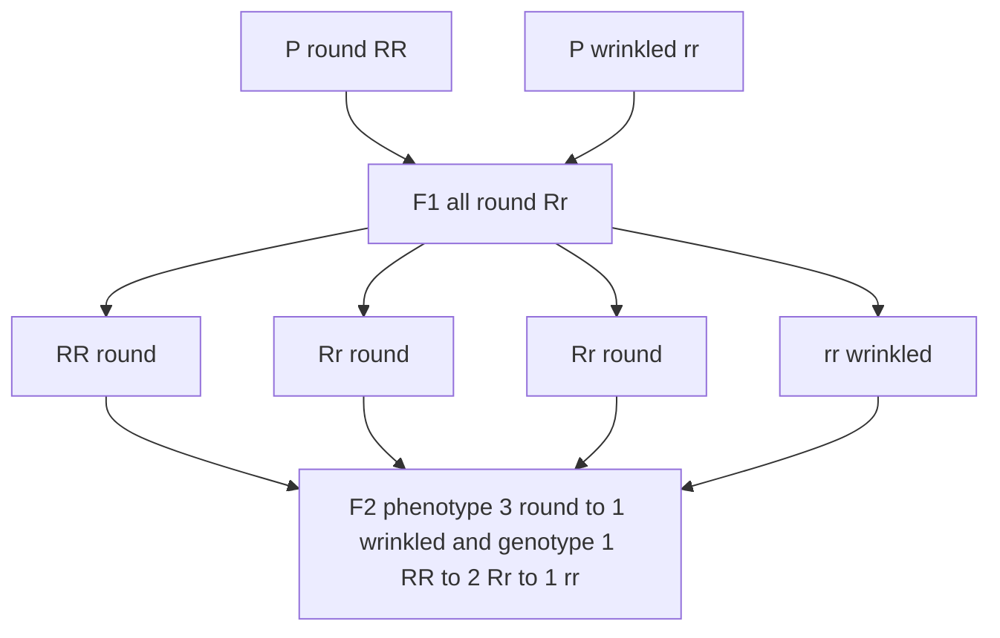
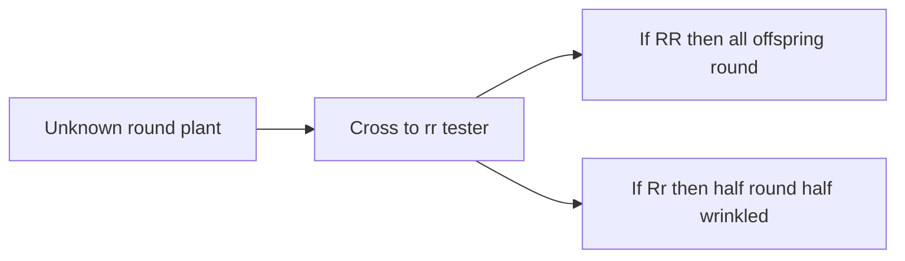

# 멘델의 유전 원리

**강의:** BME333 / BIO333 유전학 (UNIST, 2026 가을) · 3강 · ~60분
**강의계획서:** [← 강의계획서](../../lectures/2026.BME333-BIO333-Syllabus.md) — 2주차 월, 2026-09-07
**언어:** [English](../../en/lectures/lec03_Mendel-Principles.md) · 한국어

## 학습 목표
이 강의를 마치면 학생들은 다음을 할 수 있어야 한다:
- 멘델의 분리의 법칙(Law of Segregation)과 독립의 법칙(Law of Independent Assortment)을 진술하고, 이를 입자적 유전 이론에 연결한다.
- 퍼넷 사각형(Punnett square)과 곱/합 법칙을 이용하여 단성잡종(monohybrid)과 양성잡종(dihybrid) 교배 결과(3:1, 9:3:3:1)를 예측한다.
- 멘델의 완두 선택, 이산적 형질, 정량적 계수가 왜 그의 실험을 결정적으로 만들었는지 설명한다.
- 멘델의 사료학(historiography)을 논한다: 그의 추론, "믿기 어려울 만큼 좋은 데이터" 논쟁, 그리고 그의 재발견.
- 멘델의 고전적 형질을 현대 완두 게놈에서의 분자적 정체와 연결한다.

## 강의

### 1. 멘델이 성공한 이유 (~10분)

멘델 이전에 유전에 대한 지배적 견해는 **혼합 유전(blending inheritance)**이었다. 두 부모의 특성이 자식에게서 두 물감을 저어 섞듯 뒤섞이므로, 키 큰 부모와 키 작은 부모는 중간 키의 자식을 낳으리라는 관념이다. 혼합에는 치명적 문제가 있다 — 변이를 파괴한다는 것이다. 섞임이 매 세대 집단 내 차이를 절반으로 줄여, 결국 모두가 하나의 평균으로 수렴하고 자연선택이 작용할 것이 아무것도 남지 않게 된다. 그레고어 멘델의 위대한 성취는 이 그림이 틀렸음을 정량적으로 보인 것이다. 유전 정보는 **입자적(particulate)**이며, 세대에서 세대로 희석되거나 혼합되지 않고 온전히 전달되는 이산적 "인자(factors)"(오늘날 우리가 유전자라 부르는 것)에 실려 있다.

멘델(1822–1884)은 운 좋은 아마추어가 아니었다. 지금의 체코 공화국에 해당하는 곳에서 가난한 독일어권 소작농의 아들로 태어난 그는 빈 대학교에서 크리스티안 도플러(Christian Doppler)와 프란츠 웅거(Franz Unger)에게 물리학과 조합수학을 배운 뒤, 브륀(Brünn, 브르노)의 아우구스티누스회 수도원에 들어갔다. Nasmyth(2022)가 인상적으로 지적하듯, 멘델은 역설적이게도 **교사 자격 시험에 두 번 낙방함으로써 연구를 위한 자유를 얻었다**([en](../../en/review/Nasmyth2022_NatRevGenet_Mendel.md) · [ko](../../ko/review/Nasmyth2022_NatRevGenet_Mendel.md) 참조). 그의 중심 통찰은 독특하게 생물학적이었다. 유전 정보의 물질적 기반에 대해 아무것도 모른 채로도 그것의 *전달(transmission)*을 측정하는 것이 가능하다는 것 — 물질이 아니라 정보의 움직임을 추적한다는 것이다.

멘델의 성공은 일련의 의도적 방법론적 선택에 기댔으며, 그 모두는 그가 택한 생물인 **완두(garden pea, *Pisum sativum*)**로 예시된다. 1866년 논문의 서두에서 그는 적합한 실험 식물이 세 가지 요건을 충족해야 한다고 설명한다([en](../../en/article/Abbott2016_Genetics_MendelHybridPaper.md) · [ko](../../ko/article/Abbott2016_Genetics_MendelHybridPaper.md) 참조):

1. **명확히 구별되고 항상적인 형질** — 연속적 등급이 아니라 이산적 대안(둥글거나 *또는* 주름지거나).
2. **외래 꽃가루로부터 꽃의 보호** — 완두 꽃은 닫힌 용골판(keel) 안에서 자가수분하므로, 실험자가 일부러 교배하지 않는 한 계통이 순수하게 유지된다.
3. **잡종의 완전한 임성(fertility)** — 그래야 세대에 걸쳐 많은 수의 자손을 채점할 수 있다.

두 가지 선택이 더 결정적이었다. 첫째, 멘델은 **2년의 예비 기간을 34개 완두 품종을 시험하는 데 쓰고 22개를 선별**했는데, 이는 순종 번식(true-breeding, 즉 유전적으로 순수하여 자가수분 시 균일한 자손을 내는)하며 **일곱 쌍의 대조 형질**을 가진 것들이었다. 둘째 — 이것이 그를 모든 선구자와 갈라놓은 점인데 — 그는 **많은 수의 자손을 세고 그 비율을 통계적으로 추론**했다. Knight, Goss, Gärtner, Laxton 같은 앞선 잡종 연구자들이 숨은 형질의 재출현을 *보기만* 한 반면, 수학 훈련을 받은 멘델만이 되풀이되는 **3:1 비율**을 설명을 요구하는 하나의 법칙으로 인식했다([en](../../en/review/vanDijk2022_NatGenet_MendelPerspective.md) · [ko](../../ko/review/vanDijk2022_NatGenet_MendelPerspective.md) 참조). 이것이 작동하는 "준비된 마음(prepared mind)"이다. 같은 관찰이 한 관찰자에게는 무의미하고 다른 관찰자에게는 혁명적일 수 있다.

두 가지 역사적 맥락이 이야기를 깊게 한다. 완두는 임의의 실험실 식물이 아니라, 수 세기에 걸쳐 목록화되고 이름 붙은 품종이 육종가들에게 제공된 **원예의 일꾼(horticultural workhorse)**이었다 — 원예 공동체가 사실상 멘델의 안정적 변종 도구상자를 미리 조립해 준 셈이다([en](../../en/review/Olby2000_NatRevGenet_Horticulture.md) · [ko](../../ko/review/Olby2000_NatRevGenet_Horticulture.md) 참조). 그리고 멘델의 기획은 순수하게 추상적이지 않았다. van Dijk, Jessop, Ellis(2022)는 멘델의 완두, 콩, 오이를 칭찬한 1861년 브륀 신문 기사를 발굴하여, 그가 과학적 기획과 나란히 **실용적 채소 육종 프로그램**을 운영했음을 보였다 — 3:1 비율은 어쩌면 평범한 육종 교배에서 처음 발견되었을 수 있다([en](../../en/review/vanDijk2022_NatGenet_MendelPerspective.md) · [ko](../../ko/review/vanDijk2022_NatGenet_MendelPerspective.md) 참조).

### 2. 분리 (제1법칙) (~12분)

단일 형질 — 예를 들어 종자 모양, **둥근(R)** 대 **주름진(r)** — 을 생각해 보자. 멘델은 순종 번식하는 둥근 계통과 순종 번식하는 주름진 계통을 교배했다. 이것이 **단성잡종 교배(monohybrid cross)**(한 형질을 추적하는 교배)이다. 어버이 세대는 **P 세대**, 그 자손은 **제1잡종(first filial, F1)** 세대, F1의 자가수분 자손은 **F2**이다.

**결과 1 — F1의 균일성.** 모든 F1 식물이 둥글었다. 주름진 특성은 사라졌다. 멘델은 F1에 나타나는 특성을 **우성(dominant)** 특성, 사라지는 특성을 **열성(recessive)** 특성이라 불렀다. 결정적으로, 우성은 어느 부모가 어느 형질을 기여했는지에 **의존하지 않았다** — 둥근 꽃가루 × 주름진 난세포는 그 역교배와 같은 결과를 주었다. 이것만으로도 혼합은 반박된다. F1은 중간형이 아니라 정확히 한쪽 부모처럼 보인다.

**결과 2 — F2의 3:1 비율.** 멘델이 F1을 자가수분시키자 열성 특성이 *재출현*했다. 일곱 형질 모두에 걸쳐 F2의 우성:열성 비율은 평균 **2.98:1 ≈ 3:1**이었다. 그의 실제 집계는 다음과 같다([en](../../en/article/Abbott2016_Genetics_MendelHybridPaper.md) · [ko](../../ko/article/Abbott2016_Genetics_MendelHybridPaper.md) 참조):

| 형질 (우성 대 열성) | F2 계수 | 비율 |
|---|---|---|
| 종자 모양 (둥근 대 주름진) | 5,474 : 1,850 | 2.96 : 1 |
| 떡잎 색 (노랑 대 초록) | 6,022 : 2,001 | 3.01 : 1 |
| 종피 색 (회갈색 대 흰색) | 705 : 224 | 3.15 : 1 |
| 꼬투리 형태 (팽창 대 잘록) | 882 : 299 | 2.95 : 1 |
| 꼬투리 색 (초록 대 노랑) | 428 : 152 | 2.82 : 1 |
| 꽃 위치 (엽액 대 정단) | 651 : 207 | 3.14 : 1 |
| 줄기 길이 (큰 키 대 왜성) | 787 : 277 | 2.84 : 1 |

F2에서 열성 특성이 온전히 재출현하는 것은 혼합 하에서는 불가능하지만 입자적 인자가 예측하는 바로 그것이다.

**멘델의 모델.** 각 식물은 각 형질에 대해 **두 개의 인자**(대립유전자, alleles)를 지니는데, 각 부모에게서 하나씩 물려받는다. 생식세포(gametes)의 형성 중에 두 인자는 **분리(separate/segregate)**되어 각 생식세포가 하나만 지니게 된다. 이것이 **분리의 법칙(Law of Segregation)**이다. 한 유전자의 두 대립유전자는 생식세포로 균등하게 분리되어, 절반은 한 대립유전자를, 절반은 다른 것을 지닌다. 순종 번식하는 둥근 식물은 *RR*(**동형접합, homozygous**)이고, 순종 번식하는 주름진 식물은 *rr*이며, F1은 *Rr*(**이형접합, heterozygous**)이고 *R*이 우성이므로 둥글다. 생물의 유전적 구성(**유전자형, genotype**, 예: *Rr*)과 겉모습(**표현형, phenotype**, 예: 둥근)의 구별이 멘델주의의 개념적 핵심이며 — Olby(2000)가 지적하듯, 멘델의 재발견자 중 일부만이 이 전달 대 발현(transmission-versus-expression)의 구별을 온전히 파악했다([en](../../en/review/Olby2000_NatRevGenet_Horticulture.md) · [ko](../../ko/review/Olby2000_NatRevGenet_Horticulture.md) 참조).

**왜 3:1이 나오는가.** *Rr* F1이 자가수분할 때, 각 부모는 동등한 확률로 *R* 또는 *r*을 기여한다. **퍼넷 사각형(Punnett square)**이 동등하게 가능한 조합들을 열거한다:

|       | **R** (½) | **r** (½) |
|-------|-----------|-----------|
| **R** (½) | RR | Rr |
| **r** (½) | Rr | rr |

유전자형 비율은 **1 RR : 2 Rr : 1 rr** — 멘델 자신의 "A + 2Aa + a" 급수이다. *RR*과 *Rr* 둘 다 둥글게 보이므로, *표현형* 비율은 **3 둥근 : 1 주름진**이다. 멘델은 F2 우성체를 한 세대 더 기름으로써 숨은 1:2:1을 확인했다. **3분의 2가 잡종처럼 행동했고**(그 자손이 다시 3:1로 분리됨) **3분의 1이 순종 번식**했는데, 이는 정확히 모델이 요구하는 바이다.

**단성잡종 교배, 세대별로.**



**검정교배(testcross).** 둥근 식물이 *RR*인지 *Rr*인지, 둘이 똑같아 보이는데 어떻게 구별할 수 있는가? 미지의 식물을 **동형접합 열성(*rr*)** 검정체와 교배하라. 미지가 *RR*이면 모든 자손이 둥글다(*Rr*). *Rr*이면 자손이 **1 둥근 : 1 주름진**으로 나타난다. 검정교배는 자손의 표현형에서 유전자형을 직접 읽어내며, 오늘날에도 유전 분석의 일꾼으로 남아 있다.

**검정교배 논리: 자손이 미지의 유전자형을 드러낸다.**



### 3. 독립의 법칙 (제2법칙) (~12분)

멘델은 다음으로 두 가지 다른 형질이 함께 유전되는지 아니면 독립적으로 유전되는지를 물었다. 그는 **둥근, 노란** 종자(*RRYY*)를 가진 순종 번식 계통을 **주름진, 초록** 종자(*rryy*)를 가진 계통과 교배했다 — **양성잡종 교배(dihybrid cross)**(두 형질을 한꺼번에)이다. F1은 모두 둥글고 노랬으며(*RrYy*), 둥근 것과 노란 것이 우성임을 확인했다.

핵심 질문은 F2이다. 두 유전자가 함께 이동한다면, F2는 두 어버이 조합(둥근-노랑과 주름진-초록)만을 3:1 비율로 보일 것이다. 반면 각 유전자가 독립적으로 조합된다면, **새로운(재조합) 유형(new/recombinant types)**인 둥근-초록과 주름진-노랑을 포함한 네 조합 모두가 나타나야 한다. 멘델의 **556개 종자** F2는 다음을 주었다([en](../../en/article/Abbott2016_Genetics_MendelHybridPaper.md) · [ko](../../ko/article/Abbott2016_Genetics_MendelHybridPaper.md) 참조):

- 315 둥근, 노랑
- 101 주름진, 노랑
- 108 둥근, 초록
- 32 주름진, 초록

이는 **9 : 3 : 3 : 1**에 매우 가깝다. 두 재조합 부류가 상당한 수로 나타나는 것이 **독립의 법칙(Law of Independent Assortment)**의 징표이다. 한 유전자의 대립유전자는 다른 유전자의 대립유전자와 독립적으로 생식세포로 분리된다는 것이다. 따라서 이형접합 *RrYy* 식물은 네 가지 생식세포 유형 — *RY*, *Ry*, *rY*, *ry* — 을 **동등한(각 ¼)** 빈도로 생산한다.

9:3:3:1 비율은 단지 두 개의 독립적인 3:1 비율을 곱한 것이다. 16개의 동등하게 가능한 자손에 대한 4×4 퍼넷 사각형이 이를 구체화한다:

|        | **RY** | **Ry** | **rY** | **ry** |
|--------|--------|--------|--------|--------|
| **RY** | RRYY | RRYy | RrYY | RrYy |
| **Ry** | RRYy | RRyy | RrYy | Rryy |
| **rY** | RrYY | RrYy | rrYY | rrYy |
| **ry** | RrYy | Rryy | rrYy | rryy |

표현형을 세면 **9 둥근-노랑 : 3 둥근-초록 : 3 주름진-노랑 : 1 주름진-초록**이 된다. 멘델은 이를 임의의 형질 수로 일반화했다. **서로 다른 n쌍의 형질**에 대해 **3ⁿ개의 유전자형 부류, 2ⁿ개의 순종 번식(항상적) 조합, 그리고 4ⁿ개의 동등하게 가능한 생식세포 결합**이 있다 — 그는 세 형질 경우(27개 부류의 급수)를 직접 검증했다. Nasmyth(2022)는 간과하기 쉬운 깊은 함의를 강조한다. 독립의 법칙은 *생물의 서로 다른 측면이 하나의 공통 메커니즘에 의해 다루어지는, 별개의 독립적으로 전달되는 요소들에 의해 지정됨*을 보여준다 — 이는 "1유전자 1효소(one gene, one enzyme)" 관념의 직접적 개념적 조상이다([en](../../en/review/Nasmyth2022_NatRevGenet_Mendel.md) · [ko](../../ko/review/Nasmyth2022_NatRevGenet_Mendel.md) 참조).

독립의 법칙은 **서로 다른 염색체에 있는 유전자(또는 같은 염색체에서 멀리 떨어진 유전자)에 대해서만** 성립한다. 같은 염색체에서 물리적으로 가까운 유전자는 **연관(linked)**되어 함께 유전되는 경향이 있어 9:3:3:1 비율을 깨뜨린다 — 이는 연관과 유전자 지도 작성 강의에서 다시 다룰 현상이다. 멘델의 일곱 형질은 우연히 독립적으로 행동했는데, 이는 다행스러운 일이지만, 우리가 이제 완두 게놈에서 알듯이, 그것들이 모두 서로 다른 염색체에 있기 때문은 아니다.

### 4. 확률 도구 (~8분)

퍼넷 사각형은 직관적이지만 금세 다루기 어려워진다 — 삼성잡종(trihybrid)은 64칸 격자가 필요하다. 두 가지 확률 법칙이 예측을 효율적으로 만든다.

**곱의 법칙(product rule):** **두 독립 사건이 모두 일어날** 확률은 각각의 확률의 곱이다. 각 유전자가 독립적으로 분리되므로, 각 형질을 따로 계산해 곱할 수 있다. *RrYy* × *RrYy* 교배에서 P(둥근) = ¾, P(노랑) = ¾이므로 P(둥근 *그리고* 노랑) = ¾ × ¾ = **9/16** — 아무것도 그리지 않고 얻은 9:3:3:1의 "9"이다. 마찬가지로 P(주름진, 초록) = ¼ × ¼ = 1/16이다.

**합의 법칙(sum rule):** **서로 배타적인 두 사건 중 하나**의 확률은 각각의 확률의 합이다. 어떤 종자가 둥근-초록 *또는* 주름진-노랑일 확률은 3/16 + 3/16 = **6/16**이다.

**가지(나무) 다이어그램(branch/tree diagrams)**은 이를 형질별로 정리한다. *RrYy* × *RrYy* 양성잡종의 표현형을 한 번에 한 유전자씩 만들며 각 경로를 따라 곱한다:

```
seed shape          seed color         combined (product rule)
                 ┌─ yellow (3/4) ───── round, yellow    = 3/4 × 3/4 = 9/16
   round (3/4) ──┤
                 └─ green  (1/4) ───── round, green     = 3/4 × 1/4 = 3/16
                 ┌─ yellow (3/4) ───── wrinkled, yellow = 1/4 × 3/4 = 3/16
   wrinkled(1/4)─┤
                 └─ green  (1/4) ───── wrinkled, green  = 1/4 × 1/4 = 1/16
```

네 곱은 합이 1이 되고 **9:3:3:1**을 재현한다 — 16칸 퍼넷 사각형과 같은 답이지만 확장 가능하다. *삼성잡종*(*RrYyGg* × *RrYyGg*)의 경우, 삼중 열성인 비율은 단순히 ¼ × ¼ × ¼ = **1/64**이고, 세 우성 표현형을 모두 보이는 비율은 ¾ × ¾ × ¾ = **27/64**이다 — 64칸 격자가 필요 없다. 이것들이 과목 후반의 가계도 분석과 유전 상담 위험 계산을 위한 일상적 도구이다.

멘델 자신도 이 논리를 거꾸로 사용하여 자기 모델을 *검정*했다. 이형접합 잡종이 실제로 각 생식세포 유형을 동등한 빈도로 만든다면, 그 잡종을 열성 부모로 되교배하면 자손 부류가 동등한(1:1, 두 형질이면 1:1:1:1) 비율로 나와야 한다. 그의 **역교배 실험(backcross experiments)**은 정확히 이 동등한 빈도의 생식세포 비율을 확인했다 — 자손 계수만이 아니라 생식세포 수준에서 분리와 독립의 법칙에 대한 직접적 증거이다([en](../../en/article/Abbott2016_Genetics_MendelHybridPaper.md) · [ko](../../ko/article/Abbott2016_Genetics_MendelHybridPaper.md) 참조).

### 5. 역사적·과학적 맥락 속의 멘델 (~12분)

멘델은 1865년 두 차례의 강연에서 결과를 발표하고, 1866년에 *식물 잡종에 관한 실험(Versuche über Pflanzen-Hybriden)*("Experiments on Plant Hybrids")을 출판했다. 그가 실제로 무엇을 했는지 — 그리고 나중에 그에게 귀속된 것이 무엇인지 — 를 이해하는 것은 과학자처럼 사고하는 일의 일부이다.

**멘델은 자신이 무엇을 발견했다고 생각했는가?** Hartl과 Orel(1992)은 **정통(orthodox)** 견해(멘델이 입자적 유전의 보편 법칙을 발견하려 했다)와 **수정주의(revisionist)** 견해(멘델은 종의 안정성과 잡종 형성을 다룬 19세기 식물 잡종화 전통 안에서 작업했다)를 대비한다. 그들은 멘델이 **"서로 다른 형질들의 조합의 법칙(law of combination of differing traits)"** — 잡종 자손에서의 두드러진 수치적 규칙성 — 을 기술했으며, 유전의 물질적 단위를 찾았다고 주장하지 *않았고*, 그의 비율을 근본적 "유전학의 법칙"으로 격상한 것은 대체로 20세기 재발견자들의 작업이었다고 논한다([en](../../en/review/Hartl1992_Genetics_MendelThinking.md) · [ko](../../ko/review/Hartl1992_Genetics_MendelThinking.md) 참조). van Dijk, Jessop, Ellis(2022)는 실용적 기원 이야기를 덧붙인다. 그 양상은 아마도 **종자 형질(seed traits)**에서 처음 드러났을 것인데, 완두 종자의 떡잎은 *F1 식물에 직접 보이는 F2 배아 조직*이어서 추가 재배 계절이 필요 없었고, 그의 22개 품종 간 교배의 약 60%가 적어도 하나의 종자 형질에서 달랐을 것이기 때문이다([en](../../en/review/vanDijk2022_NatGenet_MendelPerspective.md) · [ko](../../ko/review/vanDijk2022_NatGenet_MendelPerspective.md) 참조).

**멘델과 다윈.** 익숙한 한탄은 다윈이 멘델을 결코 읽지 않았다는 것이다. Fairbanks와 Abbott(2016)은 그 반대에 주의를 돌린다. **멘델은 다윈을 읽었다.** 멘델은 *종의 기원*의 1863년 독일어 번역본을 소유했고, 자신의 손으로 주석을 달았으며 — 그의 논문 마지막 두 절에 나타난 다윈적 용어의 밀도가 보여주듯 — 자신의 발견을 진화적 맥락 안에서 의식적으로 틀 지었다([en](../../en/review/Fairbank2016_Genetics_Darwin+Mendel.md) · [ko](../../ko/review/Fairbank2016_Genetics_Darwin+Mendel.md) 참조). 이는 진화를 모르는 고립된 수도사라는 신화를 뒤엎고 1강으로 다시 이어진다.

**피셔의 "믿기 어려울 만큼 좋은" 논쟁.** 1936년 R. A. 피셔는 멘델의 실험을 재구성하여 대부분의 측면에서 그 진정성을 옹호했으나, 사적으로 "가증스럽다(abominable)"고 부른 결론에 이르렀다 — 멘델의 데이터가 기대 비율에 **너무 가깝게** 들어맞아 실제일 수 없으며, 데이터 조작을 암시한다는 것이다. 이 혐의는, Hartl과 Fairbanks(2007)의 표현대로, "진흙탕 싸움 뒤 후보에게 진흙이 들러붙듯 멘델에게 들러붙었다"([en](../../en/review/Hartl2007_Genetics_MendelData-Falsification.md) · [ko](../../ko/review/Hartl2007_Genetics_MendelData-Falsification.md) 참조). 통계적 핵심은 **자손 검정(progeny tests)**과 관련된다. 멘델은 자라난 자손 *i* = 10개 중 어느 하나라도 열성 형질을 보이면 F2 우성체를 이형접합으로 분류했다. 자손이 10개뿐이면, 참 이형접합체가 *우연히* 열성 자손을 하나도 내지 못하고 동형접합으로 오분류될 확률이 ~(¾)¹⁰ ≈ 6%인데 — 이것이 참 기대 비율을 멘델의 2:1에서 피셔의 보정값 **1.7:1**로 옮긴다. 멘델의 합산 데이터(720 : 353)는 2:1에 거의 완벽하게 맞지만(*P* = 0.76) 1.7:1에서는 벗어난다(*P* = 0.0045).

Hartl과 Fairbanks는 이를 **부정행위를 끌어들이지 않고** 해소한다. Fairbanks와 Rytting(2001)에 기대어, 그들은 피셔가 **채점된 형질을 잘못 식별했다**고 논한다. 관련 형질은 거의 틀림없이 **엽액(잎겨드랑이) 색소침착(axillary pigmentation)**이었는데, 이는 안토시아닌(*A*) 돌연변이의 다면발현 효과로 발아 2~3주 후 *유묘(seedlings)*에서 보인다. 멘델 같은 숙련된 정원사는 **10개보다 훨씬 많은 유묘**를 기르고 채점할 수 있었으므로, 유효 표본이 10보다 컸고 피셔의 편향은 사라진다. 시월 라이트(Sewall Wright, 1966)의 보완적 논점: 이형접합체에서 열성 형질의 미세한 "누출(leakage)" 침투도(penetrance, p ≈ 0.02)도 그 불일치를 지워낼 것이다. 시사적으로, 멘델의 **실험 5** — 그 자신이 미심쩍어하며 *반복한* 것 — 는 피셔의 기대와 거의 정확히 맞았다(*P* = 0.90). 그런 솔직함은 사기꾼의 행동이 아니다. 이를 학생들에게 확정된 평결이 아니라 **연구 진실성(research integrity), 보고 편향(reporting bias), 1차 자료의 재분석**에 관한 살아 있는 사례 연구로 제시하라.

**히에라키움(Hieracium)의 "실패".** 완두 이후 멘델은 조밥나물(hawkweed, *Hieracium*)로 돌아섰고, 완두가 보여준 모든 것의 *정반대*를 얻었다. **변이가 큰 F1** 자손과 **균일하고 분리되지 않는 "F2"** 후손이었다([en](../../en/review/Nogler2006_Genetics_Perspective-MendelHieracium.md) · [ko](../../ko/review/Nogler2006_Genetics_Perspective-MendelHieracium.md) 참조). 현대적 설명은 **무배생식(apomixis)** — 감수분열을 우회하는 비환원 난세포로부터의 무성 종자 생산으로, 종자가 어미의 클론인 것 — 이다. *Hieracium*의 무배생식은 멘델보다 수십 년 뒤인 Juel(1898)/Ostenfeld(1904)에 이르러서야 확립되었다. Nogler(2006)는 멘델이 이 기획을 *스스로 택했으며*, 패배해서가 아니라 수천 번의 손 제웅(hand-emasculation)에서 온 눈의 피로와 수도원장으로서의 짓누르는 의무 때문에 그것을 포기했음을 강조한다. van Dijk와 Ellis(2016)는 한 걸음 더 나아간다. 멘델의 1866년 네겔리(Nägeli)에게 보낸 편지의 팩시밀리로부터 그들은 한 페이지가 빠졌다고 논하며, 멘델이 변이가 큰 완두 잡종에 대한 *진화적으로 유의미한* 보완으로서 **"항상적 잡종(constant hybrids)"**(분리되지 않는 것)을 의도적으로 연구했다고 주장한다 — 이는 히에라키움을 완두를 복제하려던 좌절된 시도가 아니라 그의 프로그램의 확장으로 만든다([en](../../en/review/vanDijk2016_Genetics_MendelsGenetics.md) · [ko](../../ko/review/vanDijk2016_Genetics_MendelsGenetics.md) 참조). 교훈: 생물의 생식 생물학이 아직 이해되지 않으면 올바른 법칙도 위반된 것처럼 보일 수 있다.

**재발견과 "유전학"의 탄생.** 멘델의 논문은 ~35년간 대체로 무시되다가 1900년에 de Vries, Correns, Tschermak에 의해 "재발견"되었다. Olby(2000)는 이 깔끔한 전설을 여러 지점에서 바로잡는다. de Vries와 Correns는 자신들의 연구 이전에 멘델을 *읽었고*(Correns의 날짜 적힌 노트가 남아 있다), 재발견자 중 일부만이 전달 대 발현의 구별을 이해했다. 결정적으로, **유전학은 학계가 아니라 원예 덕분에 영국에서 살아남았다.** 새 꽃과 과일 품종을 단순한 비율로 생산하던 육종가들의 왕립원예학회(Royal Horticultural Society)가 1901년 영어 번역을 주선했고, William Bateson이 **"유전학(genetics)"**이라는 단어를 만든 1906년 학회를 주최했다([en](../../en/review/Olby2000_NatRevGenet_Horticulture.md) · [ko](../../ko/review/Olby2000_NatRevGenet_Horticulture.md) 참조). 주류 식물학자와 동물학자들은 흔히 적대적이었는데, 초기 멘델주의자들이 다윈적 점진주의*에 맞서* 불연속 변이를 옹호했기 때문이다 — 이 균열은 피셔의 1918년 멘델주의와 생물측정학의 화해로만 치유되었다. Nasmyth(2022)의 "차감 검정(subtraction test)"이 멘델의 독보성을 포착한다. 30여 년 동안 아무도 그의 관념을 재발견하지 않았기에, 그는 다른 누구보다 **30~40년 일찍** 그 발견을 해낸 것이다([en](../../en/review/Nasmyth2022_NatRevGenet_Mendel.md) · [ko](../../ko/review/Nasmyth2022_NatRevGenet_Mendel.md) 참조).

### 6. 오늘날의 멘델 유전자 (~6분)

우리는 이제 멘델의 일곱 형질 뒤에 있는 실제 유전자의 이름을 댈 수 있다 — 고전 유전학에서 분자 유전학으로 이어지는 자랑스러운 다리이다. 2011년까지 **일곱 중 넷이 클로닝**되었다([en](../../en/review/ReidRoss2011_Genetics_MendelsGenes.md) · [ko](../../ko/review/ReidRoss2011_Genetics_MendelsGenes.md) 참조):

- **R (종자 모양):** *녹말 분지 효소 1(Starch-Branching Enzyme 1, SBE1)*. 열성 *r* 대립유전자는 SBE1을 무력화하는 **~0.8-kb 트랜스포존 삽입**(Ac/Ds 유사)을 지닌다. 녹말이 적어지면 마르는 종자가 무너져 주름이 진다.
- **Le (줄기 길이):** *GA 3-oxidase1*, 지베렐린 생합성 효소. 키 큰 식물은 생물활성 GA1을 ~10배 더 만든다. 왜성 *le* 대립유전자는 활성 부위 근처의 단일 **G→A 치환**(Ala→Thr)이다.
- **I (떡잎 색):** 엽록소 분해를 조절하는 *Stay-Green (SGR)* 유전자. *i* 대립유전자는 떡잎을 초록으로 남긴다.
- **A (꽃/종피 색):** 안토시아닌 합성을 조절하는 **bHLH 전사인자**. 흔한 *a* 대립유전자는 스플라이스 공여부(splice-donor) 돌연변이이다. 하나의 유전자가 꽃, 종피, *그리고* 엽액의 색소를 조절하므로, 이는 **다면발현(pleiotropy)**의 깔끔한 예이며 — 같은 유전자좌가 5단락의 피셔 논쟁의 중심이다.

분자적 병변의 다양성에 주목하라 — 트랜스포존 삽입, 점 돌연변이, 스플라이스 부위 변화, 작은 삽입 — 이 모두가 **우성 = 기능성 대립유전자, 열성 = 기능 상실**인 깔끔한 우성/열성 표현형을 만들어낸다.

나머지 세 형질은 현대 게놈학이 나오기까지 클로닝에 저항했다. 전제 조건은 **참조 게놈(reference genome)**이었다. *Pisum sativum*(2n = 14)은 크고(~4.45 Gb), **~76–83%가 반복적인** 게놈으로 Ogre LTR 레트로트랜스포존이 지배하는데, 이 때문에 오랫동안 조립이 어려웠다. Kreplak et al.(2019)은 **최초의 염색체 수준 완두 게놈**(품종 'Caméor')을 만들어 ~44,756개의 유전자를 예측하고, 완두의 유별나게 높은 단일자(singleton) 유전자 비율을 지적했다 — 어쩌면 멘델이 그토록 많은 깔끔한 단일 유전자 변종을 찾은 이유일 것이다([en](../../en/article/Kreplak2019_NatGenet_PeaGenome.md) · [ko](../../ko/article/Kreplak2019_NatGenet_PeaGenome.md) 참조). Yang et al.(2022)은 훨씬 더 연속적인 조립(**ZW6**; 콘티그 N50이 243배 개선)과 116개 계통의 판게놈을 내놓았고, QTL 지도 작성으로 매우 높은 LOD 점수로 *R*과 *Le* 유전자를 재식별했다([en](../../en/article/Yang2022_NatGenet_PeaGenome2.md) · [ko](../../ko/article/Yang2022_NatGenet_PeaGenome2.md) 참조).

이 게놈들 위에서, Feng et al.(2025)은 *Nature*에서 **멘델로부터 160년 만에 그 집합을 완성했다.** ~697개 완두 계통(~1억 5,500만 SNP)을 심층 서열 분석하고 GWAS에 더해 연관 지도 작성을 사용했다([en](../../en/article/Feng2025_Nature_MendelsMissingTraits.md) · [ko](../../ko/article/Feng2025_Nature_MendelsMissingTraits.md); 대중 요약 [en](../../en/review/Feng2025_Nature_MendelsMissingTraits-NV.md) · [ko](../../ko/review/Feng2025_Nature_MendelsMissingTraits-NV.md) 참조):

- **Gp (꼬투리 색):** 엽록소 합성효소 유전자 ***ChlG*** 근처의 ~100-kb 결실. 이 결실은 비정상적 전사체 융합을 낳아 기능성 *ChlG* 전사체를 정상의 ~6%로 줄여 꼬투리를 노랗게 만든다. "하나의 유전자"가 실은 깔끔한 암호화 서열이 아니라 **기능적 게놈 영역(functional genomic region)**인 인상적인 사례이다.
- **P와 V (꼬투리 형태):** *P*는 ***PsCLE41***(애기장대 TDIF와 동일한 CLE 신호 펩티드)의 조기 종결이고, *V*는 이차벽 리그닌화의 마스터 조절자인 ***PsMYB26***의 발현 감소와 관련된다 — 둘 다 그 부재가 먹을 수 있는 "당완두/스노우피(sugar/snow pea)" 꼬투리를 주는 후벽조직(sclerenchyma) 층을 조절한다.
- **Fa (꽃 위치/대화, fasciation):** 슛 정단 분열조직(shoot apical meristem)을 유지하는 CLAVATA 경로 공수용체인 ***PsCIK2/3***의 5-bp 프레임시프트 결실. 조절 유전자좌 *Mfa*가 이전에 수수께끼였던 두 유전자좌 분리 보고를 설명한다.

현대의 종결부는 멘델의 판단을 입증한다. **일곱 형질 모두가 대효과 유전자좌(major-effect loci)**로, 기능성 대 비기능성의 깔끔한 우성 관계를 갖는다 — 게놈적 후견지명으로 보면 그의 실험적 선택은 이상에 가까웠다.

**논문에서 완전한 유전자 집합까지 160년.**


## 핵심 정리
- 유전은 혼합이 아니라 **입자적**이다. 이산적 인자(유전자)가 세대에 걸쳐 온전히 전달되어 변이를 보존한다.
- **분리의 법칙:** 한 유전자의 두 대립유전자가 생식세포로 균등하게 분리된다. 단성잡종 교배는 F1 균일성과 F2 **3:1** 표현형 비율(유전자형 **1:2:1**)을 준다.
- **독립의 법칙:** 서로 다른 유전자의 대립유전자가 독립적으로 조합되어 양성잡종의 **9:3:3:1**을 준다 — 단, 비연관 유전자에 한한다.
- **곱의 법칙**(독립 사건, 곱함)과 **합의 법칙**(상호 배타적 사건, 더함)을 쓰라. **검정교배**는 미지의 유전자형을 드러낸다.
- 멘델은 잘 고른 모델(완두), 이산적 순종 번식 형질, 거대한 표본 크기(~28,000 식물), 그리고 **정량적 통계적 추론** — "준비된 마음" — 을 통해 성공했다.
- **피셔의 "데이터가 너무 좋다"** 혐의는 부정행위가 아니라, 유묘에서 채점 가능한 다면발현 형질(엽액 색소침착)이 유효 표본을 10보다 크게 만든 것으로 가장 잘 설명된다. 이를 연구 진실성 사례 연구로 다루라.
- **히에라키움의 "실패"**는 멘델의 법칙의 결함이 아니라 무배생식(무성 종자)을 반영한다 — 생식 생물학이 올바른 메커니즘을 가릴 수 있다.
- **일곱 멘델 형질 유전자 모두가 이제 식별되었다**(넷은 2011년까지, 마지막 셋은 Feng et al. 2025). 각각 우성 = 기능성, 열성 = 기능 상실인 대효과 유전자좌이다.

## 교재 참고
- **Genetics: From Genes to Genomes (8e)** — Ch. 1 Mendel's Principles. → [textbook ref](../../lectures/ref.Genetics-FromGenesToGenomes.md)

## 이 저장소의 노트
수업에서 소개할 리뷰와 논문 (각각 en/ko 이중언어 쌍이 있음):
- `Abbott2016_Genetics_MendelHybridPaper` — 멘델의 원래 잡종 논문에 대한 정밀 독해. · [en](../../en/article/Abbott2016_Genetics_MendelHybridPaper.md) · [ko](../../ko/article/Abbott2016_Genetics_MendelHybridPaper.md)
- `vanDijk2016_Genetics_MendelsGenetics` — 멘델이 실제로 발견한 것 대 나중에 그에게 귀속된 것. · [en](../../en/review/vanDijk2016_Genetics_MendelsGenetics.md) · [ko](../../ko/review/vanDijk2016_Genetics_MendelsGenetics.md)
- `vanDijk2022_NatGenet_MendelPerspective` — 멘델 유산에 대한 탄생 200주년 관점. · [en](../../en/review/vanDijk2022_NatGenet_MendelPerspective.md) · [ko](../../ko/review/vanDijk2022_NatGenet_MendelPerspective.md)
- `Nasmyth2022_NatRevGenet_Mendel` — 현대 유전학자가 재검토한 멘델의 추론. · [en](../../en/review/Nasmyth2022_NatRevGenet_Mendel.md) · [ko](../../ko/review/Nasmyth2022_NatRevGenet_Mendel.md)
- `Hartl1992_Genetics_MendelThinking` — 멘델이 자기 실험을 어떻게 생각했을 법한가. · [en](../../en/review/Hartl1992_Genetics_MendelThinking.md) · [ko](../../ko/review/Hartl1992_Genetics_MendelThinking.md)
- `Hartl2007_Genetics_MendelData-Falsification` — 피셔의 "너무 좋은 데이터" 논쟁; 데이터 진실성에 관한 좋은 토론 프롬프트. · [en](../../en/review/Hartl2007_Genetics_MendelData-Falsification.md) · [ko](../../ko/review/Hartl2007_Genetics_MendelData-Falsification.md)
- `ReidRoss2011_Genetics_MendelsGenes` — 멘델의 고전적 형질 유전자의 분자적 정체. · [en](../../en/review/ReidRoss2011_Genetics_MendelsGenes.md) · [ko](../../ko/review/ReidRoss2011_Genetics_MendelsGenes.md)
- `Fairbank2016_Genetics_Darwin+Mendel` — 다윈–멘델 대비; 1강으로 이어진다. · [en](../../en/review/Fairbank2016_Genetics_Darwin+Mendel.md) · [ko](../../ko/review/Fairbank2016_Genetics_Darwin+Mendel.md)
- `Feng2025_Nature_MendelsMissingTraits` — 멘델의 남은, 이전에 식별되지 않은 형질의 게놈 지도 작성. · [en](../../en/article/Feng2025_Nature_MendelsMissingTraits.md) · [ko](../../ko/article/Feng2025_Nature_MendelsMissingTraits.md)
- `Feng2025_Nature_MendelsMissingTraits-NV` — 2025년 미확인 형질 연구에 대한 News & Views 요약. · [en](../../en/review/Feng2025_Nature_MendelsMissingTraits-NV.md) · [ko](../../ko/review/Feng2025_Nature_MendelsMissingTraits-NV.md)
- `Kreplak2019_NatGenet_PeaGenome` — 최초의 완두 참조 게놈. · [en](../../en/article/Kreplak2019_NatGenet_PeaGenome.md) · [ko](../../ko/article/Kreplak2019_NatGenet_PeaGenome.md)
- `Yang2022_NatGenet_PeaGenome2` — 개선된/두 번째 완두 게놈 조립. · [en](../../en/article/Yang2022_NatGenet_PeaGenome2.md) · [ko](../../ko/article/Yang2022_NatGenet_PeaGenome2.md)
- `Nogler2006_Genetics_Perspective-MendelHieracium` — 멘델의 히에라키움 연구가 왜 실패했는가(무배생식); 경계의 교훈. · [en](../../en/review/Nogler2006_Genetics_Perspective-MendelHieracium.md) · [ko](../../ko/review/Nogler2006_Genetics_Perspective-MendelHieracium.md)
- `Olby2000_NatRevGenet_Horticulture` — 멘델의 교배를 가능하게 한 원예적 맥락. · [en](../../en/review/Olby2000_NatRevGenet_Horticulture.md) · [ko](../../ko/review/Olby2000_NatRevGenet_Horticulture.md)

## 토론 문제
1. 혼합 유전은 변이가 매 세대 줄어든다고 예측하고, 입자적 유전은 그것이 보존된다고 예측한다. F2에서 주름진 형질의 재출현을 이용하여, 멘델의 3:1 결과가 왜 혼합과 양립할 수 없는지 정확히 설명하라.
2. 피셔는 멘델의 데이터가 "믿기 어려울 만큼 좋다"고 주장했다. 그 혐의의 통계적 근거(10-자손 자손 검정에서 나온 2:1 대 1.7:1 문제)와 Hartl–Fairbanks의 반박(엽액 색소침착, 유묘 채점, 라이트의 침투도)을 제시하라. 채점된 형질의 오식별이 혐의를 완전히 해소하는가, 아니면 일부 의심이 남는가? 어느 쪽이든 결정적 증거가 될 것은 무엇인가?
3. 멘델의 히에라키움 실험은 완두 결과의 *정반대*를 주었다. 이것은 "실패"였는가? 전통적 서사를 van Dijk–Ellis(2016)의 "항상적 잡종" 재해석 및 무배생식의 역할과 대비하라. 이 일화는 확립된 법칙을 위반하는 듯 보이는 데이터를 해석하는 것에 대해 무엇을 가르쳐 주는가?
4. Feng et al.(2025)의 *Gp* 유전자좌는 단순한 암호화 서열의 돌연변이가 아니라 *이웃* 유전자의 전사를 교란하는 ~100-kb 결실로 밝혀졌다. *Gp*는 어떤 의미에서 여전히 멘델적 의미의 "하나의 유전자"인가? 이것은 유전자의 정의를 어떻게 복잡하게 하는가?
5. Olby(2000)는 유전학이 지적 필연이 아니라 원예와 제도적 정치 때문에 영국에서 살아남았다고 주장한다. 어떤 발견의 지저분하고 우발적인 사회사가, 우리가 그 "법칙"을 가르치는 깔끔한 방식에 어떻게 영향을 주어야 하는가?
