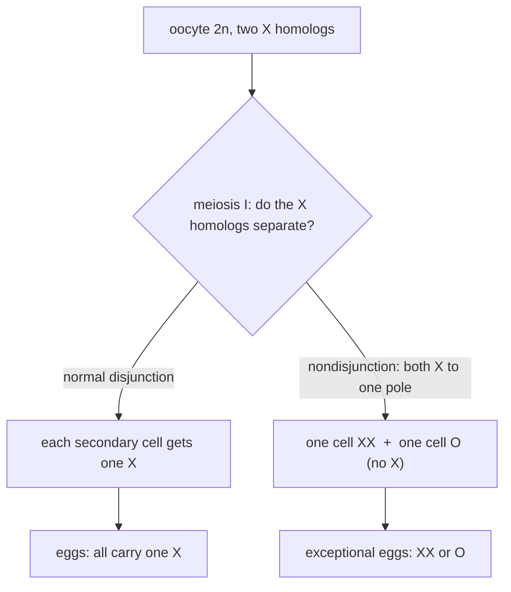
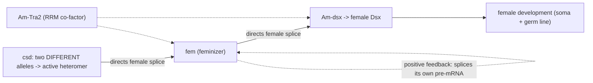
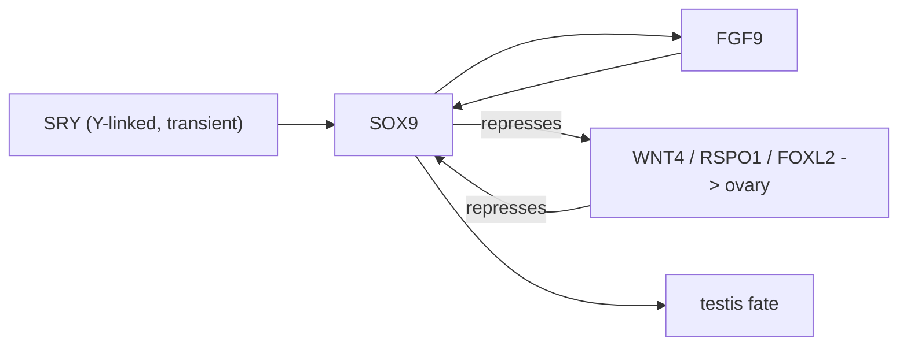
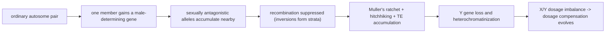

# 염색체와 성 결정

**강의:** BME333 / BIO333 유전학 (UNIST, 2026 가을) · 5강 · ~60분
**강의계획서:** [← 강의계획서](../../lectures/2026.BME333-BIO333-Syllabus.md) — 3주차 월, 09-14
**언어:** [English](../../en/lectures/lec05_Chromosomes-Sex-Determination.md) · 한국어

## 학습 목표
이 강의를 마치면 학생들은 다음을 할 수 있어야 한다:
- 유전의 염색체설(chromosome theory of heredity)을 설명하고 그것을 확립한 관찰적·유전학적 증거를 인용할 수 있다(Sutton, Boveri, Bridges).
- 감수분열의 염색체 행동(분리, 독립조합)을 멘델 법칙과 연관지을 수 있다.
- 비분리(nondisjunction)가 어떻게 이수성(aneuploidy)을 만드는지, 그리고 Bridges가 이를 사용하여 유전자가 염색체에 있음을 어떻게 증명했는지 기술할 수 있다.
- 주요 성 결정 체계(XX/XY, ZZ/ZW, 반수이배성, 환경성)를 비교하고 그 기전이 진화적으로 왜 유동적인지 설명할 수 있다.
- 성염색체가 어떻게 기원하고, 퇴화하며, 용량보상(dosage compensation)과 유전자 조절 적응을 이끄는지 개괄할 수 있다.

## 강의

### 1. 멘델에서 염색체로 (~8분)

멘델의 "인자(factors)"는 추상적 개념이었다 — 그는 그것들을 운반하는 물리적 실체가 무엇인지 전혀 몰랐다. 1900년대 초의 위대한 종합은 그의 인자들이 세포학자들이 현미경 아래에서 분열하는 것을 지켜본 실 모양의 물체인 **염색체(chromosomes)**에 실려 있다는 것을 깨달은 것이었다. 그 증거는 *평행성(parallelism)*이었다. 염색체는 감수분열에서 멘델 법칙이 그의 인자에게 요구하는 것과 *정확히* 똑같이 행동한다.

두 세포분열을 상기하라. **체세포분열(mitosis)**은 세포를 충실하게 복제한다. 각 딸세포는 완전한 이배체(2n) 세트를 얻는다. **감수분열(meiosis)**은 배우자를 만들며 두 번의 분열에 걸쳐 두 가지 특별한 일을 한다. **감수분열 I**에서는 **상동염색체(homologous chromosomes)**(각 쌍의 모계 사본과 부계 사본)가 짝을 이룬 다음 반대 극으로 *분리*된다 — 이것이 염색체 수를 2n에서 n으로 반감시키는 **환원분열(reductional division)**이다. **감수분열 II**에서는 자매염색분체(sister chromatids)가 분리된다(체세포분열처럼). Walter Sutton이 처음 주장한 결정적 요점은, 상동염색체 쌍(**이가염색체, bivalents**)이 감수분열 I 적도판에 정렬할 때 **각 쌍이 독립적이고 무작위로 배향한다**는 것이다 — 1번 쌍의 모계 염색체는 2번 쌍이 어느 방향을 향하든 상관없이 어느 극이든 향할 수 있다.

**그림 — 감수분열은 멘델의 두 법칙을 물리적으로 구현한다.**

| 멘델의 법칙 (3강) | 그것을 만들어내는 감수분열 행동 |
|---|---|
| **분리(segregation)** — 두 대립유전자가 분리되어 배우자당 하나씩 | 상동염색체가 **감수분열 I**에서 분리; 각 배우자는 각 쌍의 상동염색체 하나를 얻음 |
| **독립조합(independent assortment)** — 서로 다른 유전자의 대립유전자가 독립적으로 조합 | 서로 다른 **이가염색체가 무작위로 배향**함, 감수분열 I 판에서 서로 독립적으로 |
| 무한한 유전적 변이 | **n**개의 쌍이면 **2ⁿ**개의 염색체적으로 구별되는 배우자가 가능(Sutton의 계산) |

그 마지막 행은 Sutton 자신의 산술이다: 인간(n = 23)의 경우 독립조합만으로도 재조합 이전에 2²³ ≈ 840만 종의 배우자 유형이 나온다. 감수분열이 기전이고, 멘델의 비율은 그 통계적 그림자다.

### 2. 유전의 염색체설 (~12분)

이 이론에는 독립적으로 도달한 두 아버지가 있다. **Walter S. Sutton**은 컬럼비아 대학교 **Edmund B. Wilson**의 실험실 대학원생으로, 큰 메뚜기 *Brachystola magna*의 정자형성을 연구했다. 놀랍게도 그는 자신이 *멘델의 연구를 알기 전에 순전히 세포학으로부터* 논문의 일반적 착상에 도달했다고 진술한다 — 이는 그 수렴을 더욱 설득력 있게 만든다([en](../../en/article/Sutton1903_BiolBull_Chromosomes-Heredity.md) · [ko](../../ko/article/Sutton1903_BiolBull_Chromosomes-Heredity.md) 참조). 다섯 가지 세포학적 관찰 — 생식세포 염색체가 두 개의 대등한(모계와 부계) 계열을 이루고, 상동염색체가 접합(synapsis)에서 크기별로 짝을 이루며, 분열이 그 쌍들을 분리하고, 각 염색체가 분열을 거쳐 자신의 개별성을 유지한다는 것 — 으로부터 Sutton은 **이가염색체의 무작위 배향**이 두 멘델 법칙 모두의 물리적 기반이라고 추론했다. 그는 단순한 재진술을 넘어섰다: Boveri를 인용하며 그는 각 염색체가 *질적으로 구별되는* 유전적 잠재력 세트를 운반한다고 주장했고, **유전적 연관(genetic linkage)**을 **예측**했다 — 한 염색체 위의 모든 인자는 함께 유전되어야 한다는 것을 Morgan 그룹이 확인하기 꼬박 10년 전에.

평행하고 실험적인 사례는 **Theodor Boveri**(1862–1915)가 그의 협력자이자 아내인 **Marcella O'Grady Boveri**와 함께 *Ascaris* 회충과 성게로 작업하며 세웠다([en](../../en/review/Satzinger2008_NatRevGenet_Boveri-Chromosomes.md) · [ko](../../ko/review/Satzinger2008_NatRevGenet_Boveri-Chromosomes.md) 참조). Boveri의 **1889년 메로고니(merogony) 실험** — 핵을 제거한 난자 조각을 *다른* 종의 정자로 수정시켜 *부계* 형질을 지닌 유생을 얻은 것 — 은 세포질이 아니라 핵이 유전을 운반함을 보였다. **염색체 개별성(chromosomal individuality)**에 대한 그의 가장 우아한 증명은 **다정자수정(dispermy/polyspermy) 실험**이었다: *두* 정자에 의해 수정된 성게 난자는 네 개의 중심체와 두 개의 방추사를 형성하므로, 염색체가 딸세포들 사이에 *불균등하게* 분배된다. 그 결과 유생들은 가능한 염색체 조합의 확률 열거와 일치하는 양상으로 기형이었다 — 중요한 것은 염색질의 *양*이 아니라 18개 염색체 각각의 *특정한 정체성*이었음을 증명한 것이다. Boveri의 1904년 논저는 우리가 지금 **Sutton–Boveri 유전의 염색체설**이라 부르는 것을 정식화했다. (그는 또한 1914년에 암이 염색체 결함을 가진 세포에서 생긴다고 제안했다 — 현대 암 유전체학이 입증한 선견지명 있는 가설이다.)

이 이론은 **즉시** 받아들여지지 *않았다* — 이 강의에서 반복되는 교훈이다. **Thomas Hunt Morgan** 자신도 수년간 이를 거부했는데, **혼합유전(blending inheritance)** 전통과 보이지 않는 입자를 불신하는 경험주의적 "Entwicklungsmechanik"(발생역학) 철학에 젖어 있었기 때문이다([en](../../en/review/Benson2001_NatRevGenet_Morgan-Chromosome.md) · [ko](../../ko/review/Benson2001_NatRevGenet_Morgan-Chromosome.md) 참조). Morgan은 유명하게도 자신이 "모든 것을 염색체로 귀속시키는 이 모든 현대적 방식에 공감하지 않는다"고 불평했고 "염색체산과 청색 염료로 포화된 분위기" 속에 살았다고 했다. 그를 전향시킨 것은 그 자신의 **1910년 *Drosophila* 흰눈(white-eye) 돌연변이 발견**이었다: 그 유전은 유전자가 성(X) 염색체 위에 있어야만 말이 되었다. 1915년까지 Morgan, Sturtevant, Muller, Bridges는 유전자를 염색체 위에 지도화한 *The Mechanism of Mendelian Heredity*를 출판했다.

창시자들조차 가르칠 가치가 있는 실수를 저질렀다. Hegreness와 Meselson은 Sutton이 **어느 감수분열 분열이 환원적인지 잘못 파악했음**을 보인다 — 그는 두 번째 분열이라고 생각했지만 실제로는 **감수분열 I**(상동염색체 분리)이 환원적이다([en](../../en/review/Hegreness2007_Genetics_Sutton+ChromosomeTheory.md) · [ko](../../ko/review/Hegreness2007_Genetics_Sutton+ChromosomeTheory.md) 참조). **Eleanor Carothers**가 **1913년**에 *이형(heteromorphic, 눈에 띄게 불균등한)* 이가염색체를 두 분열 내내 추적하여 이를 바로잡았지만, 그 혼동은 1930년대까지 교과서에 남아 있었다. 염색체설은 단 하나의 깔끔한 통찰이 아니라 지저분하고 반복적인 수정에 의해 세워졌다.

### 3. 유전학적 증명: 비분리 (~12분)

상관관계는 증명이 아니다. 염색체와 유전자는 비슷하게 *행동*했지만, 회의론자들은 여전히 "세포 전체"가 유전을 전달한다고 말할 수 있었다. **Calvin B. Bridges**는 **1916년**, 저널 *Genetics*의 *창간호*에서 감수분열의 *오류*를 이용하여 특정 유전자를 특정 염색체에 못박음으로써 이 간극을 메웠다([en](../../en/article/Bridges1916_Genetics_NonDisjunction-SexChromosome.md) · [ko](../../ko/article/Bridges1916_Genetics_NonDisjunction-SexChromosome.md) 참조).

그 도구는 **비분리(nondisjunction)** — 염색체 쌍이 올바르게 분리되지 못하는 것 — 다. *Drosophila* 암컷의 두 X 염색체가 감수분열 I에서 분리에 실패하면, 그 암컷은 비정상 난자를 만든다: 일부는 **두 개의 X(XX)**를 지니고, 다른 일부는 **X가 없다(O)**.

**그림 — 감수분열 I에서의 정상 분리 대 비분리 (XX 암컷 생식세포).**

이제 **일차 비분리(primary nondisjunction)**를 겪는 **버밀리언(vermilion, X 연관 열성)** 암컷을 **야생형 수컷**(그 정자는 X 또는 Y를 지님)과 교배한다. 네 가지 수정 결과는 다음과 같다:

**그림 — Bridges의 교배: 예외적 자손은 역전된 성 연관 유전을 나타낸다.**

|  | **XX egg** (어머니의 X 둘 다) | **O egg** (X 없음) |
|---|---|---|
| **X sperm** (아버지의) | XXX — 초암컷(metafemale), 대개 죽음 | XO — **수컷, 불임** |
| **Y sperm** (아버지의) | XXY — **암컷, 임성** | OY — 죽음 (X가 전혀 없음) |

그 예측은 놀랍고 정상적인 성 연관 유전과 *반대*다: 살아남은 **XXY 딸은 어머니의 X만을 지니므로** **버밀리언**(모계형 matroclinous — 어머니를 닮음)이고, **XO 아들은 아버지의 X를 지니므로** **야생형**(부계형 patroclinous — 아버지를 닮음)이다. Bridges는 정확히 이것을 관찰했다. 이 **예외적** 파리들은 그들의 *염색체 구성*(세포학적으로 확인됨)과 *성 연관 표현형* 사이에 엄격한 동일성을 보이는 반면 그들의 **상염색체(autosomal)** 유전자는 양친으로부터 정상적으로 유전되었으므로, 유일하게 가능한 결론은 성 연관 유전자가 *물리적으로 X 염색체 위에 있다*는 것이다. 이것이 "규칙을 증명하는 예외"다.

Bridges는 이를 정량적으로도 만들었다: 임성 있는 **XXY 암컷**은 약 **4.3%**의 비율로 추가적(**이차, secondary**) 비분리를 만드는데, 이는 그가 X–Y 짝짓기(이형접합, heterosynapsis, 약 16.5%)의 빈도로부터 *유도*하고 수만 마리의 파리에 걸쳐 확인한 수치다. 그의 연구는 또한 **성염색체 이수체(aneuploids)**에 대한 최초의 체계적 기술을 만들어냈다 — 인간 임상 세포유전학의 직접적 조상이다.

### 4. 인간 염색체 수와 핵형 (~6분)

염색체가 그렇게 중요하다면 우리 자신의 것을 정확히 세었으리라 생각할 것이다. 그러지 못했다 — 30년 넘게 교과서의 인간 수는 **48**이었는데, Theophilus Painter가 1923년에 조악한 파라핀 절편으로부터 확립한 것이었다(그 자신의 최상의 표본은 46을 보였지만 그는 기대에 따랐다). **1956년**에 이르러서야 **Joe Hin Tjio와 Albert Levan**이 이를 바로잡았다: **46**([en](../../en/review/Gartler2006_NatRevGenet_HumanChromosomeNumber.md) · [ko](../../ko/review/Gartler2006_NatRevGenet_HumanChromosomeNumber.md) 참조). 그들의 돌파구는 통찰이 아니라 **기법**이었다 — **저장액 충격(hypotonic shock)**(세포를 부풀리고 염색체를 펼침)에 **콜히친(colchicine)**(세포를 중기에 정지시킴)을 더해 배양한 태아세포로부터 "사진처럼 완벽한" 전개를 얻었다. Ford와 Hamerton은 같은 해에 독립적으로 46을 확인했다. Gartler의 교훈은 진정한 기술적 한계와 **인지 편향("선입견, preconception")**의 혼합이다 — 권위가 정당한 도전을 수십 년간 억눌렀다.

그 수정은 학문적인 것에 그치지 않았다. **3년** 안에 새로운 세포유전학은 주요 증후군의 염색체적 기반을 밝혔다:

**그림 — 수가 확정된 후 발견된 인간 이수성 (모두 비분리를 통해).**

| 핵형 | 상태 | 성염색체 / 상염색체 변화 |
|---|---|---|
| 47, +21 | **다운 증후군** (Lejeune 1959) | 상염색체 21번 삼염색체성 |
| 45,X | **터너 증후군** | 단일 X (일염색체성) |
| 47,XXY | **클라인펠터 증후군** | 수컷에서 여분의 X |
| 47,XYY | XYY | 여분의 Y |

모두 **비분리**로 생긴다 — Bridges가 파리에서 해부한 바로 그 기전 — 그리고 의학 세포유전학(이후 염색체 **띠염색, banding**, Caspersson, 1960년대 후반)이 탄생했다.

### 5. 성 결정 체계 (~12분)

포유류는 "수컷 = Y 염색체"가 보편적이라고 생각하게 만든다. 그렇지 않다. 동물과 식물 전반에 걸쳐 진화는 개체를 성별로 분류하는 놀랄 만큼 **다양한** 방식을 발명했다 — 그리고 그것들 사이를 놀랍도록 자주 바꾼다([en](../../en/review/Bachtrog2014_PLoSBiol_SexDetermination-ManyWays.md) · [ko](../../ko/review/Bachtrog2014_PLoSBiol_SexDetermination-ManyWays.md) 참조).

**그림 — 주요 성 결정 체계.**

| 체계 | 이형배우자성(heterogametic) 성 | 일차 방아쇠 | 예 |
|---|---|---|---|
| **XX / XY** | 수컷 (XY) | Y 연관 **SRY**(포유류); *Drosophila*의 **X:상염색체 비율**(그 Y는 스위치가 *아님*) | 포유류, 초파리 |
| **ZZ / ZW** | 암컷 (ZW) | Z 위 **DMRT1** 용량 | 조류, 나비목, 뱀 |
| **반수이배성(Haplodiploidy) / CSD** | (미수정란에서 나온 반수체 수컷) | ***csd* 좌위의 이형접합성** | 꿀벌, 개미, 말벌 |
| **환경성 (TSD/ESD)** | 없음 | 부화 **온도** 또는 사회적 신호 | 모든 악어, 대부분의 거북, 많은 어류 |
| **다유전자성(Polygenic)** | 가변적 | 작은 효과의 많은 좌위, 마스터 스위치 없음 | 제브라피시, 일부 어류 |

Bachtrog와 동료들은 세 가지 "신화"를 무너뜨린다: 성염색체가 보편적이고 안정적이라는 것(온도와 심지어 *Wolbachia* 세균이 많은 종에서 그것을 무효화한다), 항상 단일 마스터 스위치가 있다는 것(*누에*는 W 유래 piRNA인 *Fem*을 사용하여 Z 연관 *Masc*를 침묵시킨다; 제브라피시는 다유전자성이다), 그리고 성염색체가 필연적으로 퇴화한다는 것(약 1억 4천만 년 전의 비단뱀과 약 1억 2천만 년 전의 주금류 조류는 포유류 XY(약 1억 8천만 년 전)에 거의 맞먹는 오래된 *동형(homomorphic)* 성염색체를 유지한다). 그러나 이 모든 다양성을 관통하여 **하류(downstream)** 기계장치는 보존되어 있다: **DM 도메인(*doublesex/mab-3*) 전사인자**는 꼭대기에서 반복적으로 재배선되는 공유된 "도구모음(toolkit)"이다.

**사례연구 — 꿀벌의 상보적 성 결정(complementary sex determination, CSD).** *Apis mellifera*에서 미수정(반수체) 알은 *보통* 수컷이 되고 수정(이배체) 알은 암컷이 된다 — 그러나 배수성이 진짜 신호는 아니다. 진짜 신호는 단일 좌위 ***csd***(complementary sex determiner)에서의 **대립유전자 구성**이다: *csd*에서 **이형접합**인 개체는 암컷이 되고, **반접합(hemizygous, 반수체)**이거나 **동형접합(근친교배 이배체)**인 개체는 수컷이 된다([en](../../en/article/Beye2003_Cell_Honeybee-SexDetermination.md) · [ko](../../ko/article/Beye2003_Cell_Honeybee-SexDetermination.md) 참조). Beye 등(2003)은 *csd*를 위치 클로닝하여 그것이 두 *서로 다른* 사본이 존재하는지 대립유전자가 "인식"하게 하는 **초가변 영역(hypervariable region)**을 지닌 SR형 단백질을 암호화함을 보였다. *csd*의 RNAi 넉다운은 유전적 암컷의 92%를 수컷으로 바꾸었다. 그 경로는 이후 시리즈의 논문들에 의해 완성되었다:

**그림 — 꿀벌 csd → fem → dsx 캐스케이드.**

- **Hasselmann 등(2008)**은 ***fem***이 불과 12 kb 상류에 있음을 발견하고 *csd*가 꿀벌 계통 내에서 ***fem*의 유전자 중복(gene duplication)**으로 생겨났음을 보였다(침 없는 벌/뒤영벌과 분기한 약 7천만 년 전 이후, *Apis* 종들이 분기한 약 1천만 년 전 이전에), 그 후 **강한 양성 선택(positive selection)** 아래에서 분기했다 — 오래된 유전자로부터 캐스케이드 꼭대기의 *새로운* 유전자가 만들어지는 깔끔한 예다([en](../../en/article/Hasselmann2008_Nature_Honeybee-SexDetermination.md) · [ko](../../ko/article/Hasselmann2008_Nature_Honeybee-SexDetermination.md) 참조).
- **Gempe 등(2009)**은 **유도(induction)**(이형접합 CSD가 암컷 *fem* 스플라이싱을 촉발)와 **유지(maintenance)**(Fem 단백질이 *자신의* 전사체를 **양성 피드백 고리(positive feedback loop)**로 스플라이싱하여, *csd*가 침묵한 후에도 암컷 운명을 고정)를 분리했다. 수컷 스플라이싱은 신호가 필요 없는 **기본값(default)**이다([en](../../en/article/Gempe2009_PLoSBiol_Honeybee-SexDetermination.md) · [ko](../../ko/article/Gempe2009_PLoSBiol_Honeybee-SexDetermination.md) 참조).
- **Nissen 등(2012)**은 빠져 있던 RNA 결합 보조인자 **Am-Tra2**(CSD와 Fem에는 RRM이 없다)를 규명했는데, 이는 *fem*과 *Am-dsx* 둘 다의 암컷 스플라이싱에 필요하다([en](../../en/article/Nissen2012_Genetics_Honeybee-SexDetermination.md) · [ko](../../ko/article/Nissen2012_Genetics_Honeybee-SexDetermination.md) 참조).

**사례연구 — 이중안정 스위치로서의 척추동물 생식샘.** 척추동물에서 초기 생식샘은 **양능성(bipotential)**이다 — 정소 *또는* 난소가 될 수 있다. Alfred Jost의 고전적 토끼 생식샘 절제 실험은 일차 성 결정이 *생식샘*의 결정이며, 이것이 이후 호르몬을 통해 나머지 모두를 이끈다는 것을 보였다([en](../../en/review/Capel2017_NatRevGenet_VertebrateSexDetermination.md) · [ko](../../ko/review/Capel2017_NatRevGenet_VertebrateSexDetermination.md) 참조). 포유류에서 Y 연관 **SRY**는 **SOX9**를 활성화하여 균형을 기울이고, SOX9는 **FGF9**와 자기강화 고리를 형성하는 한편 암컷 네트워크(**WNT4 / RSPO1 / FOXL2**)를 *억압*한다. 두 네트워크는 하나가 이길 때까지 상호 길항한다 — **이중안정(bistable)** 스위치다.

**그림 — 포유류 생식샘 결정에서의 상호 길항.**

이 동일한 역치 논리가 그 체계의 **가소성(plasticity)**을 설명한다: 게코 조사에서 XX/XY, ZZ/ZW, TSD 사이에 적어도 **25번의 진화적 전이**가 발견되었다. 도마뱀 *Pogona vitticeps*에서는 높은 부화 온도에서의 한 세대가 W 염색체를 제거하고 유전적(GSD) 집단을 온도 의존적(TSD) 성으로 뒤집을 수 있다 — 극명한 기후변화 경고다. 어류는 유연성의 챔피언이다: **연속적 자웅동체(sequential hermaphroditism, 성체의 성 전환)**가 적어도 **27개 진골어류 과(family)**에서 독립적으로 진화했으며, 성체 포유류에서조차 그 결정은 *능동적으로 유지*되어야 한다 — 성체 정소세포에서 *Dmrt1*을 결실시키면 *Foxl2*가 탈억압되어 정소가 난소 쪽으로 부분적으로 전환분화(transdifferentiate)한다(그 반대도 마찬가지).

### 6. 성염색체 진화와 용량 (~10분)

이형성 성염색체(큰 X, 위축된 Y)는 어디서 오며, 왜 Y는 그렇게 유전자가 빈약한가? 표준 모델은 쇠퇴의 생활사다([en](../../en/review/Bachtrog2013_NatRevGenet_Y-chromosomeEvolution.md) · [ko](../../ko/review/Bachtrog2013_NatRevGenet_Y-chromosomeEvolution.md) 참조):

**그림 — Y 염색체의 탄생과 퇴화.**

수컷 결정 유전자가 나타나면, **성적 길항(sexually antagonistic)** 대립유전자(수컷에게 좋고 암컷에게 나쁜)가 그 근처에 축적되어 원시-X와 원시-Y 사이의 **재조합 억제(suppression of recombination)**를 선호한다. 재조합하지 않는 Y는 그러면 세 가지 집단유전학적 힘의 먹잇감이 된다: **Muller의 깔쭉톱니(Muller's ratchet)**(유한한 비재조합 영역에서의 비가역적 돌연변이 축적), **유전적 편승(genetic hitchhiking)**, 그리고 **"쓰레기 속의 루비(ruby-in-the-rubbish)"** 효과(좋은 돌연변이가 나쁜 것에 사슬로 묶여 상실됨). 그 결과는 극적인 유전자 상실이다: 인간 Y에는 단백질 암호화 유전자가 약 **78개**뿐인데 X에는 약 **800개**가 있고, *Drosophila*의 Y에는 겨우 약 **13개**가 있다. 서로 다른 나이의 비교용 "신생-Y(neo-Y)" 염색체(*D. albomicans* 약 0.1 Mya, *D. miranda* 약 1 Mya, *D. pseudoobscura* 약 15 Mya)는 우리가 이것을 거의 실시간으로 지켜보게 해주며 — **전사 침묵이 암호서열 쇠퇴에 선행할 수 있음**을 드러낸다(*D. albomicans* 신생-Y 유전자의 약 30%가 서열 손상은 거의 없이 이미 하향조절됨). Shaw와 White의 **"조절 진화에 의한 퇴화(degeneration by regulatory evolution, DRE)"** 모델은 이를 정식화한다: *cis*-조절 돌연변이, 전이인자/이질염색질 확산, DNA 메틸화가 Y 발현을 *먼저* 낮추고, 이것이 다시 암호서열에 대한 선택을 완화한다([en](../../en/review/ShawWhite2022_TrendsGenet_SexChromosome-GeneRegulation.md) · [ko](../../ko/review/ShawWhite2022_TrendsGenet_SexChromosome-GeneRegulation.md) 참조).

중요하게도, 쇠퇴는 멸종으로 가는 **일방통행**이 *아니다*: 이론은 Y가 비워질수록 유전자 상실이 *감속*한다고 예측하며, 인간 Y는 **약 2,500만 년 동안 안정적**이었다 — 대중적인 "Y가 사라지고 있다"는 표제는 뒷받침되지 않는다. 식물 Y 염색체(예: *Silene latifolia*, Y 유전자의 80% 이상이 여전히 기능함)는 더 천천히 퇴화하는데, 아마도 **꽃가루에서의 반수체 선택(haploid selection in pollen)**이 해로운 대립유전자를 노출시키기 때문일 것이다. Furman 등은 "깔끔한" 선형 모델이 유익한 **예외**들로 가득하다고 강조한다 — Y로 차용된 B 염색체, *Wolbachia* 유래 W, 재조합 억제를 *일으키기보다 뒤따르는* 역위, 그리고 빈번한 **교체(turnover)** — 그래서 그 과정은 직선이라기보다 순환적 탄생–죽음으로 보는 것이 낫다([en](../../en/review/Furman2020_GBE_SexChromosome-ManyExceptions.md) · [ko](../../ko/review/Furman2020_GBE_SexChromosome-ManyExceptions.md) 참조).

Y 유전자를 잃으면 **용량 문제(dosage problem)**가 생긴다: 그렇지 않으면 XX 암컷은 XY 수컷의 두 배에 달하는 X 유전자 산물을 만들 것이다. 해결책은 다양하다([en](../../en/review/Graves2015_NatRevGenet_SexChromosome-Evolution.md) · [ko](../../ko/review/Graves2015_NatRevGenet_SexChromosome-Evolution.md) 참조): 진수류(eutherian) 포유류는 **XIST lncRNA**를 통해 X 하나 전체를 침묵시킨다(거의 염색체 전체, 거의 완전). 유대류는 수렴적이고 무관한 lncRNA **RSX**를 사용하여 부분적이고 항상 부계인 불활성화를 한다. 단공류(monotremes, X가 다섯 개!)는 전역적으로 거의 보상하지 않는다. 조류는 부분적으로만, 그리고 **유전자별로(gene-by-gene)** 보상한다(ZZ 수컷은 *MHM* 좌위 근처를 제외하면 ZW 암컷보다 Z 유전자를 약 30~40% 더 높게 발현한다). Jennifer Graves는 이 누더기를 **"멍청한 설계(dumb design)"**라 부른다 — 공학으로서는 무의미하고, 오직 진화의 역사로서만 말이 된다.

마지막으로, 성염색체는 **종분화(speciation)**로 되돌아 연결된다. **Haldane의 규칙(Haldane's Rule, 1922)**은 종 잡종의 한쪽 성이 없거나 드물거나 불임일 때 그것은 **이형배우자성** 성이라고 진술한다 — 포유류/*Drosophila*(XY)에서는 잡종 *수컷*이, 조류/나비(ZW)에서는 잡종 *암컷*이 고통받는다([en](../../en/review/Laurie1997_Genetics_Haldane+Heterogametic.md) · [ko](../../ko/review/Laurie1997_Genetics_Haldane+Heterogametic.md) 참조). 주요 설명은 **우성 이론(dominance theory)**(Muller 1942; Orr–Turelli 1995: X 연관 불화합성은 부분적으로 열성이므로, 반접합인 이형배우자성 성은 완충되지 않음)과 **더 빠른 수컷 이론(faster-male theory)**(Wu–Davis 1993: 잡종 수컷 불임 인자는 성 선택과 정자형성의 특이성에 의해 약 10배 빠르게 진화함)이다. 둘 다 성염색체 생물학을 생식 장벽을 세우는 **Dobzhansky–Muller 불화합성(incompatibilities)**과 연결한다 — 이후 강의의 집단·종분화 유전학으로 넘어가는 다리다.

## 핵심 정리
- **감수분열은 멘델 법칙 뒤의 기전이다:** 감수분열 I에서의 상동염색체 분리 = 분리; 이가염색체의 무작위 배향 = 독립조합; **n**개의 쌍이 **2ⁿ**개의 배우자 유형을 준다.
- **Sutton–Boveri 염색체설**(1902–1904)은 세포학적 *평행성*과 Boveri의 **염색체 개별성**에 대한 다정자수정 증명에 기반했다. Morgan조차 자신의 **1910년 흰눈** X 연관 결과가 나올 때까지 이를 거부했다. Sutton은 감수분열 II가 환원적이라고 잘못 생각했고, Carothers(1913)가 이를 바로잡았다.
- **Bridges(1916)**는 *Drosophila*의 **X 비분리**(모계형 XXY 딸, 부계형 XO 아들)를 사용하여 유전자가 물리적으로 염색체에 있음을 증명했다 — "규칙을 증명하는 예외"이자 인간 이수성 과학의 기원(45,X, 47,XXY, 47,+21)이다.
- **인간 염색체 수**는 30년 넘게 틀렸고(48) Tjio & Levan(1956)이 저장액 충격 + 콜히친을 사용하여 **46**을 얻을 때까지 그러했다 — 기법과 선입견에 대한 교훈.
- **성 결정은 다양하고 유동적이다:** XX/XY(SRY), ZZ/ZW(DMRT1), 반수이배성 **CSD**(꿀벌 *csd → fem → Am-dsx*, *csd*는 *fem*에서 새로 중복됨), 그리고 온도/환경 체계 — 모두 보존된 **doublesex/DM** 도구모음과 **이중안정** 생식샘 스위치(SOX9/FGF9 대 WNT4/FOXL2)로 수렴한다.
- **Y 염색체는 퇴화한다** — 재조합 억제 후(Muller의 깔쭉톱니, 편승, 전이인자; 조절 쇠퇴가 암호 쇠퇴에 선행할 수 있음) — **용량보상** 해결책(XIST, RSX, 부분적 조류 보상)을 만들어낸다. 인간 Y는 사라지는 것이 아니라 *안정적*이다. **Haldane의 규칙**은 이형배우자성을 잡종 기능장애 및 종분화와 연결한다.

## 교재 참고
- **Genetics: From Genes to Genomes (8e)** — Ch. 3 Chromosomes & Inheritance; Ch. 4 Sex Chromosomes. → [교재 참고](../../lectures/ref.Genetics-FromGenesToGenomes.md)

## 이 저장소의 노트
수업에서 소개할 리뷰와 논문(각각 en/ko 이중언어 쌍이 있음):
- `Sutton1903_BiolBull_Chromosomes-Heredity` — 염색체를 멘델 유전의 물리적 기반으로 제안한 창시 논문. · [en](../../en/article/Sutton1903_BiolBull_Chromosomes-Heredity.md) · [ko](../../ko/article/Sutton1903_BiolBull_Chromosomes-Heredity.md)
- `Hegreness2007_Genetics_Sutton+ChromosomeTheory` — Sutton이 염색체설을 어떻게 세웠는지에 대한 회고; 역사적 추론 토론에 좋음. · [en](../../en/review/Hegreness2007_Genetics_Sutton+ChromosomeTheory.md) · [ko](../../ko/review/Hegreness2007_Genetics_Sutton+ChromosomeTheory.md)
- `Satzinger2008_NatRevGenet_Boveri-Chromosomes` — Boveri의 평행적 기여와 염색체의 개별성. · [en](../../en/review/Satzinger2008_NatRevGenet_Boveri-Chromosomes.md) · [ko](../../ko/review/Satzinger2008_NatRevGenet_Boveri-Chromosomes.md)
- `Benson2001_NatRevGenet_Morgan-Chromosome` — Morgan의 *Drosophila* 학파와 성 연관이 어떻게 이론을 굳혔는지. · [en](../../en/review/Benson2001_NatRevGenet_Morgan-Chromosome.md) · [ko](../../ko/review/Benson2001_NatRevGenet_Morgan-Chromosome.md)
- `Bridges1916_Genetics_NonDisjunction-SexChromosome` — 유전자가 염색체에 실려 있음을 보인 고전적 비분리 증명. · [en](../../en/article/Bridges1916_Genetics_NonDisjunction-SexChromosome.md) · [ko](../../ko/article/Bridges1916_Genetics_NonDisjunction-SexChromosome.md)
- `Gartler2006_NatRevGenet_HumanChromosomeNumber` — 인간 염색체 수에 대한 경고성 이야기; 기대가 어떻게 관찰을 편향시켰는가. · [en](../../en/review/Gartler2006_NatRevGenet_HumanChromosomeNumber.md) · [ko](../../ko/review/Gartler2006_NatRevGenet_HumanChromosomeNumber.md)
- `Bachtrog2014_PLoSBiol_SexDetermination-ManyWays` — 생명의 나무 전반에 걸친 성 결정 기전의 파노라마적 조사. · [en](../../en/review/Bachtrog2014_PLoSBiol_SexDetermination-ManyWays.md) · [ko](../../ko/review/Bachtrog2014_PLoSBiol_SexDetermination-ManyWays.md)
- `Capel2017_NatRevGenet_VertebrateSexDetermination` — 척추동물 생식샘 결정의 분자 논리(SRY/Sox9 대 Foxl2). · [en](../../en/review/Capel2017_NatRevGenet_VertebrateSexDetermination.md) · [ko](../../ko/review/Capel2017_NatRevGenet_VertebrateSexDetermination.md)
- `Bachtrog2013_NatRevGenet_Y-chromosomeEvolution` — 재조합이 억제된 후 왜 Y 염색체가 쇠퇴하는가. · [en](../../en/review/Bachtrog2013_NatRevGenet_Y-chromosomeEvolution.md) · [ko](../../ko/review/Bachtrog2013_NatRevGenet_Y-chromosomeEvolution.md)
- `Graves2015_NatRevGenet_SexChromosome-Evolution` — 성염색체의 진화와 교체; 비교 관점에서 본 포유류 Y. · [en](../../en/review/Graves2015_NatRevGenet_SexChromosome-Evolution.md) · [ko](../../ko/review/Graves2015_NatRevGenet_SexChromosome-Evolution.md)
- `Furman2020_GBE_SexChromosome-ManyExceptions` — 표준 성염색체 모델에 대한 많은 예외. · [en](../../en/review/Furman2020_GBE_SexChromosome-ManyExceptions.md) · [ko](../../ko/review/Furman2020_GBE_SexChromosome-ManyExceptions.md)
- `ShawWhite2022_TrendsGenet_SexChromosome-GeneRegulation` — 성염색체가 어떻게 유전자 조절과 용량을 재편하는가. · [en](../../en/review/ShawWhite2022_TrendsGenet_SexChromosome-GeneRegulation.md) · [ko](../../ko/review/ShawWhite2022_TrendsGenet_SexChromosome-GeneRegulation.md)
- `Beye2003_Cell_Honeybee-SexDetermination` — 꿀벌 *csd* 상보적 성 결정 인자의 규명. · [en](../../en/article/Beye2003_Cell_Honeybee-SexDetermination.md) · [ko](../../ko/article/Beye2003_Cell_Honeybee-SexDetermination.md)
- `Gempe2009_PLoSBiol_Honeybee-SexDetermination` — 벌에서의 *csd → fem → dsx* 조절 캐스케이드. · [en](../../en/article/Gempe2009_PLoSBiol_Honeybee-SexDetermination.md) · [ko](../../ko/article/Gempe2009_PLoSBiol_Honeybee-SexDetermination.md)
- `Hasselmann2008_Nature_Honeybee-SexDetermination` — 상보적 성 결정 좌위의 진화. · [en](../../en/article/Hasselmann2008_Nature_Honeybee-SexDetermination.md) · [ko](../../ko/article/Hasselmann2008_Nature_Honeybee-SexDetermination.md)
- `Nissen2012_Genetics_Honeybee-SexDetermination` — *csd* 대립유전자 다양성과 기능의 유전학적 해부. · [en](../../en/article/Nissen2012_Genetics_Honeybee-SexDetermination.md) · [ko](../../ko/article/Nissen2012_Genetics_Honeybee-SexDetermination.md)
- `Laurie1997_Genetics_Haldane+Heterogametic` — Haldane의 규칙과 이형배우자성 성; 성염색체를 잡종 생존불능/불임과 연결한다. · [en](../../en/review/Laurie1997_Genetics_Haldane+Heterogametic.md) · [ko](../../ko/review/Laurie1997_Genetics_Haldane+Heterogametic.md)

## 토론 문제
1. 감수분열에서 염색체 행동은 멘델 법칙을 "평행"한다. 분리와 독립조합을 특정 감수분열 사건에 대응시키고, Sutton이 환원분열을 잘못 파악한 것(Carothers가 바로잡음)이 왜 그의 전체 논증을 무효화하지 않았는지 설명하라.
2. Bridges는 비분리를 "규칙을 증명하는 예외"라 불렀다. 버밀리언 암컷 × 야생형 수컷 교배를 그리고, 왜 XXY 딸이 모계형이고 XO 아들이 부계형인지 설명하며, 이것이 왜 염색체설에 대한 "세포 전체" 대안을 정확히 배제하는지 논하라.
3. 꿀벌은 염색체 용량이나 Y 연관 유전자가 아니라 *csd*에서의 *대립유전자 구성*으로 성을 결정한다. 이를 포유류 SRY 및 *Drosophila* X:A와 대조하라. *fem*으로부터의 중복(양성 선택 아래)에 의한 *csd*의 기원은 새로운 성 결정 유전자가 어떻게 생겨나는지에 대해 무엇을 가르치는가?
4. 성 결정 기전은 빠르게 교체되는(게코에서 25번 이상의 전이; *Pogona*에서 한 세대 만의 GSD→TSD) 반면 하류의 *doublesex/DM* 도구모음은 보존되어 있다. 왜 캐스케이드의 꼭대기는 진화적으로 유동적인데 바닥은 보존될 수 있는가?
5. 대중과학은 인간 Y 염색체가 "사라지고 있다"고 주장한다. Muller의 깔쭉톱니, 유전자 상실의 감속, DRE 모델, 그리고 2,500만 년 안정성 데이터를 사용하여 이 주장을 평가하라. 용량보상 체계(XIST, RSX, 부분적 조류 보상)는 Graves의 표현 "멍청한 설계"를 어떻게 예시하는가?
