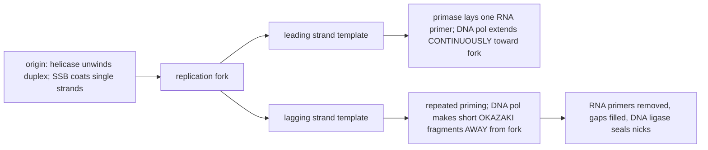
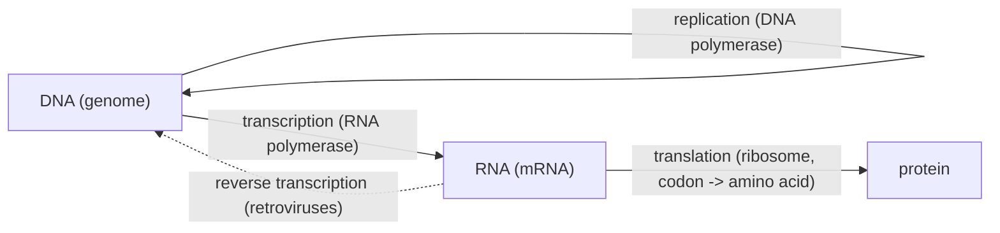
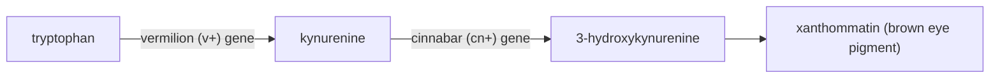

# 중심원리, DNA 구조와 복제

**강의:** BME333 / BIO333 유전학 (UNIST, 2026 가을) · 6강 · ~60분
**강의계획서:** [← 강의계획서](../../lectures/2026.BME333-BIO333-Syllabus.md) — 3주차 수, 09-16
**언어:** [English](../../en/lectures/lec06_Central-Dogma-DNA-Structure-Replication.md) · 한국어

## 학습 목표
이 강의를 마치면 학생들은 다음을 할 수 있어야 한다:
- 단백질이 아니라 DNA가 유전물질이라는 실험적 증거를 요약할 수 있다(Avery–MacLeod–McCarty; Hershey–Chase).
- Watson–Crick 이중나선과, 염기쌍 형성/역평행 구조가 어떻게 복제 기전을 함축하는지 기술할 수 있다.
- 반보존적 복제와 핵심 복제 기계장치(헬리케이스, 프라이메이스, 중합효소, 리가아제; 선도가닥 대 지연가닥)의 역할을 설명할 수 있다.
- 중심원리(DNA → RNA → 단백질)와 일유전자–일효소(one-gene–one-enzyme) 개념을 그 역사적 증거와 함께 진술할 수 있다.
- 생화학유전학의 경로 논리(Neurospora, 트립토판 합성효소)를 통해 유전자형과 표현형을 연결할 수 있다.

### 1. 유전물질은 무엇인가? (~12분)

1930년대까지 생물학자들은 유전자가 염색체에 실려 있다고 확신했지만(5강), 염색체는 *두* 종류의 분자 — **단백질**과 **DNA(디옥시리보핵산)** — 로 이루어져 있으며 거의 모두가 단백질에 걸었다. 단백질은 20가지 서로 다른 아미노산으로 만들어지며 생명의 복잡성을 암호화할 만큼 충분히 풍부해 보였다. DNA는 지루하고 반복적인 **"사뉴클레오티드(tetranucleotide)"**(단조로운 ...ATGC-ATGC... 중합체)로 여겨져 정보의 운반체로는 있을 법하지 않았다. 그 직관을 뒤집는 데는 세 개의 실험이 필요했다.

**그림 — DNA를 유전물질로 규명한 세 실험.**

| 실험 | 연도 | 설계 | 결론 |
|---|---|---|---|
| **Griffith — 형질전환(transformation)** | 1928 | 열로 죽인 병원성(매끈함, S) 폐렴구균 + 살아있는 무해한(거침, R) 세포 → 살아있는 *병원성* S 세포가 나타남 | 어떤 "형질전환 원리"가 세포 사이에서 유전 가능한 병원성을 전달한다 |
| **Avery, MacLeod & McCarty** | 1944 | 형질전환 원리를 정제; 프로테아제, RNase, 또는 **DNase**로 차례로 파괴 | **DNase**만이 형질전환을 없앤다 → 형질전환 원리는 **DNA**다 |
| **Hershey & Chase** | 1952 | 파지 단백질을 ³⁵S로, 파지 DNA를 ³²P로 표지; 세균을 감염; 교반 후 원심분리 | ³²P(**DNA**)만이 세포로 들어가 새 파지를 지시함 → DNA가 유전물질이다 |

**Avery–MacLeod–McCarty(1944)** 논문이 그 경첩이다. 학부생 때 이를 읽은 Joshua Lederberg는 훗날 그것을 유전학의 "분자 단계"의 개막이라 불렀다. 당시 그 자신의 노트에는 *"그 함의가 무한하다"*고 적혀 있었다. 그들의 논증은 세 층으로 되어 있었다: 폐렴구균에는 유전 가능한 협막 형질이 있고; 그 형질은 무세포 추출물을 통해 전달되며(**형질전환**); 그 화학적 운반체는 *단백질을 배제하고* DNA라는 것이다([en](../../en/review/Lederberg1994_Genetics_AveryMacLeodMcCarty.md) · [ko](../../ko/review/Lederberg1994_Genetics_AveryMacLeodMcCarty.md) 참조). 그러나 그 논문은 **즉시** 받아들여지지 *않았다* — Alfred Mirsky와 다른 이들은 사뉴클레오티드 견해에 고정되어 미량의 단백질 오염이 정말로 배제되었는지 의심했다. Lederberg는 이 회의주의가 방해가 아니라 *좋은 과학*이었다고 주장한다: 그것은 Chargaff의 염기 조성 연구, Hershey–Chase 실험, 그리고 궁극적으로 Watson과 Crick을 자극했다. (그는 그 논문이 1945–54년에 약 300회 인용되었으므로, 멘델과 달리 "시대를 앞선" 것이 아니라 단지 논쟁의 대상이었을 뿐이라고 지적한다. Avery는 노벨상 없이 1955년에 사망했는데, 유명한 누락이다.)

### 2. DNA 구조 (~12분)

DNA가 유전물질임을 아는 것은 곧바로 질문을 제기했다: 하나의 분자가 정보를 **저장**하고 그것을 충실하게 **복제**하게 하는 *구조*는 무엇인가? 두 단서가 1953년에 수렴했다.

**Chargaff의 규칙(1950).** Erwin Chargaff는 여러 종에 걸쳐 염기 조성을 측정하여 숨겨진 규칙성을 발견했다: **아데닌의 양이 티민과 같고**, **구아닌이 시토신과 같아서**, 전체 A+T 대 G+C 함량이 종마다 다르더라도 퓨린은 항상 피리미딘과 같다.

**그림 — Chargaff의 염기쌍 규칙성.**

| 규칙 | 진술 | 구조적 의미 (돌이켜 보면) |
|---|---|---|
| %A = %T | 아데닌이 티민과 같음 | A가 T와 쌍을 이룸 |
| %G = %C | 구아닌이 시토신과 같음 | G가 C와 쌍을 이룸 |
| 퓨린 = 피리미딘 | (A+G) = (T+C) | 나선을 가로질러 하나의 퓨린이 하나의 피리미딘과 마주함 |
| A+T : G+C가 종마다 다름 | 염기 *비율*이 종 특이적 | 조성이 정보를 담을 수 있음 |

여기에 DNA가 규칙적 직경의 **나선**임을 보여준 **Rosalind Franklin**의 X선 회절 이미지(그 유명한 "Photo 51")를 더하면, **James Watson과 Francis Crick(1953)**은 모델을 조립할 수 있었다: 두 개의 당–인산 골격이 **이중나선(double helix)**으로 감기고, **역평행(antiparallel)**으로 진행하며(한 가닥은 5′→3′, 다른 가닥은 3′→5′), 염기는 수소결합에 의해 *안쪽에서* 쌍을 이룬다 — **A는 T와(수소결합 2개), G는 C와(수소결합 3개)**. 이것이 Chargaff를 정확히 설명한다: 모든 가로대는 퓨린–피리미딘 쌍이다.

**그림 — 역평행 가닥과 상보적 염기쌍 형성.**
```
   5' ---A === T--- 3'          A = T   (2 hydrogen bonds)
        |       |               G === C (3 hydrogen bonds)
        T === A                 each strand is the TEMPLATE for the other
        |       |
        G ===== C
        |       |
        C ===== G
   3' ---T === A--- 5'
        (antiparallel: 5'->3' on the left, 3'->5' on the right)
```

이 구조의 가장 유명한 특징은 Watson과 Crick의 말로, 그 특정한 쌍 형성이 "가능한 복제 기전을 즉시 시사한다"는 절제된 표현이다. 각 염기가 자신의 짝을 지정하므로, **각 가닥은 다른 가닥을 재건하기 위한 완전한 주형(template)**이다. 가닥을 분리하고, 각 가닥에 대해 자유 뉴클레오티드를 짝지으면, 두 개의 동일한 딸 나선을 얻는다. 구조가 기전을 *함축*했다 — 다음 절의 주제다.

### 3. 반보존적 복제 (~12분)

염기쌍 논리는 DNA를 복제하는 세 가지 방법을 허용한다: **반보존적(semiconservative)**(각 딸 = 오래된 가닥 하나 + 새 가닥 하나), **보존적(conservative)**(오래된 이중나선은 그대로 남고, 완전히 새로운 이중나선이 만들어짐), 또는 **분산적(dispersive)**(가닥이 오래된 것과 새것의 조각보). **Matthew Meselson과 Franklin Stahl(1958)**은 종종 "생물학에서 가장 아름다운" 실험이라 불리는 실험으로 이들 사이에서 결판을 냈다. 그들은 모든 DNA가 무거워지도록 여러 세대에 걸쳐 *E. coli*를 무거운 질소(**¹⁵N**) 배지에서 길렀고, 그런 다음 세포를 정상 **¹⁴N**으로 바꾸어 각 세대마다 시료를 채취하며 CsCl 기울기에서 밀도로 DNA를 분리했다.

**그림 — Meselson–Stahl 결과 (세대별 DNA 밀도).**
```
Generation 0 (all 15N)   [======== HEAVY ========]
Generation 1             [==== HYBRID (15N/14N) ====]     -> rules out CONSERVATIVE
Generation 2      [= LIGHT =]        [==== HYBRID ====]   -> 1 light : 1 hybrid
```
**한** 차례가 지나자 모든 분자는 단일 **잡종(hybrid)** 띠였다 — 이는 보존적 모델(무거운 띠 하나 + 가벼운 띠 하나를 예측)을 죽인다. **두** 차례 후에는 DNA의 절반이 잡종이고 절반이 가벼웠다 — 정확히 **반보존적** 예측이다. 복제는 딸 이중나선당 부모 가닥 *하나*를 보존한다.

기전적으로, 복제는 **복제분기점(replication fork)**에서 일어나며, 각자 하나의 일을 맡은 효소 무리에 의해 진행된다. DNA 중합효소는 기존 3′ 말단에만 뉴클레오티드를 추가할 수 있고 **5′→3′**로만 합성하는데, 이것이 두 주형 가닥 사이에 비대칭을 강제한다.

**그림 — 복제분기점과 그 효소들.**


단계별로: **헬리케이스(helicase)**가 이중나선을 풀고; **단일가닥 결합(SSB) 단백질**이 가닥을 떨어뜨려 놓으며; **프라이메이스(primase)**가 중합효소가 시작할 3′ 말단을 주기 위해 짧은 RNA **프라이머(primer)**를 놓고; **DNA 중합효소**가 프라이머를 연장하여, 분기점 쪽으로 **선도가닥(leading strand)**을 연속적으로 합성하고 **지연가닥(lagging strand)**을 분기점에서 멀어지는 짧은 조각(**오카자키 절편, Okazaki fragments**)으로 합성한다; 마지막으로 RNA 프라이머가 제거되고, 틈이 DNA로 채워지며, **DNA 리가아제(ligase)**가 남은 절단부(nicks)를 봉합한다. 정확도는 놀랍다 — DNA 중합효소는 잘못 삽입된 염기를 제거하는 3′→5′ 엑소뉴클레아제로 **교정(proofread)**하여 오류율을 10⁹분의 1 가까이로 유지한다 — 이것이 유전이 혼합적이지 않고 *입자성이며 안정적*인 이유다(3강으로의 되돌아봄).

### 4. 중심원리 (~10분)

DNA는 정보를 저장하고 복제한다; 그러나 정보는 또한 *사용*되어야 한다. Crick의 **중심원리(central dogma)**는 정보 흐름의 정상적 방향을 진술한다: **DNA → RNA → 단백질.** DNA는 (RNA 중합효소에 의해) **전사(transcription)**되어 **전령 RNA(mRNA)**가 되고, 이것이 (세 염기 **코돈(codon)**을 읽는 리보솜에 의해) **번역(translation)**되어 단백질로 접히는 아미노산 사슬이 된다. "**유전자 발현(gene expression)**"은 정확히 DNA 서열을 기능성 산물로 바꾸는 이 두 단계 전환이다.

**그림 — 분자생물학의 중심원리.**

점선 화살표는 그 유명한 예외다: **레트로바이러스(retroviruses)**는 **역전사효소(reverse transcriptase)**를 사용하여 RNA를 다시 DNA로 복사해 숙주 유전체에 삽입한다 — "일방향" 원리가 단서를 필요로 한 이유 중 하나다.

이는 **유전체(genome)**라는 바로 그 단어를 복잡하게 만들기 좋은 순간이다. 직관적인 NIH 정의 — "한 생명체의 완전한 DNA 세트... 그 생명체를 만들고 유지하는 데 필요한 모든 정보" — 는 Goldman과 Landweber가 주장하듯 지나치게 단순하고 동시에 자기모순적이다([en](../../en/review/Goldman2016_PLoSgenet_WhatIsGenome.md) · [ko](../../ko/review/Goldman2016_PLoSgenet_WhatIsGenome.md) 참조). 그들의 증거는 인상적이다: 레트로바이러스는 일단 삽입되면 별도의 물리적 분자로서 존재하기를 멈춘다; 섬모충 **Oxytricha**는 뒤섞인 **생식계열 유전체(~1 Gb, ~250,000개의 유전자 절편)**를 유지하다가 **RNA 주형**을 사용하여 이를 ~16,000개의 작은 "나노염색체(nanochromosome)"(생식계열의 5–10%에 불과)로 된 **체세포** 유전체로 풀어낸다 — 그래서 정보가 세대를 가로질러 DNA → RNA → DNA로 흐른다; 그리고 합성 *Mycoplasma* 유전체는 DNA로 다시 구현되기 전에 먼저 **컴퓨터 파일**로 존재했다. 후성유전적 유전과 GWAS의 "사라진 유전율(missing heritability)"을 더하면, 유전체는 — 항상은 아니지만 대개 DNA인 — **정보적 실체(informational entity)**로 보는 것이 낫다. 그것은 다른 정보와 함께 실현되는 *가능성*을 지정한다. 이 재구성은 학생들이 이후 강의의 유전자 조절과 후성유전학을 준비하게 한다.

### 5. 일유전자–일효소 (~14분)

중심원리는 유전자가 단백질을 지정한다고 말한다 — 그런데 유전자당 *몇 개*의 단백질이며, 유전자형은 생명체가 실제로 나타내는 *표현형*과 어떻게 연결되는가? 그 답은 **생화학유전학(biochemical genetics)**이다: 유전자는 대사 **경로(pathway)**의 특정 단계를 촉매하는 **효소(enzymes)**를 지정함으로써 작용한다.

그 착상은 **George Beadle과 Boris Ephrussi(1936)**에게서 시작되었는데, 이들은 *Drosophila* 유충 사이에서 눈 원반(eye-disc) 조직을 이식하여 두 눈색 돌연변이 **버밀리언(vermilion)**과 **시나바(cinnabar)**가 *비자율적(non-autonomous)*임을 발견했다 — 돌연변이 원반이 다른 유전자형의 숙주에서 다른 곳에서 만들어진 확산성 물질에 의해 구제될 수 있었다([en](../../en/review/Horowitz1996_Genetics_BiochemGenetics.md) · [ko](../../ko/review/Horowitz1996_Genetics_BiochemGenetics.md) 참조). 그 물질들은 생합성 경로의 **중간체(intermediates)**로 밝혀졌으며, 각 유전자가 한 단계를 조절했다:

**그림 — Drosophila 눈 색소 경로 (각 유전자 = 한 단계).**

*v⁺* 물질은 **키뉴레닌(kynurenine)**(Butenandt 1940; Tatum이 확인), *cn⁺* 물질은 **3-하이드록시키뉴레닌(3-hydroxykynurenine)**으로 규명되었다 — 최초의 유전학적으로 정의된 대사 중간체다.

**Beadle과 Tatum(1941)**은 곰팡이 **Neurospora crassa**를 사용하여 이 통찰을 *일반적 방법*으로 전환했는데, Horowitz는 이를 "유전학의 지형을 영원히 바꾼" "혁명"이라 부른다([en](../../en/review/Horowitz1991_Genetics_Neurospora-Revolution.md) · [ko](../../ko/review/Horowitz1991_Genetics_Neurospora-Revolution.md) 참조). *Neurospora*는 이상적이다: 그것은 **화학적으로 정의된 최소 배지(minimal medium)**에서 자라며, 그 전체 감수분열 사분체(tetrad)를 회수할 수 있다. 그들의 요령은 다른 방식으로는 치사인 대사 돌연변이를 **영양요구성(auxotrophy)**으로 회수하는 것이었다: 포자에 X선을 쬐고, *완전* 배지에서는 자라지만 최소 배지에서는 자라지 *못하는* 돌연변이체를 찾는다 — 이는 그들이 더 이상 무언가 필수적인 것을 합성할 수 없음을 뜻한다. 그들의 첫 세 돌연변이체는 각각 *다른* 보충물(피리독신, 티아민, p-아미노벤조산)을 필요로 했고, 각각 **단일 유전자**로 유전되었다(피리독신 무능 돌연변이체 No. 299가 그 돌파구였다). 경로의 순서를 정하는 논리는 우아하다: *초기* 단계에서 막힌 돌연변이체는 *이후의 어떤* 중간체로도 구제될 수 있는 반면, *후기*에서 막힌 돌연변이체는 최종 산물로 *만* 구제된다.

**그림 — 생장 검사에서 경로 순서 읽기 (영양요구체 선별의 도식).**

| 최소 배지에 추가한 보충물 → | (없음) | 중간체 B | 중간체 C | 최종산물 D |
|---|---|---|---|---|
| **B 이전에서 막힌 돌연변이체** | 생장 없음 | **생장** | **생장** | **생장** |
| **B→C에서 막힌 돌연변이체** | 생장 없음 | 생장 없음 | **생장** | **생장** |
| **C→D에서 막힌 돌연변이체** | 생장 없음 | 생장 없음 | 생장 없음 | **생장** |

"생장 / 생장 없음"의 양상이 각 유전자를 특정 단계에 배치한다: *돌연변이체를 구제하는 보충물이 많을수록 그 막힘이 더 이른 것이다.* 이것이 **일유전자–일효소 가설(one gene–one enzyme hypothesis)**(1958년 노벨상)을 낳았고 — 이후 여러 소단위를 가진 단백질이 이해되자 **일유전자–일폴리펩티드(one gene–one polypeptide)**로 다듬어졌다. Horowitz는 공로에 대해 신중하다: Archibald Garrod의 *Inborn Errors of Metabolism*(1909)이 그 착상을 예시했지만, Garrod가 일유전자–일효소 개념을 가질 수는 없었다 — 1909년에는 "유전자(gene)"라는 단어가 막 만들어졌고 효소가 단백질이라는 것조차 알려지지 않았다(Sumner는 1926년에야 우레아제를 결정화했다).

유전자와 그 단백질이 *잔기 대 잔기(residue by residue)*로 대응한다는 최종 증명 — **공선성(colinearity)** — 은 **트립토판 합성효소(tryptophan synthase)**에 대한 **Charles Yanofsky**의 연구에서 나왔다([en](../../en/review/Yanofsky2005_Genetics_TryptophanSynthase-OneGeneOneEnzyme.md) · [ko](../../ko/review/Yanofsky2005_Genetics_TryptophanSynthase-OneGeneOneEnzyme.md) 참조). Yanofsky는 1951년에 일유전자–일효소를 믿는 사람들이 "한 손의 손가락으로 셀 수 있을 정도였다"고 회상한다; 1950년대의 잇따른 발견들 — Avery, Hershey–Chase, Watson–Crick, Meselson–Stahl, Sanger의 인슐린 선형 서열, Benzer의 정밀구조 지도, Ingram의 낫적혈구 단일 아미노산 변화 — 은 질문을 *유전자의 서열*이 *단백질의 서열*과 일치하는가로 재구성했다. *E. coli*에서 작업하며 Yanofsky의 그룹은 *trpA* 유전자의 **정밀구조 유전자 지도(fine-structure genetic map)**를 세우고 별도로 **돌연변이 단백질의 서열을 결정**하여, **1964년**까지 **지도상의 돌연변이 자리의 순서가 단백질에서 변경된 아미노산의 순서와 일치함**을 보였다.

**그림 — 유전자와 단백질의 공선성 (Yanofsky, trpA).**
```
gene trpA:      5'--[site1]----[site2]--------[site3]----[site4]--3'
                     |           |             |          |
protein TrpA:   N ---aa'1--------aa'2----------aa'3-------aa'4---- C
   RESULT: the LINEAR ORDER of mutable sites on the gene ==
           the LINEAR ORDER of the amino-acid changes in the protein
```
완전한 TrpA 아미노산 서열(1967)과 *trpA* DNA 서열(1979)이 유전학적 결론을 정확히 확인했고, Sarabhai, Brenner와 동료들은 파지 T4 머리 단백질로 독립적으로 같은 결과에 도달했다. 공선성은 고전유전학의 분자적 정점이다: 그것은 *왜* 우리가 DNA 서열로부터 단백질 서열을 예측하고, 점 돌연변이를 공학적으로 만들며, 유전체 의학에서 미스센스 변이체를 해석할 수 있는지의 이유다 — 이후 모든 것의 토대다.

## 핵심 정리
- **DNA가 유전물질이다:** Griffith의 형질전환(1928) → Avery–MacLeod–McCarty의 DNase 검사(1944) → Hershey–Chase의 ³²P/³⁵S 파지 실험(1952). 수용은 즉각적이 아니라 점진적이고 *논쟁적*이었다(사뉴클레오티드 편견).
- **구조가 기전을 함축한다:** Chargaff의 규칙(%A=%T, %G=%C) + Franklin의 회절이 Watson–Crick의 **역평행 이중나선**과 **A–T / G–C** 염기쌍 형성을 주었다; 각 가닥이 다른 가닥의 주형이 된다.
- **복제는 반보존적이다**(Meselson–Stahl: 1세대 후 잡종 띠, 2세대 후 잡종 1 : 가벼움 1). 분기점은 **헬리케이스, SSB, 프라이메이스, DNA 중합효소(선도가닥 연속 / 지연가닥 오카자키 절편), 리가아제**를 사용하며, 높은 정확도를 위한 교정을 한다.
- **중심원리:** DNA → RNA → 단백질(전사, 이어서 코돈의 번역); 역전사는 레트로바이러스 예외다. "유전체"는 단순히 고정된 DNA 분자가 아니라 **정보적 실체**로 이해하는 것이 가장 좋다(Oxytricha, 합성 유전체).
- **생화학유전학은 유전자형을 표현형에 대응시킨다:** Beadle–Ephrussi의 *Drosophila* 눈 색소 경로와 Beadle–Tatum의 *Neurospora* 영양요구체가 **일유전자–일효소**(→ 일폴리펩티드)를 주었다; Yanofsky의 트립토판 합성효소 연구가 **유전자–단백질 공선성**을 증명했다.

## 교재 참고
- **Genetics: From Genes to Genomes (8e)** — Ch. 6 DNA Structure, Replication & Recombination; Ch. 9 Gene Expression (DNA→RNA→Protein). → [교재 참고](../../lectures/ref.Genetics-FromGenesToGenomes.md)

## 이 저장소의 노트
수업에서 소개할 리뷰와 논문(각각 en/ko 이중언어 쌍이 있음):
- `Lederberg1994_Genetics_AveryMacLeodMcCarty` — DNA를 형질전환 원리로 규명한 Avery 실험에 대한 Lederberg의 평가. · [en](../../en/review/Lederberg1994_Genetics_AveryMacLeodMcCarty.md) · [ko](../../ko/review/Lederberg1994_Genetics_AveryMacLeodMcCarty.md)
- `Goldman2016_PLoSgenet_WhatIsGenome` — "유전체란 무엇인가"를 규정; 중심원리/정보 관점을 다지는 데 유용. · [en](../../en/review/Goldman2016_PLoSgenet_WhatIsGenome.md) · [ko](../../ko/review/Goldman2016_PLoSgenet_WhatIsGenome.md)
- `Yanofsky2005_Genetics_TryptophanSynthase-OneGeneOneEnzyme` — 유전자와 단백질의 공선성; 일유전자–일효소의 분자적 정점. · [en](../../en/review/Yanofsky2005_Genetics_TryptophanSynthase-OneGeneOneEnzyme.md) · [ko](../../ko/review/Yanofsky2005_Genetics_TryptophanSynthase-OneGeneOneEnzyme.md)
- `Horowitz1996_Genetics_BiochemGenetics` — 생화학유전학의 역사와 대사 경로가 어떻게 해부되었는가. · [en](../../en/review/Horowitz1996_Genetics_BiochemGenetics.md) · [ko](../../ko/review/Horowitz1996_Genetics_BiochemGenetics.md)
- `Horowitz1991_Genetics_Neurospora-Revolution` — *Neurospora* 혁명과 Beadle–Tatum 일유전자–일효소 가설. · [en](../../en/review/Horowitz1991_Genetics_Neurospora-Revolution.md) · [ko](../../ko/review/Horowitz1991_Genetics_Neurospora-Revolution.md)

## 토론 문제
1. 사뉴클레오티드 가설은 대부분의 생물학자가 유전물질로 DNA가 아니라 단백질에 걸게 만들었다. Griffith → Avery–MacLeod–McCarty → Hershey–Chase가 어떻게 점진적으로 단백질을 배제했는지 추적하고, 왜 Lederberg가 초기 회의주의를 방해가 아니라 "좋은 과학"이라 부르는지 설명하라.
2. Watson과 Crick은 염기쌍 형성이 "가능한 복제 기전을 즉시 시사한다"고 썼다. 역평행 상보 가닥이 어떻게 반보존적 복제를 가능하게 하는지, 그리고 Meselson–Stahl의 밀도 기울기 띠가 그것을 보존적 및 분산적 모델과 어떻게 구별했는지 정확히 설명하라.
3. DNA 중합효소는 5′→3′로만 합성하고 프라이머를 필요로 한다. 이 두 제약이 어떻게 선도가닥/지연가닥 비대칭을 강제하는지 보이고, 분기점에서 각 문제(풀기, 프라이밍, 오카자키 절편 잇기, 교정)를 해결하는 효소를 명명하라.
4. *Neurospora* 영양요구체 생장 검사 논리를 사용하여, 한 세트의 돌연변이체와 후보 중간체가 주어졌을 때 생합성 경로에서 세 효소를 어떻게 순서 지을지 설명하라. 치사인 대사 결함을 *영양요구성*으로 회수한 것이 왜 그토록 강력한 방법론적 진전이었는가?
5. Goldman과 Landweber는 "유전체"의 표준 정의가 지나치게 단순하다고 주장한다. 레트로바이러스, Oxytricha의 생식계열/체세포 재배열, 그리고 합성 유전체를 사용하여, "유전체"가 물리적 DNA 분자로 정의되는 것이 나은지 정보적 실체로 정의되는 것이 나은지 평가하라. 중심원리의 역전사 예외는 이 논쟁에 어떻게 부합하는가?
