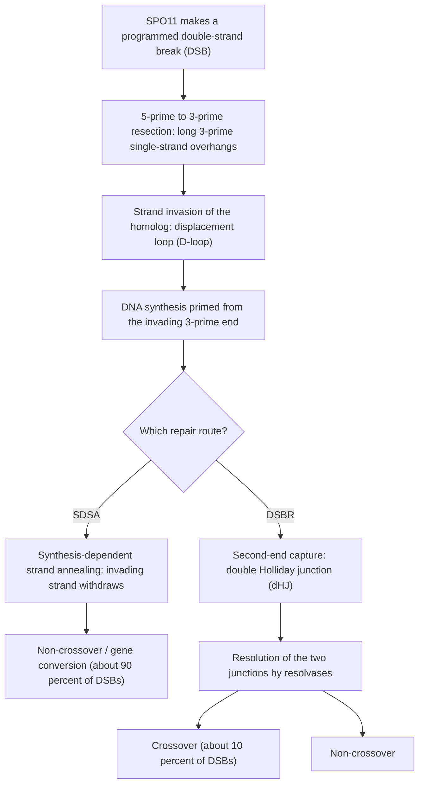
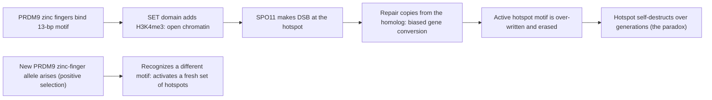

# 재조합과 연관

**강의:** BME333 / BIO333 유전학 (UNIST, 2026 가을) · 강의 07 · ~60분
**강의계획서:** [← 강의계획서](../../lectures/2026.BME333-BIO333-Syllabus.md) — 4주차 월요일, 09-21
**언어:** [English](../../en/lectures/lec07_Recombination-Linkage.md) · 한국어

## 학습 목표
이 강의를 마치면 학생들은 다음을 할 수 있어야 한다:
- 연관된(linked) 유전자와 독립적으로 분리되는 유전자를 구별하고, 재조합 빈도를 유전적 거리로 해석한다.
- 간섭(interference)을 포함하여 2점 및 3점 교배 자료로부터 유전자 지도를 작성한다.
- 감수분열 재조합의 분자적 기초(교차, 이중가닥절단 복구)와 교차가 일어나는 위치(핫스폿)를 설명한다.
- 연관 불평형(linkage disequilibrium)을 정의하고, 이것이 연관 분석(association mapping)과 반수체형(haplotype) 추론에 어떻게 사용되는지 설명한다.
- LOD 점수를 적용하여 사람 혈통(pedigree)에서 연관을 검정하고, 혈액형 표지자의 역사적 역할을 이해한다.

## 강의

### 1. 연관 대 독립 분리 (~10분)

멘델의 독립의 법칙(law of independent assortment)(강의 03)은 서로 다른 두 유전자의 대립유전자가 서로 독립적으로 배우자에 들어가, 이형접합 교배(dihybrid)에서 **9:3:3:1**을, 그리고 검정교배(testcross)에서는 네 가지 배우자 종류가 동일한(1:1:1:1) 빈도로 나타난다고 말한다. 이 법칙은 두 유전자가 **서로 다른 염색체**에 있을 때 — 또는 같은 염색체상에서 아주 멀리 떨어져 있을 때 — 만 성립한다. 두 유전자가 **같은 염색체상에서 서로 가까이** 놓여 있으면, 이들은 하나의 단위로 전달되는 경향이 있다: 이들은 **연관되어(linked)** 있으며, 그 검정교배 자손은 1:1:1:1에서 크게 벗어난다. 그 벗어남을 설명하고 *정량화*하는 것이 이 강의 전체의 과제이며, 이는 추상적인 "인자(factor)"로부터 염색체를 따라 일렬로 배열된 물리적 유전자로 넘어가는 역사적 다리이다.

두 연관된 유전자좌에 대립유전자를 가진 이중 이형접합체(doubly heterozygous) 개체를 생각해 보자. 배열이 중요하다. 두 우성(또는 두 돌연변이) 대립유전자가 *같은* 상동염색체에 함께 들어왔다면 — **AB / ab**로 표기 — 유전자들은 **결합형(coupling, cis)**에 있다. 서로 *반대쪽* 상동염색체에 들어왔다면 — **Ab / aB** — 이들은 **반발형(repulsion, trans)**에 있다. 감수분열에서, 부모형 배열을 보존하는 배우자는 **부모형(비재조합형, parental/non-recombinant)**이고, 새로운 조합을 가지는 배우자는 **재조합형(recombinant)**이다. 재조합형은 **교차(crossing over)**에 의해 만들어진다: 감수분열 I 동안 상동염색체 사이의 물리적 교환으로, 세포학적으로는 **키아즈마(chiasma)**로 관찰된다.

**그림 — 결합형 대 반발형과 재조합형의 기원.**
```
Coupling (cis)  AB / ab            Repulsion (trans)  Ab / aB
   A---------B                        A---------b
   ------------  (homolog pair)       ------------
   a---------b                        a---------B

 No crossover between A and B  ->  parental gametes  (AB, ab  or  Ab, aB)
 Crossover between A and B     ->  recombinant gametes (Ab, aB  or  AB, ab)
```

**재조합 빈도(recombination frequency, RF)**는 (검정교배 자손으로 계수한) 전체 배우자 중 재조합형인 비율이다:

> RF = (재조합형 자손 수) / (전체 자손 수)

**연관되지 않은** 유전자에서는 RF = 50%이며(네 종류가 모두 같고, 그 절반이 재조합형 — 독립 분리와 구별되지 않는다), **완전히 연관된** 유전자에서 교차가 없으면 RF = 0%이다. 실제 연관된 유전자는 그 사이에 놓인다. **토머스 헌트 모건(Thomas Hunt Morgan)**과 그의 학부생 제자 **알프레드 스터티번트(Alfred Sturtevant)**(1913)가 이룬 결정적 통찰은 **RF가 물리적 거리를 단조롭게 반영하는 척도**라는 것이다: 두 유전자가 멀리 떨어질수록 그 사이에서 교차가 일어날 공간이 커지므로 RF도 커진다. 스터티번트는 **1 cM = 1% 재조합**이 되도록 **지도 단위(map unit)** 또는 **센티모건(centimorgan, cM)**을 정의했고, 여러 유전자 사이의 RF를 이용해 최초의 **유전자 지도(genetic map)** — 순서가 정해지고 가법적이며 1차원적으로 배열된 유전자좌의 배열 — 를 그렸다. 그 선형 가법성 자체가 유전자가 염색체를 따라 물리적으로 늘어서 있다는 강력한 증거이다. 모건의 *초파리(Drosophila)* 연구진은 유전 스크린을 유전자 지도로 바꾸었다(이후 감수분열 자체에 적용된 것과 같은 체계적 스크린 전통; [en](../../en/review/Hawley1993_Genetics_MeioticMutants-Drosophila.md) · [ko](../../ko/review/Hawley1993_Genetics_MeioticMutants-Drosophila.md) 참조).

RF가 50%에서 포화되는 이유는, 거리가 충분히 멀어지면 (재조합형 배우자를 낳는) *홀수* 번의 교차가 (부모형 배열을 복원하는) *짝수* 번의 교차만큼 일어날 확률이 되기 때문이다. 따라서 같은 염색체상에 있어도 충분히 멀리 떨어진 유전자는 연관되지 않은 것처럼 *보인다*. 이것이 RF가 짧은 거리에서만 좋은 자가 되는 이유이며 — 또한 우리가 긴 지도를 끝에서 끝까지 측정하는 대신 여러 짧은 구간을 합산하여 작성하는 이유이다.

### 2. 유전자 지도 작성 (~12분)

**2점 교배(two-point cross)**는 두 유전자 사이의 RF를 측정해 하나의 거리를 준다. 그러나 2점 자료만으로는 유전자좌가 셋 이상일 때 유전자 *순서*를 알 수 없고, **이중 교차(double crossover)**를 놓치기 때문에 긴 거리를 체계적으로 *과소평가*한다(같은 두 표지자 사이의 두 번의 교환은 부모형 조합을 복원하여 조용히 "부모형"으로 계수된다). **3점 검정교배(three-point testcross)**는 이 두 문제를 한꺼번에 해결하며 유전자 지도 작성의 고전적 주력 도구이다.

세 연관 유전자에 대한 **삼중 이형접합체(trihybrid)**를 설정하고 (예: `A B C / a b c`), 이를 삼중 열성 동형접합체 `a b c / a b c`와 검정교배한다. 여덟 가지 자손 종류 각각은 삼중 이형접합체가 어떤 배우자를 받았는지 직접 알려준다. 여덟 종류의 두 가지 특징이 지도를 해독한다:

- **가장 빈번한** 두 상보적 종류는 **부모형(parental)**(교차 없음)이다. 이들은 결합 배열을 알려준다.
- **가장 드문** 두 상보적 종류는 **이중 교차(double crossover, DCO)**이다. DCO 종류를 부모형 종류와 비교하면, 정확히 **하나의 유전자만 편이 "바뀌어" 있으며 — 그 유전자가 가운데에 있다.** 이 한 번의 비교로 유전자 순서가 확정된다.

**그림 — 풀이한 3점 검정교배 (예시 자료, 자손 1000개).**

| 삼중 이형접합체로부터의 배우자 | 개수 | 종류 |
|---|---|---|
| A B C | 355 | 부모형 |
| a b c | 355 | 부모형 |
| A B c | 95 | 단일 교차, 구간 II (B–C) |
| a b C | 95 | 단일 교차, 구간 II (B–C) |
| A b c | 45 | 단일 교차, 구간 I (A–B) |
| a B C | 45 | 단일 교차, 구간 I (A–B) |
| A b C | 5 | 이중 교차 |
| a B c | 5 | 이중 교차 |

부모형은 `ABC`/`abc`이고, 가장 드문(DCO) 종류는 `AbC`/`aBc`이다. `ABC`와 `AbC`를 비교하면 **B** 대립유전자만 바뀌었으므로 — **B가 가운데 유전자**이고 진짜 순서는 **A–B–C**이다.

이제 거리를 계산한다. 한 구간의 지도 거리는 *그 구간 내에서* 재조합형인 자손의 백분율이며, **이중 교차 종류를 반드시 포함해야 한다**. 이들은 두 구간 모두에서 재조합형이기 때문이다:

- **A–B (구간 I):** 재조합형 = 단일-CO-I (45+45) + DCO (5+5) = 100 / 1000 = **10 cM**
- **B–C (구간 II):** 재조합형 = 단일-CO-II (95+95) + DCO (5+5) = 200 / 1000 = **20 cM**
- 전체 지도: **A —10 cM— B —20 cM— C**

**그림 — 결과 연관 지도.**
```
   A                   B                                       C
   |------ 10 cM ------|---------------- 20 cM ----------------|
        region I                     region II
   (A-B recombination)          (B-C recombination)
```

순진한 **2점 A–C** 추정치는 A 대 C에 대해 재조합형인 자손만 세었을 것이다(단일-CO 종류: 45+45+95+95 = 280, 즉 28%). 이는 이중 교차(A와 C가 부모형 조합으로 되돌아가는 경우)를 *놓친다*. 3점 분석에서 얻은 진짜 A–C 거리는 10 + 20 = **30 cM**이다. 바로 이것이 3점(및 다점) 교배가 연쇄된 2점 측정보다 더 정확한 지도를 주는 이유이다.

마지막으로, **교차는 서로 독립적이지 않다**. 만약 독립적이라면 기대 DCO 빈도는 두 구간 RF의 곱, 즉 0.10 × 0.20 = 0.02, 다시 말해 자손 20개일 것이다. 우리는 10개만 관찰했다. **일치 계수(coefficient of coincidence, c.o.c.)** = 관찰 DCO / 기대 DCO = 10/20 = **0.5**이고, **간섭(interference, I) = 1 − c.o.c. = 0.5**이다. 양의 간섭은 하나의 교차가 **근처의 두 번째 교차를 억제**함을 뜻한다 — 실제 물리적 제약이다(하나의 키아즈마가 근처의 또 다른 교차를 억제한다). 간섭은 되풀이되는 주제이다: 이는 **물리적(마이크론) 거리에 걸쳐 작동하는 교차 간섭**을 반영하며, 암컷 지도가 수컷 지도보다 긴 이유이기도 하다(덜 응축된 암컷 염색분체가 간격을 둔 교차를 위한 더 긴 물리적 길이를 제공한다; [en](../../en/review/Paigen2010_NatRevGenet_RecombinationHotspots-Mammals.md) · [ko](../../ko/review/Paigen2010_NatRevGenet_RecombinationHotspots-Mammals.md) 참조).

현대의 교배는 훨씬 더 정밀한 규모에 도달한다. Smukowski Heil & Noor의 프라이머는 *초파리(Drosophila)* garnet–scalloped 영역에서 **92,105마리의 수컷 자손**을 스크리닝하여 6,716개의 재조합형(전체 7.3 cM)을 회수한 뒤, 2.1 Mb에 걸친 451개 표지자의 표적 농축 시퀀싱을 사용해 5-kb 규모에서 국소 재조합률의 **90배 범위**(0.3–27 cM/Mb) — 고전적 지도 작성으로는 보이지 않는 변이 — 를 드러낸 과정을 설명한다([en](../../en/review/Singh2013_Heil2013_GeneticsPrimer_Recombination.md) · [ko](../../ko/review/Singh2013_Heil2013_GeneticsPrimer_Recombination.md) 참조).

### 3. 재조합의 분자적 기작 (~12분)

교차는 물리적으로 *무슨* 사건인가? 감수분열 재조합은 위상이성질화효소(topoisomerase) 유사 효소인 **SPO11**이 촉매하는, 의도적이고 프로그램된 **이중가닥절단(double-strand break, DSB)**으로 시작된다. 이는 놀라운 발상이다: 세포가 재조합하기 위해 자신의 염색체를 일부러 부순다. 왜냐하면 대부분의 생물에서 교차는 상동염색체를 서로 붙들어 감수분열 I에서 올바른 분리를 보장하는 물리적 **키아즈마(chiasmata)**도 만들기 때문이다. DSB는 이후 가공되어 (자매 염색분체가 아닌) **상동염색체**를 주형으로 복구되며, 그 복구가 *어떻게* 해소되는지가 교차 여부를 결정한다.

**그림 — 감수분열 이중가닥절단 복구: 두 가지 결과.**


단계는 다음과 같다: DSB 후, **5′→3′ 절제(resection)**가 3′ 단일가닥 돌출부를 남긴다. 가닥교환 단백질로 덮인 한쪽 돌출부가 상동염색체를 **침입(invade)**하여 상보적 가닥과 짝을 이루고, **치환 고리(displacement loop, D-loop)**를 형성한다; 침입한 3′ 말단이 새로운 DNA 합성을 개시한다. 여기서부터 경로가 갈라진다([en](../../en/review/Paigen2010_NatRevGenet_RecombinationHotspots-Mammals.md) · [ko](../../ko/review/Paigen2010_NatRevGenet_RecombinationHotspots-Mammals.md) 참조):

- **합성 의존성 가닥 어닐링(synthesis-dependent strand annealing, SDSA):** 연장된 침입 가닥이 치환되어 다른 절단 말단에 다시 어닐링된다. 인접 표지자의 교환은 일어나지 않는다 — **비교차(non-crossover, NCO)**이며, 흔히 작은 **유전자 전환(gene conversion)** 조각(공여자로부터 수용자로 짧은 서열이 비상보적으로 전달됨)으로만 검출된다.
- **이중가닥절단 복구(double-strand-break repair, DSBR):** 두 번째 절단 말단이 포획되어 **이중 홀리데이 접합(double Holliday junction, dHJ)**을 만든다. 두 접합이 어떻게 잘리는지("해소")에 따라 결과는 **교차**(인접 표지자의 상호 교환) 또는 비교차이다.

핵심적인 정량적 사실: 포유류에서는 **DSB의 ~10%만이 교차로 성숙**하며, 나머지 ~90%는 비교차 유전자 전환으로 해소된다([en](../../en/review/Paigen2010_NatRevGenet_RecombinationHotspots-Mammals.md) · [ko](../../ko/review/Paigen2010_NatRevGenet_RecombinationHotspots-Mammals.md) 참조). 교차 *교환 지점*은 대략 500–2,000 bp에 걸쳐 퍼져 있는 반면, 비교차 전환은 DSB 중심에 촘촘히 모여 있다. 이 10%는 우연이 아니다 — 세포는 **교차 항상성(crossover homeostasis)**(DSB 수가 변해도 이가염색체당 교차 수가 안정적으로 유지됨)과 **간섭**(구간 2에서 만난 물리적 간격)을 강제한다. 교차가 너무 적으면 비분리(nondisjunction)의 위험이, 너무 많으면 불안정성의 위험이 있기 때문이다.

교차가 어디서 *허용되는지*도 통제된다. 교차는 **동원체(centromere) 근처에서 강하게 억제된다**. 동원판(kinetochore) 옆의 교차가 적절한 양극성 배향(biorientation)을 보장하는 장력 감지를 교란하여 비분리를 유발하기 때문이다. Kuhl 등(2020)은 출아효모에서 기발한 **dCas9 결착(tethering) 시스템** — 촉매 활성이 없는 Cas9를 개별 동원판 소단위와 융합하여 이소성(ectopic) 유전자좌로 불러들이는 방식 — 을 사용하여 **Ctf19** 소단위만으로도 그곳의 교차를 억제하기에 충분함을 보였다. Ctf19는 DSB 형성을 줄이지 않는다; 대신 그 N-말단의 DDK 인산화를 통해 **Scc2–Scc4 코헤신 로더(cohesin loader)**를 불러들여 복구를 비교차 경로 쪽으로 치우치게 한다. 이는 교차의 *배치*가 능동적으로 조절되는, 위치 의존적 결정임을 아름답게 보여주며, CRISPR 기구를 편집이 아니라 프로그램 가능한 소환 도구로 재활용한 현대적 예이다([en](../../en/article/Kuhl2020_Genetics_dCas9+Ctf19+Recombination.md) · [ko](../../ko/article/Kuhl2020_Genetics_dCas9+Ctf19+Recombination.md) 참조). 고전적 *초파리(Drosophila)* 감수분열 돌연변이 스크린은 유전학적 측면에서 같은 구조에 도달하여, **키아즈마성(chiasmate)** 분리계와 **비키아즈마성(achiasmate, 분배형(distributive))** 분리계를 구별하고 충실한 분리를 보장하는 *nod*(키네신 유사 단백질) 같은 유전자를 클로닝했다([en](../../en/review/Hawley1993_Genetics_MeioticMutants-Drosophila.md) · [ko](../../ko/review/Hawley1993_Genetics_MeioticMutants-Drosophila.md) 참조).

### 4. 재조합 핫스폿 (~10분)

교차는 염색체를 따라 **균일하게 분포하지 않는다**. 대신 이들은 개별적인 **재조합 핫스폿(recombination hotspot)** — 보통 **1–2 kb** 폭으로, 교차 빈도가 유전체 평균보다 훨씬 높은 곳 — 으로 모여들며, 교환이 거의 없는 긴 "콜드스폿(coldspot)"으로 분리되어 있다([en](../../en/review/Hey2004_PLoSBiol_RecombinationHotspots.md) · [ko](../../ko/review/Hey2004_PLoSBiol_RecombinationHotspots.md) 참조). 핫스폿은 구간 3의 **DSB 핫스폿**과 일치하므로, "교차는 어디서 일어나는가?"라는 질문은 "SPO11은 어디를 자르는가?"가 된다.

포유류에서 그 답은 대체로 하나의 유전자, **PRDM9**이다. Paigen & Petkov의 리뷰는 PRDM9가 어떻게 작동하고 왜 중요한지를 종합한다([en](../../en/review/Paigen2010_NatRevGenet_RecombinationHotspots-Mammals.md) · [ko](../../ko/review/Paigen2010_NatRevGenet_RecombinationHotspots-Mammals.md) 참조). PRDM9는 세 가지 기능부를 가진 트랜스작용(trans-acting) 단백질이다: **KRAB** 도메인, 국소 염색질을 여는 **히스톤 H3 라이신 4의 삼중메틸화(H3K4me3)**를 수행하는 **SET** 도메인, 그리고 특정 DNA 모티프(사람 핫스폿에 풍부한 13-bp 축퇴 컨센서스 `CCNCCNTNNCCNC`)에 결합하는 긴 **아연 손가락(zinc finger)** 배열. 모티프에 결합하고 염색질을 표시함으로써 PRDM9는 SPO11에게 어디를 자를지 알려준다.

**그림 — PRDM9가 핫스폿을 지정하고, 핫스폿 역설이 생긴다.**


PRDM9는 또한 **"핫스폿 역설(hotspot paradox)"**을 해결한다. 재조합은 상동염색체를 주형으로 삼아 절단된 염색분체를 복구하기 때문에, **활성 핫스폿 서열은 점차 덮어쓰기 된다**(**편향 유전자 전환, biased gene conversion**) — 핫스폿은 스스로를 침식하여 사라지는데도, 핫스폿은 어디에나 있다. 그 해결책: PRDM9는 강한 **양성 선택(positive selection)**을 받으며, 그 아연 손가락 DNA 결합 잔기에 급격한 변화가 집중된다; 새로운 PRDM9 대립유전자는 새로운 모티프를 인식하여 **완전히 새로운 핫스폿 집단을 만들어**, 사라지는 것들을 대체한다. 이는 핫스폿 *위치*의 빠른 교체를 예측하며 — 이는 **사람과 침팬지** 핫스폿이 거의 겹치지 않는다는 점, 그리고 개별 사람 핫스폿이 단일 염기 변화로 ~70,000년 이내에 생겨날 수 있다는 추정으로 확인된다([en](../../en/review/Hey2004_PLoSBiol_RecombinationHotspots.md) · [ko](../../ko/review/Hey2004_PLoSBiol_RecombinationHotspots.md) 및 [en](../../en/review/Paigen2010_NatRevGenet_RecombinationHotspots-Mammals.md) · [ko](../../ko/review/Paigen2010_NatRevGenet_RecombinationHotspots-Mammals.md) 참조). PRDM9는 생쥐의 **잡종 불임 유전자 Hst1**의 역할도 겸하여, 핫스폿 통제를 **종분화(speciation)**와 직접 연결한다. 모든 분류군이 이 체계를 쓰는 것은 아니다: *초파리(Drosophila)*와 *C. elegans*는 시냅토네마 복합체(synaptonemal complex)를 **DSB와 무관하게** 조립하며 개별 핫스폿이 없고, 넓은 지역적 비율 변이만 보인다 — 핫스폿이 보편적으로 선택된 특징이라기보다 효모와 포유류에서 보이는 DSB–SC 결합의 부산물일 수 있다는 증거이다([en](../../en/review/Hey2004_PLoSBiol_RecombinationHotspots.md) · [ko](../../ko/review/Hey2004_PLoSBiol_RecombinationHotspots.md) 참조).

### 5. 연관 불평형과 연관 분석 (~10분)

위의 모든 것은 *단일 감수분열 내에서*의 재조합을 추적한다. **연관 불평형(linkage disequilibrium, LD)**은 여러 세대에 걸쳐 축적된 많은 감수분열의 집단 수준 메아리이다. LD는 집단 내에서 **서로 다른 유전자좌의 대립유전자가 비무작위적으로 연관되는 것**이다: 한 유전자좌의 대립유전자 *A*가 가까운 유전자좌의 대립유전자 *B*와, 각자의 빈도로부터 기대되는 것보다 더 자주(또는 더 드물게) 함께 발견되면 두 유전자좌는 LD 상태에 있다. LD는 돌연변이, 유전적 부동(drift), 선택, 그리고 혼혈(admixture)에 의해 생성되고, **재조합에 의해 무너진다** — 두 유전자좌 사이의 각 교차는 그 대립유전자를 독립성(**연관 평형, linkage equilibrium**) 쪽으로 뒤섞는다. 교차로 거의 분리되지 않는 가까운 유전자좌는 여러 세대 동안 강한 LD를 유지하고, 멀리 떨어진 유전자좌는 평형에 빠르게 도달한다.

따라서 유전체는 **블록 같은 반수체형 구조(haplotype structure)**를 갖는다: 재조합 핫스폿으로 경계가 지어진 높은 LD의 긴 구간(**반수체형 블록, haplotype block**)들이 있어서, 소수의 "태그(tag)" SNP만으로도 한 블록 내 변이의 대부분을 포착할 수 있다. 이는 **HapMap** 프로젝트와 **전장 유전체 연관 분석(genome-wide association study, GWAS)**의 논리적 기초이다: 유전형이 분석된 SNP이 관찰되지 않은 인근 변이들과 LD 상태에 있으므로, 태그 SNP에서의 연관 신호는 블록 어딘가에 있는 원인 변이를 표시하며, 이를 **정밀 지도 작성(fine-mapping)**이 좁혀 간다([en](../../en/review/Hey2004_PLoSBiol_RecombinationHotspots.md) · [ko](../../ko/review/Hey2004_PLoSBiol_RecombinationHotspots.md) 참조).

**그림 — 재조합이 LD를 태그 가능한 반수체형 블록으로 침식한다.**
```
Ancestral haplotype:   ==A======B======C==D===   (alleles travel together = high LD)

  many generations of recombination, cutting mostly at hotspots (X):
                        ==A==X===B======C=X=D===

Result: blocks of high internal LD, separated at hotspots
        [ A ... B ]  X  [ C ... D ]
         one tag SNP     one tag SNP     <- captures the whole block for GWAS
```

LD 패턴을 재조합 *비율*로 바꾸려면 통계 모형이 필요하다. **Li & Stephens(2003)**는 이 분야를 재편한 모형을 제시했다: 그들의 **"복사(copying)" 모형 또는 근사 조건부 곱 모형(Product of Approximate Conditionals, PAC)**은 각 새로운 반수체형을 **이전에 관찰된 반수체형들의 불완전한 모자이크**로 취급하며, 은닉 마르코프 과정(hidden Markov process)으로 이어붙이는데 그 **전환(점프) 비율이 국소 재조합률에 비례한다**(ρ = 4Nc) — 전환이 많을수록 재조합이 많다([en](../../en/article/Li2003_Genetics_LD+Modeling.md) · [ko](../../ko/article/Li2003_Genetics_LD+Modeling.md) 참조). 이는 완전한 병합(coalescent) MCMC의 ~30시간 대비 **~30초** 만에 실행되면서, ~90%의 검정력으로 핫스폿을 검출한다. Song의 회고는 이 "조건부 표본 확률(conditional sampling probability)" 근사가 왜 기초적인 것이 되었는지 설명한다: 같은 복사 모형이 **반수체형 위상 결정(phasing), 유전형 대체 추정(imputation)**(IMPUTE, MaCH — 유전형이 분석되지 않은 SNP을 채워 GWAS 검정력을 높임), **국소 조상 추론(local-ancestry inference)**, 그리고 정밀 규모 재조합 지도(LDhat)의 토대가 된다 — 하나의 우아한 생물학적 발상(계보는 복사의 모자이크이다)이 10년의 유전체학에 걸쳐 전파된 것이다([en](../../en/review/Song2016_Genetics_Li+Stephens+LD.md) · [ko](../../ko/review/Song2016_Genetics_Li+Stephens+LD.md) 참조).

### 6. 사람 혈통에서의 연관 (~6분)

사람은 설계된 교배로 번식시킬 수 없으므로, 초기 인류 유전학자들은 **자연이 제공하는 어떤 가계든지** — 위상(phase)이 흔히 알려지지 않은, 작고 다양한 혈통에서 — 연관을 검출해야 했다. **뉴턴 모턴(Newton Morton)**은 **LOD 점수(LOD score)**(**LOD = 우도의 로그, logarithm of the odds**)로 그 통계를 해결했다: 가정된 재조합 분율 θ에 대해, θ에서의 연관을 가정한 관찰 혈통 자료의 우도(likelihood)를 연관이 없다는 가정(θ = 0.5)하의 우도와 비교하여 그 비의 밑 10 로그를 취한다([en](../../en/review/Morton1995_Genetics_LODs.md) · [ko](../../ko/review/Morton1995_Genetics_LODs.md) 참조):

> Z(θ) = log₁₀ [ L(자료 | 재조합 분율 = θ) / L(자료 | θ = 0.5) ]

LOD의 결정적 성질은 **가법성(additivity)**이다: 독립적인 우도는 곱해지므로, 서로 다른 가계의 LOD는 단순히 **더해진다**. 따라서 여러 혈통에 걸쳐, 심지어 여러 실험실과 여러 십 년에 걸쳐 증거가 축적된다. 모턴은 **왈드의 순차 분석(Wald's sequential analysis)**을 도입해 정지 규칙을 제시했고, 결정적으로 **두 무작위 유전자좌가 애초에 같은 염색체상에 있을(syntenic) 낮은 사전 확률**(~0.05)을 고려했다. 그 사전 확률 때문에 유명한 임계값들이 비대칭적이고 보수적이다:

**그림 — LOD 점수 결정 규칙.**

| LOD 점수 Z | 연관에 대한 승산비 | 결정 |
|---|---|---|
| Z ≥ +3 | ≥ 1000 : 1 연관 지지 | **연관 인정** |
| −2 < Z < +3 | 결론 불가 | 더 많은 가계 수집 |
| Z ≤ −2 | ≥ 100 : 1 연관 반대 | **연관 기각** |

Z > 3 규칙은 엄격해 보이지만, ~5%의 신테니(synteny) 사전 확률에서는 대부분의 "유의한" 결과를 진짜로 만든다 — 현대 GWAS에서 **전장 유전체 유의 임계값(genome-wide significance threshold)**으로 다시 나타나는 것과 같은 다중 검정 논리이다. 역사적으로 최초의 사람 상염색체 연관은 침투도가 높은 **혈액형 표지자(blood-group marker)**로 발견되었으며, 가장 우아한 사례는 R. A. Fisher의 1943년 **Rhesus(Rh) 계** 분석이다. 얽힌 혈청학(serology)만으로 Fisher는 **강하게 연관된 세 유전자좌 — C, D, E**를 추론했고, 각각은 한 쌍의 대립 항원을 가지며, 여덟 개의 반수체형을 정육면체의 꼭짓점으로 표현했다; 그는 관찰되지 않은 항체(anti-d)까지 예측했고, 드문 반수체형을 이형접합체에서의 **교차** 산물로 설명했다. 유전자좌들이 강하게 연관되어 있으므로 반수체형은 강한 **연관 불평형** 상태에 있어 — 평형 빈도가 아니라 흔한 것, 드문 것, 사실상 없는 것으로 나뉜다 — 구간 5의 모든 것을 실제 자료로 보여주는 예이다. 분자생물학은 훗날 그를 입증했다: **D는 하나의 유전자(RHD)**인 반면 **C와 E는 두 번째 유전자(RHCE)의 대안적 스플라이싱 형태**이다 — "Fisher의 해답은 현대의 분자적 세부 사항 아래에서도 알아볼 수 있다"([en](../../en/review/Edwards2007_Genetics_Fisher-RhesusBloodGroup.md) · [ko](../../ko/review/Edwards2007_Genetics_Fisher-RhesusBloodGroup.md) 참조).

## 핵심 정리
- 같은 염색체상의 **연관 유전자(linked gene)**는 독립 분리를 위반한다; **재조합 빈도(RF)**는 재조합형 배우자의 비율을 측정하며 가법적 유전 거리이다(**1 cM = 1% 재조합**). 멀거나 연관되지 않은 유전자좌에서는 50%로 포화된다.
- **3점 검정교배**는 이중 교차 종류로부터 유전자 *순서*를 읽고("바뀐" 유전자가 가운데), 각 구간에서 DCO를 세어 보정된 구간 거리를 준다; **간섭(I = 1 − c.o.c.)**은 교차가 근처 교차를 억제함을 보여준다.
- 교차는 상동염색체를 주형으로 복구되는 프로그램된 **SPO11 DSB**에서 생긴다; **DSBR**은 이중 홀리데이 접합을 통해 교차를 낳고, **SDSA**는 비교차/유전자 전환을 낳는다. **DSB의 ~10%만이 교차가 되며**, 교차는 동원체 근처에서 능동적으로 **억제된다**(Ctf19/코헤신).
- 재조합은 **1–2 kb 핫스폿**에 모이며, 포유류에서는 **PRDM9**(모티프 결합 + H3K4me3)가 이를 지정한다; 편향 유전자 전환이 핫스폿을 침식하고(**핫스폿 역설**), 이는 양성 선택을 받는 PRDM9 아연 손가락의 빠른 교체로 해결된다.
- **연관 불평형**은 재조합에 의해 무너지는 집단 수준의 대립유전자 연관으로, **GWAS/대체 추정**을 가능하게 하는 **반수체형 블록**을 만든다; **Li–Stephens 복사 모형**은 LD 패턴을 재조합률로 바꾸며 현대의 위상 결정/대체 추정 도구의 토대가 된다.
- **LOD 점수**는 사람 혈통에서 연관을 검출한다(가계에 걸쳐 가법적; 인정 **Z > 3**, 기각 **Z < −2**). 신테니 사전 확률은 전장 유전체 유의성을 예고한다; Fisher의 **Rhesus** 분석은 표현형만으로 연관, 대립성(allelism), LD를 추론한 고전적 사례이다.

## 교재 참고
- **Genetics: From Genes to Genomes (8e)** — Ch. 5 Linkage, Recombination & Gene Mapping; Ch. 6 DNA Structure, Replication & Recombination. → [textbook ref](../../lectures/ref.Genetics-FromGenesToGenomes.md)

## 이 저장소의 노트
수업에서 소개할 리뷰 및 논문 (각각 en/ko 이중 언어 쌍이 있음):
- `Singh2013_Heil2013_GeneticsPrimer_Recombination` — 재조합에 관한 교육용 프라이머; 기작 구간의 좋은 골격. · [en](../../en/review/Singh2013_Heil2013_GeneticsPrimer_Recombination.md) · [ko](../../ko/review/Singh2013_Heil2013_GeneticsPrimer_Recombination.md)
- `Hey2004_PLoSBiol_RecombinationHotspots` — 재조합이 왜 핫스폿으로 모이는지에 대한 쉬운 입문. · [en](../../en/review/Hey2004_PLoSBiol_RecombinationHotspots.md) · [ko](../../ko/review/Hey2004_PLoSBiol_RecombinationHotspots.md)
- `Paigen2010_NatRevGenet_RecombinationHotspots-Mammals` — 포유류 핫스폿과 그 유전적 통제(PRDM9). · [en](../../en/review/Paigen2010_NatRevGenet_RecombinationHotspots-Mammals.md) · [ko](../../ko/review/Paigen2010_NatRevGenet_RecombinationHotspots-Mammals.md)
- `Li2003_Genetics_LD+Modeling` — 연관 불평형과 반수체형 구조의 기초적 모형화. · [en](../../en/article/Li2003_Genetics_LD+Modeling.md) · [ko](../../ko/article/Li2003_Genetics_LD+Modeling.md)
- `Song2016_Genetics_Li+Stephens+LD` — Li–Stephens 복사 모형과 현대 LD/추론 방법에서의 역할. · [en](../../en/review/Song2016_Genetics_Li+Stephens+LD.md) · [ko](../../ko/review/Song2016_Genetics_Li+Stephens+LD.md)
- `Kuhl2020_Genetics_dCas9+Ctf19+Recombination` — dCas9 결착으로 재조합을 조작/표적화; 현대적 도구 관점. · [en](../../en/article/Kuhl2020_Genetics_dCas9+Ctf19+Recombination.md) · [ko](../../ko/article/Kuhl2020_Genetics_dCas9+Ctf19+Recombination.md)
- `Hawley1993_Genetics_MeioticMutants-Drosophila` — *초파리(Drosophila)*에서 재조합/분리 기구를 해부하는 감수분열 돌연변이. · [en](../../en/review/Hawley1993_Genetics_MeioticMutants-Drosophila.md) · [ko](../../ko/review/Hawley1993_Genetics_MeioticMutants-Drosophila.md)
- `Morton1995_Genetics_LODs` — 사람 연관 분석을 위한 LOD 점수 방법. · [en](../../en/review/Morton1995_Genetics_LODs.md) · [ko](../../ko/review/Morton1995_Genetics_LODs.md)
- `Edwards2007_Genetics_Fisher-RhesusBloodGroup` — Fisher와 초기 사람 연관 표지자 계로서의 Rhesus 혈액형. · [en](../../en/review/Edwards2007_Genetics_Fisher-RhesusBloodGroup.md) · [ko](../../ko/review/Edwards2007_Genetics_Fisher-RhesusBloodGroup.md)

## 토론 문제
1. 두 유전자가 2점 RF 28%를 보이지만, 이들을 포괄하는 3점 교배는 합이 30 cM인 구간 거리를 준다. 2점 추정치가 *더 작은* 이유와, 짧은 구간을 연쇄하는 것이 더 정확한 장거리 지도를 주는 이유를 정확히 설명하라. 진짜 거리가 ~50 cM을 넘어 커지면 2점 RF는 어떻게 되는가?
2. 3점 검정교배에서 이중 교차 종류가 가장 드물다. 그 종류가 하는 두 가지 뚜렷한 역할 — 유전자 순서 확정 *그리고* 간섭 드러내기 — 을 설명하고, 여덟 종류의 개수로부터 일치 계수를 계산하는 방법을 단계별로 풀어보라.
3. 감수분열 DSB의 ~10%만이 교차가 되는데도 세포는 일부러 많은 DSB를 만든다. 세포가 왜 자신의 염색체를 그렇게 자유롭게 부술까, 그리고 교차 비율이 100%로 밀리거나 0%로 낮아지면 (분리와 유전체 안정성에서) 무엇이 잘못될까?
4. PRDM9는 핫스폿을 *만들면서*, 편향 유전자 전환을 통해 자신이 결합하는 바로 그 서열을 *파괴한다*. "핫스폿 역설"을 제시하고, PRDM9 아연 손가락에 대한 양성 선택이 어떻게 이를 해결하는지 설명하라. 사람 대 침팬지 핫스폿의 거의 완전한 비중첩은 백만 년 후의 핫스폿 지도에 대해 무엇을 예측하는가?
5. GWAS는 원인 변이를 직접 유전형 분석하는 경우가 드물고, 태그 SNP과의 LD에 의존한다. 반수체형 블록 그림과 Li–Stephens 복사 모형을 사용해, 태그 SNP에서의 신호가 어떻게 원인 변이를 국소화하는지 — 그리고 재조합 핫스폿이 왜 정밀 지도 작성의 해상도 한계를 정하는지 — 설명하라.
6. 모턴은 두 무작위 유전자좌가 신테닉일 사전 확률이 ~5%에 불과하다는 이유로 LOD 연관 임계값을 Z > 3으로 설정했다. 낮은 사전 확률이 어떻게 엄격한 임계값을 정당화하는지 설명하고, 이 논리를 현대 GWAS의 전장 유전체 유의 임계값과 연결하라.
