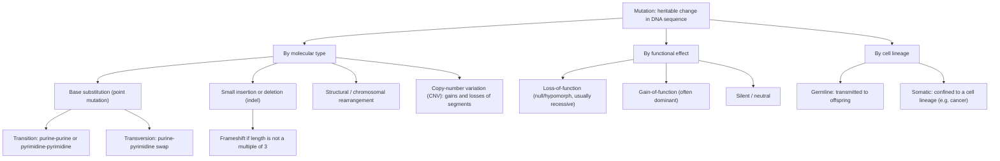
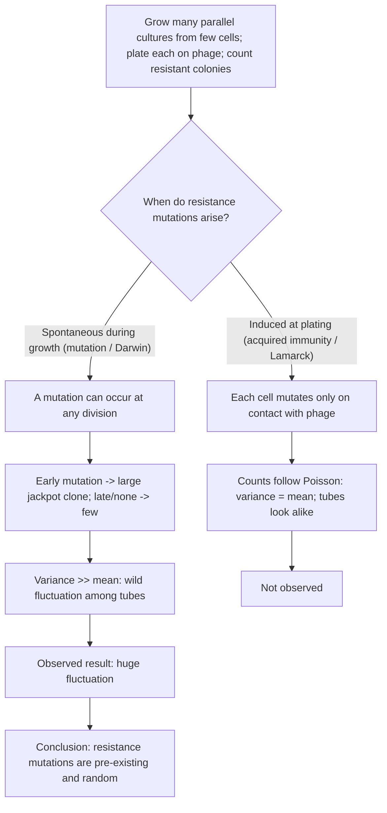
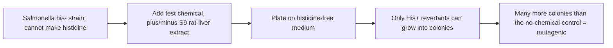

# 돌연변이와 복제수 변이

**강의:** BME333 / BIO333 유전학 (UNIST, 2026 가을) · 강의 08 · ~60분
**강의계획서:** [← 강의계획서](../../lectures/2026.BME333-BIO333-Syllabus.md) — 4주차 수요일, 09-23
**언어:** [English](../../en/lectures/lec08_Mutation-CNV.md) · 한국어

## 학습 목표
이 강의를 마치면 학생들은 다음을 할 수 있어야 한다:
- 돌연변이를 정의하고, 분자적 유형(점, 삽입/결실, 구조적, 복제수)과 기능적 효과로 분류한다.
- Luria–Delbrück 요동 검정(fluctuation test)과 그것이 돌연변이의 기원(기존 존재 대 유도)에 관해 무엇을 증명했는지 설명한다.
- 주요 돌연변이유발(mutagenesis) 기작과 돌연변이가 어떻게 실험적이고 통제 가능한 변수가 되었는지 기술한다.
- Ames 검정과 복귀(reversion)를 이용해 돌연변이원/발암물질을 선별하는 원리를 설명한다.
- 유전체 변이와 질병의 원천으로서 복제수 변이와 전이인자(transposable element)를 기술한다.

## 강의

### 1. 돌연변이란 무엇인가? (~10분)

**돌연변이(mutation)**는 세포나 개체의 DNA 서열에 일어나는 유전 가능한 변화이다. 돌연변이는 모든 유전적 변이의 궁극적 원천이다 — 그것이 없었다면 멘델이 추적할 대립유전자도, 지도화할 재조합형도, 자연선택이 작용할 대상도 없었을 것이다. 그러나 "돌연변이"는 하나의 것이 아니다; 크기와 결과가 매우 다른 분자적 사건들의 집합이며, 이를 제대로 분류하는 것이 그것을 논리적으로 다루는 첫걸음이다.

**그림 — 돌연변이를 세 가지 방식으로 분류하기.**


**분자적 유형**으로 보면, 가장 작은 변화는 **염기 치환(base substitution, 점 돌연변이)**이며, **전이(transition)**(퓨린↔퓨린 또는 피리미딘↔피리미딘, 예: A↔G, C↔T)와 **전환(transversion)**(퓨린↔피리미딘)으로 세분된다. 다음은 **작은 삽입과 결실(indel)**이다; 코딩 영역의 삽입/결실 길이가 3의 배수가 *아니면* 하류의 모든 코돈을 뒤엉키게 하는 **틀이동(frameshift)**이 생긴다. 더 큰 규모에는 **구조적 재배열(structural rearrangement)**(강의 09)과 **복제수 변이(copy-number variant, CNV)** — 킬로베이스에서 메가베이스에 이르는 절편의 증가 또는 손실(구간 5) — 이 있다.

**기능적 효과**로 보면, 핵심 구분은 **기능 상실(loss-of-function)**(활성을 줄이거나 없애는 저형성(hypomorphic) 또는 무효(null) 대립유전자 — 흔히 열성인데, 정상 사본 하나로 충분한 경우가 많기 때문) 대 **기능 획득(gain-of-function)**(새롭거나 과도한 활성 — 흔히 우성)이다. 강의 03을 떠올리면, 멘델의 열성 대립유전자는 거의 모두 기능 상실 병변이며, **우성 = 기능성, 열성 = 비기능성**이다. 코딩 서열 내에서 치환은 **동의(synonymous, 침묵)**, **과오(missense)**(아미노산을 바꿈), 또는 **넌센스(nonsense)**(조기 종결코돈을 만듦)일 수 있다.

**그림 — 코딩 서열에서 치환 또는 삽입/결실의 결과.**

| 변화 | 단백질에 대한 효과 | 전형적 결과 |
|---|---|---|
| 동의(침묵) | 같은 아미노산 | 대개 중립 |
| 과오(missense) | 아미노산 하나 변경 | 다양; 무효, 부분적, 또는 획득일 수 있음 |
| 넌센스(nonsense) | 조기 종결코돈 | 절단된/없는 단백질 (기능 상실) |
| 틀유지 삽입/결실 (×3) | 잔기 추가/제거 | 흔히 부분적 기능 유지 |
| 틀이동 삽입/결실 | 하류의 읽기틀 이동 | 대개 무효 (뒤엉킴 + 조기 종결) |

**세포 계통**으로 보면, **생식세포계(germline)** 돌연변이는 자손에게 전달되는 반면, **체세포(somatic)** 돌연변이는 후손 세포 클론에만 영향을 미친다 — 암의 기초이다.

마지막으로 일찍 짚어둘 개념적 미묘함: 돌연변이는 정말로 **무작위**인가? 고전적(그리고, 앞으로 보겠지만, 실험적으로 증명된) 답은 그렇다이다 — 돌연변이는 그것이 유용할지 여부와 무관하게 발생한다. 그러나 Fitzgerald & Rosenberg는 신중한 읽기를 주장한다: 주어진 자리에서 변화의 *정체*는 예측 불가능하지만, 전반적인 **돌연변이율은 조절되고 진화 가능한 형질**이다. 스트레스 하에서 세포는 **오류 유발 복구(error-prone repair)**로 전환할 수 있다: 영양 결핍 *E. coli*는 **SOS 반응**을 촉발하고(RecA 필라멘트가 LexA 억제자를 절단해 오류 유발 중합효소 Pol IV/Pol V를 탈억제함), **돌연변이유발성 절단 복구(mutagenic break repair)**는 이중가닥절단 주변에 돌연변이를 모은다 — 암 유전체에서 보이는 **카타에기스(kataegis)** 군집과 흡사하다([en](../../en/review/Fitzgerald2019_PLoSgenet_WhatIsMutation.md) · [ko](../../ko/review/Fitzgerald2019_PLoSgenet_WhatIsMutation.md) 참조). 이것은 라마르크를 되살리는 것이 아니다; *방향*이 아니라 *비율*이 생리에 반응한다는 것이다. 역사적으로, "유전자"가 개별적으로 돌연변이 가능한 단위라는 바로 그 발상 — Muller의 **자가촉매(autocatalysis) 대 이질촉매(heterocatalysis)** — 이 돌연변이를 연구 가능하게 만든 환원주의적 틀이었다. 비록 분자유전학이 나중에 유전자가 연속적인 DNA를 과학자가 그은 구획임을 보여주었지만 말이다([en](../../en/review/Falk2010_Genetics_Mutagenesis-ResearchStrategy.md) · [ko](../../ko/review/Falk2010_Genetics_Mutagenesis-ResearchStrategy.md) 참조).

### 2. Luria–Delbrück 요동 검정 (~14분)

1943년 이전에는 근본적인 질문이 열려 있었다: 세균이 치명적 도전(예: 박테리오파지)에서 살아남을 때, 생존자는 파지를 만나기 *전에* 이미 생겨난 **기존의(pre-existing)** 저항성 돌연변이를 지니고 있는가(다윈적 "돌연변이" 관점), 아니면 파지와의 접촉이 일부 세포에 저항성을 **유도(induce)**하는가(라마르크적 "획득 면역" 관점)? 두 가설 모두 같은 결말 — 몇 개의 저항성 집락 — 을 예측하므로, 단순히 생존자를 보는 것으로는 아무것도 결정되지 않는다. **살바도르 루리아(Salvador Luria)**와 **막스 델브뤼크(Max Delbrück)**는 평균이 아니라 *통계*로 두 가설을 구별할 수 있는 실험을 설계했다([en](../../en/article/LuriaDelbruck1943_Genetics_VirusResistance.md) · [ko](../../ko/article/LuriaDelbruck1943_Genetics_VirusResistance.md) 참조).

루리아의 통찰은, 유명하게도, 1942년 교수 무도회에서 **슬롯머신**을 지켜보다 떠올랐다: 대부분의 플레이는 아무것도 주지 않지만, 드문 이른 대박은 거액을 준다. 이를 세균으로 옮기면: 저항성 돌연변이가 **성장 중 자발적으로** 발생한다면, 한 시험관에서 **일찍** 일어난 돌연변이는 도말 시점까지 거대한 **"대박(jackpot)" 클론**으로 복제되는 반면, 늦게 돌연변이하거나 전혀 하지 않은 다른 시험관은 거의 또는 전혀 내지 않는다 — 이는 **엄청난 시험관 간 분산(variance)**을 만든다. 반대로 저항성이 **도말 순간에 유도**된다면, 모든 시험관의 세포가 동시에 독립적으로 파지에 직면하므로 계수는 **포아송 분포(Poisson distribution)**를 따르며, 그 정의적 성질은 **분산 = 평균**이다. 두 가설은 **요동(fluctuation)**에 대해 뚜렷이 다른 예측을 한다.

**그림 — 요동 검정의 논리.**


설계는 두 부분으로 이루어진다. **대조군(control)**(*하나의* 큰 배양에서 많은 표본을 취함)은 도말/계수 단계 자체가 포아송임을 — 표본 추출 변동만 있음을 — 검증한다. **핵심 실험(key experiment)**은 작은 접종물로부터 **많은 독립적 병렬 배양**을 키운 뒤 각각을 따로 도전시킨다. 이 둘의 비교가 논증 전체이며 — Meneely의 교육용 프라이머가 강조하듯 — 미분방정식 **없이도** 이해할 수 있다: 두 표의 퍼짐을 비교하기만 하면 된다([en](../../en/review/LuriaDelbruck1943_Meneely2016_GeneticsClassic.md) · [ko](../../ko/review/LuriaDelbruck1943_Meneely2016_GeneticsClassic.md) 참조).

**그림 — 기존 돌연변이의 특징 (실험 16, 1943년 논문에서).**

| 양 | 값 | 해석 |
|---|---|---|
| 배양당 평균 저항성 집락 | 11.35 | 포아송이라면 분산은 ≈ 11이어야 함 |
| 저항성 집락이 **0개**인 배양 | 20개 중 11개 | 많은 시험관이 전혀 돌연변이하지 않음 |
| 저항성 집락이 35–107개인 배양 | 20개 중 3개 | 이른 돌연변이에서 온 **대박** |
| 관찰된 분산 | ≫ 평균 | 포아송 / 획득 면역과 양립 불가 |

거대한 초과 분산 — 많은 0과 함께 있는 소수의 대박 — 은 획득 면역 하에서는 불가능하며, 기존의 무작위 돌연변이가 정확히 예측하는 바이다. 루리아와 델브뤼크는 또한 **돌연변이율**을 두 가지 방식으로(무돌연변이 배양의 비율 P₀ = e⁻ʰ로부터, 그리고 평균으로부터) 추출하여 **분열당 세균당 ~2.45 × 10⁻⁸ 돌연변이**를 얻었는데, 이는 현대의 전장 유전체 추정치와 놀랍도록 가깝다. 그 결론은 현대 종합설(Modern Synthesis)의 초석이다: **선택은 기존 변이를 드러낼 뿐, 만들지 않는다.** 같은 논리가 오늘날의 **항생제 내성**을 설명한다 — 내성 돌연변이체는 약물 이전에 이미 존재하며, 약물은 그저 그들을 선택할 뿐이다([en](../../en/review/LuriaDelbruck1943_Meneely2016_GeneticsClassic.md) · [ko](../../ko/review/LuriaDelbruck1943_Meneely2016_GeneticsClassic.md) 참조).

가르칠 만한 통계적 후일담: 루리아와 델브뤼크는 "상당한 수학적 어려움"을 이유로 전체 분포를 유도하지 못했다. **J.B.S. Haldane**은 1946년 조합론적 해(*x*개의 돌연변이체를 만드는 방법의 수가 *x*를 2의 거듭제곱의 합으로 나누는 분할에 대응)를 알아냈으나 정식으로 출판하지 않았다. Haldane은 또한 선견지명 있게, **네 가지 비이상적 요인**(배양의 일부만 도말, 비동기 분열, 세포 사멸, 돌연변이체의 느린 성장)이 모두 분산을 *줄인다*는 것을 보였다 — 따라서 단지 낮은 분산만으로는 방향성 돌연변이를 증명할 수 없다. 이 단서는 Cairns 등(1988)이 "방향성 돌연변이(directed mutation)" 논쟁을 되살렸을 때 핵심이 되었다([en](../../en/review/Sarkar1991_Genetics_LuriaDelbruck+Haldane.md) · [ko](../../ko/review/Sarkar1991_Genetics_LuriaDelbruck+Haldane.md) 참조).

### 3. 실험 도구로서의 돌연변이 (~10분)

루리아와 델브뤼크는 돌연변이가 스스로 발생함을 보였다. 그에 앞선, 마찬가지로 변혁적인 단계는 돌연변이를 요청에 따라 **만드는** 법을 배운 것이었다 — 돌연변이를 "닿을 수 없는 신"에서 "연구 가능한 대상"으로 바꾼 것이다. 그 단계가 **헤르만 J. 뮬러(Hermann J. Muller)**의 1927년 **X선이 돌연변이를 유도한다**는 증명이었다([en](../../en/review/Crow1997_Genetics_Mutation-BecomesExperimental.md) · [ko](../../ko/review/Crow1997_Genetics_Mutation-BecomesExperimental.md) 참조). Muller는 러더퍼드의 원자 *변환(transmutation)*을 의식적으로 모델로 삼아 논문 제목을 "유전자의 인위적 변환(Artificial Transmutation of the Gene)"이라 붙였고, "만 오천 퍼센트"의 돌연변이율 증가를 보고했다. 흥미롭게도 1927년 논문에는 **데이터가 없었고** — T. H. Morgan의 회의를 불렀다 — Muller는 1928년의 완전한 기술로 이에 답했다.

Crow와 Abrahamson은 Muller의 더 깊은 기여가 방사선 자체가 아니라 **방법**이었음을 강조한다. 돌연변이는 드물기 때문에, 그것을 신뢰성 있게 계수하는 것이 진짜 문제이다. Muller의 해법은 지금도 가르쳐진다:

- **가시적 돌연변이가 아니라 열성 치사를 계수하라.** 치사는 훨씬 많고 명확하다 — "생존자 없음"은 "개인차(personal equation)"를 제거하여, 평범한 기술자도 예리한 전문가만큼 잘 계수하게 한다.
- **균형 치사/교차 억제 계통을 사용하라.** Muller의 유명한 **ClB** 염색체(**C** = 교차 억제자, 나중에 **역위(inversion)**로 밝혀짐; **l** = 열성 **l**ethal(치사); **B** = **B**ar 표지자)는 X-연관 치사율을 거의 눈으로 읽게 했다: **수컷이 없는** F₂ 배양이 새로운 치사를 신호했다.
- **비율이 조절 가능함을 보여라.** 방사선 이전에 Muller는 **온도**가 돌연변이율을 바꾸는지 수년간 검정했다(화학반응 같은 것이라면 10 °C마다 대략 두 배가 되어야 한다는 추론). 텍사스의 더위 속에서 젖은 천과 선풍기를 사용하며 말이다. 단지 비율이 *움직일 수 있음*을 보인 것만으로도 돌연변이가 물리적 과정임을 증명했다.

이 도구들은 **방사선 유전학(radiation genetics)**과 **선형 용량–반응(linear dose–response)** 관계(점 돌연변이 = "단일 타격(single-hit)" 표적; 재배열은 ≥2회 절단 필요)를 출범시켰고, 이는 물리학자들을 생물학으로 끌어들였다: Timoféeff-Ressovsky, Zimmer & Delbrück(1935)의 **표적 이론(target theory)**은 유전자의 크기를 재려 했고, Delbrück의 양자적 유전자관은 슈뢰딩거의 *생명이란 무엇인가(What Is Life?)*에 영감을 주었다. 화학적 돌연변이원이 유전자의 화학을 드러내리라는 Muller의 희망은 훗날 **샬럿 아우어바흐(Charlotte Auerbach)**(겨자 가스)에 의해서만 실현되었고, 유전자의 본질은 대신 DNA 구조에서 왔다([en](../../en/review/Falk2010_Genetics_Mutagenesis-ResearchStrategy.md) · [ko](../../ko/review/Falk2010_Genetics_Mutagenesis-ResearchStrategy.md) 참조). 돌연변이유발은 유전학의 근간으로 남았다 — Benzer의 정밀 구조 *rII* 지도, 염기 유사체를 이용한 전이/전환 분류, 3중 부호(triplet code)를 확립한 아크리딘(acridine) 틀이동 — 그리고 오늘날에는 돌연변이성 *자체*(돌연변이유발 유전자, 복구 충실도, 암 돌연변이 시그니처)가 단지 도구가 아니라 연구 **표적**이 되었다([en](../../en/review/Falk2010_Genetics_Mutagenesis-ResearchStrategy.md) · [ko](../../ko/review/Falk2010_Genetics_Mutagenesis-ResearchStrategy.md) 참조).

### 4. 돌연변이원 검출: Ames 검정 (~10분)

돌연변이가 유도될 수 있다면, 우리 환경의 화학물질이 돌연변이원일 수 있고 — 돌연변이가 암을 일으키므로 돌연변이원은 후보 **발암물질(carcinogen)**이다. **브루스 에임스(Bruce Ames)**는 이것을 **복귀(reversion)**에 기반한 빠르고 값싼 세균 검정으로 바꾸었다([en](../../en/review/Goodson-Gregg2009_Genetics_AmesTest.md) · [ko](../../ko/review/Goodson-Gregg2009_Genetics_AmesTest.md) 참조). 그 요령은 우아하다: **히스티딘을 합성할 수 없어** 히스티딘 없는 배지에서 자랄 수 없는 **his⁻** *Salmonella typhimurium* 균주에서 시작한다. 히스티딘 생합성을 복원하는 **복귀 돌연변이(reversion mutation)**는 세포가 자라서 **His⁺ 집락**을 이루게 한다. **복귀 집락의 수**는 시험 화학물질이 돌연변이율을 얼마나 강하게 높이는지를 측정한다.

**그림 — Ames 복귀 검정.**


두 가지 설계 특징이 이 검정을 강력하게 만든다. 첫째, **S9를 이용한 대사 활성화**: 많은 화학물질은 간의 효소가 반응성 **전돌연변이원(promutagen)**으로 바꾸기 전까지는 무해하다. 포유류 **S9 간 추출물**을 추가하면 플레이트가 이 활성화를 모방하여, 대사가 필요한 발암물질을 검정이 잡아낸다. 둘째, **균주 특이적 복귀가 돌연변이 스펙트럼을 드러낸다**: 교육용 버전은 **TA1535**(**과오(missense)** 대립유전자, *hisG46*)와 **TA1538**(**틀이동(frameshift)** 대립유전자, *hisD3052*)을 사용한다. 염기 치환을 일으키는 돌연변이원(아지드화나트륨, NaN₃)은 **TA1535만** 복귀시키는 반면, 틀이동 돌연변이원(4-니트로-o-페닐렌디아민, 4NOP)은 **TA1538만** 복귀시킨다 — **서로 다른 돌연변이원이 서로 다른 종류의 돌연변이를 만든다**는 직접적이고 실습적인 증명이다. 복귀체를 시퀀싱하면 그 요점이 분자적으로 드러난다: TA1535 복귀체는 대부분 2-bp 창 내의 C→T 전이 또는 C→A 전환이고, TA1538 복귀체는 야생형 서열로 돌아가지 *않으면서* 읽기틀을 복원하는 ~30 bp에 걸친 다양한 삽입/결실을 보인다 — 많은 DNA 서열, 하나의 기능적 표현형([en](../../en/review/Goodson-Gregg2009_Genetics_AmesTest.md) · [ko](../../ko/review/Goodson-Gregg2009_Genetics_AmesTest.md) 참조). Ames 양성과 발암성 사이의 넓은 상관관계가 지속되는 공중보건적 성과이다.

### 5. 복제수 변이 (~8분)

모든 변이가 단일 염기인 것은 아니다. **복제수 변이(copy-number variant, CNV)**는 ~1 kb에서 수 Mb에 이르는 DNA 절편의 증가(중복, duplication) 또는 손실(결실, deletion)로, 개체가 유전체의 한 구간을 **서로 다른 사본 수**로 지니게 한다. CNV는 **사람 구조 변이의 주요 부류**로, 총합으로는 SNP보다 더 많은 염기쌍에 영향을 미치며, **유전자 용량(gene dosage)**(용량 민감성 유전자의 사본이 너무 많거나 적음)을 통해 질병과 관련된다.

주요 기작은 **비대립 상동 재조합(non-allelic homologous recombination, NAHR)**이다: 유전체에는 거의 동일한 반복 서열이 흩어져 있어, 감수분열 동안 이들이 **잘못 정렬(misalign)**되어 재조합이 *비대립* 사본 사이에서 일어날 수 있다. 그러면 불균등 교환이 한 산물에서 사이의 절편을 결실시키고, 상보적 산물에서는 그것을 중복시킨다.

**그림 — 비대립 상동 재조합이 CNV를 만든다.**
```
Normal alignment:      ==[repeat]==geneX==[repeat]==
                       ==[repeat]==geneX==[repeat]==

Misalignment of repeats (the two repeats pair out of register):
                       ==[repeat]==geneX==[repeat]==
                            \________________/
                       ==[repeat]==geneX==[repeat]==

Unequal crossover products:
   Deletion:   ==[repeat]==          (geneX lost)   -> dosage too low
   Duplication:==[repeat]==geneX==geneX==[repeat]==  -> dosage too high
```

NAHR의 반복 기질은 흔히 **전이인자 사본**(구간 6)이다: **Alu–Alu** 재조합만으로도 **70종 이상의 단일유전자 질병**에 연루되었고, **L1–L1** 재조합은 Alport 증후군에서 *COL4A5/COL4A6*에 걸친 40 kb 이상을 결실시켰다([en](../../en/review/Payer2019_NatRevGenet_TE-Disease.md) · [ko](../../ko/review/Payer2019_NatRevGenet_TE-Disease.md) 참조). CNV는 어레이 비교 유전체 혼성화(array comparative genomic hybridization)와, 점점 더 단일/장쇄 판독 시퀀싱으로 검출된다; 단일 사건이 한 번에 많은 유전자의 용량을 바꿀 수 있으므로, CNV는 개념적으로 점 돌연변이와 강의 09의 전체 염색체 불균형 사이에 자리한다.

### 6. 전이인자 (~8분)

**전이인자(transposable element, TE)**는 유전체 곳곳에서 자신을 복사하거나 이동시키는 가동 DNA 서열이다 — 유전체가 자기 안에 지니고 다니는 돌연변이원이다. 이들은 변방의 진기함이 아니다: TE 유래 서열은 사람 유전체의 대략 **절반**을 이룬다. 오늘날 가장 중대한 부류는 **레트로트랜스포존(retrotransposon)**으로, RNA 중간체를 통해 이동하며, 이 RNA가 역전사되어 **표적 프라이밍 역전사(target-primed reverse transcription, TPRT)**에 의해 새로운 자리에 삽입된다([en](../../en/review/Payer2019_NatRevGenet_TE-Disease.md) · [ko](../../ko/review/Payer2019_NatRevGenet_TE-Disease.md) 참조).

**그림 — 주요 사람 전이인자.**

| 인자 | 부류 | ~유전체 비율 | 자율성 |
|---|---|---|---|
| **LINE-1 (L1)** | 자율 레트로트랜스포존 | ~17% | ORF1p(RNA 결합)와 ORF2p(엔도뉴클레아제 + 역전사효소)를 암호화 |
| **Alu** (SINE) | 비자율 | ~11% | 이동하려 L1 기구를 가로챔 |
| **SVA** | 비자율 | 작음 | 이동하려 L1 기구를 가로챔 |
| **ERV** (LTR) | 내인성 레트로바이러스 | — | 현생 인류에서는 대체로 불활성화됨 |

**L1**은 현재 유일하게 자율적인 사람 레트로트랜스포존이다; **Alu**와 **SVA**는 L1의 효소를 이용하는 비자율 "기생충의 기생충"이다. TE 삽입은 독특하다: 일반적인 CNV와 달리 삽입은 **기능적 서열을 함께 가져온다** — 프로모터, 스플라이스 신호, 2차 구조 — 그래서 여러 방식으로 유전자를 교란할 수 있다: **코딩 엑손**으로의 삽입(틀이동/조기 종결; 최초로 보고된 예는 **혈우병 A**를 일으킨 신생(de novo) L1, 1988), **스플라이스 부위 교란** 또는 인트론 삽입에 의한 엑손 건너뛰기(예: *NF1*), 스플라이스 신호를 기부하는 **엑손화(exonization)**(예: *RB1* 내부), 또는 **큰 측면 결실을 동반한** 삽입(*NF1*에서 867-kb 결실을 촉발한 SVA). 집단 수준에서 단일 삽입은 흔한 질병 대립유전자가 될 수 있다 — *FKTN* 3′ UTR의 SVA는 일본에서 후쿠야마 선천성 근이영양증(Fukuyama congenital muscular dystrophy) 대립유전자의 **80%**를 차지하고, *TAF1*의 SVA는 필리핀 집단에서 X-연관 근긴장이상-파킨슨증(dystonia-parkinsonism)을 일으킨다. 사람에서는 **16,000개 이상의 다형성 TE**가 분리되며(알려진 구조 변이의 ~24%), 일부는 GWAS 신호 근처에서 eQTL로 작용한다([en](../../en/review/Payer2019_NatRevGenet_TE-Disease.md) · [ko](../../ko/review/Payer2019_NatRevGenet_TE-Disease.md) 참조).

TE는 보통 **DNA 메틸화와 이질염색질(heterochromatin)**로 침묵되지만, 이 통제는 암에서 무너진다: L1 프로모터 **저메틸화(hypomethylation)**, 상승된 ORF1p, 그리고 체세포 레트로전이가 종양에서 흔하다. 그리고 구간 5에서 보았듯이, *불활성*이고 고정된 TE 사본조차 **NAHR의 반복 기질**로서 장기적으로 위험하게 남는다. 따라서 TE는 강의 전체를 하나로 묶는다: 이들은 점 규모 돌연변이원(삽입), 구조적 돌연변이원(결실), 복제수 기여자이며, 탈억제되면 질병에서 체세포 돌연변이의 유발자이다.

## 핵심 정리
- **돌연변이**는 유전 가능한 DNA 변화이다; **분자적 유형**(치환 = 전이/전환; 삽입-결실/틀이동; 구조적; CNV), **기능적 효과**(기능 상실 대 획득; 침묵/과오/넌센스), **계통**(생식세포 대 체세포)으로 분류한다.
- **Luria–Delbrück 요동 검정**은 **분산**으로 가설을 구별한다: 기존의 무작위 돌연변이는 거대한 시험관 간 요동("대박", 분산 ≫ 평균)을 주는 반면, 파지 유도 돌연변이는 포아송 분포(분산 = 평균)를 줄 것이다. 자료는 **선택이 기존 변이를 드러낸다**는 것을 증명했다(돌연변이율 ~2.45 × 10⁻⁸/분열).
- **Muller**는 주로 **방법**을 통해 돌연변이를 실험적으로 만들었다(X선, 1927) — 열성 치사 계수, **ClB** 교차 억제자/밸런서 요령, 그리고 비율이 조절 가능함을 보인 것 — 방사선 유전학과 선형 용량–반응을 출범시켰다.
- **Ames 검정**은 *Salmonella his⁻* 영양요구체(auxotroph)의 **복귀**를 (**S9** 활성화와 함께) 계수하여 돌연변이원을 검출한다; 균주 특이적 복귀(과오 TA1535 대 틀이동 TA1538)가 돌연변이 스펙트럼을 드러내고, Ames 양성은 대체로 발암성을 예측한다.
- **CNV**(kb–Mb 증가/손실)는 주로 **유전자 용량**을 통해 작용하고 반복 서열(흔히 Alu/L1) 사이의 **NAHR**로 생기며, 사람 구조 변이의 주요 부류이다.
- **전이인자**(유전체의 ~절반; L1 ~17% 자율, Alu ~11%와 SVA 비자율)는 삽입, 스플라이스 교란, 엑손화, 측면 결실, 그리고 — 불활성일 때조차 — NAHR 기질로 작용하여 질병을 일으키는 내부 돌연변이원이다; 보통 메틸화로 침묵되지만 암에서 재활성화된다.

## 교재 참고
- **Genetics: From Genes to Genomes (8e)** — Ch. 7 Mutation; Ch. 12 Analyzing Genomic Variation. → [textbook ref](../../lectures/ref.Genetics-FromGenesToGenomes.md)

## 이 저장소의 노트
수업에서 소개할 리뷰 및 논문 (각각 en/ko 이중 언어 쌍이 있음):
- `LuriaDelbruck1943_Genetics_VirusResistance` — 세균 돌연변이의 기원에 관한 원조 요동 검정 논문. · [en](../../en/article/LuriaDelbruck1943_Genetics_VirusResistance.md) · [ko](../../ko/article/LuriaDelbruck1943_Genetics_VirusResistance.md)
- `LuriaDelbruck1943_Meneely2016_GeneticsClassic` — 1943년 실험을 교육에 쉽게 만든 Genetics "Classic" 논평. · [en](../../en/review/LuriaDelbruck1943_Meneely2016_GeneticsClassic.md) · [ko](../../ko/review/LuriaDelbruck1943_Meneely2016_GeneticsClassic.md)
- `Sarkar1991_Genetics_LuriaDelbruck+Haldane` — Haldane의 관련 사고를 포함한 역사적/통계적 맥락. · [en](../../en/review/Sarkar1991_Genetics_LuriaDelbruck+Haldane.md) · [ko](../../ko/review/Sarkar1991_Genetics_LuriaDelbruck+Haldane.md)
- `Crow1997_Genetics_Mutation-BecomesExperimental` — 돌연변이가 어떻게 실험적으로 다룰 수 있는 변수가 되었는가. · [en](../../en/review/Crow1997_Genetics_Mutation-BecomesExperimental.md) · [ko](../../ko/review/Crow1997_Genetics_Mutation-BecomesExperimental.md)
- `Falk2010_Genetics_Mutagenesis-ResearchStrategy` — 유전학에서 의도적 연구 전략으로서의 돌연변이유발. · [en](../../en/review/Falk2010_Genetics_Mutagenesis-ResearchStrategy.md) · [ko](../../ko/review/Falk2010_Genetics_Mutagenesis-ResearchStrategy.md)
- `Fitzgerald2019_PLoSgenet_WhatIsMutation` — "돌연변이란 무엇인가"에 대한 현대적 개념 틀. · [en](../../en/review/Fitzgerald2019_PLoSgenet_WhatIsMutation.md) · [ko](../../ko/review/Fitzgerald2019_PLoSgenet_WhatIsMutation.md)
- `Goodson-Gregg2009_Genetics_AmesTest` — 돌연변이원과 발암물질을 검출하는 Ames 복귀 검정. · [en](../../en/review/Goodson-Gregg2009_Genetics_AmesTest.md) · [ko](../../ko/review/Goodson-Gregg2009_Genetics_AmesTest.md)
- `Payer2019_NatRevGenet_TE-Disease` — 돌연변이원으로서의 전이인자와 사람 질병에서의 역할. · [en](../../en/review/Payer2019_NatRevGenet_TE-Disease.md) · [ko](../../ko/review/Payer2019_NatRevGenet_TE-Disease.md)

## 토론 문제
1. "획득 면역"과 "자발적 돌연변이" 가설 모두 파지 도전 후 몇 개의 저항성 집락을 예측한다. 평균이 아니라 병렬 배양 간의 *분산*을 측정하는 것이 왜 정확히 이들을 구별하는지 설명하고, 실험 16의 수치(20개 중 11개가 0개; 3개가 35–107개)를 해석하라.
2. Haldane은 네 가지 "비이상적" 실험 요인이 모두 돌연변이체 분포의 분산을 *줄인다*는 것을 보였다. 이것이 왜 단지 낮은 분산만으로는 "방향성" 돌연변이를 증명할 수 없음을 뜻하는가? 이를 1988년 Cairns의 적응 돌연변이(adaptive-mutation) 논쟁과 Fitzgerald & Rosenberg의 스트레스 유도 돌연변이유발 관점에 연결하라.
3. Muller는 자신의 가장 큰 기여가 X선이 돌연변이를 일으킨다는 발견이 아니라 방법이라고 주장했다. 열성 치사를 계수하고 ClB 교차 억제 계통을 사용한 것이 왜 그토록 강력했는지, 그리고 "개인차를 제거하는 것"이 정량적으로 무엇을 그에게 안겨주었는지 설명하라.
4. Ames 검정은 두 *Salmonella* 균주(과오 TA1535, 틀이동 TA1538)와 S9 간 추출물을 사용한다. 각 설계 요소가 무엇에 기여하는지, 그리고 접시 안 세균에게는 무해한 화학물질이 왜 여전히 S9 단계가 잡으려는 발암물질일 수 있는지 설명하라.
5. 단일 전이인자 삽입은 점 돌연변이, 스플라이스 돌연변이, CNV, 그리고 이후 재배열의 유발자처럼 행동할 수 있다. 예시(혈우병 A L1 엑손 삽입; NF1 스플라이스/결실; Alu–Alu NAHR)를 사용해 각 방식을 훑고, "삽입은 기능적 서열을 함께 가져온다"는 것이 왜 TE를 일반적 CNV와 질적으로 다르게 만드는지 설명하라.
6. CNV는 주로 유전자 용량을 통해 작용한다. NAHR 잘못 정렬 도표를 사용해, 왜 *같은* 사건이 한 감수분열 산물에서는 결실을, 다른 산물에서는 중복을 만드는지, 그리고 왜 반복 서열(Alu, L1)이 통상적인 원인인지 설명하라.
