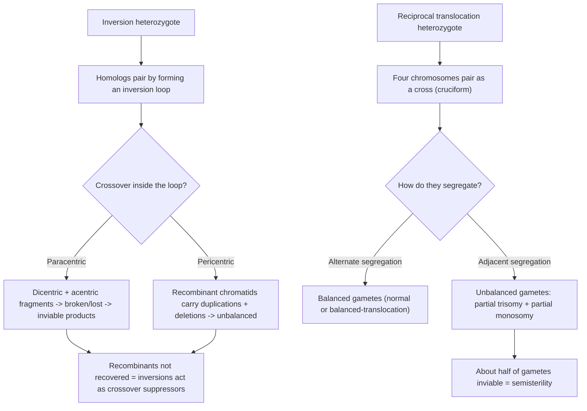
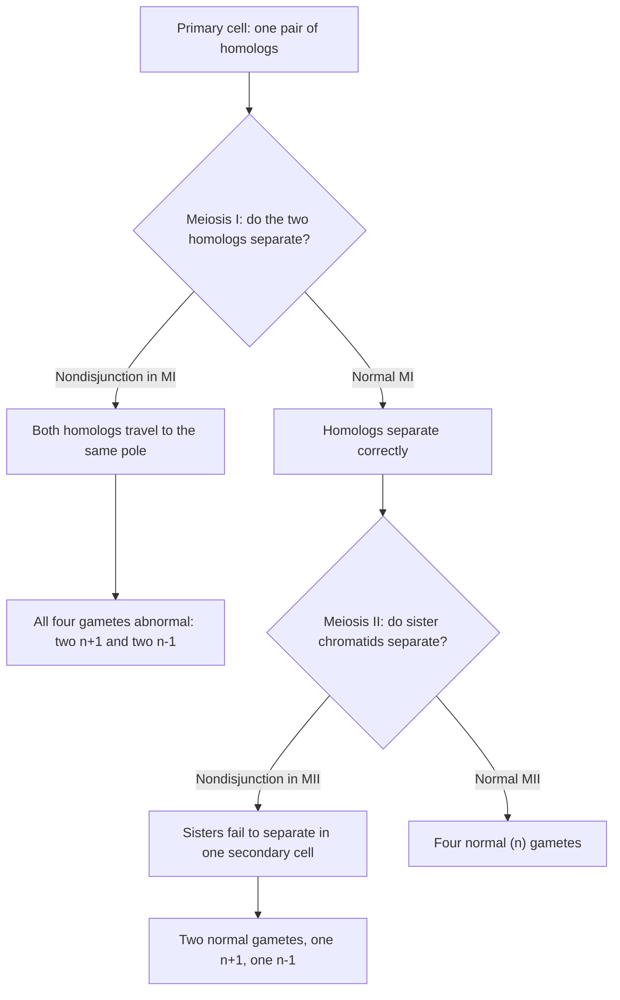
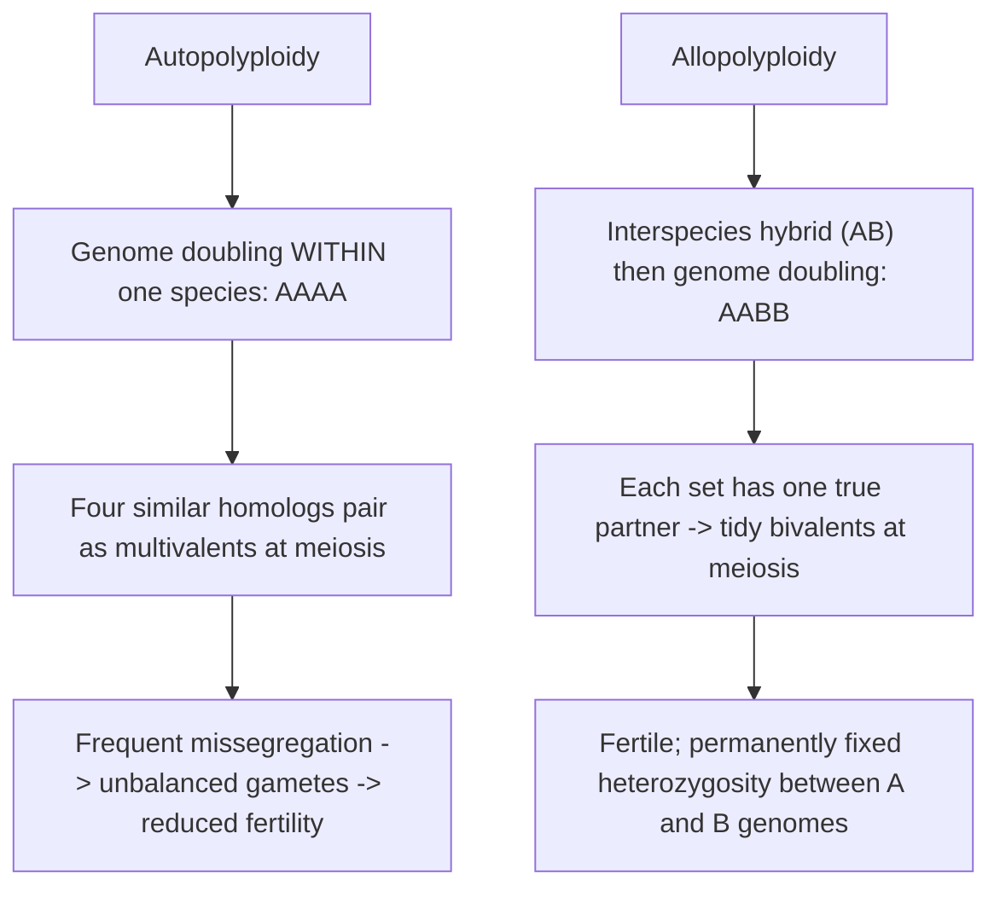
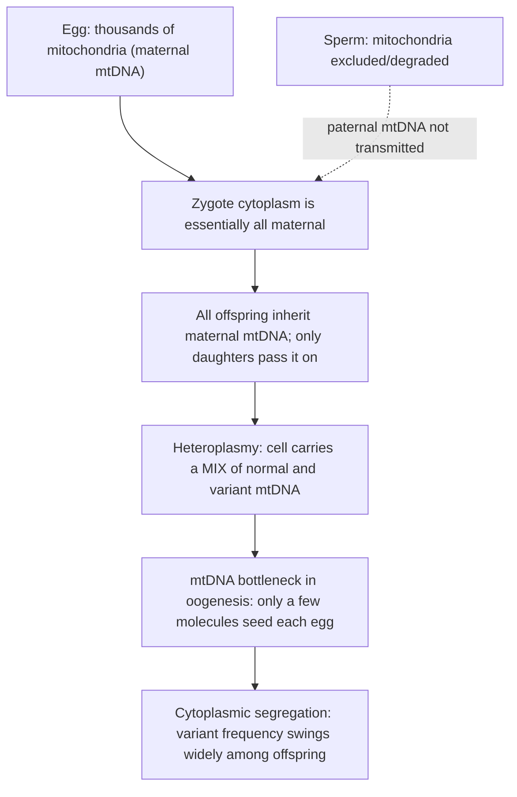

# 재배열, 배수성 및 세포소기관 유전

**강의:** BME333 / BIO333 유전학 (UNIST, 2026 가을) · 강의 09 · ~60분
**강의계획서:** [← 강의계획서](../../lectures/2026.BME333-BIO333-Syllabus.md) — 5주차 수요일, 09-30
**언어:** [English](../../en/lectures/lec09_Rearrangement-Ploidy-Organellar.md) · 한국어

## 학습 목표
이 강의를 마치면 학생들은 다음을 할 수 있어야 한다:
- 주요 염색체 재배열(결실, 중복, 역위, 전좌)을 분류하고 그 감수분열적·표현형적 결과를 예측한다.
- 정배수성(euploidy)과 이수성(aneuploidy)을 구별하고, 비분리(nondisjunction)가 어떻게 삼염색체성(trisomy) 같은 이수체를 만드는지 설명한다.
- 자가배수체(autopolyploidy)와 이질배수체(allopolyploidy)를 비교하고, 전장 유전체 중복(whole-genome duplication)의 진화적 이점과 대가를 평가한다.
- 세포소기관(미토콘드리아/엽록체) 유전을 기술하고, 이를 멘델식 핵 유전과 대조한다(모계 유전, 이질형질성(heteroplasmy), 세포질 분리(cytoplasmic segregation)).

## 강의

### 1. 염색체 재배열 (~15분)

앞 강의는 복제수 규모까지의 돌연변이를 다루었다. 이제 **염색체 구조**의 변화로 시야를 넓힌다 — 염색체의 통째 블록을 이동, 결실, 중복, 또는 재배향하는 재배열이다. 이들이 중요한 이유는 둘이다: 이들은 **유전자 용량과 유전자 순서**를 바꾸고, 보인자(carrier)가 보통 재배열에 대해 **이형접합**(정상 염색체 하나, 재배열 염색체 하나)이므로, 감수분열에서 상동염색체를 뒤틀린 짝짓기 배열로 몰아 비정상적이고 흔히 불균형한 배우자를 만든다. 정형적인 네 가지 유형이 있다.

**그림 — 네 가지 구조적 재배열 (o = 동원체).**
```
Normal:              A — B — o — C — D — E — F — G

Deletion (loses C D):A — B — o — · — · — E — F — G      dosage too low
Duplication (C D):   A — B — o — C — D — C — D — E — F — G   dosage too high
Paracentric inv.:    A — B — o — E — D — C — F — G      (inverted block excludes centromere)
Pericentric inv.:    A — C — o — B — D — E — F — G      (inverted block spans centromere)
Reciprocal transloc.:A — B — o — C — [T U V]           two NON-homologs exchange ends
                     P — Q — o — R — [D E F G]
```

**결실(deletion)**은 절편을 제거한다; 큰 결실은 용량을 낮추고 남은 상동염색체의 열성 대립유전자를 **드러낼(unmask)** 수 있어(**유사우성, pseudodominance**) 보통 해롭다. **중복(duplication)**은 사본을 더한다 — 용량을 높이지만, 진화적 시간에 걸쳐 **새로운 유전자의 원료**도 제공한다(강의 03과 아래 구간 3의 하위기능화(subfunctionalization)/신기능화(neofunctionalization)를 떠올려라). **역위(inversion)**는 절편을 뒤집는다: **동원체 외(paracentric)** 역위는 전적으로 한 팔에 놓이고(동원체는 고리 *바깥*에 있음), **동원체 내(pericentric)** 역위는 동원체를 *포함한다*. **전좌(translocation)**는 절편을 비상동 염색체로 옮긴다; **상호(reciprocal)** 전좌는 두 비상동염색체 사이의 양방향 말단 교환이다.

유전학적으로 중요한 거동은 **이형접합체**의 감수분열에서 나타난다. 재배열된 염색체와 정상 염색체가 여전히 유전자 대 유전자로 짝지으려 할 때이다.

**그림 — 역위 및 전좌 이형접합체의 감수분열적 결과.**


정상 짝과 짝지으려면 **역위 이형접합체**는 역위된 절편을 **역위 고리(inversion loop)**로 던져 넣어야 한다. 그 고리 *안*에서의 교차는 파국적이다: **동원체 외** 역위에서는 **이동원체(dicentric)** 염색분체(동원체 둘, 서로 당겨져 부서짐)와 **무동원체(acentric)** 조각(동원체 없음, 소실됨)을 낳아 — 재조합 산물이 죽는다; **동원체 내** 역위에서는 재조합체가 **중복과 결실**을 지녀 불균형해진다. 어느 쪽이든 **재조합 염색분체가 회수되지 않으므로**, 역위는 **교차 억제자(crossover suppressor)**로 행동한다 — 바로 Muller가 그의 ClB **밸런서(balancer)** 염색체에서 이용한 성질이다(강의 08). 이것은 만족스러운 상호 연결이다: ClB의 "C"가 역위이다.

**상호 전좌 이형접합체**는 두 개의 단순한 이가염색체로 짝지을 수 없다; 참여하는 네 염색체가 **십자형(cross, cruciform)**으로 정렬한다. 이 십자에서의 분리가 배우자 균형을 결정한다. **교대 분리(alternate segregation)**(두 정상 염색체가 한 극으로, 두 전좌 염색체가 다른 극으로)는 **균형 배우자(balanced gamete)**를 낳고; **인접 분리(adjacent segregation)**는 중복과 결실을 지닌 **불균형 배우자**를 낳는다. 대략 절반의 배우자가 불균형하고 생존 불가하므로, 전좌 이형접합체는 전형적으로 **반불임(semisterility)**(생존 가능 배우자 ~50%)을 보인다 — 진단적 지표이다. 전좌는 또한 **연관을 바꾸어**, 유전자를 새로운 염색체로 옮겨 어떤 유전자가 함께 분리되는지를 변경한다. 특수한 경우가 **로버트슨 전좌(Robertsonian translocation)**이다: 두 개의 **말단동원체(acrocentric)** 염색체가 동원체 근처에서 융합하여 하나의 중앙동원체(metacentric) 염색체를 만들어 **염색체 수를 줄인다**. 로버트슨 융합은 유전 가능한 **가족성(familial)** 다운 증후군을 설명한다(14;21 융합 보인자는 표현형적으로 정상이지만 여분의 21번 염색체 용량을 전달한다) — 재배열을 구간 2의 이수성과 직접 연결한다.

### 2. 이수성 (~12분)

**정배수(euploid)** 세포는 완전한 염색체 세트의 정수배(반수체 *n*, 이배체 2*n* 등)를 지닌다. **이수성(aneuploidy)**은 정확한 배수에서 벗어난 것 — **개별** 염색체의 획득 또는 손실이다: **단염색체성(monosomy)**(2*n* − 1), **삼염색체성(trisomy)**(2*n* + 1) 등. 이수성은 알려진 사람 유산과 선천 증후군의 주요 원인이며, 정확히 염색체가 많은 **용량 민감성** 유전자를 지니기 때문에 문제가 된다: 두 사본 대신 하나 또는 세 사본을 가지면 수많은 유전자 산물의 화학량론이 한꺼번에 어긋난다.

이수성은 주로 **비분리(nondisjunction)** — 세포 분열 중 염색체가 제대로 분리되지 못하는 것 — 에서 생긴다. 실패의 *단계*가 비정상 배우자의 양상을 결정한다.

**그림 — 감수분열 I 대 감수분열 II에서의 비분리.**


**감수분열-I 비분리**(상동염색체가 분리 실패)는 **네 산물 모두**를 이수체로 만든다; **감수분열-II 비분리**(자매 염색분체가 분리 실패)는 정상 배우자 둘과 이수체 둘을 남긴다. *n* + 1 배우자의 수정은 삼염색체성 접합체를, *n* − 1 배우자는 단염색체성 접합체를 만든다. 사람에서 대부분의 상염색체 단염색체성과 삼염색체성은 초기에 치사이다; 생존 가능한 것은 유전자가 적거나 용량에 관대한 염색체와 성염색체를 포함한다.

**그림 — 흔한 사람 이수성.**

| 질환 | 핵형 | 염색체 불균형 |
|---|---|---|
| 다운 증후군 | 47,XX(또는 XY) +21 | 21번 삼염색체성 (여분의 상염색체 21) |
| 에드워즈 증후군 | 47,+18 | 18번 삼염색체성 |
| 파타우 증후군 | 47,+13 | 13번 삼염색체성 |
| 터너 증후군 | 45,X | X 단염색체성 (성염색체) |
| 클라인펠터 증후군 | 47,XXY | 여분의 X (성염색체) |

우리가 "47,+21"을 *말할* 수 있다는 것조차 놀랍도록 최근의 성취이다. 30년 넘게 사람의 이배체 수는 Painter의 1920년대 연구를 따라 **48**로 잘못 세어졌는데, **Tjio와 Levan**이 1956년 세포 배양, **저장액 충격(hypotonic shock)**, 그리고 **콜히친(colchicine)**을 사용해 중기 염색체를 깔끔하게 펼쳐 **46**을 확립할 때까지 그러했다. Gartler는 그 오랜 오류가 부실한 기술 *과* 인지적 **선입견(preconception)** 둘 다를 반영한다고 강조한다 — 이전 연구자들은 46을 *보고도* 통용되던 숫자를 따랐다. 그 성과는 즉각적이었다: 3년 이내에 올바른 수가 **21번 삼염색체성, 45,X, 47,XXY**의 식별을 가능하게 하여 의학 세포유전학을 세웠다([en](../../en/review/Gartler2006_NatRevGenet_HumanChromosomeNumber.md) · [ko](../../ko/review/Gartler2006_NatRevGenet_HumanChromosomeNumber.md) 참조). 염색체 수를 세는 것이 세포당 염색체가 잘못 세어졌음을 인식하기 위한 전제 조건이었다.

이수성의 더 미묘한 결과가 이 구간을 마무리한다. 여분이거나 결여된 유전자의 평균적 효과를 넘어, 이수성은 유전적으로 동일한 세포들이 **서로 다르게** 행동하게 만든다. Beach 등은 출아효모에서 유도 가능한 염색체 오분리 시스템을 만들어, **같은** 이수 핵형을 가진 세포가 세포주기 타이밍, 스트레스 반응, 유전자 발현에서 **크게 상승된 세포 간 변이성**을 가짐을 보였다 — 이수성의 *정도*에 따라 커지는 변이성이다. 이 "**비유전적 개별성(non-genetic individuality)**"은 유전되지 않으며(한 세포 자신의 분열들에 걸친 세포주기 지속 시간은 상관이 없었다), 부분적으로 확률적 DNA 손상에 의해 유발된다(*RAD9* 체크포인트를 제거하면 감소했다). 이 효과는 **삼염색체-13 및 삼염색체-19 생쥐 배아**에서도 유지되어, 유전적으로 동일한 한배 새끼 사이에서 다양한 안면 형태, 부종, 출혈을 보였다([en](../../en/article/Beach2017_Cell_Aneuploidy-NonGeneticIndividuality.md) · [ko](../../ko/article/Beach2017_Cell_Aneuploidy-NonGeneticIndividuality.md) 참조). 이는 이수성 증후군 — 그리고 이수성 암 — 이 왜 그토록 다양한 발현과 약물 반응을 보이는지에 대한 기작적 이유를 준다: 용량 불균형이 많은 세포 네트워크의 **강건성(robustness)**을 한꺼번에 침식한다.

### 3. 배수성과 전장 유전체 중복 (~15분)

이수성이 *개별* 염색체를 바꾸는 반면, **배수성(ploidy)**의 변화는 **완전한 세트**의 수를 바꾼다. **다배수성(polyploidy)** — 셋 이상의 완전한 세트(삼배체 3*n*, 사배체 4*n* 등) — 은 식물에서 놀랍도록 흔하고 일부 어류와 양서류에서 발생하며, 유전체 분석은 많은 계통이, **사람을 포함하여**, **다배수체 조상**을 가짐을 보여준다([en](../../en/review/Comai2005_NatRevGenet_AdvantagesDisadvantages-BeingPolyploid.md) · [ko](../../ko/review/Comai2005_NatRevGenet_AdvantagesDisadvantages-BeingPolyploid.md) 참조). 다배수성은 유사분열 또는 감수분열의 오류가 여분의 염색체 세트를 지닌 배우자를 만들 때 생긴다. 두 경로가 근본적으로 다른 두 종류의 다배수체를 준다.

**그림 — 자가배수성 대 이질배수성.**


**자가배수체(autopolyploid)**는 단일 종의 유전체를 두 배로 한다(AAAA); 그 네 개의 거의 동일한 상동염색체는 **다가염색체(multivalent)**로 짝짓는 경향이 있어, 고르지 않게 분리되고 불균형 배우자를 만든다 — 감소된 임성(fertility). **이질배수체(allopolyploid)**는 **종간 교잡과 배가(doubling)를 결합한다**(AABB); 이제 각 염색체가 정확히 하나의 잘 맞는 짝을 가지므로, 감수분열이 질서 있는 **이가염색체(bivalent)**로 진행되어 다배수체가 임성을 가진다. 많은 작물(밀, 목화, 카놀라)이 이질배수체인데, 구간 4의 이점을 감안하면 우연이 아니다.

즉각적인 규칙이 도출된다: **홀수 배수성은 불임이다.** 삼배체(3*n*)는 세 세트를 배우자로 고르게 나눌 수 없어 — 모든 배우자가 불균형해진다 — 삼배체는 대체로 **불임**이다. 이는 농업적으로 이용된다: 씨 없는 수박과 바나나, 그리고 많은 관상 식물이 의도적으로 삼배체이다. 현화식물에서 새로운 다배수체는 ~10만 분의 1로 형성되지만, 고등 척추동물에서는 다배수성 내성이 낮다 — 사람 자연 유산의 대략 **10%**가 다배수체이다([en](../../en/review/Comai2005_NatRevGenet_AdvantagesDisadvantages-BeingPolyploid.md) · [ko](../../ko/review/Comai2005_NatRevGenet_AdvantagesDisadvantages-BeingPolyploid.md) 참조).

다배수성은 생식세포적·개체 전체 현상만이 아니다; 발생 과정에서, 그리고 필요에 따라 **체세포** 세포에서도 일어난다. 많은 분화 세포는 **핵내복제(endoreplication, 핵내주기(endocycle))** — 유사분열 *없이* 반복되는 S기 — 로 다배수체가 되는데, 이는 간, 태반, 곤충 조직의 정상적 특징이다. Grendler 등은 이것이 **적응적 손상 반응**일 수 있음을 보인다: 유사분열 후(post-mitotic) 성체 *초파리(Drosophila)* 복부 상피에서 상처는 Hippo 경로 공동활성자 **Yorkie(Yki)**를 활성화하고, 이것이 **Myc**과 **E2f1**을 유도하여 **상처 유도 다배수화(wound-induced polyploidization, WIP)**를 추동한다. Myc 단독으로 상피 핵의 96%를 다배수체로 만들기에 충분하다. 결정적으로, 이 조직은 (유사분열 사이클린을 분해하는) **Fizzy-related(Fzr)**를 항시 발현하고 CycA/CycB를 억제하므로, 세포주기 재진입이 **유사분열이 아니라 핵내복제로 유도된다**. 저자들이 진짜 유사분열을 강제하자(*stg* 과발현과 *fzr* 넉다운), 상피가 항시 저수준 DNA 손상을 지니고 있기 때문에 미세핵(micronuclei)과 염색질 다리(chromatin bridge)와 함께 상처 복구가 **실패했다**. 핵내복제는 **p53 반응성 DNA 손상 체크포인트를 침묵시켜**, 유사분열이라면 파국을 일으켰을 곳에서 손상된 세포가 자라고 치유되게 한다([en](../../en/article/Grendler2019_Development_WoundPolyploidy.md) · [ko](../../ko/article/Grendler2019_Development_WoundPolyploidy.md) 참조). 다시 말해 다배수성은 단순한 진화적 진기함이 아니라 생리적 성장 전략이다 — 신장 세뇨관, 각막, 심근세포에 포유류 유사 사례가 있다.

### 4. 다배수체의 이점과 단점 (~8분)

왜 다배수성은 식물에서는 그토록 진화적으로 성공적이면서 척추동물에서는 그토록 대가가 큰가? Comai는 이를 대차대조표로 틀 잡는다([en](../../en/review/Comai2005_NatRevGenet_AdvantagesDisadvantages-BeingPolyploid.md) · [ko](../../ko/review/Comai2005_NatRevGenet_AdvantagesDisadvantages-BeingPolyploid.md) 참조).

**그림 — 다배수성 대차대조표.**

| 이점 | 단점 |
|---|---|
| **잡종강세(heterosis):** 이질배수체는 분기한 유전체 사이의 이형접합성을 영구히 고정한다 | **세포 기하 불일치:** 부피가 핵막 표면적보다 빠르게(~3/2 거듭제곱) 증가하여 화학량론에 부담 |
| **유전자 중복성/완충:** 여분 사본이 열성 유해/치사 대립유전자를 가린다 | **감수분열·유사분열 오류:** 다가염색체와 체크포인트 우회가 이수체를 만든다(자가사배체 식물 자손의 30–40%) |
| **혁신의 원료:** 중복 유전자가 하위기능화/신기능화를 허용 | **후성유전적 불안정성:** 이질배수체 *애기장대(Arabidopsis)* 전사체의 ~5%가 비가법적이고 대부분 침묵됨 |
| **번식 유연성:** 자가불화합성(self-incompatibility)을 깰 수 있음; 무배생식(apomixis) 가능 | **일부 계통에서 낮은 내성:** 사람 유산의 ~10%가 다배수체 |

핵심 이점은 전장 유전체 중복이 **진화적 참신성(evolutionary novelty)**의 원천이라는 것이다: 중복된 유전자는 다른 사본이 세포를 살아 있게 유지하는 동안 새로운 기능을 획득하거나(**신기능화, neofunctionalization**) 조상의 역할을 나누도록(**하위기능화, subfunctionalization**) 자유로워진다. **이질배수체**에서는 두 부모 유전체 사이의 이형접합성이 **영구히 고정된다** — 매 세대 이형접합성의 절반을 잃는 이배체 F₁ 잡종과 달리 — 그래서 **잡종강세**가 고정되며, 이는 막대한 농업적 가치를 지닌 사실이다. 이에 맞서는 실제 대가가 있다: **이수성**(자가사배체는 30–40%의 이수 자손을 내어, 다배수성을 암에서 보이는 염색체 불안정성과 연결한다), **세포 기하** 불균형, 그리고 만연한 **후성유전적 재편성**(합성 *애기장대(Arabidopsis)* 이질배수체에서 유전자의 ~5%가 중친(mid-parent) 발현에서 벗어나며 대부분 침묵 쪽으로). 성공적인 다배수체는 시간이 지나며 **이배체화(diploidization)**를 통해 이 긴장을 해소한다 — 유전체가 안정된 이배체처럼 행동할 때까지 중복 유전자를 잃거나 용도 변경하여, 그 다배수체 기원이 유전체 서열에서만 보이게 된다([en](../../en/review/Comai2005_NatRevGenet_AdvantagesDisadvantages-BeingPolyploid.md) · [ko](../../ko/review/Comai2005_NatRevGenet_AdvantagesDisadvantages-BeingPolyploid.md) 참조).

### 5. 세포소기관 유전 (~10분)

지금까지의 모든 것은 **핵** 염색체에 관한 것이었으며, 감수분열이 이들을 배우자에 균등하게 분배하기 때문에 멘델을 따른다. 그러나 세포는 **미토콘드리아**와 (식물에서) **엽록체**에 추가 유전체를 지니며, 이들은 교훈적인 방식으로 멘델의 규칙을 깨뜨린다. 세포소기관 유전체는 작고, 원형이며, **세포당 여러 사본**으로 존재하고 — 결정적으로 — 핵이 아니라 **세포질(cytoplasm)**을 통해 전달된다.

첫 번째 결과는 **단친(보통 모계) 유전(uniparental/maternal inheritance)**이다. 난자가 접합체 세포질의 사실상 전부를, 따라서 그 세포소기관의 사실상 전부를 기여한다; 정자는 핵을 기여하지만 지속되는 미토콘드리아는 거의 또는 전혀 기여하지 않는다(부계 미토콘드리아는 전형적으로 배제되거나 분해된다). 그래서 mtDNA가 암호화하는 형질은 **어머니로부터 모든 자손에게**, 아들과 딸 모두에게 전달되지만, 이후로는 **딸을 통해서만** 전달된다 — 상염색체나 X-연관 양상과 전혀 다른 혈통 지표이며, 상호 교배에서 **멘델식 비율이 나오지 않는다**(표현형이 모계 부모를 따른다).

**그림 — 모계 유전, 이질형질성, 그리고 mtDNA 병목.**


두 번째 결과는 여러 사본에서 따라 나온다. 세포는 mtDNA 변이형의 **혼합물** — **이질형질성(heteroplasmy)** — 을 지닐 수 있으며, 핵 유전자의 깔끔한 동형/이형접합 상태가 아니다. 세포 분열 동안 세포소기관은 딸세포로 **무작위로** 분배되므로(**세포질 분리, cytoplasmic segregation**), 변이형의 비율이 감수분열적 기록 없이 계통 사이에서 위아래로 **부동(drift)**할 수 있다. 이 부동은 암컷 생식세포계에서 **mtDNA 병목(bottleneck)**에 의해 증폭된다: 어머니 mtDNA 분자의 작은 표본만이 각 난자를 씨 뿌리므로, 중간 정도의 이질형질성을 가진 어머니가 거의 전부 정상에서 거의 전부 돌연변이에 이르는 자손을 낳을 수 있다. 이것이 단일 가족 내에서 미토콘드리아 질병의 악명 높은 **가변적 중증도**와 **역치 효과(threshold effect)**의 존재를 설명한다 — 변이형은 그 비율이 조직이 견딜 수 있는 수준을 넘어설 때에만 질병을 일으키며, 에너지를 많이 쓰는 조직(뇌, 근육, 심장)이 먼저 영향받는다. 따라서 세포소기관 유전은 이 강의의 주제를 마무리한다: 멘델 유전학의 깔끔한 이배체·감수분열적 기록으로부터의 이탈 — 여기서는 염색체를 재배열하거나 증식시키는 것이 아니라, 유전자를 별개의, 모계로 전달되는, 다중 사본 구획에 담음으로써.

## 핵심 정리
- 네 가지 **염색체 재배열** — 결실과 중복(용량 변화), 역위(**동원체 외**는 동원체를 제외 / **동원체 내**는 포함), 그리고 전좌(**상호**; **로버트슨** 융합은 염색체 수를 줄임) — 은 주로 감수분열의 **이형접합체**에서 문제를 일으킨다.
- **역위 이형접합체**는 고리를 형성한다; 그 안에서의 교차는 이동원체/무동원체(동원체 외) 또는 중복/결실(동원체 내) 산물을 낳아, 역위가 **교차 억제자**로 작용한다(Muller의 밸런서). **상호 전좌 이형접합체**는 십자형으로 짝짓는다; **인접 분리**는 불균형 배우자와 **~50% 반불임**을 준다.
- **이수성**(단염색체성/삼염색체성)은 **비분리**에서 생긴다 — **MI**에서는 네 배우자 모두 비정상, **MII**에서는 둘이 비정상 — 그리고 **유전자 용량**을 통해 해롭다; 사람 예: **21번 삼염색체성**(다운), **45,X**(터너), **47,XXY**(클라인펠터). 사람의 수는 1956년(Tjio & Levan)에야 **46**으로 확정되어 의학 세포유전학을 세웠다; 이수성은 또한 **비유전적 세포 간 개별성**을 일으킨다(Beach 등).
- **다배수성**은 완전한 세트를 바꾼다: **자가배수체**(AAAA)는 다가염색체로 짝지어 반불임이고; **이질배수체**(AABB)는 이가염색체로 짝지어 임성을 가지며; **홀수 배수성(3n)은 불임**이다(씨 없는 작물). 다배수성은 **핵내복제**를 통해 체세포적으로도 일어난다 — 적응적이고 p53 체크포인트를 침묵시키는 **상처 복구** 전략(Grendler 등).
- 다배수성의 **이점**(고정된 잡종강세, 유전자 중복성 완충, 하위기능화/신기능화를 위한 중복 유전자)은 **대가**(이수성, 세포 기하 불일치, 후성유전적 침묵)와 상충하며, 시간이 지나며 **이배체화**로 해소된다.
- **세포소기관 유전체**는 세포질을 통해 **단친(모계)적으로** 유전되고, 여러 사본으로 존재하여 **이질형질성**을 허용하며, 무작위로 분리되고(**세포질 분리**) 난자형성 **병목**을 가진다 — 비멘델식 혈통, 가변적 질병 중증도, 역치 효과를 낳는다.

## 교재 참고
- **Genetics: From Genes to Genomes (8e)** — Ch. 14 Chromosomal Rearrangements; Ch. 15 Ploidy; Ch. 17 Organellar Inheritance. → [textbook ref](../../lectures/ref.Genetics-FromGenesToGenomes.md)

## 이 저장소의 노트
수업에서 소개할 리뷰 및 논문 (각각 en/ko 이중 언어 쌍이 있음):
- `Comai2005_NatRevGenet_AdvantagesDisadvantages-BeingPolyploid` — 다배수성의 상충 관계를 다룬 틀 리뷰; 배수성 구간의 닻. · [en](../../en/review/Comai2005_NatRevGenet_AdvantagesDisadvantages-BeingPolyploid.md) · [ko](../../ko/review/Comai2005_NatRevGenet_AdvantagesDisadvantages-BeingPolyploid.md)
- `Grendler2019_Development_WoundPolyploidy` — 상처로 유도되는 체세포적/발생적 다배수성 — 배수성 변화가 생식세포적일 뿐 아니라 생리적 현상임을 보인다. · [en](../../en/article/Grendler2019_Development_WoundPolyploidy.md) · [ko](../../ko/article/Grendler2019_Development_WoundPolyploidy.md)
- `Gartler2006_NatRevGenet_HumanChromosomeNumber` — 사람 염색체 수 확립의 역사; 왜 염색체를 세는 것(정배수성/이수성)이 중요했는지 동기를 준다. · [en](../../en/review/Gartler2006_NatRevGenet_HumanChromosomeNumber.md) · [ko](../../ko/review/Gartler2006_NatRevGenet_HumanChromosomeNumber.md)
- `Beach2017_Cell_Aneuploidy-NonGeneticIndividuality` — 세포 간 비유전적 변이성의 원천으로서의 이수성; 염색체 용량을 표현형 이질성과 연결한다. · [en](../../en/article/Beach2017_Cell_Aneuploidy-NonGeneticIndividuality.md) · [ko](../../ko/article/Beach2017_Cell_Aneuploidy-NonGeneticIndividuality.md)

## 토론 문제
1. 동원체 외 역위와 동원체 내 역위는 둘 다 이형접합체에서 교차 산물의 회수를 억제하지만, 물리적 결과가 다르다. 각 경우에 대해 고리 안의 교차를 추적하고, 왜 하나는 이동원체/무동원체 산물을, 다른 하나는 중복/결실 염색분체를 낳는지 설명하라. Muller는 강의 08의 ClB 밸런서에서 이 억제를 어떻게 이용했는가?
2. 상호 전좌 이형접합체는 표현형적으로 정상이지만 ~50% 반불임이다. 십자형 짝짓기 그림을 사용해, 교대 대 인접 분리가 어떻게 균형 대 불균형 배우자를 만드는지, 그리고 왜 반불임이 진단적 지표인지 설명하라.
3. 감수분열-I 대 감수분열-II 비분리로 생기는 배우자를 구별하라. 어떤 아이가 21번 삼염색체성을 가진다면, 오류가 MI에서 일어났는지 MII에서 일어났는지, 그리고 어느 부모에서 일어났는지 판별하려면 무엇이 필요한가?
4. Beach 등은 이수성이 "비유전적 개별성"을 일으킨다고 주장한다. 세포 간 변이성이 유전되지 않음을 보이는 증거는 무엇이며, 이 기작이 어떻게 다운 증후군의 가변적 임상 중증도나 이수성 암의 약물 내성 이질성을 — 대립유전자 차이가 설명하는 것을 넘어 — 설명할 수 있는가?
5. 자가배수체는 흔히 반불임인 반면 이질배수체는 임성을 가지며, 삼배체는 본질적으로 불임이다. 각 결과를 감수분열에서 염색체가 어떻게 짝짓고 분리되는지의 관점에서 설명하고, 씨 없는 수박이 왜 일부러 삼배체로 만들어지는지 설명하라.
6. Grendler 등은 상처 입은 파리 상피가 핵내복제(다배수성)로 치유되고, 유사분열로 강제되면 *더 나쁘게* 치유됨을 보인다. 조직이 만성 DNA 손상을 지닌다는 점을 감안해, 왜 여기서 다배수체 성장이 적응적인지, 그리고 이것이 p53 체크포인트의 역할에 대해 무엇을 함의하는지 설명하라.
7. 미토콘드리아 돌연변이는 상염색체나 X-연관 유전과 전혀 다르게 보이는 혈통을 만든다. 모계 전달, 이질형질성, 세포질 분리, 그리고 난자형성 병목이 함께 어떻게 중간 정도의 이질형질성을 가진 어머니가 크게 다른 질병 중증도의 자녀를 갖게 되는지 설명하라.
