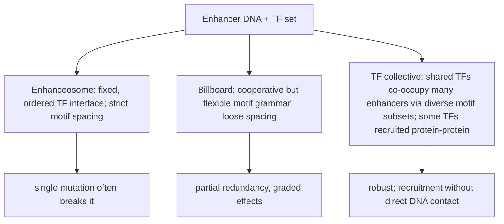
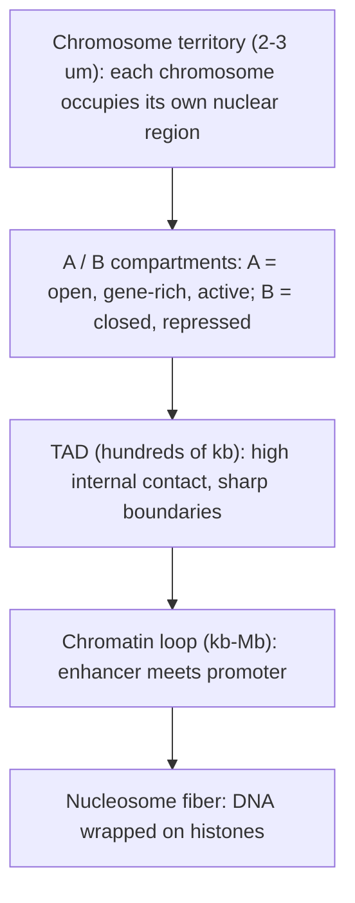
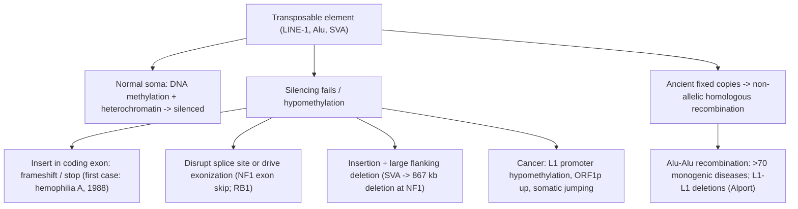

# 유전자 조절과 후성유전학

**강의:** BME333 / BIO333 유전학 (UNIST, 2026 가을) · 강의 10 · ~60분
**강의계획서:** [← 강의계획서](../../lectures/2026.BME333-BIO333-Syllabus.md) — 6주차 수요일, 10-07
**언어:** [English](../../en/lectures/lec10_Gene-Regulation-Epigenetics.md) · 한국어

## 학습 목표
이 강의를 마치면 학생들은 다음을 할 수 있어야 한다:
- 원핵생물의 오페론 논리와 진핵생물 유전자의 조합적(combinatorial)·인핸서(enhancer) 기반 조절을 대조할 수 있다.
- 전사인자(transcription factor), 인핸서, 슈퍼인핸서(super-enhancer)가 세포 유형별 전사를 어떻게 제어하는지 설명할 수 있다.
- 3차원 유전체 구조(TAD, 크로마틴 고리, Hi-C)가 멀리 떨어진 조절 요소를 표적 프로모터와 어떻게 연결하는지 기술할 수 있다.
- 후성유전학적 조절(크로마틴 접근성, DNA 메틸화, 전이인자 제어)을 정의하고, 세포 유형 정체성 및 질병에서의 역할을 설명할 수 있다.

## 강의

### 1. 오페론에서 진핵생물의 복잡성까지 (~8분)

우리 몸의 모든 세포는 본질적으로 동일한 유전체를 지니지만, 뉴런과 적혈구, 간세포는 생김새도 행동도 전혀 다르다. 그 차이는 세포가 *어떤* 유전자를 지니고 있느냐가 아니라 *어떤 유전자를, 언제, 얼마나 강하게 발현하느냐*에 있다. 따라서 **유전자 조절(gene regulation)** — 유전자가 언제 얼마나 많이 전사되는지에 대한 제어 — 은 정적인 유전체 서열을 살아 있는 생물의 역동적이고 분화된 세포와 연결하는 핵심 문제이다. 우리는 가장 단순하고 가장 잘 이해된 사례(세균)에서 출발하여, 진핵생물이 풀어내는 훨씬 더 큰 도전 과제로 나아간다.

원핵생물에서는 관련 유전자들이 흔히 하나의 **오페론(operon)**으로 묶여 있다. 오페론은 단일 프로모터의 제어를 받아 함께 전사되어 하나의 폴리시스트론(polycistronic) mRNA를 만드는 유전자 무리이다. 대표적인 예는 *E. coli*의 ***lac* 오페론**으로, 젖당(lactose)을 세포 안으로 들여오고 분해하는 효소들을 암호화한다. 그 논리는 두 종류의 조절 단백질로 이루어진다. **억제자(repressor)**는 **작동자(operator)**라 불리는 DNA 서열(프로모터와 겹침)에 결합하여 RNA 중합효소를 물리적으로 가로막는 단백질이며, **활성자(activator)**는 프로모터 근처에 결합하여 중합효소의 모집을 *돕는* 단백질이다. 저분자 신호가 이 단백질들의 DNA 결합 형태를 바꿈으로써(**알로스테릭 조절(allosteric control)**) 조절이 이루어진다.

*lac* 오페론은 이 논리를 통해 두 가지 신호를 통합한다. 젖당은(그 이성질체인 알로락토스(allolactose)를 통해) **유도자(inducer)**로 작용한다. 유도자는 LacI 억제자에 결합하여 이를 작동자에서 떼어내 전사가 진행되게 한다 — 이로써 오페론은 **유도성(inducible)**을 띤다(기본적으로 꺼져 있다가 기질에 의해 켜짐). 포도당(glucose)은 **이화물질 억제(catabolite repression)**를 통해 작용한다. 포도당이 부족하면 고리형 AMP(cyclic AMP)가 증가하고, cAMP가 활성자 **CAP(CRP)**에 결합하며, CAP–cAMP가 상류에 결합하여 중합효소를 강하게 모집한다. 오페론은 젖당이 있고 *동시에* 포도당이 없을 때에만 강하게 작동한다 — 억제자 하나와 활성자 하나로 만들어진 생물학적 AND 게이트인 셈이다.

**그림 — 두 입력 논리 게이트로서의 *lac* 오페론.**

| 젖당 (유도자) | 포도당 | LacI 억제자 | CAP–cAMP 활성자 | 전사 |
|---|---|---|---|---|
| 없음 | 있음 | 작동자에 결합 (차단) | 비활성 (낮은 cAMP) | **OFF** (불필요) |
| 없음 | 없음 | 작동자에 결합 (차단) | 활성 (높은 cAMP) | **OFF** (기질 없음) |
| 있음 | 있음 | 떨어짐 | 비활성 (낮은 cAMP) | **LOW** (기저 수준) |
| 있음 | 없음 | 떨어짐 | 활성, 중합효소 모집 | **HIGH** (완전 유도) |

오페론이 작동하는 이유는 세균이 빠르고 불연속적인 환경 전환에 직면하며, 유전체가 작고 비암호화 DNA가 거의 없기 때문이다. 진핵생물의 발생은 근본적으로 더 어려운 문제를 던진다. 하나의 유전체가 수백 가지의 안정한 세포 유형을 지정해야 하고, 각 유형은 수천 개 유전자의 서로 다른 조합을 발현하며, 각 상태는 *세포 분열을 거쳐 유전*되어야 한다. 진핵생물은 세균에게 대체로 없는 세 가지 특징으로 이를 해결한다. (1) 유전자가 개별적으로 전사되므로(오페론 없음) 각각 고유한 제어 장치가 필요하고, (2) DNA가 **크로마틴(chromatin)**에 감겨 있어 조절 DNA를 감추거나 드러낼 수 있으며, (3) 조절이 **조합적이고 장거리적(combinatorial and long-range)**이어서, 여러 전사인자가 자신이 제어하는 유전자로부터 수십 킬로베이스에서 메가베이스까지 떨어져 있을 수 있는 요소들을 통해 함께 작용한다. 이 강의의 나머지 부분은 이 세 가지 개념을 풀어낸다.

**그림 — 두 조절 패러다임의 대조.**

| 특징 | 원핵생물 (오페론) | 진핵생물 |
|---|---|---|
| 유전자 묶음 | 폴리시스트론 오페론 | 유전자 하나, 전사체 하나 |
| 제어 거리 | 프로모터의 작동자 | kb–Mb 떨어진 인핸서 |
| 포장 | 벌거벗은 DNA, 자유롭게 접근 가능 | 뉴클레오솜 크로마틴 (통제됨) |
| 논리 | 적은 입력, 빠른 전환 | 많은 TF, 조합적 |
| 상태의 유전성 | 불필요 | 분열을 넘는 후성유전학적 기억 |
| 신호 | 저분자 알로스테리 | 신호전달 → TF 활성 + 크로마틴 |

### 2. 전사인자와 인핸서 (~12분)

**전사인자(transcription factor, TF)**는 특정 DNA 서열에 결합하여 인근 유전자의 전사에 영향을 주는 단백질이다. 진핵생물 조절의 핵심에 있는 역설은, TF가 **~6–12 bp의 짧고 축퇴된(degenerate) 모티프(motif)**만을 인식한다는 점이다(참조 [en](../../en/review/Spitz2012_NatRevGenet_TF-Enhancers.md) · [ko](../../ko/review/Spitz2012_NatRevGenet_TF-Enhancers.md)). 6–8 bp 모티프는 대략 수 킬로베이스마다 우연히 나타나므로, 하나의 TF 모티프는 유전체 전체에 걸쳐 수백만 번 등장한다 — 예컨대 한 조직에서 한 순간에 한 유전자를 켜는 것과 같은 절묘한 특이성을 설명하기에는 지나치게 부정확하다. 따라서 특이성은 고유한 결합 친화도를 넘어서는 *추가적인 층위*에서 나와야 한다.

가장 중요한 해법은 **조합적 결합(combinatorial binding)**이다. 정밀한 발현은 하나의 TF가 아니라, 발현 영역이 표적 세포에서만 겹치는 *여러 TF의 공동 점유(co-occupancy)*에 의해 달성된다. 이를 보여주는 표준 사례는 **초기 *Drosophila* 체절화의 갭 유전자(gap-gene) 인핸서**로, 여기서는 모계 및 갭 TF의 조합이 위치 구배를 읽어 뚜렷한 발현 줄무늬를 그린다. 척추동물에서는 SMAD 단백질이 세포 유형별 파트너 인자를 통해 특이성을 획득한다(참조 [en](../../en/review/Spitz2012_NatRevGenet_TF-Enhancers.md) · [ko](../../ko/review/Spitz2012_NatRevGenet_TF-Enhancers.md)). TF는 **협동적으로(cooperatively)** 결합한다 — 직접적으로(인접한 부위 사이의 단백질–단백질 접촉), 혹은 간접적으로(공유 보조인자 모집, 한 TF가 뉴클레오솜을 밀어내어 다른 TF가 결합할 수 있게 하는 **보조 적재(assisted loading)**, 또는 HMG 인자 같은 구조 단백질에 의한 DNA 굽힘). 협동성은 점진적 입력을 **스위치형 ON/OFF 출력**으로 변환하여, TF 농도의 잡음을 완충하고 발생 구배에서 선명한 발현 경계를 만든다.

이러한 TF들은 **인핸서(enhancer)** 위에 조립된다. 인핸서는 표적 프로모터의 전사를 **거리와 방향에 무관하게** 활성화하는 시스(cis)-조절 DNA 요소로, 흔히 수십 또는 수백 킬로베이스 떨어진 곳에서 작용한다. 이 "원거리 작용(action at a distance)"은 진핵생물 조절을 규정하는, 그리고 처음에는 가장 직관에 반하는 특성이다.

**그림 — 인핸서가 프로모터에 원거리로 작용한다.**
```
   enhancer (bound by TF combination)                promoter        gene body
   [====oooo====]······················ (10-100+ kb) ·····[TATA]===[ exon1  exon2 ...]==>
        ||||                                                 |
     TF1 TF2 TF3  --- co-activators (Mediator, p300) --- RNA Pol II
        \_______________ DNA loops to bring the two together _______________/
```

인핸서는 어떻게 그런 거리를 가로질러 프로모터에 물리적으로 영향을 줄 수 있을까? DNA가 **고리(loop)**를 형성하여, 인핸서에 결합한 TF 복합체를 프로모터 및 그 중합효소 기구와 직접 접촉시키며, **Mediator**나 아세틸전이효소 **p300/CBP** 같은 보조활성자(co-activator)가 이를 매개한다. 이 고리 형성은 유전체의 3차원 접힘(4장)이 왜 그토록 중요한지에 대한 미시적 이유이다.

인핸서 자체도 서로 다른 구조적 "문법(grammar)"을 지니며, 어느 모델이 적용되느냐는 돌연변이가 어떻게 작동하는지에 실질적 영향을 미친다(참조 [en](../../en/review/Spitz2012_NatRevGenet_TF-Enhancers.md) · [ko](../../ko/review/Spitz2012_NatRevGenet_TF-Enhancers.md)):

**그림 — 인핸서 구조의 세 가지 모델.**


유전체 데이터를 해석할 때 결정적으로 미묘한 점이 하나 있다. **ChIP-seq(크로마틴 면역침전 + 시퀀싱)**으로 검출되는 TF 결합 사건의 상당 부분 — 고등 진핵생물에서 대략 75–90% — 은 인근 유전자의 발현 변화와 **상관관계가 없다**(참조 [en](../../en/review/Spitz2012_NatRevGenet_TF-Enhancers.md) · [ko](../../ko/review/Spitz2012_NatRevGenet_TF-Enhancers.md)). 결합은 기능과 같지 않다. 이 "침묵하는" 결합 중 일부는 중복성(redundancy)을 반영하고, 일부는 일시적/동역학적이며, 일부는 **개척인자(pioneer factor)**에 의한 **점화(priming)**이다. 개척인자(FOXA1, MyoD, PU.1, PAX5)는 다른 인자들은 접근하지 못하는 뉴클레오솜 DNA에 결합할 수 있는 TF로, 리모델러를 모집하고, 인핸서 표지 **H3K4me1**을 남기며, DNA를 메틸화로부터 보호하여, 인핸서를 *이후의* 발생 단계에서 활성화되도록 준비시킨다. *Drosophila*에서는 개척인자 **Zelda**가 모계-접합자 전환(maternal-to-zygotic transition) 시점에 접합자 활성화를 위해 유전체를 전반적으로 점화한다. 이는 마스터 TF를 녹아웃하면 종종 발생 후기에서야 표현형이 나타나는 이유, 그리고 같은 인핸서가 그 유전자가 켜지기 훨씬 전에 "예비 상태(poised)"로 있을 수 있는 이유를 설명한다.

### 3. 슈퍼인핸서와 세포 정체성 (~8분)

보통의 인핸서가 유전자를 켠다면, *정체성을 규정하는* 유전자를 켜는 요소가 따로 있을까? **슈퍼인핸서(super-enhancer)**라는 용어는 보조활성자가 유난히 많이 적재된 인핸서 무리를 가리켜 만들어졌다. 생쥐 배아줄기세포(mESC)에 적용된 최초의 조작적 정의는 세 단계로 이루어졌다(참조 [en](../../en/review/Pott2015_NatGenet_SuperEnhancers.md) · [ko](../../ko/review/Pott2015_NatGenet_SuperEnhancers.md)): (1) 마스터 TF인 Oct4, Sox2, Nanog에 대한 ChIP-seq 봉우리로 인핸서를 찾고, (2) 서로 12.5 kb 이내에 있는 인핸서들을 하나의 단위로 **이어붙이며(stitch)**, (3) 이어붙인 단위를 총 **Mediator(Med1)** 신호로 순위 매겨 상위 꼬리 — 순위 곡선의 변곡점 위에 있는 약 3% 미만의 영역 — 를 "슈퍼인핸서"라 부른다.

보고된 그 특성은 인상적이다. 슈퍼인핸서는 크고(중앙값 ~8,667 bp, 전형적인 mESC 인핸서는 ~703 bp), RNA Pol II·eRNA 전사·p300/CBP·코헤신(cohesin)과 표지 H3K27ac·H3K4me1이 크게 농축되어 있으며, *세포를 규정하는* 유전자 옆에 자리한다. mESC에서는 만능성(pluripotency) 유전자 Oct4/Sox2/Nanog, 암세포에서는 *MYC* 같은 종양유전자(oncogene) 옆에 있다. 슈퍼인핸서는 세포 유형별로 특이적이며 세포 유형별로 질병 관련 SNP가 농축되어 있어 — 매력적인 표적이 된다(참조 [en](../../en/review/Pott2015_NatGenet_SuperEnhancers.md) · [ko](../../ko/review/Pott2015_NatGenet_SuperEnhancers.md)).

그러나 Pott과 Lieb의 리뷰는 의도적으로 회의적이며, 그 회의는 유전체학을 비판적으로 읽는 법에 대한 좋은 교훈이다. 이들은 다섯 가지 우려를 제기한다. (1) 정의가 **순환적(circular)**이다 — 높은 Mediator가 식별 기준이자 주장되는 기능의 원천이다. (2) 무리 짓기는 필요조건도 충분조건도 아니다(mESC 슈퍼인핸서의 15%는 이어붙이지 않은 단일 인핸서이며, 이어붙인 영역 중 15%만이 자격을 갖춘다). (3) 역치는 연속 분포 위의 **자의적 변곡점**일 뿐, 생물학적 불연속이 없다. (4) 구성 인핸서들은 개별적으로도 강해서, 새로운 창발적 메커니즘이라기보다 평범한 협동성과 부합한다. (5) 슈퍼인핸서는 수년 전에 정의된 조절 실체들 — **유전자좌 제어 영역(locus control region, LCR)**, 열린 조절 요소의 무리, 스트레치 인핸서(stretch enhancer) — 과 상당히 겹친다. 결론: "슈퍼인핸서"는 강하고 정체성과 연관된 조절 영역을 목록화하는 데 *유용한 조작적 명칭*이지만, 그것이 메커니즘적으로 새로운 부류라는 주장은 아직 입증되지 않았다. 적절한 검증은 **역유전학(reverse genetics)** — 개별 구성 인핸서를 CRISPR-Cas9로 제거하여 이들이 협동하는지 아니면 단지 합산되는지 묻는 것 — 이다.

**그림 — 슈퍼인핸서는 어떻게 정의되는가(그리고 왜 역치가 논쟁적인가).**
```
Med1 ChIP-seq signal per (stitched) enhancer, ranked high -> low

signal |*
       | *
       |  *
       |   *   <-- arbitrary "inflection point": everything left = super-enhancer (<3%)
       |    *_
       |      *___
       |          *________
       |                   *_______________________  (thousands of "typical" enhancers)
       +----------------------------------------------------> rank
        few identity genes (Oct4, Sox2, Nanog, MYC)      most genes
```

### 4. 3차원 유전체 구조 (~13분)

인핸서가 큰 선형 거리를 가로질러 작용하기 때문에, 핵 속 염색체의 *물리적 접힘*은 부수적인 것이 아니라 그 자체로 하나의 조절 층위이다. 이를 측정 가능하게 만든 도구가 **Hi-C**이다(참조 [en](../../en/article/Lieberman-Aiden2009_Science_HiC-3DGenome.md) · [ko](../../ko/article/Lieberman-Aiden2009_Science_HiC-3DGenome.md)). Hi-C는 **근접 결찰(proximity ligation)**로 작동한다: 세포를 포름알데히드로 가교 결합하고(3차원에서 가까운 DNA 조각들을 고정), 제한효소로 절단하며, 말단을 **비오틴화(biotinylated)** 뉴클레오티드로 채우고, 희석된 조건에서 결찰하여 가교된(물리적으로 이웃한) 조각들만 연결되게 하고, 절단하여, 비오틴 접합부를 끌어내려 짝지은 말단을 시퀀싱한다. 각 읽기 쌍은 "이 두 유전자좌가 서로 닿아 있었다"를 알려준다. 인간 림프모구세포주에 1-Mb 해상도로 적용한 최초의 Hi-C는 **670만 개의 장거리 접촉**을 만들어냈다 — 최초의 유전체 전체 3차원 접촉 지도였다(참조 [en](../../en/article/Lieberman-Aiden2009_Science_HiC-3DGenome.md) · [ko](../../ko/article/Lieberman-Aiden2009_Science_HiC-3DGenome.md)).

Hi-C는 조직의 중첩된 위계를 드러냈다(참조 [en](../../en/review/Matharu2015_PLoSGenet_TAD-ChromatinLoops.md) · [ko](../../ko/review/Matharu2015_PLoSGenet_TAD-ChromatinLoops.md), [en](../../en/review/Misteli2020_Cell_3Dgenome-SelfOrganizing.md) · [ko](../../ko/review/Misteli2020_Cell_3Dgenome-SelfOrganizing.md)):

**그림 — 3차원 유전체 구조의 위계.**


그 첫 논문의 세 가지 발견이 이 그림을 뒷받침한다(참조 [en](../../en/article/Lieberman-Aiden2009_Science_HiC-3DGenome.md) · [ko](../../ko/article/Lieberman-Aiden2009_Science_HiC-3DGenome.md)). 첫째, **염색체 영역(chromosome territory)**이 유전체 전체에서 확인되었다: 염색체 내 접촉이 항상 염색체 간 접촉을 능가하며, 작고 유전자가 풍부한 염색체(16, 17, 19–22)는 핵 중심 근처에 함께 모이는 반면 유전자가 적은 18번 염색체는 주변부에 머문다 — 수십 년 된 FISH 현미경 관찰과 일치한다. 둘째, 접촉 행렬의 "격자무늬(plaid)" 패턴이 두 개의 공간적 **구획(compartment)**을 드러냈다: **A**(유전자 밀도, 활발한 전사, DNaseI 접근성, H3K36me3와 상관)와 **B**(더 조밀하고 닫혀 있으며 억제됨) — 오래된 세포학적 진정염색질/이질염색질(euchromatin/heterochromatin) 구분의 분자적 대응물이다. 셋째, 구획 내에서 접촉 확률이 500 kb에서 7 Mb 사이에서 **s⁻¹**로 척도화되어, 평형 글로뷸(equilibrium globule, s^-3/2 예측)이 아니라 **프랙탈(매듭 없는) 글로뷸(fractal knot-free globule)**과 일치했다. 프랙탈 글로뷸은 약 2 m의 DNA를 매듭 없이 포장하면서도 전사를 위해 국소적으로 풀었다가 다시 접을 수 있어 매력적이다.

이후 더 높은 해상도의 Hi-C는 **위상적 결합 도메인(topologically associating domain, TAD)**을 드러냈다 — 대개 수백 kb에 달하는, 내부 접촉 빈도가 높고 급격한 하강으로 경계 지어진 유전체 영역이다. TAD 경계는 절연자 단백질 **CTCF**와 고리 모양 복합체 **코헤신(cohesin)**이 농축되어 있고, 인간과 생쥐 사이에서 보존되며, DNA 복제 시기 전환과 일치한다(참조 [en](../../en/review/Matharu2015_PLoSGenet_TAD-ChromatinLoops.md) · [ko](../../ko/review/Matharu2015_PLoSGenet_TAD-ChromatinLoops.md)). TAD는 주로 **고리 압출(loop extrusion)**로 형성된다: 코헤신이 자신의 고리를 통해 DNA를 감아 넣으며 고리를 키우다가, 수렴 방향(convergent orientation)의 CTCF 부위에서 멈춘다. 따라서 TAD는 사실상 절연된 조절 이웃(regulatory neighborhood)으로, 그 안에서 인핸서는 자신의 프로모터에는 도달할 수 있지만 옆 도메인의 프로모터에는 도달할 수 없다.

**그림 — 고리 압출이 TAD를 만들고, CTCF가 울타리를 표시한다.**
```
CTCF>                                                  <CTCF   (convergent CTCF halt sites)
  |------------------- one TAD (insulated neighborhood) -------------------|
  |   enh --- promoter A     promoter B                                    |
  |     \_______/  (loops OK inside)                                       |
  |                                                                        |
  cohesin ring extrudes DNA -> -> growing loop -> stops at CTCF boundaries
  ---||====================( enhancer can find promoters here )============||---  next TAD -->
```

이것이 임상적으로 왜 중요한가? 경계를 교란하면 어느 인핸서가 어느 유전자와 대화하는지가 재배선되어 **"TAD병증(TADopathies)"**이 생기기 때문이다(참조 [en](../../en/review/Matharu2015_PLoSGenet_TAD-ChromatinLoops.md) · [ko](../../ko/review/Matharu2015_PLoSGenet_TAD-ChromatinLoops.md)). 예: 백혈병에서 종양유전자 옆에 이소성(ectopic) 인핸서를 놓는 역위(inversion); *OCA2* 색소 유전자좌에서 고리 형성을 약화시키는 SNP; TAD를 지워 *LMNB1*이 외래 인핸서에 "입양"되어 성인기 발병 백질이영양증(leukodystrophy)을 일으키는 ~660-kb 결실; 그리고 어느 경계가 깨지느냐에 따라 *서로 다른* 사지 기형을 일으키는 2q35 염색체 무리(*WNT6/IHH*, *EPHA4*, *PAX3*)의 재배열. 이것이 "침묵하는" 비암호화 변이가 병원성일 수 있는 이유이다: 그것은 어떤 단백질이 아니라 유전체의 3차원 배선을 바꾼다.

Misteli의 종합은 이 모든 것을 하드와이어된 청사진이 아니라 **자기조직화(self-organization)**로 재구성한다(참조 [en](../../en/review/Misteli2020_Cell_3Dgenome-SelfOrganizing.md) · [ko](../../ko/review/Misteli2020_Cell_3Dgenome-SelfOrganizing.md)). 고리, TAD, 구획은 상호작용하는 네 가지 원리에서 창발한다. (1) **고분자 물리학(polymer physics)** — 국소 확산과 동종(homotypic, 같은 것끼리) 접촉만을 지닌 자기회피 고분자의 계산 모델은 자발적으로 고리/TAD/구획을 만들어내며, CTCF/코헤신 부위를 더하면 이들이 선명해진다. (2) **동역학(dynamics)** — 크로마틴은 약 1 μm 이내에서 확산하고 TF는 시간의 95% 이상을 확산하거나 비특이적 접촉 상태로 보내므로, 구조는 구성 성분이 빠르게 교체됨에도 *동적 정상 상태(dynamic steady state)*로 유지된다. (3) **상 분리(phase separation)** — 본질적으로 무질서한 영역(intrinsically disordered region)을 지닌 단백질이 액체 같은 응축물(condensate)을 형성한다(이질염색질의 HP1α; 슈퍼인핸서의 Pol II/Mediator 허브). (4) **구조적 제약(architectural constraint)** — 핵 라미나(nuclear lamina)가 억제성 **라미나 결합 도메인(lamina-associated domain, LAD)**을 주변부에 묶어둔다. 핵심적 결과: **개별 크로마틴 고리 대부분은 어느 순간에도 세포의 5–30%에서만 나타난다** — 유전체는 평균적으로는 질서 있지만 세포마다 이질적이며, 각 세포 유형의 발현 프로그램이 안정한 "끌개(attractor)" 상태로 작용한다.

### 5. 크로마틴 접근성과 방법 (~7분)

위의 모든 것은 조절 요소가 물리적으로 도달 가능한지에 달려 있다. 진핵생물 DNA는 **뉴클레오솜(nucleosome)** — 히스톤 8량체를 감싼 147 bp의 DNA — 으로 포장되며, 뉴클레오솜에 가려진 부위는 일반적으로 불활성이다. 따라서 **크로마틴 접근성(chromatin accessibility)** — 영역이 "열려" 있는지 "닫혀" 있는지 — 은 조절의 문지기이다: 열린 영역은 활성 인핸서·프로모터·절연자와 일치하며, 열린 DNA만이 TF 결합을 허용한다(참조 [en](../../en/review/Klein2020_ChromosomeRes_DNAAccessibility-Methods.md) · [ko](../../ko/review/Klein2020_ChromosomeRes_DNAAccessibility-Methods.md)). 따라서 접근성(및 단백질이 어디에 결합하는지)을 측정하는 것은 현대 조절 유전체학의 실험적 토대이다.

**그림 — 크로마틴 상태를 읽는 방법들.**

| 방법 | 무엇을 검출하는가 | 원리 | 주목할 점 |
|---|---|---|---|
| **DNase-seq** | 열린 크로마틴 (DHS) | DNase I이 보호되지 않은 DNA를 자름 | ENCODE가 인간 조직 전반에서 **290만 개 이상**의 DHS를 지도화 |
| **FAIRE-seq** | 열린 크로마틴 | 뉴클레오솜 없는 DNA의 페놀 추출 | 간단하지만 신호대잡음비가 낮음 |
| **MNase-seq** | 뉴클레오솜 위치 | MNase가 링커 DNA를 소화 | 뉴클레오솜 + 하위-뉴클레오솜 TF 발자국 지도화 |
| **ATAC-seq** | 열린 크로마틴 | 과활성 Tn5가 접근 가능한 DNA에 어댑터 삽입 | 빠른 2단계; **단일세포** 규모에서 작동 |
| **ChIP-seq** | 주어진 단백질이 결합하는 위치 | 가교 + 항체 풀다운 | 분야의 주력(논문 23,000편 이상); 좋은 항체 필요 |
| **DamID** | 단백질 결합 | Dam 메틸전이효소가 인근 GATC를 표지 | 항체 불필요; ~5 kb 해상도 |
| **CUT&RUN** | 단백질이 결합하는 위치 | 온전한 핵에서 Protein A-MNase가 항체 부위를 절단 | bp에 가까운 해상도, 낮은 배경, ~1,000 세포 (2017) |

리뷰가 강조하는 흐름은 **단일세포와 귀중한 시료(precious sample)** 쪽으로의 이동이다(참조 [en](../../en/review/Klein2020_ChromosomeRes_DNAAccessibility-Methods.md) · [ko](../../ko/review/Klein2020_ChromosomeRes_DNAAccessibility-Methods.md)): scDNase-seq, 단일세포 ATAC-seq, 단일세포 CUT&RUN은 이제 대량(bulk) 분석이라면 세포 유형의 혼합에 파묻혀 버릴 희귀 전구세포, 환자 생검, 초기 배아에서 조절 상태를 프로파일링한다. 각 방법은 해상도·세포 투입량·항체 의존성·인공산물 사이의 절충이며 — 미래는 같은 세포 안에서 접근성, TF 결합, 히스톤 표지, 3차원 접촉을 *통합*하는 데 있다.

### 6. 후성유전학: 메틸화, 전이인자, 세포 유형 (~12분)

이제 마지막 조각을 맞출 수 있다: 조절 상태가 어떻게 세포 분열을 넘어 *유전*되며, 어떻게 세포 정체성을 만들고 — 또 잘못 만드는가. **후성유전학(epigenetics)**은 DNA 서열 자체를 바꾸지 않으면서 유전되는 유전자 발현의 변화를 가리키며 — 크로마틴 변형, 뉴클레오솜 배치, 그리고 **DNA 메틸화(DNA methylation)**(시토신에, 대개 CpG 부위에 메틸기를 추가; 프로모터에 조밀할 때 일반적으로 억제성)로 전달된다. 앞서 만난 히스톤 표지(인핸서의 H3K4me1, 활성 요소의 H3K27ac, 억제된 크로마틴과 LAD의 H3K9me2/3 및 H3K27me3)와 함께, 이것들은 세포의 **후성유전체(epigenome)**를 구성한다 — 세포가 분열할 때 복사될 수 있는 상태로, 세포에게 자신이 무엇인지에 대한 *기억*을 부여한다.

이 억제 기구의 극적인 응용은 **전이인자(transposable element, TE)**의 제어이다 — 전이인자는 인간 유전체의 대략 **절반**을 차지하는 이동성 반복 서열이다(참조 [en](../../en/review/Payer2019_NatRevGenet_TE-Disease.md) · [ko](../../ko/review/Payer2019_NatRevGenet_TE-Disease.md)). 유일하게 자율적으로 활성인 인간 TE는 **LINE-1 (L1)**으로, 길이 ~6 kb이며 ORF1p(RNA 결합)와 ORF2p(엔도뉴클레아제 + 역전사효소)를 암호화한다. L1은 유전체의 ~17%를 차지하며 **표적-점화 역전사(target-primed reverse transcription)**로 자신을 복제한다. 비자율적 **Alu** 요소(유전체의 ~11%)와 SVA는 L1의 단백질을 가로채 이동한다. 방치되면 이들은 돌연변이원(mutagen)이므로 — 세포는 **이질염색질화(heterochromatinization)와 DNA 메틸화로 이들을 침묵**시킨다. 그 침묵이 실패하면 질병이 뒤따른다.

**그림 — TE 제어와 그 실패의 결과.**


질병 목록은 교훈적이다(참조 [en](../../en/review/Payer2019_NatRevGenet_TE-Disease.md) · [ko](../../ko/review/Payer2019_NatRevGenet_TE-Disease.md)): 최초로 보고된 신생(de novo) L1 삽입은 혈우병 A(1988)를 일으켰다. *FKTN* 3′UTR의 SVA는 일본에서 후쿠야마형 선천성 근이영양증(Fukuyama congenital muscular dystrophy) 대립유전자의 **80%**를 차지한다. *TAF1*의 SVA는 필리핀 인구집단에서 X-연관 근긴장이상-파킨슨증(dystonia-parkinsonism)을 일으킨다. 인간에게는 **16,000개 이상의 다형성 TE**가 분리되어 있으며(알려진 구조 변이의 ~24%; 6,500개 이상은 복합 질환 위험에 영향을 줄 만큼 흔함), 일부는 eQTL로 작용한다 — 예를 들어 다발성 경화증(multiple sclerosis)과 연관된 *CD58* 근처의 Alu가 그러하다. 따라서 TE는 자신의 *고유한* 프로모터와 스플라이스 신호를 지니기에 보통의 복제수 변이(copy-number variant)와는 구별되는, 역사적으로 과소평가된 기능적 유전 변이의 주요 원천이다.

끝으로, 이 조절/후성유전 기구는 진화를 거쳐 새로운 세포 유형을 *창조하는* 바로 그것이다. Arendt 등은 **세포 유형(cell type)**을 형태가 아니라 **진화 단위(evolutionary unit)**로 재정의한다 — 자신의 유전체 조절 정보를 사용하기에 어느 정도 독립적으로 진화하는 세포들의 집합으로 본다(참조 [en](../../en/review/Arendt2016_NatRevGenet_OriginEvolution-CellTypes.md) · [ko](../../ko/review/Arendt2016_NatRevGenet_OriginEvolution-CellTypes.md)). 세포 정체성의 분자적 핵심은 **핵심 조절 복합체(core regulatory complex, CoRC)**이다 — 세포 유형별 발현 프로그램을 유지하는 말단 선택자(terminal-selector) TF들과 그 상호작용의 집합이다. 척수의 예가 명료하다: V2a 사이신경세포(interneuron)와 운동신경세포는 Lhx3와 NLI를 *공유*하지만, 운동신경세포는 **Isl1**을 더해 별개의 복합체를 형성한다 — 운명을 전환하고 대안을 억제하는 단백질–단백질 상호작용의 작은 변화이다. 새로운 세포 유형은 **유전적 개별화(genetic individuation)**(처음에는 균일하던 집단이 별개의 "자매" 세포 유형으로 분기)와, 기존 모듈을 통합하거나 분기시켜 만들어진 새로운 세포 모듈(**아포메어(apomere)**)에 의해 생겨난다 — 신경 시냅스가 접착·분비·수용체 기구를 통합했듯이, 또 간상세포/원추세포의 광전달(phototransduction) 연쇄가 전유전체 중복(whole-genome duplication) 이후 분기했듯이. 결정적으로, 발생 계통(developmental lineage)과 진화 계통(evolutionary lineage)이 일치할 필요는 없으므로, 조절 서명(CoRC)을 비교하는 것 — 이제 단일세포 RNA-seq로 대규모로 가능해진 — 이 형태보다 세포 유형 관계를 더 신뢰할 만하게 안내한다. 다시 말해, 유전자 조절은 유전체가 세포를 운영하는 방식일 뿐만 아니라, 진화의 시간에 걸쳐 유전체가 새로운 종류의 세포를 발명하는 방식이다.

## 핵심 정리
- **세포 유형을 구별하는 것은 유전자 함량이 아니라 조절이다**: 모든 세포는 유전체를 공유하며, 정체성은 어떤 유전자가 발현되는지로 정해진다.
- **원핵생물 오페론**은 알로스테릭 조절 아래 소수의 억제자/활성자를 사용한다(*lac* 오페론은 AND 게이트로, 젖당이 있고 포도당이 없을 때에만 켜짐); **진핵생물**은 유전자당 하나의 전사체, 크로마틴 통제, 조합적 장거리 제어를 사용한다.
- **TF는 짧고 축퇴된 모티프에 결합**하므로, 특이성은 원거리에서 DNA 고리를 통해 작용하는 **인핸서**에서의 **조합적·협동적** 결합에서 나온다; **개척인자**가 인핸서를 미리 점화하며, 대부분의 ChIP-seq 결합 사건(~75–90%)은 직접적 기능이 없다.
- **슈퍼인핸서**는 정체성/종양유전자 유전자좌 근처의 크고 Mediator가 풍부한 무리이다 — 조작적으로 유용하지만 자의적 역치로 정의됨; 그 신규성은 CRISPR 제거로 검증되어야 한다.
- **Hi-C**는 중첩된 3차원 위계 — 염색체 영역, A/B 구획, TAD(코헤신 고리 압출로 형성되고 CTCF로 울타리 쳐짐), 인핸서–프로모터 고리 — 를 드러냈다; TAD 경계를 교란하면 **"TAD병증"**이 생긴다.
- 유전체는 **자기조직화**한다(고분자 물리학 + 동역학 + 상 분리 + 라미나 제약): 평균적으로는 질서 있지만 세포마다 이질적이다.
- **크로마틴 접근성**이 TF 결합을 통제한다; ATAC-seq, DNase-seq, ChIP-seq, CUT&RUN(이제 단일세포 규모)이 조절 상태를 읽는다.
- **후성유전학적 침묵**(메틸화 + 이질염색질)이 전이인자(유전체의 약 절반)를 억제한다; 그 실패가 질병을 일으키며, 조절/후성유전 프로그램(CoRC)이 진화를 거쳐 세포 유형을 만들고 다양화한다.

## 교재 참고
- **Genetics: From Genes to Genomes (8e)** — Ch. 18 Gene Regulation in Prokaryotes; Ch. 19 Gene Regulation in Eukaryotes; Ch. 20 Epigenetics. → [textbook ref](../../lectures/ref.Genetics-FromGenesToGenomes.md)

## 이 저장소의 노트
수업에서 소개할 리뷰 및 논문(각각 en/ko 이중언어 쌍이 있음):
- `Spitz2012_NatRevGenet_TF-Enhancers` — 전사인자와 인핸서 기능에 대한 핵심 리뷰; 시스-조절 부분의 기준점. · [en](../../en/review/Spitz2012_NatRevGenet_TF-Enhancers.md) · [ko](../../ko/review/Spitz2012_NatRevGenet_TF-Enhancers.md)
- `Pott2015_NatGenet_SuperEnhancers` — 슈퍼인핸서와 그 정의에 대한 비판적 검토; 세포 정체성 유전자 논의에 활용. · [en](../../en/review/Pott2015_NatGenet_SuperEnhancers.md) · [ko](../../ko/review/Pott2015_NatGenet_SuperEnhancers.md)
- `Matharu2015_PLoSGenet_TAD-ChromatinLoops` — 인핸서–프로모터 조절의 구조적 기반으로서의 TAD와 크로마틴 고리. · [en](../../en/review/Matharu2015_PLoSGenet_TAD-ChromatinLoops.md) · [ko](../../ko/review/Matharu2015_PLoSGenet_TAD-ChromatinLoops.md)
- `Misteli2020_Cell_3Dgenome-SelfOrganizing` — 자기조직화하는 3차원 시스템으로서의 유전체에 대한 개념적 종합. · [en](../../en/review/Misteli2020_Cell_3Dgenome-SelfOrganizing.md) · [ko](../../ko/review/Misteli2020_Cell_3Dgenome-SelfOrganizing.md)
- `Lieberman-Aiden2009_Science_HiC-3DGenome` — 3차원 유전체 접힘을 측정 가능하게 만든 획기적 Hi-C 논문. · [en](../../en/article/Lieberman-Aiden2009_Science_HiC-3DGenome.md) · [ko](../../ko/article/Lieberman-Aiden2009_Science_HiC-3DGenome.md)
- `Klein2020_ChromosomeRes_DNAAccessibility-Methods` — 크로마틴 접근성 측정 방법; 후성유전체학 기법의 토대. · [en](../../en/review/Klein2020_ChromosomeRes_DNAAccessibility-Methods.md) · [ko](../../ko/review/Klein2020_ChromosomeRes_DNAAccessibility-Methods.md)
- `Payer2019_NatRevGenet_TE-Disease` — 전이인자, 그 조절, 그리고 탈억제(derepression)의 질병 결과. · [en](../../en/review/Payer2019_NatRevGenet_TE-Disease.md) · [ko](../../ko/review/Payer2019_NatRevGenet_TE-Disease.md)
- `Arendt2016_NatRevGenet_OriginEvolution-CellTypes` — 조절/후성유전 프로그램이 어떻게 세포 유형을 만들고 다양화하는가. · [en](../../en/review/Arendt2016_NatRevGenet_OriginEvolution-CellTypes.md) · [ko](../../ko/review/Arendt2016_NatRevGenet_OriginEvolution-CellTypes.md)

## 토론 문제
1. *lac* 오페론은 억제자 하나와 활성자 하나로 두 입력 논리를 달성한다. 진핵생물 유전자가 인핸서와 조합적 TF 결합을 사용하여 비슷한 "AND" 논리를 어떻게 달성할 수 있을지 그려보라. 한 조직에서 한 발생 단계에만 켜져야 하는 유전자에 대해 진핵생물이 왜 단순히 오페론 전략을 복사할 수 없는가?
2. ChIP-seq TF 결합 사건의 대략 75–90%는 인근 유전자 발현과 상관관계를 보이지 않는다. 최소 세 가지 설명(중복성, 동역학, 개척인자/점화)을 나열하고, *기능적인* 인핸서 결합 TF와 비기능적 결합 사건을 구별할 실험을 기술하라.
3. Pott과 Lieb는 슈퍼인핸서 역치가 연속 분포 위의 자의적 변곡점이라고 주장한다. 조작적 정의가 과학적으로 유용하려면 메커니즘적 근거가 필요한가? 슈퍼인핸서 구성 요소들이 단순히 합산되는 것이 아니라 진정으로 *협동*하는지 검증할 CRISPR 실험을 설계하라.
4. 한 환자가 CTCF 결합 TAD 경계를 제거하지만 단백질 암호화 서열은 없애지 않는 비암호화 결실을 지니면서도 사지 기형을 보인다. TAD병증 개념을 사용하여 "침묵하는" 변이가 어떻게 메커니즘적으로 질병을 일으키는지, 그리고 이를 증명하기 위해 어떤 데이터(Hi-C, 발현)를 수집할지 설명하라.
5. 전이인자는 유전체의 약 절반을 차지하며 보통 메틸화와 이질염색질로 침묵된다. 병원성 돌연변이원으로서의 TE와 조절 혁신의 원재료로서의 TE(예: 유전자 조절 네트워크로의 차용 및 세포 유형 진화) 사이의 긴장을 논하라. 언제 탈억제가 결함이고, 언제 기능(feature)인가?
