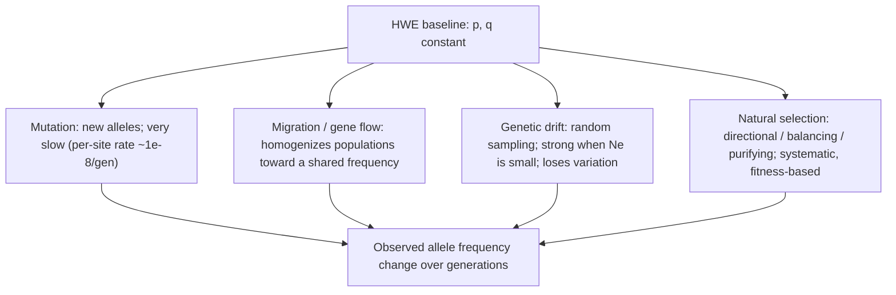

# 실제 세계의 유전학 — 집단 내 변이

**강의:** BME333 / BIO333 유전학 (UNIST, 2026 가을) · 강의 11 · ~60분
**강의계획서:** [← 강의계획서](../../lectures/2026.BME333-BIO333-Syllabus.md) — 7주차 월요일, 10-12
**언어:** [English](../../en/lectures/lec11_Population-Variation.md) · 한국어

## 학습 목표
이 강의를 마치면 학생들은 다음을 할 수 있어야 한다:
- 하디–바인베르크(Hardy–Weinberg) 원리와 그 가정을 서술하고, 이를 사용해 대립유전자 및 유전자형 빈도를 계산할 수 있다.
- 돌연변이, 이주, 부동(drift), 선택이 대립유전자 빈도를 HWE에서 어떻게 벗어나게 하는지 설명할 수 있다.
- 유효 집단 크기(effective population size)를 정의하고, 그것이 유전 변이 수준을 어떻게 형성하는지 기술할 수 있다.
- HGDP 같은 실제 데이터셋에서 집단 변이 측정치(이형접합도, 동형접합 구간, 유전체 분화 섬)를 해석할 수 있다.

## 강의

### 1. 하디–바인베르크 평형 (~14분)

멘델은 대립유전자가 한 개체에서 그 자손으로 어떻게 전달되는지를 가르쳐 주었다. 집단유전학은 다른 질문을 던진다: *집단 전체*에 걸쳐 여러 세대 동안 대립유전자 빈도에는 무슨 일이 일어나는가? 그 토대 — 모든 진화를 재는 "영모형(null model)" — 이 **하디–바인베르크 원리(Hardy–Weinberg principle)**이다. 이 원리는 진화적 힘이 없고 무작위 교배를 하는 크고 큰 집단에서는 **대립유전자 빈도**와 **유전자형 빈도**가 모두 세대에 걸쳐 일정하게 유지되며, 유전자형 빈도가 대립유전자 빈도의 단순한 함수임을 진술한다.

두 대립유전자 *A*(빈도 **p**)와 *a*(빈도 **q**)를 가진 하나의 유전자를 생각하자. 정의상 **p + q = 1**이다. 교배가 무작위라면, 접합자를 형성하는 것은 집단의 유전자 풀에서 두 개의 배우자를 무작위로 뽑는 것과 같다. *A*를 뽑을 확률은 *p*, *a*를 뽑을 확률은 *q*이므로, 유전자형 빈도는 배우자 빈도를 곱하는 데에서 곧바로 나온다:

**그림 — 배우자 결합표로 나타낸 하디–바인베르크 유전자형 빈도.**

|                | 정자 **A** (p) | 정자 **a** (q) |
|----------------|-----------------|-----------------|
| **난자 A** (p)  | AA = p²         | Aa = pq         |
| **난자 a** (q)  | Aa = pq         | aa = q²         |

칸들을 합하면 **하디–바인베르크 방정식(Hardy–Weinberg equation)**이 나온다:

$$p^2 + 2pq + q^2 = 1$$

따라서 유전자형 빈도는 **p² AA : 2pq Aa : q² aa**이다. 결정적 결과는 이러하다: (1) *단 한* 세대의 무작위 교배 후에, 시작 유전자형 혼합이 무엇이든 관계없이 유전자형 빈도가 이 비율에 도달하며, (2) 그 후에는 유전자형 빈도도, 대립유전자 빈도도 영원히 그대로 유지된다 — 집단이 **평형(equilibrium)**에 있다. 우성 대립유전자가 증가하거나 열성 대립유전자가 사라지려는 본질적 경향은 없다.

바로 그 마지막 점 때문에 이 원리가 발견되었다. 1908년 유전학자 Udny Yule은 단지증(brachydactyly, 짧은 손가락)이 우성이라면 집단이 정상인 1명당 단지증 3명 쪽으로 표류해야 한다고 주장했다(참조 [en](../../en/article/Hardy1908_Science_HardyWeinberg.md) · [ko](../../ko/article/Hardy1908_Science_HardyWeinberg.md)). R. C. Punnett은 이를 즉시 반박하지 못하여, 케임브리지 트리니티 칼리지의 수학자 친구 **G. H. Hardy**에게 그 질문을 가져갔다. Hardy는 "구구단 수학(multiplication-table mathematics)"으로 우성은 무관함을 보였다: 임의의 비율 *p : 2q : r*에서 출발하여, 한 차례의 무작위 교배는 (p+q)² : 2(p+q)(q+r) : (q+r)²를 주며, *q² = pr*일 때 분포가 안정하다 — 이는 바로 다음 세대에서 도달한다(참조 [en](../../en/article/Hardy1908_Science_HardyWeinberg.md) · [ko](../../ko/article/Hardy1908_Science_HardyWeinberg.md)). 그의 수치 예: 1:10,000의 우성 형질은 겨우 ~2:10,000으로 두 배가 된 다음 유지되고, 열성 형질은 한 번 떨어진 다음 유지된다. 사실 같은 결과는 *바로 그해 더 이른 시기*에 슈투트가르트의 **Wilhelm Weinberg**가 (1908년 1월 13일) 임의의 동형접합자 빈도에서 출발하여 이항정리를 직접 사용해 유도했다 — 그래서 "**하디–바인베르크**"이다(참조 [en](../../en/review/Edwards2008_Genetics_HWE.md) · [ko](../../ko/review/Edwards2008_Genetics_HWE.md)). Edwards의 역사적 리뷰는 더 깊은 역설을 강조한다: HWE는 **멘델의 제1법칙**의 직접적 귀결에 지나지 않으며, 이를 진술하는 데 수년이 걸린 유일한 이유는 Pearson의 생물측정학파(biometrician)와 Bateson의 멘델주의자(Mendelian) 사이의 격렬한 반목이 사람들이 멘델을 주의 깊게 읽지 못하게 막았기 때문이다(참조 [en](../../en/review/Edwards2008_Genetics_HWE.md) · [ko](../../ko/review/Edwards2008_Genetics_HWE.md)).

HWE의 힘은 그 **다섯 가지 가정**에 있다. 각 가정이 무너지는 것이 실제 진화적 힘에 대응하기 때문이다. HWE는 "아무 일도 일어나지 않는" 기준선이며, 그로부터의 이탈이 곧 무언가가 일어나고 있음을 *탐지*하는 방법이다.

**그림 — 다섯 가지 HWE 가정과 각각을 위반하는 힘.**

| 가정 | 위반되면 → 힘 | 집단에 대한 효과 |
|---|---|---|
| **돌연변이(mutation)** 없음 | 돌연변이 | 대립유전자를 서서히 도입/변화시킴 |
| **이주(migration, 유전자 흐름)** 없음 | 이주 | 집단 간 대립유전자 빈도를 섞음 |
| **무한(infinite)** 집단 크기 | 유전적 부동(genetic drift) | 작은 집단에서 무작위 변화 |
| **무작위(random)** 교배 | 비무작위 교배 / 근친교배 | *유전자형* 빈도를 이동시킴(동형접합자 과잉) — 대립유전자 빈도만이 아님 |
| **선택(selection)** 없음 | 자연선택 | 일부 유전자형을 체계적으로 선호 |

실용적 활용: 발생률 q² = 1/10,000인 열성 질환의 경우 대립유전자 빈도는 q = 0.01, 보인자 빈도는 2pq ≈ 0.0198(약 50명당 1명)이다 — 유전 상담에서 끊임없이 쓰이는 계산이다. 또한 근친교배 자체는 *대립유전자* 빈도를 바꾸지 않으면서 *유전자형* 빈도를 바꾼다(동형접합자 증가)는 점에 유의하라 — 동형접합 구간(runs of homozygosity)에서 다시 다룰 중요한 구별이다.

### 2. 실제 집단에서 변이 측정하기 (~12분)

HWE는 대립유전자 빈도가 어떻게 거동하는지를 알려주지만, 그에 앞선 경험적 질문이 있다: **자연 집단은 실제로 얼마나 많은 유전 변이를 지니고 있는가?** 수십 년 동안 이는 두 진영 사이에서 격렬히 논쟁되었다. **고전(classical)** 학파는 대부분의 개체가 거의 모든 유전자좌에서 동형접합 "야생형(wild type)"이며 드물게 해로운 돌연변이체가 있다고 보았고, **균형(balance)** 학파는 집단이 풍부하게 다형적이며 변이가 능동적으로 유지된다고 보았다. 이 논쟁은 해결이 불가능했는데, 편향 없이 유전 변이를 표본화할 방법이 없었기 때문이다 — 이미 눈에 보이는 돌연변이 표현형을 가진 유전자좌만을 연구할 수 있었다.

돌파구는 1966년 *Drosophila pseudoobscura*에 관한 **Hubby와 Lewontin의 두 편의 동반 논문**과 함께 찾아왔다. 이들은 편향 없는 분자 분석법으로 **단백질 전기영동(protein electrophoresis)**을 도입했다(참조 [en](../../en/article/Hubby1966_Genetics_PopulationHeterogeneity1.md) · [ko](../../ko/article/Hubby1966_Genetics_PopulationHeterogeneity1.md), [en](../../en/article/Lewontin1966_Genetics_PopulationHeterogeneity2.md) · [ko](../../ko/article/Lewontin1966_Genetics_PopulationHeterogeneity2.md)). 이 방법은 단백질 변이체를 전기장 속 이동으로 분리한다: 순전하(net charge)를 바꾸는 아미노산 변화는 이동도를 바꾸어 하나의 대립유전자를 드러낸다. 결정적으로, 변이 여부를 미리 알지 못한 채 효소와 유충 단백질을 *무작위로* 고를 수 있어 — 고전/균형 논쟁을 마비시켰던 확인 편향(ascertainment bias)을 제거했다. 전기영동 패턴은 단순한 **멘델 공우성(codominant)** 표지처럼 거동하여, 이형접합자를 직접 볼 수 있었다.

그 결과는 규모 면에서 놀라웠다. 논문 I은 북미 5개 지역과 보고타(Bogotá)에서 온 43개 계통에 걸쳐 21개 유전자좌를 조사하여 9개 유전자좌에서 대립유전자 변이를 발견했으며, 에스테라제-5(esterase-5) 하나만도 6개 대립유전자를 가졌다(참조 [en](../../en/article/Hubby1966_Genetics_PopulationHeterogeneity1.md) · [ko](../../ko/article/Hubby1966_Genetics_PopulationHeterogeneity1.md)). 논문 II는 집단유전학적 요약치를 정량화했다(참조 [en](../../en/article/Lewontin1966_Genetics_PopulationHeterogeneity2.md) · [ko](../../ko/article/Lewontin1966_Genetics_PopulationHeterogeneity2.md)):

**그림 — 변이는 얼마나 되는가? Hubby–Lewontin(1966)의 추정치.**

| 양 | 값 | 의미 |
|---|---|---|
| 종 전체에서 다형적인 유전자좌 | ~39% | 흔한 대립유전자가 2개 이상인 유전자의 비율 |
| 집단당 다형적인 유전자좌 | ~30% (평균) | 단일 지역 내에서 |
| 개체당 **이형접합도(heterozygosity)** | **~12%** (범위 8–15%) | 한 개체의 유전자좌 중 이형접합인 비율 |
| 가장 변이가 큰 유전자좌 | 에스테라제-5 (6개 대립유전자) | 단일 우세 대립유전자 없음 |

**이형접합도(heterozygosity, H)** — 무작위 개체가 무작위 유전자좌에서 이형접합일 확률(여기서는 HWE를 가정하고 대립유전자 빈도에서 계산) — 은 집단 변이의 *대표* 요약 통계량이 되었다. 평균 개체가 8개 유전자좌 중 ~1개에서 이형접합이라는 것은 고전 학파가 예측한 것보다 훨씬 많은 변이로, 겉보기에 균형 관점을 지지했다. 그러나 이는 새로운 수수께끼, 곧 **유전적 부하 역설(genetic load paradox)**을 낳았다: 만약 이형접합자 이점(**초우성, heterosis**)이 수천 개 유전자좌에서 동시에 변이를 유지한다면, 그 모든 동형접합자의 누적 적응도 비용이 집단 평균 적응도를 사실상 0으로 몰아갈 것이다(참조 [en](../../en/article/Lewontin1966_Genetics_PopulationHeterogeneity2.md) · [ko](../../ko/article/Lewontin1966_Genetics_PopulationHeterogeneity2.md)). Lewontin과 Hubby는 아마도 어느 시점에든 다형성의 10% 미만이 선택을 받고 나머지는 잔재일 것이라고 제안했는데 — 이는 Kimura의 **중립 이론(neutral theory)**(1968)과, 유전체의 얼마만큼이 선택을 받는지에 대한 현대의 논쟁을 직접 예고한 것이었다.

### 3. 대립유전자 빈도를 바꾸는 힘들 (~12분)

HWE가 "변화 없음" 기준선이므로, 그 가정을 깨는 네 가지 힘이 진화의 엔진이다. 각각은 대립유전자 빈도를 특징적인 방식으로 이동시킨다.

**그림 — HWE에서 대립유전자 빈도를 벗어나게 하는 네 가지 힘.**


- **돌연변이(mutation)**는 모든 새로운 대립유전자의 궁극적 원천이지만, 세대당 비율이 극히 작아서(부위당 ~10⁻⁸) 돌연변이만으로는 빈도를 매우 느리게 바꾼다; 그 중요성은 다른 힘들이 작용하는 *원재료*로서에 있다.
- **이주(migration, 유전자 흐름)**는 집단 사이로 대립유전자를 옮겨 이들을 *균질화*하는 경향이 있어, 분화에 반대한다.
- **유전적 부동(genetic drift)**은 매 세대 배우자의 유한한 표본추출로 인한 대립유전자 빈도의 무작위 변화이다. 방향은 없지만 작은 집단에서는 집요하여, 결국 일부 대립유전자를 고정시키고 다른 것을 소실시킨다 — 4장의 주제이다.
- **자연선택(natural selection)**은 적응도에 따라 빈도를 체계적으로 바꾼다. **방향성(directional)** 선택은 선호되는 대립유전자를 밀어 올리고, **정화(purifying, 음성)** 선택은 해로운 대립유전자를 제거하며, **균형(balancing)** 선택은(초우성 또는 빈도 의존성을 통해) 여러 대립유전자를 유지한다.

Motoo Kimura의 **중립 이론(neutral theory)**(1968)은 실제 다양성을 해석하는 데 필수적인 기준선을 제공한다: *대부분의* 분자 변이가 선택적으로 중립이며 선택이 아니라 돌연변이와 부동의 균형에 의해 지배된다고 제안한다(참조 [en](../../en/review/Hurst2009_NatRevGenet_GeneticsUnderstanding-Selection.md) · [ko](../../ko/review/Hurst2009_NatRevGenet_GeneticsUnderstanding-Selection.md)). 중립성 하에서 기대 이형접합도는 **H = 4Nₑμ / (1 + 4Nₑμ)**로, 다양성을 집단 크기 및 돌연변이율과 직접 연결한다. 엄격한 중립 이론은 정량적으로 실패했다 — 예를 들어 관측된 인간과 *Drosophila*의 이형접합도 격차는 두 종의 집단 크기 차이가 예측하는 것보다 훨씬 작다 — 그리하여 **거의 중립 이론(nearly neutral theory)**(Ohta 1973)으로 정련되었는데, 이는 돌연변이를 곱 **Nₑs**로 분류한다(4장). 선택은 연관된 부위에도 *간접적으로* 작용할 수 있다: **편승(hitchhiking)**은 스윕(sweep)된 유익한 대립유전자와 함께 중립 변이를 높은 빈도로 끌어올리고, **배경 선택(background selection)**은 제거되는 해로운 대립유전자에 연관된 중립 변이를 함께 제거한다 — 둘 다 특히 낮은 재조합 영역에서 다양성을 줄인다(**Hill–Robertson 효과**)(참조 [en](../../en/review/Hurst2009_NatRevGenet_GeneticsUnderstanding-Selection.md) · [ko](../../ko/review/Hurst2009_NatRevGenet_GeneticsUnderstanding-Selection.md)). 반복되는 주제이자 현재진행형의 미해결 문제는 **양성 선택과 음성 선택이 거의 동일한 다양성 발자국을 남길 수 있다**는 점으로, 유전체 데이터에서 이 둘을 구별하는 일은 진정으로 어렵다(참조 [en](../../en/review/NeutralDiversity_Wright2016_GeneticsClassic_Charlesworth.md) · [ko](../../ko/review/NeutralDiversity_Wright2016_GeneticsClassic_Charlesworth.md)).

데이터로부터 선택을 탐지하는 데는 여러 검정이 쓰이며, 각각 한계가 있다(참조 [en](../../en/review/Hurst2009_NatRevGenet_GeneticsUnderstanding-Selection.md) · [ko](../../ko/review/Hurst2009_NatRevGenet_GeneticsUnderstanding-Selection.md)): **Kₐ/Kₛ 비율**(비동의 대 동의 치환율; >1이면 양성 선택을 시사), **McDonald–Kreitman 검정**(동의/비동의 부위에서 다형성 대 분기 비교), 그리고 **Tajima의 D**(쌍별 다양성을 분리 부위(segregating site) 수와 비교). 인간 단백질 암호화 유전자의 ~9%가 양성 선택을 보인다는 추정치는 이 접근법들의 위력과 방법 의존성을 동시에 보여준다. 선택은 또한 개체에게 *해가 되는* 대립유전자를 퍼뜨릴 수도 있다 — **이기적 유전 요소(selfish genetic element)**와 **감수분열 구동(meiotic drive)**(예: *Drosophila* 분리 왜곡자(Segregation Distorter), 생쥐 *t*-복합체, 모계 전달 *Wolbachia*)를 통해 — 이는 "가장 적합한 대립유전자"와 "가장 적합한 개체"가 항상 같지는 않음을 일깨운다(참조 [en](../../en/review/Hurst2009_NatRevGenet_GeneticsUnderstanding-Selection.md) · [ko](../../ko/review/Hurst2009_NatRevGenet_GeneticsUnderstanding-Selection.md)).

### 4. 유효 집단 크기와 부동 (~8분)

부동의 강도와 선택의 효율은 둘 다 하나의 매개변수, 곧 Sewall Wright가 도입한 **유효 집단 크기(effective population size, Nₑ)**에 달려 있다. Nₑ는 개체의 인구조사 수(census count)가 *아니다*; 그것은 연구 대상인 실제 집단과 같은 속도로 부동하거나 근친교배하는 이상적인 **라이트–피셔(Wright–Fisher)** 집단(무작위 교배, 포아송 자손 수, 일정한 크기)의 크기이다(참조 [en](../../en/review/Charlesworth2009_NatRevGenet_EffectivePopulation-SizePatterns.md) · [ko](../../ko/review/Charlesworth2009_NatRevGenet_EffectivePopulation-SizePatterns.md)). 이상 모형에서 중립 변이는 **1/(2Nₑ)**에 비례하는 속도로 소실되고, 중립 대립유전자는 같은 속도로 분기한다. 따라서 Nₑ는 중립 다양성의 평형 수준과 선택의 효율을 동시에 정한다.

실제 집단은 여러 생물학적 이유로 거의 항상 **Nₑ < N**(인구조사 크기)이다: 번식 개체 간 불균등한 성비, 자손 수의 높은 분산, 근친교배, 비상염색체 유전(X, Y, 미토콘드리아), 연령 구조, 그리고 — 가장 극적으로 — **병목(bottleneck)**. 시간에 걸친 Nₑ는 *조화평균(harmonic mean)*이므로 과거의 가장 작은 크기에 의해 지배되기 때문이다. 놀랍게도 DNA 다양성에서 추정한 인간의 Nₑ는 수십억의 인구조사에도 불구하고 겨우 ~**10,000–20,000**이다 — 오랜 소집단 역사와 매우 최근의 팽창이 남긴 서명이다(참조 [en](../../en/review/Charlesworth2009_NatRevGenet_EffectivePopulation-SizePatterns.md) · [ko](../../ko/review/Charlesworth2009_NatRevGenet_EffectivePopulation-SizePatterns.md)).

**그림 — 유효 집단 크기가 다양성과 선택의 도달 범위를 형성한다.**

| 종 | 대략적 Nₑ | 결과 |
|---|---|---|
| 인간 | ~10,400 | 작은 Nₑ → 약한 선택이 흔히 중립처럼 거동; 중간 수준 다양성 |
| *Drosophila* (아프리카) | ~1,150,000 | 큰 Nₑ → 효율적인 약한 선택; 높은 다양성 |
| *E. coli* | ~25,000,000 | 매우 큰 Nₑ → 아주 작은 선택 계수도 선택에 "보임" |

부동과 선택의 상호작용은 곱 **Nₑs**로 포착된다(참조 [en](../../en/review/Charlesworth2009_NatRevGenet_EffectivePopulation-SizePatterns.md) · [ko](../../ko/review/Charlesworth2009_NatRevGenet_EffectivePopulation-SizePatterns.md)): **Nₑs ≪ 0.25**일 때 변이는 사실상 **중립**으로 거동하고(부동이 지배), **Nₑs > 2**일 때 부동은 본질적으로 해로운 대립유전자를 고정시킬 수 없으며, 유익한 대립유전자의 경우 Nₑs > 1이면 고정이 무한 집단에서처럼 거동한다. 이 하나의 곱이, 세균과 초파리는 약간 해로운 돌연변이를 제거하는 반면 작은 Nₑ를 가진 인간은 이를 사실상 용인하는 이유를 설명한다 — **거의 중립 이론**의 핵심 통찰이다.

Nₑ는 또한 **유전체 전체에서 균일하지 않다**. 균형 선택은 국소적으로 Nₑ를 *높이고*(다양성 봉우리, 예: MHC), 선택적 스윕과 **배경 선택**은 국소적으로 이를 *낮춘다*(참조 [en](../../en/review/NeutralDiversity_Wright2016_GeneticsClassic_Charlesworth.md) · [ko](../../ko/review/NeutralDiversity_Wright2016_GeneticsClassic_Charlesworth.md)). Charlesworth, Morgan, Charlesworth(1993)는 배경 선택만으로도 — 해로운 돌연변이를 지닌 염색체를 제거하는 정화 선택이 연관된 중립 변이를 함께 데려감으로써 — *Drosophila*에서 처음 관찰된(Begun & Aquadro 1992) **재조합률과 다양성** 사이의 잘 알려진 양의 상관관계를 빈번한 양성 선택을 끌어들이지 않고도 만들어낼 수 있음을 보였다(참조 [en](../../en/review/NeutralDiversity_Wright2016_GeneticsClassic_Charlesworth.md) · [ko](../../ko/review/NeutralDiversity_Wright2016_GeneticsClassic_Charlesworth.md)). 배경 선택은 이제 유전체 전반의 다양성을 빚어내는 주요 조각가로 인정되며, Y 염색체와 자가수정/무성 계통의 낮은 다양성에 기여한다.

### 5. 집단 역사의 유전체 서명 (~14분)

전유전체(whole-genome) 데이터로 이제 우리는 *집단의 역사를 그 DNA에서 직접 읽어낼* 수 있다. 세 가지 유전체 서명이 특히 유익하다.

**동형접합 구간(runs of homozygosity, ROH)**은 한 개체가 *양쪽 부모로부터 동일한 하플로타입을 물려받은* 긴 구간이다(자기접합, autozygosity)(참조 [en](../../en/review/Ceballos2018_NatRevGenet_RunsOfHomozygosity.md) · [ko](../../ko/review/Ceballos2018_NatRevGenet_RunsOfHomozygosity.md)). 그 **길이는 시계**이다: 재조합이 매 세대 공유 하플로타입을 부수므로, *긴* ROH는 *최근의* 공통 조상(최근의 근친교배 또는 최근의 병목)을 나타내고, *짧은* ROH는 *고대의* 집단 크기 감소를 반영한다.

**그림 — ROH 길이 부류에서 집단 역사 읽기.**
```
chromosome (each | = 1 Mb):

very short ROH (10s-100s kb)  -> ancient LD, deep shared ancestry
   ....|xx|.........|x|...........|xx|.......

intermediate ROH (100s kb - 2 Mb) -> background relatedness / drift
   .......|xxxxx|...........|xxxxxx|.........

long ROH (>1-2 Mb)          -> RECENT inbreeding / consanguinity / bottleneck
   ..|xxxxxxxxxxxxxxxxxxxxxx|.......|xxxxxxxxxxxxxxx|..

(x = homozygous segment; . = heterozygous)
```

전 세계 ROH 패턴은 인구학적 역사를 정확히 반영한다(참조 [en](../../en/review/Ceballos2018_NatRevGenet_RunsOfHomozygosity.md) · [ko](../../ko/review/Ceballos2018_NatRevGenet_RunsOfHomozygosity.md)): 아프리카 집단은 ROH가 *가장 적고*(가장 큰 Nₑ), 카리티아나(Karitiana) 같은 아메리카 원주민 집단은 ROH 부담이 *가장 크며*(병목 + 고립), 서아시아와 파키스탄 집단은 근친혼(consanguineous marriage)으로 인한 *긴* ROH가 많고, 고립 집단(아미시, 후터파, 사르데냐 농촌)은 높다. 세속적 추세도 보인다 — 지난 한 세기 동안 유럽계 미국인의 ROH 부담은 도시화가 지리적 고립을 무너뜨리면서 개수 기준 ~14%, 총 길이 기준 ~24% 감소했다. ROH가 의학적으로 중요한 이유는 열성 해로운 변이를 동형접합 상태로 집중시켜, **근친교배 쇠퇴(inbreeding depression)**의 메커니즘(**방향성 우성, directional dominance**을 통해)과 열성 질환의 **동형접합 지도화(homozygosity mapping)** 기반을 제공하기 때문이다. 고대 DNA는 그 도달 범위를 넓힌다: 중석기 수렵채집인은 높은 ROH를 보이고, **알타이 네안데르탈인(Altai Neanderthal)**은 근친교배 계수 **F ≈ 0.125**(이복형제/삼촌-조카 교배에 해당)를 지녔으며, 산악고릴라는 가장 동형접합적인 인간마저 능가한다.

두 번째 서명은 집단 또는 초기 종 사이의 **유전체 분화 섬(islands of genomic divergence)**이다(참조 [en](../../en/review/Wolf2016_NatRevGenet_MakingSense-GenomicIslands.md) · [ko](../../ko/review/Wolf2016_NatRevGenet_MakingSense-GenomicIslands.md)). 유전자 기반 종분화 모형(genic model of speciation)은 분기 선택(divergent selection)을 받는 소수의 유전자좌가 유전자 흐름에 저항하므로, **분화(differentiation)**가 그 주변에 쌓일 것이라고 예측한다. 가장 많이 쓰이는 통계량은 **Fₛₜ**, 곧 집단 간 분화의 *상대적* 측정치이다 — 그러나 Wolf와 Ellegren의 핵심 경고는 **높은 Fₛₜ "섬"이 반드시 분기 선택을 뜻하지는 않는다**는 것이다. Fₛₜ는 *집단 내* 다양성이 떨어질 때마다 상승하므로, 연관 선택(linked selection, 스윕 또는 배경 선택)이 종분화와는 아무 관계 없이도 Fₛₜ 봉우리를 만들어낼 수 있다.

**그림 — Fₛₜ 대 d_xy: 분기 선택을 연관 선택과 구별하기.**

| 통계량 | 유형 | 낮은 집단 내 다양성에 의해 교란되는가? | 진짜 장벽 유전자좌의 신호 |
|---|---|---|---|
| **Fₛₜ** | 상대적 분화 | **예** — 다양성이 떨어질 때 부풀려짐 | Fₛₜ 봉우리 (단독으로는 모호) |
| **d_xy** | 절대적 분기 | 아니오 | Fₛₜ 봉우리에 동반된 상승된 d_xy |
| **π** (뉴클레오티드 다양성) | 집단 내 | — | 연관 선택 하에서 감소한 π |

진단법(Cruickshank & Hahn의 메타분석에서 유래)은 대부분의 Fₛₜ 섬이 *낮은* **d_xy** 영역에 자리한다는 것이다 — 즉, 이들은 상승된 절대 분기가 아니라 감소한 집단 내 다양성에서 생겨나므로 종분화 유전자가 아니라 연관 선택을 반영한다(참조 [en](../../en/review/Wolf2016_NatRevGenet_MakingSense-GenomicIslands.md) · [ko](../../ko/review/Wolf2016_NatRevGenet_MakingSense-GenomicIslands.md)). 좋은 관행은 **Fₛₜ, d_xy, π, Tajima의 D, 하플로타입 통계량을 함께** 해석하고, 유전자 흐름을 명시적으로 추정하며(조사된 연구의 70%는 그렇게 하지 않았다), 낮은 Nₑ 때문에 더 빨리 분리되는 성염색체를 경계하는 것이다 — 딱새(flycatcher)의 W 염색체는 상염색체에서 겨우 0.27–0.40인 데 반해 Fₛₜ = 0.96–1.00에 이르러, "종분화 유전자"로 쉽게 오인된다.

세 번째 주제는 **인간 유전체 다양성 프로젝트(Human Genome Diversity Project, HGDP)** — 실제 세계 인간 변이의 참조 데이터셋 — 이다(참조 [en](../../en/review/Cavalli-Sforza2005_NatRevGenet_HGDP.md) · [ko](../../ko/review/Cavalli-Sforza2005_NatRevGenet_HGDP.md)). 인간 유전체 프로젝트(Human Genome Project)와 나란히 구상된 HGDP는 전 대륙에 걸쳐 **52개 집단에서 1,064개의 재생 가능한 림프모구세포주**를 (15–16세기 이주 이전을 반영하도록 표본화하여) 모았으며, 동시에 "생물 해적질(bio-piracy)"과 "과학적 인종주의(scientific racism)"로의 오용에 대한 심각한 윤리적 우려를 헤쳐 나가야 했다 — 이는 강력한 사전 동의(informed-consent), 비영리 접근, 특허 반대 안전장치로 이어졌다. 획기적 분석(Rosenberg 등 2002)은 1,056명을 377개 미소부수체(microsatellite)에서 유전형 분석하여, **인간 유전 변이의 5–7%만이 52개 집단 *사이*에 있고, 93–95%는 그 *내부*에 있음**을 발견했다(참조 [en](../../en/review/Cavalli-Sforza2005_NatRevGenet_HGDP.md) · [ko](../../ko/review/Cavalli-Sforza2005_NatRevGenet_HGDP.md)). K=5에서의 STRUCTURE 분석은 대륙 지역과 ~50,000년 전의 아프리카 밖 확장(out-of-Africa expansion)에 대응하는 군집을 회복했다; 그 병목과 부합하게, 비아프리카 집단은 아프리카인보다 *더 긴* 연관불평형(linkage-disequilibrium) 블록을 보여, 질병 지도화를 위한 HapMap 프로젝트의 LD 지도를 보완한다. 가장 중요한 메시지 — 인간 변이의 대부분은 집단 사이에 나뉘어 있는 것이 아니라 집단 내부에서 공유된다 — 는 인간 "인종(race)"에 대한 어떤 유전적 정의도 직접 반박하며, 추상적 HWE 모형에서 인간 다양성의 실제 구조로 이어지는 고리를 닫는다.

## 핵심 정리
- **하디–바인베르크**는 영모형이다: 무작위 교배와 진화적 힘이 없으면 대립유전자 빈도가 일정하고, 유전자형이 **한 세대** 만에 **p² : 2pq : q²**로 안정된다. 우성은 빈도를 바꾸지 않는다(Hardy 1908; Weinberg 1908).
- HWE의 **다섯 가지 가정**은 다섯 가지 힘 — **돌연변이, 이주, 부동, 비무작위 교배, 선택** — 에 대응하므로, *HWE로부터의 이탈이 진화의 작동을 드러낸다*.
- Hubby & Lewontin(1966)은 **단백질 전기영동**을 사용하여 자연 집단이 예상보다 훨씬 변이가 크다는 것을 보였고(*D. pseudoobscura*에서 **~12% 이형접합도**), 이는 중립-대-선택 논쟁과 **유전적 부하 역설**을 촉발했다.
- **중립 이론**(돌연변이–부동 균형에서 나오는 다양성)이 기준선이고, **거의 중립 이론**은 **Nₑs**로 돌연변이를 분류하며, **양성 선택과 음성(배경) 선택은 서로의 다양성 발자국을 흉내낼 수 있다**.
- **유효 집단 크기 Nₑ**(인구조사 N이 아님)는 다양성(∝1/2Nₑ)과 선택의 도달 범위(Nₑs를 통해)를 모두 정한다; 인간은 놀랍도록 작은 Nₑ ≈ 10,000–20,000을 가지며, Nₑ는 재조합과 연관 선택에 따라 유전체 전체에서 달라진다.
- **동형접합 구간**은 공유 조상의 연대를 매기고(길수록 최근 근친교배), 근친교배 쇠퇴를 설명하며, 인구학적 역사를 기록한다(네안데르탈인 F ≈ 0.125까지).
- 높은 **Fₛₜ**의 **유전체 섬**은 종종 종분화 유전자가 아니라 연관 선택의 인공산물이다 — **d_xy**와 여러 통계량을 사용하라; **HGDP**는 **인간 변이의 93–95%가 집단 내부에 있음**을 보여, 유전적 "인종"을 반박한다.

## 교재 참고
- **Genetics: From Genes to Genomes (8e)** — Ch. 24 Variation and Selection in Populations. → [textbook ref](../../lectures/ref.Genetics-FromGenesToGenomes.md)
- **Evolution: Making Sense of Life (4e)** — Ch. 5 Raw Material: Heritable Variation; Ch. 6 The Ways of Change: Drift & Selection. → [textbook ref](../../lectures/ref.Evolution-MakeSenseOfLife.md)

## 이 저장소의 노트
수업에서 소개할 리뷰 및 논문(각각 en/ko 이중언어 쌍이 있음):
- `Hardy1908_Science_HardyWeinberg` — Hardy의 원저 노트; 평형 원리의 1차 문헌으로 읽음. · [en](../../en/article/Hardy1908_Science_HardyWeinberg.md) · [ko](../../ko/article/Hardy1908_Science_HardyWeinberg.md)
- `Edwards2008_Genetics_HWE` — 하디–바인베르크에 대한 역사적/개념적 관점; 가정과 우선권을 명료화. · [en](../../en/review/Edwards2008_Genetics_HWE.md) · [ko](../../ko/review/Edwards2008_Genetics_HWE.md)
- `Hubby1966_Genetics_PopulationHeterogeneity1` — 분자 변이를 정량화한 고전적 Hubby–Lewontin 쌍의 첫 편. · [en](../../en/article/Hubby1966_Genetics_PopulationHeterogeneity1.md) · [ko](../../ko/article/Hubby1966_Genetics_PopulationHeterogeneity1.md)
- `Lewontin1966_Genetics_PopulationHeterogeneity2` — Drosophila 이형접합도를 추정한 동반 논문; 측정된 변이의 이정표. · [en](../../en/article/Lewontin1966_Genetics_PopulationHeterogeneity2.md) · [ko](../../ko/article/Lewontin1966_Genetics_PopulationHeterogeneity2.md)
- `Ceballos2018_NatRevGenet_RunsOfHomozygosity` — 근친교배와 인구학적 역사의 판독값으로서의 동형접합 구간. · [en](../../en/review/Ceballos2018_NatRevGenet_RunsOfHomozygosity.md) · [ko](../../ko/review/Ceballos2018_NatRevGenet_RunsOfHomozygosity.md)
- `Charlesworth2009_NatRevGenet_EffectivePopulation-SizePatterns` — 유효 집단 크기와 변이에 대한 그 유전체 전반의 효과. · [en](../../en/review/Charlesworth2009_NatRevGenet_EffectivePopulation-SizePatterns.md) · [ko](../../ko/review/Charlesworth2009_NatRevGenet_EffectivePopulation-SizePatterns.md)
- `Cavalli-Sforza2005_NatRevGenet_HGDP` — 인간 유전체 다양성 프로젝트; 집단 변이의 실제 세계 데이터셋. · [en](../../en/review/Cavalli-Sforza2005_NatRevGenet_HGDP.md) · [ko](../../ko/review/Cavalli-Sforza2005_NatRevGenet_HGDP.md)
- `Hurst2009_NatRevGenet_GeneticsUnderstanding-Selection` — 유전 데이터에서 자연선택을 탐지하고 해석하는 법. · [en](../../en/review/Hurst2009_NatRevGenet_GeneticsUnderstanding-Selection.md) · [ko](../../ko/review/Hurst2009_NatRevGenet_GeneticsUnderstanding-Selection.md)
- `Wolf2016_NatRevGenet_MakingSense-GenomicIslands` — 유전체 분화 섬과 그 해석 방법. · [en](../../en/review/Wolf2016_NatRevGenet_MakingSense-GenomicIslands.md) · [ko](../../ko/review/Wolf2016_NatRevGenet_MakingSense-GenomicIslands.md)
- `NeutralDiversity_Wright2016_GeneticsClassic_Charlesworth` — 중립 다양성과 Wright의 유산에 대한 고전 논문 논평; 중립 기준선의 틀을 잡음. · [en](../../en/review/NeutralDiversity_Wright2016_GeneticsClassic_Charlesworth.md) · [ko](../../ko/review/NeutralDiversity_Wright2016_GeneticsClassic_Charlesworth.md)

## 토론 문제
1. 한 열성 질환이 2,500명 출생당 1명꼴로 발생한다. 하디–바인베르크를 가정하여 대립유전자 빈도와 보인자 빈도를 계산하라. 그런 다음 실제 보인자 빈도가 당신의 HWE 추정치와 다를 수 있는 두 가지 이유를 들고, 각각이 위반하는 특정 가정을 명시하라.
2. Hubby와 Lewontin은 ~12% 이형접합도를 발견하고 즉시 "유전적 부하 역설"에 직면했다. 그 역설을 설명하고, 중립 이론이 이를 어떻게 해소했는지 기술하라. 그럼에도 *엄격한* 중립 이론이 왜 실패했으며, 곱 Nₑs가 어떻게 그 틀을 구해내는가?
3. 인간의 인구조사 크기는 수십억이지만 Nₑ ≈ 10,000–20,000이다. 인구조사 크기와 유효 크기가 왜 그토록 극적으로 벌어지는지, 그리고 이 작은 Nₑ가 인간에서 *Drosophila*에 비해 약간 해로운 돌연변이를 자연선택이 얼마나 효율적으로 제거하는지에 대해 무엇을 함의하는지 설명하라.
4. 당신은 두 조류 집단 사이에서 날카로운 Fₛₜ 봉우리를 발견하고 이를 "종분화 유전자"라 부르고 싶어졌다. Fₛₜ/d_xy/π 도구와 성염색체 주의사항을 사용하여, 그 주장을 하기 전에 분기 선택을 연관(배경) 선택과 구별할 분석을 설계하라.
5. HGDP는 인간 유전 변이의 93–95%가 집단 내부에 있음을 보여준다. 이 통계량이 "인종"의 유전적 개념을 정확히 어떻게 반박하는지 설명하고, HGDP가 개발한 *윤리적* 틀(동의, 비영리 접근, 특허 반대)이 그 자원의 *과학적* 가치와 왜 분리될 수 없는지 논하라.
