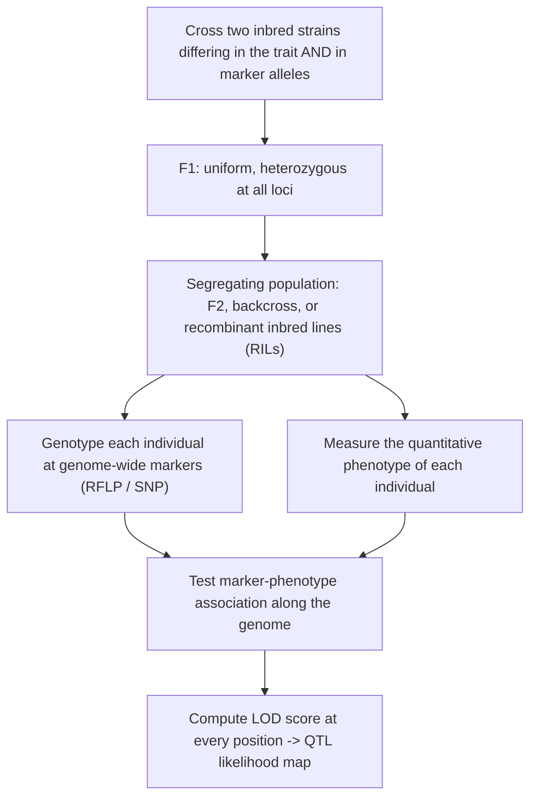

# 실제 세계의 유전학 — 복합 형질과 QTL

**강의:** BME333 / BIO333 유전학 (UNIST, 2026 가을) · 강의 12 · ~60분
**강의계획서:** [← 강의계획서](../../lectures/2026.BME333-BIO333-Syllabus.md) — 7주차 수요일, 10-14
**언어:** [English](../../en/lectures/lec12_Complex-Traits-QTL.md) · 한국어

## 학습 목표
이 강의를 마치면 학생들은 다음을 할 수 있어야 한다:
- 다인자(multiple-factor) 모형과, 그것이 멘델 유전과 연속 변이를 어떻게 조화시키는지 설명할 수 있다.
- 표현형 분산을 유전적 성분과 환경적 성분으로 분할하고, 광의 및 협의 유전율(heritability)을 정의할 수 있다.
- QTL 지도화의 원리 — 표지–형질 연관을 사용하여 양적 형질의 기저 유전자를 국소화하는 것 — 을 기술할 수 있다.
- LOD 점수 QTL 스캔을 해석하고, QTL 분석의 강점과 한계를 논할 수 있다.

## 강의

### 1. 연속 변이와 다인자 가설 (~12분)

멘델의 완두는 둥글거나 *또는* 주름지고, 크거나 *또는* 작았다 — 깔끔하고 불연속적인 범주였다. 그러나 우리가 실제로 관심을 두는 대부분의 형질 — 인간 키, 혈압, 작물 수확량, 질병 위험 — 은 **연속적으로** 변한다: 큰 표본을 측정하면 소수의 불연속 범주가 아니라 매끄럽고 대략 종형(정규) 분포를 얻는다. **양적(quantitative)** 형질(또는 **복합(complex)** 형질)은 연속적으로 변하며 *많은* 유전자와 환경에 의해 형성되는 형질이다. 그러한 형질을 멘델의 불연속 인자와 조화시키는 것은 양적 유전학의 창립 문제였고, 20세기 초에 이는 생물학을 두 개의 대립하는 진영으로 갈라놓았다: 연속 형질을 상관과 회귀로 기술하며 멘델이 그것들에 적용된다는 데 회의적이었던 **생물측정학파(biometrician)**(Galton, Pearson, Weldon)와, 유전이 입자적(particulate)이라고 주장한 **멘델주의자(Mendelian)**(Bateson)였다(참조 [en](../../en/review/Visscher2019_Genetics_Fisher1918GWAS.md) · [ko](../../ko/review/Visscher2019_Genetics_Fisher1918GWAS.md)).

그 해결책이 **다인자(다유전자, polygenic) 가설**이다: 연속 변이는 **많은 유전자가 각각 작은 효과로 가산적으로(additively) 작용**하고, 그 결합된 산출이 환경 변이에 의해 더욱 흐려질 때 생긴다. 그 논리는 단순하지만 강력하다. 두 대립유전자를 가진 유전자 하나는 3개의 유전자형 범주를 주고, 두 유전자는 최대 5개의 가산적 범주를 주며, *n*개의 유전자는 — 중심극한정리와 같은 논리로 — 그 결합된 분포가 매끄러운 정규 곡선에 접근하는 많은 범주를 준다. 특히 환경 잡음이 빈틈을 채우면 더욱 그렇다.

**그림 — 불연속 멘델 인자가 어떻게 합쳐져 연속 곡선이 되는가.**
```
1 gene (2 alleles):  3 classes          |  |  |
                                        aa Aa AA

2 genes (additive):  5 classes        | || ||| || |
                                       0  1  2  3  4   "increasing" alleles

many genes + environment: ~normal        .-''''-.
                                        .'        '.
                                      .'            '.
                                   _.'                '._
                                 low     phenotype      high
```

창립적 경험적 증명은 **E. M. East의 1916년 담배(*Nicotiana longiflora*) 화관(꽃부리, corolla) 길이 연구**로, *Genetics* 창간호에 실렸다(참조 [en](../../en/article/East1916_Genetics_SizeInheritance.md) · [ko](../../ko/article/East1916_Genetics_SizeInheritance.md)). East는 고도로 근친교배된 두 품종을 교배하고 여러 세대에 걸쳐 화관 길이를 추적했다. 그 데이터는 다인자 모형의 모든 예측을 만족한다:

**그림 — East(1916): *Nicotiana* 화관 길이의 크기 유전.**

| 세대 | 평균 (mm) | 분산 (mm²) | 해석 |
|---|---|---|---|
| 부모 330 | 40.5 | 3.5 | 순계 짧음 (낮은 유전 분산) |
| 부모 383 | 93.3 | 5.1 | 순계 김 (낮은 유전 분산) |
| F1 | 63.5 | 8.5 | **중간**, 균일 (모두 이형접합) |
| F2 (n=244) | 68.7 | **40.5** | 분리로 인한 **크게 부풀려진 분산** |

핵심 특징들(참조 [en](../../en/article/East1916_Genetics_SizeInheritance.md) · [ko](../../ko/article/East1916_Genetics_SizeInheritance.md)): F1은 **중간이고 균일**하다(부모처럼 낮은 분산 — 모든 개체가 하나의 잡종 유전자형을 공유); F2는 평균이 F1 근처이지만 **극적으로 부풀려진 분산**을 가진다(~40.5 대 ~8.5). 분리와 독립분리가 이제 유전자형의 스펙트럼을 만들어내기 때문이다; 그리고 **어떤 F2 식물도 부모의 극단 어느 쪽도 회복하지 못했다** — 5개 이상의 유전자좌가 기여한다면 예상되는 일로, 완전한 부모 유전자형을 재구성하는 것은 1/1000 미만의 빈도로 일어나기 때문이다. 끝으로, *서로 다른* F2 식물에서 유래한 F3 가계들은 *서로 다른* 평균과 분산을 가져, F2 변이가 환경 잡음이 아니라 **유전되며 분리하는** 것임을 증명했다. 이것이 연속 분포를 만들어내는 멘델주의이다.

East의 데이터는 기여 유전자좌의 최소 개수에 대한 **라이트–캐슬(Wright–Castle) 추정량**의 고전적 교육 사례가 되었다: **n = (P₁ − P₂)² / [8(V_F2 − V_E)]**, 여기서 V_E(환경 분산)는 낮은 분산의 부모/F1 계통에서 추정한다. East의 수치에 적용하면 **n ≈ 9.6개 유전자좌**가 나온다(참조 [en](../../en/review/East1916_Turelli2016_GeneticsClassic.md) · [ko](../../ko/review/East1916_Turelli2016_GeneticsClassic.md)). (Sewall Wright는 대학원생 때 이 공식을 유도했고, Castle은 1921년 그를 인정하지 않고 발표했다 — 공로의 역사에서 반복되는 주제이다.) Johannsen의 순계 콩과 Nilsson-Ehle의 밀 낟알 색에 대한 가산적 3유전자좌 모형과 함께, East의 연구는 Fisher의 1918년 종합의 경험적 토대를 놓았다(참조 [en](../../en/review/East1916_Turelli2016_GeneticsClassic.md) · [ko](../../ko/review/East1916_Turelli2016_GeneticsClassic.md)). 한 가지 주의할 각주: East 자신은 자신의 데이터를 Galton의 회귀를 "반증하는" 것으로 *오독*했지만, 실제로 그 데이터는 멘델과 Galton을 아름답게 *조화*시켰다 — 같은 데이터가 해석 틀에 따라 옳을 수도 그를 수도 있다는 교훈이다(참조 [en](../../en/review/East1916_Turelli2016_GeneticsClassic.md) · [ko](../../ko/review/East1916_Turelli2016_GeneticsClassic.md)).

### 2. Fisher의 조화와 유전율 (~12분)

결정적인 이론적 통합은 **R. A. Fisher의 1918년 논문** "멘델 유전의 가정 하에서 친족 간 상관관계(The Correlation between Relatives on the Supposition of Mendelian Inheritance)"에서 나왔다. 이 논문은 많은 유전자가 각각 멘델의 규칙을 따르며 가산적으로 기여한다면 연속 형질이 멘델 틀 안에서 *완전히* 설명됨을 수학적으로 증명하여 — 생물측정학파–멘델주의자 전쟁을 끝냈다(참조 [en](../../en/review/Visscher2019_Genetics_Fisher1918GWAS.md) · [ko](../../ko/review/Visscher2019_Genetics_Fisher1918GWAS.md)). Fisher의 도구들은 이 분야 전체의 어휘가 되었다: 그는 바로 이 논문에서 *"분산(variance)"이라는 단어를 발명*했고 **분산분석(analysis of variance, ANOVA)** 방법을 만들었다.

Fisher의 핵심 조치는 **분산 분할(variance partitioning)**이다. 형질의 총 관측 변이인 **표현형 분산 V_P**는 유전적 부분과 환경적 부분으로 나뉘고, 유전적 부분은 다시 더 나뉜다:

**그림 — 표현형 분산의 분할.**
```
                      V_P  (total phenotypic variance)
                     /                          \
                  V_G (genetic)              V_E (environmental)
                /     |      \
             V_A     V_D      V_I
         additive  dominance  interaction
        (breeding   (within-  (epistasis,
          value)     locus)   between-loci)
```

- **V_A (가산 분산)** — 유전자좌에 걸쳐 합산한 "대립유전자 치환의 평균 효과"의 분산. 이것이 *예측 가능하게 자손에게 전달되고* 선택이 작용하는 부분이다.
- **V_D (우성 분산)** — *같은 유전자좌*의 두 대립유전자 사이의 상호작용에서 나옴.
- **V_I (상위/상호작용 분산)** — *유전자좌 사이*의 상호작용에서 나옴.
- **V_E (환경 분산)** — 유전적이지 않은 모든 것.

이 분할에서 두 가지 **유전율(heritability)**이 나오며, 이는 *형질 변이의 얼마만큼이 유전적인지*를 정량화한다:

$$H^2 = \frac{V_G}{V_P} \quad \text{(broad-sense)} \qquad h^2 = \frac{V_A}{V_P} \quad \text{(narrow-sense)}$$

**광의 유전율(broad-sense heritability, H²)**은 *모든* 유전 효과로 인한 표현형 분산의 비율이며, **협의 유전율(narrow-sense heritability, h²)**은 *가산* 효과만으로 인한 비율이다. *친족 간 유사성*과 *선택에 대한 반응*("육종가 방정식", R = h²S)에 중요한 것은 협의 h²인데, 가산 효과만이 신뢰성 있게 전달되기 때문이다. Fisher는 분산 성분만 알면 — 개별 유전자를 하나도 몰라도 — 친족 간(부모–자손, 완전 형제) 표현형 상관을 예측할 수 있음을 보였고, **양성 동류교배(positive assortative mating)**(비슷한 것끼리 짝짓기)가 서로 다른 유전자좌의 대립유전자 사이에 상관을 만들어 V_A를 어떻게 부풀리는지 규명했다(참조 [en](../../en/review/Visscher2019_Genetics_Fisher1918GWAS.md) · [ko](../../ko/review/Visscher2019_Genetics_Fisher1918GWAS.md)).

두 가지 개념적 경고가 필수적이다. 첫째, **유전율은 추상적인 개체나 형질이 아니라, 어떤 환경에 놓인 집단의 속성이다.** 한 형질이 어떤 환경에서는 매우 유전적이고 다른 환경에서는 덜 유전적일 수 있는데, V_E를 바꾸면 그 비율이 바뀌기 때문이다. 둘째, **높은 유전율은 환경이 무력하다는 뜻이 아니다**: 키의 h² = 0.8이라 해도 환경 성분의 표준편차는 여전히 ~3.1 cm이며 — 환경적 개입은 평균을 상당히 움직일 수 있다(참조 [en](../../en/review/Visscher2019_Genetics_Fisher1918GWAS.md) · [ko](../../ko/review/Visscher2019_Genetics_Fisher1918GWAS.md)).

현대 유전체 시대는 Fisher를 놀랍도록 *확증*했다(참조 [en](../../en/review/Visscher2019_Genetics_Fisher1918GWAS.md) · [ko](../../ko/review/Visscher2019_Genetics_Fisher1918GWAS.md), [en](../../en/review/Charlesworth2022_NatGenet_MendelPerspectives.md) · [ko](../../ko/review/Charlesworth2022_NatGenet_MendelPerspectives.md)): GWAS는 거의 모든 유전 형질이 **고도로 다유전자적(polygenic)**임을 보여준다(인간 키는 **3,000개 이상**의 유의한 유전자좌를 가지지만 가산 분산의 ~1/3만을 설명한다 — "실종된 유전율(missing heritability)" 문제); 유전 분산은 종에 걸쳐 **압도적으로 가산적**이다(우성과 상위는 메커니즘적으로 작용하는 곳에서조차 *분산*에는 거의 기여하지 않는다); 표현형을 SNP 용량(0/1/2)에 회귀시키는 표준 GWAS 회귀는 *곧* Fisher의 평균 효과 모형이다; 그리고 동류교배는 키와 교육 성취에 대한 GWAS 데이터에서 측정 가능하다. W. G. Hill의 이론적 연구는 유전자 상호작용 하에서도 *왜* 가산 분산이 지배하는지, 그리고 장기 인공 선택이 왜 계속 반응하는지 — 새로운 돌연변이가 V_A를 끊임없이 보충하기 때문에 — 를 설명했다(참조 [en](../../en/review/Charlesworth2022_NatGenet_MendelPerspectives.md) · [ko](../../ko/review/Charlesworth2022_NatGenet_MendelPerspectives.md)).

### 3. QTL 지도화 원리 (~14분)

유전율은 형질의 *얼마만큼*이 유전적인지는 알려주지만 유전자가 *어디에* 있는지는 알려주지 않는다. 20세기 대부분 동안 양적 형질 뒤의 유전자는 "통계적 안개(statistical fog)" — 염색체 주소가 없는 추상 — 였다(참조 [en](../../en/review/Mauricio2001_NatRevGenet_QTL.md) · [ko](../../ko/review/Mauricio2001_NatRevGenet_QTL.md)). **양적 형질 유전자좌(quantitative trait locus, QTL)**는 양적 형질에 영향을 주는 하나 이상의 유전자를 포함하는 유전체 영역이다. **QTL 지도화(QTL mapping)**는 **유전 표지와 형질 사이의 통계적 연관**을 찾아 그 안개를 걷어낸다: 표지 대립유전자 *M₁*을 지닌 개체가 평균적으로 *M₂*를 지닌 개체보다 크다면, 형질에 영향을 주는 유전자가 *그 표지 근처*에 있을 것이다. 표지와 유전자가 물리적으로 **연관(linked)**되어 함께 유전되기 때문이다.

일반적 실험 논리:

**그림 — QTL 지도화 작업 흐름.**


변혁적 논문은 **Lander와 Botstein(1989)**으로, QTL 지도화를 임시방편적 단일표지 검정에서 **RFLP 연관 지도**에 기반한 엄밀한 유전체 전반 방법으로 바꾸었다(참조 [en](../../en/article/LanderBotstein1989_Genetics_QTL.md) · [ko](../../ko/article/LanderBotstein1989_Genetics_QTL.md), [en](../../en/review/LanderBotstein1989_Churchill2016_GeneticsClassic.md) · [ko](../../ko/review/LanderBotstein1989_Churchill2016_GeneticsClassic.md)). 이 논문은 수십 년간 이 분야를 규정한 세 가지 혁신을 도입했다.

**(1) 구간 지도화(interval mapping).** 전통적인 **단일표지(single-marker)** 분석에는 네 가지 결함이 있다: QTL이 표지 사이에 있을 때 그 효과를 *과소평가*하고; 약한 QTL과의 긴밀한 연관을 강한 QTL과의 느슨한 연관과 *구별하지 못하며*; *국소화가 부실*하고; 많은 표지를 검정하면 위양성이 부풀려진다. **구간 지도화**는 *양측 표지 쌍(flanking marker pair)*을 사용하여 **최대우도(maximum likelihood)**로 모든 표지 구간의 *모든 위치*에서 QTL의 증거를 계산함으로써 이를 고친다 — 알려지지 않은 QTL 유전자형을 **EM 알고리즘**으로 다루는 결측 데이터로 취급한다(참조 [en](../../en/article/LanderBotstein1989_Genetics_QTL.md) · [ko](../../ko/article/LanderBotstein1989_Genetics_QTL.md)). 증거는 **LOD 점수**(오즈비의 log₁₀: "여기에 QTL 있음"의 우도 ÷ "QTL 없음"의 우도)로 보고된다. 이들의 소프트웨어 **MAPMAKER-QTL**이 이를 실용화했다.

**그림 — 단일표지 대 구간 대 복합 지도화.**

| 방법 | 어떻게 검정하는가 | 강점 / 약점 |
|---|---|---|
| **단일표지(Single-marker)** | 한 번에 한 표지 (t-검정 / 회귀) | 단순; 효과 편향, 부실한 국소화, 위치 없음 |
| **구간 지도화(Interval mapping)** | 양측 표지 쌍, 모든 점에서 ML | 편향 없는 효과, 위치 + 지지 구간 제공 |
| **복합 구간 지도화(Composite interval mapping)** | 구간 + 다른 QTL에 대한 공변량 | 두 실제 QTL 사이의 "유령(ghost)" 봉우리 제거 |
| **다중 구간 지도화(Multiple interval mapping)** | 모든 QTL + 상호작용을 함께 | 개수, 위치, 효과, 상위를 함께 추정 |

**(2) 유전체 전반 유의 역치.** 수천 개 위치를 검정하려면 보정된 역치가 필요하다. Lander와 Botstein은 QTL이 없다는 영가설 하에서 LOD 점수가 유전체에 걸쳐 *오른슈타인–울렌벡(Ornstein–Uhlenbeck) 확산 과정의 제곱*처럼 변한다는 것을 증명하여, 유전체 크기와 표지 밀도에 의존하는 해석적 역치를 도출했다(참조 [en](../../en/article/LanderBotstein1989_Genetics_QTL.md) · [ko](../../ko/article/LanderBotstein1989_Genetics_QTL.md)). 20-cM 지도를 가진 토마토 유전체의 경우 요구되는 역치는 **LOD ≈ 2.4**이다; 순진한 검정별 역치(LOD > 0.83, α = 0.05)를 쓰면 유전체 어딘가에서 위양성이 최소 하나 나올 확률이 90% 이상이 된다. (실제로는 **순열 검정(permutation testing)** — Churchill & Doerge 1994 — 이 나중에 역치를 설정하는 표준적 경험 방법이 되었다.)

**(3) 설계 도구.** Wright의 공식 **k = D²/16σ²_G**를 사용하여 이들은 큰 효과의 QTL이 분리될 가능성이 높은 부모 계통을 고르고 최소 검출 가능 효과의 경계를 정하는 법을 보였다. **선택적 유전형 분석(selective genotyping)** — 큰 집단의 표현형을 측정하되 상위 및 하위 ~5%(±2 SD)만 유전형 분석 — 은 (더 많은 자손을 길러야 하는 비용을 치르되) 결측 데이터 ML을 순수 회귀 대신 사용한다면 ~5.5배 적은 유전형 분석에서 거의 같은 연관 정보를 추출한다(참조 [en](../../en/article/LanderBotstein1989_Genetics_QTL.md) · [ko](../../ko/article/LanderBotstein1989_Genetics_QTL.md)).

### 4. QTL 스캔 읽기와 해석 (~12분)

구간 지도화의 출력은 **QTL 우도 지도(QTL likelihood map)**이다: 각 염색체를 따라 그린 LOD 점수. 이를 읽는 것이 핵심 기술이다.

**그림 — LOD 점수 QTL 스캔.**
```
LOD
 6 |                     .*.  <- QTL peak (LOD 6, well above threshold)
 5 |                    .   .
 4 |                   .     .
 3 |___________.______._______.___________________ significance threshold (~LOD 3, permutation-set)
 2 |          . .    .         .          .*.  <- suggestive peak (below threshold: ignore/replicate)
 1 |    .*.  .   .  .            .       .   .
 0 |___.___.___._.__________________.__.______.____
    |----chr 1----|----chr 2----|----chr 3----|   genome position (cM)
        ^                              ^
   one-LOD support interval      confidence interval = positions within 1 LOD of the peak
```

스캔에서 읽어낼 네 가지(참조 [en](../../en/article/LanderBotstein1989_Genetics_QTL.md) · [ko](../../ko/article/LanderBotstein1989_Genetics_QTL.md), [en](../../en/review/Barton2002_NatRevGenet_QTL.md) · [ko](../../ko/review/Barton2002_NatRevGenet_QTL.md)):

1. **역치를 넘는 봉우리**는 QTL로 선언된다; 그 **높이**는 (효과 크기만이 아니라, 대략 효과 크기 × 표본 크기의) 통계적 증거를 반영한다.
2. **위치와 신뢰도**는 **1-LOD 지지 구간(one-LOD support interval)** — LOD가 봉우리로부터 1 단위 이내인 위치의 범위 — 으로 주어진다. 이 구간은 흔히 넓으며(많은 cM, 수백 개 유전자), 연관 지도화의 근본적 해상도 한계이다.
3. **효과 크기** — QTL이 표현형 분산의 얼마만큼을 설명하는가.
4. **역치 아래의 "시사적(suggestive)" 봉우리**는 회의적으로 다루거나 재현을 위해 보류해야 한다.

두 가지 체계적 편향이 해석을 누그러뜨려야 하며 — 둘 다 시험에 나올 만하다(참조 [en](../../en/review/Barton2002_NatRevGenet_QTL.md) · [ko](../../ko/review/Barton2002_NatRevGenet_QTL.md), [en](../../en/review/Mauricio2001_NatRevGenet_QTL.md) · [ko](../../ko/review/Mauricio2001_NatRevGenet_QTL.md)):

- QTL 연구는 **QTL 개수를 과소평가하고 그 효과를 과대평가한다.** 반대 효과를 가진 긴밀히 연관된 QTL은 서로 상쇄되어 놓치고; **Beavis 효과**는 작은 표본(< ~500개체)에서 우연히 유의 역치를 넘긴 QTL의 추정 효과가 *부풀려짐*(승자의 저주, winner's curse)을 뜻한다. 표지 밀도와 무관하게, ~500개 미만의 자손은 작은 효과 QTL에 대한 검정력이 거의 없다.
- **QTL × 환경 상호작용**이 만연하다. 세 환경에 걸친 한 토마토 연구에서, 검출된 29개 QTL 중 **4개만이** 세 환경 모두에서 재현되었고; 15개는 단 하나의 환경에서만 나타났다(참조 [en](../../en/review/Mauricio2001_NatRevGenet_QTL.md) · [ko](../../ko/review/Mauricio2001_NatRevGenet_QTL.md)). QTL은 보편 상수가 아니라 *어떤 환경에 놓인 집단*에 관한 진술이다.

스캔은 어떤 유전적 구조를 드러내는가? 그것은 다양하다. Fisher의 **기하학적/무한소(geometric/infinitesimal)** 관점은 아주 작은 효과의 많은 유전자좌를 예측했고; Orr의 정련은 효과가 대략 **지수적으로 분포**한다고 예측한다 — 소수의 큰 효과 QTL 더하기 많은 작은 효과 QTL(참조 [en](../../en/review/Barton2002_NatRevGenet_QTL.md) · [ko](../../ko/review/Barton2002_NatRevGenet_QTL.md)). 실제 데이터는 그 범위를 넘나든다: 어떤 형질(예: 옥수수 순화의 여러 측면)은 소수의 큰 효과 QTL에 달려 있고, 다른 형질은 강하게 다유전자적이며, 보편적 규칙은 없다. 지속적 인공 선택 실험 — *Drosophila* 강모(bristle) 수가 **85세대 이상** 반응(16-SD 증가), 비행 속도가 100세대에 걸쳐 반응(2 → 170 cm/s) — 은 기존의 큰 효과 대립유전자가 지탱할 수 있는 것보다 훨씬 긴 반응을 보여, 새로운 돌연변이의 지속적 유입을 시사하며 "소수의 큰 유전자"와 "무한소" 그림을 조화시킨다(참조 [en](../../en/review/Barton2002_NatRevGenet_QTL.md) · [ko](../../ko/review/Barton2002_NatRevGenet_QTL.md)).

### 5. QTL에서 유전자로, 그리고 인간으로 (~10분)

QTL은 유전자가 아니라 *구간*이며 — 그 간극을 메우는 것이 어려운 부분이다. 토마토 과중(fruit-weight) QTL **fw2.2**는 단일 열린 해독틀(open reading frame)로 좁히는 데 정밀 지도화와 형질전환 검정으로 **10년 이상**이 걸렸다(참조 [en](../../en/review/Mauricio2001_NatRevGenet_QTL.md) · [ko](../../ko/review/Mauricio2001_NatRevGenet_QTL.md), [en](../../en/review/Barton2002_NatRevGenet_QTL.md) · [ko](../../ko/review/Barton2002_NatRevGenet_QTL.md)). 다른 성공 사례: **teosinte branched1 (tb1)**은 QTL에서 클로닝되어, 테오신트에서 옥수수 순화의 주요 구조적 변화를 설명한다; 수수, 벼, 옥수수에 걸친 비교 QTL 지도화는 씨앗 크기, 개화, 탈립(shattering) QTL이 ~6,500만 년의 분기에 걸쳐 *보존된* 위치에 있음을 발견했다 — 세 대륙의 농부들이 독립적으로 상동 유전자를 선택했음을 시사한다(참조 [en](../../en/review/Mauricio2001_NatRevGenet_QTL.md) · [ko](../../ko/review/Mauricio2001_NatRevGenet_QTL.md)).

QTL 사고는 분자 도구가 존재하기 훨씬 전부터 동물에서도 통했다. **Dunn과 Charles(1937)**는 *Genetics* 제1권에서, *얼룩(piebald, s)* 돌연변이에 대해 동형접합인 생쥐의 극도로 가변적인 털 반점을 연구했다. 유전자를 지도화할 방법이 전혀 없던 이들은 극단적 표현형에 대한 근친교배 계통을 만들고, **양적 등급 척도(quantitative grading scale)**를 고안했으며, F1과 역교배(backcross)를 사용하여 그 변이가 유전적 배경 위의 여러 **수식 유전자좌(modifier loci)**에 의해 제어됨을 보였다 — "유전자 지도화만 뺀 현대적 QTL 연구"였다(참조 [en](../../en/review/DunnCharles1937_Schimenti2016_GeneticsClassic_MouseQTL.md) · [ko](../../ko/review/DunnCharles1937_Schimenti2016_GeneticsClassic_MouseQTL.md)). *s* 유전자는 이제 **Ednrb**(엔도텔린 수용체 B; 그 인간 상동체는 히르슈슈프룽병(Hirschsprung disease)과 바르덴부르크 증후군(Waardenburg syndrome)의 기저)로 알려져 있으며, 이들의 수식 유전자 분석은 단일 유전자 돌연변이가 배경에 따라 왜 가변적인 **침투도(penetrance)와 표현도(expressivity)**를 보이는지에 대한 현대 연구를 예고했다.

끝으로, 인간 유전학으로의 다리는 겉보기에 "단순한" 형질을 통해 놓인다: **PTC(phenylthiocarbamide) 맛보기**(참조 [en](../../en/article/Wooding2006_Genetics_PhenylThioCarbamide.md) · [ko](../../ko/article/Wooding2006_Genetics_PhenylThioCarbamide.md)). 1930년에 우연히 발견된 맛보기는 오랫동안 깔끔한 우성/열성 멘델 형질로 가르쳐졌다. 분자적으로, 대부분의 변이는 쓴맛 수용체 유전자 **TAS2R38**로 거슬러 올라가며, 그 세 아미노산 위치(49, 262, 296)가 두 개의 주요 하플로타입을 정의한다:

**그림 — TAS2R38 하플로타입과 PTC 맛보기.**

| 하플로타입 | 위치 49–262–296 | 표현형 |
|---|---|---|
| **PAV** | Pro–Ala–Val | 맛보는 사람(taster) |
| **AVI** | Ala–Val–Ile | 못 맛보는 사람(non-taster) |
| (소수 하플로타입) | 다양함 | 중간; 빈도는 집단마다 다름 |

그러나 PTC 민감도는 실제로 **연속적으로 분포**하며(어떤 "못 맛보는 사람"은 높은 농도에서 반응함), 다른 유전자와 환경도 기여한다 — 따라서 이 교과서적 멘델 형질조차 실은 소규모 복합 형질이다(참조 [en](../../en/article/Wooding2006_Genetics_PhenylThioCarbamide.md) · [ko](../../ko/article/Wooding2006_Genetics_PhenylThioCarbamide.md)). 집단유전학은 반전을 더한다: 두 하플로타입 모두 고대의 것이며(~300만 년 전에 합체(coalesce)) 맛보는/못 맛보는 다형성은 *침팬지와 공유된다* — 이는 정확히 Fisher, Ford, Huxley가 1939년에 두 대립유전자를 유지하는 **균형 선택(balancing selection)**의 서명으로 예측한 것이다(다만 선택 인자는 여전히 논쟁 중이다 — 아마도 독소 검출 또는 갑상선 효과)(참조 [en](../../en/article/Wooding2006_Genetics_PhenylThioCarbamide.md) · [ko](../../ko/article/Wooding2006_Genetics_PhenylThioCarbamide.md)).

이것이 강의의 호(arc)를 닫고 다음에 올 것을 가리킨다. 설계된 교배에서의 연관 기반 **QTL 지도화**는 넓은 구간을 준다; 같은 통계적 논리를 전체 집단과 조밀한 **SNP** 패널로 확대하면 **전장유전체 연관 연구(genome-wide association study, GWAS)**가 된다 — 이는 Fisher의 1918년 가산 모형을 유전체 전반에 적용한 것에 지나지 않으며, **r² 연관불평형(linkage-disequilibrium)** 지표(Hill & Robertson 1968에서 유래)가 원인 변이를 표지하는 데 얼마나 많은 표지가 필요한지를 결정한다(참조 [en](../../en/review/Charlesworth2022_NatGenet_MendelPerspectives.md) · [ko](../../ko/review/Charlesworth2022_NatGenet_MendelPerspectives.md), [en](../../en/review/Visscher2019_Genetics_Fisher1918GWAS.md) · [ko](../../ko/review/Visscher2019_Genetics_Fisher1918GWAS.md)). East의 담배꽃에서 3천 개 키 유전자좌의 GWAS까지, 그것은 하나의 연속된 지적 실타래이다 — 합산된 멘델 인자들.

## 핵심 정리
- **연속 형질**은 **작은 효과의 많은 유전자가 가산적으로 작용**하는 것에 환경을 더한 데서 생긴다 — **다인자(다유전자) 가설**로, **East(1916)**가 경험적으로 확정했다: 중간이고 균일한 F1, 분산이 부풀려진 F2, 유전되는 F3 차이(라이트–캐슬 추정 ≈ 9.6개 유전자좌).
- **Fisher(1918)**는 **분산을 분할**하여 멘델과 생물측정학을 통합했다: V_P = V_G + V_E, 여기서 V_G = V_A + V_D + V_I; 그는 "분산"과 ANOVA를 발명했다.
- **유전율**: 광의 **H² = V_G/V_P**; 협의 **h² = V_A/V_P**(유사성과 선택 반응을 지배하는 것). 이는 **집단-환경 특이적 비율**이며; 높은 h²가 환경이 무력함을 뜻하지는 *않는다*.
- **QTL 지도화**는 표지–형질 연관을 찾는다; **Lander–Botstein(1989)**은 **구간 지도화**(모든 위치에서 ML LOD 점수), **유전체 전반 LOD 역치**(~2–3, 토마토 ≈ 2.4), **선택적 유전형 분석**을 도입했다.
- **LOD 스캔 읽기**: (순열로 설정한) 역치를 넘는 봉우리 = QTL; **1-LOD 지지 구간**이 위치를 준다; **Beavis 효과**(작은 표본에서 부풀려진 효과), 놓친 연관 QTL, **QTL × 환경** 상호작용(토마토: 29개 중 4개만 환경 간 재현)을 경계하라.
- **QTL → 유전자는 느리다**(fw2.2는 10년 이상 걸림); 고전적 성공에는 *tb1*(옥수수)과 생쥐 *s/Ednrb*의 수식 유전자좌(Dunn & Charles 1937)가 있다.
- "단순한" 인간 형질조차 복합적이다: **PTC/TAS2R38**은 연속적으로 분포하며 (침팬지와 공유되는) **고대의 균형 선택**을 보인다. QTL 논리를 집단 + 조밀한 SNP로 확대하면 **GWAS**가 된다 — 유전체 전반에 적용된 Fisher의 가산 모형.

## 교재 참고
- **Genetics: From Genes to Genomes (8e)** — Ch. 25 Genetic Analysis of Complex Traits. → [textbook ref](../../lectures/ref.Genetics-FromGenesToGenomes.md)
- **Evolution: Making Sense of Life (4e)** — Ch. 7 Beyond Alleles: Quantitative Genetics. → [textbook ref](../../lectures/ref.Evolution-MakeSenseOfLife.md)

## 이 저장소의 노트
수업에서 소개할 리뷰 및 논문(각각 en/ko 이중언어 쌍이 있음):
- `LanderBotstein1989_Genetics_QTL` — 기초가 되는 구간 지도화 논문; QTL 부분의 핵심. · [en](../../en/article/LanderBotstein1989_Genetics_QTL.md) · [ko](../../ko/article/LanderBotstein1989_Genetics_QTL.md)
- `LanderBotstein1989_Churchill2016_GeneticsClassic` — Lander–Botstein을 현대적 맥락에 놓는 고전 논문 논평. · [en](../../en/review/LanderBotstein1989_Churchill2016_GeneticsClassic.md) · [ko](../../ko/review/LanderBotstein1989_Churchill2016_GeneticsClassic.md)
- `Barton2002_NatRevGenet_QTL` — QTL 개념과 양적 형질의 유전적 구조에 대한 리뷰. · [en](../../en/review/Barton2002_NatRevGenet_QTL.md) · [ko](../../ko/review/Barton2002_NatRevGenet_QTL.md)
- `Mauricio2001_NatRevGenet_QTL` — 자연 변이와 진화적 질문에 적용된 QTL 지도화. · [en](../../en/review/Mauricio2001_NatRevGenet_QTL.md) · [ko](../../ko/review/Mauricio2001_NatRevGenet_QTL.md)
- `East1916_Genetics_SizeInheritance` — 크기 유전에 대한 East의 원저 다인자 실험. · [en](../../en/article/East1916_Genetics_SizeInheritance.md) · [ko](../../ko/article/East1916_Genetics_SizeInheritance.md)
- `East1916_Turelli2016_GeneticsClassic` — East 1916과 양적 유전학의 탄생에 대한 고전 논문 논평. · [en](../../en/review/East1916_Turelli2016_GeneticsClassic.md) · [ko](../../ko/review/East1916_Turelli2016_GeneticsClassic.md)
- `DunnCharles1937_Schimenti2016_GeneticsClassic_MouseQTL` — 초기 생쥐 양적 유전학; 역사적 QTL 사례. · [en](../../en/review/DunnCharles1937_Schimenti2016_GeneticsClassic_MouseQTL.md) · [ko](../../ko/review/DunnCharles1937_Schimenti2016_GeneticsClassic_MouseQTL.md)
- `Visscher2019_Genetics_Fisher1918GWAS` — 멘델에서 유전율과 현대 GWAS로 이어지는 다리로서의 Fisher 1918. · [en](../../en/review/Visscher2019_Genetics_Fisher1918GWAS.md) · [ko](../../ko/review/Visscher2019_Genetics_Fisher1918GWAS.md)
- `Charlesworth2022_NatGenet_MendelPerspectives` — 유전에 대한 멘델적 관점과 양적 관점을 연결하는 전망. · [en](../../en/review/Charlesworth2022_NatGenet_MendelPerspectives.md) · [ko](../../ko/review/Charlesworth2022_NatGenet_MendelPerspectives.md)
- `Wooding2006_Genetics_PhenylThioCarbamide` — 단일 유전자 변이와 양적 변이를 잇는 다루기 쉬운 인간 형질로서의 PTC 맛보기. · [en](../../en/article/Wooding2006_Genetics_PhenylThioCarbamide.md) · [ko](../../ko/article/Wooding2006_Genetics_PhenylThioCarbamide.md)

## 토론 문제
1. East의 F1 담배 식물은 *낮은* 분산으로 균일했지만, F2 분산은 ~40 mm²로 부풀어 올랐다. 여러 가산 유전자좌의 분리와 독립분리 관점에서, 왜 F1은 균일한데 F2는 가변적인지 — 그리고 왜 어떤 F2 식물도 부모의 극단과 일치하지 않았는지 설명하라.
2. 한 집단에서 형질의 h² = 0.8이다. 한 학생이 "이 형질에는 환경이 중요하지 않으니 개입은 무의미하다"고 결론짓는다. 협의 유전율의 정의와 키 예시(V_E SD ≈ 3.1 cm)를 사용하여, 이 결론이 왜 정확히 틀렸는지 설명하라. V_E를 높이거나 낮추면 h²에 무슨 일이 일어나는가?
3. 단일표지 분석과 Lander–Botstein 구간 지도화를 대조하라. 왜 단일표지 분석은 표지 근처의 약한 QTL을 표지에서 먼 강한 QTL과 혼동하며, *양측* 표지를 최대우도와 함께 사용하는 것이 효과 크기 편향과 국소화 문제를 어떻게 둘 다 해결하는가?
4. 당신은 150개 F2 개체에 대해 QTL 스캔을 수행하여 분산의 40%를 설명하는 LOD 3.5의 봉우리 하나를 발견한다. Beavis 효과와 전형적인 1-LOD 지지 구간을 고려할 때, 그 40%라는 수치와 위치를 얼마나 신뢰해야 하는가? 당신의 결과를 검증할 후속 연구(표본 크기, 재현, 환경)를 설계하라.
5. PTC/TAS2R38은 단순한 우성 형질로 가르쳐지지만 연속적 민감도, 다수의 하플로타입, 침팬지와 공유되는 고대의 균형 선택을 보인다. 이 예를 사용하여 "멘델적 대 양적" 구분이 이분법이 아니라 스펙트럼임을 논하라. QTL 논리를 전체 집단에 걸친 조밀한 SNP로 확대하는 것이 어떻게 연관 지도화를 GWAS로 바꾸는가?
