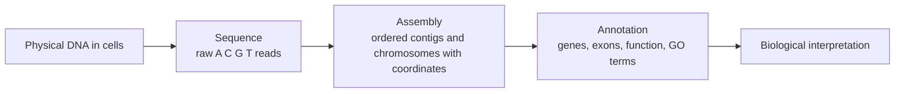
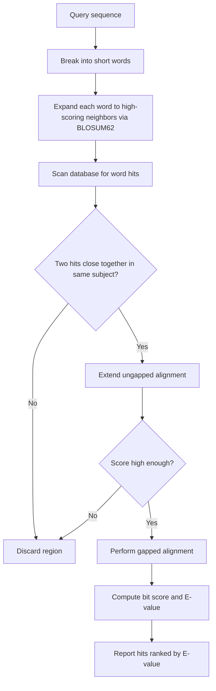
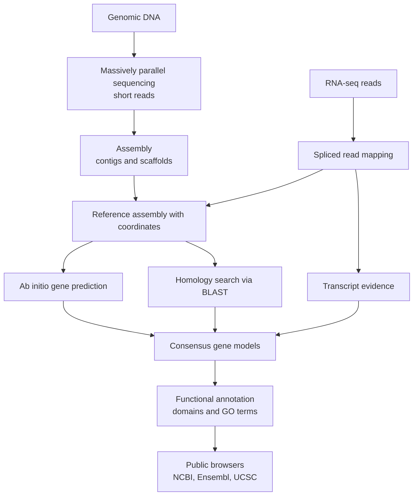

# 실제 세계의 유전학 — 유전체 주석과 자원

**강의:** BME333 / BIO333 유전학 (UNIST, 2026 가을) · 13강 · ~60분
**강의계획서:** [← 강의계획서](../../lectures/2026.BME333-BIO333-Syllabus.md) — 9주차, 2026-10-26 (월)
**언어:** [English](../../en/lectures/lec13_Genome-Annotation-Resources.md) · 한국어

## 학습 목표
이 강의를 마치면 학생은 다음을 할 수 있어야 한다:
- "유전체(genome)"가 무엇인지 정의하고, 서열(sequence)·어셈블리(assembly)·주석(annotation)을 구분할 수 있다.
- 짧은 읽기(short read)가 어떻게 생성되어 참조 유전체(reference genome)에 정렬(mapping)되는지 설명할 수 있다.
- 유전자와 기능 요소가 어떻게 주석되는지(ab initio, 상동성homology, 증거 기반 접근법) 기술할 수 있다.
- 서열 유사도 검색(BLAST)을 사용하고, 그 채점 기제(동적 계획법, BLOSUM62 같은 치환 행렬)를 이해할 수 있다.
- 주요 공개 유전체 자원(NCBI, Ensembl, UCSC)을 다루고, 현재 주석의 한계를 인식할 수 있다.

## 강의

### 1. 유전체란 정말 무엇인가? (~8분)

대부분의 교과서는 **유전체(genome)**를 NIH가 정의하는 방식대로 규정한다: "한 생물의 완전한 DNA 집합으로, 모든 유전자를 포함하며… 그 생물을 만들고 유지하는 데 필요한 모든 정보." 이것은 유용한 출발점이지만, Goldman과 Landweber(2016)는 이 정의가 지나치게 단순화되어 있고 내부적으로 모순된다고 주장하며, 이를 뜯어보는 것이 이 강의의 나머지가 실제로 무엇을 만들어내는지 이해하는 최선의 방법이다(참조 [en](../../en/review/Goldman2016_PLoSgenet_WhatIsGenome.md) · [ko](../../ko/review/Goldman2016_PLoSgenet_WhatIsGenome.md)).

두 가지 문제가 이 깔끔한 정의를 무너뜨린다. 첫째, 많은 시스템에서 **물리적 영속성(physical permanence)**이 성립하지 않는다. 레트로바이러스는 유전체를 단일가닥 RNA로 지니고 있다가 역전사하여 이중가닥 DNA로 만든 뒤 숙주에 통합되어 — 별개의 분자로서 존재하기를 멈춘다. 섬모충 *Oxytricha*는 더 극적이다: 이 생물은 **생식계열(germline)** 유전체(~1 Gb, 뒤섞이고 뒤집힌 유전자 조각 ~250,000개)와, 생식계열 서열의 5~10%만을 부호화하는 16,000개 이상의 아주 작은 "나노염색체(nanochromosome)"로 이루어진 재배열된 **체세포(somatic)** 유전체를 함께 유지한다. 교배 후에는 *이전* 세대에서 온 RNA 주형이 DNA 재배열을 안내하므로, 정보가 세대를 가로질러 DNA → RNA → DNA로 흐른다 — "그 유전체"라고 가리킬 수 있는 단일 물리적 분자는 존재하지 않는다. 합성생물학은 반대편에서 같은 지적을 한다: Gibson 등이 살아 있는 세포에 부팅한 *Mycoplasma* 유전체는 화학적으로 합성되기 이전에 먼저 **컴퓨터 파일**, 즉 글자들의 문자열로 존재했다. 둘째, **정보적 완전성(informational completeness)**도 성립하지 않는다: 후성유전적 표지(DNA 메틸화, 히스톤 변형, 비암호화 RNA)는 DNA와 나란히 유전 가능한 정보를 지니며, GWAS의 "사라진 유전율(missing heritability)"은 서열만으로는 표현형을 예측할 수 없음을 보여준다.

이 강의에 대한 실질적 결론은 NIH 정의가 흐려버린 결정적 구분이다. 데이터베이스에서 우리가 "유전체"라 부르는 것은 생물 세포 속의 물리적 DNA가 아니다. 그것은 세 개의 층으로 지어진 **모델(model)**이며, 이 시간의 나머지는 각 층이 어떻게 구성되는지에 관한 것이다:

- **서열(Sequence)** — DNA에서 읽어낸 A, C, G, T의 원시적 순서(수십억 개의 짧은 조각).
- **어셈블리(Assembly)** — 그 조각들을 이어붙여 만든 길고 순서가 정해진, 좌표를 지닌 콘티그(contig)/염색체: 무언가를 조회할 때 기준이 되는 "참조(reference)".
- **주석(Annotation)** — 어셈블리 위에 덧씌운 생물학적 의미의 층: 유전자가 어디 있는지, 무엇을 부호화하는지, 각 영역이 무슨 일을 하는지.

**그림 — 유전체는 물리적 대상이 아니라 세 층으로 된 모델이다.**



각 층은 직접 관찰된 것이 아니라 추론된 것이기 때문에 "유전체"는 언제나 잠정적이며 — 이것이 "완성된" 유전체조차 계속 바뀌는 이유다(7절).

### 2. 읽기에서 참조까지: 시퀀싱과 어셈블리 (~10분)

DNA 시퀀싱은 염색체를 끝에서 끝까지 읽지 않는다. 대신 유전체를 조각으로 부수어 **읽기(read)**라 불리는 짧은 구간을 읽는다. **생어 시퀀싱(Sanger sequencing)**(1977년의 사슬 종결 방법)은 반응당 ~500–1000 bp를 높은 정확도로 읽지만, 염기당 비용이 느리고 비싸다. **대량 병렬(massively parallel)**("차세대") 시퀀싱 — Shendure와 Fields(2016) 및 Hobert(2010)가 다룬 기술 — 은 대신 수백만에서 수십억 개의 짧은 반응을 병렬로 수행하여, 아주 낮은 염기당 비용으로 ~25–150 bp의 **짧은 읽기(short read)**를 생산한다(참조 [en](../../en/review/Shendure2016_Genetics_MassiveParallelGenetics.md) · [ko](../../ko/review/Shendure2016_Genetics_MassiveParallelGenetics.md); [en](../../en/review/Hobert2010_Genetics_WholeGenomeSequencing.md) · [ko](../../ko/review/Hobert2010_Genetics_WholeGenomeSequencing.md)). Hobert는 이 변화의 규모를 구체적으로 언급한다: 2010년에 이르러 10× 커버리지의 *C. elegans* 유전체는 ~$2,000 미만으로 약 5일이면 얻을 수 있었고, 그 처리 용량은 무어의 법칙과 유사한 곡선으로 배가되고 있었다 — 일상적인 전장 유전체 작업을 가능하게 만든 변화다.

읽기를 참조로 바꾸는 데는 두 가지 개념이 지배한다. **커버리지(coverage, depth)**는 각 염기를 덮는 읽기의 평균 개수다: 30× 커버리지에서는 모든 위치가 평균 ~30회 읽히므로, 개별 읽기의 무작위 시퀀싱 오류가 합의(consensus)에 의해 표결에서 밀려난다. 깊이가 높을수록 신뢰도가 높다. **어셈블리(assembly)**는 읽기들 사이의 겹침을 찾아 더 긴 구간으로 병합하는 조각 맞추기 퍼즐이다:

- **콘티그(Contig)** — 겹치는 읽기들로부터 조립된 연속 구간으로, 틈(gap)이 없다.
- **스캐폴드(Scaffold)** — 콘티그들을 서로에 대해 순서와 방향을 정한 것(짝지은 끝paired-end / 장거리 정보 이용)으로, 서열이 아직 빠진 곳에는 크기가 매겨진 **틈(gap)**이 있다.
- **참조 어셈블리(reference assembly)** 대 **드 노보 어셈블리(de novo assembly)** — 기존 참조에 읽기를 정렬하는 것(빠름, 알려진 종의 재시퀀싱용)과, 참조가 없는 종의 유전체를 처음부터 조립하는 것(어려움).

**그림 — 커버리지, 콘티그, 스캐폴드, 틈.**

```
genome  ================================================================
reads   ---- ----   ---- ----  ---- ----   ---- ----   ---- ----   (each read ~100 bp)
         ----  ---- ----  ---- ----  ---- ----  ---- ----  ----    (overlapping, ~depth 2-3x here)
        [====contig 1====]  gap  [======contig 2======]  gap  [=contig 3=]
        |<---------------------- scaffold ---------------------->|
```

어려운 부분은 **반복 서열(repeats)**이다: 거의 동일한 복사본으로 여러 번 나타나는 서열은 짧은 읽기로부터 명확하게 배치할 수 없으므로, 어셈블리는 반복 서열에서 끊어지고 그곳에 틈이 생긴다. 이것이 바로 완두콩 유전체(3강)가 그토록 조립하기 어려웠던 이유이며, 장거리 읽기(long-read) 기술(7절)이 중요한 이유다.

### 3. 읽기 정렬 (~8분)

참조가 일단 존재하면, 대부분의 실험 — 돌연변이체 재시퀀싱, RNA-seq, ChIP-seq — 은 참조 위에서 자기 자리를 찾아야 하는, 즉 **정렬(map)**되어야 하는 읽기를 생산한다. Trapnell과 Salzberg(2009)는 두 가지 도전을 정리한다(참조 [en](../../en/review/Trapnell2009_NatBiotech_ShortReadMapping-primer.md) · [ko](../../ko/review/Trapnell2009_NatBiotech_ShortReadMapping-primer.md)). 첫째, **규모(scale)**: BLAST 같은 범용 도구로 수십억 개의 읽기를 정렬하려면 수백에서 수천 CPU 시간이 걸리지만, 전용 정렬기(mapper)는 데스크톱에서 시간당 수억 개의 읽기를 처리한다. 둘째, **반복 서열(repeats)**: 반복 요소에서 온 읽기는 유전체의 여러 복사본에 일치할 수 있어, 프로그램이 여러 위치를 보고하거나 발견적(heuristic) 선택을 하도록 강제한다 — 진짜 출처가 불확실한 **다중 정렬(multi-mapping)** 읽기다.

두 가지 알고리즘 전략이 규모 문제를 해결한다. **간격 씨앗 색인(spaced-seed indexing)**(Maq가 사용)은 각 읽기를 네 개의 씨앗으로 나눈다; 불일치가 최대 두 개면 적어도 두 개의 씨앗이 완벽히 일치하므로, 씨앗 쌍을 색인하면 후보 위치를 빠르게 찾는다 — 다만 색인에 수십 기가바이트의 RAM이 필요하다. **버로우스-휠러 변환(Burrows-Wheeler transform)**(Bowtie가 사용)은 가역적 압축으로, 인간 유전체 전체의 색인을 2 GB 미만으로 줄이고 읽기를 한 글자씩 정렬하며 진행하면서 후보 위치 집합을 좁혀나간다 — Maq보다 30배 이상 빠르다. 이 "한 번 색인, 빠른 질의" 개념과, **씨앗-확장(seed-and-extend)** 논리(짧은 정확한 앵커를 찾은 뒤 그 주위로 정렬을 확장)는 5절 BLAST의 배후에 있는 것과 같은 개념적 엔진이다.

RNA-seq는 반전을 더한다: **엑손-엑손 접합부(exon–exon junction)**를 가로지르는 읽기는 유전체상에 연속적으로 존재하지 않는다. **접합 정렬기(spliced mapper)**가 이를 처리한다 — 주석 기반 도구(ERANGE)는 알려진 엑손 좌표로부터 접합부 서열을 구성하고, 주석이 필요 없는 도구(TopHat)는 먼저 쉬운 읽기를 Bowtie로 정렬하여 가능성 있는 접합부를 추론한 뒤 나머지를 그 위에 걸쳐 정렬한다. 일반적인 전체 정렬 성공률은 70~75%에 불과하며, 많은 읽기가 여러 위치에 정렬된다 — 정렬이 완벽하지 않고 확률적임을 상기시켜 준다.

### 4. 서열 정렬의 기초 (~10분)

정렬과 상동성 검색의 바탕에는 **쌍별 서열 정렬(pairwise sequence alignment)**이 있다: 두 서열을 나란히 놓아 유사도를 최대화하고, 삽입/결실에 대해 **틈(gap)**을 삽입하는 것이다. Eddy(2004)는 정확한 해가 **동적 계획법(dynamic programming, DP)**에서 온다고 설명한다 — 1950년대에 Richard Bellman이 정식화한 이 알고리즘은 큰 최적화 문제를 겹치는 부분 문제로 쪼개고 각 답을 한 번씩만 저장함으로써, 지수적 탐색을 다항 시간으로 바꾼다(참조 [en](../../en/review/Eddy2004_NatureBiotechPrimer_DynamicProgramming.md) · [ko](../../ko/review/Eddy2004_NatureBiotechPrimer_DynamicProgramming.md)). BLAST, FASTA, CLUSTALW, HMMER, GENSCAN은 모두 DP이거나 그것의 빠른 근사다.

서열 x(길이 M)와 y(길이 N)에 대해, 위치 i와 j까지의 접두 서열을 정렬한 최선의 점수 S(i,j)는 세 가지 이동 중 최댓값이다: x_i를 y_j에 정렬(대각선, 치환 점수 σ 추가), x_i를 틈에 정렬(위쪽, 틈 벌점 γ 추가), 또는 y_j를 틈에 정렬(왼쪽, γ 추가). 이 점화식은 채점이 **열 독립적(column-independent)** — 정렬된 각 열이 다른 열에 의존하지 않는 점수를 기여 — 하기 때문에만 작동한다. 경계에서부터 (M+1)×(N+1) 행렬을 채운 뒤, 오른쪽 아래 모서리에서 **역추적(trace back)**하여 정렬을 복원한다. 비용은 M×N에 비례하므로, 두 개의 200-mer를 정렬하는 것은 두 개의 100-mer보다 4배 오래 걸린다 — 바로 이 비용이 BLAST의 발견적 방법을 낳은 동기다.

**그림 — 동적 계획법 정렬 행렬(일치 +1, 불일치/틈 −1).** 각 칸은 접두 서열을 정렬한 최선의 점수이며, 굵은 경로는 역추적이다.

|       |   – |   G |   A |   T |   T |
|-------|----:|----:|----:|----:|----:|
| **–** |  0  | −1  | −2  | −3  | −4  |
| **G** | −1  | **1** |  0  | −1  | −2  |
| **A** | −2  |  0  | **2** |  1  |  0  |
| **T** | −3  | −1  |  1  | **3** |  2  |
| **C** | −4  | −2  |  0  |  2  | **2** |

모서리의 점수(여기서는 2)가 GATC 대 GATT의 최적 정렬 점수다. 핵심 유의점: DP는 *주어진 채점 체계에 대해* **수학적으로** 최적인 정렬을 보장하지만, 그것이 **생물학적으로** 옳은 정렬인지는 전적으로 선택한 점수에 달려 있다 — 여기서 치환 행렬이 등장한다.

단백질의 경우 치환 점수 σ는 **BLOSUM62** 같은 행렬에서 온다. Eddy(2004)는 모든 항목이 **로그 오즈 점수(log-odds score)**임을 설명한다: s(a,b) = (1/λ)·log(p_ab / f_a·f_b), 즉 잔기 a와 b가 진짜 상동체에서 정렬되는 빈도(p_ab)와 우연히 정렬될 빈도(f_a·f_b)의 비의 로그다(참조 [en](../../en/review/Eddy2004_NatureBiotechPrimer_BLOSUM62.md) · [ko](../../ko/review/Eddy2004_NatureBiotechPrimer_BLOSUM62.md)). 양수 = 보존적 치환(우연보다 더 자주 관찰됨); 음수 = 비보존적. 결정적으로, 여기서 "보존적"이란 생화학적 판단이 아니라 **통계적** 판단이다. 이것이 유명한 놀라움을 설명한다: W/W는 **+11**점을 받지만 L/L은 겨우 **+4**점이다 — 트립토판이 화학적으로 특별해서가 아니라, 그것이 드물기 때문이다(f_W ≈ 0.013 대 f_L ≈ 0.099). 따라서 W-대-W 일치는 우연으로는 훨씬 더 놀라운 일이다. "62"는 이 행렬이 서열 동일성 ≤62%를 공유하는 단백질 블록으로부터 만들어졌음을 뜻한다; BLOSUM45(더 발산한 경우)와 BLOSUM80(더 유사한 경우)은 서로 다른 진화적 거리를 겨냥한다.

**그림 — 선별한 BLOSUM62 점수(양수 = 우연보다 선호됨).**

| Pair | Score | Reading |
|------|------:|---------|
| W / W | +11 | 드문 잔기 → 정확한 일치는 매우 놀라움 |
| L / L | +4  | 흔한 잔기 → 일치가 덜 놀라움 |
| K / E | +1  | 서로 다른 잔기이지만 상동체에서 우연보다 자주 함께 나타남 |
| A / L | −1  | 둘 다 흔함에도 우연보다 *덜* 함께 나타남 |
| W / C | −2  | 비유사, 진짜 상동체에서 거의 정렬되지 않음 |

### 5. BLAST와 상동성 검색 (~8분)

전체 데이터베이스에 대해 완전한 DP 행렬을 채우는 것은 너무 느리므로, **BLAST**(Basic Local Alignment Search Tool)는 단어 기반 발견적 방법을 써서 *국소적(local)* 유사성을 빠르게 찾는다. Kerfeld와 Scott(2011)은 그 논리를 짚어주는데, 이는 분자 진화, 생화학, 통계를 하나의 도구로 아우르기에 가르칠 가치가 있다(참조 [en](../../en/review/Kerfeld2011_PLoSBiol_BLAST.md) · [ko](../../ko/review/Kerfeld2011_PLoSBiol_BLAST.md)). BLAST는 질의를 짧은 **단어(word)**로 쪼개고, 각 단어를 (BLOSUM62를 이용해) 고득점 유의어들의 이웃으로 확장하며, 그 단어 적중을 데이터베이스에서 훑는다. 그리고 두 적중이 서로 가까이 떨어진 곳에서만 확장에 투자한다 — 먼저 틈 없이, 그런 다음 유망하면 틈이 있는 DP 정렬을 한다. 이것이 다시 **씨앗-확장(seed-and-extend)**이다: 값싼 정확한 앵커를 먼저, 값비싼 정렬은 정당한 곳에서만.

**그림 — BLAST 결정 논리(씨앗 → 확장 → 채점).**



출력은 두 단계로 정량화된다. **원시 점수 S(raw score)**는 치환 점수 합에서 틈 벌점을 뺀 값이다(틈-*열기*open 벌점이 틈-*연장*extend 벌점보다 큰데, 삽입/결실을 시작하는 것이 그것을 연장하는 것보다 생물학적으로 더 드물기 때문이다). S는 데이터베이스에 무관한 **비트 점수 S'(bit score)**로 정규화된 뒤 **E-값(E-value)**으로 변환된다: 이 크기의 데이터베이스에서 *우연히* 이만큼 좋은 점수를 받는 적중의 기대 개수로, 대략 E = (n·m)/2^S'이며 여기서 n은 데이터베이스 크기, m은 질의 길이다. 낮은 E-값(예: 1e−50)은 그런 일치가 우연으로는 천문학적으로 있을 수 없음을 뜻한다 — 공통 조상, 즉 **상동성(homology)**의 강력한 증거다. E는 데이터베이스 크기에 비례하므로, *같은* 두 서열도 데이터베이스가 커질수록 *더 큰*(덜 유의한) E-값을 준다 — 학생이 BLAST 적중을 신뢰하기 전에 반드시 내면화해야 할 미묘함이다.

### 6. 주석 파이프라인과 공개 자원 (~10분)

**주석(annotation)**은 어셈블리 위에 덧씌운 의미의 층이며, 두 부분으로 이루어진다. **구조적 주석(structural annotation)**은 유전자가 어디 있는지(엑손, 인트론, 개시/종결, UTR) 찾고; **기능적 주석(functional annotation)**은 그것이 무슨 일을 하는지(단백질 도메인, 유전자 온톨로지 용어, 경로) 말한다. 유전자 예측은 세 가지 증거 계열을 결합하며, 각각 특유의 실패 양상을 지닌다:

- **Ab initio** — 통계 모델(예: DP 기반 도구 GENSCAN)이 유전자의 서열 특징(스플라이스 부위, 코돈 편향, 리딩 프레임)을 인식한다. 다른 데이터 없이 작동하지만, 비정상적 유전자 구조에서는 오류가 나기 쉽다.
- **상동성 기반(Homology-based)** — 해당 영역을 BLAST(5절)로 다른 종의 알려진 유전자/단백질에 정렬한다; 보존성이 있으면 암호화 영역일 가능성을 시사한다. 알려진 상동체가 없는 유전자는 놓친다.
- **증거 기반(RNA-seq)** — 전사체 읽기(3절)를 정렬하여 어떤 영역이 실제로 전사되는지, 엑손이 어떻게 이어지는지 보여준다. 가장 직접적인 증거이나, 표본으로 삼은 조직/조건에서 발현된 유전자만 포착한다.

**그림 — 유전체 주석 파이프라인, DNA에서 열람 가능한 자원까지.**



완성된 산물은 세 개의 겹치는 공개 자원에 담겨 있으며, 현업 유전학자는 이 셋을 모두 알아야 한다. 이들은 서로 독립적인 파이프라인과, 때로는 서로 다른 어셈블리 버전을 사용하므로, 같은 유전자가 각각에서 조금씩 다른 좌표를 가질 수 있다 — 이것이 **어셈블리의 버전 관리(version control of assemblies)**(예: 인간 GRCh37 대 GRCh38)가 단순한 기록 관리 문제가 아니라, 여러 출처에 걸쳐 좌표를 비교할 때 실제 오류의 원천이 되는 이유다.

| Resource | Run by | Strength |
|----------|--------|----------|
| **NCBI** (GenBank, RefSeq, BLAST) | US NIH | 일차 서열 아카이브; RefSeq 큐레이션 유전자 세트; BLAST 서버 |
| **Ensembl** | EMBL-EBI / Sanger | 척추동물 전반의 자동화·증거 기반 유전자 주석; 비교 유전체학 |
| **UCSC Genome Browser** | UC Santa Cruz | 유연한 시각적 브라우저; 하나의 어셈블리 위에 여러 주석 "트랙(track)"을 겹쳐 표시 |

### 7. 한계와 미해결 문제 (~6분)

1절의 세 층 모델은 결코 진정으로 완성되지 않으며, 정직한 유전체학은 그 한계를 늘 시야에 둔다. 어셈블리에는 여전히 **틈(gap)**과 **정렬하기 어려운 영역(hard-to-map regions)** — 짧은 읽기로는 풀 수 없는 반복 서열, 분절 중복(segmental duplication), 동원체(centromere) — 이 남아 있다. 주석에는 오류가 있다: 놓친 유전자(표본 조직에서 발현되지 않음, 알려진 상동체 없음), 잘못 예측된 유전자, 측정이 아니라 상동성으로 추측된 기능.

Huddleston과 Eichler(2016)는 인간 **구조 변이(structural variation, SV)** — 삽입, 결실, 역위, 중복 ≥50 bp — 를 이용해 가장 날카로운 예시를 제시한다(참조 [en](../../en/review/Huddleston2016_Genetics_IncompleteHumanQTL.md) · [ko](../../ko/review/Huddleston2016_Genetics_IncompleteHumanQTL.md)). 심지어 1000 유전체 프로젝트(6~7× 짧은 읽기 커버리지의 유전체 >2,500개; SNV 8,470만 개 목록화)조차도 **50 bp에서 1 kb 사이 삽입/결실의 80% 이상을 놓쳤고**, 역위의 68%, 중복의 35%를 놓쳤으며, 중복의 44%만이 인근 SNV로부터 대치 추정(impute)될 수 있었다. 이것이 중요한 이유는 SV가 SNV보다 eQTL로서 약 **50배 더 농축(enriched)**되어 있기 때문이다 — 변이당 유전자 발현에 훨씬 큰 효과를 미친다 — 그런데도 대부분의 GWAS에서 체계적으로 배제된다. 검출되지 않은 SV는 "사라진 유전율"의 그럴듯한 원천이다: 틈 속에 숨은 **알 수 없는 미지(unknown unknown)**.

그 해결책은 이미 유전체학을 재편하고 있다. **장거리 읽기(long-read)** 기술(PacBio SMRT, Oxford Nanopore)은 반복 서열과 큰 SV를 직접 가로지른다; 더 깊은 커버리지와 **반수체형 분해 어셈블리(haplotype-resolved assembly)**(부모 각각의 사본을 따로 조립)는 짧은 읽기에 보이지 않던 이형접합 SV를 해결한다; 그리고 **판유전체(pan-genome)** 참조 — 하나가 아니라 여러 유전체 — 는 단일 참조라는 허구를 대체한다. 학생을 위한 교훈: 유전체 자원은 살아 있고 버전이 매겨진 불완전한 모델이다 — 그 주석을 확정된 사실이 아니라 잘 뒷받침된 가설로 다루라.

## 핵심 정리
- 데이터베이스 속 **유전체**는 물리적 분자가 아니라 세 층으로 된 *모델* — **서열 → 어셈블리 → 주석** — 이다; Goldman & Landweber는 물리적/정보적 정의조차 무너짐을 보인다(레트로바이러스, *Oxytricha*, 합성 유전체, 후성유전).
- **대량 병렬 시퀀싱**은 값싼 짧은 읽기 수십억 개를 낳는다; **커버리지/깊이**는 신뢰도를 사고, **어셈블리**는 읽기를 **콘티그 → 스캐폴드**로 이어붙이며 **틈(gap)**을 남기고, **반복 서열**에서 끊어진다.
- **읽기 정렬**은 색인(간격 씨앗 대 **버로우스-휠러**)과 **씨앗-확장**을 이용해 읽기를 참조에 빠르게 배치한다; **접합 정렬기**는 RNA-seq 접합부를 처리하고, 다중 정렬은 이를 확률적으로 만든다.
- **동적 계획법**은 최적 쌍별 정렬을 준다(비용 ∝ M×N); **채점 체계**(틈 벌점 + BLOSUM62 같은 로그 오즈 행렬)가 생물학을 부호화한다 — "보존적"은 화학적이 아니라 통계적이다(W/W +11 대 L/L +4).
- **BLAST** = 단어 씨앗 → 이웃 확장 → 씨앗-확장 → 틈 있는 정렬 → **비트 점수**와 **E-값**; E-값은 우연히 기대되는 적중 수이며 *데이터베이스 크기와 함께 커진다*.
- **주석**은 유전자 구조를 위해 **ab initio**, **상동성**, **RNA-seq 증거**를 결합한 뒤 기능적 주석(도메인, GO)을 더한다; **NCBI, Ensembl, UCSC**에서 열람·교차 확인하되 **어셈블리 버전**에 유의하라.
- 유전체는 결코 "완성"되지 않는다: **구조 변이**는 짧은 읽기로 심하게 과소 계수되지만(50 bp–1 kb 삽입/결실의 80% 이상 놓침) eQTL로서 ~50배 농축되어 있다 — **장거리 읽기**와 **판유전체** 접근이 현재의 해결책이다.

## 교재 참고
- **Genetics: From Genes to Genomes (8e)** — Ch. 10 Digital Analysis of DNA; Ch. 11 Genome Annotation. → [textbook ref](../../lectures/ref.Genetics-FromGenesToGenomes.md)

## 이 저장소의 노트
수업에서 소개할 리뷰·논문(각각 en/ko 이중언어 쌍이 있음):
- `Goldman2016_PLoSgenet_WhatIsGenome` — 프레이밍 글: "유전체"가 실제로 무엇을 뜻하는가; 강의를 여는 데 사용. · [en](../../en/review/Goldman2016_PLoSgenet_WhatIsGenome.md) · [ko](../../ko/review/Goldman2016_PLoSgenet_WhatIsGenome.md)
- `Hobert2010_Genetics_WholeGenomeSequencing` — 일상적 도구로서의 전장 유전체 시퀀싱; 시퀀싱을 유전자 동정과 연결. · [en](../../en/review/Hobert2010_Genetics_WholeGenomeSequencing.md) · [ko](../../ko/review/Hobert2010_Genetics_WholeGenomeSequencing.md)
- `Shendure2016_Genetics_MassiveParallelGenetics` — 대량 병렬 시퀀싱/검정; 현대 주석의 배후 기술. · [en](../../en/review/Shendure2016_Genetics_MassiveParallelGenetics.md) · [ko](../../ko/review/Shendure2016_Genetics_MassiveParallelGenetics.md)
- `Trapnell2009_NatBiotech_ShortReadMapping-primer` — 짧은 읽기 정렬(접합 정렬 포함) 입문서; 읽기-대-참조 단계를 설명. · [en](../../en/review/Trapnell2009_NatBiotech_ShortReadMapping-primer.md) · [ko](../../ko/review/Trapnell2009_NatBiotech_ShortReadMapping-primer.md)
- `Eddy2004_NatureBiotechPrimer_DynamicProgramming` — 동적 계획법 정렬에 대한 이해하기 쉬운 입문서; 정렬 부분의 핵심 알고리즘. · [en](../../en/review/Eddy2004_NatureBiotechPrimer_DynamicProgramming.md) · [ko](../../ko/review/Eddy2004_NatureBiotechPrimer_DynamicProgramming.md)
- `Eddy2004_NatureBiotechPrimer_BLOSUM62` — 치환 점수가 어디서 오는가; 동적 계획법 입문서와 짝지어 사용. · [en](../../en/review/Eddy2004_NatureBiotechPrimer_BLOSUM62.md) · [ko](../../ko/review/Eddy2004_NatureBiotechPrimer_BLOSUM62.md)
- `Kerfeld2011_PLoSBiol_BLAST` — BLAST 실행과 해석에 대한 실용 안내; 상동성 검색 부분의 실습 동반 자료. · [en](../../en/review/Kerfeld2011_PLoSBiol_BLAST.md) · [ko](../../ko/review/Kerfeld2011_PLoSBiol_BLAST.md)
- `Huddleston2016_Genetics_IncompleteHumanQTL` — 참조 유전체와 주석이 여전히 불완전함을 상기; "한계" 부분에 사용. · [en](../../en/review/Huddleston2016_Genetics_IncompleteHumanQTL.md) · [ko](../../ko/review/Huddleston2016_Genetics_IncompleteHumanQTL.md)

## 토론 문제
1. Goldman & Landweber는 "유전체"가 "흔히 그러나 항상은 아니게 DNA로 나타나는" *정보적* 실체라고 주장한다. *Oxytricha*(생식계열 대 체세포 유전체, RNA 주형 재배열)와 합성 *Mycoplasma* 유전체를 사용하여, 단일 물리적 DNA 분자가 정의로서 실패하는 이유를 설명하라. 세 층(서열/어셈블리/주석) 관점은 어떻게 도움이 되는가?
2. 수십억 개의 짧은 읽기를 BLAST로 정렬하면 왜 수천 CPU 시간이 걸리는데, Bowtie는 데스크톱에서 해내는가? 간격 씨앗 색인과 버로우스-휠러 변환을 속도 대 메모리 측면에서 비교하고, 반복 서열이 어떻게 다중 정렬 읽기를 낳는지 설명하라.
3. 동적 계획법은 주어진 채점 체계에 대해 최적 정렬을 *보장*하지만, 그 결과가 여전히 생물학적으로 틀릴 수 있다. BLOSUM62와 틈 벌점의 역할을 사용하여 이 겉보기 모순을 설명하라. 왜 W/W는 +11점인데 L/L은 겨우 +4점인가?
4. 오늘 E = 1e−40인 BLAST 적중이 5년 전 *같은* 두 서열에 대해서는 E = 1e−45였을 수 있다. 서열은 변하지 않았는데 왜 E-값은 바뀌는가? 이것은 시간에 걸친 "유의한" 상동성 판정의 재현성에 무엇을 시사하는가?
5. Huddleston & Eichler는 SV가 eQTL로서 ~50배 농축되어 있는데도, 중간 크기 삽입/결실의 80% 이상과 대부분의 역위가 짧은 읽기 시퀀싱으로 놓쳤음을 보인다. GWAS의 "사라진 유전율"이 검출되지 않은 구조 변이로 더 잘 설명되는지, 아니면 다수의 작은 효과 SNV로 더 잘 설명되는지 논하라 — 그리고 둘을 구별할 증거는 무엇인가.
