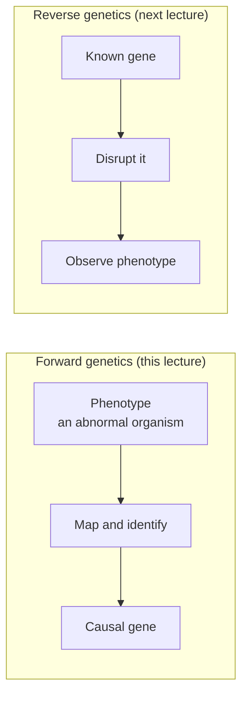
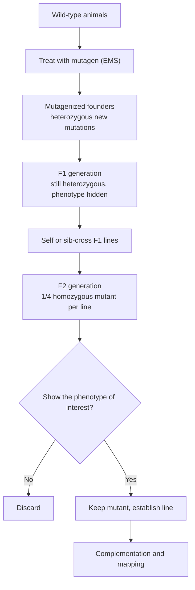
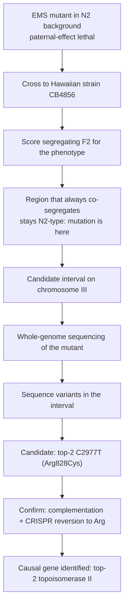

# 순유전학 (Forward Genetics)

**강의:** BME333 / BIO333 유전학 (UNIST, 2026 가을) · 14강 · ~60분
**강의계획서:** [← 강의계획서](../../lectures/2026.BME333-BIO333-Syllabus.md) — 9주차, 2026-10-28 (수)
**언어:** [English](../../en/lectures/lec14_Forward-Genetics.md) · 한국어

## 학습 목표
이 강의를 마치면 학생은 다음을 할 수 있어야 한다:
- 순유전학(forward genetics, "표현형 → 유전자")을 정의하고 역유전학(reverse genetics)과 대비할 수 있다.
- 돌연변이 유발 스크린을 설계할 수 있다: 돌연변이원 선택, 세대, 표현형 채점.
- 상보성(complementation)과 돌연변이체를 유전자로 묶는 방법을 설명할 수 있다.
- 고전적 연관 분석부터 전장 유전체 시퀀싱까지, 돌연변이가 어떻게 지도화되고 동정되는지 기술할 수 있다.
- 생물학적 경로를 해부하는 데 있어 모델 생물과 조절자/억제자(modifier/suppressor) 스크린의 역할을 인식할 수 있다.

## 강의

### 1. 순유전학이란 무엇인가? (~7분)

**순유전학(forward genetics)**은 **표현형(phenotype)**에서 출발하여 그것을 책임지는 **유전자(gene)**로 거슬러 올라간다: *표현형 → 유전자*. 비정상적으로 행동하는 생물 — 몸마디 수가 잘못된 파리, 너무 작게 분열하는 효모 세포, 정자가 배아를 죽이는 선충 — 을 찾거나 유도한 뒤, "어떤 유전자가 망가지면 이것이 생기는가?"를 묻는다. 이것은 알려진 유전자에서 출발하여 그것을 교란하면 무슨 일이 생기는지 묻는(*유전자 → 표현형*) **역유전학(reverse genetics)**(다음 강의)의 정반대다.

**그림 — 유전학적 분석의 두 방향.**



순유전학의 큰 미덕은 **편향이 없고(unbiased)** **가정에서 자유롭다(assumption-free)**는 것이다: 어떤 유전자가 중요한지 미리 알 필요가 없다. Hobert(2010)는 고전적 순유전 스크린이 개념적으로 아름답다고 하는데, 바로 그 예측 불가능성이 모험적인 이를 보상하기 때문이다 — 결코 검사해 보리라 짐작조차 못했을 유전자를 건네준다(참조 [en](../../en/review/Hobert2010_Genetics_WholeGenomeSequencing.md) · [ko](../../ko/review/Hobert2010_Genetics_WholeGenomeSequencing.md)). 그의 예시는 이정표적이다: 몸의 기본 설계를 지정하는 유전자를 드러낸 Ed Lewis의 호메오틱 돌연변이체, 그리고 최초의 마이크로RNA(*lin-4*)의 발견 — 둘 다 사전 지식으로는 예측할 수 없었다. Bonini와 Berger(2017)는 **모델 생물(model organism)**(효모, 파리, 선충, 제브라피시)에서 이루어진 이러한 무편향 스크린이 세포 주기 조절, 몸 설계 지정, 예정된 세포 사멸 등 반복적으로 노벨상을 받아왔으며, 모델 생물은 어떤 유전자가 원인인지 실험으로 *증명*할 수 있게 해주기에 유전체 시대에도 여전히 필수불가결하다는 역사적 근거를 제시한다(참조 [en](../../en/review/Bonini2017_Genetics_ModelOrganism.md) · [ko](../../ko/review/Bonini2017_Genetics_ModelOrganism.md)).

Hobert는 학생들이 흔히 건너뛰는 결정적인 두 번째 단계를 강조한다: 표현형만으로는 답이 되지 않는다. 기계적 통찰은 **실제 분자 병변(molecular lesion)** — 구체적인 DNA 변화 — 을 동정할 때에야 비로소 온다. 역사적으로 그 동정이 이 사업 전체의 병목이었다. 2~5절은 고전적 파이프라인을 따라가고, 5절은 시퀀싱이 그 병목을 어떻게 녹여버렸는지 보여준다.

### 2. 돌연변이 유발 (~10분)

자연발생 돌연변이체는 너무 드물어서 효율적으로 스크리닝할 수 없으므로, 순유전학은 **돌연변이 유발(mutagenesis)** — **돌연변이원(mutagen)**으로 돌연변이율을 의도적으로 높이는 것 — 에서 시작한다. Hobert(2010)는 두 가지 넓은 부류와 그 상충 관계를 정리하는데, 이는 이후 모든 설계 선택을 좌우한다.

**화학적 돌연변이원(chemical mutagens)** — 선충/파리/식물의 **EMS**(에틸 메탄술포네이트), 생쥐의 **ENU** — 은 염기를 알킬화하여 대부분 **점 돌연변이(point mutation)**를 일으킨다. 그 장점은 결정적이다: 높은 돌연변이 빈도, **위치 편향 없음**(어떤 유전자도 맞을 수 있음), 그리고 완전한 기능 상실부터 미묘한 변화까지 이르는 풍부한 **대립유전자 유형의 스펙트럼**. 역사적 단점은 병변이 눈에 보이지 않는 단일 염기 변화여서 지루한 지도화로 위치를 찾아야 했다는 점이다.

**물리적 돌연변이원(physical mutagens)** — **X선 / 이온화 방사선** — 은 DNA를 끊어 깔끔한 점 돌연변이보다는 **재배열(rearrangement)**(결실, 전좌, 역위)을 일으키는 경향이 있다.

**삽입성 / 생물학적 돌연변이원(insertional / biological mutagens)** — **트랜스포존(transposon)**, 바이러스, 플라스미드 — 은 유전자에 삽입되어 그것을 교란하며, 알려진 DNA 서열을 **분자 태그("발자국footprint")**로 남긴다. 이는 유전자를 찾기를 시시할 정도로 쉽게 만들어(삽입된 서열을 알고 있으므로) 많은 실험실이 선호한 이유였다 — 그러나 이들은 **위치 편향**(특정 삽입 부위를 선호)을 지녀 어떤 유전자는 결코 맞지 않는다.

화학적 돌연변이원에서 나오는 대립유전자 스펙트럼은 유전학 전반에 반복되므로 명명할 가치가 있다:

| Allele class | Effect on gene activity | Typical dominance |
|--------------|------------------------|-------------------|
| **Amorph (null)** | 완전한 기능 상실 | 대개 열성 |
| **Hypomorph** | 기능 감소 | 대개 열성 |
| **Hypermorph** | 정상 기능 증가 | 흔히 우성 |
| **Neomorph** | 새로운/이소성 기능 | 우성 |
| **Antimorph** | 우성-음성(야생형을 방해) | 우성 |

용량(dosage)을 지배하는 실질적 제약이 있다: 돌연변이원이 많을수록 유전체당 돌연변이는 늘지만 생존율은 낮아지므로, 스크린은 용량을 절충점 — 대략 스크리닝된 개체당 관심 유전자에 하나의 돌연변이가 생기되 모두를 죽이지는 않는 수준 — 으로 맞춘다. 돌연변이원 선택은 전략적이다: EMS의 점 돌연변이는 단백질 기능을 해부하고 **대립유전자 계열(allelic series)**을 구축하는 데 이상적이며, 트랜스포존은 넓이를 손해 보는 대신 손쉬운 클로닝을 얻는다.

### 3. 스크린 설계 (~10분)

**유전자 스크린(genetic screen)**은 돌연변이가 유발된 집단에서 관심 표현형을 지닌 개체를 체계적으로 탐색한다. 세 가지 설계 결정이 이를 규정한다.

**채점 가능한 표현형.** 볼 수 있는 것만 찾을 수 있다. 표현형은 수천 개체에 걸쳐 신뢰성 있고 효율적으로 채점 가능해야 한다 — 배지 위 콜로니 크기, 해부 현미경으로 본 눈 형태, 특정 온도에서의 생존, 형광 판독값.

**세대: 우성 대 열성.** **우성(dominant)** 돌연변이는 **F1**(돌연변이 유발 세대의 자손)에서 나타난다 — 빠르지만, 대부분의 기능 상실 대립유전자는 열성이다. **열성(recessive)** 돌연변이를 회수하려면 **F2**까지 교배해야 하는데, 여기서 이형접합 보유자의 자가교배 또는 형제교배가 돌연변이를 동형접합으로 만들어 표현형을 드러낸다. 이 F1/F2 논리가 고전적 스크린의 골격이다.

**그림 — 고전적 F2 열성 돌연변이 유발 스크린(필수 작업 흐름).**



**포화(Saturation).** 목표는 흔히 **돌연변이 포화(mutational saturation)** — 그 표현형을 낼 수 있는 *모든* 유전자를, 대개 각 유전자가 여러 독립적 대립유전자로 대표될 만큼 충분히 맞히는 것 — 이다. 새 대립유전자가 새 유전자가 아니라 이미 가진 유전자에 계속 떨어지면, 스크린이 포화되었고 전체 세트를 찾았다고 주장할 수 있다. Hobert(2010)는 전장 유전체 시퀀싱이 이 거의 완전한 포화라는 "성배"를 실질적으로 도달 가능한 범위로 끌어온다고 언급한다.

**필수 유전자에는 요령이 필요하다.** 어떤 유전자가 필수적이면, 그 기능 상실 돌연변이체는 죽어서 증식하거나 채점할 수 없다. 해결책은 **조건부 대립유전자(conditional allele)**, 가장 흔히는 **온도 민감성(temperature-sensitive, ts)**이다: 돌연변이 단백질이 **허용(permissive)** 온도에서는 작동하여(균주가 생존) **제한(restrictive)** 온도에서는 실패하므로(결함을 필요할 때 유발·연구 가능). 이 요령은 아래의 실제 예시에 두루 나타난다 — *wee*와 *top-2* 연구는 모두 필수 세포분열 유전자의 ts 대립유전자에 달려 있다.

### 4. 상보성과 대립유전자 계열 (~8분)

스크린은 많은 돌연변이체를 낳는다 — 그러나 그것들은 몇 개의 *유전자*를 나타내는가? 같은 표현형을 지닌 두 돌연변이체는 같은 유전자에서 망가졌을 수도, 서로 다른 두 유전자에서 망가졌을 수도 있다. **상보성 검정(complementation test)**이 이에 답한다: 두 열성 돌연변이체를 교배하여 (각 돌연변이의 한 사본씩을 지닌) F1을 본다.

- F1이 **야생형(wild-type)**이면 두 돌연변이는 **상보(complement)**한다 — 각 부모가 상대에게 없는 유전자의 정상 사본을 공급하므로, 둘은 **서로 다른 유전자**에 있다.
- F1이 **돌연변이체(mutant)**이면 두 돌연변이는 **상보에 실패(fail to complement)**한다 — 어느 쪽도 작동하는 사본을 공급하지 못하므로, 둘은 **같은 유전자**(같은 **상보군complementation group**)에 있다.

**그림 — 상보성 검정 읽기.**

```
                cross mutant a  x  mutant b, examine F1
   F1 wild-type  -->  mutations in DIFFERENT genes   (a fixes b, b fixes a)
   F1 mutant     -->  mutations in the SAME gene      (neither supplies function)
```

모든 돌연변이체를 상보군으로 분류하면 유전자의 개수를 알 수 있고, 군의 크기는 포화 정도를 시사한다. 분열효모(fission yeast)의 고전적 *wee* 스크린이 깔끔한 예시다(참조 [en](../../en/article/Nurse1980_Genetics_Wee+Spombe.md) · [ko](../../ko/article/Nurse1980_Genetics_Wee+Spombe.md); [en](../../en/review/Murray2016_Genetics_Nurse+Thuriaux+Wee+CellCycle.md) · [ko](../../ko/review/Murray2016_Genetics_Nurse+Thuriaux+Wee+CellCycle.md)). Paul Nurse와 Pierre Thuriaux는 **52개의 *wee* 돌연변이체** — 정상의 대략 *절반* 크기에서 분열하는 세포, "wee"는 스코틀랜드어로 작다는 뜻 — 를 분리했다. 유전자 지도화 결과 **52개 중 51개가 단일 유전자 *wee1*에 지도화**되었고, 단 **하나의 예외적 돌연변이체(*cdc2-1w*)**만이 다른 유전자 *cdc2*에 있었다.

그 한 예외가 모든 통찰을 담고 있었으며, 이는 **대립유전자 계열(allelic series)**(한 유전자의 여러 대립유전자)의 가치를 보여준다. 이전에 알려진 *cdc2* 대립유전자는 유사분열을 *차단*하는(세포분열주기 "cdc" 정지) 온도 민감성 **기능 상실(loss-of-function)** 돌연변이였다. *같은 유전자*의 새 *cdc2-1w* 대립유전자는 **반대로** 작동했다 — *조기의* 작은 크기 분열(*wee* 표현형)을 일으켰다. 한 유전자에서 나온 두 반대 표현형은 **Cdc2가 유사분열의 양성 활성인자**라고 보면 가장 간단히 설명된다: 완전한 상실은 분열을 막고, 활성이 변한 대립유전자는 유사분열을 너무 일찍 점화한다. 유전자 용량 실험이 논리를 완성했다: ***wee1* 용량을 절반으로** 줄이면 분열 크기가 작아졌고(따라서 Wee1은 **용량 민감성 억제자**), 반면 ***cdc2* 용량을 절반으로** 줄여도 거의 영향이 없었다(따라서 시기를 정하는 것은 Cdc2의 양이 아니라 활성의 특정한 *측면* — 나중에 Wee1에 의한 억제성 인산화로 밝혀졌다). 이 순유전 스크린이 인간까지 보존된 길항적 Wee1–Cdc2(CDK1) 회로를 규정했으며, 이 업적으로 Nurse는 2001년 노벨상을 공동 수상했다.

### 5. 돌연변이체에서 유전자까지: 지도화 (~12분)

돌연변이체를 가지고 있고 그것이 어떤 유전자를 규정한다는 것도 안다 — 그러나 *어느* 유전자이며 *어떤* 염기 변화인가? 이것이 **지도화(mapping)**로, 역사적으로 가장 느린 단계였다. 고전적 경로는 **재조합(연관) 지도화(recombination/linkage mapping)**와 **위치 클로닝(positional cloning)**이다: 돌연변이체를 알려진 여러 표지(marker)를 지닌 균주와 교배하여, 돌연변이가 각 표지와 얼마나 자주 함께 유전되는지 측정한다. 표지가 돌연변이에 **가까울수록** 재조합이 **적게** 일어나므로, 공동 유전 빈도가 유전적 거리를 보고한다. 이로써 돌연변이를 어떤 구간으로 좁힌 뒤 그것을 클로닝하고 시퀀싱하는데 — Hobert가 생생하게 "유전자 지도화의 황무지(wastelands of genetic mapping)"라 부르는 과정이다.

전장 유전체 시퀀싱이 이를 붕괴시켰다. Hobert(2010)는 **WGS가 화학적 돌연변이원의 단점 없이 그 장점을 활용하게 해준다**고 주장한다: EMS 점 돌연변이를 애써 찾아내는 대신, 돌연변이체와 참조 사이의 **모든 서열 차이를 그냥 읽어내면 된다**(참조 [en](../../en/review/Hobert2010_Genetics_WholeGenomeSequencing.md) · [ko](../../ko/review/Hobert2010_Genetics_WholeGenomeSequencing.md)). 그의 실험실은 이 방식으로 10개 이상의 *C. elegans* 신경발생 돌연변이체의 분자적 근거를 동정했다; 선충 유전체를 10×로 시퀀싱하는 데 당시 $2,000 미만, ~5일이 걸렸다. 남은 문제 — *원인이 되는(causal)* 변이를 무해한 배경 변이로부터 구별하는 것 — 은 WGS를 대략적 지도화와 결합하고 후보를 검증(형질전환 구제transformation rescue, RNAi 표현형 모방phenocopy, 또는 가장 강력하게는 같은 좌위의 여러 독립적 대립유전자를 재시퀀싱)함으로써 해결된다.

*top-2* 연구(Jaramillo-Lambert 등 2016)는 두 접근을 융합한 교과서적 실제 예시다(참조 [en](../../en/article/Jaramillo-Lambert2016_Genetics_top2.md) · [ko](../../ko/article/Jaramillo-Lambert2016_Genetics_top2.md); 입문서 [en](../../en/review/Jaramillo-Lambert2016_Boeteng2018_GeneticsPrimer_top2.md) · [ko](../../ko/review/Jaramillo-Lambert2016_Boeteng2018_GeneticsPrimer_top2.md)). 이들은 **부계 효과 배아 치사(paternal-effect embryonic lethal)** 돌연변이체를 가지고 있었다 — 돌연변이 *수컷*이 정자를 기여하면 배아가 죽지만 야생형 정자와는 생존하므로, 결함이 정자에 있다. 유전자를 찾기 위해 이들은 **하와이 SNP 지도화 + WGS**를 사용했다: 하와이 균주 **CB4856**은 표준 **N2 Bristol** 참조와 유전체 전반의 수천 개 SNP에서 다르므로, 이와 교배하여 어떤 SNP 영역이 표현형과 항상 함께 분리(co-segregate)하는지 추적함으로써 돌연변이를 3번 염색체의 한 영역으로 좁혔다.

**그림 — 하와이 SNP 지도화 + WGS: 돌연변이체에서 원인 염기까지 (top-2).**



WGS는 ***top-2***(위상이성질화효소 II, topoisomerase II)에서 **Arg828Cys** 미스센스를 일으키는 **C2977T** 변화를 정확히 짚어냈다. 확증은 엄격했다: 상보성 검정에 더해 아르기닌 코돈을 복원하여 표현형을 구제한 **정밀 CRISPR-Cas9 되돌림(reversion)**. 생물학이 뒤따랐다 — 제한 온도에서 953개의 돌연변이 정자세포 모두가 야생형의 정상 염색질과 달리 **무핵(anucleate)**(염색질이 전혀 없음)이었으며, 이는 TOP-2가 감수분열 염색체 분리에 필수적임을 보여준다. 이것이 처음부터 끝까지의 순유전학이다: 표현형 → 스크린 → 지도화 → 시퀀싱 → 확증 → 기전.

### 6. 조절자와 억제자 스크린 (~8분)

표준 스크린은 그 상실이 *단독으로* 표현형을 낳는 유전자를 찾는다. 그러나 생물학적으로 중요한 많은 유전자는 그 상실만으로는 아무 일도 없거나(중복성redundancy) 치사이기 때문에 놓친다. **조절자 스크린(modifier screen)**은 **감작 배경(sensitized background)** — 이미 결함을 지닌 생물 — 에서 출발하여, 그것을 **더 나쁘게(증강자enhancer)** 또는 **더 낫게(억제자suppressor)** 만드는 *두 번째* 돌연변이를 스크리닝함으로써 이를 극복한다. 두 돌연변이가 같은 과정에 작용하므로, 조절자는 첫 유전자의 기능적 동반자인 경향이 있어 하나의 경로 전체를 밝혀준다.

**그림 — 감작 배경에서의 억제자·증강자 논리.**

```
                sensitized starting phenotype (partial defect)
                                |
        add a second mutation --+--------------------------+
                                |                          |
                     SUPPRESSOR: phenotype improves   ENHANCER: phenotype worsens
                     (partner acts against, or          (partner acts with, or
                      bypasses, the first gene)           in parallel to, first gene)
```

Kankel 등(2020)은 인간 질병에 대해 이 방법의 힘을 유전체 규모로 보여준다(참조 [en](../../en/article/Kankel2020_Genetics_Drosophila-ALS-modifier.md) · [ko](../../ko/article/Kankel2020_Genetics_Drosophila-ALS-modifier.md)). **ALS**(근위축성 측삭경화증)의 조절자를 찾기 위해, 이들은 **GAL4-UAS 시스템**으로 인간 ALS 단백질(돌연변이 **FUS** 또는 **TDP-43**)을 눈에 특이적으로 발현시켜 감작된 *Drosophila*를 만들어, 눈이 퇴행하는 표현형을 냈다. **15,500개의 트랜스포존 삽입**을 스크리닝하며 각각이 그 퇴행을 억제하는지 증강하는지 채점하여, **637개의 FUS 조절자와 553개의 TDP-43 조절자**를 회수했고, 그중 **432개가 두 독립 모델에서 공유**되었다. 조절자가 *두* 모델 모두에서 작동하도록 요구하는 것은 영리한 필터다 — 모델 특이적 잡음보다 공유된 질병 경로를 선택한다. 수렴적 분석은 **인지질가수분해효소 D(phospholipase D, PLD) 경로**를 지목했다; *dPld*를 녹다운하면 FUS, TDP-43, *그리고* C9orf72 모델 모두에서 퇴행이 억제되었고, PLD 억제는 SOD1 돌연변이 생쥐에서 완만한 운동 개선을 주었다 — 순수한 순유전학으로 도달한 치료 표적 후보다.

억제자 논리는 또한 연구하기 어려운 유전자를 둘러싼 유전자 네트워크를 구축하여 다음 강의를 예고한다: Garen(1992)은 *Drosophila* 발생을 해부하는 데 치사 돌연변이 스크린이 고전적으로 사용된 사례를 서술하며, 성충판(imaginal-disc) 운명을 ~1,000개의 접합자성(zygotic) 유전자가 조절한다고 추정하고, 최초기 위치 "청사진(blueprint)"을 탐침하기 위해 모계 효과(maternal-effect) 스크린을 사용한다(참조 [en](../../en/review/Garen1992_Genetics_Homunculus.md) · [ko](../../ko/review/Garen1992_Genetics_Homunculus.md)).

### 7. 강점, 한계와 마무리 (~5분)

순유전학의 결정적 강점은 **편향이 없다**는 것이다: 아무도 지명하지 않았을 유전자를 포함하여, 어떤 과정에 실제로 중요한 유전자를 발견한다 — 이것이 노벨상을 낳는 놀라움(Bonini & Berger 2017)과, Kankel 연구에서는 약물 표적을 계속 산출하는 이유다. 그 대가도 마찬가지로 실재한다. **중복성(redundancy)**: 두 유전자가 서로를 보완하면, 하나를 잃어도 표현형이 나타나지 않아 스크린이 놓친다(이는 바로 조절자 및 역유전 접근이 회수하는 것이다). **치사성(lethality)**: 필수 유전자는 **조건부(ts) 대립유전자**를 만들지 않는 한 보이지 않는다. **지도화 노력(mapping effort)**: 역사적으로 속도 제한 단계였으나 WGS가 대부분 제거했다. 그리고 스크린은 그 표현형 검정이 채점할 수 있는 것만 본다.

이 강좌를 관통하는 줄기는, 순유전학이 사전 가정 없이 *"어떤 유전자가 이 현상을 일으키는가?"*에 답하는 반면, **역유전학**(15강)은 상보적으로 *"이 특정 유전자는 무엇을 하는가?"*에 답한다는 것이다 — 그리고 현대 생물학은 둘을 엮는다: 순 스크린이 유전자를 이름 짓고, 그다음 역유전적 교란이 각각의 역할을 정밀하게 검증한다.

## 핵심 정리
- **순유전학**은 *표현형 → 유전자*로 간다: 형질을 일으키는 유전자에 대한 무편향·무가정 탐색; **역유전학**은 반대 방향(*유전자 → 표현형*)으로 간다.
- **돌연변이원**은 명확하게 상충한다: **EMS/ENU**는 무편향 점 돌연변이와 풍부한 대립유전자 스펙트럼(amorph/hypomorph/hypermorph/neomorph/antimorph)을 주지만 지도화가 필요하다; **X선**은 재배열을 일으킨다; **트랜스포존**은 유전자를 스스로 태그하지만 위치 편향이 있다.
- **스크린**은 채점 가능한 표현형, 올바른 세대(우성은 **F1**, 열성은 **F2**), 그리고 **포화**를 목표로 한다; **필수 유전자**는 **조건부(온도 민감성)** 대립유전자를 요구한다.
- **상보성 검정**은 유전자 수를 센다: F1 야생형 = 서로 다른 유전자(상보); F1 돌연변이 = 같은 유전자 — *wee*에서처럼(51/52 → *wee1*, 예외 *cdc2-1w*는 Cdc2가 유사분열 활성인자임을 드러냄).
- 지도화는 **재조합/위치 클로닝**에서 **WGS**로 나아갔다; WGS를 **하와이 SNP 지도화**와 확증(상보성 + CRISPR 되돌림)과 결합하여 *top-2*(C2977T, Arg828Cys)를 감수분열 염색체 분리에 필수적인 것으로 동정했다.
- **감작 배경**에서의 **조절자/억제자 스크린**은 경로 동반자와 질병 조절자를 찾는다 — *Drosophila* ALS 스크린(15,500개 삽입, FUS + TDP-43)은 치료 표적으로 **PLD 경로**에 수렴했다.
- 순유전학은 독보적으로 **무편향**이지만 **중복성**과 **치사성**에 제약된다; 역유전학과 자연스럽게 짝을 이룬다.

## 교재 참고
- **Genetics: From Genes to Genomes (8e)** — Ch. 8 Using Mutations to Study Genes. → [textbook ref](../../lectures/ref.Genetics-FromGenesToGenomes.md)

## 이 저장소의 노트
수업에서 소개할 리뷰·논문(각각 en/ko 이중언어 쌍이 있음):
- `Bonini2017_Genetics_ModelOrganism` — 왜 모델 생물이 순 스크린을 강력하게 만드는가; 무대를 마련. · [en](../../en/review/Bonini2017_Genetics_ModelOrganism.md) · [ko](../../ko/review/Bonini2017_Genetics_ModelOrganism.md)
- `Hobert2010_Genetics_WholeGenomeSequencing` — 돌연변이체에서 원인 유전자로 가는 현대적 경로로서의 WGS; 지도화 부분. · [en](../../en/review/Hobert2010_Genetics_WholeGenomeSequencing.md) · [ko](../../ko/review/Hobert2010_Genetics_WholeGenomeSequencing.md)
- `Nurse1980_Genetics_Wee+Spombe` — 분열효모의 고전적 *wee* 스크린; 세포 주기 조절을 해부하는 순유전학. · [en](../../en/article/Nurse1980_Genetics_Wee+Spombe.md) · [ko](../../ko/article/Nurse1980_Genetics_Wee+Spombe.md)
- `Murray2016_Genetics_Nurse+Thuriaux+Wee+CellCycle` — *wee1/cdc* 연구에 대한 회고; Nurse 1980 논문의 맥락. · [en](../../en/review/Murray2016_Genetics_Nurse+Thuriaux+Wee+CellCycle.md) · [ko](../../ko/review/Murray2016_Genetics_Nurse+Thuriaux+Wee+CellCycle.md)
- `Jaramillo-Lambert2016_Genetics_top2` — *C. elegans*의 *top2* 대립유전자에 대한 순유전적 동정; 실제 예시. · [en](../../en/article/Jaramillo-Lambert2016_Genetics_top2.md) · [ko](../../ko/article/Jaramillo-Lambert2016_Genetics_top2.md)
- `Jaramillo-Lambert2016_Boeteng2018_GeneticsPrimer_top2` — *top2* 연구를 위한 교육용 입문서; 스크린 논리를 풀어내는 데 사용. · [en](../../en/review/Jaramillo-Lambert2016_Boeteng2018_GeneticsPrimer_top2.md) · [ko](../../ko/review/Jaramillo-Lambert2016_Boeteng2018_GeneticsPrimer_top2.md)
- `Kankel2020_Genetics_Drosophila-ALS-modifier` — ALS에 대한 *Drosophila* 조절자 스크린; 억제자/증강자 스크린을 선보임. · [en](../../en/article/Kankel2020_Genetics_Drosophila-ALS-modifier.md) · [ko](../../ko/article/Kankel2020_Genetics_Drosophila-ALS-modifier.md)
- `Garen1992_Genetics_Homunculus` — 발생의 유전적 해부에 대한 역사적 관점; 프레이밍/마무리. · [en](../../en/review/Garen1992_Genetics_Homunculus.md) · [ko](../../ko/review/Garen1992_Genetics_Homunculus.md)

## 토론 문제
1. 생존 가능한 과정에 필요한 유전자에서 열성 기능 상실 돌연변이를 찾으려 한다. 표현형이 왜 F1이 아니라 F2에서만 나타나는지, 그리고 스크린이 포화에 도달했는지 어떻게 판단할지 단계별로 설명하라.
2. *wee* 스크린에서 52개 중 51개가 *wee1*에 지도화되었지만 하나(*cdc2-1w*)는 *cdc2*에 지도화되었고 알려진 *cdc2* 대립유전자와 *반대*의 우성/표현형 거동을 보였다. 대립유전자 계열과 유전자 용량 결과를 사용하여, 이 데이터가 Cdc2가 활성인자이고 Wee1이 용량 민감성 억제자임을 어떻게 보이는지 설명하라.
3. 고전적 재조합 지도화를 *top-2*에 사용된 하와이-SNP + WGS 전략과 비교하라. 왜 지도화가 역사적으로 순유전학의 병목이었으며, WGS는 구체적으로 무엇을 바꾸었는가? 시퀀싱이 후보를 찾은 뒤에도 왜 상보성과 CRISPR 되돌림이 여전히 필요했는가?
4. 표준 단일 유전자 스크린은 그 상실이 중복성으로 완충되는 유전자를 놓칠 것이다. *Drosophila* ALS 조절자 스크린이 어떻게 그런 유전자를 회수했는지, 그리고 조절자가 FUS와 TDP-43 모델 *양쪽* 모두에서 작동하도록 요구하는 것이 왜 PLD 경로가 질병과 관련 있다는 결론을 강화하는지 설명하라.
5. 순유전학은 "무편향"이지만 중복적·필수 유전자에는 눈멀어 있고, 역유전학은 표적화되어 있지만 어떤 유전자를 검사할지 안다고 가정한다. 여러 유전자가 중복적으로 작용하는 경로를 해부하기 위해 둘을 결합하는 두 단계 전략을 설계하라.
