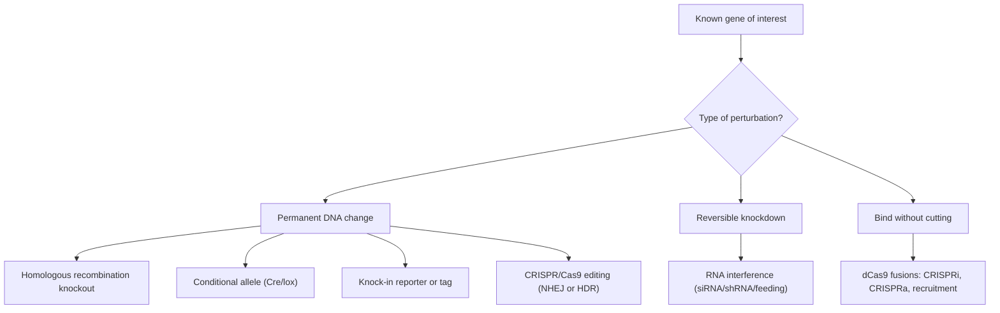
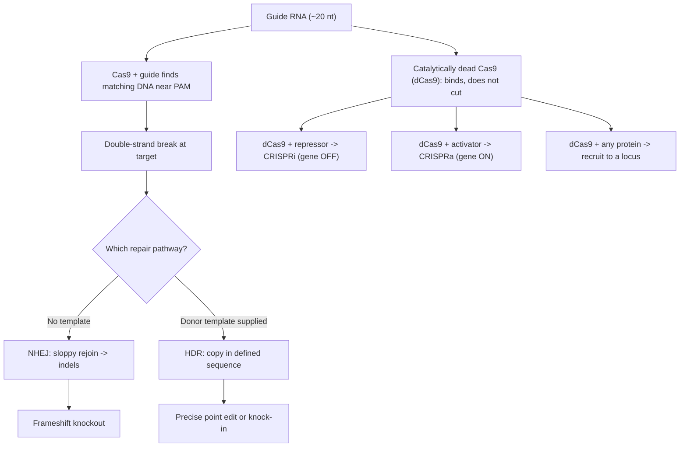
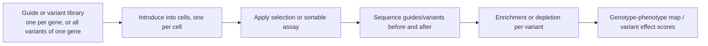

# 역유전학 (Reverse Genetics)

**강의:** BME333 / BIO333 유전학 (UNIST, 2026 가을) · 15강 · ~60분
**강의계획서:** [← 강의계획서](../../lectures/2026.BME333-BIO333-Syllabus.md) — 10주차, 2026-11-02 (월)
**언어:** [English](../../en/lectures/lec15_Reverse-Genetics.md) · 한국어

## 학습 목표
이 강의를 마치면 학생은 다음을 할 수 있어야 한다:
- 역유전학(reverse genetics, "유전자 → 표현형")을 정의하고 순유전학(forward genetics)과 대비할 수 있다.
- 주요 교란 도구들을 비교할 수 있다: 녹아웃(knockout), 녹인(knock-in), RNAi, CRISPR/Cas.
- CRISPR/Cas9와 dCas9 융합체가 어떻게 표적화된 돌연변이, 활성화, 억제를 가능하게 하는지 설명할 수 있다.
- 역유전학을 전장 유전체 규모로 확장하는 대량 병렬/다중화(multiplexed) 접근법을 기술할 수 있다.
- 중복성(redundancy)과 표적 이탈(off-target) 유의점을 포함하여, 표적화된 교란에서 나온 표현형을 해석할 수 있다.

## 강의

### 1. 역유전학이란 무엇인가? (~7분)

**역유전학(reverse genetics)**은 **알려진 유전자 또는 서열(known gene or sequence)**에서 출발하여 그것의 상실이나 변형이 생물에 어떤 영향을 미치는지 묻는다: *유전자 → 표현형*. 이는 표현형에서 출발하여 유전자를 사냥하는 순유전학(14강)의 거울상이다. 둘은 하나의 논리의 상보적인 두 절반이다. 순유전학은 무편향이지만 중복적·필수 유전자에 눈멀어 있고, 역유전학은 정밀하고 가설 주도적이지만 어떤 유전자를 심문할지 이미 알아야 한다. 유전체 시대에 역유전학은 지배적인 일상 양식이 되었다: 시퀀싱은 기능이 알려지지 않은 수천 개의 유전자를 건네주고, 자연스러운 질문 — Bonini와 Berger(2017)는 이를 모델 생물의 핵심 용도로 규정한다 — 은 각각을 교란하고 관찰하는 것이다(순유전학 동반 노트를 참조; 동일한 모델 생물 논리가 여기에도 적용된다). De Stasio(2012) 입문서는 *C. elegans*에 대해 그 정의를 명료하게 진술한다: 역유전학은 선택한 유전자를 녹다운하는 세균을 선충에게 먹이는 것으로 예시되는, **유전자-대-표현형(gene-to-phenotype)** 전략이다(참조 [en](../../en/review/Polly2012_Stacio2012_GeneticsPrimer_LIN-35.md) · [ko](../../ko/review/Polly2012_Stacio2012_GeneticsPrimer_LIN-35.md)).

이 분야는 실은 영구적 DNA 변화부터 가역적 녹다운까지 등급이 매겨진 **교란의 도구상자(toolkit of perturbations)**다. 강의의 나머지는 이 도구상자를 도구 하나씩 쌓아 올린다.

**그림 — 역유전학 교란 도구상자(필수 개관).**



### 2. 표적화된 돌연변이 만들기 (~10분)

가장 오래된 역유전 도구는 **상동 재조합(homologous recombination, HR)에 의한 유전자 녹아웃**이다. 표적 유전자가 (흔히 선택 표지selectable marker로) 중단되어 있으되 그 유전자의 유전체상 이웃과 동일한 서열로 둘러싸인 DNA 구조체를 만든다. 세포 자신의 HR 기구가 그 구조체를 native 좌위와 맞바꾸어, 작동하는 유전자를 무력화된 것으로 대체한다. 이것이 고전적 효모 및 생쥐 녹아웃이 만들어진 방식이며, Bonini와 Berger(2017)는 효모에서의 전장 유전체 **녹아웃 라이브러리(knockout library)**(모든 유전자를 한 균주에 하나씩 삭제)가 기초적 자원이 되었다고 언급한다.

몸 전체의 단순 녹아웃에는 두 가지 문제가 있다: 유전자가 필수적이면 동물은 연구하기도 전에 죽고, 그 유전자가 *어디서* 또는 *언제* 작용하는지 알 수 없다. **조건부 대립유전자(conditional allele)**가 둘 다 해결한다. 가장 널리 쓰이는 시스템은 **Cre/lox**다: 유전자를 두 개의 짧은 **loxP** 부위로 둘러싸("flox") 놓은 뒤 **Cre 재조합효소(Cre recombinase)**를 공급하면, 그것이 둘 사이에 있는 것을 잘라낸다. 선택한 조직에서만, 또는 약물이 주어진 후에만 Cre를 발현시킴으로써, 원하는 **공간(space)**과 **시간(time)**에 유전자를 삭제한다 — **조직 특이적(tissue-specific)** 또는 **유도성(inducible)** 녹아웃.

**그림 — Cre/lox 조건부 삭제.**

```
before Cre:   ---[loxP]===GENE===[loxP]---     gene intact (animal develops normally)
                              |  add Cre (in chosen tissue / at chosen time)
                              v
after Cre:    ---[loxP]---                      gene excised only there / then
```

같은 표적화 논리가 서열을 제거하는 대신 *추가*하는 방향으로도 작동한다: **녹인(knock-in)**은 정해진 요소를 정밀한 좌위에 삽입한다 — 가장 유용하게는 **리포터(reporter)**(예: 유전자에 융합된 GFP로, 단백질이 어디서 언제 만들어지는지 드러냄)나 생화학용 에피토프 **태그(tag)**다. 녹인은 내인성 유전자를 그 자체의 발현과 국재를 보여주는 판독값으로 바꾸며, 트랜스진(transgene)의 과발현이 낳는 인공물이 없다.

### 3. RNA 간섭 (~8분)

**RNA 간섭(RNA interference, RNAi)**은 RNA 수준에서 유전자를 녹아웃(out)하기보다 녹다운(down)한다. 표적 서열과 일치하는 이중가닥 RNA가 짧은 가이드로 가공되어, 일치하는 mRNA를 파괴하도록 세포 기구를 유도하므로 단백질이 덜 만들어진다. 그 매력은 속도와 규모다: 유전체를 조작할 필요가 없고, 올바른 서열만 공급하면 사실상 어떤 유전자든 표적으로 삼을 수 있다. *C. elegans*에서는 이것이 놀랄 만큼 쉽다 — **먹이 RNAi(feeding RNAi)**, 즉 선충이 dsRNA를 발현하는 세균을 먹게 하는 방식으로, 한 실험실이 수천 개의 유전자를 병렬로 녹다운할 수 있다(De Stasio 2012는 이를 선충 시스템의 결정적 강점으로 강조한다; 참조 [en](../../en/review/Polly2012_Stacio2012_GeneticsPrimer_LIN-35.md) · [ko](../../ko/review/Polly2012_Stacio2012_GeneticsPrimer_LIN-35.md)). Bonini와 Berger(2017)는 모든 선충 유전자를 아우르는 전장 유전체 RNAi 라이브러리를 언급한다.

그러나 RNAi에는 학생이 진짜 돌연변이와 견주어 따져봐야 할 유의점이 따른다. Hobert(2010)는 — 순유전학 쪽에서 쓰면서 — 그것들을 정확히 열거한다: RNAi는 **부분 녹다운(partial knockdown)**(널null이 아니라 hypomorph)만 주고, **가변적 침투도(variable penetrance)**를 겪으며, 불완전한 서열 일치가 엉뚱한 유전자를 침묵시키는 **표적 이탈 효과(off-target effect)**를 낳는다. 이것이 바로 RNAi 표현형을 반드시 확증해야 하는 이유이며, 깨끗하고 유전 가능한 널 대립유전자를 만드는 CRISPR가 여러 용도에서 RNAi를 대체한 이유다. 그럼에도 RNAi의 가역성과 확장성은 여전히 가치가 있는데, 특히 필수 유전자(널은 치사여도 부분 녹다운은 생존 가능할 수 있음)와 신속한 전장 유전체 스크린에 그렇다.

### 4. CRISPR/Cas 유전체 편집 (~12분)

**CRISPR/Cas9**는 정밀한 유전체 편집을 일상화했다. 이 시스템에는 두 부분이 있다: **Cas9** 핵산분해효소와, ~20 뉴클레오타이드 서열이 표적 DNA에 상보적인 **가이드 RNA(guide RNA, gRNA)**. Cas9는 가이드를 사용해 일치하는 유전체 부위(짧은 **PAM** 모티프 옆)를 찾아 양쪽 DNA 가닥을 잘라, 프로그래밍 가능한 위치에 **이중가닥 절단(double-strand break, DSB)**을 만든다. 다음에 일어나는 일은 세포가 어떤 복구 경로를 쓰느냐에 달려 있으며 — 이 갈림길이 CRISPR가 할 수 있는 일의 핵심이다.

- **비상동 말단 연결(non-homologous end joining, NHEJ)**은 끊긴 말단을 직접, 그러나 엉성하게 다시 잇는데, 흔히 작은 삽입이나 결실(**인델indel**)을 남긴다. 암호화 엑손의 인델은 대개 리딩 프레임을 이동시켜 유전자를 파괴한다 — 따라서 NHEJ는 **녹아웃(knockout)**으로 가는 경로다.
- **상동성 지향 복구(homology-directed repair, HDR)**는 공급된 **공여 주형(donor template)**을 사용해 절단 부위에 정해진 서열을 복사해 넣는다 — 따라서 HDR은 **정밀 편집 또는 녹인(precise edit or knock-in)**으로 가는 경로다: 정확한 점 돌연변이 설치, 돌연변이 교정, 태그 삽입.

**그림 — CRISPR/Cas9 편집과 dCas9 융합체(필수 CRISPR/dCas9 다이어그램).**



두 가지 개선이 DSB 자체를 피함으로써 정밀도를 높인다. **염기 편집기(base editor)**는 촉매 활성이 손상된 Cas9를 뉴클레오타이드 변형 효소에 융합하여, 양쪽 가닥을 자르지 않고 표적에서 한 염기를 다른 염기로 화학적으로 변환한다(예: C→T). **프라임 편집기(prime editor)**는 Cas9를 역전사효소에 융합하고, 표적을 지정하는 동시에 새 서열을 주형으로 삼는 확장된 가이드를 사용해 작고 정해진 편집을 직접 써넣는다. 둘 다 DSB 복구의 무작위 인델과 세포 독성을 줄인다. McVey 입문서(2022)는 CRISPR의 등장을 맥락에 놓는다: Doudna–Charpentier의 2012년 연구가 프로그래밍 가능한 절단을 가능하게 했고, 이후 "가이드 RNA 더하기 단백질"이 보편적 표적화 장치가 되었다(참조 [en](../../en/review/Kuhl2020_Genetics_dCas9+Ctf19+Recombination-McVey2022primer.md) · [ko](../../ko/review/Kuhl2020_Genetics_dCas9+Ctf19+Recombination-McVey2022primer.md)).

### 5. dCas9와 절단을 넘어서 (~8분)

CRISPR를 편집 도구에서 범용 도구상자로 바꾼 통찰은, **표적화(targeting)**(가이드 RNA가 부위를 찾음)와 **절단(cutting)**(핵산분해효소 활성)이 분리 가능하다는 것이다. **촉매 불활성 Cas9(catalytically dead Cas9, dCas9)**는 핵산분해효소 도메인이 무력화되어 있다: 가이드가 지시하는 곳에 여전히 결합하지만 자르지는 않는다. 그것만으로는 불활성이지만 — dCas9에 *어떤* 단백질 도메인이든 융합하면, McVey 입문서의 표현으로 어떤 활성이든 선택한 어떤 좌위에든 전달할 수 있는 프로그래밍 가능한 **"분자 GPS(molecular GPS)"**가 된다(참조 [en](../../en/review/Kuhl2020_Genetics_dCas9+Ctf19+Recombination-McVey2022primer.md) · [ko](../../ko/review/Kuhl2020_Genetics_dCas9+Ctf19+Recombination-McVey2022primer.md)).

정석적 용도는 DNA 서열을 건드리지 않고 전사를 조율한다:

| Tool | dCas9 fused to | Effect on target gene |
|------|----------------|-----------------------|
| **CRISPRi** (interference) | 전사 억제 도메인 | 유전자를 **OFF**로(가역적 녹다운) |
| **CRISPRa** (activation) | 전사 활성 도메인 | 유전자를 **ON**/증가로 |
| **dCas9 recruitment** | 임의의 관심 단백질 | 그 단백질의 활성을 정해진 좌위로 데려옴 |

이 리크루트(recruitment) 개념은 전사를 훨씬 넘어서는데, Kuhl 등(2020)이 우아하게 입증한다(참조 [en](../../en/article/Kuhl2020_Genetics_dCas9+Ctf19+Recombination.md) · [ko](../../ko/article/Kuhl2020_Genetics_dCas9+Ctf19+Recombination.md)). 감수분열 교차(meiotic crossover)는 보통 **동원체 근처에서 억제**되는데, 동원체(kinetochore)에 너무 가까운 교차는 장력 감지(tension-sensing)를 교란하여 염색체 비분리(nondisjunction)를 일으키기 때문이다 — 그러나 *어떤* 동원체 단백질이 이 억제를 강제하는지는 알려지지 않았다. 저자들은 dCas9를 효모 **Ctf19** 동원체 복합체의 개별 소단위에 융합하고 가이드 RNA를 사용해 **각각을 이소성(ectopic)의 비동원체 좌위로 리크루트**한 뒤, 국소 교차 빈도를 측정했다. 오직 **Ctf19**만이 그곳에서 교차를 억제했다; 그 활성은 N말단 30개 잔기에 지도화되었고, 9개의 세린/트레오닌 부위에 대한 **DDK 인산화**를 요구했으며, **Scc2-Scc4 코헤신 로더(cohesin loader)**를 리크루트하여 복구를 비교차(non-crossover) 결과로 유도함으로써 작동했다. 이 강의를 위한 요점은 방법론적이다: 이것은 유전자를 돌연변이시켜서가 아니라 **단백질을 평소 작용하지 않는 곳에 배치**하여 그 결과를 읽어내는 역유전학이다 — dCas9가 연 완전히 새로운 실험적 자유도다.

### 6. 규모 확장: 다중화·대량 병렬 역유전학 (~10분)

CRISPR나 RNAi 시약은 그저 짧은 가이드 서열이므로, 그것들의 **라이브러리(library)** — 유전자당 하나의 가이드, 또는 한 유전자를 타일링하는 수천 개의 가이드 — 를 만들어 **풀드 스크린(pooled screen)**에서 한꺼번에 적용할 수 있다. 각 세포가 하나의 가이드를 받도록 세포를 형질도입한 뒤 선택(생존, 약물 저항성, 분류 가능한 표지)을 가하고, 그런 다음 선택 전후로 가이드를 **시퀀싱**한다: 농축되거나 고갈된 가이드가 그 교란이 도움이 되거나 해가 된 유전자를 가리킨다. 이는 역유전학을 한 번에 유전자 하나에서 단일 실험의 전장 유전체로 확장한다.

De Stasio(2012) 입문서는 구체적인 유전체 규모의 예를 든다(참조 [en](../../en/review/Polly2012_Stacio2012_GeneticsPrimer_LIN-35.md) · [ko](../../ko/review/Polly2012_Stacio2012_GeneticsPrimer_LIN-35.md)). *lin-35*는 인간 **망막모세포종(retinoblastoma, Rb)** 종양억제유전자의 선충 오솔로그(ortholog)다; *lin-35* 단독 상실은 거의 문제가 되지 않지만, *slr-2* 상실과 결합하면 치사적인 초기 유충기(L1) 정지를 일으킨다 — 두 유전자가 함께 맞았을 때만 보이는 **합성 표현형(synthetic phenotype)**이다. Polley와 Fay는 구제 역할을 하는 GFP 표지 트랜스진으로 이중 돌연변이체를 유지한 뒤, **16,757개의 서로 다른 RNAi 세균**(각각 유전자 하나)을 먹여, 정지되었어야 할 이중 돌연변이체를 생존하게 만드는 녹다운을 찾았다. 그런 유전자는 합성 치사 상호작용의 **억제자(suppressor)**다; 억제자들은 리보솜 생합성 유전자, 알려진 synMuv 유전자, 프로히비틴(prohibitin)으로 분류되어 — 단일 유전자 분석으로는 결코 드러낼 수 없는, Rb를 둘러싼 유전자 네트워크를 지도화했다.

가장 미세한 규모에서 **딥 뮤테이셔널 스캐닝(deep mutational scanning, DMS)**은 같은 논리를 단일 유전자의 가능한 모든 변이체에 적용한다. Shendure와 Fields(2016)는 관찰적 인간 유전학이 변이체가 실제로 무엇을 하는지 해석하려면 **교란적 대량 병렬 기능 검정(perturbational massively parallel functional assay)**으로 보완되어야 한다고 주장한다(참조 [en](../../en/review/Shendure2016_Genetics_MassiveParallelGenetics.md) · [ko](../../ko/review/Shendure2016_Genetics_MassiveParallelGenetics.md)). 그들의 5단계 틀: (1) 큰 **대립유전자 계열(allelic series)**을 생성하고, (2) 변이체를 모델 시스템에 도입하고, (3) **다중화 검정(multiplexed assay)**으로 기능적 효과를 측정하고, (4) 효과 크기별로 변이체를 분할하고, (5) 인간 표현형에 보정한다.

**그림 — 대량 병렬 역유전학: 변이체 라이브러리에서 유전자형–표현형 지도까지.**



대표적 응용은 **BRCA1**이다: 관찰만으로는 병원성 여부를 분류할 수 없는 수천 개의 임상 **불확실한 의미의 변이(variant of uncertain significance, VUS)**를, 포화 유전체 편집(saturation genome editing)이 각 변이체의 세포 기능에 대한 효과를 한꺼번에 채점하여 포괄적인 변이체 효과 지도를 만들어냄으로써 — 변이체 해석을 수동적 관찰에서 능동적 실험으로 바꾼다.

### 7. 유의점과 종합 (~5분)

모든 역유전 결과는 반복적으로 등장하는 세 가지 유의점에 비추어 읽어야 한다. **유전적 중복성(genetic redundancy)**: 유사체(paralog)가 표적을 완충하면, 유전자가 기능적이어도 녹아웃해도 *아무* 표현형이 나오지 않는다 — *lin-35* 사례가 전형으로, *slr-2*도 제거되기 전까지 보이지 않았다. **불완전한 침투도/부분 효과(incomplete penetrance / partial effects)**: 특히 RNAi는 등급이 있고 가변적인 녹다운을 주므로, 약하거나 없는 표현형이 아무 일도 안 하는 유전자가 아니라 잔류 단백질을 반영할 수 있다. **표적 이탈 효과(off-target effects)**: RNAi(불완전 일치 침묵)와 CRISPR(가이드가 다른 곳의 유사 서열을 자름) 모두 *엉뚱한* 좌위에서 표현형을 낼 수 있다 — 이것이 엄밀한 연구가 여러 독립적 가이드/대립유전자, 구제 실험, 그리고 *top-2*(14강)에서처럼 정밀 되돌림으로 확증하는 이유다.

이 강좌를 위한 종합은, 순유전학과 역유전학이 한 길의 두 방향이라는 것이다. 순 스크린은 가정 없이 *"어떤 유전자가 이것을 일으키는가?"*에 답하고, 역유전학은 정밀하게 *"이 유전자는 무엇을 하는가?"*에 답한다. 현대 연구는 이들을 사슬로 잇는다: 순 스크린이나 GWAS가 유전자와 변이를 지명하고, 그다음 역유전적 교란 — CRISPR 편집, dCas9 리크루트, 풀드 스크린, 딥 뮤테이셔널 스캐닝 — 이 각각의 기능을 규모 있게 검증한다. 함께, 그것들은 유전체 서열(13강)을 모든 유전자와 모든 변이가 실제로 무엇을 하는지에 대한 기계적 이해로 바꾼다.

## 핵심 정리
- **역유전학**은 *유전자 → 표현형*으로 간다: 알려진 유전자에서 출발해 그것을 교란한다; 무편향 순유전학에 대한 정밀하고 가설 주도적인 상보물이다.
- **도구상자**는 영구적인 것부터 가역적인 것까지 이어진다: **HR 녹아웃**, **Cre/lox** 조건부(조직/시간 특이적) 대립유전자, **녹인** 리포터/태그, **RNAi** 녹다운, **CRISPR/Cas9** 편집.
- **RNAi**는 빠르고 확장 가능하지만(선충 **먹이 RNAi**, 전장 유전체 라이브러리) **가변적 침투도와 표적 이탈** 효과를 지닌 부분 녹다운일 뿐이다.
- **CRISPR/Cas9**는 프로그래밍 가능한 DSB를 자른다; **NHEJ** → 프레임이동 **녹아웃**, **HDR + 공여체** → 정밀 **편집/녹인**; **염기·프라임 편집기**는 DSB 없이 정해진 변화를 써넣는다.
- **dCas9**는 표적화와 절단을 분리한다 — 프로그래밍 가능한 "분자 GPS": **CRISPRi**(off), **CRISPRa**(on), 또는 좌위로 **임의의 단백질 리크루트**, Kuhl 등의 dCas9-**Ctf19** 동원체 주변 교차 억제 지도화에서처럼.
- **풀드 스크린**과 **딥 뮤테이셔널 스캐닝**은 역유전학을 전장 유전체 규모로 확장한다; *lin-35;slr-2* RNAi 억제자 스크린(16,757 클론)은 **합성** 네트워크를 드러냈고, Shendure & Fields의 5단계 대량 병렬 틀은 **BRCA1** VUS를 분류한다.
- 항상 **중복성, 불완전 침투도, 표적 이탈 효과**를 따져라; 여러 대립유전자/가이드와 구제로 확증하라. 순 + 역유전학이 함께 유전체를 기전으로 바꾼다.

## 교재 참고
- **Genetics: From Genes to Genomes (8e)** — Ch. 21 Manipulating the Genomes of Eukaryotes. → [textbook ref](../../lectures/ref.Genetics-FromGenesToGenomes.md)

## 이 저장소의 노트
수업에서 소개할 리뷰·논문(각각 en/ko 이중언어 쌍이 있음):
- `Kuhl2020_Genetics_dCas9+Ctf19+Recombination` — 좌위 특이적 과정을 조종하기 위한 dCas9 융합(Ctf19); 편집을 넘어선 dCas9의 실제 예시. · [en](../../en/article/Kuhl2020_Genetics_dCas9+Ctf19+Recombination.md) · [ko](../../ko/article/Kuhl2020_Genetics_dCas9+Ctf19+Recombination.md)
- `Kuhl2020_Genetics_dCas9+Ctf19+Recombination-McVey2022primer` — dCas9/Ctf19 연구를 위한 교육용 입문서; 설계를 풀어내는 데 사용. · [en](../../en/review/Kuhl2020_Genetics_dCas9+Ctf19+Recombination-McVey2022primer.md) · [ko](../../ko/review/Kuhl2020_Genetics_dCas9+Ctf19+Recombination-McVey2022primer.md)
- `Polly2012_Stacio2012_GeneticsPrimer_LIN-35` — *C. elegans*에서 정의된 유전자(*lin-35*)의 표적화된 분석을 예시하는 입문서. · [en](../../en/review/Polly2012_Stacio2012_GeneticsPrimer_LIN-35.md) · [ko](../../ko/review/Polly2012_Stacio2012_GeneticsPrimer_LIN-35.md)
- `Shendure2016_Genetics_MassiveParallelGenetics` — 역유전학을 전장 유전체 규모로 확장하는 대량 병렬 검정. · [en](../../en/review/Shendure2016_Genetics_MassiveParallelGenetics.md) · [ko](../../ko/review/Shendure2016_Genetics_MassiveParallelGenetics.md)

## 토론 문제
1. 역유전학을 정의하고 구체적인 유전자를 사용해 순유전학과 대비하라. 순 스크린이 아니라 역유전학을 *반드시* 써야 할 때는 언제이며, 그 반대는 언제인가?
2. Cas9 절단 후, 같은 가이드가 세포에 따라 녹아웃이나 정밀 편집 중 하나를 낼 수 있다. NHEJ 대 HDR 갈림길과, 결과를 각각으로 어떻게 치우치게 할지 설명하라. 염기·프라임 편집기는 왜 이중가닥 절단을 피하며, 그렇게 함으로써 무엇을 얻는가?
3. dCas9는 "표적화를 절단에서 분리"한다. 이 하나의 개념이 어떻게 CRISPRi, CRISPRa, 단백질 리크루트를 낳는지 설명하라. Kuhl 등에서 Ctf19를 *이소성* 좌위로 리크루트하는 것이 그저 동원체에서 그것을 삭제하는 것보다 왜 더 결정적인 검사였는가?
4. RNAi와 CRISPR는 서로 다른 이유로 같은 겉보기 표현형을 낼 수 있다. 그들의 실패 양상(부분 녹다운, 침투도, 표적 이탈)을 비교하고, 표현형이 진정으로 의도한 유전자의 상실을 반영함을 증명하기 위해 사용할 대조군을 설계하라.
5. *lin-35* 단독 녹아웃은 거의 침묵하지만, *lin-35;slr-2*는 치사다. 유전적 중복성이 어떻게 순진한 역유전적 녹아웃을 무력화하는지, 그리고 합성 표현형과 풀드 스크린(그리고 BRCA1 같은 VUS에 대한 딥 뮤테이셔널 스캐닝)이 단일 유전자 녹아웃이 놓칠 정보를 어떻게 회수하는지 설명하라.
