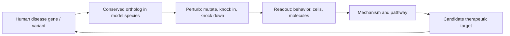
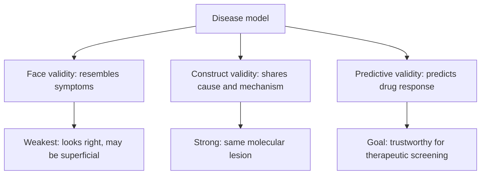
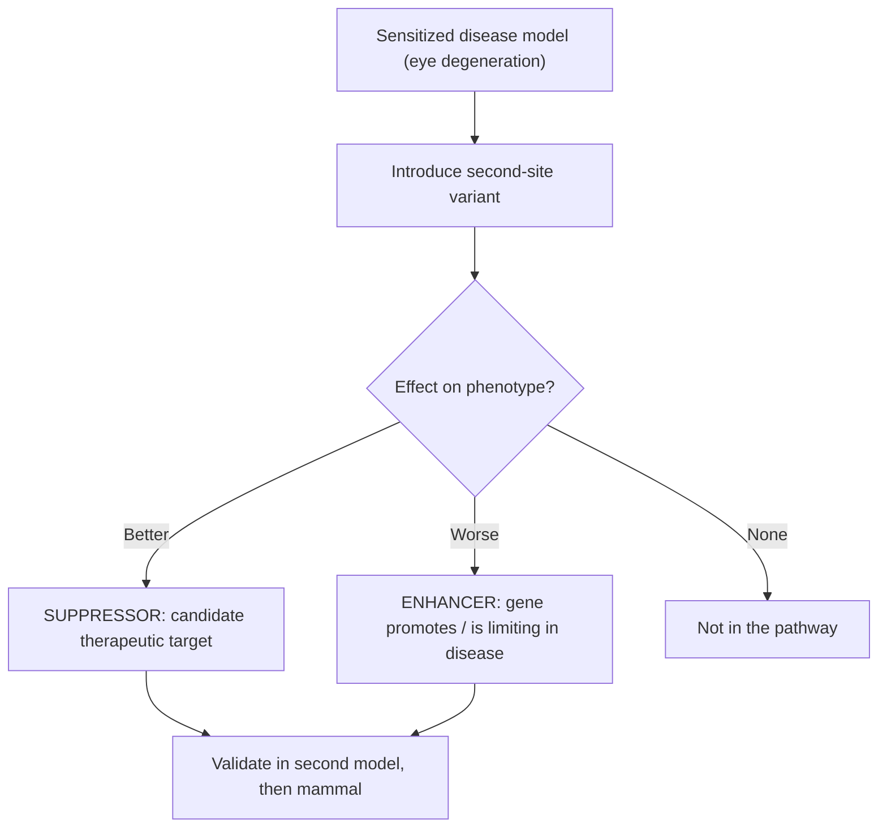
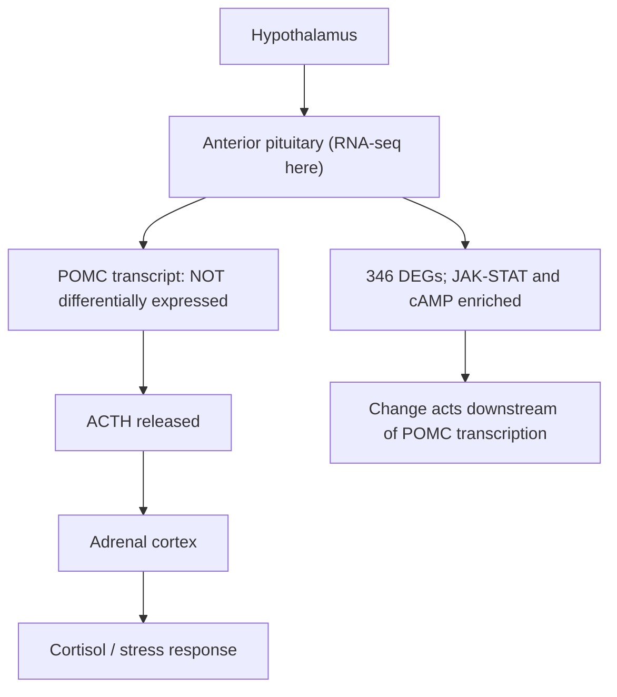

# 질병 모델링에서의 유전학

**강의:** BME333 / BIO333 유전학 (UNIST, 2026 가을) · 강의 16 · 약 60분
**강의계획서:** [← 강의계획서](../../lectures/2026.BME333-BIO333-Syllabus.md) — 10주차, 2026-11-04 (수)
**언어:** [English](../../en/lectures/lec16_Disease-Modeling.md) · 한국어

## 학습 목표
이 강의를 마치면 학생들은 다음을 할 수 있어야 한다:
- 인간 질병을 연구하는 데 모델 생물(model organism)을 사용하는 이유와 무엇이 모델을 타당하게 만드는지 설명한다.
- 질병 모델의 표면 타당도(face validity), 구성 타당도(construct validity), 예측 타당도(predictive validity)를 구분한다.
- 보존된(conserved) 유전자와 경로가 어떻게 종을 넘나드는 질병 모델링을 가능하게 하는지 기술한다.
- 모델에서의 변형자/억제자 스크리닝(modifier/suppressor screen)을 활용해 질병 관련 유전자와 치료 표적을 찾는다.
- 인간 유전 질환에 대한 동물 모델의 강점과 한계를 비판적으로 평가한다.

## 강의

### 1. 왜 질병 연구에 모델 생물을 쓰는가? (~8분)

**모델 생물(model organism)**은 그 안에서의 발견이 인간과 공유하는 생물학을 밝혀 주도록 집중적으로 연구되는 비인간 종이다. 이 논리는 하나의 깊은 사실에 근거한다. 즉, 생명의 핵심 기구 — 세포 주기, DNA 복제와 수선, 신호 전달, 계획된 세포 사멸(programmed cell death), 발생 — 는 엄청난 진화적 거리에 걸쳐 **보존(conserved)**되어 있다. 출아효모(budding yeast)에서 세포 주기를 돌리는 유전자는 인간 뉴런에서 세포 주기를 돌리는 뚜렷한 상동체(counterpart)를 가진다. 이러한 보존 덕분에 우리는 인간이 교배하고, 돌연변이를 일으키고, 영상화하고, 수천 마리씩 처리할 수 있는 생물 안에서 인간 질병 *유전자*를 연구할 수 있다 — 이 중 어느 것도 환자에게는 불가능한 일이다.

DNA 시퀀싱이 저렴해진 지금, 그냥 환자를 시퀀싱하면 되지 않을까? Nancy Bonini와 Shelley Berger는 바로 이 질문에 정면으로 맞서 단호하게 답한다. 즉, 모델 생물은 유전체 시대(genomic era)에도 구식이 아니라 **필수불가결(indispensable)**하다는 것이다(참조 [en](../../en/review/Bonini2017_Genetics_ModelOrganism.md) · [ko](../../ko/review/Bonini2017_Genetics_ModelOrganism.md)). 환자를 시퀀싱하면 *어느* 염기가 바뀌었는지 알 수 있지만, 그 유전자가 *무엇을 하는지*, *어느 경로에 있는지*, 혹은 *후보 변이가 실제로 원인인지*는 알 수 없다. 이것들은 기능적 질문이며, 기능적 질문은 살아 있는 시스템에서 유전자를 교란(perturb)함으로써 답할 수 있다. 따라서 시퀀싱은 모델 생물 연구의 수요를 오히려 곱절로 늘린다. 모든 유전체는 기능적 검증이 필요한, 의미를 알 수 없는 변이(variants of unknown significance)를 수십 개씩 쏟아 내기 때문이다.

역사적 **투자 대비 수익(return on investment)**은 실로 놀랍다. "단순한" 생물에서의 편향 없는 유전 스크리닝(genetic screen) — 어떤 질병도 염두에 두지 않고 순수한 호기심으로 수행된 — 은 인간 의학의 중심으로 밝혀지고 노벨상을 안겨 준 기구들을 거듭 밝혀냈다. **세포 주기 조절**(효모), 호메오틱 유전자(homeotic gene)에 의한 **체제(body plan) 지정**(*Drosophila*에서 Lewis 1978; Nüsslein-Volhard와 Wieschaus 1980), 그리고 **계획된 세포 사멸 / 세포자멸사(apoptosis)**(*C. elegans*에서 Ellis와 Horvitz 1986)가 그 예다(참조 [en](../../en/review/Bonini2017_Genetics_ModelOrganism.md) · [ko](../../ko/review/Bonini2017_Genetics_ModelOrganism.md)). 이후 유전체 시퀀싱은 유전자가 얼마나 폭넓게 보존되어 있는지를 드러냈고, 이것이 바로 파리나 벌레에서 인간 질병 유전자의 상동체(homolog)를 연구하는 것을 정당하게 만드는 근거다. 알려진 인간 질병 유전자의 약 **75%가 뚜렷한 *Drosophila* 오솔로그(ortholog)를 가진다**(참조 [en](../../en/review/Kankel2020_Genetics_Drosophila-ALS-modifier.Banerjee2020primer.md) · [ko](../../ko/review/Kankel2020_Genetics_Drosophila-ALS-modifier.Banerjee2020primer.md)) — 그러므로 파리는 인간 생물학의 은유가 아니라 실제 부품 목록의 대부분을 공유한다.

**그림 — 질병 연구의 모델-생물 논리.**


### 2. 무엇이 좋은 모델을 만드는가 (~8분)

돌연변이 유전자를 지닌 모든 생물이 좋은 *질병* 모델인 것은 아니다. 타당도(validity)는 실험심리학에서 빌려온 세 가지 축을 따라 판단하며, 이들을 구분해 두는 것이 문헌을 비판적으로 읽는 데 필수적이다.

- **표면 타당도(face validity)** — 모델이 질병처럼 *보이는가?* 운동 뉴런 질환의 모델이 실제로 운동 기능 저하를 보이는가, 신경퇴행의 모델이 세포 소실을 보이는가? 표면 타당도는 증상의 유사성에 관한 것이며 과대 해석하기 가장 쉽다. 즉, 표현형이 잘못된 이유로 옳게 보일 수 있다.
- **구성 타당도(construct validity)** — 모델이 *근본 원인과 기전*을 공유하는가? 가장 강력한 구성 타당도는 외래 단백질을 단순히 과발현시키는 것이 아니라 **정확한 인간 돌연변이를 내인성 유전자(endogenous gene)에 삽입** — **넉인(knock-in)** 또는 인간화 대립유전자(humanized allele) — 하는 데서 온다. 구성 타당도는 모델에서 환자로의 도약을 허락하는 근거인데, 이는 동일한 분자적 병변(molecular lesion)이 양쪽을 모두 몰아가고 있음을 뜻하기 때문이다.
- **예측 타당도(predictive validity)** — 모델이 *개입에 대한 반응을 예측하는가?* 환자에게 도움이 되는 약이 모델에도 도움이 되고(환자에게 실패한 약이 모델에도 실패하면), 그 모델은 새 치료제를 스크리닝하는 데 신뢰할 수 있다. 예측 타당도는 가장 원하지만 확립하기 가장 어려운 성질이다.

Bonini와 Berger는 구성 타당도를 높이기 위해 형질전환 과발현(transgenic overexpression)이 아니라 내인성 유전자의 *제자리(in situ)* 변형으로 만드는 **"더 나은" 모델**을 명시적으로 주장하며, 환자 시퀀싱에서 나오는 후보 변이를 **검증(validate)**하는 데 모델 검정을 사용할 것을 주장한다(참조 [en](../../en/review/Bonini2017_Genetics_ModelOrganism.md) · [ko](../../ko/review/Bonini2017_Genetics_ModelOrganism.md)). 이제 CRISPR-Cas9는 오솔로그 유전자좌(orthologous locus)에 정밀한 인간 변이를 삽입하는 것을 일상적인 일로 만들었으므로, 이 분야는 "질병 단백질을 과발현시키고 무엇이 망가지는지 본다"에서 "정확한 병변을 재현한다"로 꾸준히 이동하고 있다.

**그림 — 질병 모델의 세 가지 타당도.**


### 3. 질병 모델 만들기 (~12분)

모델을 만들려면 (i) 질병 유전형을 도입하고 (ii) 대규모로 측정할 수 있는 표현형을 얻어야 한다. *Drosophila*에서 (i) 단계의 대표적인 엔진은 효모에서 빌려온 두 부분짜리 발현 스위치인 **GAL4-UAS 시스템**이다(참조 [en](../../en/review/Kankel2020_Genetics_Drosophila-ALS-modifier.Banerjee2020primer.md) · [ko](../../ko/review/Kankel2020_Genetics_Drosophila-ALS-modifier.Banerjee2020primer.md)). 한 파리 계통은 조직 특이적 프로모터("드라이버") 아래에 효모 전사 인자 **GAL4**를 지니고, 다른 계통은 GAL4가 결합하는 **UAS**(Upstream Activation Sequence) 하류에 관심 유전자를 지닌다. 어느 계통도 단독으로는 그 유전자를 발현하지 않는다. 이들을 교배하면, GAL4가 만들어지는 조직에서만 GAL4가 UAS에 결합하여 트랜스진(transgene)을 켠다. 드라이버를 바꾸면 발현을 새로운 조직으로 돌릴 수 있고, cDNA 대신 RNAi 헤어핀을 UAS 뒤에 넣으면 그 조직에서 유전자를 *녹다운(knock down)*할 수 있다. 이 모듈성이 바로 파리가 질병 연구에 그토록 강력한 이유다.

**그림 — GAL4-UAS 이원 발현 시스템.**
```
  Driver line                         Responder line
  [tissue promoter]--[GAL4]           [UAS]--[human disease gene]
            |                                    ^
            | makes GAL4 protein                 | GAL4 binds UAS
            v                                    |
        GAL4 protein  ---------------------------+
                                                 v
                 expression ONLY in the driver tissue
```

(ii) 단계에서의 요령은 질병 과정을 손상이 채점하기 쉬운 조직으로 유도하는 것이다. **Drosophila 눈(eye)**이 고전적 선택이다. 이는 개안(ommatidia)의 정밀한 결정성 배열이며 생존에 필수적이지 않고 외부에서 보이므로, 퇴행이 거칠고 무질서하거나 축소된 눈으로 드러나 해부현미경 아래에서 눈으로 등급을 매길 수 있다. 다음에 다룰 ALS 연구에서는 눈 특이적 GAL4가 인간 ALS 단백질(**hFUS^R521C** 또는 **hTDP-43^M337V**)을 발현시키고, 그 독성이 퇴행된 눈을 만들어 낸다(참조 [en](../../en/article/Kankel2020_Genetics_Drosophila-ALS-modifier.md) · [ko](../../ko/article/Kankel2020_Genetics_Drosophila-ALS-modifier.md)). 판독값(readout)은 **행동적**(운동성, 등반, 수명)에서 **세포적**(뉴런 수, 눈 형태), **분자적**(단백질 응집, 전사체 양)에 이르기까지 규모가 다양하며 — 판독이 정밀할수록 기전에 더 가까워진다.

여기서 모델링되는 질병은 선택적 **운동 뉴런 사멸(motor-neuron death)**로 인한 치명적 질환인 **근위축성 측삭경화증(amyotrophic lateral sclerosis, ALS)**이다. 그 유전학은 유익하다. 가족성 ALS는 **FUS**, **TDP-43**, **C9orf72**, **SOD1**의 돌연변이로 발생하며, **TDP-43**의 병리적 응집은 전체 ALS 환자의 약 **97%**에서 관찰된다(참조 [en](../../en/article/Kankel2020_Genetics_Drosophila-ALS-modifier.md) · [ko](../../ko/article/Kankel2020_Genetics_Drosophila-ALS-modifier.md)). FUS와 TDP-43은 정상적으로는 핵의 **RNA 결합 단백질(RNA-binding protein)**이지만, 질병에서는 잘못된 위치로 이동하여 운동 뉴런을 죽이는 세포질 응집체를 형성한다(참조 [en](../../en/review/Kankel2020_Genetics_Drosophila-ALS-modifier.Banerjee2020primer.md) · [ko](../../ko/review/Kankel2020_Genetics_Drosophila-ALS-modifier.Banerjee2020primer.md)). 파리에서 인간 돌연변이 단백질을 발현시키면 이 독성이 재현되며 — 좋은 표면 타당도 — FUS와 TDP-43이 별개 유전자이므로 *두* 모델을 모두 갖는 것은 연구자가 질병 특이적 효과를 일반적인 신경퇴행과 분리하도록 해 준다.

### 4. 질병 유전자를 찾는 변형자 스크리닝 (~12분)

측정 가능한 질병 표현형을 갖춘 모델은 **민감화된 배경(sensitized background)** — 표현형의 가장자리에 아슬아슬하게 놓인 생물, 그래서 두 번째 유전적 변화가 그것을 어느 쪽으로든 밀 수 있는 — 이 된다. **변형자 스크리닝(modifier screen)**은 이차 부위 돌연변이(second-site mutation)를 체계적으로 도입하고, 어느 것이 표현형을 더 나쁘게(**증강자, enhancer**) 또는 더 낫게(**억제자, suppressor**) 만드는지 묻는다. 그 논리는 질병 표현형을 변형할 수 있는 유전자가 질병 과정과 기능적으로 연결되어 있다는 것이다 — 이들은 경로 구성 요소의 이름을 지어 주고, 억제자일 경우 후보 **치료 표적(therapeutic target)**을 지목한다(그 *상실*이 질병을 완화하는 유전자는 약물로 *억제*하고 싶은 표적이다). 많은 변형자가 한 카피 용량으로 작용하므로, 이는 흔히 **우성 변형자(dominant modifier)** — 이형접합 상태에서 표현형을 이동시켜 유전자 용량 민감성(gene-dosage sensitivity)을 드러내는 변이 — 를 찾는 스크리닝이다(참조 [en](../../en/review/Kankel2020_Genetics_Drosophila-ALS-modifier.Banerjee2020primer.md) · [ko](../../ko/review/Kankel2020_Genetics_Drosophila-ALS-modifier.Banerjee2020primer.md)).

**그림 — 변형자(증강자/억제자) 스크리닝의 논리.**


Kankel 등(2020)은 바로 이 스크리닝을 유전체 규모로 수행했다(참조 [en](../../en/article/Kankel2020_Genetics_Drosophila-ALS-modifier.md) · [ko](../../ko/article/Kankel2020_Genetics_Drosophila-ALS-modifier.md)). 그들은 거의 유전체 전체를 아우르는 돌연변이 집합인 **15,500개의 Exelixis 트랜스포존 삽입(transposon-insertion)** 계통을 파리 ALS 눈 모델에 교배해 넣고, 각각에 대해 눈 퇴행의 억제 또는 증강을 채점했다. 이 스크리닝은 **FUS 모델의 변형자 637개**, **TDP-43 모델의 변형자 553개**, 그리고 결정적으로 두 모델 모두에서 **공유된 변형자 432개**를 돌려주었다. 공유 집합이 성과다. FUS와 TDP-43은 독립적인 ALS 유전자이므로, 두 모델 모두에 공통인 변형자는 모델 특이적 인공산물(artifact)이 아니라 ALS의 **공유된 분자 경로**로 농축되기 때문이다.

공유 억제자에 대한 유전자 온톨로지(gene-ontology) 분석은 **포스포리파아제 D(phospholipase D, PLD) 경로**로 수렴했으며, 여섯 개의 구성 요소가 두 스크리닝 모두에서 억제자로 나타났다. **dPld**(포스포리파아제 D 자체), **ArfGAP3**, **Plc21C**(포스포리파아제 C), **Rho1**, **Ras85D**, **Rgl**이 그것이다. **dPld**의 RNAi 녹다운은 FUS *및* TDP-43 모델 모두에서 눈 퇴행을 억제했으며 — 그리고 시사하는 바가 크게도 — 세 번째 **C9orf72** ALS 모델에서도 억제하여 결과를 별개의 ALS 병인으로 확장했다(참조 [en](../../en/article/Kankel2020_Genetics_Drosophila-ALS-modifier.md) · [ko](../../ko/article/Kankel2020_Genetics_Drosophila-ALS-modifier.md)). 파리에서 포유류로 이어지는 사슬은 이렇게 닫혔다. 즉, **SOD1 돌연변이 생쥐**에서 PLD 경로 억제는 완만한 운동 기능 개선을 가져왔고, 이는 PLD 억제가 여러 ALS 원인에 걸쳐 신경보호적일 수 있음을 시사한다.

**그림 — 스크리닝에서 표적으로: ALS 변형자 연구.**

| 단계 | 결과 |
|---|---|
| 스크리닝한 돌연변이 집합 | 15,500개 Exelixis 트랜스포존 삽입 |
| FUS 모델 변형자 | 637 |
| TDP-43 모델 변형자 | 553 |
| 공유 변형자 (두 모델 모두) | 432 |
| 수렴한 경로 | Phospholipase D (dPld, ArfGAP3, Plc21C, Rho1, Ras85D, Rgl) |
| 모델 간 교차 검증 | dPld RNAi가 C9orf72 모델도 구제 |
| 포유류 검증 | PLD 억제 → SOD1 생쥐에서 완만한 운동 개선 |

방법론적 교훈은, 고전적 **정방향 유전학(forward genetics)** — 표현형에서 출발하여 편향 없이 스크리닝하고 생물학이 유전자의 이름을 짓게 하는 — 이 생화학 및 세포 기반의 "접시 속 질병(disease in a dish)" 검정으로 대체되는 것이 아니라 이를 보완하며, 여전히 치료 표적으로 가는 가장 강력한 경로 중 하나라는 것이다(참조 [en](../../en/review/Bonini2017_Genetics_ModelOrganism.md) · [ko](../../ko/review/Bonini2017_Genetics_ModelOrganism.md)).

### 5. 비교 및 종 간 모델링 (~10분)

모든 질병 모델링이 표준 실험실 생물에 조작된 돌연변이를 사용하는 것은 아니다. 때로는 비전통적 모델에서 **자연적으로 발생하는** 표현형이 인간 생물학을 밝혀 준다 — 그리고 행동(behavior)은 이것이 특히 유용한 영역인데, 행동 형질은 조작하기 어렵기 때문이다. **Belyaev/Trut 은여우(silver-fox) 실험**(노보시비르스크, 1959년~현재)이 대표적 사례다. 여우들은 오로지 인간에 대한 **온순함(tameness)** 대 **공격성(aggression)**을 기준으로 수십 세대에 걸쳐 선택되었고, 그 결과 행동이 극적으로 갈라진 계통들이 생겨났으며 이는 **"가축화 증후군(domestication syndrome)"**의 상관 형질과 함께 나타났다(참조 [en](../../en/article/Hekman2019_G3_APtx+Fox.md) · [ko](../../ko/article/Hekman2019_G3_APtx+Fox.md)).

Hekman 등은 온순한 여우 6마리와 공격적인 여우 6마리로부터 **전엽 뇌하수체(anterior pituitary)** — 스트레스 반응을 몰아가는 **ACTH**를 방출하는 **HPA(hypothalamic-pituitary-adrenal) 축**의 허브 — 를 RNA 시퀀싱하여 무엇이 *분자적으로* 변했는지 물었다. 그들은 **346개의 차등 발현 유전자(differentially expressed genes, DEGs)**(FDR < 0.05)를 발견했고, JAK-STAT 신호전달과 cAMP 조절에서 GO 농축을, 36개 유전자에서 차등 스플라이싱(differential splicing)을 발견했다(참조 [en](../../en/article/Hekman2019_G3_APtx+Fox.md) · [ko](../../ko/article/Hekman2019_G3_APtx+Fox.md)). 미묘하지만 중요한 음성 결과: ACTH의 전구 단백질인 **POMC**는 전사체 수준에서 차등 발현되지 **않았다** — 이는 행동 선택이 POMC 메시지가 얼마나 만들어지는지를 바꿈으로써가 아니라 **하류(downstream)**(번역 후 가공 또는 분비)에서 ACTH 출력을 바꾸었음을 시사한다. 이것이 바로 비교 질병 관련 모델링이다. 즉, 자연적으로 선택된 행동 표현형이 스트레스 반응의 구체적 신경내분비 기전을 지목하는 것이다.

**그림 — HPA 축과 여우 연구가 변화를 국소화한 지점.**


비교 모델링은 여우를 넘어 확장된다. 실제 환경에서 살고, 번식하고, 늙어 가는 개, 고양이, 그 밖의 이계교배(outbred) 동물에서 자연적으로 발생하는 질병 변이는, 근교계(inbred) 실험실 계통이 놓치는 복합 인간 질병의 측면을 포착할 수 있다. 일반 원리는 **자연 변이가 자연이 이미 돌려 놓은 스크리닝(screen)**이라는 것이며, 유전학자의 일은 그것을 읽어 내는 것이다.

### 6. 한계와 중개(translation) (~7분)

모델은 정보를 주지만 인간 결과를 **보장하지는 않는다** — 그리고 그 이유를 아는 것이 과학자를 정직하게 유지한다. 세 가지 한계가 반복적으로 등장한다. 첫째, **유전적 배경(genetic background)**: 동일한 돌연변이가 서로 다른 계통에서 다른 표현형을 주는데, 이는 수천 개의 배경 변이가 그것을 변형하기 때문이다 — 변형자 스크리닝이 이용하는 바로 그 현상이, 한 계통에서의 결과가 다른 계통으로 전이되지 않을 수 있다는 경고이기도 하다. 둘째, **불완전 침투도(incomplete penetrance)와 가변 발현도(variable expressivity)**: 질병 유전형이 표현형을 오직 때때로만, 혹은 다양한 정도로만 만들 수 있으므로, "깔끔한" 모델 표현형이 지저분한 인간 질병에 비해 오해를 부를 정도로 재현성 있게 보일 수 있다. 셋째, **종 차이(species differences)**: 파리 눈은 인간 운동 뉴런이 아니고, 생쥐의 짧은 수명과 생리는 우리와 다르다 — 이것이 바로 ALS 연구가 표적을 주장하기 전에 *모델 간*(FUS, TDP-43, C9orf72) 그리고 이어서 *종 간*(생쥐) 검증을 고집한 이유다(참조 [en](../../en/article/Kankel2020_Genetics_Drosophila-ALS-modifier.md) · [ko](../../ko/article/Kankel2020_Genetics_Drosophila-ALS-modifier.md)).

Bonini와 Berger가 지지하는 정직한 틀은 **증거의 위계(hierarchy of evidence)**다. 즉, 한 모델에서의 변형자는 가설이고, 독립적인 여러 모델에 걸친 수렴은 그것을 유력 후보(lead)로 만들며, 포유류에서의 검증은 그것을 후보(candidate)로 만들고, 오직 인간 임상시험만이 그것을 치료제로 만든다(참조 [en](../../en/review/Bonini2017_Genetics_ModelOrganism.md) · [ko](../../ko/review/Bonini2017_Genetics_ModelOrganism.md)). 모델은 빠르고, 저렴하고, 기전 중심인 파이프라인의 앞단이며, 그 뒷단은 불가피하게 인간이다. 이것은 또한 인간 유전학 단원으로의 다리이기도 하다. 즉, 모델에서 나온 후보 유전자는 신뢰받기 전에 궁극적으로 **환자 GWAS 및 전유전체 시퀀싱(whole-genome sequencing)** 데이터에 대조되어야 한다(참조 [en](../../en/review/Kankel2020_Genetics_Drosophila-ALS-modifier.Banerjee2020primer.md) · [ko](../../ko/review/Kankel2020_Genetics_Drosophila-ALS-modifier.Banerjee2020primer.md)).

### 7. 마무리 (~3분)

질병 모델링은 이 강좌의 모든 것을 통합한다. **역방향 유전학(reverse genetics)**은 정의된 인간 병변을 삽입하고(GAL4-UAS, CRISPR 넉인), 그 다음 **정방향 유전학(forward genetics)**이 그 민감화된 배경에서 편향 없는 변형자 스크리닝을 돌려 경로와 그 약물 표적화 가능 지점의 이름을 짓는다. **비교 유전학(comparative genetics)**은 자연이 이미 선택해 놓은 표현형을 읽는다. 보존(conservation)은 이 모든 사업을 정당하게 만들고, 세 가지 타당도는 우리가 모델의 신뢰성을 판단하는 방법이며, 증거의 위계는 파리에서의 결과가 조심스럽게 사람에 관한 주장이 되는 방법이다.

## 핵심 정리
- 모델 생물은 유전체 시대에도 **필수불가결**한데, 시퀀싱은 변이를 찾아 주지만 오직 기능적 교란만이 유전자가 *무엇을 하는지* 드러내기 때문이다. 인간 질병 유전자의 약 75%는 *Drosophila* 오솔로그를 가진다.
- 모델은 **표면**(증상을 닮음), **구성**(기전을 공유함 — 정확한 인간 대립유전자의 넉인이 최선), **예측**(약물 반응을 예측함) 타당도로 판단한다.
- **GAL4-UAS** 시스템은 선택된, 채점하기 쉬운 조직(예: 파리 눈)에서 인간 질병 유전자를 발현시켜 질병을 측정 가능한 표현형으로 바꾼다.
- 민감화된 질병 배경에 대한 **변형자 스크리닝**은 **증강자**와 **억제자**를 찾으며, 억제자는 후보 치료 표적이다. Kankel 등은 두 ALS 모델에 걸쳐 15,500개 삽입을 스크리닝하여 **PLD 경로**로 수렴했고, 이를 C9orf72 파리와 SOD1 생쥐에서 검증했다.
- **비교 모델**은 자연 변이를 이용한다. 온순/공격 여우는 346개의 뇌하수체 DEG를 드러냈고 변화된 ACTH 출력을 POMC 전사의 *하류*에 국소화했다.
- 모델은 정보를 주지만 인간 결과를 **보장하지 않는다**. 유전적 배경, 침투도, 종 차이는 증거의 위계를 요구한다 — 모델 간, 이어서 포유류, 이어서 인간 검증.

## 교재 참고
- **Genetics: From Genes to Genomes (8e)** — Ch. 22 Genetic Analysis of Development. → [textbook ref](../../lectures/ref.Genetics-FromGenesToGenomes.md)

## 이 저장소의 노트
수업에서 소개할 리뷰와 논문 (각각 en/ko 이중언어 쌍이 있음):
- `Bonini2017_Genetics_ModelOrganism` — 인간 질병 이해에서 모델 생물의 필요성; 강의를 여는 글. · [en](../../en/review/Bonini2017_Genetics_ModelOrganism.md) · [ko](../../ko/review/Bonini2017_Genetics_ModelOrganism.md)
- `Kankel2020_Genetics_Drosophila-ALS-modifier` — ALS에 대한 *Drosophila* 변형자 스크리닝; 질병 모델링의 핵심 사례 연구. · [en](../../en/article/Kankel2020_Genetics_Drosophila-ALS-modifier.md) · [ko](../../ko/article/Kankel2020_Genetics_Drosophila-ALS-modifier.md)
- `Kankel2020_Genetics_Drosophila-ALS-modifier.Banerjee2020primer` — ALS 변형자 연구를 위한 교육용 프라이머; 스크리닝과 그 질병 관련성을 풀어냄. · [en](../../en/review/Kankel2020_Genetics_Drosophila-ALS-modifier.Banerjee2020primer.md) · [ko](../../ko/review/Kankel2020_Genetics_Drosophila-ALS-modifier.Banerjee2020primer.md)
- `Hekman2019_G3_APtx+Fox` — 비전통적 모델(여우/실조)에서 자연적으로 발생하는 질병 관련 표현형; 비교 질병 모델링. · [en](../../en/article/Hekman2019_G3_APtx+Fox.md) · [ko](../../ko/article/Hekman2019_G3_APtx+Fox.md)

## 토론 문제
1. 파리 ALS 눈 모델을 예로 들어 표면, 구성, 예측 타당도를 구분하라. 인간 FUS의 눈 특이적 과발현은 어느 타당도를 가장 잘 만족하고 어느 것을 가장 못 만족하는가, 그리고 정확한 환자 대립유전자의 CRISPR 넉인은 당신의 답을 어떻게 바꾸겠는가?
2. ALS 스크리닝은 FUS 변형자 637개와 TDP-43 변형자 553개를 찾았지만 *공유된* 432개를 강조했다. 그 논리를 설명하라. 왜 공유 변형자가 모델 특이적 변형자보다 질병과 관련될 가능성이 더 높은가, 그리고 공유 변형자가 그럼에도 여전히 무엇의 인공산물일 수 있는가?
3. 억제자는 후보 *치료 표적*이다. *dPld*를 녹다운하는 것이 표현형을 완화한다면, 이는 당신이 약물이 무엇을 하기를 바란다는 것을 시사하는가 — 그리고 정상 세포 효소를 억제하는 데서 오는 위험은 무엇인가? SOD1 생쥐 결과를 사용해 증거가 얼마나 강한지 논하라.
4. 여우 연구에서 POMC 전사체는 행동 계통 간 ACTH 출력이 달랐음에도 변하지 않았다. 이 음성 결과가 기전에 대해 무엇을 배제하고 무엇을 인정하는지, 그리고 왜 전사체학(transcriptomics)만으로는 이를 결론지을 수 없는지 설명하라.
5. "모델은 정보를 주지만 인간 결과를 보장하지 않는다." 단일 모델의 변형자에서 인간 치료제에 이르는 증거의 위계를 펼쳐 보이고, 그 사슬의 어디에서 대부분의 후보 치료제가 실패하며 왜 그런지 논하라.
