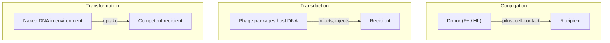
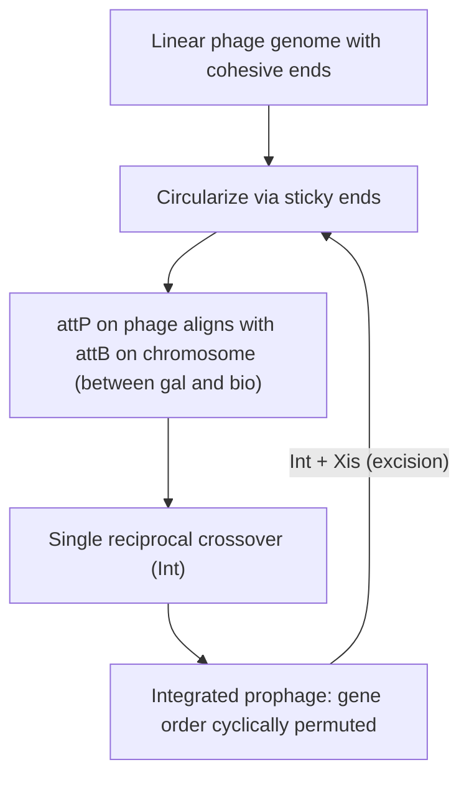
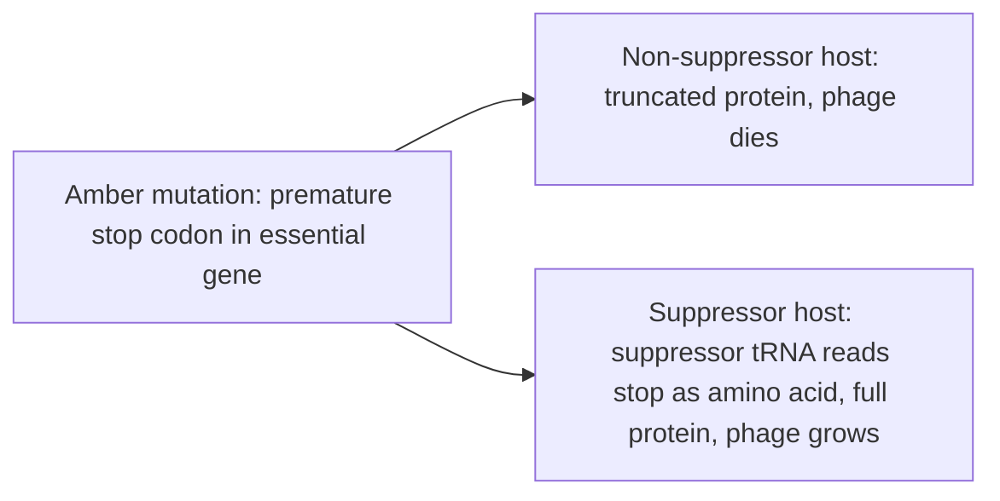

# 유전 모델 — E. coli와 세균

**강의:** BME333 / BIO333 유전학 (UNIST, 2026 가을) · 강의 17 · 약 60분
**강의계획서:** [← 강의계획서](../../lectures/2026.BME333-BIO333-Syllabus.md) — 11주차 월, 2026-11-09
**언어:** [English](../../en/lectures/lec17_Model-Ecoli-Bacteria.md) · 한국어

## 학습 목표
이 강의를 마치면 학생들은 다음을 할 수 있어야 한다:
- *E. coli*와 그 파지(phage)가 왜 분자유전학의 일꾼(workhorse)이 되었는지 설명한다(빠른 성장, 반수체 유전체, 쉬운 선택).
- 세균에서의 수평적 유전자 전달(horizontal gene transfer)의 세 가지 방식 — 접합(conjugation), 형질도입(transduction), 형질전환(transformation) — 을 구분한다.
- 접합과 중단 교배 지도작성(interrupted-mating mapping)이 어떻게 원형 *E. coli* 염색체를 밝혔는지 기술한다.
- 용원성(lysogeny)과 부위 특이적 프로파지 삽입(Campbell 모델), 그리고 파지 유전학이 어떻게 유전자의 미세 구조(fine structure)를 확립했는지 설명한다.
- 고전 세균유전학을 현대 유전체 공학 및 "현대 종합설 속의 미생물(microbes in the Modern Synthesis)" 관점과 연결한다.

## 강의

### 1. 왜 세균인가? 미생물 모델의 부상 (~8분)

20세기 전반부 동안 유전학이란 식물, 파리, 생쥐를 뜻했다. 세균은 멘델적 의미의 유전자가 전혀 없다고 여겨졌다 — 보이는 염색체도 없고, 성(sex)도 없으며, 교배도 없다. 그 견해는 1940년대에 무너졌고, 이후 세균은 거의 이상적인 실험적 패키지를 제공하기에 분자유전학을 장악했다. **세대 시간(generation time)**은 분 단위이며(*E. coli* 배양은 약 20분마다 두 배가 된다), 그래서 하룻밤 사이에 *수십억* 개체를 키울 수 있다. 세균은 단일 염색체를 가진 **반수체(haploid)**이므로, 열성 돌연변이가 즉시 표현형을 나타낸다 — 그것을 가릴 두 번째 대립유전자가 없다. 화학적으로 **정의된 배지(defined media)**에서 자라므로, 특정 대사 능력을 요구할 수 있다. 그리고 가장 강력하게는 **선택(selection)**을 허용한다. 즉, 드문 변이체만 생존할 수 있는 배지에 10⁹개의 세포를 도말하면 그 십억 분의 일 세포를 콜로니로 회수한다. 선택은 세균유전학이 파리 교배에서는 전혀 보이지 않는 빈도(백만 분의 일 또는 그보다 드문)로 사건 — 재조합체, 돌연변이체, 전달 — 을 볼 수 있게 한다.

이러한 특징들은 세균을 유전자에 관한 가장 깊은 질문의 재료로 만들었다. 그러나 정리해야 할 개념적 장애물도 있었다. 즉, **현대 종합설(Modern Synthesis)**이 유성, 이배체 집단을 중심으로 세운 진화와 유전학의 이론에 미생물이 애초에 속하기는 하는가? Novick과 Doolittle은 종합설의 설계자들(Dobzhansky, Huxley)이 **미생물을 종종 명시적으로 배제**했으며, 측면 유전자 전달(lateral gene transfer) 같은 현상은 나중에 종합설을 "위협하는(jeopardizing)" 것으로 규정되었다고 지적한다(참조 [en](../../en/review/Novick2019_PLoSGenet_MicrobesModernSynthesis.md) · [ko](../../ko/review/Novick2019_PLoSGenet_MicrobesModernSynthesis.md)). 그들의 해법은 진화 이론을 단일한 참/거짓 법칙이 아니라 **설명적 자원의 도구상자(toolkit of explanatory resources)**로 다루는 것이다. 즉, 미생물은 종합설을 반박한다기보다 **도구상자를 확장하는 동시에 그 원래 주장의 제한된 범위를 명확히 한다**. 이 틀을 염두에 두라 — 세균유전학은 단지 사실을 더한 것이 아니라 개념들(종, 유전자, 유전)이 재구성되도록 강제했다.

**그림 — 왜 세균이 고해상도 유전학에 이상적인가.**

| 특징 | 유전학적 결과 |
|---|---|
| 약 20분의 세대 시간 | 하룻밤에 수십억 세포; 드문 사건이 관찰 가능해짐 |
| 반수체 단일 염색체 | 열성 돌연변이가 즉시 표현형을 나타냄 |
| 정의된 최소 배지 | 특정 대사 능력을 요구할 수 있음 |
| 강력한 선택 | 10⁶–10⁹ 중 재조합체/돌연변이체 하나를 콜로니로 회수 |
| 채점 가능한 표지 | 영양요구성(auxotrophy), 파지 저항성, 당 발효(색), 항생제 저항성 |

### 2. 돌연변이는 자발적이다: 요동과 기존재 변이체 (~8분)

세균이 *유전적* 모델이 되기 전에, 세균 변이가 유전적이라는 것 — 즉 저항성 생존자가 환경이 세포에게 *지시함*으로써가 아니라 **돌연변이**에 의해 생겨난다는 것 — 을 증명해야 했다. 파지를 감수성 배양에 넣으면 거의 모든 세포가 용해되지만 소수의 저항성 생존자가 자라난다. 두 가설이 경쟁했다. **획득 면역(acquired-immunity, 라마르크식)** 견해는 파지와의 접촉이 저항성을 *유도*한다는 것이고, **돌연변이(mutation, 다윈식)** 견해는 드문 저항성 돌연변이체가 노출 **이전에** 생겨났고 파지는 단지 그들을 **선택**할 뿐이라는 것이다(참조 [en](../../en/article/LuriaDelbruck1943_Genetics_VirusResistance.md) · [ko](../../ko/article/LuriaDelbruck1943_Genetics_VirusResistance.md)).

Luria와 Delbrück(1943)은 통계적 추론의 승리인 **요동 검정(fluctuation test)**으로 둘을 구별했다. Luria의 통찰(슬롯머신이 당첨금을 지급하는 것을 지켜보다 얻은)은 시점(timing)이 *분산(variance)*을 예측한다는 것이었다. 저항성이 도말 시점에 파지에 의해 유도된다면, 모든 배양은 독립적으로 생존자를 배출할 것이며 분산 ≈ 평균인 **푸아송(Poisson)** 분포를 준다. 그러나 저항성이 성장 *동안* 자발적 돌연변이로 생겨난다면, 일찍 일어난 돌연변이가 커다란 "**대박(jackpot)**" 클론을 세우므로, 독립적인 병렬 배양 간의 계수는 **격심하게 요동칠 것(분산 ≫ 평균)**이다. 데이터는 결정적이었다. 실험 16에서 평균은 저항성 세포 11.35개였지만, **20개 배양 중 11개는 0개**였고 **3개는 35–107개**였다 — 푸아송 하에서는 불가능한 일이다(참조 [en](../../en/article/LuriaDelbruck1943_Genetics_VirusResistance.md) · [ko](../../ko/article/LuriaDelbruck1943_Genetics_VirusResistance.md)). 열 개의 실험에 걸쳐 저항성으로의 돌연변이율은 세균 한 마리, 한 분열당 평균 **2.45 × 10⁻⁸**이었다 — 현대의 전유전체 추정치와 놀랍도록 가깝다. 이것이 **선택은 변이를 만들어 내는 것이 아니라 기존재하는 변이를 드러낸다**는 것의 창시적 증명이며, 우리가 항생제 저항성을 이해하는 것의 직접적인 미생물 조상이다.

**그림 — 요동 검정의 논리.**

| | 획득 면역 (라마르크) | 자발적 돌연변이 (다윈) |
|---|---|---|
| 저항성은 언제 생겨나는가? | 파지 노출 시점에 | 노출 이전, 앞선 성장 동안 |
| 병렬 배양 간 분포 | 푸아송 (분산 ≈ 평균) | 크게 치우침, "대박" (분산 ≫ 평균) |
| Luria–Delbrück 결과 | 기각됨 | **지지됨** (실험 16: 평균 11.35, 그러나 다수의 0과 소수의 100+) |

돌연변이가 **적응도에 대해 무작위(random with respect to fitness)**라는 원리는 너무나 핵심적이어서 유전학은 이를 철저히 감시한다. 수십 년 후, Cairns와 동료들은 "지향적(directed)" 혹은 **적응적 돌연변이(adaptive mutation)** — 어떤 돌연변이는 유용하기 때문에 특별히 생겨난다 — 를 주장했다. Franklin Stahl의 *Unicorns Revisited*는 이 분야가 그런 특별한 주장을 다루는 방식의 모범이다. 즉, 묵살하는 것이 아니라 "울타리를 넘어가 살펴보는" 것 — 후보 기전을 하나씩 검증하고 해체하는 것, 여기에는 주목할 만한 정직함으로 **자기 자신의** 기전까지 포함된다(참조 [en](../../en/review/Stahl1992_Genetics_UnicornsRevisited.md) · [ko](../../ko/review/Stahl1992_Genetics_UnicornsRevisited.md)). 이 사건은 결국 스트레스 유도 돌연변이 생성(stress-induced mutagenesis)과 유전자 증폭으로 설명되었다 — *어느* 돌연변이가 일어나는지를 "지향"하지 않으면서 돌연변이 *율(rate)*을 조절하는 기전으로, Luria–Delbrück 원리는 온전히 남는다.

### 3. 접합과 염색체 지도작성 (~12분)

세균은 감수분열이 없지만, 세 가지 뚜렷한 경로의 **수평적(측면) 유전자 전달(horizontal/lateral gene transfer)**로 유전자를 교환하며, 이들을 구별하는 것이 세균유전학의 핵심이다. **접합(conjugation)**에서는 DNA가 **직접 세포 접촉**(선모/짝짓기 다리)을 통해 공여자(donor)에서 수용자(recipient)로 넘어간다. **형질도입(transduction)**에서는 **박테리오파지(bacteriophage)**가 우연히 숙주 DNA를 포장하여 새 세포에 주입한다. **형질전환(transformation)**에서는 세포가 환경에서 방출된 **벌거벗은 DNA(naked DNA)**를 흡수한다. 진단적 차이 — 접촉 의존적 대 여과 가능(filterable) 대 DNase 민감 — 는 바로 고전적 실험들이 이용한 것이다.

**그림 — 세균에서의 수평적 유전자 전달의 세 가지 방식.**

Joshua Lederberg(Tatum과 함께, 1946)는 각각 서로 다른 영양소를 만들지 못하는 두 개의 **영양요구성(auxotrophic)** *E. coli* K-12 계통을 섞어 최소 배지에 도말함으로써 접합을 발견했다. 드문 **원영양성 재조합체(prototrophic recombinant)**가 약 백만 분의 일로 나타났고, 이중으로 표지된 부모는 단순한 복귀돌연변이(reversion)를 배제했다(참조 [en](../../en/review/Lederberg1987_Genetics_EcoliRecombination.md) · [ko](../../ko/review/Lederberg1987_Genetics_EcoliRecombination.md)). 회의론자들(특히 Delbrück)은 인공산물을 의심했으므로, Lederberg는 파지 T1 저항성을 포함한 **선택하지 않은 표지(unselected markers)**가 재조합체 중에서 안정한 부류로 깔끔하게 분리(segregate)됨을 보였다 — 이는 단순한 세포 혼합물이나 핵융합 이핵체(heterokaryon)로는 만들어 낼 수 없는 일이다. 비무작위적 공동분리(co-segregation)가 **단일 연관군(single linkage group)**을 암시하는 여덟 개의 표지를 축적하여, 그는 *E. coli*의 첫 유전자 지도를 그렸다.

그러나 그 지도는 어긋났다. 새 표지들이 하나의 선에 맞기를 거부했고, Lederberg의 1951년 "분지형(branched)" 지도는 잘못되게도 문자 그대로 받아들여졌다(Watson과 Hayes는 심지어 세 개의 염색체를 제안했다). 해결은 전달의 기전에서 왔다. **Hfr**("high frequency of recombination")라 불리는 일부 공여자는 **F 임성 인자(F fertility factor)를 염색체에 통합한** 채 지니며, 접합 동안 Hfr는 자신의 염색체를 **고정된 기점(origin)에서 시작하여 항상 같은 방향으로**, 약 100분에 걸쳐 한 번에 하나의 유전자씩 **선형으로** 주입한다. Wollman과 Jacob의 **중단 교배(interrupted-mating)** 실험이 이를 눈에 보이게 만들었다. 그들은 Hfr × F⁻ 교배가 진행되도록 두었다가, 연속된 시점에 **믹서기(blender)**로 배양을 격렬하게 휘저어 짝짓기 다리를 끊고, 어느 공여자 표지가 들어왔는지 채점했다. **유전자는 시간의 함수로 나타난다** — 유전자가 일찍 들어올수록 기점에 더 가깝다 — 그래서 *시간이 곧 거리*다(분 단위로 측정). 서로 다른 Hfr 계통은 F가 서로 다른 부위와 방향으로 통합되어 있으므로 각각 다른 선형 순서를 주지만, **모든 순서가 하나의 원과 일치한다**. 이렇게 해서 **원형 *E. coli* 염색체**가 증명되었다(참조 [en](../../en/review/Lederberg1987_Genetics_EcoliRecombination.md) · [ko](../../ko/review/Lederberg1987_Genetics_EcoliRecombination.md)).

**그림 — 중단 교배는 염색체를 분 단위로 지도화하고 원을 드러낸다.**

### 4. 형질도입: 파지 매개 유전자 전달 (~10분)

Lederberg 연구실의 22세 연구원이던 Norton Zinder는 *Salmonella typhimurium*에서 접합을 찾으려다 대신 **세 번째** 전달 방식을 발견했다(참조 [en](../../en/review/Zinder1992_Genetics_BacterialTransduction.md) · [ko](../../ko/review/Zinder1992_Genetics_BacterialTransduction.md)). LT-2 × LT-22 계통을 교배하자(1950년 10월 5일) 원영양체(prototroph)가 높은 빈도로 나타났다 — 그러나 그 현상은 접합과 다르게 행동했다. 즉, **비대칭적(asymmetric)**이었고, 한 번에 **한 표지만** 옮겼으며, **세포 접촉이 필요 없었다**. Zinder는 Bernard Davis의 **U-관(U-tube)** 실험 — *E. coli* 접합에서는 여과 가능한 인자를 *배제*했던 — 을 적용했다. 그는 세포는 막고 분자와 작은 입자는 통과시키는 **소결 유리 필터(sintered-glass filter)**로 두 계통을 분리했다. *Salmonella*에서는 전달이 **여전히 필터를 넘어 일어났다** — **여과 가능한 인자(filterable agent, "FA")**가 그 일을 하고 있었다. 그 인자는 LT-22가 지닌 **온건성 파지(temperate phage)**(P22)로 밝혀졌는데, LT-2에서 자라며 숙주 유전자를 포장하여 되돌려 나를 수 있었다. Lederberg는 이 과정을 **형질도입(transduction)**이라 명명했다.

두 종류가 중요하다. **일반 형질도입(generalized transduction)**에서는 파지가 이따금 숙주 DNA의 **어떤** 단편이든 잘못 포장하므로 본질적으로 어떤 유전자든 전달할 수 있다 — 이것이 형질도입을 미세 지도작성 도구로 만드는 성질이다. 즉, 두 유전자는 하나의 파지 머리에 들어갈 만큼 충분히 가까이 있을 때만 **공동형질도입(cotransduced)**되므로, 공동형질도입 빈도가 단거리 연관을 측정한다. **특수 형질도입(specialized transduction)**에서는 **특정 염색체 부위**에 통합된 파지(다음 절의 λ 같은)가 부정확하게 절제(excise)될 때 **인접한** 유전자만 잘못 포장한다(예: λ가 *gal* 또는 *bio*를 집어 올림). Zinder의 신중한 대조 — 형질도입 능력이 **마지막 숙주의 유전형**을 따랐음을 보이고, 돌연변이체 대 야생형의 방향성이 없었으며, FA가 파지와 함께 공동정제(co-purify)됨을 보인 것 — 은 형질도입이 **파지에 포장된 세균 유전 물질**의 진정한 전달임을 확립했다. 그것도 Hershey–Chase와 Watson–Crick *이전에*(참조 [en](../../en/review/Zinder1992_Genetics_BacterialTransduction.md) · [ko](../../ko/review/Zinder1992_Genetics_BacterialTransduction.md)).

**그림 — 일반 형질도입 대 특수 형질도입.**

| | 일반 (Generalized) | 특수 (Specialized) |
|---|---|---|
| 전달되는 유전자 | 숙주 유전체의 임의 영역 | 프로파지 부위에 인접한 유전자만 (예: *gal*, *bio*) |
| 형질도입 DNA의 기원 | 숙주 DNA의 무작위 오포장(mispackaging) | 통합된 프로파지의 비정상 절제 |
| 파지 유형 | 흔히 용균성(lytic) (예: P22, P1) | 온건성, 부위 특이적 (예: λ) |
| 유전학적 용도 | 단거리 공동형질도입 지도작성 | 특정 유전자좌 이동/증폭 |

### 5. 용원성과 프로파지 통합 (~10분)

**λ** 같은 **온건성(temperate)** 파지는 감염 시 선택에 직면한다. 복제하여 세포를 터뜨리거나(**용균, lytic 주기), 숙주 염색체에 조용히 통합되어 그것과 함께 복제되거나(**용원성, lysogeny**), 즉 스트레스 신호가 절제와 용해를 촉발할 때까지 **프로파지(prophage)**로서 휴면 상태로 있는 것이다. 선형 파지 유전체는 어떻게 세균 염색체에 스스로 삽입되는가? Allan Campbell의 1961년 모델은 어떤 물리적 증거도 있기 전에, 순수한 유전학적 논리로 이에 답했다(참조 [en](../../en/review/Campbell1993_Genetics_ProphageInsertion.md) · [ko](../../ko/review/Campbell1993_Genetics_ProphageInsertion.md)).

**Campbell 모델**은 두 단계로 이루어진다. 첫째, 선형 λ 유전체가 상보적 단일가닥 **점착성("끈끈한") 말단(cohesive/"sticky" ends)**을 이어 붙여 **환형화(circularize)**한다. 둘째, 파지 부착 부위(**attP**)와 상동인 염색체 부위(**attB**, *gal*과 *bio* 오페론 사이에 위치) 사이의 **단일 상호 교차(single reciprocal crossover)**가 원 전체를 염색체에 삽입한다. 이 모델은 날카롭고 검증 가능한 예측을 내놓았다. 즉, 삽입이 파지 원을 *attP*에서 열기 때문에, **통합된 프로파지의 유전자 순서는 자유 파지에서의 순서의 순환 치환(cyclic permutation)**이 된다. 바로 그 치환을 관찰한 것이 이 모델의 첫 개가였다. 통합과 절제는 파지가 부호화하는 효소에 의해 촉매된다. **Int**(integrase)는 삽입에 충분하지만, 절제는 **Int에 더해 Xis**(excisionase)와 숙주 인자를 함께 요구한다 — 이 비대칭성이 세포로 하여금 반응의 방향, 따라서 용원성/용해 결정을 제어하게 한다(참조 [en](../../en/review/Campbell1993_Genetics_ProphageInsertion.md) · [ko](../../ko/review/Campbell1993_Genetics_ProphageInsertion.md)).

**그림 — λ 프로파지 통합의 Campbell 모델.**

역사적 중요성은 λ보다 더 깊이 흐른다. Campbell은 이 모델을 부분적으로는 염색체가 첨가된 요소들이 공유결합으로 끼어 들어간 **단일 연속 분자(single continuous molecule)**인지, 아니면 유전자가 단백질 골격에 매달린 대안인지를 가리기 위해 세웠다 — 유전학은 제한효소 지도작성과 시퀀싱이 가능해지기 전에 "단일 분자"라고 답했다. λ 통합은 **최초로 잘 특성화된 계획된 DNA 재배열(programmed DNA rearrangement)**이 되었고, **유전자 재배열이 면역글로불린 다양성을 생성한다(V(D)J 재조합)**는 (옳은) 아이디어에 직접 영감을 주었으며 트랜스포존과 레트로바이러스 통합에 관한 초기 사고를 형성했다. Int는 이제 생물학 전반과 유전공학(예: Gateway 클로닝)에 쓰이는 커다란 **부위 특이적 재조합효소(site-specific recombinase/integrase) 계열**의 창시 구성원으로 인정된다(참조 [en](../../en/review/Campbell1993_Genetics_ProphageInsertion.md) · [ko](../../ko/review/Campbell1993_Genetics_ProphageInsertion.md)).

### 6. 파지 유전학과 유전자의 미세 구조 (~8분)

파지는 그 방대한 자손 수가 *단일 유전자* 내의 드문 재조합체를 검출하게 해 주었기에 유전학에 최고의 해상도를 주었다. 핵심 도구는 **조건적 치사 돌연변이(conditional-lethal mutation)** — 한 조건에서는 치사이지만 다른 조건에서는 아닌 돌연변이로, 필수 유전자를 연구를 위해 살려 둘 수 있는 — 였다. 두 부류가 지배적이다. **온도 민감성(temperature-sensitive, ts)** 돌연변이체(낮은 온도에서는 기능하지만 높은 온도에서는 아닌)와 **앰버(amber, 넌센스) 돌연변이체**다. 1959–1963년 Epstein, Edgar와 동료들이 발견한 **파지 T4의 앰버 돌연변이체**가 고전적 사례다(참조 [en](../../en/review/Stahl1995_Genetics_AmberMutants-PhageT4.md) · [ko](../../ko/review/Stahl1995_Genetics_AmberMutants-PhageT4.md)). 앰버 돌연변이체는 조기 **사슬 종결(넌센스) 코돈(chain-termination/nonsense codon)**을 지닌다. 이들은 (정지 코돈을 아미노산으로 읽는) **억제자 tRNA(suppressor tRNA)**를 지닌 "허용적(permissive)" 숙주에서는 자라지만 비억제 숙주에서는 자라지 못한다 — 어떤 필수 유전자에 대해서도 깔끔한 켜짐/꺼짐 검정을 준다. T4 앰버들의 상보성(complementation)은 뜻밖에도 약 **스무 개의 유전자**를 드러냈고(Delbrück의 반응: "얼마나 시시한가!"), 그러나 Epstein은 이 유전체 전반의 일반적 표지들이 파지의 **완전한 발생 분석(complete developmental analysis)**을 다루기 쉽게 만든다는 것을 알아보았다.

앰버 돌연변이체는 획기적인 결과들을 안겨 주었다. 이들은 **T4 연관 지도의 원형성(circularity)**을 입증했고, 유전자의 **기능적 군집화(functional clustering)**를 드러냈으며 — Sarabhai 등(1964)과 함께 — 유전자 속 코돈의 순서가 단백질 속 아미노산의 순서와 일치한다는 **유전자와 폴리펩티드의 공선성(colinearity)**을 증명했다(참조 [en](../../en/review/Stahl1995_Genetics_AmberMutants-PhageT4.md) · [ko](../../ko/review/Stahl1995_Genetics_AmberMutants-PhageT4.md)). 이 연구는 T4 **rII** 영역에 대한 Benzer의 미세 구조 해부와 나란히 놓였는데, 이는 유전자 *내부*의 재조합을 지도화하고 유전자를 나눌 수 있는 선형의 돌연변이 가능 부위 배열로 재정의했다. 이렇게 세균과 파지는 유전자를 추상적인 멘델적 "인자(factor)"에서 뉴클레오타이드 수준의 구조로 끌어내렸다.

**그림 — 앰버(넌센스) 돌연변이가 어떻게 조건적 치사 표현형을 주는가.**

세균유전학은 심지어 **행동(behavior)**도 유전적으로 해부 가능함을 증명했다. Adler와 Parkinson은 *E. coli* **주화성(chemotaxis)** 돌연변이체를 분리하여, 수용체와 신호전달 단백질을 거쳐 흐르는 감각 정보의 흐름을 돌연변이로 재구성할 수 있는 경로로 다루었다 — "세균으로 하는 행동유전학"(참조 [en](../../en/review/Parkinson1987_Genetics_BehavioralGenetics-Bacteria.md) · [ko](../../ko/review/Parkinson1987_Genetics_BehavioralGenetics-Bacteria.md)). 그리고 동일한 선택-및-재조합 논리는 현재로 곧장 확장된다. IS 요소와 전위(transposition)(Shapiro의 "자연적 유전공학(natural genetic engineering)", 유전체 편집의 지적 선구자)에서부터 오늘날의 설계 유전체에 이르기까지, *E. coli*는 유전체를 *읽고 다시 쓰는* 플랫폼으로 남아 있다(참조 [en](../../en/review/Shapiro2009_Genetics_Perspective-Ecoli-GenomeEng.md) · [ko](../../ko/review/Shapiro2009_Genetics_Perspective-Ecoli-GenomeEng.md)).

### 7. 마무리 및 토론 (~4분)

한 강의에서 우리는 세균 변이가 유전적임을 증명하는 것(Luria–Delbrück)에서, 시계로 염색체를 지도화하는 것(중단 교배)으로, 유전자 전달의 세 기전(접합, 형질도입, 형질전환)으로, 프로파지 통합(Campbell)과 유전자 자체(T4 앰버, rII)의 분자적 해부학으로 나아갔다. 관통하는 주제는 **강력한 선택 + 방대한 수 + 영리한 교배**가 세균과 파지로 하여금 어떤 진핵생물보다 정밀하게 유전학을 분해하게 했다는 것 — 그리고 이 고전적 기반이 현대 유전체 공학과 미생물이 진화 이론에 어떻게 들어맞는지에 대한 지속적인 재평가로 곧장 이어진다는 것이다.

## 핵심 정리
- 세균은 고해상도 유전학에 이상적이다. **빠른 성장, 반수체 단일 염색체, 정의된 배지, 강력한 선택**이 백만 분의 일 사건을 보이게 만든다.
- **Luria–Delbrück 요동 검정**은 돌연변이가 **자발적이며 선택 이전에 존재함(pre-selective)**을 증명했다(대박 ⇒ 분산 ≫ 평균; 율 ~2.45 × 10⁻⁸). 항생제 저항성을 이해하는 기초다.
- 세균은 세 경로로 유전자를 교환한다: **접합**(접촉), **형질도입**(파지 매개), **형질전환**(벌거벗은 DNA).
- **Hfr** 공여자를 이용한 **중단 교배**는 유전자를 **분 단위**로 지도화한다(시간 = 거리). Hfr 계통들을 조합하면 *E. coli* 염색체가 **원형**임이 증명된다.
- **형질도입**(Zinder & Lederberg)은 일반 또는 특수형이며, **공동형질도입 빈도**가 단거리 연관을 측정한다.
- **Campbell 모델**: λ는 끈끈한 말단으로 환형화하고 **단일 교차**(attP × attB)로 삽입되어 유전자 순서를 순환 치환한다. **Int**가 통합하고 **Int+Xis**가 절제한다 — 최초의 계획된 DNA 재배열이자 V(D)J 재조합의 개념적 부모.
- 파지 T4의 **앰버(넌센스) 및 ts 조건적 치사** 돌연변이체는 원형 지도, 유전자 군집화, **유전자–단백질 공선성**을 확립하여 유전자를 뉴클레오타이드 해상도로 끌어내렸다.

## 교재 참고
- **Genetics: From Genes to Genomes (8e)** — Ch. 16 Bacterial Genetics. → [textbook ref](../../lectures/ref.Genetics-FromGenesToGenomes.md)

## 이 저장소의 노트
수업에서 소개할 리뷰와 논문 (각각 en/ko 이중언어 쌍이 있음):
- `Lederberg1987_Genetics_EcoliRecombination` — *E. coli*에서 재조합/접합을 발견한 일인칭 기록; 염색체 지도작성 이야기의 닻. · [en](../../en/review/Lederberg1987_Genetics_EcoliRecombination.md) · [ko](../../ko/review/Lederberg1987_Genetics_EcoliRecombination.md)
- `LuriaDelbruck1943_Genetics_VirusResistance` — 요동 검정; 돌연변이는 자발적이며 선택 이전에 존재한다 — 창시적 정량 실험. · [en](../../en/article/LuriaDelbruck1943_Genetics_VirusResistance.md) · [ko](../../ko/article/LuriaDelbruck1943_Genetics_VirusResistance.md)
- `Zinder1992_Genetics_BacterialTransduction` — 형질도입의 발견; 지도작성을 위한 파지 매개 유전자 전달을 소개. · [en](../../en/review/Zinder1992_Genetics_BacterialTransduction.md) · [ko](../../ko/review/Zinder1992_Genetics_BacterialTransduction.md)
- `Campbell1993_Genetics_ProphageInsertion` — 부위 특이적 프로파지 통합의 Campbell 모델; 용원성 절의 핵심. · [en](../../en/review/Campbell1993_Genetics_ProphageInsertion.md) · [ko](../../ko/review/Campbell1993_Genetics_ProphageInsertion.md)
- `Parkinson1987_Genetics_BehavioralGenetics-Bacteria` — "행동유전학"으로서의 세균 주화성; 신호전달과 행동의 모델로서의 세균을 보임. · [en](../../en/review/Parkinson1987_Genetics_BehavioralGenetics-Bacteria.md) · [ko](../../ko/review/Parkinson1987_Genetics_BehavioralGenetics-Bacteria.md)
- `Stahl1992_Genetics_UnicornsRevisited` — 파지 재조합과 유전 교배의 논리에 대한 성찰. · [en](../../en/review/Stahl1992_Genetics_UnicornsRevisited.md) · [ko](../../ko/review/Stahl1992_Genetics_UnicornsRevisited.md)
- `Stahl1995_Genetics_AmberMutants-PhageT4` — T4의 앰버(넌센스) 조건적 돌연변이체; 파지 유전학이 유전자 기능을 해부한 방법. · [en](../../en/review/Stahl1995_Genetics_AmberMutants-PhageT4.md) · [ko](../../ko/review/Stahl1995_Genetics_AmberMutants-PhageT4.md)
- `Novick2019_PLoSGenet_MicrobesModernSynthesis` — 미생물이 진화유전학에 들어온 방식에 대한 역사적/개념적 틀. · [en](../../en/review/Novick2019_PLoSGenet_MicrobesModernSynthesis.md) · [ko](../../ko/review/Novick2019_PLoSGenet_MicrobesModernSynthesis.md)
- `Shapiro2009_Genetics_Perspective-Ecoli-GenomeEng` — 고전 *E. coli* 유전학에서 유전체 공학으로; 현대 시대로의 다리. · [en](../../en/review/Shapiro2009_Genetics_Perspective-Ecoli-GenomeEng.md) · [ko](../../ko/review/Shapiro2009_Genetics_Perspective-Ecoli-GenomeEng.md)

## 토론 문제
1. 획득 면역 가설 하에서는 병렬 배양 간 저항성 세포 계수가 푸아송(분산 ≈ 평균)이어야 하고, 돌연변이 가설 하에서는 격심하게 요동쳐야 한다. 왜 *이른* 자발적 돌연변이가 "대박"을 만드는지, 그리고 실험 16(평균 11.35, 다수의 0, 소수의 >100)이 어떻게 두 모델 사이를 판가름하는지 설명하라.
2. 중단 교배 실험은 *시간을 거리로* 다룬다. 연속된 시점에 Hfr × F⁻ 교배를 믹서기로 처리하는 것이 어떻게 유전자 순서를 내놓는지, 그리고 각각 다른 선형 순서를 주는 여러 Hfr 계통을 조합하는 것이 왜 염색체가 선형이 아니라 원형임을 증명하는지 설명하라.
3. *E. coli* 접합과 *Salmonella* 형질도입에 대한 U-관 결과를 비교하라. "여과 가능한 인자가 소결 유리 필터를 넘어간다"는 것이 기전에 대해 무엇을 말해 주며, 이것이 형질도입을 접합과 어떻게 구별했는가?
4. Campbell 모델은 통합된 프로파지의 유전자 순서가 자유 파지 순서의 *순환 치환*임을 예측한다. 환형화 → 단일 교차를 따라가며 왜 그런지 보이고, 절제가 왜 Int에 더해 Xis를 필요로 하는지 설명하라.
5. 앰버 돌연변이체는 한 숙주에서는 치사이지만 다른 숙주에서는 아니다. 억제자 tRNA가 어떻게 넌센스 돌연변이를 구제하는지, 그리고 유전체 전반의 조건적 치사 표지가 무작위 방사선 손상으로는 할 수 없었던 파지 T4의 *완전한 발생 분석*을 어떻게 가능하게 했는지 설명하라.
