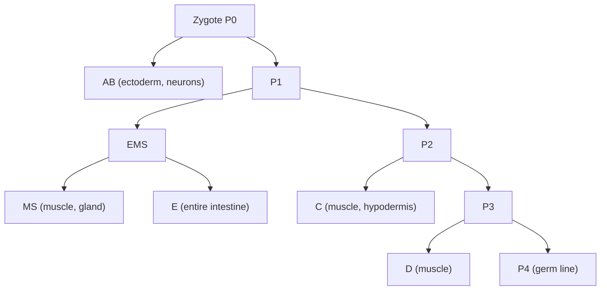
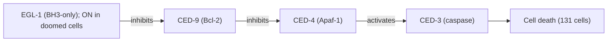
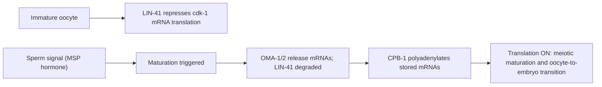
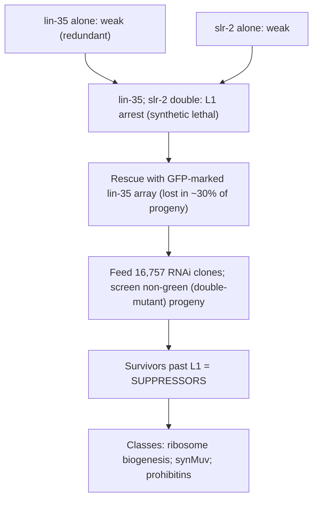

# 유전 모델 — C. elegans

**강의:** BME333 / BIO333 유전학 (UNIST, 2026 가을) · 강의 18 · 약 60분
**강의계획서:** [← 강의계획서](../../lectures/2026.BME333-BIO333-Syllabus.md) — 11주차 수, 2026-11-11
**언어:** [English](../../en/lectures/lec18_Model-Celegans.md) · 한국어

## 학습 목표
이 강의를 마치면 학생들은 다음을 할 수 있어야 한다:
- Sydney Brenner가 왜 *C. elegans*를 선택했는지, 그리고 어떤 특징이 그것을 최고의 후생동물(metazoan) 유전 모델로 만드는지(투명성, 불변 세포 계보, 자웅동체 자가수정, 짧은 생활사) 설명한다.
- 완전한 세포 계보(cell lineage)와 연결체(connectome)를 기초 자원으로서 기술한다.
- *C. elegans*에서의 정방향 유전 스크리닝이 어떻게 발생, 세포 사멸, 행동을 조절하는 유전자를 찾는지 개괄한다.
- 난모세포 성숙(oocyte maturation), 염색체 동역학(예: 위상이성질화효소 II, topoisomerase II), 세포 주기/종양억제 경로(예: LIN-35/Rb)를 해부하는 데 벌레가 어떻게 쓰이는지 설명한다.
- 질병 모델링 및 기능유전체학(functional-genomics) 플랫폼으로서의 벌레의 역할을 이해한다.

## 강의

### 1. Brenner의 비전과 왜 벌레인가 (~10분)

1960년대 초 무렵 분자생물학의 창시자들은 사실상 유전자를 풀어냈다. Sydney Brenner도 여기에 기여했다. Crick 및 동료들과 함께 그는 **전령 RNA(messenger RNA)**의 존재를 입증했고(1961), 유전 부호가 **삼중자(triplet)**로 읽힌다는 것을 확립하는 데 도움을 주었으며(1961), **정지 코돈(stop codon)**을 규명했다(1965)(참조 [en](../../en/review/GeneticsClassic_SydneyBrennder_Celegans.md) · [ko](../../ko/review/GeneticsClassic_SydneyBrennder_Celegans.md)). 그러나 Brenner는 기본 질문들이 "필연적(inevitable)"이 되어 가고 있다고 느꼈고, 지금은 유명해진 1963년 편지에서 그는 **"작은 후생동물을 길들여 발생을 직접 연구하고 싶다"**고 선언했다 — 남은 가장 어려운 두 문제, 즉 수정란이 어떻게 몸을 만드는가, 그리고 신경계가 어떻게 행동을 만들어 내는가에 유전학의 도구를 겨누기 위해서였다.

그의 설계 기준이 생물을 결정했다. 그는 (전체 신경계를 재구성할 수 있도록) **투과전자현미경(transmission electron microscope)의 시야에 들어갈 만큼 작고**, **초파리보다 뉴런이 적으며**, **키우기 쉽고 저렴한** 동물을 원했다. 미세한 토양 선충인 ***Caenorhabditis elegans*** — 약 **1 mm** 길이로, 한천 배지 위에서 *E. coli*를 먹는 — 가 완벽하게 들어맞았다(참조 [en](../../en/review/Brenner2009_Genetics_Celegans.md) · [ko](../../ko/review/Brenner2009_Genetics_Celegans.md)). 네 가지 특징이 그것을 유전학의 꿈으로 만든다:

- **투명성(Transparency)** — 살아 있는 동물 안에서 광학현미경으로 모든 세포가 보이므로, 발생을 추론하는 것이 아니라 *지켜볼* 수 있다.
- **불변 세포 계보(invariant cell lineage)** — 모든 개체가 **동일한 세포를 동일한 패턴으로** 만들어 내므로(절 2 참조), 세포를 이름으로 연구할 수 있다.
- **자가수정 자웅동체(self-fertilizing hermaphrodite)** — 자웅동체는 자신의 정자와 난자를 만들므로, 이형접합체가 **자가수정하여 열성 돌연변이를 자동으로 동형접합화(homozygose)**하는 한편, 드문 **수컷(males)**은 의도적 교배를 가능하게 한다. 이것이 단연 가장 중요한 유전학적 이점이다.
- **짧은 생활사(short life cycle)**(약 3일)와 큰 산자수(자가자손 약 300마리), 그래서 스크리닝이 빠르고 저렴하다.

Brenner는 1967년 10월 첫 EMS 돌연변이 사냥을 시작하여 "총 두 마리의 돌연변이체"를 얻었다 — 짧고 뚱뚱한 몸 때문에 **"dumpy"**로 명명된 **E1**과, "가변적 비정상(variable abnormal)"인 **E2** — 그러고는 스크리닝당 25–30마리의 돌연변이체로 빠르게 개선했다(참조 [en](../../en/review/Brenner2009_Genetics_Celegans.md) · [ko](../../ko/review/Brenner2009_Genetics_Celegans.md)). 획기적인 1974년 논문 *The Genetics of Caenorhabditis elegans*는 여섯 개의 연관군(linkage group) — 염색체 수와 일치하는 — 위에 있는 **약 100개 유전자(96개 유전자좌)**로 지도화되는 **약 300개의 EMS 유도 돌연변이체**를 보고했고, 오늘날에도 벌레 논문에서 *여전히* 의례적으로 인용되는 자웅동체 유전학의 완전한 지침서를 함께 실었다(참조 [en](../../en/review/GeneticsClassic_SydneyBrennder_Celegans.md) · [ko](../../ko/review/GeneticsClassic_SydneyBrennder_Celegans.md)). John Sulston의 **벌레 냉동(freezing worms)** 방법은 장기 계통 보관 — 따라서 하나의 연구 공동체 — 을 가능하게 한 기술적 전제 조건이었다.

**그림 — 왜 *C. elegans*가 최고의 후생동물 유전 모델인가.**

| 특징 | 유전학적 이점 |
|---|---|
| 투명, 약 1 mm, 약 959개 체세포 | 모든 세포를 살아서 관찰; 단일 세포 해상도 |
| 불변 세포 계보 | 어떤 세포든 이름으로 연구; 재현 가능한 운명 |
| 자가수정 자웅동체 | 자가수정 시 열성이 자동으로 동형접합화 |
| 드문 수컷 (타가수정) | 통제된 교배와 상보성(complementation) |
| 약 3일 생활사, 약 300마리 자손 | 빠르고 저렴한 대규모 스크리닝 |

### 2. 기초 자원: 계보와 연결체 (~10분)

벌레의 결정적 자원은 **불변 세포 계보(invariant cell lineage)** — 수정란에서 성체까지의 완전한, 세포 하나하나의 족보로, (주로 Sulston이) 직접 현미경 관찰로 밝혀낸 것 — 이다. 성체 **자웅동체에는 정확히 959개의 체세포(somatic cells)**가 있으며, 그 하나하나가 **모든 개체에서 동일한 분열 순서**를 통해 생겨난다. 이 결정론은 놀라우며 유전학이 할 수 있는 일을 바꾼다. *이름 붙은* 세포가 항상 *이름 붙은* 전구체에서 생겨남을 알기 때문에, 돌연변이가 *어느 세포에서, 어느 분열에서* 어떤 유전자를 교란하는지 정밀하게 물을 수 있다 — 가변적 계보를 가진 동물에서는 불가능한 단일 세포 유전 해부다.

계보는 접합자(P0)의 비대칭 분열로 시작하여 **창시 세포(founder cells)**(AB, MS, E, C, D)와 생식계열(P4)을 설정한다. 모든 조직이 이 나무를 거슬러 추적된다.

**그림 — 불변 세포 계보(창시 세포 골격).**

두 번째 위대한 자원은 **연결체(connectome)** — 자웅동체 신경계의 **약 302개 뉴런**의 완전한 배선도(wiring diagram)로, 연속 절편 전자현미경(serial-section electron microscopy)으로 재구성되었다(Brenner가 EM 크기의 동물을 요구한 이유). 계보와 연결체를 함께 두면 *C. elegans*는 모든 세포와 모든 신경 연결이 목록화된 유일한 동물이 된다 — 모든 돌연변이 표현형을 그 위에 지도화할 수 있는 고정된 해부학적 좌표계다. 이 길을 따라 벌레 공동체는 계보를 완성하고, 연결체를 지도화했으며, **계획된 세포 사멸(programmed cell death)**과 **RNA 간섭(RNA interference)**을 발견했고, 이 업적들은 여러 노벨상으로 인정받았다(Brenner는 2002년 상을 공동 수상)(참조 [en](../../en/review/GeneticsClassic_SydneyBrennder_Celegans.md) · [ko](../../ko/review/GeneticsClassic_SydneyBrennder_Celegans.md)).

### 3. 벌레에서의 정방향 유전학 (~12분)

**정방향 유전학(forward genetics)**은 표현형에서 출발해 유전자로 거슬러 올라간다. 벌레의 작업 흐름은 다음과 같다. 점 돌연변이를 유도하는 화학물질인 **EMS(ethyl methanesulfonate)**로 돌연변이를 일으키고, 돌연변이 처리한 자웅동체가 **자가수정**하도록 하여 열성 돌연변이가 F2에서 자동으로 동형접합화되게 하며(교배 불필요), 그런 다음 관심 표현형을 스크리닝한다. 흥미로운 돌연변이 대부분은 열성이고 동형접합으로는 치사이거나 불임일 수 있으므로, 재조합을 억제하고 눈에 보이는 표지를 지닌 재배열인 **밸런서 염색체(balancer chromosome)**를 사용해 치사 돌연변이를 이형접합 계통으로 유지한다. 이 기구는 **음문(vulval) 발생**, **화학 감각(chemosensation)**(행동유전학), 그리고 — 전형적 사례인 — **계획된 세포 사멸**에 대한 획기적 스크리닝을 이끌었다.

계획된 세포 사멸(**세포자멸사, apoptosis**)은 벌레에서 발생적으로 붙박이되어 있다. 즉, 발생 동안 생성된 세포 중 모든 자웅동체에서 **정확히 131개가** 고정된 일정에 따라 죽는다. 계보가 불변이므로, 그 죽음이 *실패하는* 돌연변이체는 여분으로 생존한 세포로 검출 가능하다 — 그리고 이것이 Horvitz와 동료들이 **ced("cell death abnormal")** 유전자를 분리한 방법이다(Ellis와 Horvitz 1986)(노벨상 맥락은 참조 [en](../../en/review/Bonini2017_Genetics_ModelOrganism.md) · [ko](../../ko/review/Bonini2017_Genetics_ModelOrganism.md)). 두 돌연변이를 결합했을 때 어느 돌연변이 표현형이 이기는지를 묻는 유전적 **상위성(epistasis)**이 유전자들을 하나의 경로로 순서 지었다. 죽을 운명인 세포에서는 **egl-1**이 켜지고, EGL-1은 **CED-9를 억제**하며, CED-9에서 풀려난 **CED-4**는 세포를 처형하는 프로테아제(protease)인 **CED-3**를 활성화한다. 그 보존은 정확하고 심오하다. **CED-9 = Bcl-2, CED-4 = Apaf-1, CED-3 = caspase** — 벌레 경로가 *곧* 인간 세포자멸사 경로이며, 벌레에서 먼저 발견되었다.

**그림 — 핵심 세포자멸사 경로(벌레 유전자; 인간 오솔로그).**

핵심 교훈은 방법론적이다. **불변 계보는 미묘한 생물학적 과정(어느 세포가 죽는가)을 셀 수 있고 스크리닝 가능한 표현형으로 바꾸며**, 상위성은 돌연변이체 모음을 순서 지어진 분자 경로로 전환한다 — 이후 이 분야가 발생, 행동, 그 너머에 적용한 틀이다.

### 4. 염색체 동역학과 난모세포 성숙 (~12분)

**염색체 분리 — 위상이성질화효소 II(topoisomerase II).** Jaramillo-Lambert 등(2016)은 감수분열 동안 염색체가 어떻게 물리적으로 풀리는지를 해부하는 데 벌레를 사용했다(참조 [en](../../en/article/Jaramillo-Lambert2016_Genetics_top2.md) · [ko](../../ko/article/Jaramillo-Lambert2016_Genetics_top2.md)). 그들은 **부성 효과 배아 치사(paternal-effect embryonic-lethal, Pel)** 돌연변이 — *아비*가 정자를 제공하면 배아가 죽지만 야생형 정자에서는 생존하는, 결함을 정자에 국소화하는 — 로 시작했다. 유전자를 찾기 위해 그들은 **하와이안 SNP 지도작성(Hawaiian SNP mapping)**(하와이안 계통 **CB4856**은 **N2 Bristol** 참조 계통과 수천 개의 SNP에서 다르므로, 돌연변이와 연관된 염색체 영역을 추적할 수 있다)과 **전유전체 시퀀싱(whole-genome sequencing)**을 결합하여, 유전자좌를 염색체 III로 좁히고 **Arg828Cys** 미스센스 변화를 일으키는 ***top-2***(위상이성질화효소 II; 인간 TOP2A/2B의 벌레 오솔로그) 내 **C2977T** 치환을 정확히 짚어냈다. 코돈을 아르기닌으로 되돌리는 **CRISPR-Cas9 복귀(reversion)**가 인과성을 확인했다 — 현대적 돌연변이 규명의 깔끔한 시연이다.

표현형은 극적이었다. 제한 온도(25 °C)에서 *top-2(it7ts)* 수컷의 **정자세포(spermatid) 953개 전부**가 **무핵(anucleate)**(염색질이 완전히 결여됨)이었던 반면, 야생형 수컷의 **정자세포 733개 전부**는 정상 염색질을 함유했다(참조 [en](../../en/article/Jaramillo-Lambert2016_Genetics_top2.md) · [ko](../../ko/article/Jaramillo-Lambert2016_Genetics_top2.md)). 제1 후기(Anaphase I)에서는 **염색질 다리(chromatin bridges)** — 분리되지 못하는 염색체 — 가 나타나, TOP-2가 상동체가 갈라질 수 있도록 염색체의 위상적 연쇄(catenation, 상호연결)를 해소함을 증명했다. 결정적으로, (감수분열 이중가닥 절단을 만드는) ***spo-11***과의 **이중 돌연변이체**는 *top-2* 결함을 억제하지 **못했고**, 이는 TOP-2의 풀어내는 역할이 **교차 재조합(crossover recombination)과 무관함**을 보여 준다. TOP2 억제제(doxorubicin, etoposide)가 일선 화학요법제이므로, 감수분열 특이적 TOP2 생물학은 임신 능력(fertility)에도 관련된다.

**그림 — *top-2* 지도작성과 표현형.**

| 단계 | 결과 |
|---|---|
| 출발 표현형 | 부성 효과 배아 치사 (정자의 결함) |
| 지도작성 방법 | 하와이안(CB4856) SNP 지도작성 + 전유전체 시퀀싱 |
| 병변 | *top-2* C2977T → Arg828Cys (chr III); CRISPR 복귀로 확인 |
| 정자세포 표현형 (25 °C) | 돌연변이 953/953 무핵 대 WT 733/733 염색질 함유 |
| 제1 후기 | 염색질 다리 (해소되지 않은 연쇄) |
| *spo-11* 이중 돌연변이체 | 억제 없음 → TOP-2 역할은 DSB/교차와 무관 |

**난모세포 성숙 — 번역 스위치.** Tsukamoto 등(2017)은 휴면 상태의 난모세포가 어떻게 성숙하여 배아가 되도록 촉발되는지를 해부하는 데 벌레를 사용했다(참조 [en](../../en/article/Tsukamoto2017_Genetics_CelegansOocyeMaturation.md) · [ko](../../ko/article/Tsukamoto2017_Genetics_CelegansOocyeMaturation.md)). 촉발 인자는 정자 신호다. 즉, **주요 정자 단백질(major sperm protein, MSP)**은 세포골격 요소로서뿐 아니라 난모세포에게 성숙하라고 지시하는 **호르몬(hormone)**으로 작용한다(참조 [en](../../en/review/Tsukamoto2017_Thurtle-Schmidt2018_GeneticsPrimer_CelegansOocyteMaturation.md) · [ko](../../ko/review/Tsukamoto2017_Thurtle-Schmidt2018_GeneticsPrimer_CelegansOocyteMaturation.md)). 그 제어는 RNA 결합 단백질로 만들어진 **번역 억제-대-활성화 스위치(translational repression-to-activation switch)**다. 미성숙 난모세포에서는 **TRIM-NHL 단백질 LIN-41**이 표적 mRNA(특히 ***cdk-1***)에 결합하여 그 **번역을 억제**함으로써 조기 감수분열 진입을 막는다. 성숙이 촉발되면 **OMA-1/OMA-2** 단백질이 작용하여 그 **mRNA를 방출**하고, LIN-41이 분해되며, **CPB-1(CPEB 오솔로그)**가 저장된 메시지를 활발히 번역되는 것으로 바꾸는 **폴리아데닐화(polyadenylation)**를 촉진한다 — 억제를 활성화로 뒤집어 **난모세포-배아 전이(oocyte-to-embryo transition)**를 몰아간다.

**그림 — LIN-41 / OMA 번역 스위치.**

이 연구는 또한 고전적 벌레 유전학이 현대 유전체학과 어떻게 융합하는지를 보여 준다. 즉, 표적은 **PAR-CLIP**과 **RIP**으로, 전사체는 **RNA-seq**로, 폴리(A) 꼬리 동역학은 **PAT-seq**로 지도화되었다 — 벌레의 투명하고 조작 가능한 생식계열이 가능하게 한 시스템 수준의 해부다(참조 [en](../../en/article/Tsukamoto2017_Genetics_CelegansOocyeMaturation.md) · [ko](../../ko/article/Tsukamoto2017_Genetics_CelegansOocyeMaturation.md)).

### 5. 세포 주기와 종양억제 경로 (~10분)

벌레는 **망막모세포종(retinoblastoma, Rb) 종양억제** 경로에도 깔끔한 시스템이다. **LIN-35**는 포유류 **Rb**의 *C. elegans* 오솔로그로, **E2F** 전사 인자를 억제하여 세포 주기 정지를 강제하고 암을 억제한다(참조 [en](../../en/review/Polly2012_Stacio2012_GeneticsPrimer_LIN-35.md) · [ko](../../ko/review/Polly2012_Stacio2012_GeneticsPrimer_LIN-35.md)). 그러나 *lin-35* 상실만으로는 약한 표현형만 나타난다 — 두 번째 유전자가 첫 번째를 대신 감당하는 **유전적 중복성(genetic redundancy)**의 고전적 문제다. 벌레의 해법은 **합성 표현형(synthetic phenotype)** — **두** 유전자가 함께 상실될 때만 나타나는 심각한 결함 — 이다. *lin-35*를 (아연 손가락 전사 인자인) ***slr-2***의 상실과 결합하면 두 단일 돌연변이체 중 어느 것도 그렇지 않은데도 장(intestine) 기능 상실로 인한 **이른 L1 유충 정지(early L1 larval arrest)**가 일어난다 — LIN-35와 SLR-2가 **부분적으로 중복된** 장 경로에서 작용한다는 증거로, 단일 유전자 분석으로는 보이지 않는 관계다. 이것이 *C. elegans* **synMuv(synthetic multivulva)** 유전학의 논리를 크게 쓴 것이다.

Polley와 Fay(2012)는 이후 이 합성 치사 상호작용을 **유전체 전반의 RNAi 억제자 스크리닝(genome-wide RNAi suppressor screen)**을 통해 발견 엔진으로 바꾸었다 — **역방향 유전학(reverse genetics)**(유전자 → 표현형)의 아름다운 사례다. *lin-35; slr-2* 이중 돌연변이체는 L1에서 죽으므로, 그들은 **GFP**로 표지된 **염색체외 배열(extrachromosomal array)** 상의 구제용 야생형 *lin-35* 트랜스진으로 이들을 살려 두었다. 그런 배열은 **자손의 약 30%에서 소실**되므로, 초록색이 아닌 자손이 정지된 이중 돌연변이체다. GFP 양성 어미에게 **16,757개의 서로 다른 RNAi 세균 클론**(각각 하나의 유전자를 녹다운)을 먹이고 **L1을 넘어 생존하는 초록색이 아닌 자손**을 찾으면, 그 녹다운이 합성 치사 정지를 **억제**하는 어떤 유전자든 규명된다(참조 [en](../../en/review/Polly2012_Stacio2012_GeneticsPrimer_LIN-35.md) · [ko](../../ko/review/Polly2012_Stacio2012_GeneticsPrimer_LIN-35.md)). 억제자는 세 부류로 나뉘었다. **리보솜 생성(ribosome-biogenesis)** 유전자, 알려진 **synMuv** 억제자, 그리고 **프로히비틴(prohibitins)**이다.

**그림 — 합성 표현형과 RNAi 억제자 스크리닝.**

### 6. 질병 및 기능유전체학 모델로서의 벌레 (~4분)

이 사례 연구들은 일반화된다. *C. elegans*는 **먹이 기반 RNAi(feeding-based RNAi)** — 이중가닥 RNA를 발현하는 세균을 벌레에게 그냥 먹이면 일치하는 유전자가 녹다운된다 — 에 유독 감수성이 높기 때문에, **유전체 규모 RNAi 라이브러리(genome-scale RNAi libraries)**로 연구자는 **모든 유전자**를 체계적으로 녹다운하고 표현형을 읽어 낼 수 있다. 이는 Bonini와 Berger가 현대 기능유전체학의 특징으로 강조한 접근이다(참조 [en](../../en/review/Bonini2017_Genetics_ModelOrganism.md) · [ko](../../ko/review/Bonini2017_Genetics_ModelOrganism.md)). 깊은 **보존(conservation)**(세포자멸사 경로 = 인간 Bcl-2/Apaf-1/caspase; LIN-35 = Rb; LIN-41 = TRIM71; TOP-2 = 인간 TOP2)과 결합하여, 벌레는 인간 질병 유전자 기능을 검사하고, 보존된 경로를 해부하며, 변형자를 스크리닝하는 빠른 생체 내(in-vivo) 플랫폼으로 기능한다 — 강의 16의 질병 모델링 논리를, 투명한 1 mm 동물에서 실행하는 것이다.

### 7. 마무리 및 토론 (~2분)

Brenner의 도박 — 셀 수 있는 세포 집합을 가진 작고 투명한 자가수정 선충이 발생과 행동을 풀 수 있으리라는 — 은 눈부시게 성공했다. 그것의 **불변 계보**와 **연결체**는 고정된 좌표계를 주고, 그것의 **자웅동체 자가수정**은 열성 스크리닝을 사소하게 만들며, 그것의 **먹이 RNAi**는 유전체 규모의 역방향 유전학을 가능하게 하고, 그것의 **깊은 보존**은 세포자멸사에서 Rb 경로에 이르기까지 모든 발견을 인간 생물학으로 되돌려 나른다.

## 핵심 정리
- Brenner는 발생과 신경계를 직접 연구하려고 *C. elegans*를 선택했다: **투명, 약 959개 체세포, EM 크기, 약 3일 주기**, 그리고 열성을 자동으로 동형접합화하는 **자가수정 자웅동체**(드문 수컷 포함).
- **불변 세포 계보**(모든 세포가 이름 붙고 재현 가능)와 **약 302개 뉴런 연결체**는 단일 세포 유전 해부를 위한 고정된 해부학적 틀이다.
- **정방향 유전학** = EMS 돌연변이 유발 + 자가수정 + (치사에는 밸런서). **세포자멸사** 스크리닝(정확히 131개의 발생적 죽음)은 보존된 **EGL-1 ⊣ CED-9 ⊣ CED-4 → CED-3** 경로(= BH3/Bcl-2/Apaf-1/caspase)를 정의했다.
- **top-2**는 하와이안 SNP 지도작성 + WGS로 지도화되었고(Arg828Cys, CRISPR로 확인), TOP-2는 **SPO-11/교차와 무관하게** 염색체 연쇄를 해소한다(돌연변이 정자세포 953/953 무핵).
- **난모세포 성숙**은 정자 호르몬 **MSP**로 촉발되는 **LIN-41 → OMA 번역 억제-대-활성화 스위치**로, 난모세포-배아 전이에서 저장된 mRNA를 활발한 번역으로 전환한다.
- **LIN-35/Rb**는 **유전적 중복성**을 보인다. *lin-35; slr-2* **합성 치사** 표현형이 유전체 전반의 **RNAi 억제자 스크리닝**(16,757개 클론; GFP 배열 요령)을 가능하게 했다 — 역방향 유전 경로 해부의 전형.
- 먹이 기반 **RNAi 라이브러리**와 깊은 **보존**은 벌레를 빠른 기능유전체학 및 질병 모델링 플랫폼으로 만든다.

## 교재 참고
- **Genetics: From Genes to Genomes (8e)** — Ch. 8 Using Mutations to Study Genes; Ch. 22 Genetic Analysis of Development (모델 생물 맥락). → [textbook ref](../../lectures/ref.Genetics-FromGenesToGenomes.md)

## 이 저장소의 노트
수업에서 소개할 리뷰와 논문 (각각 en/ko 이중언어 쌍이 있음):
- `Brenner2009_Genetics_Celegans` — *C. elegans*를 확립한 Brenner 자신의 기록; 이 모델의 창시적 근거. · [en](../../en/review/Brenner2009_Genetics_Celegans.md) · [ko](../../ko/review/Brenner2009_Genetics_Celegans.md)
- `GeneticsClassic_SydneyBrennder_Celegans` — Brenner의 기념비적 벌레 유전학 논문에 대한 Genetics "Classic" 논평. · [en](../../en/review/GeneticsClassic_SydneyBrennder_Celegans.md) · [ko](../../ko/review/GeneticsClassic_SydneyBrennder_Celegans.md)
- `Tsukamoto2017_Genetics_CelegansOocyeMaturation` — 벌레에서 난모세포 성숙 제어에 대한 원 연구. · [en](../../en/article/Tsukamoto2017_Genetics_CelegansOocyeMaturation.md) · [ko](../../ko/article/Tsukamoto2017_Genetics_CelegansOocyeMaturation.md)
- `Tsukamoto2017_Thurtle-Schmidt2018_GeneticsPrimer_CelegansOocyteMaturation` — 학생을 위해 난모세포 성숙 논문을 풀어낸 교육용 프라이머. · [en](../../en/review/Tsukamoto2017_Thurtle-Schmidt2018_GeneticsPrimer_CelegansOocyteMaturation.md) · [ko](../../ko/review/Tsukamoto2017_Thurtle-Schmidt2018_GeneticsPrimer_CelegansOocyteMaturation.md)
- `Jaramillo-Lambert2016_Genetics_top2` — 벌레 염색체 분리에서 위상이성질화효소 II의 기능; 정방향 유전학 사례 연구. · [en](../../en/article/Jaramillo-Lambert2016_Genetics_top2.md) · [ko](../../ko/article/Jaramillo-Lambert2016_Genetics_top2.md)
- `Polly2012_Stacio2012_GeneticsPrimer_LIN-35` — LIN-35/Rb와 synMuv 유전학에 대한 프라이머; 경로/유전적 상호작용 해부를 예시. · [en](../../en/review/Polly2012_Stacio2012_GeneticsPrimer_LIN-35.md) · [ko](../../ko/review/Polly2012_Stacio2012_GeneticsPrimer_LIN-35.md)

## 토론 문제
1. 자가수정은 벌레의 단연 최대 유전학적 이점이라 불린다. 이형접합체를 자가수정하는 것이 어떻게 F2에서 열성 돌연변이를 자동으로 동형접합화하는지, 그리고 왜 이것이 파리나 생쥐보다 벌레에서 열성 스크리닝을 훨씬 쉽게 만드는지 설명하라.
2. 세포자멸사 경로는 상위성에 의해 EGL-1 ⊣ CED-9 ⊣ CED-4 → CED-3로 순서 지어졌다. 정상적으로 정확히 131개 세포가 죽는다는 점을 감안하여, *ced-3* 기능상실 돌연변이체와 *egl-1* 기능획득 돌연변이체의 표현형(여분의 세포 대 소실된 세포)을 예측하고, 불변 계보가 어떻게 이 표현형들을 채점 가능하게 만드는지 설명하라.
3. *top-2* 연구에서 *spo-11* 이중 돌연변이체는 결함을 억제하지 못했다. SPO-11이 무엇을 하는지, 그리고 왜 이 음성 결과가 TOP-2가 교차 재조합과 무관하게 염색체 연쇄에 작용함을 보여 주는지 설명하라.
4. LIN-41과 OMA 단백질은 둘 다 CDK-1 활성화에 영향을 주지만 반대의 돌연변이 표현형을 가지며, *lin-35* 단독은 거의 침묵한다. "번역 억제-대-활성화 스위치"와 "유전적 중복성 / 합성 표현형"을 사용해, 각각의 경우 왜 단일 유전자 분석이 불충분했는지 설명하라.
5. *lin-35; slr-2* 억제자 스크리닝은 자손의 약 30%에서 소실되는 염색체외 GFP 배열에 의존했다. 배열 소실이 어떻게 이중 돌연변이체를 규명하는 데 쓰이는지, 그리고 왜 유전체 전반의 RNAi 먹이 라이브러리가 이것을 *역방향* 유전(유전자-대-표현형) 접근으로 만드는지 설명하라.
