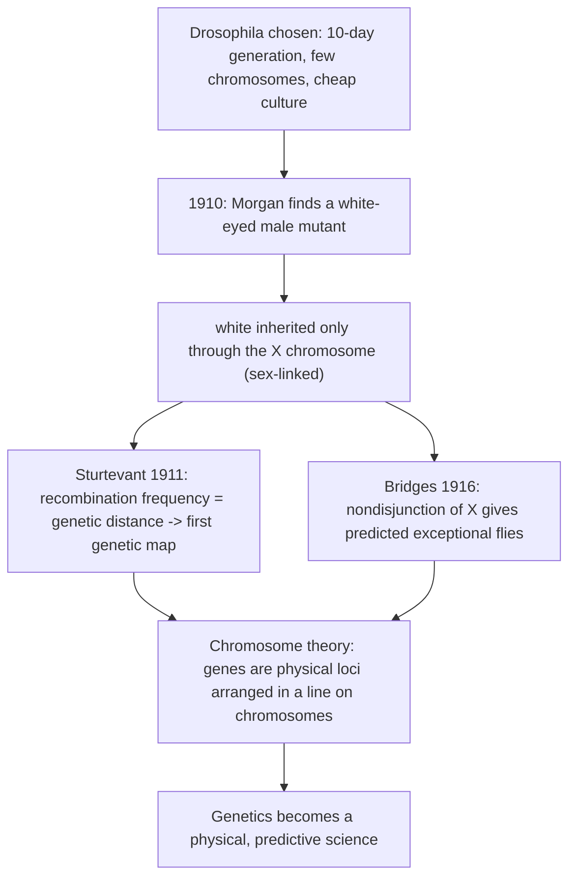
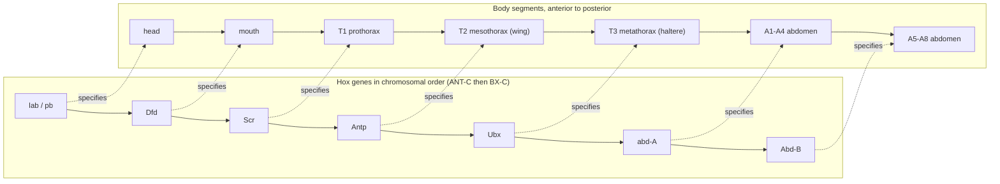
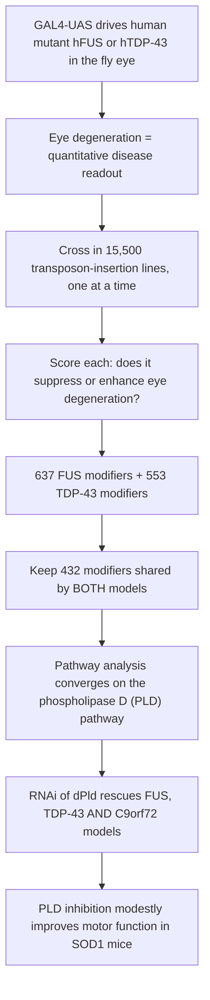

# 유전 모델 생물 — 초파리 (Drosophila)

**강의:** BME333 / BIO333 유전학 (UNIST, 2026 가을) · 19강 · ~60분
**강의계획서:** [← 강의계획서](../../lectures/2026.BME333-BIO333-Syllabus.md) — 12주차 월요일, 2026-11-16
**언어:** [English](../../en/lectures/lec19_Model-Fruitfly.md) · 한국어

## 학습 목표
이 강의를 마치면 학생들은 다음을 할 수 있어야 합니다:
- *초파리(Drosophila melanogaster)*가 어떻게 염색체 유전학과 발생 유전학의 시조 모델이 되었는지 설명한다.
- 모건(Morgan) 그룹이 *초파리*(white 유전자, 비분리(nondisjunction))를 이용해 유전의 염색체설(chromosome theory of heredity)을 증명하고 최초의 유전자 지도를 만든 과정을 추적한다.
- 감수분열 돌연변이체와 지도작성 도구가 어떻게 재조합(recombination)과 유전자 순서를 확립했는지 기술한다.
- 호메오틱 유전자(homeotic gene)(안테나페디아(Antennapedia)/바이소락스(Bithorax) 복합체)가 몸의 기본 설계(body plan)에 대한 유전적 조절을 어떻게 밝혀냈는지 설명한다.
- 질병 모델링(예: ALS 수식인자 스크리닝)에서 *초파리*가 현대적으로 활용되는 방식을 이해한다.

## 강의

### 1. 모건의 파리 방: 모델 생물의 탄생 (~10분)

1900년까지 멘델의 법칙은 재발견되었지만, 그것은 추상적이었다. "인자(factor)"가 물리적으로 무엇이며 세포 안 어디에 존재하는지 아무도 몰랐다. 멘델식 장부 기록을 세포생물학으로 바꾼 생물은 바로 **초파리(*Drosophila melanogaster*)** — 토머스 헌트 모건(Thomas Hunt Morgan)이 1908년경 컬럼비아 대학교의 비좁은 방에서 사육하기 시작한 3mm 크기의 곤충으로, 그 방은 **"파리 방(fly room)"**으로 유명해졌다. 파리의 장점은 당시에도 그랬고 지금도 결정적이다. **약 10일의 세대 기간**, **암컷 한 마리당 수백 마리의 자손**, 으깬 바나나를 넣은 우유병에서의 저렴한 배양, 그리고 무엇보다 단 **네 쌍의 염색체(2n = 8)** — 그중 하나는 아주 작은 "점" 모양의 4번 염색체다. 적은 수의 염색체와 많은 자손은 유전을 통계적으로 추적하고 교배 결과를 현미경으로 관찰한 것과 상관지을 때 정확히 필요한 조건이다.

모건 자신은 뜻밖의 개종자였다. 그는 **발생학자**였고, 처음에는 멘델주의를 결과를 사후에 설명하려고 보이지 않는 인자를 끌어들이는 "고등한 요술(superior jugglery)"이라며 회의적으로 일축했다(참조 [en](../../en/review/Green2010_Genetics_WhiteGene-DrosophilaCentury.md) · [ko](../../ko/review/Green2010_Genetics_WhiteGene-DrosophilaCentury.md)). 그는 부분적으로 멘델주의를 스스로 비판적으로 검증하기 위해 파리를 사육하기 시작했다. 그를 개종시킨 것은 단 하나의 돌연변이체(2절 참조)였고, 그 개종을 혁명적으로 만든 것은 그가 모은 재능 있는 학생 무리 — **알프레드 스터트번트(Alfred Sturtevant)**, **캘빈 브리지스(Calvin Bridges)**, **헤르만 뮐러(Hermann Muller)** — 였다. 파리 방의 문화는 협력적이면서 치열하게 경쟁적이었고, **"예외를 소중히 여기라(treasure your exceptions)"**는 정신이 지배했다. 거의 모든 진전이 예상대로 행동하지 않는 수수께끼 같은 파리에서 나왔기 때문이다.

그 문화의 대표적 산물이 최초의 **유전자 지도(genetic map)**였다. 1911년, 아직 학부생이던 스터트번트는 두 유전자 사이의 재조합 빈도를 염색체상 **두 유전자 간 거리의 척도**로 사용할 수 있음을 깨닫고, 하룻밤 사이에 여섯 개의 성연관(sex-linked) 유전자에 대한 최초의 **선형 유전자 지도**를 그려냈다 — 유전자 **지도작성(mapping)**의 창시적 행위였다(참조 [en](../../en/review/Provine1991_Genetics_Sturtevant-Drosophila.md) · [ko](../../ko/review/Provine1991_Genetics_Sturtevant-Drosophila.md)). 스터트번트는 또한 그룹에서 가장 깊이 있는 진화론적 사상가였다. 1919년 그는 모두가 "*Drosophila melanogaster*"라 부르던 것이 실은 두 종임을 밝혀 자매종을 ***Drosophila simulans***로 명명했고, (모든 잡종이 불임이었으므로) 기발한 대립유전자 검정(allelism test)을 사용해 두 종 사이의 평행 돌연변이, 세포질 모계 효과, 염색체 역위(inversion)를 입증했다 — 심지어 그 용어가 생기기도 전에 무작위 유전적 부동(random genetic drift)을 예견하기까지 했다(참조 [en](../../en/review/Provine1991_Genetics_Sturtevant-Drosophila.md) · [ko](../../ko/review/Provine1991_Genetics_Sturtevant-Drosophila.md)).

**그림 — 파리 방의 논리: 하나의 돌연변이체에서 염색체설까지.**



### 2. white 유전자와 염색체설 (~10분)

**1910년 1월**, 모건은 붉은 눈 파리 수천 마리 가운데 **흰 눈**을 가진 수컷 한 마리를 발견했다. 그는 이 유전자를 ***white***로 명명했고 — 이 하나의 유전자좌(locus)는 유전학의 한 세기를 들여다보는 렌즈가 된다(참조 [en](../../en/review/Green2010_Genetics_WhiteGene-DrosophilaCentury.md) · [ko](../../ko/review/Green2010_Genetics_WhiteGene-DrosophilaCentury.md)). 당장의 수수께끼는 그 유전 양상이었다. 모건이 이 흰 눈 수컷을 정상 붉은 눈 암컷과 교배했을 때, F1은 모두 붉은색이었다(붉은색이 **우성**이다). 그러나 F2는 이상했다. 흰 눈이 예상대로 파리의 약 1/4에서 다시 나타났지만 **오직 수컷에서만** 나타났다. 이 형질은 마치 성(sex)에 묶여 있는 것처럼 행동했다.

모건의 설명은 구체적 형태의 **유전의 염색체설(chromosome theory of heredity)**의 탄생이었다. 암컷 파리는 두 개의 X 염색체(XX)를 가지고, 수컷은 하나의 X와 하나의 Y(XY)를 가진다. 만약 *white*가 **X 염색체 위에** 있고 Y에는 대응 유전자가 없다면, 이 형질의 유전은 X의 유전을 따라야 한다 — 이것이 **성연관(sex linkage)**이다. 수컷은 X를 하나만 가지므로 그가 그 위에 지닌 대립유전자가 무엇이든 발현되며, 그것을 가릴 두 번째 사본이 없다. 이것은 **특정 유전자를 특정 염색체에 처음으로 국재화(localization)**한 사례였고, 멘델의 추상적인 "인자"를 눈에 보이는 구조 위에 실려 다니는 물리적 대상으로 바꾸어 놓았다.

역교배는 이 논리를 생생하게 보여주며, **엇갈림 유전(criss-cross inheritance)** — 어머니에게서 아들로 형질이 전달되는 것 — 의 고전적 시연이다.

**그림 — white 눈에 대한 역교배가 X 연관을 드러낸다.** (white를 지닌 X = Xw; 야생형 X = X+.)

| 교배 | F1 딸 | F1 아들 |
|---|---|---|
| white 수컷 (Xw Y) × red 암컷 (X+ X+) | X+ Xw — **모두 red** | X+ Y — **모두 red** |
| red 수컷 (X+ Y) × white 암컷 (Xw Xw) | X+ Xw — **모두 red** | Xw Y — **모두 white** (엇갈림) |

두 번째 교배에서 아들은 유일한 X를 흰 눈 어머니로부터 받으므로 모두 흰 눈이고, 딸은 아버지로부터 야생형 X를 받으므로 붉은 눈 보인자(carrier)가 된다 — 유전자가 물리적으로 X 위에 존재한다고 하지 않으면 설명할 수 없는 양상이다. 이후 한 세기에 걸쳐 *white* 유전자좌는 거의 모든 주요 유전 현상을 예시하게 된다. **위치효과 얼룩변이(position-effect variegation)**(뮐러, 1930 — 역위로 *white*를 중심절 이질염색질(centromeric heterochromatin) 옆으로 옮기면 부분적으로 침묵되어, 염색질 기반의 후성유전적 조절을 드러낸다), **양적 보정(dosage compensation)**(XX와 XY 사이에서 X 연관 발현을 균등화), **이동성 DNA 요소(mobile DNA elements)**(전이인자(transposon) 삽입으로 인한 불안정한 *white* 대립유전자로, 매클린톡(McClintock)의 옥수수 요소와 평행), 그리고 이것은 **최초로 클로닝된 *D. melanogaster* 유전자**가 되었다(*copia* 전이인자로 표지된 *white-apricot* 대립유전자, 1981년)(참조 [en](../../en/review/Green2010_Genetics_WhiteGene-DrosophilaCentury.md) · [ko](../../ko/review/Green2010_Genetics_WhiteGene-DrosophilaCentury.md)).

### 3. 염색체설의 증거로서의 비분리 (~10분)

모건의 성연관 논증은 강력했지만, 회의론자는 여전히 유전자와 염색체가 단지 *상관*할 뿐 — 어쩌면 "세포 전체"가 유전을 담당하고 염색체와의 평행은 우연 — 이라고 반박할 수 있었다. 캘빈 **브리지스(Bridges)**는 1916년 창간호 저널 *Genetics*에 실은 논문에서 이 반박을 무너뜨렸는데, 그 논리는 지금도 엄밀함의 본보기로 남아 있다. **"유전의 염색체설의 증거로서의 비분리(Non-disjunction as proof of the chromosome theory of heredity)"**(참조 [en](../../en/article/Bridges1916_Genetics_NonDisjunction-SexChromosome.md) · [ko](../../ko/article/Bridges1916_Genetics_NonDisjunction-SexChromosome.md)).

핵심 아이디어는 **염색체 행동의 드문 실수를 이용해 예측을 정확히 검증하는 것**이다. **비분리(nondisjunction)**는 감수분열 중 짝을 이룬 염색체가 분리되지 못하는 것이다. 성연관 열성 표지를 지닌 두 개의 X 염색체를 가진 암컷(브리지스는 ***vermilion***, 즉 열성 눈색 돌연변이를 사용)에서 **1차 비분리(primary nondisjunction)**는 때때로 두 X를 같은 난자로 보내(XX 난자) 그 자매 난자에는 하나도 보내지 않는다("O" 난자, X 없음). 유전자가 염색체를 타고 다닌다면, 이 비정상 난자들이 수정되었을 때 그 자손의 *염색체 구성*과 *성연관 표현형*은 엄격히 예측 가능한 방식으로 일치해야 한다 — 브리지스가 **분포의 동일성(identity of distribution)**이라 부른 관계다.

**그림 — X 염색체 비분리가 예측하는 예외적 자손.** 어머니 = 비분리를 겪는 vermilion 암컷(Xv Xv); 아버지 = 야생형 수컷(X+ Y).

| 난자 (어머니로부터) | 정자 (아버지로부터) | 접합자 | 성/운명 | 눈 표현형 |
|---|---|---|---|---|
| X+ (정상) | X+ | X+ Xv | 정상 딸 | 야생형 |
| Xv (정상) | Y | Xv Y | 정상 아들 | vermilion |
| **Xv Xv** (비분리) | Y | **Xv Xv Y** | **예외적 딸** (가임) | **vermilion (모계형 — 어머니와 같음)** |
| **O** (비분리) | X+ | **X+ O** | **예외적 아들** (불임) | **야생형 (부계형 — 아버지와 같음)** |
| Xv Xv | X+ | Xv Xv X+ (XXX) | 대개 죽음 | — |
| O | Y | O Y (X 없음) | 죽음 | — |

두 예외적 부류가 핵심이다. **모계형(matroclinous) XXY 딸**은 어머니의 열성 형질을 보이고(두 X를 모두 어머니로부터 받았으므로), **XO 아들**은 아버지의 형질을 보인다(유일한 X가 아버지로부터 왔으므로) — 정상적인 성연관 유전과 정확히 반대다. 브리지스는 이 예측된 핵형(karyotype)을 현미경으로 **세포학적으로** 확인했다. 그는 더 나아갔다. XXY 암컷은 그 자체로 가임이며 **2차 비분리(secondary nondisjunction)**를 겪는데, 그는 X–Y 쌍짓기 빈도(~16.5%)로부터 그 비율을 약 **4.3%**로 계산했고 수만 마리의 파리에서 이를 검증했다. 그는 또한 이 예외적 파리에서 **상염색체(autosomal) 유전자는 정상적으로 유전됨**을 보였다 — 오직 X 연관 형질만이 이상 양상을 보였으며, 이는 교란이 성염색체에 특이적임을 증명했다. 순전히 염색체 행동에서 도출된 정량적 예측이 교배 데이터와 1퍼센트 미만의 오차로 일치할 때, 우연은 더 이상 성립할 수 없다. **유전자는 염색체 위에 있다.** 덤으로, 이것은 **성염색체 이수성(sex-chromosome aneuploidy)**(XO, XXY, XYY)에 대한 최초의 체계적 기술이었으며, 터너 증후군(45,X)과 클라인펠터 증후군(47,XXY) 같은 인간 질환에 대한 우리 이해의 직접적 선조다.

### 4. 재조합, 연관, 그리고 감수분열 돌연변이체 (~8분)

스터트번트의 지도가 작동한 것은 같은 염색체 위의 유전자들이 **연관(linked)**되어 있기 때문이다 — 함께 유전될 때가 많다 — 그러나 연관은 불완전한데, 감수분열 중 **교차(crossing over)**가 상동 염색체 사이에서 대립유전자를 뒤섞기 때문이다. 두 유전자좌 사이의 **재조합 빈도(recombination frequency)**는 재조합형 자손의 백분율로 측정되며 둘 사이의 물리적 거리에 비례한다. **1% 재조합 = 1 지도 단위(centimorgan)**. 멀리 떨어진 유전자들은 너무 자주 재조합하여 비연관처럼 보이고(50%에 근접, 멘델의 독립분리), 가까운 유전자들은 드물게 재조합하며 한 단위로 함께 이동한다.

**그림 — 스터트번트의 1911년 지도의 정신을 따른 성연관(X) 연관 지도 도식.** 거리는 순서 지어진 유전자좌 사이의 예시적 지도 단위(cM)다.

```
X chromosome (Drosophila)
  |------8.0------|----5.5----|-------20.0-------|----10.5----|
 yellow        white      vermilion          miniature      rudimentary
 (body)        (eye)        (eye)             (wing)          (wing)
  0.0          1.5          33.0               36.1            54.5   (cM positions)
```

그러나 재조합과 염색체 분리는 자동으로 일어나지 않는다 — 그것들은 **유전자에 의해 암호화된 기구(machinery)**에 의해 수행되며, 그 유전자들 자체가 돌연변이되어 연구될 수 있다. 이것이 최초의 체계적 **감수분열 돌연변이체 스크리닝**의 통찰이었다. 1968년 이전에 *초파리*에서는 오직 세 개의 감수분열 돌연변이체만 알려져 있었고, 각각 우연히 발견된 것이었다. 그 후 샌들러(Sandler), 린즐리(Lindsley)와 동료들(1968)이 **감수분열 돌연변이체를 분리하기 위해 고안된 최초의 의도적 스크리닝**을 수행했다(참조 [en](../../en/review/Hawley1993_Genetics_MeioticMutants-Drosophila.md) · [ko](../../ko/review/Hawley1993_Genetics_MeioticMutants-Drosophila.md)). 당시 좋은 화학 돌연변이원이 없었기에 그들은 **하디–바인베르크(Hardy–Weinberg) 논리**를 적용했다. 열성 감수분열 돌연변이는 야생 집단에서 이형접합자로서 돌연변이율의 *제곱근*에 가까운 빈도로 존재할 것이며 — 새로 유도된 돌연변이보다 훨씬 흔할 것이다. 그래서 그들은 문자 그대로 로마 인근(와이너리와 청과 도매시장 포함)에서 파리를 채집하여 회수한 염색체를 동형접합으로 만들고 **비분리** 증가 여부를 검사했다. 암컷에서 검사한 118개의 염색체 세트 중 11개가 비분리를 유의미하게 높였다. 베이커(Baker)와 카펜터(Carpenter)(1972)가 EMS 기반 스크리닝으로 뒤를 이어 — *mei-9, mei-41, mei-218, nod* — 돌연변이체를 회수했고, 이는 20년간의 연구를 이끌었다.

이 돌연변이체들은 **감수분열을 유전적으로 분리 가능한 단계들로 해부했다**. 그들은 *초파리* 암컷이 **두 개의 분리 체계**를 운영함을 확인했다. **키아스마형(chiasmate)** 체계(교차에 의해 인도되는 분리)와 재조합에 실패한 염색체를 위한 별도의 **분배형/무키아스마형(distributive/achiasmate)** 체계(나중에 키네신 유사 운동 단백질을 암호화하는 것으로 밝혀진 유전자 *nod*가 여기서 중심이다). 다른 유전자들(*mei-S332, ord*)은 **자매염색분체 응집(sister-chromatid cohesion)**을 조절한다. 놀랍게도 많은 재조합 결함 돌연변이체가 *또한* 돌연변이원 민감성이며 DNA 수선 결함을 보여, 감수분열 재조합 기구를 DNA 수선과 물리적으로 연결지었다 — 이 연결은 이제 암 소인과 인간 이수성 이해의 중심에 있다(참조 [en](../../en/review/Hawley1993_Genetics_MeioticMutants-Drosophila.md) · [ko](../../ko/review/Hawley1993_Genetics_MeioticMutants-Drosophila.md)).

### 5. 발생의 유전적 조절: 호메오틱 유전자 (~12분)

발생학자 모건은 자신의 본래 질문 — 유전자가 어떻게 몸을 만드는가? — 을 결코 포기하지 않았고, 파리의 가장 위대한 유산은 아마도 **발생 유전학**에 있을 것이다. 이른 시기의, 거의 감춰진 실마리가 1912년경 모건 자신의 독특한 유전자 표기법에 나타난다. 포크(Falk)와 슈워츠(Schwartz)(1993)가 보였듯이, 모건은 날개 돌연변이를 각 유전자가 뚜렷한 **발생 단계**를 나타내도록 기호화했다. 한 인자를 잃어도 날개가 없어지는 것이 아니라 나머지 인자들이 만든 "**잔여물(residuum)**"이 남았는데, (모건이 쓰기를) 날개 생산에 관여하는 "인자가 수백 개"일 수 있기 때문이다(참조 [en](../../en/review/Falk1993_Genetics_Morgan-GeneticControlDevelopment.md) · [ko](../../ko/review/Falk1993_Genetics_Morgan-GeneticControlDevelopment.md)). 여기에 우리가 여전히 가르치는 두 개념이 담겨 있다. 유전자와 형질 사이의 **다대다 관계(many-to-many relationship)**와 **다면발현(pleiotropy)**(하나의 유전자가 여러 형질에 영향). 모건은 이 표기법을 비실용적이라며 버렸지만, 그 밑바탕의 통찰 — 발생이 *단계적이고 유전자 조절되는 프로그램*이라는 것 — 은 비들(Beadle)과 에프뤼시(Ephrussi)의 1936년 색소 경로 연구로 되살아나 "1유전자–1효소"를 예고했다.

안정적인 발생 "프로그램"이라는 개념은 **성충판(imaginal disc)** 연구로 구체화되었다 — 유충 안에 있는 세포 주머니로, *분화(differentiate)*하기 훨씬 전에 이미 특정 성체 기관(다리, 날개, 눈)이 되도록 *결정(determined)*되어 있다. 가렌(Garen)과 슈언(Shearn)의 1967년 성충판 결함 치사 돌연변이 스크리닝은 **약 1,000개의 유전자**가 성충 경로를 특이적으로 조절한다고 추정했고, "**호문쿨루스(homunculus)**"를 미리 만들어진 축소판이 아니라 *역동적 과정*으로 규정했다. 모계 유전자가 난자형성 중 대략적인 위치 청사진을 스케치하고, 포배(blastoderm) 형성 후 접합자 유전자가 이를 정교화한다(참조 [en](../../en/review/Garen1992_Genetics_Homunculus.md) · [ko](../../ko/review/Garen1992_Genetics_Homunculus.md)). 세포 집단이 자신의 위치를 어떻게 읽는지는 나중에 **다리**에 대해 분자적 형태로 밝혀졌다. 1970년대의 **극좌표 모델(polar-coordinate model)**(재생에 대한 현상학적 기술)은 **경계 모델(boundary model)**로 대체되었는데, 여기서는 신호 분자 **Wingless (Wg)**, **Hedgehog (Hh)**, **Decapentaplegic (Dpp)**가 구획 경계에서 기울기(gradient)를 형성하고, 전사인자(*Dll, dac, hth*)가 기울기 강도를 읽어 근위–원위(proximodistal) 위치를 지정한다(참조 [en](../../en/review/Baker2009_Genetics-Perspective-FlyLeg.md) · [ko](../../ko/review/Baker2009_Genetics-Perspective-FlyLeg.md)).

가장 눈부신 발견은 **호메오틱 유전자(homeotic gene)** — 돌연변이가 한 신체 부위를 다른 부위의 모습으로 변형시키는 유전자 — 였다. 에드 **루이스(Lewis)**는 수십 년에 걸쳐 **바이소락스 복합체(bithorax complex, BX-C)**를 해부하여, 그것이 각기 특정 후방 체절의 정체성을 부여하는 유전자 무리를 담고 있음을 보였다(참조 [en](../../en/review/CrowBender2014_Genetics_EdLewis.md) · [ko](../../ko/review/CrowBender2014_Genetics_EdLewis.md)). BX-C 기능을 결실시키면 그의 상징적인 **네 날개 파리(four-winged fly)**가 만들어졌는데, 여기서 (정상적으로는 평균곤(haltere)이라는 작은 균형기를 지닌) 세 번째 흉부 체절이 (날개를 지닌) 두 번째 체절의 복제로 변형된다. 루이스는 심오한 규칙인 **공선성(colinearity)**을 발견했다. 유전자들이 자신이 조절하는 체절과 *같은 순서*로 염색체 위에 놓여 있다는 것이다. 이와 병행하여, 톰 카우프만(Thom Kaufman)은 전방 대응물인 **안테나페디아 복합체(Antennapedia complex, ANT-C)**를 **포화 돌연변이유발(saturation mutagenesis)**(염색체 구간의 모든 기능에서 돌연변이를 분리)과 상보성 분석을 사용해 규정했다 — 이 방법은 또한 체절화 유전자 *fushi tarazu* 같은 비호메오틱 발생 유전자도 발굴했다(참조 [en](../../en/review/Denell1994_Genetics_AntennapediaComplex.md) · [ko](../../ko/review/Denell1994_Genetics_AntennapediaComplex.md)). 1985년 두 복합체가 클로닝되었을 때, 이들은 DNA 결합 도메인을 암호화하는 보존된 **호메오박스(homeobox)**를 공유하는 것으로 밝혀져 이 유전자들이 **전사인자(transcription factor)**임을 표시했다 — 그리고 동일하게 무리 지어 공선적인 **Hox** 유전자가 척추동물에서도 나타나, 루이스의 파리 규칙을 동물 몸 설계 구축의 보편적 원리로 만들었다(1995년 노벨상, 뉘슬라인폴하르트(Nüsslein-Volhard) 및 비샤우스(Wieschaus)와 공동 수상).

**그림 — Hox 공선성: 염색체상 유전자 순서가 몸 축과 일치한다.**



### 6. 현대의 초파리: 질병 모델링 (~7분)

흰 눈 수컷으로부터 한 세기가 지난 지금도 파리는 최전선 도구로 남아 있다 — 이제는 **인간 질병**을 위해서다. 그 힘은 **깊은 보존성(deep conservation)**(많은 인간 질병 유전자가 명확한 파리 대응물을 가진다), 비할 데 없는 유전 도구 세트, 그리고 특히 기발한 한 장치에서 온다. **GAL4–UAS 시스템**은 두 부분으로 된 스위치(조직 특이적 *GAL4* 구동자 + *UAS*에 연결된 표적 유전자)로, 연구자가 어떤 유전자든 — **인간** 질병 유전자를 포함하여 — 선택한 어느 조직에서든 발현시킬 수 있게 한다. 그것을 눈에 겨누면 — 눈은 규칙적인 낱눈(facet) 격자 덕분에 미세한 퇴화조차 쉽게 점수화할 수 있다 — 질병 과정에 대한 빠르고 눈에 보이는 판독을 얻는다.

칸켈(Kankel) 등(2020)은 이것을 치명적인 운동뉴런 질환인 **근위축성 측삭경화증(ALS)**에 적용했다(참조 [en](../../en/article/Kankel2020_Genetics_Drosophila-ALS-modifier.md) · [ko](../../ko/article/Kankel2020_Genetics_Drosophila-ALS-modifier.md)). 그들은 인간 돌연변이 단백질 — **hFUS^R521C^**와 **hTDP-43^M337V^** — 을 눈 특이적으로 발현시켜 파리 ALS 모델을 만들었는데, 각각이 눈을 퇴화시킨다. 그런 다음 그들은 **전유전체 수식인자 스크리닝(genome-wide modifier screen)**을 수행했다. **15,500개의 전이인자 삽입 계통**을 교배해 넣고, 각각이 눈 표현형을 **억제하거나 강화하는** 능력을 점수화했다. 질병 표현형을 바꾸는 수식인자는 관련 경로의 유전자를 가리킨다. 결정적인 설계 요령은 **두 개의 독립적인 ALS 모델**을 함께 돌리고 **공유되는 수식인자**만 유지하여, 한 유전자에 특이적인 효과를 **공통의 질병 기전**을 건드리는 효과로부터 걸러내는 것이었다.

**그림 — ALS에 대한 초파리 전유전체 수식인자 스크리닝.**



이 스크리닝은 **포스포리파제 D(phospholipase D, PLD) 경로**로 수렴했다. 그 여섯 구성요소(*dPld, ArfGAP3, Plc21C, Rho1, Ras85D, Rgl*)가 두 모델을 모두 억제했고, *dPld*의 RNAi 녹다운이 FUS, TDP-43, **그리고** 세 번째(C9orf72) ALS 모델을 구제했으며, PLD 억제는 심지어 **SOD1 돌연변이 생쥐**에서 완만한 운동 기능 개선을 만들어냈다 — PLD를 여러 ALS 원인에 걸친 후보 치료 표적으로 지목한 것이다. 더 넓은 교훈은, 모델 생물이 유전체학 시대에도 여전히 필수불가결하다는 보니니(Bonini)와 버거(Berger)의 주장이 반영하듯, "단순한" 동물에서의 **편향 없는 순유전학적 스크리닝(unbiased forward-genetic screen)**이 환자의 순수한 서열분석만으로는 찾을 수 없는 경로와 약물 표적을 여전히 발견한다는 것이다.

### 7. 마무리 (~3분)

우유병 속 흰 눈 수컷 한 마리에서 ALS 약물을 위한 전유전체 스크리닝까지, *초파리*는 유전학을 장부 기록에서 기전으로 바꾼 일꾼이었다. 유전자를 염색체에 국재화했고, 지도작성과 염색체설을 주었으며, 감수분열을 해부했고, 몸 설계의 보존된 유전적 논리를 밝혀냈다. 다음 강의는 곤충에서 포유류로 — **생쥐** — 넘어가는데, 여기서는 동일한 순유전학적 정신이 유전자 표적화의 역유전학적 힘과 만난다.

## 핵심 정리
- ***초파리***는 이상적이었다 — 빠른 세대, 거대한 산자수, 저렴한 배양, 단 네 쌍의 염색체 — 모건의 "파리 방"에서 멘델식 추상을 물리적 세포생물학으로 바꾸었다.
- **white 유전자**(모건, 1910)는 **X 연관**이었기에 유전자를 염색체에 처음 국재화했고 **염색체설**의 구체적 탄생을 가져왔다. 역교배는 엇갈림(성연관) 유전을 보여준다.
- **스터트번트**(1911)는 **유전자 지도작성**을 발명했고 — 재조합 빈도 = 거리(1% = 1 cM) — 자매종 *D. simulans*를 규정했다.
- **브리지스**(1916)는 X **비분리**가 예측된 예외적 파리(모계형 XXY 딸, 부계형 XO 아들)를 정확히 만들어냄을 보임으로써 유전자가 염색체 위에 있음을 증명했으며, 세포학적으로 그리고 ~4.3%의 정량적 정밀도로 확인했다.
- **감수분열 돌연변이체 스크리닝**(샌들러 1968; 베이커 & 카펜터 1972)은 감수분열을 분리 가능한 단계 — 키아스마형 대 분배형 분리, 자매염색분체 응집 — 로 해부했고 재조합을 DNA 수선과 연결지었다.
- **호메오틱 유전자**(루이스의 BX-C, 카우프만의 ANT-C)는 **Hox 공선성**을 밝혔다. 염색체 순서가 몸 축과 일치하는 무리 지은 전사인자들로, 동물 발생의 보편적이고 보존된 원리다.
- 현대의 파리는 인간 질병을 모델링한다. **GAL4–UAS** 눈 검정과 **전유전체 수식인자 스크리닝**이 FUS, TDP-43, C9orf72, SOD1 모델에 걸쳐 **PLD 경로**를 공유되고 약물 표적 가능한 ALS 표적으로 규명했다.

## 교재 참고
- **Genetics: From Genes to Genomes (8e)** — Ch. 22 Genetic Analysis of Development. → [textbook ref](../../lectures/ref.Genetics-FromGenesToGenomes.md)

## 이 저장소의 노트
수업에서 소개할 리뷰 및 논문(각각 en/ko 이중 언어 쌍이 있음):
- `Bridges1916_Genetics_NonDisjunction-SexChromosome` — 브리지스의 비분리 연구; 염색체설의 물리적 증거. · [en](../../en/article/Bridges1916_Genetics_NonDisjunction-SexChromosome.md) · [ko](../../ko/article/Bridges1916_Genetics_NonDisjunction-SexChromosome.md)
- `Green2010_Genetics_WhiteGene-DrosophilaCentury` — *white* 유전자의 한 세기; 상징적인 *초파리* 유전자좌. · [en](../../en/review/Green2010_Genetics_WhiteGene-DrosophilaCentury.md) · [ko](../../ko/review/Green2010_Genetics_WhiteGene-DrosophilaCentury.md)
- `Denell1994_Genetics_AntennapediaComplex` — 안테나페디아 복합체의 역사와 유전학; 정체성의 호메오틱 조절. · [en](../../en/review/Denell1994_Genetics_AntennapediaComplex.md) · [ko](../../ko/review/Denell1994_Genetics_AntennapediaComplex.md)
- `Hawley1993_Genetics_MeioticMutants-Drosophila` — 재조합과 분리를 해부하는 감수분열 돌연변이체. · [en](../../en/review/Hawley1993_Genetics_MeioticMutants-Drosophila.md) · [ko](../../ko/review/Hawley1993_Genetics_MeioticMutants-Drosophila.md)
- `Falk1993_Genetics_Morgan-GeneticControlDevelopment` — 발생의 유전적 조절을 향한 모건의 전환. · [en](../../en/review/Falk1993_Genetics_Morgan-GeneticControlDevelopment.md) · [ko](../../ko/review/Falk1993_Genetics_Morgan-GeneticControlDevelopment.md)
- `Kankel2020_Genetics_Drosophila-ALS-modifier` — 파리를 이용해 ALS를 모델링한 현대의 수식인자 스크리닝. · [en](../../en/article/Kankel2020_Genetics_Drosophila-ALS-modifier.md) · [ko](../../ko/article/Kankel2020_Genetics_Drosophila-ALS-modifier.md)
- `Garen1992_Genetics_Homunculus` — 파리에서의 패턴 형성에 관한 "호문쿨루스" 관점. · [en](../../en/review/Garen1992_Genetics_Homunculus.md) · [ko](../../ko/review/Garen1992_Genetics_Homunculus.md)
- `Baker2009_Genetics-Perspective-FlyLeg` — 파리 다리 발생과 부속지 패턴화에 관한 관점. · [en](../../en/review/Baker2009_Genetics-Perspective-FlyLeg.md) · [ko](../../ko/review/Baker2009_Genetics-Perspective-FlyLeg.md)
- `Provine1991_Genetics_Sturtevant-Drosophila` — 스터트번트와 *초파리* 유전자 지도작성의 기원. · [en](../../en/review/Provine1991_Genetics_Sturtevant-Drosophila.md) · [ko](../../ko/review/Provine1991_Genetics_Sturtevant-Drosophila.md)
- `CrowBender2014_Genetics_EdLewis` — 에드 루이스와 바이소락스 복합체; 호메오틱 유전자 무리의 기초. · [en](../../en/review/CrowBender2014_Genetics_EdLewis.md) · [ko](../../ko/review/CrowBender2014_Genetics_EdLewis.md)

## 토론 문제
1. 모건은 처음에 멘델주의를 "고등한 요술"이라며 일축했다. *white* 돌연변이체와 그 성연관 유전의 무엇이 회의적인 발생학자를 염색체 유전학의 창시자로 바꾸었는가? 성연관이 상염색체 3:1 비율보다 더 결정적인 증거인 이유는 무엇인가?
2. 브리지스는 *드문 오류*(비분리)를 이용해 *정상 규칙*(유전자는 염색체 위에)을 증명했다. 유전이 "세포 전체"에 의해 운반된다면 모계형 XXY 딸과 부계형 XO 아들을 설명할 수 없는 이유를 정확히 설명하라. 그의 정량적 예측(~4.3% 2차 예외)이 그토록 설득력 있었던 이유는 무엇인가?
3. 샌들러와 린즐리는 돌연변이를 유도하기보다 야생 파리를 채집했는데, 열성 감수분열 돌연변이체가 이형접합자로서 흔할 것이라는 하디–바인베르크 추론에서 출발했다. 그 논증을 정량적으로 재구성하라. 자연 변이를 스크리닝하는 것과 유도 돌연변이유발의 절충점은 무엇인가?
4. 루이스의 네 날개 파리와 Hox 공선성 규칙은 종종 생물학에서 가장 아름다운 결과 중 하나로 불린다. "공선성"이 정확히 무엇을 의미하며, *염색체상 유전자의 선형 순서*가 동물 몸을 따르는 위치에 대응한다는 것이 왜 놀라운가?
5. 칸켈 등의 ALS 스크리닝은 두 개의 독립적 질병 모델 사이에서 공유되는 수식인자만 유지했다. 이 설계는 어떤 종류의 잘못된 단서를 제거하며, 무엇을 놓칠 수 있는가? 파리에게 우리 같은 운동뉴런이 없는데도, 파리 *눈* 스크리닝이 인간 ALS 치료에 대해 무언가를 알려줄 수 있는 이유는 무엇인가?
