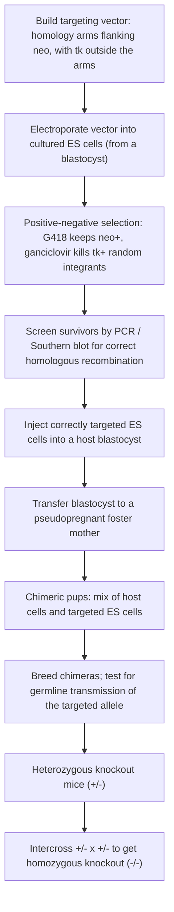
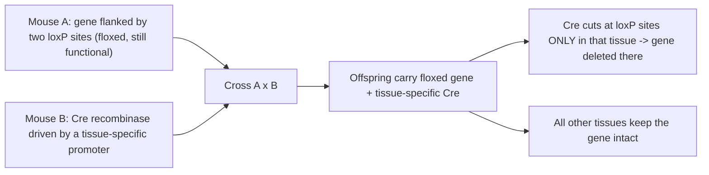

# 유전 모델 생물 — 생쥐

**강의:** BME333 / BIO333 유전학 (UNIST, 2026 가을) · 20강 · ~60분
**강의계획서:** [← 강의계획서](../../lectures/2026.BME333-BIO333-Syllabus.md) — 12주차 수요일, 2026-11-18
**언어:** [English](../../en/lectures/lec20_Model-Mouse.md) · 한국어

## 학습 목표
이 강의를 마치면 학생들은 다음을 할 수 있어야 합니다:
- 생쥐가 왜 최고의 포유류 유전 모델인지, 그리고 인간 생물학 및 질병과의 관련성을 설명한다.
- 고전적 생쥐 유전학 도구 세트를 기술한다: 근친교배 계통(inbred strain), 털색 및 형태 돌연변이체, 초기 연관/QTL 지도작성.
- 분자유전학이 어떻게 생쥐를 변모시켰는지 설명한다(형질전환(transgenesis), 배아줄기세포(ES cell), 유전자 표적화/녹아웃).
- 생쥐에서 순유전학(돌연변이유발, 지도작성)과 역유전학(표적화 녹아웃/녹인) 접근을 구분한다.
- 생쥐 유전학을 양적형질(quantitative-trait) 및 질병 모델링 응용과 연결한다.

## 강의

### 1. 왜 생쥐인가? (~8분)

앞선 강의들에서 다룬 모든 것 — 선충, 파리 — 은 **무척추동물**을 사용했는데, 이들은 놀랍도록 다루기 쉽지만 약 6억 년의 진화로 우리와 떨어져 있다. **집생쥐(*Mus musculus*)**는 **포유류**다. 우리의 몸 설계, 우리의 기관계, 태반, 포유류 면역계와 신경계를 공유하며, 그 유전자의 약 **99%가 인간 대응물을 가진다**. 우리와 비슷한 생리를 가진 살아 있는 동물에서 인간 유전 질환을 모델링하고자 한다면, 생쥐가 기본 선택지다. 실용적으로도 우리가 가진 가장 다루기 쉬운 포유류다. **약 10주의 세대 기간**, 한배 5–10마리의 새끼, 작은 크기, 그리고 — 포유류 중 유일하게 — **한 세기에 걸친 정의된 유전 계통(genetic stock) 컬렉션**을 가진다.

그 마지막 점은 역사적이고 운이 좋았던 것이다. 유전학이 과학으로 존재하기 훨씬 전에, 유럽, 미국, 특히 동아시아의 **생쥐 애호가(mouse "fancier")**들이 특이한 털색과 행동을 위해 생쥐를 사육하여 많은 안정적이고 뚜렷한 변종을 만들어냈다. 20세기 초 유전학자들이 포유류 멘델-생물을 필요로 했을 때, 이 기성품 유전 변이 라이브러리가 기다리고 있었다. 애호가들의 계통은 현대 생쥐 유전학을 정의하는 **근친교배 계통(inbred strain)**의 창시적 재료가 되었다. 따라서 생쥐는 이 강의의 다리 놓는 생물이다. 파리의 고전적, 순유전학적 전통을 이어받으면서 *동시에* **역유전학(reverse genetics)** — 선택한 유전자를 의도적으로 변경하는 것 — 이 발명된 무대가 되었다(참조 [en](../../en/review/Dove1987_Genetics_MouseMolecularGenetics.md) · [ko](../../ko/review/Dove1987_Genetics_MouseMolecularGenetics.md)).

### 2. 고전적 생쥐 유전학 (~12분)

생쥐 유전학의 초석은 **근친교배 계통(inbred strain)**이다. 형제–자매 교배를 **20세대 이상** 거쳐 만든 계통으로, 그 후 모든 개체는 본질적으로 **모든 유전자좌에서 동형접합이며 형제자매와 유전적으로 동일**하다 — 순종 계통(true-breeding line)의 포유류 등가물이지만 유전체 전체에 걸친 것이다. 근친교배 계통(C57BL/6, BALB/c, DBA 및 수십 종)은 재현 가능한 유전적 배경을 제공하여, 두 계통 사이의 어떤 표현형 차이든 유전적일 수밖에 없게 만든다. 파생된 두 도구가 필수적이다. **동계교배 계통(congenic strain)**은 단일 염색체 영역(가령 질병 대립유전자)을 표준 배경에 반복적으로 역교배하여 그 대립유전자를 분리해서 연구할 수 있게 만든 것이고, **재조합 근친교배(recombinant inbred, RI) 패널**은 두 근친교배 계통을 교배한 뒤 그 자손을 여러 새 계통으로 근친교배하여, 각각이 두 부모 유전체의 고정된 모자이크가 되는 영구적이고 재사용 가능한 지도작성 자원이다.

고전적 생쥐 유전학은 대체로 **자연 변이체(natural variant)**, 특히 눈으로 점수화하기 쉬운 **털색 및 형태 돌연변이체**로 운영되었다. 많은 것이 J.B.S. 홀데인(Haldane)이 **"명백한 치사(patent lethal)"**라 부른 것이었다 — 눈에 보이는 **이형접합** 표현형을 주지만 **동형접합일 때 치사**인 대립유전자로, 필수 발생 유전자를 드러낸다(참조 [en](../../en/review/Dove1987_Genetics_MouseMolecularGenetics.md) · [ko](../../ko/review/Dove1987_Genetics_MouseMolecularGenetics.md)).

**그림 — 상징적인 고전적 생쥐 유전자좌.**

| 유전자좌 (대립유전자) | 눈에 보이는 표현형 | 비고 |
|---|---|---|
| *Agouti-yellow* (A^y) | 노란 털 (이형접합) | 동형접합 치사 — "명백한 치사" |
| *Dominant white-spotting* (W / *Kit*) | 흰 배 얼룩, 빈혈 | 나중에 *Kit* 수용체로 밝혀짐 |
| *Steel* (Sl / *Kitl*) | 색소 및 혈액 결함 | *Kit* 수용체의 리간드를 암호화 |
| *piebald* (s / *Ednrb*) | 가변적 흰 얼룩 | 수식인자 조절 변이 (아래 참조) |
| *t* haplotypes (chr 17) | 전달 왜곡, 꼬리/치사 효과 | 재조합 억제 변이 복합체 |

17번 염색체의 **열성 *t* 하플로타입(t haplotype)**은 자연 변이체의 풍부함과 좌절 둘 다를 예시한다. 공유된 **역위(inversion) 세트가 정상 염색체와의 재조합을 억제**하여 그 영역을 유전적으로 "동결"시켜, 다수의 다형성(~염기쌍당 0.007 치환)과 많은 발생 결함을 축적한다 — 생물학의 보물창고이지만, 유전자 단위로 풀기가 거의 불가능한 분자적 뒤엉킴이었다(참조 [en](../../en/review/Dove1987_Genetics_MouseMolecularGenetics.md) · [ko](../../ko/review/Dove1987_Genetics_MouseMolecularGenetics.md)).

생쥐 유전학자들은 또한 포유류에서 **연속적(양적) 형질(continuous (quantitative) trait)** 연구를 개척했다. 아름다운 초기 예가 던(Dunn)과 찰스(Charles)의 1937년 **piebald 얼룩** 분석이다(참조 [en](../../en/review/DunnCharles1937_Schimenti2016_GeneticsClassic_MouseQTL.md) · [ko](../../ko/review/DunnCharles1937_Schimenti2016_GeneticsClassic_MouseQTL.md)). 단일 *piebald* 돌연변이(유전자 *s*)에 대해 동형접합인 생쥐는 거의 완전히 흰 것부터 거의 완전히 착색된 것까지 털 무늬의 방대한 범위를 보인다. 이 변이는 유전적인가, 무작위적인가, 아니면 둘 다인가? 던과 그의 학생은 극단적 표현형에 대해 선별한 근친교배 계통을 만들고, 흰색의 양에 대한 **정량적 등급 척도**를 고안하여 F1과 역교배를 수행했다. 대규모 집단에 걸쳐 등급을 읽어, 그들은 그 변이가 **여러 개의 비연관 수식인자 유전자좌(modifier loci)** — 일부는 그 자체로 색소 결함을 유발했다 — 에 의해 지배됨을 보였고, 근친교배가 표현형을 더 균일하게 만들어 유전적 기반을 확인했다. 이것은 본질적으로 (1937년에는 불가능했던) 분자 유전자 지도작성이 빠진 **QTL 연구**다. 그 결실은 수십 년 후에 왔다. *s* 유전자는 이제 ***Ednrb***(엔도텔린 수용체 B형)로 알려져 있으며, 그 인간 돌연변이는 **히르슈스프룽병(Hirschsprung disease)**과 **바르덴부르크 증후군(Waardenburg syndrome)**을 유발한다 — 그리고 수식인자 개념은 왜 단일유전자 질환이 환자마다 그토록 다른지(**침투도(penetrance)**와 **발현도(expressivity)**)의 밑바탕에 있다.

### 3. 분자유전학 혁명 (~15분)

고전 유전학은 **표현형 → 유전자**로 간다. 돌연변이체를 찾은 뒤 영향받은 유전자를 사냥한다. 분자 혁명은 그 반대 경로, **유전자 → 표현형**을 추가했다. 클로닝된 유전자에서 출발하여 살아 있는 생쥐에서 그것을 의도적으로 변경함으로써 그것이 무엇을 하는지 묻는다. 두 기술이 이를 가능하게 했다.

**형질전환(Transgenesis).** 첫 단계는 단순히 DNA를 *추가*하는 것이었다. 클로닝된 유전자를 수정란의 전핵(pronucleus)에 주입하면, 추가된 서열을 안정적으로 지니고 발현하는 **형질전환 생쥐(transgenic mouse)**가 만들어진다. 이것은 기능획득(gain-of-function) 연구에 강력하지만 — 유전자를 과발현하거나 인간 질병 유전자를 발현 — 조잡하다. 도입유전자(transgene)는 **무작위로**, 가변적 사본 수로, 위치효과의 영향을 받으며 삽입되고, 동물 자신의 유전자 사본은 건드리지 않는다.

**배아줄기(ES)세포와 유전자 표적화.** 변혁적 진보는 **특정한, 선택된** 유전자를 그 **본래 유전자좌**에서 변경하는 능력이었다. 이는 두 요소에 기반했다. 첫째, **배아줄기(ES)세포**: 생쥐 배반포(blastocyst)의 내세포괴에서 유래한 세포로, 배양에서 키우고 조작할 수 있으면서도 **만능성(pluripotent)**을 유지한다 — 배아로 되돌리면 생식세포계를 포함한 모든 조직에 기여할 수 있다. 둘째, **상동 재조합에 의한 유전자 표적화**: 표적 유전자와 서열("상동 팔(homology arm)")을 공유하는 DNA 구조물은 낮은 빈도로 그 유전자에 정확히 재조합해 들어가 그것을 치환하거나 파괴한다. 많은 무작위 삽입체 중 드물게 올바르게 표적화된 세포를 찾기 위해, 고전적 설계는 **양성–음성 선별(positive–negative selection)**을 사용한다. 상동 팔 *안쪽*의 *neo*(네오마이신 저항성) 카세트는 구조물을 받아들인 세포(G418에서 생존)를 선별하고, 팔 *바깥쪽*에 놓인 *tk*(헤르페스 티미딘 키나제) 카세트는 올바른 상동 재조합 중에는 소실되지만 무작위 삽입 중에는 유지된다 — 그래서 간시클로버(ganciclovir)가 무작위 삽입체를 죽인다. 두 선별을 모두 통과한 세포는 진정한 상동 재조합체로 농축된다. 이 연구로 카페키(Capecchi), 에번스(Evans), 스미시스(Smithies)가 2007년 노벨상을 받았다.

**그림 — 녹아웃 생쥐 만들기: ES세포 유전자 표적화.**



표적화된 ES세포는 **숙주 배반포(host blastocyst)**에 주입되어 **대리모(foster mother)**에 착상되어, 숙주 세포와 조작된 ES세포로 부분적으로 이루어진 **키메라(chimera)** 생쥐를 만든다. ES세포 유래 세포가 생식세포계를 채우면, 키메라의 자손이 표적화된 대립유전자를 물려받아 **이형접합 녹아웃**을 주고, 이들을 교배하면 선택한 유전자가 완전히 비활성화된 **동형접합 녹아웃(−/−) 생쥐**가 나온다. 동일한 기구를 좀 더 미묘한 구조물과 함께 쓰면 **녹인(knock-in)**을 만들어, 유전자를 정밀하게 변경된 버전으로 치환한다(예: 정확한 인간 질병 돌연변이를 설치). 이것은 거꾸로 실행되는 유전학이다 — 서열에서 전체 동물 표현형으로 — 그리고 이것이 생쥐를 포유류에서 유전자 기능의 결정적 시험대로 만들었다.

### 4. 생쥐에서의 순유전학 대 역유전학 (~12분)

생쥐는 유전학의 두 위대한 전략을 **모두** 완전한 힘으로 지원한다는 점에서 특이하다. 올바른 것을 선택하는 것이 핵심 연구 기술이므로, 그 대조를 명시적으로 말할 가치가 있다.

**그림 — 생쥐에서 유전 분석의 두 방향.**

| | **순유전학(Forward genetics)** | **역유전학(Reverse genetics)** |
|---|---|---|
| 출발점 | 관심 있는 표현형 | 관심 있는 유전자 |
| 방향 | 표현형 → 유전자 | 유전자 → 표현형 |
| 핵심 방법 | 무작위 **돌연변이유발**(ENU) 또는 자연 변이체, 이후 **지도작성/위치 클로닝** | **유전자 표적화**(녹아웃/녹인), 도입유전자 |
| 편향 | 편향 없음 — 그 표현형을 주는 어떤 유전자든 찾음 | 가설 주도 — 선택한 한 유전자를 검증 |
| 주요 비용 | 돌연변이를 유전자로 지도화하는 것이 고되다 | 이미 그 유전자를 의심해야 한다 |

생쥐에서의 **순유전학**은 **ENU(에틸니트로소요소, ethylnitrosourea)** 돌연변이유발에 의존한다. 윌리엄 도브(William Dove)가 설명했듯이, ENU는 대사 활성화가 필요 없는 강력한 알킬화제로, 주로 **GC→AT 점 돌연변이**를 유발하며 — 러셀(Russell)의 오크리지(Oak Ridge) 특정-유전자좌 검정이 확립했듯이 — 정자원세포(spermatogonia)에서 유전자좌당 약 **7 × 10⁻⁴**의 순방향 돌연변이 빈도를 만들어내는데, 이는 연간 수백 개의 가계만 다루는 실험실도 돌연변이체를 회수할 수 있을 만큼 높다(참조 [en](../../en/review/Dove1987_Genetics_MouseMolecularGenetics.md) · [ko](../../ko/review/Dove1987_Genetics_MouseMolecularGenetics.md)). 도브 자신의 연구는 파리 개념인 **포화 돌연변이유발(saturation mutagenesis)** — 한 영역의 *모든* 유전자를 맞히려는 것 — 을 17번 염색체의 *t*/*T–H-2* 영역에 적용하여, 추정 **50–100개의 치사 상보성 그룹(complementation group)**을 발굴했다. 순유전학의 어려운 부분은 마지막 단계다. 돌연변이 표현형을 특정 DNA 구간에 연결하는 것. 도브는 이것을 **유전-물리 지도 간격(genetic-to-physical map gap)**으로 규정했다 — **센티모건(centimorgan)**으로 측정된 유전자 지도와 **킬로베이스(kilobase)**로 측정된 물리적 클론 사이의 아득한 거리다.

**그림 — 위치 클로닝이 메워야 했던 유전-물리 지도 간격.**

```
GENETIC MAP     |----------- 1 centimorgan (cM) -----------|   ~ 2,000 kb of DNA in the mouse
                                     ...
PHYSICAL CLONE                              [~50 kb cosmid]
                to assign a point mutation to one cosmid-sized clone
                you must map to ~0.02 cM  <-- far beyond classical resolution
```

도브는 유전체 전체에 단지 **약 5,000–10,000개의 단일 사본 필수 유전자(single-copy vital gene)**(~250 kb보다 가깝지 않게 배치)만 있다고 추정했고, 오늘날도 여전한 수수께끼를 언급했다. **필수 유전자좌가 전사되는 유전자보다 최대 10배 드물다** — 대부분의 유전자는 돌연변이되어도 뚜렷한 표현형을 *주지 않는다*. 그는 이를 유전체를 완충하는 **유전적 중복성(genetic redundancy)** 때문이라고 보았다("빙산의 나머지는 우리에게 보이지 않는다") — 이제 CRISPR 스크리닝으로 유전체 전체에 걸쳐 탐구되는 바로 그 문제다(참조 [en](../../en/review/Dove1987_Genetics_MouseMolecularGenetics.md) · [ko](../../ko/review/Dove1987_Genetics_MouseMolecularGenetics.md)).

**역유전학**은 구성을 통해 "어느 유전자?" 문제를 해결하지만, 단순 녹아웃에는 두 가지 한계가 있다. 유전자가 필수적이면 녹아웃은 **배아 단계에서 죽고**(필수적이라는 것은 배우지만 그 외에는 거의 배우지 못한다), 전신 녹아웃은 유전자가 *어디서* 또는 *언제* 작용하는지 알려주지 못한다. 우아한 해결책은 **조건부(Cre/lox) 녹아웃**이다. 짧은 **loxP** 서열을 표적화로 표적 유전자에 인접("플록싱(floxing)")하게 배치하는데, 유전자는 완전히 기능한 채로 둔다. 두 번째 생쥐는 **조직- 또는 시간-특이적 프로모터** 아래에서 **Cre 재조합효소(Cre recombinase)**를 발현한다. Cre는 두 loxP 부위 사이에 있는 것을 무엇이든 절제한다. 두 계통을 교배하면 유전자가 **Cre 발현 세포에서만** 결실된다 — 예컨대 간에서만, 또는 성체기에만 유전자를 녹아웃할 수 있게 한다.

**그림 — Cre/lox를 이용한 조건부(조직 특이적) 녹아웃.**



### 5. 양적 형질과 질병 모델 (~10분)

의학적으로 중요한 대부분의 형질 — 혈압, 체중, 당뇨병 위험, 암 감수성 — 은 **양적(quantitative)**이다. 연속적으로 변하며 **여러 유전자에 환경까지** 더해져 조절된다. 생쥐는 이를 유전적으로 해부할 수 있는 포유류다. 그 전략은 던과 찰스로부터 직접 이어진다. 형질에서 차이 나는 두 근친교배 계통을 교배한 뒤, F2에서 또는 **RI 패널**에서 **유전형이 형질 값과 상관하는 염색체 영역** — **양적형질좌위(quantitative trait locus, QTL)** — 을 찾는다. 근친교배 계통이 대립유전자를 고정하고 RI 패널이 재사용 가능하며 조밀하게 유전형이 매겨져 있으므로, 한 번 만든 지도작성 집단을 어떤 형질에 대해서든, 어느 실험실에서든, 수십 년간 표현형화할 수 있다. 현대의 **QTL 지도작성**은 정확히 던의 1937년 논리 — 연속 표현형을 등급화하고 교배 전반에 걸쳐 수식인자 유전자좌를 추적 — 인데, 이제 유전체 전반의 분자 마커로, 궁극적으로는 서열분석으로 기저 유전자를 명명하기까지 무장했다(참조 [en](../../en/review/DunnCharles1937_Schimenti2016_GeneticsClassic_MouseQTL.md) · [ko](../../ko/review/DunnCharles1937_Schimenti2016_GeneticsClassic_MouseQTL.md)).

두 가지 질병 모델링 주제가 뒤따른다. 첫째, **수식인자 유전학(modifier genetics)**: *piebald*/*Ednrb* 이야기는 단일 질병 대립유전자가 **유전적 배경**에 따라 크게 다른 표현형을 만들어낼 수 있음을 보여준다 — 동일한 돌연변이를 지닌 인간 환자에서 가변적 **침투도와 발현도**를 설명하는 바로 그 원리이며, 우리가 돌연변이 단독이 아니라 여전히 전체 동물 유전학이 필요한 주요 이유다. 둘째, **조작된 질병 모델(engineered disease model)**: 역유전학 도구들을 결합하여 연구자들은 *정확한* 인간 질병 대립유전자를 지닌 생쥐(녹인), 생쥐 유전자를 인간 대응물로 바꾼 **"인간화(humanized)"** 생쥐, 그리고 암이나 신경퇴행 유전자를 선택한 조직에서 선택한 나이에 켜는 **조건부** 모델을 만든다. 이들은 기전 연구와 약물 시험을 위해 살아 있는 포유류에서 인간 질병을 재현한다 — 애호가들의 털색 생쥐에서 정밀 유전체 공학에 이르는 궤적의 종착점이다.

### 6. 마무리 (~3분)

생쥐는 세 시대를 통합함으로써 최고의 포유류 모델로서의 자리를 얻는다. 근친교배 계통과 털색 돌연변이체의 고전 유전학, ES세포와 유전자 표적화의 역유전학 혁명, 그리고 QTL 패널과 인간화 모델의 양적/질병 유전학 — 모두 우리가 그 유전자의 99%를 공유하는 동물에서. 다음으로 우리는 **제브라피시(zebrafish)**로 향하는데, 이 척추동물은 생쥐의 포유류적 충실성을 투명한 배아와 척추동물 몸 설계 전반에 걸쳐 포화 스크리닝을 돌릴 수 있는 처리량으로 맞바꾼다.

## 핵심 정리
- **생쥐**는 최고의 포유류 모델이다: 인간과 ~99% 유전자 상동성, 포유류 몸 설계, 그리고 애호가들에서 유래한 한 세기에 걸친 **근친교배 계통** 라이브러리.
- **고전적 생쥐 유전학**은 근친교배 계통, **동계교배 계통(congenics)**, **RI 패널**, 그리고 자연 털색/형태 돌연변이체 — "명백한 치사"(*Agouti-yellow*, *Steel*, *W/Kit*)와 재조합 억제 *t* 하플로타입 포함 — 로 운영되었다.
- **던 & 찰스(1937)**는 *piebald*(*s* = *Ednrb*) 얼룩을 여러 **수식인자 유전자좌**에 의해 조절되는 **양적 형질**로 분석했다 — 분자 지도작성이 존재하기 전의 QTL 연구이며, 수식인자는 가변적 침투도/발현도의 밑바탕이다.
- **분자 혁명**은 **형질전환**을, 그리고 결정적으로 **ES세포 유전자 표적화**(상동 재조합 + 양성–음성 선별 → 키메라 → 생식세포계 **녹아웃/녹인**)를 추가했다.
- 생쥐는 **순유전학**(ENU 돌연변이유발 + 위치 클로닝; cM 대 kb 지도 간격)과 **역유전학**(표적화 대립유전자; **Cre/lox 조건부** 녹아웃) 모두를 지원한다.
- 질병 관련 형질의 대부분은 **양적**이다. 교배/RI 패널에서의 **QTL 지도작성**에 조작 및 인간화 질병 모델을 더해 생쥐를 결정적인 포유류 시험대로 만든다.

## 교재 참고
- **Genetics: From Genes to Genomes (8e)** — Ch. 22 Genetic Analysis of Development; Ch. 21 Manipulating the Genomes of Eukaryotes. → [textbook ref](../../lectures/ref.Genetics-FromGenesToGenomes.md)

## 이 저장소의 노트
수업에서 소개할 리뷰 및 논문(각각 en/ko 이중 언어 쌍이 있음):
- `Dove1987_Genetics_MouseMolecularGenetics` — 생쥐 모델의 분자유전학적 변모에 대한 개관. · [en](../../en/review/Dove1987_Genetics_MouseMolecularGenetics.md) · [ko](../../ko/review/Dove1987_Genetics_MouseMolecularGenetics.md)
- `DunnCharles1937_Schimenti2016_GeneticsClassic_MouseQTL` — 초기 생쥐 양적형질 분석에 관한 Genetics "Classic"; 고전 유전학과 QTL 유전학을 잇는다. · [en](../../en/review/DunnCharles1937_Schimenti2016_GeneticsClassic_MouseQTL.md) · [ko](../../ko/review/DunnCharles1937_Schimenti2016_GeneticsClassic_MouseQTL.md)

## 토론 문제
1. **근친교배 계통**을 그토록 유용하게 만드는 것은 정확히 무엇이며, 왜 두 근친교배 계통 사이의 표현형 차이를 확신 있게 유전으로 돌릴 수 있는가? 동계교배 계통과 재조합 근친교배 계통은 이 힘을 어떻게 확장하는가?
2. 도브는 1980년대 생쥐 유전학의 핵심 문제를 **센티모건**과 **킬로베이스** 사이의 간격으로 규정했다. 1 cM 유전 구간이 단일 유전자를 가리키기에 왜 지나치게 큰지, 그리고 위치 클로닝(및 이후 전유전체 서열분석)이 그 간격을 어떻게 메웠는지 설명하라.
3. **ES세포 유전자 표적화**를 단계별로 살펴보고 각 요소의 역할을 설명하라: 상동 팔, *neo* 카세트, *tk* 카세트, 양성–음성 선별, 키메라, 생식세포계 전달. 생식세포계 전달이 왜 성패를 가르는 단계인가?
4. **재래식** 녹아웃과 **Cre/lox 조건부** 녹아웃을 대조하라. 조건부 설계로*만* 답할 수 있는 생물학적 질문의 구체적 예를 들고 그 이유를 설명하라.
5. 던과 찰스는 1937년에 단일유전자 결함(*piebald*)이 **수식인자 유전자좌**에 따라 엄청나게 달라짐을 보였다. 이 고전적 결과가 *같은* 질병 돌연변이를 지닌 두 인간 환자가 왜 매우 다른 결과를 가질 수 있는지를 어떻게 밝혀주는가? 그것은 돌연변이를 분리해서 연구하는 것에 대해 무엇을 시사하는가?
