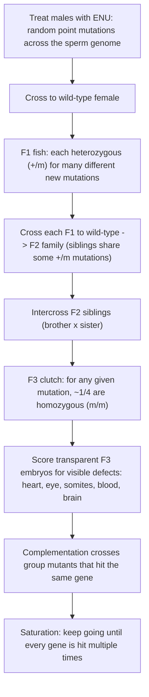
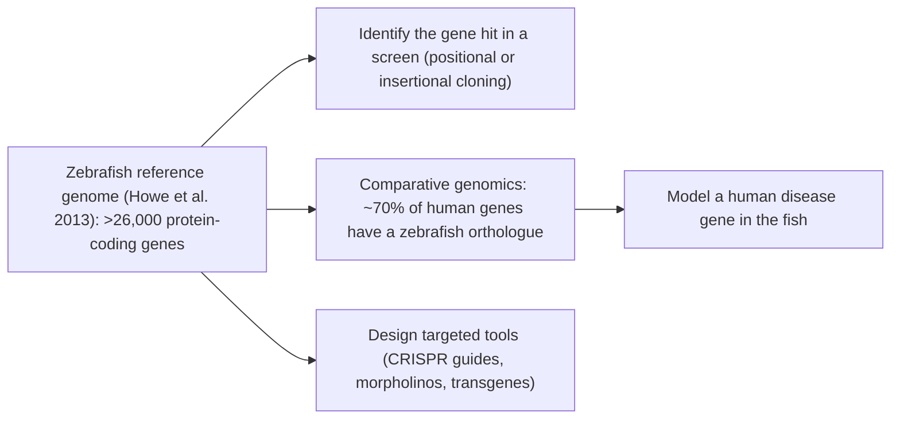

# 유전 모델 생물 — 제브라피시

**강의:** BME333 / BIO333 유전학 (UNIST, 2026 가을) · 21강 · ~60분
**강의계획서:** [← 강의계획서](../../lectures/2026.BME333-BIO333-Syllabus.md) — 13주차 월요일, 2026-11-23
**언어:** [English](../../en/lectures/lec21_Model-Zebrafish.md) · 한국어

## 학습 목표
이 강의를 마치면 학생들은 다음을 할 수 있어야 합니다:
- 제브라피시(*Danio rerio*)가 왜 선도적인 **척추동물** 유전 모델이 되었는지 설명한다 — 체외 수정, 광학적으로 투명한 배아, 빠른 발생, 높은 다산성.
- 대규모 ENU 및 삽입 돌연변이유발 스크리닝이 어떻게 척추동물 발생에 필수적인 유전자를 규명했는지, 그리고 처리량과 유전자 클로닝 용이성에서 어떻게 다른지 기술한다.
- 제브라피시 포화 스크리닝 전략을 앞선 강의에서 다룬 무척추동물 스크리닝(*C. elegans*, *Drosophila*)과 비교한다.
- 비교유전체학과 인간 질병 상동성을 위한 제브라피시 참조 유전체의 가치를 요약한다(인간 유전자의 ~70%가 제브라피시 오르톨로그(orthologue)를 가진다).
- 인간 유전 질환 모델로서 제브라피시의 강점과 한계를 평가한다.

## 강의

### 1. 왜 척추동물 모델인가? 제브라피시 생물학 (~10분)

파리와 선충은 유전학에 훌륭하지만 **무척추동물**이다. 척추도, 신경능선(neural crest)도, 폐쇄 순환계도, 골격도 없으며, 우리 것처럼 만들어진 척추동물 기관이 없다. 생쥐는 포유류이지만 **어미 몸속에서**, 한 번에 작은 한배씩 발생한다 — 생쥐 심장이 형성되는 것을 볼 수 없고, 수천 개의 생쥐 배아에 걸쳐 스크리닝을 쉽게 돌릴 수 없다. 작은 열대 담수어인 **제브라피시(*Danio rerio*)**는 정확히 이 간극을 메운다. 거의 무척추동물 수준의 처리량으로 사육하고 스크리닝할 수 있으며 자기 눈으로 발생을 지켜볼 수 있는 **척추동물**이다.

그 장점은 생식 생물학에서 비롯된다. 수정이 **체외에서** 일어난다 — 알이 접시에서 수정되고 발생하여, 1세포기부터 관찰과 조작에 완전히 접근 가능하다. 배아는 **광학적으로 투명**하여, 단순한 현미경 아래에서 뛰는 심장, 형성 중인 체절(somite), 이동하는 신경능선, 신경계의 배선을 **살아 있는 동물에서** 실시간으로 지켜볼 수 있다. 발생은 **빠르다**. 주요 기관계가 첫 하루나 이틀 안에 놓이고, **한 세대는 약 3개월**이 걸린다. 그리고 암컷 한 마리가 **한 무리당 수백 개의 알**을 낳아, 유전자 스크리닝이 요구하는 많은 수를 제공한다. 이 형질들이 함께 제브라피시를, 파리와 선충에서 개척된 강력한 **순유전학적 스크리닝(forward-genetic screen)**이 마침내 대규모로 **척추동물 발생**에 적용될 수 있는 생물로 만든다(참조 [en](../../en/review/Bonini2017_Genetics_ModelOrganism.md) · [ko](../../ko/review/Bonini2017_Genetics_ModelOrganism.md)).

**그림 — 유전 모델들 사이에서 제브라피시의 위치.**

| 특징 | *C. elegans* / *Drosophila* | **제브라피시** | 생쥐 |
|---|---|---|---|
| 몸 설계 | 무척추동물 | **척추동물** | 포유류 |
| 수정 / 배아 | 체외 / 작음 | **체외, 투명** | 체내, 불투명 |
| 기관형성 생체 이미징 | 제한적 | **탁월** | 어려움 |
| 세대 기간 | 며칠 | **~3개월** | ~10주 |
| 자손 수 | 매우 높음 | **한 무리당 수백** | 한배 5–10 |
| 스크리닝 처리량 | 높음 | **높음** | 낮음 |
| 인간과의 근접성 | 낮음 | 중간 | **높음** |

### 2. 순유전학: ENU 포화 스크리닝 (~15분)

제브라피시는 **1996년** 세계 무대에 등장했는데, 이때 두 실험실 — 튀빙겐의 크리스티아네 뉘슬라인폴하르트(Christiane Nüsslein-Volhard)와 보스턴의 볼프강 드리버(Wolfgang Driever) — 이 배아 발생에 영향을 주는 돌연변이에 대한 대규모 **순유전학적 스크리닝** 결과를 발표했다. 이들은 뉘슬라인폴하르트와 비샤우스(Wieschaus)의 유명한 *초파리* 체절화 스크리닝의 척추동물 대응물이다. 튀빙겐 스크리닝만으로도 본질적으로 모든 기관계에 걸쳐 "제브라피시 발생에서 고유하고 필수적인 기능"을 가진 유전자들을 규명했다(Haffter et al. 1996; 아래 추가 읽기 참조).

논리는 순수한 **순유전학** — **표현형 먼저, 유전자는 나중** — 이지만, 생물학이 부과하는 주름이 하나 있다. 흥미로운 발생 돌연변이는 **열성**이므로, 표현형이 나타나기 전에 돌연변이를 **동형접합**으로 만들어야 하고, 그것은 세 세대의 교배가 걸린다. 돌연변이원은 **ENU(에틸니트로소요소, ethylnitrosourea)**로, 생쥐(20강)에서 쓰인 것과 같은 강력한 점 돌연변이원이다. 수컷을 ENU에 담가 정자 전체에 무작위 점 돌연변이를 유도한다.

**그림 — 열성 발생 돌연변이에 대한 3세대 ENU 스크리닝.**

이 방식에서 두 개념이 중심이다. 첫째는 **유전적 포화(genetic saturation)**다. 하나의 돌연변이는 어떤 유전자가 어떤 과정에 영향을 줄 *수 있다*고 알려준다. 스크리닝은 그 표현형을 줄 수 있는 **본질적으로 모든 유전자**가 맞혀질 때까지 — 그리고 **한 번 이상** 맞혀질 때까지 — 돌려야만 강력해진다. 같은 유전자의 여러 독립적 돌연변이(**대립유전자**)를 회수하는 것이 포화에 접근하고 있다는 신호다. 새 유전자보다 같은 유전자를 계속 다시 찾게 되는 것이다. 둘째는 **상보성 검정(complementation test)**으로, 독립적으로 분리된 두 돌연변이체가 **같은 유전자인지 다른 유전자인지**를 판정하는 도구다. 비슷한 표현형을 가진 두 열성 돌연변이체를 교배한다. 자손이 **돌연변이형**이면(상보하지 못함), 두 돌연변이는 *같은* 유전자를 파괴한 것이고, 자손이 **야생형**이면(상보함), 돌연변이들은 *다른* 유전자에 있으며 각 부모가 상대의 정상 사본을 제공하여 두 기능이 회복될 수 있다. 상보성은 무더기의 돌연변이 물고기를 정의된 **유전자 집합**으로 정렬하는 방법이다 — 앞서 다룬 파리 ANT-C와 선충 스크리닝에서 쓰인 것과 같은 원리다.

무척추동물 스크리닝에 비해, 제브라피시 스크리닝은 유전체당 훨씬 더 **고되지만**(세 세대, 큰 수조, 수천 번의 교배), 그 보상은 독특하다. 선충이나 파리에는 아예 존재하지 않는 **척추동물 특이적** 구조(심방·심실이 있는 심장, 체절화된 척주, 혈액과 혈관, 복잡한 뇌)를 탐문한다. 이것은 모건과 뉘슬라인폴하르트의 편향 없는 포화 스크리닝 철학을 척추동물 생물학으로 가져왔다.

### 3. 삽입 돌연변이유발과 유전자 클로닝 (~12분)

ENU 스크리닝에는 생쥐 논의에서 다시 나타나는 심각한 단점이 하나 있다. 점 돌연변이는 **분자적 표지를 남기지 않는다**. 아름다운 돌연변이체를 얻더라도, 여전히 **위치 클로닝(positional cloning)** — 돌연변이를 염색체 영역으로 지도화하고 책임 있는 염기 변화를 추적하는 것 — 이라는 고되고 느린 작업에 직면한다. 암스테르담(Amsterdam)과 동료들(1999)은 근본적으로 다른 돌연변이원으로 이를 해결했다. **레트로바이러스 삽입 돌연변이유발(retroviral insertional mutagenesis)**(Amsterdam et al. 1999; 추가 읽기 참조). 염기를 화학적으로 절단하는 대신, 그들은 **레트로바이러스**를 사용해 그 DNA(**프로바이러스, provirus**)를 유전체의 무작위 부위에 삽입했다. 프로바이러스가 유전자 안이나 근처에 착지하면 그것을 파괴한다 — ENU가 하듯 정확히 돌연변이를 만든다.

결정적 이점은 삽입된 프로바이러스가 **깨진 유전자 안에 앉아 있는 알려진 DNA 서열**이라는 것이다 — 분자적 **표지(tag)**다. 파괴된 유전자를 찾으려면 알려진 프로바이러스 DNA에서 인접 유전체 서열로 바깥쪽으로 서열분석하기만 하면 되고, 유전자가 몇 달이 아니라 며칠 만에 튀어나온다. 이것은 고통스러운 클로닝 단계를 일상적인 것으로 바꾼다.

**그림 — ENU 대 삽입 돌연변이유발: 처리량-대-클로닝 절충.**

| | **ENU 점 돌연변이유발** | **레트로바이러스 삽입 돌연변이유발** |
|---|---|---|
| 병변의 성질 | 무작위 염기 변화 | 유전자 안/근처에 삽입된 프로바이러스 |
| 돌연변이유발 효율 | **높음** — 유전체당 많은 돌연변이 | **낮음** — 유전체당 적은 히트 |
| 분자적 표지? | **없음** — 보이지 않는 점 변화 | **있음** — 알려진 프로바이러스 서열 |
| 유전자 클로닝 | 느린 **위치 클로닝** | **빠름** — 프로바이러스에서 바깥쪽으로 서열분석 |
| 최적 용도 | 표현형 수율 극대화 | 신속한 유전자 규명 |

두 방법은 상보적이며, 그 절충은 시사적이다. ENU는 **돌연변이체 수**를 극대화하지만 각 **유전자를 규명하기 어렵게** 만드는 반면, 삽입 스크리닝은 **더 적은 돌연변이체**를 회수하지만 **유전자를 즉시** 넘겨준다. 이는 모델 생물 전반에 걸쳐 반복되는 주제다(생쥐에서의 같은 긴장, [en](../../en/review/Bonini2017_Genetics_ModelOrganism.md) · [ko](../../ko/review/Bonini2017_Genetics_ModelOrganism.md), 그리고 20강의 도브의 삽입-대-화학 돌연변이유발 논의를 상기하라). 병목이 *표현형 찾기*인지 *유전자 찾기*인지에 따라 돌연변이원을 선택하는 경우가 많다.

### 4. 제브라피시 참조 유전체와 인간 상동성 (~12분)

순방향 스크리닝은 그것을 명명할 유전체가 있어야만 궁극적으로 **유전자 이름**을 내놓는다. 하우(Howe)와 동료들이 2013년 보고한 제브라피시 **참조 유전체(reference genome)**는 **26,000개가 넘는 단백질 암호화 유전자**를 암호화하는 고품질 어셈블리를 제공했고, 결정적으로 이 물고기와 우리 유전체의 관계를 확립했다. **인간 유전자의 약 70%가 적어도 하나의 제브라피시 오르톨로그를 가지며**, 대략 **인간 질병 관련 유전자의 82%**가 제브라피시 대응물을 가진다(Howe et al. 2013; 추가 읽기 참조). 이것이 제브라피시를 의학적으로 유의미하게 만드는 수치다. 우리가 관심을 가질 만한 대부분의 인간 유전자는 돌연변이시키고 지켜볼 수 있는 물고기 버전을 가진다.

**그림 — 참조 유전체가 제공하는 것.**

척추동물 특이적 합병증 하나를 짚어야 한다. 경골어류(teleost) 진화 초기에 전체 유전체가 **중복(duplicated)**되었다(**경골어류 특이적 전유전체 중복, teleost-specific whole-genome duplication**). 그 결과, 인간에서 **단일 사본인 많은 유전자가 제브라피시에서는 두 개의 파라로그(paralogue)로 존재**한다(흔히 *gene-a*와 *gene-b*로 표기). 이것은 실용적으로 중요하다. 두 사본이 **기능을 공유**할 수도 있고(그래서 하나를 녹아웃해도 그 짝이 보상하므로 표현형이 없음), 조상의 역할을 둘 사이에 **나누었을** 수도 있다(하위기능화, subfunctionalization). 어느 쪽이든, 제브라피시 돌연변이체를 해석하려면 때때로 두 번째 사본을 고려해야 한다 — 파리나 생쥐에는 등가물이 없는 유의점이다. 참조 서열에서 온 비교유전체학이 바로 연구자들이 이런 파라로그 쌍을 인식하고 그에 맞게 실험을 설계할 수 있게 해준다.

### 5. 현대적 도구와 질병 모델링; 마무리 (~11분)

순방향 스크리닝은 *어느* 유전자가 중요한지 알려주고, **역유전학** 도구는 *선택된* 유전자를 검증하게 해준다. 이제 제브라피시는 완전한 도구 세트를 갖추었다. **모르폴리노 안티센스 올리고뉴클레오티드(Morpholino antisense oligonucleotide)**는 1세포 배아에 주입되어 (번역이나 스플라이싱을 차단하여) 유전자 발현을 일시적으로 **녹다운(knock down)**한다 — 빠르고 저렴하지만 일시적이고 표적 이탈(off-target) 효과가 나기 쉬워, 결과를 반드시 확인해야 한다. **형질전환(transgenesis)**은 일상적이다. 배아가 투명하므로, 형광 리포터(예: 조직 특이적 프로모터로 구동되는 GFP)를 통해 연구자들은 **특정 세포 유형이 살아 있는 물고기에서 빛나며 움직이는 것을 지켜볼** 수 있다. 가장 강력하게는, **CRISPR/Cas9**이 이제 정밀하고 유전 가능한 **유전자 편집** — 물고기 자신의 유전체에서 표적화 녹아웃과 녹인 — 을 제공하여, ES세포가 생쥐에게 준 것과 같은 표적화 역유전학을 훨씬 적은 노력으로 제브라피시에게 준다.

이 도구들은 제브라피시를 진지한 **인간 유전 질환 모델**로 만든다(Penberthy, Shafizadeh & Lin 2002; 추가 읽기 참조). 그 **강점**은 독특하다. 투명한 배아는 질병 과정이 펼쳐지는 대로 **생체 이미징(live imaging)**을 가능하게 한다. 높은 다산성은 살아 있는 척추동물 전체에서 **대규모 화학(약물) 및 유전자 스크리닝**을, 돌연변이 표현형을 구제하는 화합물 스크리닝을 포함하여 가능하게 한다. 그리고 기관계(심장, 혈액, 신장, 눈, 신경계)가 척추동물다운 것이다. 그 **한계** 또한 실재한다. **유전체 중복/파라로그** 문제가 표현형을 가릴 수 있고, 물고기는 포유류가 아니어서 일부 기관(폐, 사지, 유선)이 없고 생리가 다르며, **일부 인간 유전자는 제브라피시 오르톨로그가 전혀 없다**. 보니니(Bonini)와 버거(Berger)가 주장하듯, 단일 모델로는 충분하지 않다 — 제브라피시는 선충, 파리, 생쥐를 **대체하는 것이 아니라 보완**하며, 가장 강력한 질병 유전학은 여러 모델을 함께 사용한다(참조 [en](../../en/review/Bonini2017_Genetics_ModelOrganism.md) · [ko](../../ko/review/Bonini2017_Genetics_ModelOrganism.md)).

**마무리.** 제브라피시는 편향 없는 포화 스크리닝을 무척추동물에서 투명하고 고처리량인 **척추동물**로 확장했고, 수천 개의 발생 유전자를 내놓았으며 — 참조 유전체, ~70% 인간 상동성, 현대적 CRISPR/이미징 도구와 함께 — 질병 모델링의 일꾼이 되었다. 다음 강의는 실험실 스크리닝의 모델이 아니라 품종에 걸친 **자연 변이와 인위 선택**의 모델인 **개(dog)**로 넘어간다.

## 핵심 정리
- **제브라피시**는 선도적인 *척추동물* 스크리닝 모델이다: **체외 수정**, **투명한 배아**(기관형성 생체 이미징), **~3개월 세대**, **한 무리당 수백 개의 알**이 척추 있는 동물에서 거의 무척추동물 수준의 처리량을 준다.
- **1996년 ENU 포화 스크리닝**(튀빙겐과 보스턴)은 열성 돌연변이를 드러내기 위한 **3세대** 교배 방식을 사용하여 표현형-우선 순유전학을 척추동물 발생에 적용했다. **포화**와 **상보성 검정**이 돌연변이 물고기를 정의된 유전자 집합으로 바꾼다.
- **레트로바이러스 삽입 돌연변이유발**은 더 낮은 돌연변이유발 효율을 내장된 **분자적 표지**와 맞바꿔 유전자 클로닝을 빠르게 만든다 — ENU에 대한 고전적 **처리량-대-클로닝** 절충이다.
- **참조 유전체**(Howe et al. 2013)는 **>26,000개의 유전자**를 암호화하며, **인간 유전자의 ~70%**(그리고 질병 유전자의 ~82%)가 제브라피시 오르톨로그를 가져 비교유전체학과 질병 모델링을 가능하게 한다.
- **경골어류 유전체 중복**은 인간의 많은 단일 사본 유전자를 물고기에서 **파라로그 쌍**으로 남긴다 — 유전자 기능을 가리거나 나눌 수 있는 척추동물 특이적 유의점이다.
- 현대적 도구 — **모르폴리노** 녹다운, 형광 **형질전환**, **CRISPR/Cas9** 편집 — 에 생체 이미징과 화학 스크리닝을 더해 제브라피시를 선충, 파리, 생쥐를 **보완**하는 강력한 질병 모델로 만든다.

## 교재 참고
- **Genetics: From Genes to Genomes (8e)** — Ch. 8 Using Mutations to Study Genes; Ch. 22 Genetic Analysis of Development (척추동물 모델에서의 순방향 스크리닝 및 발생). → [textbook ref](../../lectures/ref.Genetics-FromGenesToGenomes.md)

## 이 저장소의 노트
수업에서 소개할 리뷰 및 논문(각각 en/ko 이중 언어 쌍이 있음):
- `Bonini2017_Genetics_ModelOrganism` — 모델 생물이 유전적 발견을 이끄는 이유에 대한 일반적 논거; 제브라피시를 선충, 파리, 생쥐와 나란히 놓는 데 사용(선택적 언급). · [en](../../en/review/Bonini2017_Genetics_ModelOrganism.md) · [ko](../../ko/review/Bonini2017_Genetics_ModelOrganism.md)

## 추가 읽기 (PubMed)
이 저장소에 전용 제브라피시 노트가 없으므로, 다음의 권위 있는 논문들을 PubMed에서 가져왔다(출처: PubMed에 따름):
- Haffter et al. 1996. The identification of genes with unique and essential functions in the development of the zebrafish, *Danio rerio*. *Development* 1996;123:1-36. [DOI](https://doi.org/10.1242/dev.123.1.1) · PMID 9007226 — 튀빙겐 ENU 포화 스크리닝; 척추동물 발생의 획기적 순유전학적 해부.
- Amsterdam et al. 1999. A large-scale insertional mutagenesis screen in zebrafish. *Genes Dev* 1999;13(20):2713-24. [DOI](https://doi.org/10.1101/gad.13.20.2713) · PMID 10541557 — 파괴된 발생 유전자를 표지하고 신속한 클로닝을 가능하게 하는 레트로바이러스 삽입 스크리닝.
- Howe et al. 2013. The zebrafish reference genome sequence and its relationship to the human genome. *Nature* 2013;496(7446):498-503. [DOI](https://doi.org/10.1038/nature12111) · PMID 23594743 — 고품질 유전체 어셈블리; 인간 유전자의 ~70%가 제브라피시 오르톨로그를 가진다.
- Penberthy, Shafizadeh & Lin 2002. The zebrafish as a model for human disease. *Front Biosci* 2002;7:d1439-53. [DOI](https://doi.org/10.2741/penber) · PMID 12045008 — 인간 유전 질환 모델링을 위한 제브라피시의 강점과 한계에 관한 기초적 리뷰.

## 토론 문제
1. 제브라피시를 유전자 스크리닝에 적합하게 만드는 구체적 생물학적 특징들을 나열하고, 각각이 왜 중요한지 설명하라. 이 중 생쥐가 *결여한* 것은 무엇이며, 그것이 각 모델이 답할 수 있는 질문을 어떻게 형성하는가?
2. **열성** 발생 돌연변이를 위한 스크리닝은 왜 **세** 세대의 교배가 필요한가? 교배를 그리고, 동형접합 돌연변이 표현형이 처음 나타나는 세대와 그것이 무리 중 어느 비율인지 규명하라.
3. **유전적 포화**와 **상보성 검정**을 설명하라. 같은 유전자의 여러 독립적 대립유전자를 회수하는 것이 어떻게 스크리닝이 포화에 접근하고 있음을 알려주며, 상보성은 어떻게 돌연변이체를 유전자로 정렬하는가?
4. ENU와 레트로바이러스 삽입 돌연변이유발은 처리량-대-클로닝 절충을 구현한다. 목표가 *발견되는 발생 유전자의 수를 극대화*하는 것이라면 어느 것을 선택하고 왜 그런가? 목표가 *특정 유전자 하나를 최대한 빨리 클로닝*하는 것이라면?
5. 인간 유전자의 약 70%가 제브라피시 오르톨로그를 가지지만, 경골어류 유전체 중복은 많은 것을 파라로그 쌍으로 남긴다. 이 중복이 어떤 유전자가 불필요하다고 잘못 결론짓게 만들 수 있는 구체적 시나리오를 들고, 그 오류를 어떻게 방지할지 기술하라.
