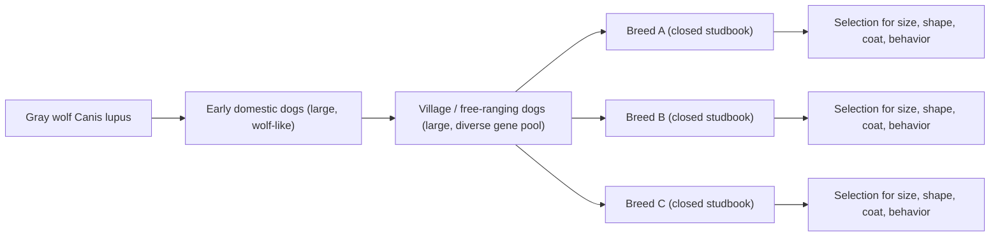
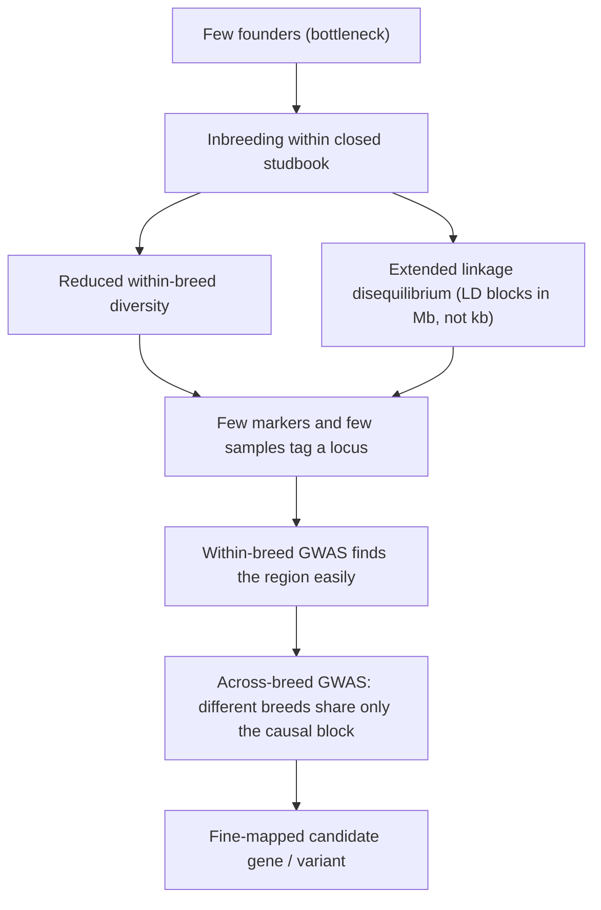
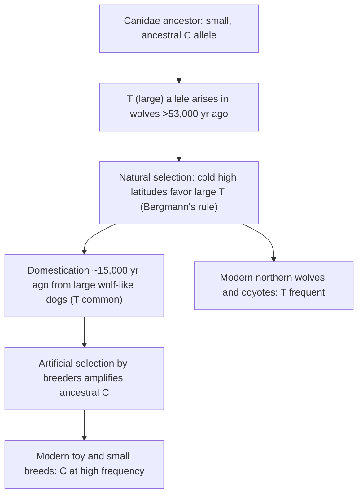

# 유전학 모델 생물 — 개

**강의:** BME333 / BIO333 유전학 (UNIST, 2026 가을) · 22강 · ~60분
**강의계획서:** [← 강의계획서](../../lectures/2026.BME333-BIO333-Syllabus.md) — 13주차 수요일, 2026-11-25
**언어:** [English](../../en/lectures/lec22_Model-Dog.md) · 한국어

## 학습 목표
이 강의를 마치면 학생들은 다음을 할 수 있어야 합니다:
- 집개(*Canis familiaris*)가 왜 변이와 선택의 유전학을 위한 강력한 자연 모델인지 설명한다: 강한 인위선택(artificial selection), 품종 구조(breed structure), 그리고 한 종 안에 존재하는 극단적 형태 다양성.
- 품종 형성이 어떻게 긴 연관 블록(linkage block)과 품종 내 다양성 감소를 만들어내며, 이것이 GWAS와 형질 유전자좌(trait locus) 지도 작성을 유난히 수월하게 만드는지 기술한다.
- 개의 가축화(domestication)와 육종을 집단에서의 변이와 선택이라는 교재 주제와 연결한다.
- 고전적 개 형질인 체구(body size)의 유전적 구조(genetic architecture)와, 소수의 큰 효과 유전자좌(large-effect locus, 예: *IGF1* 및 관련 변이)의 역할을 요약한다.
- 개 유전학이 개 생물학과 이에 상응하는 인간 형질 및 질병을 어떻게 함께 밝혀주는지 논의한다.

## 강의

### 1. 선택에 관한 자연 실험으로서의 개 (~10분)

지금까지 다룬 모든 형질 — 멘델의 완두, *Drosophila*의 눈 색, 양적 형질인 키 — 에는 하나의 밑바탕 규칙이 있다: **변이(variation)**는 원재료이고 **선택(selection)**은 그것을 다듬는 체(sieve)이다. 집개는 이 규칙을 한 종 안에서 가장 극적으로 보여주는 사례이다. **인위선택(artificial selection)** — 사람이 선택한 형질을 위해 의도적으로 교배하는 것 — 은 단 수천 년, 그것도 대부분 최근 ~200년 만에, 1 kg짜리 치와와부터 50 kg이 넘는 마스티프까지 **~40배에 이르는 체중 범위**를 만들어냈고, 다리 길이, 두개골 형태, 털 길이와 색, 귀 모양, 꼬리 형태, 행동에서도 엄청난 변이를 낳았다. 이는 육상 포유류 중 가장 큰 체구 다양성이며, 그 전부가 서로 교배 가능한 하나의 종 안에 담겨 있다([en](../../en/article/Rimbault2013_GenomeRes_DogSizeReduction.md) · [ko](../../ko/article/Rimbault2013_GenomeRes_DogSizeReduction.md) 참조).

이 사실을 다윈은 놓치지 않았다. 그는 *종의 기원(On the Origin of Species)*을 **인위선택 아래의 가축화**로 열었는데, 바로 이것이 "선택에 의한 변형을 동반한 유래(descent with modification by selection)"라는 추상적 관념을 사람의 시간 척도에서 눈에 보이게 만들기 때문이다: 육종가가 자연의 역할을 대신하며, 그 결과가 눈앞에서 축적된다. 개는 강의 01에서 우리가 열었던 고리를 닫는다 — 개는 유전체로 구현된 다윈의 논증이다.

**가축화.** 개는 **회색늑대(*Canis lupus*)**에서 유래했으며, 대략 ~15,000–40,000년 전에 분기했다(정확한 시점과 가축화 사건의 횟수는 아직 논쟁 중이며, 일부 자료는 이중 기원(dual origin)을 지지한다). 가축화는 **크고 늑대를 닮은 동물**에서 시작되었고, 사람이 이미 존재하던 소형 변이를 증폭하여 토이 품종(toy breed)을 만든 것은 훨씬 뒤의 일이다([en](../../en/article/Plassais2022_CurrBiol_DogBodySize-NonCodingVariant.md) · [ko](../../ko/article/Plassais2022_CurrBiol_DogBodySize-NonCodingVariant.md) 참조). 가축화는 또한 **가축화 증후군(domestication syndrome)** — 온순함, 늘어진 귀, 말린 꼬리, 변화된 털, 이동된 스트레스 생리 등 상관된 변화들의 집합 — 을 낳았는데, 이는 단지 사람에 대한 공포 감소만을 기준으로 동물을 선택했을 때 함께 나타나며, Belyaev/Trut의 은여우 실험(1959–현재)에서 처음부터 재현된 것으로 가장 유명하다([en](../../en/article/Hekman2019_G3_APtx+Fox.md) · [ko](../../ko/article/Hekman2019_G3_APtx+Fox.md) 참조).

**그림 — 하나의 늑대 집단에서 수백 개 품종으로.**


### 2. 품종 구조와 개 유전학이 수월한 이유 (~12분)

개가 매력적일 뿐 아니라 유전학적으로 *편리한* 이유는 무엇인가? 답은 **품종 구조(breed structure)**이다. 현대의 품종은 **폐쇄적 번식 집단(closed breeding population)**이다: 혈통대장(studbook)이 세워지고, 소수의 창시자(founder)가 품종을 정의하며, 그 이후로는 같은 품종끼리만 교배한다. 여기서 두 가지 집단유전학적 결과가 따라오며, 둘 다 유전자 지도 작성을 쉽게 만든다.

첫째, 각 품종은 **집단 병목(population bottleneck)**(소수의 창시자)을 거친 뒤 품종의 "생김새"를 고정하기 위한 **근친교배(inbreeding)**를 겪었다. 이는 **품종 내 유전 다양성을 감소**시킨다: 한 품종의 개체들은 같은 소수 창시자로부터 물려받은 동일한 DNA를 긴 구간에 걸쳐 공유한다. 둘째 — 그리고 이것이 지도 작성의 핵심인데 — 병목과 근친교배는 **확장된 연관불평형(linkage disequilibrium, LD)**을 만든다. **연관불평형**이란 가까운 유전자좌의 대립유전자들이 비무작위적으로 연합하는 것이다: 원인 변이가 유전될 때 그 주변의 긴 **반수체형(haplotype)**(연관된 마커들의 블록)도 함께 유전된다. 사람에서는 LD가 수십 킬로베이스 안에서 붕괴하지만, **개 품종 내에서는 LD 블록이 메가베이스 규모로 이어진다**. 이는 사람 연구가 필요로 하는 것보다 훨씬 적은 마커와 훨씬 적은 개체로 원인 유전자좌를 "태깅(tag)"할 수 있음을 뜻한다.

대가(trade-off)는 해상도이다. 긴 LD는 **영역을 찾기는 쉽게** 하지만 **정확한 유전자를 짚어내기는 어렵게** 하는데, 연관된 블록 안에 여러 유전자가 들어 있기 때문이다. 개 유전학에서 쓰는 우아한 해법은 **2단계 전략(two-stage strategy)**이다: 먼저 한 품종 *내에서* 거칠게 지도 작성하고(적은 마커로 충분, 긴 LD), 그다음 **여러 품종에 걸쳐** 정밀하게 지도 작성한다(서로 다른 품종은 조상 반수체형을 서로 다른 지점에서 끊었으므로, 공유되는 연관 구간이 원인 변이 쪽으로 좁혀진다). 이 "품종 간 지도 작성(across-breed mapping)"은 독립적으로 육종된 수백 개 계통의 다양성을 정밀 지도 작성 엔진으로 바꿔놓는다.

**그림 — 품종 구조가 개 GWAS를 작동하게 만드는 이유(품종 구조 → 긴 LD → 지도 작성 논리).**


**그림 — 같은 종류의 형질에 대한 개 GWAS 대 사람 GWAS.**

| 특징 | 개 품종 내 | 사람 집단 |
|---|---|---|
| 유효 창시자 수 | 적음(병목) | 크고, 아웃브리드(outbred) |
| LD 블록 길이 | 메가베이스 | 수십 kb |
| 한 유전자좌를 태깅하는 데 필요한 마커 수 | 적음 | 많음(수백만) |
| 유전체 전역 유의성을 위한 표본 크기 | 수백 | 수만–수백만 |
| 체구의 유전적 구조 | 소수의 큰 효과 유전자좌 | 다수의 작은 효과 유전자좌 |
| 상위 유전자좌가 설명하는 체구 분산 비율 | ~절반–~95%(아래 참조) | 키의 ~10%(180개 이상 유전자좌) |

이 대비가 강의 전체의 교육적 결실이다: *같은 형질*(체구)이 **개에서는 단순한 구조**를, **사람에서는 고도로 다인자적인(polygenic) 구조**를 가지며, 그 차이는 성장의 근본 생물학이 아니라 *육종 역사*의 직접적 산물이다([en](../../en/article/Rimbault2013_GenomeRes_DogSizeReduction.md) · [ko](../../ko/article/Rimbault2013_GenomeRes_DogSizeReduction.md) 참조).

### 3. 전유전체 변이와 품종 간 GWAS (~13분)

개 GWAS의 1세대는 **SNP 칩** — 약 170,000개 마커의 고정 어레이(Vaysse et al. 2011) 또는 약 61,000개 마커(CanMap 프로젝트, Boyko et al. 2010) — 를 사용했다. 이들은 빠르고 저렴하지만, 반수체형을 *태깅*만 하기 때문에 연관 구간이 LD 블록 전체에 걸쳐 있어 원인 염기를 짚어내는 경우는 드물다. 이 분야의 방법론적 도약은 (원리상) 모든 변이를 직접 읽어내는 **전유전체 시퀀싱(whole-genome sequencing, WGS)**으로 넘어간 것이었다.

Plassais et al.(2019)은 이 접근법의 기준 데이터셋을 구축했다: **722개체 개과(canid)의 WGS** — 144개 가축 품종, 54개 야생 개과 종, 104개 마을개(village dog) — 로부터 **9,100만 개 이상의 SNV와 짧은 삽입/결실(indel)**(필터링 후 고품질 이대립성(biallelic) SNV 7,650만 개; 중앙 심도 18×) 목록을 얻었다([en](../../en/article/Plassais2019_NatComm_DogGenomes+GWAS.md) · [ko](../../ko/article/Plassais2019_NatComm_DogGenomes+GWAS.md) 참조). 이 설계는 두 가지 집단유전학 도구를 담고 있어 해부해볼 가치가 있다:

- **야생 개과를 외군(outgroup)으로** 삼으면 각 자리에서 **조상형 대 파생형 대립유전자(ancestral vs. derived allele)** — 즉 어느 대립유전자가 가축화 이전에 존재했고 어느 것이 품종 형성 중에 생겨났는지(또는 증폭되었는지) — 를 추론할 수 있다. 이는 선택의 *방향*을 알려준다.
- **마을(자유생활) 개**는 거의 선택되지 않은 크고 넓은 기준 풀(pool)로서, 집중적으로 선택된 품종이 "이후(after)"라면 그 "이전(before)" 그림에 해당한다.

이어서 그들은 미국애견협회(AKC) 품종 표준으로 정의되는 **16개 형태 형질**(체중, 키, 털 길이, 귀 모양, 꼬리 모양, 다리 길이, 수명 등)에 대해, 성별을 보정하고 결정적으로는 **집단 구조화(population stratification)**(원인 유전자좌뿐 아니라 유전체 전역에서 품종이 서로 다르기 때문에 생기는 교란)를 보정하는 **선형 혼합 모형(linear mixed model)**인 **GEMMA**를 사용해 GWAS를 수행했다. 엄격한 Bonferroni 역치(−log₁₀P ≈ 8.46)를 적용하여, 그들은 **12개의 이전에 알려지지 않은 후보 유전자를 포함한 28개의 유전체 전역 유의 연관**을 찾아냈다. 주요 결과:

| 형질 | 유전자좌 / 유전자 | 변이의 성격 |
|---|---|---|
| 체구 | *IGF1, LCORL, HMGA2, GHR, STC2, SMAD2, IGF1R* 포함 14개 유전자 | 합쳐서 표준 품종 체중 분산의 ~95%를 설명 |
| 초대형 체구(>41 kg) | *LCORL* | 1-bp 삽입 → 조기 종결(p.S1221*), DNA-결합 도메인 상실; 파생형 대립유전자 빈도 대형 품종 0.67, 소형 0 |
| 긴 다리 | *ESR1*(에스트로겐 수용체 1) | 인트론 변이; 아이리시 울프하운드/휘핏에서 *ESR1* 발현 20–70배 높음 |
| 처진("늘어진") 귀 | CFA10의 단일 lncRNA | TCONS_00016758/16759의 엑손 변이 |
| 수명 | *LCORL, HMGA2, IGF1* | 체중은 수명과 음의 상관(r ≈ 0.72): 큰 개는 더 일찍 죽음 |

이 유전자좌들이 우연히 그 자리에 있는 것이 아니라 **선택에 의해 형성되었음**을 확인하기 위해, 저자들은 **선택적 스윕(selective-sweep) 통계** — 집단을 비교하여 빠르게 스윕된 반수체형의 흔적을 탐지하는 검정인 **XP-CLR**과 **XP-EHH** — 를 적용했다. **18개 GWAS 후보 유전자 중 13개**에서 양성 선택(positive selection)이 확인되어, 연관 신호를 인위선택 역사와 직접 묶었다. 논문에서 가장 인상적인 단 하나의 수치: **단 14개 유전자가 품종 간 체구 분산의 ~95%를 설명**하는 반면, **사람 키 분산의 ~10%는 180개 이상의 유전자좌가 설명한다** — 2단원에서 예고한 단순화된 구조가 이제 측정된 것이다.

### 4. 사례 연구: 체구의 유전학 (~13분)

체구는 개 유전학의 모델 양적형질(quantitative trait)인데, (a) 엄청나게 변이가 크고, (b) 측정이 쉬우며(품종 표준 체중), (c) 밝혀진 바 **소수의 큰 효과 유전자좌**에 의해 조절되기 때문이다 — 사람 키의 "무한소(infinitesimal)" 다수-작은-효과 그림과 정반대이다.

**조합적이고 계단형인 구조.** Rimbault et al.(2013)은 CanMap 체구 QTL 4개를 정밀 지도 작성한 뒤, 93개 품종의 개 500마리에서 **6개 유전자**와 *IGF1*, *IGF1R*의 상위 변이를 유전형 분석했다([en](../../en/article/Rimbault2013_GenomeRes_DogSizeReduction.md) · [ko](../../ko/article/Rimbault2013_GenomeRes_DogSizeReduction.md) 참조). 6개 체구 유전자와 그 신호:

| 유전자(염색체) | 변이 | 생물학 |
|---|---|---|
| *GHR*(CFA4) | 엑손 5의 미스센스 SNP 2개(E191K, P177L) | 성장호르몬 수용체; 상동인 사람 엑손은 **Laron 증후군** 왜소증 SNP를 지님 |
| *HMGA2*(CFA10) | 5′-UTR SNP | *Hmga2*-녹아웃 생쥐는 "피그미"; D/D 평균 체중 4.7 kg |
| *STC2*(CFA4) | 하류 20 kb SNP | 성장 억제자, GH/IGF1-비의존적 |
| *SMAD2*(CFA7) | 하류 ~9.9-kb 결실 | TGF-β 신호전달 전사인자 |
| *IGF1*(CFA15) | 인트론 SNP + SINE 삽입(LD 상태) | 인슐린유사 성장인자 1; 소형 체구의 주 유전자좌 |
| *IGF1R*(CFA3) | R204H 미스센스 | IGF1 수용체; D/D 평균 체중 4.6 kg |

**야생 개과**(회색늑대 26마리, 붉은늑대 2마리, 코요테 2마리)를 조상형 기준으로 사용하여, 그들은 **파생형(돌연변이) 대립유전자가 체구를 줄이는 쪽이며** 품종 형성 중에 선택된 것임을 보였다. 그 구조는 아름답게 **계단형(step-like)**이다: 품종 체구가 작아질수록 파생형(체구 감소) 대립유전자를 지닌 유전자좌 수가 늘어난다. 11.3 kg 미만의 개는 압도적으로(98%) *IGF1* 파생형 대립유전자를 지니며 3개 이상의 유전자좌에서 파생형 대립유전자를 갖는다; 거대 품종(≥40.8 kg)은 거의 모든 마커에서 조상형에 가까운 동형접합이다. 품종 평균 대립유전자 빈도에 대한 선형 모형은 집단 구조 보정 후 체구 분산의 **46–52%**를 설명했다(보정 전에는 86%) — 그러나 거대 품종에서는 **8.4%**에 그쳐, **개를 작게 만드는 것과 거대하게 만드는 것은 유전적으로 다른 문제**임을 알려준다. (초대형 체구는 메가베이스에 걸쳐 있어 지도 작성이 어려운 X-염색체 유전자좌를 포함한다.)

**그림 — 작은 개는 체구 감소 파생형 대립유전자를 쌓는다(계단형 구조).**
```
Breed weight       Derived size-reducing alleles carried
GIANT  >=41 kg     [ancestral at nearly all loci]                       ~8% variance explained
LARGE              [IGF1 - - - - -]
MEDIUM             [IGF1 GHR - - -]
SMALL              [IGF1 GHR HMGA2 STC2 -]
TOY    <11 kg      [IGF1 GHR HMGA2 STC2 IGF1R SMAD2]  <- 98% carry IGF1  ~64% variance explained
```

***IGF1*에서 원인 염기 찾기.** 15년 넘게 *IGF1*은 소형 체구의 주 유전자좌(분산의 ~15%)로 알려졌지만 **기능적 변이**는 미상이었다. Plassais et al.(2022)은 **1,431개 유전체** — 현대 품종개 1,156마리, 마을개, 딩고 1마리, 그리고 33개의 **고대(ancient)** 개 유전체, 회색늑대와 기타 개과 — 를 분석하여 원인 SNP **rs22397284**(chr15:41,219,654, T>C, p ≈ 10⁻²⁹)를 찾아냈다. 놀랍게도 이 변이는 ***IGF1*의 코딩 서열이 아니라, *IGF1*을 182 bp 겹치며 *IGF1* mRNA와 RNA 이중가닥을 형성할 수 있는 안티센스 긴 비코딩 RNA(*IGF1-AS*)의 마지막 엑손**에 자리한다([en](../../en/article/Plassais2022_CurrBiol_DogBodySize-NonCodingVariant.md) · [ko](../../ko/article/Plassais2022_CurrBiol_DogBodySize-NonCodingVariant.md) 참조). **C 대립유전자는 "소형"**(CC 개의 75%가 품종 체중 <15 kg), **T 대립유전자는 "대형"**(TT 개의 75%가 >25 kg)이며, 유전형은 혈청 IGF-1 단백질 수준을 따라간다. 검증은 깔끔하다: 미니어처 슈나우저는 거의 C로 고정되어 있고, 자이언트 슈나우저는 T로 고정되어 있다 — 한 슈나우저 계통 안에서 6배의 체구 차이.

**깊은 진화적 반전.** "소형" **C 대립유전자가 조상형**이다(페럿, 판다, 고양이 모두 C를 지님; 개과(Canidae) 조상은 소형이었다). "대형" **T 대립유전자는 5만 3천 년보다 이전에 늑대에서 생겨났다** — 개가 존재하기 수만 년 전인 53,000년 된 플라이스토세 시베리아 늑대에 이형접합으로 존재한다. 플라이스토세 늑대에서 T 대립유전자는 고위도에서 높은 빈도로 상승했고(북방 고대개 T ≈ 0.75; 남방 C ≈ 0.79), 이는 **베르그만의 법칙(Bergmann's rule)**(추운 기후에서 더 큰 몸)과 부합한다 — 이것이 **자연선택**이다. 그런 다음, 가축화 이후 **사람 육종가가 조상형 C 대립유전자를 증폭**하여 오늘날 지배적인 소형 품종을 만들었다 — 이것이 **인위선택**이다. 똑같은 상재 변이(standing variant)가 자연에 의해 한쪽으로, 사람에 의해 다른 쪽으로 밀린 것이다.

**그림 — 하나의 변이, 두 개의 선택압(IGF1-AS 체구 대립유전자).**


### 5. 개 형질에서 사람 생물학으로; 정리 (~12분)

개 유전학은 두 번 값을 한다: 개를 설명하고, 공유된 유전자와 공유된 질병을 통해 **사람** 생물학을 밝힌다.

**형태 → 사람의 성장 장애.** 체구 유전자들은 개만의 특이점이 아니라 포유류 성장 기구(machinery) 그 자체이다. 개의 *GHR* 변이는 사람 상동체가 **Laron 증후군**(GH-무감응 왜소증)을 일으키는 엑손에 자리하며; *HMGA2*와 *IGF1*은 **사람 키** GWAS에서 발견된 바로 그 유전자좌들에 속한다(Weedon 2008; Lango Allen 2010). 따라서 개는 사람에서는 조작할 수 없는 유전자에 대해 *생체 내(in vivo)*의, 자연적으로 반복된 대립유전자 계열(allelic series)을 제공한다 — 개 연구가 "번역(translate)"되는 이유이다.

**행동과 가축화 증후군.** 개는 또한 가장 어려운 복합 형질인 **행동 유전학(behavioral genetics)**의 모델이다. Belyaev/Trut 여우 실험은 오로지 온순함만을 기준으로 여우를 선택했는데, 상관된 반응으로서 가축화 증후군을 재현했다. Hekman et al.은 온순한 여우와 공격적인 여우의 **뇌하수체 전엽(anterior pituitary) 전사체(transcriptome)** — 뇌하수체는 **ACTH**를 분비하는 **HPA(시상하부-뇌하수체-부신) 스트레스 축**의 중심이다 — 를 프로파일링하여 **346개의 차등 발현 유전자**를 찾았고, *POMC* 전사의 변화가 아니라 변화된 ACTH 조절을 시사했다(ACTH 전구체는 차등 발현되지 않아, 하류 가공/분비 쪽을 가리킴)([en](../../en/article/Hekman2019_G3_APtx+Fox.md) · [ko](../../ko/article/Hekman2019_G3_APtx+Fox.md) 참조). 이는 행동에 적용된 순유전학(forward-genetic) 추론이며, 전사체학을 판독값으로 삼은 것이다 — 그리고 행동을 위한 육종을 구체적인 신경내분비 기전에 직접 연결한다.

**질병 모델로서의 개.** 품종은 특유의 질병 부담을 지닌 반(半)-격리 집단이므로(예: *ESR1* 긴-다리 유전자좌와 연결된, 키 큰 사이트하운드의 골육종), 개는 **비교 종양학(comparative oncology)**과 기타 사람 질병의 자연 모델이며 — **사람 암 유전학**(강의 23)에 대한 다음 강의로 이어지는 다리이다.

**하나의 큰 아이디어.** 개는 **상재 변이에 작용하는 강렬한 인위선택이 복합 형질의 유전적 구조를 단순화한** 자연 실험이다 — 수천 개의 미세한 유전자좌 대신 소수의 큰 효과 유전자좌 — 그리고 **품종 구조**(병목 → 긴 LD → 공유 반수체형)가 그 구조를 유난히 쉽게 지도 작성할 수 있게 만들었다. 이것이 한 반려동물이 변이, 선택, 그리고 유전형-표현형 지도(genotype-to-phenotype map)에 대해 우리에게 그토록 많은 것을 가르쳐준 이유이다.

## 핵심 정리
- 집개는 한 종 안에서 **~40배의 체구 범위**를 보이며 — 육상 포유류 중 최대 — 이는 **변이에 작용하는 인위선택**의 살아 있는 시연이다(유전체로 구현된 다윈의 서두 논증).
- **품종 구조**(소수의 창시자 → 병목 → 근친교배)는 **품종 내 다양성 감소**와 **메가베이스 규모의 LD**를 낳아, 적은 마커와 적은 개체로 유전자좌를 지도 작성할 수 있게 한다; 이어 **품종 간 지도 작성**이 원인 변이를 정밀 지도 작성한다.
- 722개체 개과의 WGS는 **9,100만 개 이상의 변이**를 목록화하고 **28개의 형질 연관**을 찾았으며; **선택적 스윕 검정(XP-CLR, XP-EHH)**이 대부분의 후보 유전자에서 선택을 확인했다.
- 체구는 **단순한 계단형 구조**를 지닌다: ~6–14개의 큰 효과 유전자좌; 작은 개는 체구 감소 **파생형** 대립유전자를 쌓는다. 이를 **180개 이상 유전자좌가 설명하는 사람 키 분산의 ~10%**와 비교하라 — 그 차이는 성장 생물학이 아니라 육종 역사이다.
- 원인 *IGF1* 변이는 안티센스 lncRNA ***IGF1-AS***의 SNP이다; 소형 **C 대립유전자는 조상형**, 대형 **T 대립유전자는 5만 3천 년보다 이전에 늑대에서 생겨났다** — 하나의 변이가 **자연선택**(베르그만의 법칙)에 의해, 그런 다음 **인위선택**(소형 품종)에 의해 형성되었다.
- 개의 유전자(*GHR*, *HMGA2*, *IGF1*)는 **사람의 성장 장애**로 사상(mapping)된다; 여우-가축화/HPA-축 연구는 이 모델을 **행동**으로 확장하며; 품종의 질병 부담은 개를 **비교 질병 모델**로 만든다.

## 교재 참고
- **Genetics: From Genes to Genomes (8e)** — 24장 Variation and Selection in Populations(가축화 및 형태). → [textbook ref](../../lectures/ref.Genetics-FromGenesToGenomes.md)

## 이 저장소의 노트
수업에서 소개할 리뷰와 논문 (각각 en/ko 이중언어 쌍이 있음):
- `Plassais2019_NatComm_DogGenomes+GWAS` — 형태 형질 GWAS를 포함한 대규모 다품종 개 유전체 데이터셋; 품종 간 지도 작성 부분의 핵심 자료. · [en](../../en/article/Plassais2019_NatComm_DogGenomes+GWAS.md) · [ko](../../ko/article/Plassais2019_NatComm_DogGenomes+GWAS.md)
- `Plassais2022_CurrBiol_DogBodySize-NonCodingVariant` — 체구를 조절하는 비코딩 *IGF1* 연관 변이; 체구 사례 연구의 중심. · [en](../../en/article/Plassais2022_CurrBiol_DogBodySize-NonCodingVariant.md) · [ko](../../ko/article/Plassais2022_CurrBiol_DogBodySize-NonCodingVariant.md)
- `Rimbault2013_GenomeRes_DogSizeReduction` — 개 체구의 극적인 감소를 이끈 유전자좌들; 큰 효과 유전자좌 논의에 활용. · [en](../../en/article/Rimbault2013_GenomeRes_DogSizeReduction.md) · [ko](../../ko/article/Rimbault2013_GenomeRes_DogSizeReduction.md)
- `Hekman2019_G3_APtx+Fox` — 개과 동물의 행동/생리 유전학(여우 비교); 형태에서 행동 및 사람 관련성으로 잇는 데 활용. · [en](../../en/article/Hekman2019_G3_APtx+Fox.md) · [ko](../../ko/article/Hekman2019_G3_APtx+Fox.md)

## 토론 문제
1. 하나의 개 품종 안에서는 LD가 메가베이스에 걸치지만, 여러 품종에 걸쳐서는 킬로베이스로 붕괴한다. 각각의 집단유전학적 이유를 설명하고, **2단계**(품종 내 후 품종 간) 설계가 어느 한 단계만으로는 해결할 수 없는 원인 변이를 왜 정밀 지도 작성할 수 있는지 설명하라.
2. 14개 유전자가 개 체구 분산의 ~95%를 설명하지만, 180개 이상의 유전자좌는 사람 키 분산의 ~10%만을 설명한다 — 두 형질 모두 유전율이 높은데도 그렇다. 이 사실들을 조화시켜라. 성장의 *생물학*이 개와 사람에서 다른가, 아니면 다른 무언가가 원인인가?
3. *IGF1-AS* T 대립유전자는 5만 3천 년보다 이전에 늑대에서 생겨나 추운 위도에서 자연선택에 의해 선호되었고, 육종가들은 나중에 조상형 C 대립유전자를 증폭했다. 이 예를 사용하여 **같은 상재 변이**에 작용하는 **자연선택**과 **인위선택**의 차이를 설명하라. 새로운 돌연변이에 대한 선택과 상재 변이에 대한 선택을 구별하는 증거는 무엇인가?
4. 원인 체구 변이는 *IGF1* 코딩 서열이 아니라 긴 비코딩 안티센스 RNA에 자리한다. 왜 (개와 사람에서) 그렇게 많은 형질- 및 질병-변형 변이가 **비코딩·조절성**인가? 이것은 환자의 유전체를 해석하는 데 무엇을 함의하는가?
5. 여우 실험은 오로지 온순함만을 기준으로 선택했는데도 전체 "가축화 증후군"과 변화된 HPA-축 유전자 발현을 낳았다. 하나의 행동 형질에 대한 선택이 어떻게 형태와 생리를 함께 변화시킬 수 있는가? 이것은 다면발현(pleiotropy)과 상관된 선택 반응에 대해 무엇을 시사하는가?
