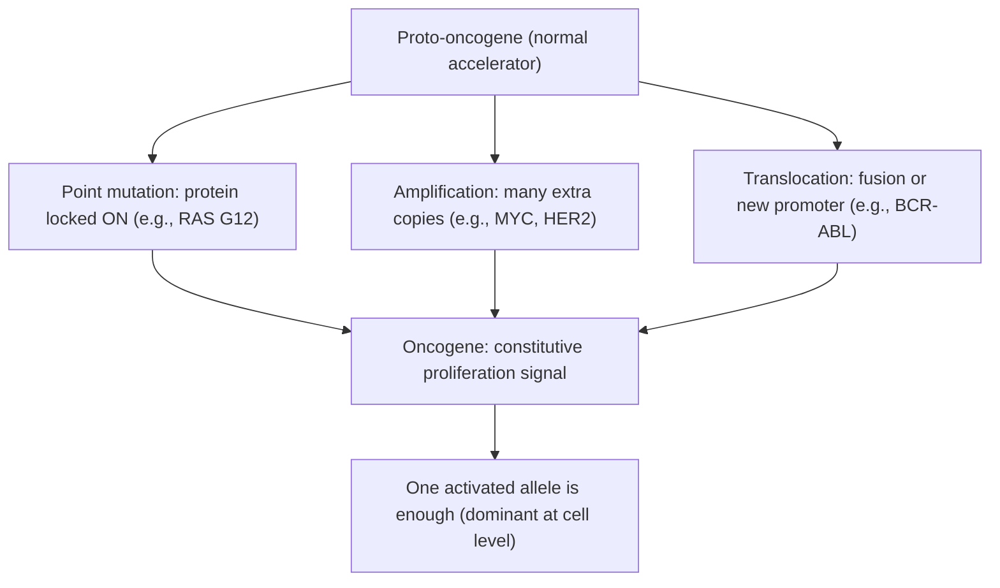
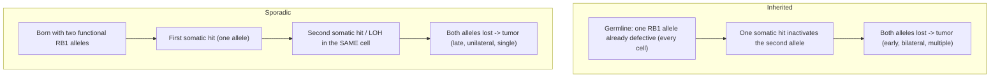
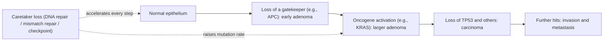
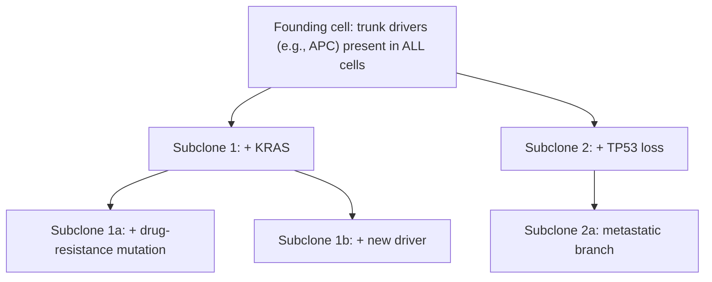

# 인간 유전학 — 암

**강의:** BME333 / BIO333 유전학 (UNIST, 2026 가을) · 23강 · ~60분
**강의계획서:** [← 강의계획서](../../lectures/2026.BME333-BIO333-Syllabus.md) — 14주차, 2026-11-30 (월)
**언어:** [English](../../en/lectures/lec23_Human-Cancer.md) · 한국어

## 학습 목표
이 강의를 마치면 학생들은 다음을 할 수 있어야 합니다:
- 암을 돌연변이의 단계적 축적을 통해 발생하는 체세포의 유전질환으로 설명한다(다단계/클론 진화 모델).
- 종양유전자(oncogene, 기능획득형, 우성)와 종양억제유전자(tumor-suppressor gene, 기능상실형, 세포 수준에서 열성)를 구분하고, Knudson의 2회 타격 가설(two-hit hypothesis)을 유전성 암과 산발성 암에 적용한다.
- 운전자(driver) 돌연변이가 승객(passenger) 돌연변이와 어떻게 구분되는지, 그리고 왜 정상 조직에서도 체세포 돌연변이가 축적되는지 기술한다.
- 종양을 진화하는 세포 집단으로 해석하고, 계통발생학적/집단유전학적 원리가 종양 내 이질성(intratumor heterogeneity)에 어떻게 적용되는지 설명한다.
- 유전성 암 소인 증후군(예: 유전성 유방암, 망막모세포종)을 산발성 종양에서 손상되는 동일한 유전자와 연결한다.

## 강의

### 1. 체세포의 유전질환으로서의 암 (~8분)

암은 근본적으로 **유전질환**이지만, 대개 **유전된(inherited)** 질환은 아니다. 그것은 **체세포(somatic cell)**의 질환이다: 대부분의 암을 일으키는 돌연변이는 사람의 일생 동안 보통 체세포의 DNA에서 생겨나며(복제 오류, 화학적 손상, 방사선, 결함 있는 수선으로부터), 난자나 정자에는 *존재하지 않는다*. 이것이 강의 24의 멘델 질환과의 핵심 차이이다: **생식세포(germline)** 돌연변이는 모든 세포에 있고 유전되지만, **체세포(somatic)** 돌연변이는 한 세포와 그 후손에 국한되며 자손에게 전달되지 않는다.

종양은 **클론성(clonal)**이다: 성장 이점을 획득한 단일 세포에서 유래하므로, 종양 세포들은 그 창시 세포의 돌연변이를 공유한다. 암은 **세포 수에 대한 정상적 조절의 상실** — 증식, 분화, 사멸(apoptosis) 사이의 균형이 깨지는 것 — 으로 이해하는 것이 가장 좋다. 세포가 악성이 되기 위해 획득해야 하는 행동들은 흔히 **암의 특징(hallmarks of cancer)**으로 요약된다: 지속적 증식 신호, 성장 억제자의 회피, 세포 사멸에 대한 저항, 복제 불멸성, 유도된 혈관신생, 그리고 침습과 전이의 활성화 — 여기에 **유전체 불안정성(genome instability)**과 **염증(inflammation)**이 조력 특성(enabling characteristics)으로 더해진다. 모든 특징은 변형된 유전자로 거슬러 올라간다.

중요한 유전자들은 두 개의 큰 기능적 부류로 나뉘며, 이것이 강의 전체의 조직 원리이다:

**그림 — 암의 배후에 있는 두 유전자 부류.**

| | 원종양유전자 → **종양유전자** | **종양억제유전자** |
|---|---|---|
| 정상 역할 | 세포 분열/생존 촉진(가속 페달) | 분열 억제; DNA 수선; 사멸 촉발(브레이크) |
| 암 유발 변화 | **기능획득(gain of function)** | **기능상실(loss of function)** |
| 변해야 하는 대립유전자 | **하나**(세포 수준에서 우성) | 보통 **둘 다**(세포 수준에서 열성) |
| 전형적 돌연변이 | 점돌연변이, 유전자 증폭, 전좌 | 점/절단 돌연변이, 결실, 이형접합성 소실, 침묵화 |
| 예 | *RAS*, *MYC*, *BCR-ABL* | *RB1*, *TP53*, *BRCA1/2*, *APC*, *NF1*, 부정합 수선 유전자 |

유용한 비유: 종양유전자는 **끼어버린 가속 페달**(하나만 눌려 있어도 충분)이고, 종양억제유전자의 상실은 **고장 난 브레이크**(차가 폭주하기 전에 짝을 이룬 제동 시스템의 두 쪽을 모두 잃어야 함)이다.

### 2. 종양유전자와 원종양유전자 (~10분)

**원종양유전자(proto-oncogene)**는 세포 분열이나 생존을 *촉진*하는 것이 임무인 완전히 정상적인 유전자이다 — 성장인자, 수용체, **RAS** 같은 신호전달자, 또는 **MYC** 같은 전사인자. 그러한 유전자를 **과활성이거나 항상 "켜진" 상태**로 만드는 돌연변이는 그것을 **종양유전자(oncogene)**로 전환한다. 단일 과활성 대립유전자만으로 세포를 증식 쪽으로 밀기에 충분하므로, 종양유전자 돌연변이는 **세포 수준에서 우성** — 한 번의 타격으로 충분 — 이다.

기능획득에 이르는 고전적 경로는 세 가지이며, 각각 실제 예에 대응한다:

- **점돌연변이**가 단백질을 "켜짐"으로 고정. *RAS* GTP가수분해효소는 정상적으로 활성 GTP-결합 상태와 비활성 GDP-결합 상태를 오가는데; 단일 미스센스 돌연변이(예: 코돈 12)가 GTP 가수분해를 막아, RAS가 "분열하라"는 신호를 계속 보내는 상태로 고정된다. (바로 이 RAS/MAPK 경로가 *NF1* 종양억제유전자에 의해 억제되는 경로이다 — 6단원 참조.)
- **유전자 증폭(amplification)** — 세포가 유전자의 여분 복사본 수십 개를 만들어 정상 단백질을 과잉 생산하고(예: *MYC* 또는 *ERBB2/HER2* 증폭), 이것이 성장 경로를 범람시킨다.
- **염색체 전좌(translocation)** — 절단-재결합이 두 유전자를 융합하거나 유전자를 강한 프로모터 옆으로 옮긴다. 교과서적 사례는 **필라델피아 염색체(Philadelphia chromosome)**로, *BCR*를 *ABL*에 융합하는 t(9;22) 전좌이며, 만성 골수성 백혈병을 일으키는(그리고 약물 이매티닙의 표적인) 항상 활성화된 타이로신 인산화효소를 만든다.

**그림 — 원종양유전자가 종양유전자가 되는 세 가지 방식(한 번의 타격으로 우성).**

### 3. 종양억제유전자와 2회 타격 가설 (~10분)

**종양억제유전자(tumor-suppressor gene)**는 브레이크이다: 세포 주기를 늦추고, DNA 손상을 감지·수선하며, 손상된 세포에게 죽으라고 명령한다. 이 유전자들이 **기능을 상실**할 때 암이 발생하며, 세포는 보통 **두 개의 복사본(대립유전자)**을 지니므로 브레이크가 고장 나려면 대개 *둘 다* 망가져야 한다. 따라서 기능상실은 **세포 수준에서 열성** — 종양유전자와 정반대 — 이다.

**Knudson의 2회 타격 가설(1971)**은 이를 확립한 우아한 추론이며, 유전학의 큰 수수께끼 하나를 설명한다: 왜 *같은* 암(***RB1*** 상실로 인한 소아 눈 종양인 망막모세포종)이 **유전성** 형태(조기, 흔히 양측성, 다발성 종양)와 **산발성** 형태(늦게, 보통 한쪽 눈, 단일 종양)로 나타나는가. Alfred Knudson은 한 세포에서 *두 RB1* 대립유전자를 모두 불활성화하려면 **두 번의 돌연변이 사건("타격")**이 필요하다고 추론했다:

- **유전성** 망막모세포종에서 아이는 **모든 세포에 결함 있는 *RB1* 대립유전자 하나를 지니고 태어난다**(첫 번째 타격은 생식세포성). 두 번째 대립유전자를 잃는 데는 수백만 개 망막 세포 중 어디서든 **단 한 번의 추가 체세포 타격**만 필요하다. 그 남은 한 단계는 쉽게, 자주 일어나므로, **조기·다발성·양측성** 종양과 우성 *가계* 계보가 나타난다(기전은 세포에서 열성인데도).
- **산발성** 망막모세포종에서 아이는 **두 개의 정상 대립유전자로 시작**하므로, **두 번의 독립적 체세포 타격이 같은 세포를 쳐야** 한다 — 드문 우연이므로 **늦게·단일·편측성** 종양이 나타나고 가족력이 없다.

두 번째 타격은 흔히 새로운 점돌연변이가 아니라 **이형접합성 소실(loss of heterozygosity, LOH)** — 세포가 남은 정상 대립유전자를 지닌 염색체 영역 전체를 잃는 것(염색체 소실, 결실, 유사분열 재조합에 의해) — 으로, 다른 복사본에 이미 있던 돌연변이를 드러낸다. LOH는 종양억제유전자 관여의 분자적 지문이다.

**그림 — Knudson의 2회 타격 모델: 유전성 대 산발성 망막모세포종.**

2회 타격 논리는 주요 유전성 암 유전자(*BRCA1/2*, *TP53*, *APC*, 부정합 수선 유전자)로 일반화된다: 보인자는 모든 세포에 결함 있는 대립유전자 하나를 물려받아 단 한 번의 체세포 두 번째 타격만 필요하며, 이것이 그들의 암 위험이 높고 발병이 이른 이유이다.

### 4. 다단계 종양형성과 유전체 불안정성 (~8분)

단 하나의 돌연변이가 암을 만드는 일은 거의 없다. 악성화는 수년에 걸친 **여러 운전자 돌연변이의 단계적 축적** — 종양유전자를 활성화하고 *그리고* 종양억제유전자를 불활성화하는 것 — 을 요하며, 각각이 추가적 성장 이점을 부여한다. 고전적 예시는 **Fearon–Vogelstein 대장암 진행 모델**이다: 정상 상피 → *APC* 상실(초기 선종) → *KRAS* 활성화(선종 성장) → *TP53*을 포함한 추가 상실 → 암종 → 전이. 각 유전적 단계가 하나의 조직학적 단계에 대응한다.

**그림 — 다단계 종양형성(가속되는 운전자 돌연변이의 축적).**

애초에 그렇게 많은 돌연변이가 어떻게 축적되는가? 특별한 부류의 종양억제유전자인 **관리자 유전자(caretaker gene)**가 정상적으로 돌연변이율을 낮게 유지하기 때문이다. 관리자에는 **DNA 수선 및 부정합 수선(mismatch repair, MMR) 유전자**와 **세포 주기 검문지점(checkpoint)** 유전자가 포함된다. 관리자를 잃는 것 자체가 성장을 이끌지는 않지만, **유전체 불안정성**을 낳아 돌연변이율을 극적으로 높이므로 운전자 돌연변이가 훨씬 빨리 생겨난다 — **돌연변이자 표현형(mutator phenotype)**. 불안정성에는 여러 유형이 있다: **염색체 불안정성(chromosomal instability, CIN)**, MMR 상실로 인한 **미소부수체 불안정성(microsatellite instability, MIN/MSI)**(Lynch 증후군의 근거), 그리고 **APOBEC** 매개 탈아미노화 같은 국소적 과돌연변이(hypermutation)([en](../../en/review/Schwartz2017_NatRevGenet_EvolutionTumour-PhylogeneticsPrinciples.md) · [ko](../../ko/review/Schwartz2017_NatRevGenet_EvolutionTumour-PhylogeneticsPrinciples.md) 참조).

이것은 암 유전체학의 중심적 해석 문제를 제기한다: **운전자 대 승객**. **운전자 돌연변이(driver mutation)**는 암에 인과적으로 기여한다(양성 선택됨); **승객 돌연변이(passenger mutation)**는 창시 세포에 우연히 있었거나 도중에 생겨났으며 아무 이점도 주지 않는 방관자이다. 과돌연변이 종양은 수천 개의 돌연변이를 지닐 수 있는데 그중 운전자는 소수에 불과하다. 이 둘을 통계적으로 구분하는 한 방법은 진화생물학에서 빌려온 **dN/dS**이다: 한 유전자에서 침묵(동의) 돌연변이보다 단백질-변화(비동의) 돌연변이가 초과하면 **양성 선택**을 신호하며 그 유전자를 운전자로 표시한다([en](../../en/article/Oliver2025_NatGenet_SomaticMutation-CancerIndependent.md) · [ko](../../ko/article/Oliver2025_NatGenet_SomaticMutation-CancerIndependent.md) 참조).

### 5. 진화하는 세포 집단으로서의 암 (~10분)

종양을 사고하는 가장 깊은 방식은 **다윈적(Darwinian)**이다. Peter Nowell의 **클론 진화 이론(clonal evolution theory, 1976)**은 종양이 여느 진화하는 집단과 똑같은 세 가지 재료 — **돌연변이**(유전 가능한 변이를 생성), **선택**(더 빨리 자라거나 더 잘 생존하는 변이체가 확장), **클론 확장(clonal expansion)**(부동과 성장) — 에 지배되는 **세포 집단**이라고 제안했다. 시간이 지나면서 이것은 **종양 내 이질성(intratumor heterogeneity)**을 낳는다 — 단일 종양은 유래로 연결된, 유전적으로 구별되는 아클론(subclone)들의 조각보이다([en](../../en/review/Schwartz2017_NatRevGenet_EvolutionTumour-PhylogeneticsPrinciples.md) · [ko](../../ko/review/Schwartz2017_NatRevGenet_EvolutionTumour-PhylogeneticsPrinciples.md) 참조).

아클론들이 유래로 연결되어 있으므로, 그 관계는 **계통수(phylogenetic tree)**로 재구성할 수 있다 — **종양 계통발생학(tumor phylogenetics)**의 분야이다. 공유된 "줄기(trunk)" 돌연변이는 공통 조상에 있었고(초기 운전자, 모든 세포에 존재), 사적인 "가지(branch)" 돌연변이는 특정 아클론에서 나중에 생겨났다. 이것은 은유가 아니다: 종(species)에 쓰이는 바로 그 트리 구축 방법(최대 절약법, 최대 우도법, 베이지안/MCMC, 근린결합법)이 벌크 다중영역 또는 단일세포 시퀀싱에서 얻은 종양 데이터에 적용된다.

**그림 — 가지치는 클론 계통으로서의 종양.**

Schwartz & Schäffer(2017)는 **종양 진화가 종 진화와 다른** 네 가지 방식을 강조하는데, 이를 존중하지 않으면 트리가 오도한다: 돌연변이 *유형*(전체 염색체의 획득/상실, 복사본-중립 LOH — 표준 서열 모형을 위반하는 사건들), 훨씬 **높은 돌연변이율**, **치료 아래에서 극적으로 변하는 선택 강도**, 그리고 만연한 **이질성**. 그들은 또한 살아 있는 논쟁을 지적한다: 치료 전 종양이 주로 **다윈적 선택**으로 진화하는지, 아니면 대체로 **중립적(neutral)** 성장으로 진화하는지(Sottoriva et al.의 **"빅뱅(big bang)" 모델**, 여기서는 대부분의 다양성이 초기 폭발에서 생성된 뒤 부동한다). 이 이견은 부분적으로 어떤 마커 유형(SNV 대 CNV)과 방법을 썼는지를 반영한다 — **데이터, 모형, 알고리즘이 모두 생물학과 일치해야 한다**는 경고이다.

임상적으로, 이 진화적 관점은 암이 왜 그토록 치료하기 어려운지를 설명한다: 치료는 **강력한 새 선택압**이며, 기존에 존재하던 **저항성 아클론** — 저항 돌연변이를 이미 지닌 가지 — 이 확장하도록 선택되어 재발을 일으킨다. 트리를 재구성하면 어떤 클론을 표적으로 삼을지 알 수 있고 저항을 예측하는 데 도움이 된다.

### 6. 유전성 암 소인 (~8분)

대부분의 암은 산발성이지만, **암의 ~5–10%**는 사람이 **암 유전자의 생식세포 돌연변이** — 대개 종양억제유전자 — 를 물려받기 때문에 가족력을 보인다. 따라서 3단원의 2회 타격 논리가 직접 적용된다: 보인자는 모든 세포에서 "한 타격 앞서 있다".

**그림 — 주요 유전성 암 소인 증후군.**

| 증후군 | 유전자 | 부류 / 기능 | 암 |
|---|---|---|---|
| 유전성 유방/난소암 | *BRCA1*, *BRCA2* | 종양억제 / DNA 이중가닥 절단 수선(관리자) | 유방, 난소 |
| Li–Fraumeni | *TP53* | 종양억제("유전체의 수호자"; 사멸 + 검문지점) | 육종, 유방, 뇌, 부신 — 다수 |
| Lynch 증후군(HNPCC) | *MLH1, MSH2*, MMR 유전자 | 관리자 / 부정합 수선 → MSI | 대장, 자궁내막 |
| 가족성 망막모세포종 | *RB1* | 종양억제 / 세포주기 브레이크 | 망막모세포종, 골육종 |
| 가족성 선종성 용종증 | *APC* | 종양억제 / 문지기(gatekeeper) | 대장 |
| 신경섬유종증 1형 | *NF1* | 종양억제 / RAS-MAPK 음성 조절자 | 신경섬유종, 신경교종, JMML |

두 가지 교육 요점. 첫째, **같은 유전자들이 산발성 종양을 이끈다**: *TP53*은 모든 산발성 암의 큰 비율에서 체세포성으로 돌연변이되며, *BRCA* 경로 결함도 체세포성으로 발생한다. 유전성 암과 산발성 암은 다른 경로로 도달한 같은 질병이다. 둘째, **비교유전학(comparative genetics)**은 가족 연구(*BRCA1/2* 같은 드물고 고침투도 유전자만 포착 — 유전성 위험의 25% 미만)에는 보이지 않는 **중간 침투도의 흔한** 위험 대립유전자를 찾아낼 수 있다. Gould의 연구 프로그램은 쥐 유방암 감수성 유전자좌(*Mcs1–5*)를 지도화하여 사람으로 번역했다: 복합 *Mcs5a* QTL을 ~100-kb 영역으로 정밀 지도 작성하여, 그의 팀이 바로 그 상동 구간만을 12,000명 여성에서 검정하고(유전체 전역 스캔의 다중검정 벌점을 대폭 줄여) 비코딩 변이에서 실제 유방암 연관을 찾을 수 있게 했다 — 게다가 기전을 규명할 쥐 모델을 손에 쥔 채로([en](../../en/review/Gould2009_Genetics_ComparativeGenetics-BreastCancer.md) · [ko](../../ko/review/Gould2009_Genetics_ComparativeGenetics-BreastCancer.md) 참조). 이는 산발성 종양 유전학, 유전성 소인, QTL 지도 작성을 잇고, **유전 상담**의 토대가 된다: 보인자의 유전형을 아는 것이 위험을 정량화하고 선별검사나 예방을 안내한다.

### 7. 암을 넘어선 체세포 돌연변이 및 정리 (~6분)

최근의 놀라운 발견이 이 깔끔한 그림을 복잡하게 만든다: **양성 선택 아래 있는 암 운전자 돌연변이를 포함한 체세포 돌연변이가 나이가 들면서 조직학적으로 정상인 조직에 축적된다** — 종양이 없어도. 정상 피부, 대장, 식도, 혈액은 경쟁하는 돌연변이 클론들의 모자이크이다.

Oliver et al.(2025)의 *NF1* 연구가 이를 구체화하며 Knudson을 직접 확장한다. **신경섬유종증 1형**(모든 세포에 생식세포 *NF1* 첫 타격)을 가진 아이들에서, 연구팀은 838개의 미세절제 세포군을 시퀀싱하여 **여러 개의 독립적인 체세포 두 번째 타격 in *NF1*** — 절단 돌연변이와 **LOH** — 이 *조직학적으로 정상인* 뇌, 신경, 기타 신경외배엽 조직 전반에 흩어져 있고 미이환 아동에서는 *부재*함을 발견했다([en](../../en/article/Oliver2025_NatGenet_SomaticMutation-CancerIndependent.md) · [ko](../../ko/article/Oliver2025_NatGenet_SomaticMutation-CancerIndependent.md) 참조). **dN/dS 분석은** 정상 조직에서 절단성 *NF1* 변이에 대한 **양성 선택을 보였다**: *NF1*-널(null) 세포는 뉴로파이브로민(RAS-MAPK 브레이크)의 상실이 성장 이점을 주기 때문에 클론성으로 확장한다. 결정적 뉘앙스: **2회 타격("두 대립유전자 모두 상실") 상태는 정상 조직에서 흔하지만 암에 *충분하지는 않다*** — 대부분의 이중-타격 클론은 결코 종양이 되지 않는다. 따라서 "두 번째 타격 = 신생물"이라는 고전적 가정은 너무 단순하다: 두 번째 타격은 널리 퍼져 있으며, 형질전환에는 추가로 협력하는 사건이나 맥락이 필요하다. 이는 또한 **운전자 대 승객** 문제를 날카롭게 한다 — 종양에서 발견된 "운전자" 돌연변이가 환자의 정상 조직에도, 양성 선택된 채로, 앉아 있을 수 있다.

**종합.** 암은 **운전자 돌연변이의 단계적 축적**으로 지어진 **체세포 유전질환**이다 — **종양유전자**를 활성화(한 번의 우성 타격)하고 **종양억제유전자**를 불활성화(두 번의 열성 타격, **Knudson**에 따라)하며 — **관리자 상실과 유전체 불안정성**에 의해 가속되고, 이질성과 치료 저항성을 낳는 **다윈적 클론 진화**로 전개된다. 유전성 소인은 첫 타격이 생식세포에 미리 장전된 같은 질병이다. 그리고 가장 새로운 반전 — 정상 조직에 만연한, 양성 선택된 체세포 돌연변이 — 은 "정상 노화"와 "암" 사이의 경계가 단일 스위치가 아니라 정도와 협력의 문제임을 상기시킨다.

## 핵심 정리
- 암은 **체세포의 유전질환**이다: 클론성이며, 세포 자신의 DNA에 생긴 돌연변이가 이끌고, 대부분 **유전되지 않으며**; 정상적 성장 조절의 상실이다.
- **종양유전자** = **기능획득**, 세포 수준에서 **우성**, **한 번의 타격**(점돌연변이, 증폭, 전좌 — 예: *RAS*, *MYC*, *BCR-ABL*). **종양억제유전자** = **기능상실**, **열성**, 보통 **두 대립유전자** 모두 상실(예: *RB1*, *TP53*, *BRCA1/2*).
- **Knudson의 2회 타격 가설**은 유전성(생식세포 첫 타격 → 한 번의 체세포 타격 → 조기/양측성) 대 산발성(한 세포에 두 번의 체세포 타격 → 늦게/편측성) 암을 설명한다; 두 번째 타격은 흔히 **이형접합성 소실(LOH)**이다.
- 악성화는 **다단계**이다: 여러 운전자가 축적된다; **관리자 유전자 상실**이 **유전체 불안정성**(CIN, MSI, APOBEC)을 일으켜 돌연변이를 가속한다. **운전자 대 승객**은 **dN/dS** 같은 양성 선택 신호로 구분할 수 있다.
- 종양은 **종양 내 이질성**을 지닌 **다윈적 집단**(돌연변이 + 선택 + 클론 확장)으로, **계통수**로 재구성 가능하며; **치료는 저항성 아클론을 선택**한다(재발). 중립적 "빅뱅" 대 선택 논쟁과 CNV-모형의 함정을 경계하라.
- **유전성 소인**(*BRCA1/2*, *TP53*/Li–Fraumeni, Lynch/MMR, *RB1*, *APC*, *NF1*)은 산발성 종양과 같은 유전자를 사용한다; 비교유전학은 흔하고 중간 침투도인 위험 대립유전자를 찾아낸다.
- **양성 선택 아래의 체세포 운전자 돌연변이가 나이와 함께 정상 조직에 만연**한다(정상 신경/뇌의 *NF1* 두 번째 타격); 2회 타격 상태는 흔하지만 암에 **충분하지 않다** — 형질전환에는 협력하는 사건이 필요하다.

## 교재 참고
- **Genetics: From Genes to Genomes (8e)** — 23장 The Genetics of Cancer. → [textbook ref](../../lectures/ref.Genetics-FromGenesToGenomes.md)

## 이 저장소의 노트
수업에서 소개할 리뷰와 논문 (각각 en/ko 이중언어 쌍이 있음):
- `Oliver2025_NatGenet_SomaticMutation-CancerIndependent` — 체세포 돌연변이는 암과 무관하게 정상 조직에서 축적된다; "운전자 대 승객" 및 노화 논의를 정교하게 다듬는 데 활용. · [en](../../en/article/Oliver2025_NatGenet_SomaticMutation-CancerIndependent.md) · [ko](../../ko/article/Oliver2025_NatGenet_SomaticMutation-CancerIndependent.md)
- `Schwartz2017_NatRevGenet_EvolutionTumour-PhylogeneticsPrinciples` — 계통발생학적 원리를 종양 진화에 적용; "진화하는 집단으로서의 암" 부분의 핵심 자료. · [en](../../en/review/Schwartz2017_NatRevGenet_EvolutionTumour-PhylogeneticsPrinciples.md) · [ko](../../ko/review/Schwartz2017_NatRevGenet_EvolutionTumour-PhylogeneticsPrinciples.md)
- `Gould2009_Genetics_ComparativeGenetics-BreastCancer` — 유방암의 비교유전학; 산발성 종양 유전학과 유전성 소인을 잇는다. · [en](../../en/review/Gould2009_Genetics_ComparativeGenetics-BreastCancer.md) · [ko](../../ko/review/Gould2009_Genetics_ComparativeGenetics-BreastCancer.md)

## 토론 문제
1. 망막모세포종은 유전성 형태(조기, 양측성, 다발성 종양)와 산발성 형태(늦게, 편측성, 단일)로 발생한다. Knudson의 2회 타격 가설을 사용해 두 양상을 설명하고, *RB1* 상실이 세포 수준에서 *열성*인데도 유전성 형태가 왜 가계 계보에서 *우성*인지 설명하라.
2. 종양유전자 돌연변이는 세포 수준에서 우성(한 번의 타격)이고 종양억제유전자 돌연변이는 열성(두 번의 타격)이다. 이 차이의 기전적 이유를 설명하고, **이형접합성 소실**이 어떻게 종양억제유전자에 두 번째 타격을 전달하는지 기술하라.
3. **운전자** 돌연변이와 **승객** 돌연변이를 구분하라. **관리자** 유전자를 잃는 것이 왜 운전자의 축적을 쉽게 만드는지, 그리고 **dN/dS**를 어떻게 사용해 종양(또는 정상) 조직에서 양성 선택 아래 있는 유전자를 식별할 수 있는지 설명하라.
4. 종양 진화는 어떤 구체적 방식으로 종 진화와 다른가(Schwartz & Schäffer)? 한 가지 차이를 골라, 그것을 무시하면 어떻게 오도하는 계통수 또는 선택 대 중립("빅뱅") 진화에 대한 잘못된 결론을 낳을 수 있는지 설명하라.
5. Oliver et al.은 양성 선택 아래의 *NF1* 두 번째 타격이 NF1 환자의 *정상* 조직에 만연함을 발견했지만, 그러한 클론 대부분은 결코 암이 되지 않는다. 이 발견은 Knudson 모델을 어떻게 **지지하는 동시에 복잡하게** 만드는가? "운전자 돌연변이"를 암 위험의 생물표지자로 사용하는 데 이것은 무엇을 함의하는가?
