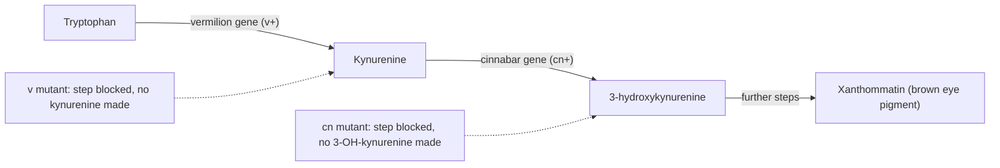
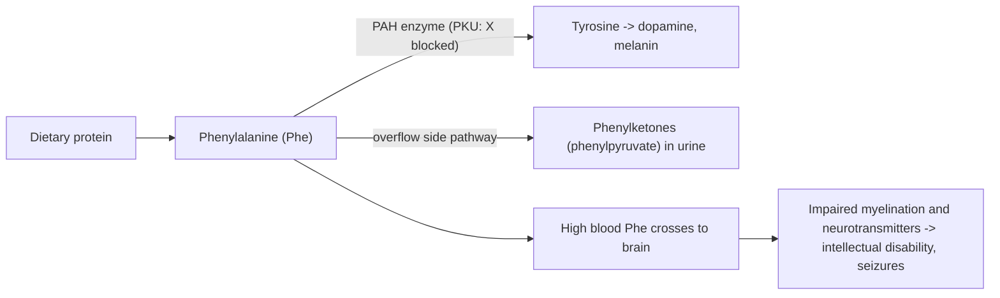
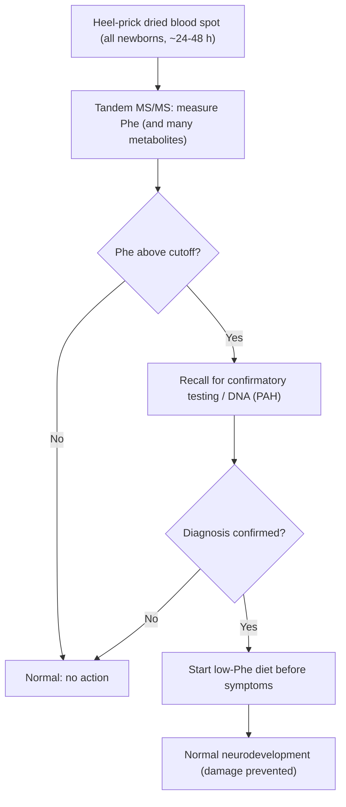
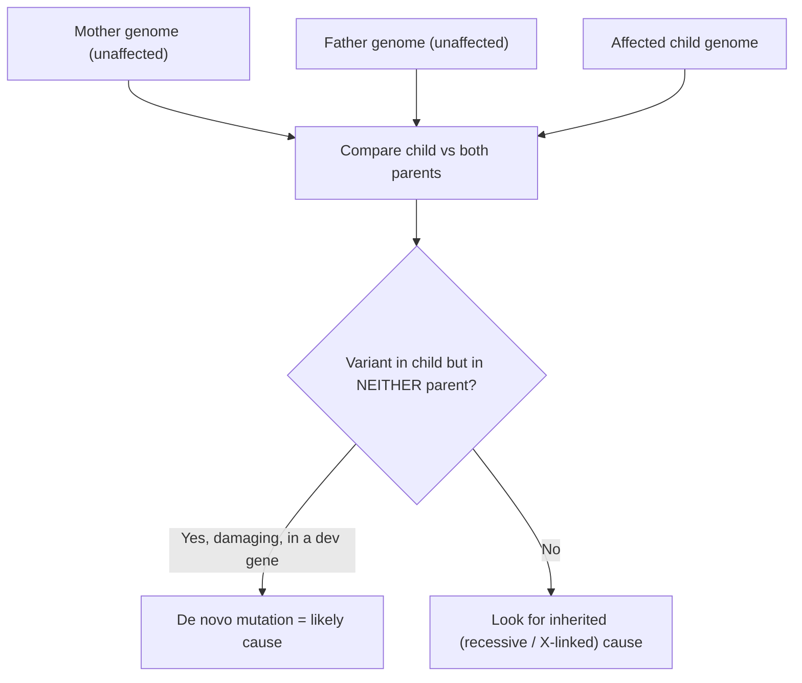
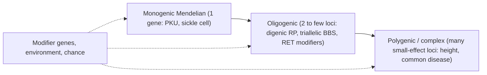

# 인간 유전학 — 발달 및 대사 질환

**강의:** BME333 / BIO333 유전학 (UNIST, 2026 가을) · 24강 · ~60분
**강의계획서:** [← 강의계획서](../../lectures/2026.BME333-BIO333-Syllabus.md) — 14주차, 2026-12-02 (수)
**언어:** [English](../../en/lectures/lec24_Human-Dev-Metabolic-Disorder.md) · 한국어

## 학습 목표
이 강의를 마치면 학생들은 다음을 할 수 있어야 한다:
- 대사 효소의 단일 유전자 결함이 어떻게 질병을 일으키는지 설명하고, Garrod의 선천성 대사 이상에서 현대 유전성 대사 질환에 이르는 "1유전자–1효소(one gene–one enzyme)" 논리를 추적한다.
- 선천성 대사 이상(inborn errors of metabolism)을 분류하고(중독형, 에너지대사형, 저장/복합분자형), PKU와 같은 신생아 선별검사(newborn screening)의 근거를 설명한다.
- 배아 발달을 조절하는 유전자의 교란으로부터 발달 장애가 어떻게 발생하는지, 특히 신생 돌연변이(de novo mutation)의 주요 역할을 포함하여 설명한다.
- 인간 질병에서 단순 멘델 유전을 소수유전자(oligogenic)/수식인자(modifier) 효과 및 발현도 변이(variable expressivity)와 구별한다.
- 유전자형을 표현형에, 그리고 치료 가능한 질환의 치료적/식이적 개입에 연결한다.

## 강의

### 1. Garrod에서 유전체까지: 1유전자–1효소의 기초 (~10분)

유전성 대사 질환의 전체 논리는 단 하나의 아이디어에 기반한다: **하나의 유전자가 하나의 효소를 지정하고, 효소가 대사 경로의 한 단계를 촉매하며, 그 효소를 무력화하는 돌연변이가 그 단계를 끊는다.** 이것이 **1유전자–1효소 가설(one gene–one enzyme hypothesis)**이며, 그 이야기는 고전 유전학의 깔끔한 승리 중 하나이다.

첫 실마리는 의사 **Archibald Garrod**에게서 왔는데, 그는 1908년에 **알캅톤뇨증(alkaptonuria)**과 기타 상태를 **"선천성 대사 이상(inborn errors of metabolism)"**으로 기술했다. 알캅톤뇨증 환자는 호모겐티스산(homogentisic acid)을 분해하지 못해 방치하면 검게 변하는 소변을 배설하는데 — Garrod는 유전자가 무엇으로 이루어졌는지 아무도 알기 수십 년 전에, 열성 형질로 유전되는 **차단된 화학 단계(blocked chemical step)**를 정확히 추론했다. 그는 사실상 유전적 결함이 곧 결여된 효소 활성과 같다고 제안한 것이다.

실험적 증명은 **George Beadle**과 동료들에게서 왔다. 먼저, **Beadle–Ephrussi의 *Drosophila* 눈 원반 이식 실험(1936)**: 유충 사이에 눈 성충원기(imaginal disc)를 이식하여, 그들은 돌연변이 **vermilion (v)**와 **cinnabar (cn)**가 **비자율적(non-autonomous)**임을 발견했다 — 이식된 원반의 색이 *숙주*의 유전자형에 의존했으며, 이는 숙주가 돌연변이체가 만들지 못하는 **확산성 화학물질(diffusible chemical)**을 공급함을 뜻했다([en](../../en/review/Horowitz1996_Genetics_BiochemGenetics.md) · [ko](../../ko/review/Horowitz1996_Genetics_BiochemGenetics.md) 참조). 그 확산성 물질들은 나중에 생화학적으로 규명되었고(v⁺ 물질은 **키뉴레닌(kynurenine)**, cn⁺ 물질은 **3-하이드록시키뉴레닌(3-hydroxykynurenine)**), **각 유전자가 한 단계를 조절하는** 눈-색소 경로를 지도화했다:

**그림 — 1유전자, 1효소: 각 단계는 자신의 유전자를 필요로 한다(Drosophila 눈-색소 경로).**


Beadle과 **Edward Tatum**은 이어 곰팡이 ***Neurospora crassa*** (1941)로 그 논리를 체계화했다: 포자에 방사선을 조사하고, 특정 영양소가 공급되지 않으면 더 이상 자라지 못하는 돌연변이를 분리하여, **각 돌연변이가 한 생합성 경로의 한 효소를 무력화함**을 보였다 — 정식 **1유전자–1효소 가설**(1958년 노벨상). 이 아이디어는 나중에 **"1유전자–1폴리펩타이드(one gene–one polypeptide)"**로, 그다음 **유전자–단백질 공선성(colinearity)**으로 정련되었다 — *E. coli trpA* 유전자의 돌연변이 자리들의 선형 순서가 트립토판 합성효소의 변형된 아미노산의 선형 순서와 단계별로 일치함을 **Charles Yanofsky**가 입증한 것이다([en](../../en/review/Yanofsky2005_Genetics_TryptophanSynthase-OneGeneOneEnzyme.md) · [ko](../../ko/review/Yanofsky2005_Genetics_TryptophanSynthase-OneGeneOneEnzyme.md) 참조). 이것이 멘델의 추상적 "인자(factor)"에서 실제 단백질로 — 그리고 질병으로, 왜냐하면 **돌연변이된 유전자는 결함 있는(또는 없는) 단백질을 뜻하므로** — 이어지는 분자적 다리이다.

### 2. 선천성 대사 이상: 논리와 분류 (~10분)

**선천성 대사 이상(inborn error of metabolism, IEM)**은 결함 있는 효소(또는 수송체/조효소)가 대사 경로를 끊는 유전 질환이다. 개별적으로는 각 IEM이 **드물지만**, **전체적으로는 흔하다**(수백 개의 질환이 합쳐져 상당한 출생 유병률을 이룬다) — 바로 이 때문에 집단 선별검사가 값을 한다(4단원). 거의 모두가 **상염색체 열성(autosomal recessive)** 유전을 따른다: 결함 있는 대립유전자 둘이면 효소 활성이 필요한 역치 아래로 떨어지는 반면, ~50% 활성을 지닌 이형접합 보인자는 대개 건강하다.

임상 결과는 **차단이 어디에 자리하는지**에서 직접 따라온다. 한 단계를 막으면 두 가지 가능한 효과가 있고, 둘 다 질병을 일으킬 수 있다:

**그림 — 효소 차단의 논리.**
```
            enzyme (gene product)
 SUBSTRATE  ─────X (block)─────►  PRODUCT  ───► downstream product
    │                                 │
    │ accumulates                     │ deficient / missing
    ▼                                 ▼
 TOXIC BUILD-UP                  LOSS OF NEEDED PRODUCT
 (e.g., Phe in PKU)             (e.g., no melanin in albinism)
    │
    ▼
 may spill into an
 alternative (side) pathway → abnormal metabolites
```

이 단 하나의 도식으로부터 질병의 성격을 예측할 수 있으며, 이것이 세 그룹으로의 표준 **병태생리학적 분류(pathophysiologic classification)**(Saudubray)의 기반이다:

**그림 — IEM의 세 가지 병태생리학적 부류.**

| 부류 | 핵심 기전 | 전형적 발현 | 예 |
|---|---|---|---|
| **중독형(intoxication)** | 작은 독성 분자가 차단의 상류에 축적 | 무증상 기간 후 급성/진행성 중독; 흔히 기질 제거/제한으로 치료 가능 | PKU, 단풍시럽뇨병, 요소회로 결함, 갈락토스혈증 |
| **에너지대사형(energy metabolism)** | 에너지의 생산 또는 사용 실패(미토콘드리아/지방산 산화, 해당과정) | 저혈당, 젖산산증, 심근병증, 근무력 — 에너지 요구가 높은 장기 | 지방산 산화 결함, 미토콘드리아 질환 |
| **저장/복합분자형(storage / complex molecule)** | 큰 분자가 분해되지 못하고 리소좀/소기관에 축적 | 만성, 진행성 저장; 장기비대, 신경퇴행 | 리소좀 축적병(Gaucher, Tay–Sachs) |

**차단의 위치가 임상 양상을 예측한다**: 상류의 독성 축적은 식이 제한에 반응하는 *중독형* 질환을 낳고; 끊긴 에너지 단계는 뇌·심장·근육을 치는 *에너지형* 질환을 낳으며; 거대분자 분해 실패는 시간이 지날수록 악화되는 *저장형* 질환을 낳는다. 이 틀은 당황스러운 희귀 질환 목록을 소수의 예측 가능한 패턴으로 바꿔놓는다.

### 3. 모델 IEM으로서의 페닐케톤뇨증 (~8분)

**페닐케톤뇨증(phenylketonuria, PKU)**은 *치료 가능한* 유전 질환의 원형이며 신생아 선별검사가 존재하는 이유이다. 이는 아미노산 **페닐알라닌(phenylalanine, Phe)**을 **타이로신(tyrosine, Tyr)**으로 전환하는 간 효소 **페닐알라닌 수산화효소(phenylalanine hydroxylase, PAH)**의 열성 기능상실로 인해 생긴다. 그 단계를 막으면 식이 단백질로부터 계속 공급되는 Phe가 **독성 수준까지 축적**되고(전형적 *중독형* IEM), 그 하류 산물인 Tyr은 상대적으로 결핍된다.

**그림 — PKU 대사 차단.**


치료하지 않으면 높은 혈중 Phe가 발달 중인 뇌를 손상시켜 **심각하고 비가역적인 지적 장애, 경련, 색소 감소**(Tyr, 즉 멜라닌의 전구체가 낮아 멜라닌이 적음)를 일으킨다. 비극은 **아이가 신경학적으로 정상으로 태어난다**는 것이다 — 손상은 수유가 시작된 후에야 축적된다. 바로 그 사실이 PKU를 조기 발견의 완벽한 표적으로 만든다: **증상이 나타나기 전에 발견하여 단지 식이 Phe를 제한하면 아이는 정상적으로 발달한다.** 유전자형이 표현형에, 그리고 구체적 개입에 사상된다 — 강의 전체의 주제이다.

### 4. 신생아 선별검사와 치료 원리 (~8분)

**무증상이면서 치료 가능한** 창(window)이 존재하기 때문에, PKU는 **집단 신생아 선별검사**를 촉발했다. Robert Guthrie의 1960년대 건조 **혈액 반점(blood spot)**("발뒤꿈치 채혈" 카드)에 대한 세균 억제 분석법이 최초의 대량 선별이었고; 오늘날에는 단일 혈액 반점을 **탠덤 질량분석(tandem mass spectrometry, MS/MS)**으로 분석하는데, 이것은 수십 개의 대사산물을 한 번에 정량하여 하나의 시료로 **여러 IEM을 동시에** 선별한다. 그 논리는 공중보건 의사결정 규칙이다:

**그림 — 신생아 선별검사 논리(PKU를 모델로).**


선별검사는 치료가 존재할 때에만 가치가 있다. IEM의 치료 전략은 2단원의 차단 도식에서 직접 따라오며 — **네 가지 일반적 접근** 이다:

**그림 — IEM에 대한 네 가지 치료 전략.**

| 전략 | 근거(차단에 상대적) | PKU / 기타 예 |
|---|---|---|
| **기질 제한** | 독성 상류 대사산물을 낮춘다 | 저-페닐알라닌 식이 |
| **결핍 산물 공급** | 경로가 더 이상 만들지 못하는 것을 대체 | 타이로신 보충; 다른 IEM에서 티록신 |
| **독성 대사산물 제거/해독** | 대체 경로로 독을 배출 | 요소회로 결함에서 암모니아 제거제 |
| **잔존 효소 활성 강화** | 부분적으로 기능하는 효소를 돕는다 | BH₄-반응성 PKU에서 BH₄(sapropterin) 조효소; 저장병에서 효소 대체 요법 |

PKU는 주로 첫 번째 전략(평생 저-Phe 식이)으로 관리되며, 반응성 유전형에는 조효소 요법을 병행한다. 원리는 일반화된다: **경로를 이해하면 무엇이 잘못되는지와 어떻게 개입할지를 모두 알 수 있다.** (Garrod의 1908년 선천성 대사 이상에서 신생아 선별검사를 거쳐 효소 대체 및 유전자 치료에 이르는 이 분야의 궤적은 아래 Arnold와 Saudubray 리뷰 참조.)

### 5. 발달 장애의 유전학 (~10분)

대사 질환이 *화학적* 경로를 끊는다면, **발달 장애(developmental disorder)**는 *발달* 프로그램 — 배아를 패턴화하고 장기를 짓는 유전자 — 을 끊는다. 발달은 조절 유전자(신호 분자, 수용체, 전사인자, **Hox** 패턴화 유전자 포함)의 위계에 의해 지휘되며, 이들이 올바른 세포에서 올바른 시간에 다른 유전자를 켜고 끈다. 하나를 교란하면 **선천 기형(congenital malformation)**(구조적 출생 결함)이나 **신경발달 장애(neurodevelopmental disorder)**(지적 장애, 자폐, 뇌전증)를 얻는다.

한 가지 결정적 유전 특징이 많은 심각한 발달 장애를 열성 IEM과 구별한다: ***신생(de novo)* 돌연변이**의 압도적 역할. **신생 돌연변이**는 아이에게는 존재하지만 **부모 어느 쪽에도 없는** 새 돌연변이이다 — 부모의 생식세포(난자나 정자)에서 또는 배아 초기에 매우 일찍 생겨났다. 이것이 중요한 이유는 심각한 발달 장애가 흔히 **번식력을 감소시켜** 원인 대립유전자가 전달될 수 없고 대신 **세대마다 새로운 돌연변이로 재생성되어야** 하기 때문이다. 그런 사례는 **가족력이 없고** 고전적 멘델 계보를 따르지 않지만, 여전히 단일 유전자의 고침투도 질환이다.

여기서의 진단 혁명은 **삼자 시퀀싱(trio sequencing)** — **이환된 아이와 미이환 부모 양쪽**의 엑솜 또는 유전체 시퀀싱 — 이다. 세 유전체를 비교하면 아이에게만 존재하는(신생) 변이를 표시하고, 아주 새로운 돌연변이라도 원인 유전자를 짚어낼 수 있다:

**그림 — 삼자 시퀀싱이 신생 원인을 식별한다.**


이 기여의 규모는 크다: Kaplanis et al.(2020)의 수만 가족을 대상으로 한 삼자 연구는 **신생 돌연변이가 발달 장애의 주요 원인**임을 발견했고, 의료 데이터와 연구 데이터를 결합하여 28개 질환을 정의했다 — 아래 PubMed 목록 참조. 삼자 시퀀싱은 원인 미상 발달 장애를 가진 아이들의 최일선 진단 검사가 되었다.

### 6. 단순 멘델을 넘어서: 수식인자와 발현도 (~8분)

실제 인간 질병은 흔히 교과서적 멘델주의처럼 행동하기를 거부한다. **겸형적혈구병(sickle cell disease)** — 겸형 헤모글로빈을 만드는 단일 점돌연변이(HBB^E6V), HbS 동형접합자에서 열성 — 같은 "고전적 멘델 질환"조차 엄밀히 단일유전자성이 아니다: ***BCL11A*** 같은 **수식 유전자(modifier gene)**가 태아 헤모글로빈(HbF)을 높여 질병을 **완화**하며, 같은 HbS 대립유전자는 이형접합자에서 중증 말라리아에 대해 **보호적(우성)**이다 — *같은 분자*가 서로 다른 형질에 대해 다른 우성을 보이는 것이다([en](../../en/review/Makani2022_NatRevGenet_MendelianDisorder.md) · [ko](../../ko/review/Makani2022_NatRevGenet_MendelianDisorder.md) 참조). 깔끔한 단일유전자 형질과 완전히 다인자적인 형질 사이에 **소수유전자 유전(oligogenic inheritance)** — **둘에서 소수의 상호작용하는 유전자좌**에 의존하는 질병 — 이 놓여 있다([en](../../en/review/Badano2002_NatRevGenet_BeyondMendel.md) · [ko](../../ko/review/Badano2002_NatRevGenet_BeyondMendel.md) 참조):

- **이유전자 유전(digenic inheritance):** 질병이 **두** 유전자의 돌연변이가 함께 있어야 발생한다. 한 형태의 색소성 망막염에서는 *ROM1*과 *RDS/peripherin*의 **이중 이형접합자**만 이환된다 — 어느 한쪽 돌연변이만으로는 충분하지 않다.
- **삼대립유전자 유전(triallelic inheritance):** **Bardet–Biedl 증후군(BBS)**에서는 한 *BBS* 유전자의 두 돌연변이 *더하기* **두 번째** *BBS* 유전자의 세 번째 돌연변이가 질병이 나타날지, 얼마나 심하게 나타날지를 조절한다 — "2 + 1" 대립유전자 모델.
- **수식 유전자좌(modifier loci):** Hirschsprung 병에서는 일차 *RET* 돌연변이의 중증도가 *EDNRB* 및 기타 유전자좌에 의해 조율된다.

두 가지 기전이 제안된다: **용량 모델(dosage model)**(모든 유전자좌에서 나온 총 기능적 유전자 산물이 역치 아래로 떨어짐)과 **독물 모델(poison model)**(돌연변이 산물이 파트너를 능동적으로 방해함). 이 틀은 순수 멘델주의로는 설명할 수 없는 두 임상 수수께끼를 설명한다: **불완전 침투도(incomplete penetrance)**(일부 유전형 보인자는 이환되지 않음)와 **발현도 변이(variable expressivity)**(같은 원인 유전형이 사람마다 다른 중증도를 낳음) — **수식 대립유전자**, 환경, 우연에서 오는 차이들이다.

**그림 — 하나의 유전자에서 여럿까지의 스펙트럼.**


### 7. 종합 및 임상적 전망 (~6분)

이 강의를 잇는 실은 **유전자형-표현형 추론(genotype-to-phenotype reasoning)**이다. Garrod, Beadle–Tatum, Yanofsky는 **하나의 유전자가 하나의 단백질을 만들고 망가진 유전자가 하나의 경로를 끊는다**는 것을 확립했다 — 의학유전학의 창시 논리이다. **선천성 대사 이상**은 그 논리의 가장 깔끔한 형태이다: 효소를 알고, 축적되는 독소나 결핍되는 산물을 예측하고, 질병을 분류하고(중독형 / 에너지형 / 저장형), 합리적 치료를 설계한다(기질 제한, 산물 공급, 해독, 또는 효소 강화). **PKU**는 전체 궤적을 보여준다 — 단일 효소 결함에서 집단 **신생아 선별검사**로, 그리고 장애를 예방하는 식이로.

**발달 장애**는 같은 추론을 배아를 짓는 유전자로 확장하며, 여기서 ***신생(de novo)* 돌연변이**와 **삼자 시퀀싱**이 이제 진단을 지배한다. 그리고 **"멘델을 넘어서"** — 수식인자, 소수유전자 및 삼대립유전자 유전, 불완전 침투도, 발현도 변이 — 는 단일유전자 질병조차 표현형을 빚는 유전적 배경 위에서 전개됨을 상기시킨다.

임상적으로 이 분야는 한 번에 한 유전자를 검사하는 것에서 **유전체 기반 진단(genome-based diagnosis)**으로 옮겨가고 있다: 삼자 엑솜/유전체 시퀀싱이 진단 수율을 높이고, MS/MS 신생아 선별검사가 치료 가능한 IEM을 증상 전에 잡아내며, 유전자 및 효소 대체 요법(겸형적혈구병과 리소좀 축적병에서 이미 현실)이 유전형 지식을 치료로 바꾼다. Garrod의 1908년 "선천성 대사 이상"에서 CRISPR 교정에 이르는 길은 하나의 아이디어 — 하나의 유전자, 하나의 단백질, 하나의 경로 — 를 그 치료적 결론까지 좇은 이야기이다.

## 핵심 정리
- **1유전자–1효소**(Garrod → Beadle–Ephrussi → Beadle–Tatum → Yanofsky 공선성): 하나의 유전자가 하나의 단백질을 지정한다; 돌연변이가 경로 단계를 끊어, **기질이 축적**되거나 **산물이 결핍**된다.
- **선천성 대사 이상**은 개별적으로는 드물지만 전체적으로는 흔하며, 대부분 **상염색체 열성**이다; 기전에 따라 **중독형**, **에너지형**, **저장/복합분자형** 그룹으로 분류하며 — **차단의 위치가 임상 양상을 예측한다**.
- **PKU** = 열성 **PAH** 결핍 → 독성 **페닐알라닌** 축적 → *정상으로 태어난* 영아의 뇌 손상; 전형적 **치료 가능** IEM이자 신생아 선별검사의 기원.
- **신생아 선별검사**(건조 혈액 반점 → **탠덤 MS/MS**)는 **무증상이면서 치료 가능한** 창이 존재하기에 유효하다; **네 가지 치료**는 기질 제한, 산물 공급, 독소 제거, 잔존 효소 강화이다.
- **발달 장애**는 배아-패턴화 유전자를 교란한다; ***신생(de novo)* 돌연변이**가 주요 원인(가족력 없음)이며, **삼자(아이 + 부모) 시퀀싱**이 진단의 열쇠이다.
- **멘델을 넘어서:** **소수유전자**(이유전자 RP), **삼대립유전자**(Bardet–Biedl), **수식인자** 효과(겸형적혈구 *BCL11A*; Hirschsprung *RET*/*EDNRB*)가 **불완전 침투도**와 **발현도 변이**를 설명한다 — 같은 유전형, 다른 표현형.

## 교재 참고
- **Genetics: From Genes to Genomes (8e)** — 22장 Genetic Analysis of Development; 2장 Extensions to Mendel(단일유전자 질환의 맥락). → [textbook ref](../../lectures/ref.Genetics-FromGenesToGenomes.md)

## 이 저장소의 노트
수업에서 소개할 리뷰 및 논문(각각 en/ko 이중언어 쌍이 있음):
- `Yanofsky2005_Genetics_TryptophanSynthase-OneGeneOneEnzyme` — 1유전자–1효소와 하나의 대사 경로를 분자 수준에서 상세히 규명; 대사 질환 논리의 역사적 기준점. · [en](../../en/review/Yanofsky2005_Genetics_TryptophanSynthase-OneGeneOneEnzyme.md) · [ko](../../ko/review/Yanofsky2005_Genetics_TryptophanSynthase-OneGeneOneEnzyme.md)
- `Horowitz1996_Genetics_BiochemGenetics` — 생화학 유전학의 역사; 효소 결핍이 어떻게 유전 질환으로 이해되었는지를 설정한다. · [en](../../en/review/Horowitz1996_Genetics_BiochemGenetics.md) · [ko](../../ko/review/Horowitz1996_Genetics_BiochemGenetics.md)
- `Makani2022_NatRevGenet_MendelianDisorder` — 전형적 멘델 질환으로서의 겸형적혈구병; 유전자형–표현형과 치료의 궤적. · [en](../../en/review/Makani2022_NatRevGenet_MendelianDisorder.md) · [ko](../../ko/review/Makani2022_NatRevGenet_MendelianDisorder.md)
- `Badano2002_NatRevGenet_BeyondMendel` — 소수유전자 유전과 수식인자(Bardet-Biedl); "단순 멘델을 넘어서" 부분에서 활용. · [en](../../en/review/Badano2002_NatRevGenet_BeyondMendel.md) · [ko](../../ko/review/Badano2002_NatRevGenet_BeyondMendel.md)

## 추가 읽기 (PubMed)
PubMed에 따르면:
- Arnold GL. Inborn errors of metabolism in the 21st century: past to present. *Ann Transl Med* 2018;6(24):467. [DOI](https://doi.org/10.21037/atm.2018.11.36) · PMID 30740398 — Garrod의 1908년 선천성 대사 이상에서 신생아 선별검사를 거쳐 효소 대체 및 유전자 치료에 이르기까지 이 분야를 추적한다.
- Saudubray JM, Garcia-Cazorla À. Inborn Errors of Metabolism Overview: Pathophysiology, Manifestations, Evaluation, and Management. *Pediatr Clin North Am* 2018;65(2):179–208. [DOI](https://doi.org/10.1016/j.pcl.2017.11.002) · PMID 29502909 — IEM에 대한 현대적 병태생리학적 분류와 임상적 접근.
- Kaplanis J, Samocha KE, Wiel L, et al. Evidence for 28 genetic disorders discovered by combining healthcare and research data. *Nature* 2020;586(7831):757–762. [DOI](https://doi.org/10.1038/s41586-020-2832-5) · PMID 33057194 — 신생 돌연변이를 발달 장애의 주요 원인으로 규정한 대규모 삼자 시퀀싱 연구.

## 토론 문제
1. "1유전자–1효소" 아이디어를 Garrod의 알캅톤뇨증에서 Beadle–Ephrussi 이식 실험을 거쳐 Yanofsky의 공선성까지 추적하라. 각 단계가 무엇을 더했으며, 왜 이 가설은 1950–60년대까지 *증명*될 수 없었는가?
2. 효소-차단 도식을 사용하여, 왜 일부 IEM은 **독성 축적**으로 질병을 일으키고 다른 것들은 **산물 결핍**으로 일으키는지 — 그리고 **차단의 위치**가 어떻게 질환이 중독형, 에너지형, 저장형이 될지를 예측하게 하는지 설명하라.
3. PKU 아이는 신경학적으로 정상으로 태어나지만 치료하지 않으면 장애를 얻는다. 이 단 하나의 사실이 왜 PKU를 **신생아 선별검사**에 이상적으로 만드는지 설명하고, IEM의 네 가지 치료 전략 각각을 PKU 경로에 대응시켜라.
4. **열성 IEM**(예: PKU)과 신생 돌연변이로 인한 심각한 **발달 장애**의 유전 및 진단 접근을 대비하라. 왜 후자에 *신생* 돌연변이가 그토록 중요하며, 왜 **삼자 시퀀싱**이 적절한 도구인가?
5. 겸형적혈구병은 "고전적 멘델 질환"으로 불리지만, 그 중증도는 *BCL11A*에 의존하고 이형접합 형태는 말라리아를 막아준다. 이것과 Bardet–Biedl 삼대립유전자 유전을 사용하여, **수식 유전자**와 **소수유전자 효과**가 어떻게 **불완전 침투도**와 **발현도 변이**를 낳는지 설명하라. "하나의 유전자, 하나의 질병"이 엄밀히 참인 적이 있는가?
