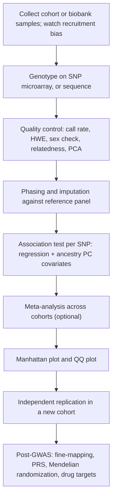
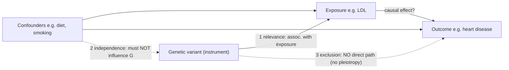

# 인간유전학 — 전장유전체 연관성 분석(Genome-Wide Association Studies, GWAS)

**강의:** BME333 / BIO333 유전학 (UNIST, 2026 가을) · 25강 · 약 60분
**강의계획서:** [← 강의계획서](../../lectures/2026.BME333-BIO333-Syllabus.md) — 15주차 월요일, 2026-12-07
**언어:** [English](../../en/lectures/lec25_Human-GWAS.md) · 한국어

## 학습 목표
이 강의를 마치면 학생들은 다음을 할 수 있어야 한다:
- GWAS의 논리를 설명한다: 전장유전체 수준에서 흔한 SNP들을 형질 또는 질병과의 연관성에 대해 검정하며, 태그 SNP(tag SNP)가 인과 변이를 표지할 수 있는 이유로서 연관불평형(linkage disequilibrium, LD)을 활용한다.
- 맨해튼 플롯(Manhattan plot)과 QQ 플롯을 해석하고, 전장유전체 유의수준 기준(p < 5×10⁻⁸)과 유전체 보정(genomic control)/집단 구조(population structure) 보정의 필요성을 정당화한다.
- 연관성(association)과 인과성(causation)을 구분하고, 멘델 무작위화(Mendelian randomization, MR)가 유전 변이를 도구변수(instrumental variable)로 사용하여 노출–결과 인과 가설을 검정하는 방식을 설명한다.
- GWAS를 가능하게 하면서 동시에 제약하는 집단유전학적 기초(대립유전자 빈도, LD, 다유전자성/Fisher의 무한소 모형)를 요약한다.
- 중개연구적 활용(다유전자 점수, 바이오뱅크, 약물 표적 우선순위 선정)과 GWAS 결과의 이식성(portability)/다양성(diversity) 한계를 논의한다.

## 강의

### 1. 왜 GWAS인가? 가족 연관분석에서 집단 연관성으로 (~8분)

이 강의 앞부분에서 우리는 **연관분석(linkage analysis)**으로 유전자를 지도화했다 — 즉 가계도에서 표지자(marker)와 질병 대립유전자를 추적하며 이들이 얼마나 자주 함께 유전되는지를 물었다. 연관분석은 하나의 돌연변이가 한 가족 안에서 질병과 깨끗하게 함께 추적되는 **희귀하고, 침투도(penetrance)가 높으며, 단일 유전자(멘델성) 질환**(낭포성 섬유증이나 헌팅턴병을 떠올려 보라)에는 탁월하다. 그러나 어떤 단일 변이도 필요하지도 충분하지도 않으며, 효과는 작고, 위험 대립유전자가 한 가족에 국한되기보다 집단 안에서 *흔한*, **흔하고 복합적인 질병** — 제2형 당뇨병, 관상동맥질환, 조현병 — 에서는 대체로 실패한다. 이런 질병에는 가족 설계가 아니라 **집단** 설계가 필요하다.

그 설계가 바로 **전장유전체 연관성 분석(genome-wide association study, GWAS)**이다: 서로 혈연관계가 없는 대규모 표본을 유전체 전체에 흩어진 최대 약 100만 개의 **단일염기다형성(single-nucleotide polymorphism, SNP)**에 대해 유전형 분석(genotyping)한 뒤, *각 SNP*에 대해 대립유전자 수와 형질 사이의 통계적 연관성을 검정한다(참조 [en](../../en/review/Pearson2008_JAMA_InterpretingGWAS.md) · [ko](../../ko/review/Pearson2008_JAMA_InterpretingGWAS.md)). 이 설계를 이끄는 가정은 **흔한 질병/흔한 변이(common-disease/common-variant, CDCV) 가설**이다: 흔한 질병 유전율(heritability)의 상당 부분이 그 자체로 흔한(부대립유전자 빈도, **MAF**, 약 1~5% 이상) 대립유전 변이에 의해 운반된다는 것이다(참조 [en](../../en/review/Pearson2008_JAMA_InterpretingGWAS.md) · [ko](../../ko/review/Pearson2008_JAMA_InterpretingGWAS.md)).

모든 염기를 서열분석하지 않고 "겨우" 100만 개의 SNP만으로 유전체 전체를 조사할 수 있는 이유는 **연관불평형(linkage disequilibrium, LD)** 때문이다: 즉 인접한 유전자자리(loci)에서 대립유전자들이 무작위가 아닌 방식으로 함께 유전되는 현상이다. 짧은 거리에서는 재조합(recombination)이 드물기 때문에 염색체의 일부 구간은 온전한 **일배체형 블록(haplotype block)**으로 유전되며, 따라서 측정된 **태그 SNP(tag SNP)**의 유전형은 측정되지 *않은* 많은 이웃 — 잠재적으로는 진짜 **인과 변이(causal variant)**를 포함하여 — 의 유전형과 높은 상관관계를 갖는다. 국제 HapMap 프로젝트는 여러 집단에 걸쳐 이 블록 구조를 목록화했으며, 바로 이 목록이 어레이(array) 기반 GWAS를 실현 가능하게 만든다: 50만~100만 개의 SNP로 구성된 플랫폼은 유럽 및 아시아 집단에서 흔한 SNP 변이의 대략 **67~89%**를 포착한다(참조 [en](../../en/review/Pearson2008_JAMA_InterpretingGWAS.md) · [ko](../../ko/review/Pearson2008_JAMA_InterpretingGWAS.md)).

**그림 — 태그 SNP가 숨은 인과 변이를 표지하는 원리(연관불평형).**
```
Haplotype block (inherited as one unit, little recombination)
5'====[SNP-a]=======[TAG SNP]=========[causal variant]======[SNP-b]====3'
         |              |    \_______________/                  |
     genotyped      GENOTYPED   strong LD (r^2 high)       genotyped
                        |                                       
   We never measure the causal variant directly.               
   The tag SNP is statistically correlated (in LD) with it,    
   so an association at the TAG reports the neighborhood,       
   not necessarily the culprit base -> "fine-mapping" needed later.
```

결론적으로: GWAS "히트(hit)"는 거의 언제나 인과 염기를 직접 가리키지 않는다. 그것은 인과 변이가 그 안 어딘가에 자리 잡고 있는 일배체형인 **유전자자리(locus)**를 가리킨다. 어떤 변이와 어떤 유전자가 실제로 그 신호를 유발하는지 풀어내는 일은 6번 세그먼트에서 다룰 **사후 GWAS(post-GWAS)** 분석의 몫이다.

### 2. GWAS의 해부 (~12분)

GWAS는 하나의 파이프라인이며, 각 단계에는 목적이 있다. 가장 결정적인 현대적 안내서는 *Nature Reviews Methods Primers*의 프라이머다(참조 [en](../../en/review/Uffelmann2021_NatRevMethodsPrimer_GWAS.md) · [ko](../../ko/review/Uffelmann2021_NatRevMethodsPrimer_GWAS.md)); 여기서는 그 워크플로를 골격으로 삼는다.

**그림 — GWAS 워크플로, 처음부터 끝까지.**


**연구 설계.** 두 가지 형태가 주를 이룬다. **환자–대조군(case–control)** 설계에서는 질병이 있는 사람(환자, case)과 없는 사람(대조군, control) 사이의 대립유전자 빈도를 비교한다; 가장 흔하고 비용 효율적인 설계이지만 집단 층화(population stratification)와 선택 편향(selection bias)에 취약하다. **정량 형질(quantitative-trait)** 설계에서는 측정된 연속형 표현형(키, LDL 콜레스테롤)을 유전형에 대해 회귀분석한다. 또한 집단 층화에 면역이지만 유전형 분석 오류에는 극도로 민감한 **삼자/가족(trio/family)** 설계(이환된 자녀와 부모)와, 비용과 시간을 대가로 환경 공변량을 추가하는 **코호트(cohort)** 설계가 있다(참조 [en](../../en/review/Pearson2008_JAMA_InterpretingGWAS.md) · [ko](../../ko/review/Pearson2008_JAMA_InterpretingGWAS.md)).

**유전형 분석과 대치(imputation).** 표본은 SNP 어레이로 유형화되거나(또는 점차 늘어나는 추세로 서열분석된다). 어레이는 변이의 일부만 측정하므로, 이후 우리는 측정되지 않은 변이들을 **대치(impute)**한다: 참조 패널(**1000 Genomes Project**, 또는 더 깊은 **TOPMed** 패널)의 LD 구조를 이용하여, 실제로는 한 번도 측정하지 않은 수백만 개의 위치에서 가장 확률이 높은 유전형을 통계적으로 채워 넣는다(참조 [en](../../en/review/Uffelmann2021_NatRevMethodsPrimer_GWAS.md) · [ko](../../ko/review/Uffelmann2021_NatRevMethodsPrimer_GWAS.md)). 대치는 LD가 작동하는 실례다 — 태그 SNP가 이웃을 표지하게 해 주는 바로 그 상관관계가 그 이웃의 유전형을 재구성하게 해 준다.

**연관성 검정.** 각 SNP에 대해 우리는 유전형을 대립유전자 **용량(dosage)**(부대립유전자 사본 0, 1, 2개)으로 코딩한 회귀모형을 적합한다: 연속형 형질에는 **선형 회귀(linear regression)**, 이분형 환자/대조군 상태에는 **로지스틱 회귀(logistic regression)**를 사용하며, 언제나 연령, 성별, 그리고 — 결정적으로 — 상위 **혈통 주성분(ancestry principal component)**(3번 세그먼트)을 공변량으로 포함한다. SNP별 산출물은 **효과 크기(effect size)**(베타, 또는 질병의 경우 오즈비)와 **p 값**이다.

**맨해튼 플롯 읽기.** 모든 SNP를 x축에 유전체상 위치를, y축에 **−log₁₀(p)**를 두고 그린다. −log₁₀(p)가 클수록 p 값이 작음을 뜻하므로, 진짜 신호는 "마천루"처럼 솟아오른다. 같은 LD 블록 안의 SNP들이 모두 상승한 유의성을 보이기 때문에, 진짜 유전자자리는 하나의 점이 아니라 점들의 **탑(tower)**으로 나타난다.

**그림 — 맨해튼 플롯 도식(히트가 탑처럼 보이는 이유).**
```
 -log10(p)
   20 |                                  *
      |                                 ***            (a strong locus:
   15 |          *                     *****            LD makes neighbors
      |         ***                    *****            all light up)
   10 |        *****            *                        
  7.3 |==*====*****====*======***========*****====*==  genome-wide sig.
      |  *  . ***** .  ***  . ***** . .  ***** . *  .   line  p = 5e-8
    3 |. . . ..... . ..... . ..... . . . ..... . . .   (noise floor)
    0 +----------------------------------------------
       chr1   chr2   chr3  ...        chr9    ...  chrX
```

**전장유전체 유의수준 기준.** 만약 하나의 SNP만 p < 0.05로 검정한다면 5%의 위양성률을 감수할 것이다. 그러나 GWAS는 약 100만 회의 검정을 수행하므로, p = 0.05에서는 순전히 우연만으로도 **약 50,000개의 위양성**이 예상된다(참조 [en](../../en/review/Pearson2008_JAMA_InterpretingGWAS.md) · [ko](../../ko/review/Pearson2008_JAMA_InterpretingGWAS.md)). 이를 통제하기 위해 우리는 약 100만 개의 *독립적인* 흔한 변이에 걸쳐 **본페로니 보정(Bonferroni correction)**을 적용한다: 0.05 / 10⁶ = **5×10⁻⁸**, 이 분야의 표준 **전장유전체 유의수준 기준**이다(참조 [en](../../en/review/Uffelmann2021_NatRevMethodsPrimer_GWAS.md) · [ko](../../ko/review/Uffelmann2021_NatRevMethodsPrimer_GWAS.md)). (대치가 더 낮은 MAF 변이까지 도달하거나, 유효 크기(effective size)가 더 큰 집단에서는 더 엄격한 기준이 적절하다.) 특기할 점은 이 분야가 경험적으로 여기에 도달했다는 것이다: 획기적인 WTCCC 연구(3번 세그먼트)는 순진한 본페로니 보정에 *반대*하며 베이즈적 논증을 사용해 실용적 기준선으로 p < 5×10⁻⁷을 정했다(참조 [en](../../en/article/WTCCC2007_Nature.md) · [ko](../../ko/article/WTCCC2007_Nature.md)); 이후 5×10⁻⁸이 지속적인 합의가 되었다.

**효과 크기 대 대립유전자 빈도.** 피할 수 없는 상충관계가 있다: **흔한 변이는 효과가 작고, 효과가 큰 변이는 드물다.** GWAS로 발견된 대부분의 흔한 변이는 겨우 **1.1~1.3**의 오즈비를 지닌다(참조 [en](../../en/review/Pearson2008_JAMA_InterpretingGWAS.md) · [ko](../../ko/review/Pearson2008_JAMA_InterpretingGWAS.md)). 이렇게 미미한 효과를 검출해야 하기 때문에 GWAS에는 수만 명에서 수십만 명의 참가자가 필요하다.

### 3. 교란 요인과 품질 관리 (~10분)

GWAS는 그 품질 관리만큼만 신뢰할 수 있다. 왜냐하면 이 사업 전체가 대립유전자 빈도를 비교하는 것이고 — 대립유전자 빈도는 질병과는 아무 상관이 없는 이유들로 인간 집단 간에 다르기 때문이다.

**집단 층화(population stratification)**가 핵심 교란 요인이다. 만약 환자와 대조군이 미묘하게 다른 조상 배경에서 추출되었다면, 그 배경들 사이에서 빈도가 다른 *어떤* 대립유전자도 질병과 "연관된" 것처럼 보일 것이다 — 즉 허위 신호다. 고전적 해결책은 **주성분 분석(principal component analysis, PCA)**이다: 전장유전체 유전형 행렬의 상위 주성분들은 대륙 규모 및 미세 규모의 혈통을 포착하며, 이들을 회귀 공변량으로 포함하면 교란을 흡수한다. **선형 혼합 모형(linear mixed model)**(**SAIGE**, **BOLT-LMM** 같은 도구로 구현됨)은 혈연관계와 구조를 직접 모형화하여 한 걸음 더 나아가며, 이제 바이오뱅크 규모에서 표준이 되었다(참조 [en](../../en/review/Uffelmann2021_NatRevMethodsPrimer_GWAS.md) · [ko](../../ko/review/Uffelmann2021_NatRevMethodsPrimer_GWAS.md), [en](../../en/article/Sakaue2021_NatGenet_BiobankJapan.md) · [ko](../../ko/article/Sakaue2021_NatGenet_BiobankJapan.md)).

**QQ 플롯 읽기와 유전체 보정.** **분위수–분위수(quantile–quantile, QQ) 플롯**은 관측된 검정통계량을 연관성이 없다는 귀무가설 하에서 기대되는 값에 대해 그린다. 잘 통제된 연구에서는 대부분의 점이 대각선 위에 놓이고, 오직 진짜 히트만이 극단적인 상단 꼬리에서 이탈한다. 만약 반대로 *전체* 선이 일찍부터 대각선에서 떠오른다면, 그 팽창(inflation)은 잔여 층화나 은닉된 혈연관계(cryptic relatedness)를 신호한다. 이 팽창은 **유전체 보정 계수 λ(genomic-control factor)**(관측 대 기대 카이제곱 중앙값의 비)로 정량화되며, λ가 1.0에 가까우면 깨끗한 것이다.

**그림 — QQ 플롯: 좋은 연구 대 층화된 연구.**
```
 observed                              observed
 -log10(p)   . (true hits              -log10(p)  . 
    |       /   depart in tail)           |      /  . . . . .  (whole line
    |      /                              |    /. .  . . .      inflated ->
    |    /                               |  / . . .            stratification
    |  /___ (bulk on diagonal)          | / . .               or relatedness)
    |/_____________ expected            |/________________ expected
        lambda ~ 1.0 (GOOD)                lambda >> 1.0 (BAD)
```

**WTCCC 템플릿.** 2007년 **웰컴 트러스트 환자 대조군 컨소시엄(Wellcome Trust Case Control Consortium)** 연구는 이 QC 틀을 확립한 창시적 사례이며, 자세히 알아 둘 가치가 있다(참조 [en](../../en/article/WTCCC2007_Nature.md) · [ko](../../ko/article/WTCCC2007_Nature.md)). 이 연구는 Affymetrix 500K 어레이로 7가지 흔한 질병에 대해 **질병당 약 2,000명의 환자**와 **약 3,000명의 공유 대조군**(1958년 영국 출생 코호트 및 영국 혈액 서비스 헌혈자)을 유전형 분석했다. 그 혁신들은 관례가 되었다: 오류율이 0.2% 미만인 새로운 유전형 판독 알고리즘(**CHIAMO**); 상위 히트에 대한 **클러스터 플롯(cluster plot)**의 육안 검사; 오염, 비유럽 혈통, 또는 혈연관계로 인한 809개 표본의 제외; 그리고 153개의 혈통 이상치를 제외한 후 λ가 **1.03~1.11**로 떨어졌음을 입증 — 최소한의 층화였다. 결정적으로, 이 연구는 **단일 공유 대조군**이 여러 환자군을 동시에 소용할 수 있음을 증명했다 — 이후 모든 컨소시엄이 모방한 경제적 설계다.

**그림 — WTCCC 2007: 일곱 가지 질병과 이 분야를 정박시킨 신호들.**

| 질병 | 주목할 유전자자리(유전자) | 유의성 하이라이트 |
|---|---|---|
| 크론병 (CD) | *IL23R*, *ATG16L1*, *NOD2* (9개 자리) | 면역 조절 경로 |
| 류마티스 관절염 (RA) | *PTPN22*, MHC (6p21) | MHC p < 5×10⁻⁷⁶ |
| 제1형 당뇨병 (T1D) | MHC, *PTPN22*, *CTLA4* (7개 자리) | MHC p < 10⁻¹³⁴ |
| 제2형 당뇨병 (T2D) | *TCF7L2* (10q25), *FTO* | *TCF7L2* 기존 히트 확증 |
| 관상동맥질환 (CAD) | 9p21.3 (rs1333049), *CDKN2A/B* 근처 | 신규 유전자자리, p = 1.8×10⁻¹⁴ |
| 양극성 장애 (BD) | 16p12 (rs420259) | 하나의 신호 |
| 고혈압 (HT) | (전장유전체 히트 거의 없음) | 가장 어려운 형질 — 매우 다유전자성 |

효과 크기는 거의 모든 유전자자리에서 **완만했고(OR 1.2~2.0)**, 추가로 58개의 역치 미만 신호가 후속 연구 대상으로 표시되었다 — 그 아래 놓인 다유전자적 현실을 이른 시기에 경험적으로 보여 준 사례다.

**승자의 저주(winner's curse).** 마지막으로 QC와 인접한 함정: SNP가 유의성을 겨우 넘긴 바로 *그* 데이터에서 추정된 효과 크기는 **체계적으로 과대추정**된다(참조 [en](../../en/review/Pearson2008_JAMA_InterpretingGWAS.md) · [ko](../../ko/review/Pearson2008_JAMA_InterpretingGWAS.md)). 따라서 그 부풀려진 추정치를 바탕으로 검정력(power)을 계산한 반복 연구(replication study)는 검정력이 부족하게 된다. 이것이 **독립적 반복 검증** — 동일한 표현형, 집단, SNP, 대립유전자, 그리고 효과 방향 — 이 참된 연관성과 거짓 연관성을 가르는 최고 기준으로 남아 있는 여러 이유 중 하나다.

### 4. 다유전자적 현실 (~8분)

GWAS의 20년이 준 가장 중요한 단 하나의 경험적 교훈은 흔한 형질이 **대규모로 다유전자성(polygenic)**이라는 것이다: 즉 소수의 유전자가 아니라 각각 위험의 조각을 기여하는 수천 개의 변이에 의해 영향을 받는다. 놀랍게도 이것은 데이터가 존재하기 한 세기 전에 수학적으로 예측되었다.

**1918년**, R. A. Fisher의 논문 "멘델 유전 가정 하에서의 친족 간 상관관계(The Correlation between Relatives on the Supposition of Mendelian Inheritance)"는 **생물측정학파(Biometricians)**(Pearson: 키 같은 연속 형질은 멘델적일 수 없다)와 **멘델학파(Mendelians)**(Bateson: 유전은 입자적이다) 사이의 격렬한 반목을 해결했다. Fisher는 **많은** 멘델 유전자가 각각 작은 가산적(additive) 효과를 기여하면, 그 합이 생물측정학자들이 측정한 바로 그 매끄럽고 연속적이며 정규분포하는 변이를 정확히 만들어냄을 증명했다 — 즉 **무한소 모형(infinitesimal model)**이다(참조 [en](../../en/review/Visscher2019_Genetics_Fisher1918GWAS.md) · [ko](../../ko/review/Visscher2019_Genetics_Fisher1918GWAS.md)). 그 과정에서 그는 **분산(variance)**이라는 단어와 **분산분석(ANOVA)** 방법을 창안했으며, 총 표현형 분산을 유전적 부분(**가산** 성분 V_A와 **우성** 성분 V_D를 포함)과 환경적 부분으로 분할했다.

GWAS는 Fisher 모형의 경험적 입증이며, Visscher와 Goddard는 그 연결을 명시한다(참조 [en](../../en/review/Visscher2019_Genetics_Fisher1918GWAS.md) · [ko](../../ko/review/Visscher2019_Genetics_Fisher1918GWAS.md)):
- **다유전자성은 실재한다.** 인간 **키**는 전장유전체 유의 유전자자리가 **3,000개 이상**이지만, 이들조차 가산 유전분산의 약 **3분의 1**만을 설명한다.
- **가산 분산이 지배한다.** 여러 종과 형질에 걸쳐 대부분의 유전분산은 가산적이다; 우성과 상위성(epistasis)은 존재하나 총 분산에 기여하는 바는 적다.
- **GWAS 회귀는 곧 Fisher의 모형이다.** 형질을 SNP 용량(0,1,2)에 대해 회귀하는 것은 정확히 Fisher의 회귀이며, GWAS 효과 크기는 Fisher의 정확한 의미에서 **대립유전자 치환의 평균 효과(average effect of an allele substitution)**로 읽어야 한다.

**유전율, 잃어버린 유전율, 다유전자 점수.** **유전율(heritability, h²)**은 표현형 분산 중 유전분산에 기인하는 비율이다. GWAS는 전장유전체 유의 히트들이 알려진 유전율의 *일부*만을 설명함을 반복적으로 발견한다 — 즉 **잃어버린 유전율(missing heritability)** 문제다(참조 [en](../../en/review/Pearson2008_JAMA_InterpretingGWAS.md) · [ko](../../ko/review/Pearson2008_JAMA_InterpretingGWAS.md)). 이 간극은 이제 효과가 미미한 다수의 역치 미만 흔한 변이, 어레이가 잘 태그하지 못하는 희귀 변이, 그리고 측정 오차에 기인하는 것으로 여겨진다. 실용적으로는, 유의한 변이뿐 아니라 *모든* 변이를 그 추정 효과로 가중하여 개인별 단일 **다유전자 (위험) 점수(polygenic (risk) score, PRS/PGS)** — 유전적 소인(genetic liability)에 대한 전장유전체 추정치 — 로 집계할 수 있다(참조 [en](../../en/review/Uffelmann2021_NatRevMethodsPrimer_GWAS.md) · [ko](../../ko/review/Uffelmann2021_NatRevMethodsPrimer_GWAS.md)). PRS는 Fisher의 가산 모형의 직접적인 임상적 후손이며 — 그 혈통 간 이식성은 6번 세그먼트의 핵심 형평성 문제다.

Fisher의 틀은 흔한 오독에 대해서도 경고한다(참조 [en](../../en/review/Visscher2019_Genetics_Fisher1918GWAS.md) · [ko](../../ko/review/Visscher2019_Genetics_Fisher1918GWAS.md)): 높은 유전율이 환경이 무력함을 뜻하지 **않으며**(키의 h² = 0.8조차 약 3.1 cm의 환경 표준편차를 남긴다), 가산 분산이 우성의 부재를 가정하지도 **않는다** — 우성은 대립유전자 치환의 평균 효과 안에 포섭된다.

### 5. 연관성에서 인과성으로: 멘델 무작위화 (~12분)

GWAS는 **연관성(association)**을 보고하며 — 이 강의의 주문(呪文)처럼 — 연관성은 인과성이 아니다. 관찰 역학(observational epidemiology)은 **교란(confounding)**(제3의 요인이 노출과 결과 모두를 유발함; 예를 들어 흡연은 음주–혈압 관계를 교란한다)과 **역인과(reverse causation)**(초기 질병이 노출을 바꾼다)로 가득 차 있다. **멘델 무작위화(Mendelian randomization, MR)**는 그 영리한 해결책이다: 유전 변이를 **도구변수(instrumental variable, IV)**로 사용하여 *변경 가능한 노출*이 *결과*에 인과적으로 영향을 미치는지 검정한다(참조 [en](../../en/review/Emdin2017_JAMA_MendelianRandomization.md) · [ko](../../ko/review/Emdin2017_JAMA_MendelianRandomization.md), [en](../../en/review/Davies2018_BMJ_MendelianRandomization-overview.md) · [ko](../../ko/review/Davies2018_BMJ_MendelianRandomization-overview.md)).

그 논리는 **멘델의 법칙**(3강)에 직접 근거한다: 대립유전자는 수정 시점에 본질적으로 무작위로 분리되고 독립적으로 조합되므로, 예컨대 LDL 콜레스테롤을 높이는 유전형은 **생활습관 교란 요인과 무관하게, 그리고 질병 발병 이전에 고정되어** 개인들에게 배정된다. 자연은 사실상 무작위 시험을 수행해 온 셈이다 — 유전형이 "치료 배정(treatment assignment)"인 것이다(참조 [en](../../en/review/Sanderson2022_NatRevMethodsPrimer_MendelianRandomization.md) · [ko](../../ko/review/Sanderson2022_NatRevMethodsPrimer_MendelianRandomization.md)).

**그림 — 자연적 무작위 시험으로서의 멘델 무작위화(IV 가정들).**


**세 가지 IV 가정**(참조 [en](../../en/review/Davies2018_BMJ_MendelianRandomization-overview.md) · [ko](../../ko/review/Davies2018_BMJ_MendelianRandomization-overview.md), [en](../../en/review/Sanderson2022_NatRevMethodsPrimer_MendelianRandomization.md) · [ko](../../ko/review/Sanderson2022_NatRevMethodsPrimer_MendelianRandomization.md)):
1. **관련성(relevance)** — 변이가 실제로 노출과 연관되어 있다. 이것은 첫 단계 **F 통계량(F statistic)**을 통해 *검정 가능*하다("약한 도구(weak-instrument)" 편향을 피하기 위한 경험 법칙 F > 10).
2. **독립성(independence, 교환가능성)** — 변이가 결과와 어떤 공통 원인도 공유하지 않는다(변이–결과 연결에 대한 교란 없음). 직접 증명할 수는 없으며, 공변량 균형 점검으로 평가한다.
3. **배제 제약(exclusion restriction)** — 변이가 *오직* 노출을 통해서만 결과에 영향을 미친다, 즉 **수평적 다면발현(horizontal pleiotropy)이 없다**. 직접 증명할 수는 없으며, 민감도 분석으로 평가한다.

**수평적 대 수직적 다면발현.** 위협은 **수평적 다면발현** — 변이가 노출과 독립적인 *곁* 경로를 통해 결과에 도달하여 추정치를 편향시키는 것 — 이다. **수직적 다면발현(vertical pleiotropy)**(변이의 효과가 노출을 *통해* 매개됨)은 문제가 되지 않는다(참조 [en](../../en/review/Sanderson2022_NatRevMethodsPrimer_MendelianRandomization.md) · [ko](../../ko/review/Sanderson2022_NatRevMethodsPrimer_MendelianRandomization.md)). 일부 무효한 도구를 허용하는 민감도 방법으로는 **MR-Egger**(0이 아닌 회귀 절편이 방향성 다면발현을 표시함), **가중 중앙값(weighted median)**(도구 가중치의 50% 초과가 유효하면 타당함), 그리고 **가중 최빈값(weighted mode)**이 있다.

**일표본 대 이표본 MR.** 개인 수준 데이터(유전형, 노출, 결과가 모두 한 표본에 있음)로는 **2단계 최소제곱(two-stage least squares, 2SLS)**을 사용한다; 단일 변이의 경우 **왈드 비(Wald ratio)** = (변이→결과) ÷ (변이→노출)이다. 현대의 주력은 **이표본 MR(two-sample MR)**이다: 변이→노출 추정치를 하나의 대규모 GWAS에서, 변이→결과 추정치를 *별개의* 대규모 GWAS에서 취한 뒤, **역분산 가중(inverse-variance-weighted, IVW)** 메타분석으로 변이들을 결합한다. 이를 통해 오직 공표된 **요약 통계량(summary statistics)**만을 사용하여 거대한 컨소시엄(예: 인체측정을 위한 GIANT N≈693,529)을 투입할 수 있다(참조 [en](../../en/review/Davies2018_BMJ_MendelianRandomization-overview.md) · [ko](../../ko/review/Davies2018_BMJ_MendelianRandomization-overview.md), [en](../../en/review/Sanderson2022_NatRevMethodsPrimer_MendelianRandomization.md) · [ko](../../ko/review/Sanderson2022_NatRevMethodsPrimer_MendelianRandomization.md)).

**정전(定典)적 실제 예시 — HDL은 보이던 것과 달랐다.** 관찰 연구들은 수십 년간 높은 HDL("좋은 콜레스테롤")이 *낮은* 심장질환과 함께 간다고 보였다. MR은 그 인과적 해석을 뒤집었다(참조 [en](../../en/review/Emdin2017_JAMA_MendelianRandomization.md) · [ko](../../ko/review/Emdin2017_JAMA_MendelianRandomization.md)):

**그림 — MR이 지질을 풀어낸다: 관상동맥 심장질환에 실제로 인과적인 것은 무엇인가?**

| 노출(유전적으로 도구화됨) | 관상동맥 심장질환에 대한 MR 효과 | 해석 |
|---|---|---|
| **LDL 콜레스테롤** ↑ | 위험 **↑** (관찰과 일치) | **인과적** — 이후 PCSK9 억제제 RCT로 확증 |
| **HDL 콜레스테롤** ↑ 1 SD (~14 mg/dL) | OR **0.96** (95% CI 0.89–1.03) | **인과적 아님** — 관찰상 연결은 교란 |
| **중성지방(triglycerides)** ↑ 1 SD (~89 mg/dL) | OR **1.43** (95% CI 1.28–1.60) | **인과적** |
| *ABCA1* 기능상실(LoF) 변이 (HDL −17 mg/dL) | OR **0.93** (0.53–1.62), 검정력 >80% | 위험 변화 없음 → HDL에 대한 초기 의문 |

MR은 *시험 결과가 나오기 전에* HDL을 높이는 약물이 심장마비 예방에 실패하리라 예측했고 — 실제로 그러했다(참조 [en](../../en/review/Davies2018_BMJ_MendelianRandomization-overview.md) · [ko](../../ko/review/Davies2018_BMJ_MendelianRandomization-overview.md)). 이에 대응하는 동아시아 도구는 **ALDH2 rs671**이다: 그 부대립유전자 A는 아세트알데하이드 제거를 늦추고 술 "홍조(flush)"를 유발하며 음주를 크게 줄인다(A 대립유전자 두 개를 가진 남성은 하루 약 1.1 g를 마신 반면 23.7 g), 알코올이 혈압에 미치는 인과 효과를 위한 자연적 도구를 제공한다(참조 [en](../../en/review/Davies2018_BMJ_MendelianRandomization-overview.md) · [ko](../../ko/review/Davies2018_BMJ_MendelianRandomization-overview.md)).

**핵심 유의점.** 유전형은 수정 시점에 고정되므로, MR은 단기 약물 투여가 아니라 노출의 **평생(lifelong)** 차이의 효과를 추정한다; 따라서 MR과 RCT의 크기는 정당하게 다를 수 있으며, MR만으로 임상 지침을 다시 써서는 안 된다(참조 [en](../../en/review/Davies2018_BMJ_MendelianRandomization-overview.md) · [ko](../../ko/review/Davies2018_BMJ_MendelianRandomization-overview.md)).

### 6. 중개, 바이오뱅크, 다양성 (~10분)

**히트에서 약물 표적으로.** GWAS는 신호가 약물화 가능한(druggable) 유전자를 가리킬 때 임상적으로 결실을 맺는다. 가장 깔끔한 사례는 크론병의 **IL23R**이다: 보호적 미스센스 변이 rs11209026 (p.Arg381Gln)은 IL-23 수용체 신호전달을 *교란*하며, 그 보호적 *방향*은 **약리학적으로 IL-23을 억제하면 도움이 될 것**임을 시사한다 — 원래 건선 약물이던 항체 **우스테키누맙(ustekinumab)**(항-p40)과 **리산키주맙(risankizumab)**(항-p19)이 이제 크론병에서 하는 바로 그 일이다(참조 [en](../../en/review/Reay2021_NatRevGenet_GWAS-DrugRepurposing.md) · [ko](../../ko/review/Reay2021_NatRevGenet_GWAS-DrugRepurposing.md)). GWAS 신호에서 규제 승인으로 이어지는 이 "약물 **재목적화(repurposing)**"는 이 분야의 대표적 중개연구 성공 사례다. 단일 유전자자리를 넘어, 같은 리뷰는 더 넓은 도구 모음을 제시한다 — **TWAS**(eQTL을 통합하여 어떤 *유전자의 발현*이 어느 방향으로 위험을 유발하는지 예측), **유전자 집합/경로(gene-set/pathway)** 강화 분석(다유전자성 형질에 대해 약물 계열 전체를 표시), **약물 표적 검증을 위한 MR**, 그리고 시험 대상 강화를 위한 약리학적으로 가중된 **PRS**(참조 [en](../../en/review/Reay2021_NatRevGenet_GWAS-DrugRepurposing.md) · [ko](../../ko/review/Reay2021_NatRevGenet_GWAS-DrugRepurposing.md)). 인간 유전적 근거를 지닌 약물 표적은 임상 개발에서 살아남을 가능성이 약 두 배 더 높다 — GWAS의 경제적 논거다.

**바이오뱅크 규모와 집단 간 발견.** GWAS 검정력은 표본 크기에 비례해 증가하며, 국가 규모의 **바이오뱅크(biobank)**(UK Biobank 약 50만; **BioBank Japan**; FinnGen; China Kadoorie)는 이제 *수백* 가지 형질에 걸친 충분한 검정력의 GWAS를 한 번에 가능하게 한다(참조 [en](../../en/review/Uffelmann2021_NatRevMethodsPrimer_GWAS.md) · [ko](../../ko/review/Uffelmann2021_NatRevMethodsPrimer_GWAS.md)). **BioBank Japan** 집단 간 아틀라스가 정박 사례다: 약 179,000명의 일본인 참가자의 **220개 표현형**을 UK Biobank 및 FinnGen과 메타분석하여(총 N ≈ 628,000) 약 5,000개의 새로운 유전자자리를 산출했다(참조 [en](../../en/article/Sakaue2021_NatGenet_BiobankJapan.md) · [ko](../../ko/article/Sakaue2021_NatGenet_BiobankJapan.md)). 두 가지 교훈이 두드러진다. 첫째, **심층 표현형 분석(deep phenotyping)이 결실을 맺는다**: 전자 의무기록의 텍스트 마이닝으로 폐결핵 환자를 549명에서 7,800명으로 확장하고, 단 하나의 새로운 표본도 수집하지 않고 121개의 새로운 질병 종점(endpoint)을 추가했다. 둘째, **서로 다른 혈통은 서로 다른 생물학을 드러낸다**: MHC의 동아시아 변이 rs140780894는 결핵과 연관되지만(OR 1.2, p = 2.9×10⁻²³) 유럽인에게는 **전혀 존재하지 않는다**(대립유전자 수 0) — 어떤 유럽 GWAS도 결코 찾을 수 없는 유전자자리다. 안심되게도, 일본과 유럽 GWAS 사이의 유전적 상관관계 중앙값은 **0.82**였고, BBJ 유전자자리의 94%가 유럽인에서 같은 방향으로 반복 검증되었다 — 구조(architecture)는 대체로 공유되지만, *특정 태그 변이와 빈도는 그렇지 않다*.

**다양성 문제 — 그리고 그것이 PRS를 제약하는 이유.** 역사적으로 GWAS 참가자의 압도적 다수는 **유럽 혈통**이었다. 이 유럽 중심적 편향은 단지 형평성의 실패가 아니라 *기술적* 한계다. 왜냐하면 **LD 패턴과 대립유전자 빈도가 집단 간에 다르기** 때문에, 유럽인에서 인과 변이를 표지하는 태그 SNP가 다른 곳에서는 그와 잘 상관되지 않을 수 있기 때문이다. 직접적인 피해는 **다유전자 점수 이식성(polygenic-score portability)**이다: 유럽인에서 훈련된 PRS는 아프리카, 동아시아, 라틴아메리카 개인에서 상당히 *더 나쁘게* 예측하며, 그런 점수를 임상에 배치하면 건강 격차를 *넓힐* 위험이 있다(참조 [en](../../en/review/Uffelmann2021_NatRevMethodsPrimer_GWAS.md) · [ko](../../ko/review/Uffelmann2021_NatRevMethodsPrimer_GWAS.md), [en](../../en/article/Sakaue2021_NatGenet_BiobankJapan.md) · [ko](../../ko/article/Sakaue2021_NatGenet_BiobankJapan.md)). **H3Africa**, **Million Veteran Program**, 그리고 BioBank Japan 자체 같은 이니셔티브가 그 간극을 좁히기 시작했지만, 아프리카·아시아·라틴아메리카에 걸친 다양한 코호트에 대한 조율된 투자가 이 분야의 결정적으로 미완의 과제다.

**GWAS는 어디로 향하는가.** 서열분석 비용이 떨어지면서, 어레이는 희귀 변이와 구조 변이를 직접 포착하는 **전장유전체 서열분석(whole-genome sequencing)**에 자리를 내주고 있다; **정밀지도화(fine-mapping)**와 기능유전체학(eQTL, 염색질 형태, CRISPR 스크린)은 유전자자리를 인과 변이와 실행 유전자(effector gene)로 해상하고 있다; 그리고 **다형질(multi-trait)** 방법은 다면발현을 발견에 활용한다(참조 [en](../../en/review/Uffelmann2021_NatRevMethodsPrimer_GWAS.md) · [ko](../../ko/review/Uffelmann2021_NatRevMethodsPrimer_GWAS.md)). Fisher(1918)에서 백만 유전체 바이오뱅크에 이르는 관통선은 하나의 연속된 착상이다 — 즉 유전 가능한 변이는 많은 작고, 멘델적이며, 가산적인 효과들의 합이라는 것이다.

## 핵심 정리
- **GWAS**는 서로 혈연관계가 없는 개인들에 걸쳐 최대 약 100만 개의 흔한 SNP를 형질과의 연관성에 대해 검정한다; 이는 **연관분석**이 희귀한 가족 변이는 찾아도 흔한 질병 대립유전자는 찾지 못하기 때문에 존재한다(**흔한 질병/흔한 변이** 가설).
- **연관불평형**이 그 엔진이다: 유전형 분석된 **태그 SNP**는 측정되지 않은 이웃과 상관되어 있어, 히트는 인과 염기가 아니라 *유전자자리*를 표지한다 — 이를 **대치(imputation)**가 활용하고 **정밀지도화**가 나중에 해상한다.
- **맨해튼 플롯**(−log₁₀ p 대 위치; LD가 히트를 탑으로 만든다)을 **전장유전체 기준 p < 5×10⁻⁸**(약 100만 회 검정에 대한 본페로니)에 견주어 읽고; 잔여 **집단 층화**를 **QQ 플롯** + **λ**로 읽으며, 이를 **PCA / 혼합 모형**으로 보정한다.
- **WTCCC 2007** 7개 질병 연구는 QC와 설계의 관례(공유 대조군, 클러스터 플롯 검토, λ ≈ 1)를 세웠다; 대부분의 흔한 변이 효과는 미미하며(**OR 1.1~1.3**), 이는 **다유전자적** 구조를 확증한다 — Fisher의 **1918년 무한소 모형**이 실현된 것이다(키: 3,000개 이상의 유전자자리).
- **멘델 무작위화**는 GWAS 변이를 **도구변수**로 전환하여 세 가지 가정(관련성, 독립성, 배제/다면발현 없음) 하에서 인과성을 검정한다; **HDL 대 LDL/중성지방** 결과는 MR이 교란된 관찰 연관성을 뒤집고 시험 결과를 예측함을 보여 준다.
- 중개연구는 **약물 표적/재목적화**(IL23R → 우스테키누맙), **바이오뱅크**(BioBank Japan: 집단 간, EMR 심층 표현형 분석), 그리고 **다유전자 점수**를 통해 흘러간다 — 이 점수의 **혈통 간 이식성은** 이 분야의 유럽 중심적 편향에 의해 **제약되며**, 다양성을 형평성과 기술 양면의 당면 과제로 만든다.

## 교재 참고
- **Genetics: From Genes to Genomes (8e)** — 24장 집단에서의 변이와 선택(Variation and Selection in Populations). → [textbook ref](../../lectures/ref.Genetics-FromGenesToGenomes.md)
- **Genetics: From Genes to Genomes (8e)** — 25장 복합 형질의 유전 분석(Genetic Analysis of Complex Traits). → [textbook ref](../../lectures/ref.Genetics-FromGenesToGenomes.md)

## 이 저장소의 노트
수업에서 소개할 리뷰 및 논문(각각 en/ko 이중언어 쌍이 있음):
- `Uffelmann2021_NatRevMethodsPrimer_GWAS` — GWAS 작동 원리를 다룬 핵심 입문서; 그 워크플로 그림을 2번 세그먼트의 골격으로 활용한다. · [en](../../en/review/Uffelmann2021_NatRevMethodsPrimer_GWAS.md) · [ko](../../ko/review/Uffelmann2021_NatRevMethodsPrimer_GWAS.md)
- `Pearson2008_JAMA_InterpretingGWAS` — GWAS 결과를 읽고 비판적으로 해석하는 법; 맨해튼/QQ 논의에 적합. · [en](../../en/review/Pearson2008_JAMA_InterpretingGWAS.md) · [ko](../../ko/review/Pearson2008_JAMA_InterpretingGWAS.md)
- `WTCCC2007_Nature` — 지금도 사용되는 QC 및 유의성 관례를 정립한 획기적인 7개 질환 Wellcome Trust 연구. · [en](../../en/article/WTCCC2007_Nature.md) · [ko](../../ko/article/WTCCC2007_Nature.md)
- `Sakaue2021_NatGenet_BiobankJapan` — 다수 형질에 걸친 교차집단 바이오뱅크 GWAS; 다양성/이식성 논점을 뒷받침한다. · [en](../../en/article/Sakaue2021_NatGenet_BiobankJapan.md) · [ko](../../ko/article/Sakaue2021_NatGenet_BiobankJapan.md)
- `Reay2021_NatRevGenet_GWAS-DrugRepurposing` — 발견 결과를 약물 표적으로 전환; 6번 세그먼트의 "왜 중요한가". · [en](../../en/review/Reay2021_NatRevGenet_GWAS-DrugRepurposing.md) · [ko](../../ko/review/Reay2021_NatRevGenet_GWAS-DrugRepurposing.md)
- `Visscher2019_Genetics_Fisher1918GWAS` — GWAS의 다유전자성을 Fisher의 무한소 모형과 연결(4번 세그먼트). · [en](../../en/review/Visscher2019_Genetics_Fisher1918GWAS.md) · [ko](../../ko/review/Visscher2019_Genetics_Fisher1918GWAS.md)
- `Emdin2017_JAMA_MendelianRandomization` — MR에 대한 간결한 임상 입문; IV 논리에 활용. · [en](../../en/review/Emdin2017_JAMA_MendelianRandomization.md) · [ko](../../ko/review/Emdin2017_JAMA_MendelianRandomization.md)
- `Davies2018_BMJ_MendelianRandomization-overview` — MR의 가정과 함정에 대한 실무자용 안내서. · [en](../../en/review/Davies2018_BMJ_MendelianRandomization-overview.md) · [ko](../../ko/review/Davies2018_BMJ_MendelianRandomization-overview.md)
- `Sanderson2022_NatRevMethodsPrimer_MendelianRandomization` — 형식적 취급을 원하는 학생을 위한 MR 방법론 입문서. · [en](../../en/review/Sanderson2022_NatRevMethodsPrimer_MendelianRandomization.md) · [ko](../../ko/review/Sanderson2022_NatRevMethodsPrimer_MendelianRandomization.md)

## 토론 문제
1. GWAS가 알려진 기능이 없는 인트론(intron)에서 전장유전체 유의 SNP를 보고했다. 연관불평형 개념을 사용하여 이 SNP가 아마도 인과 변이가 *아닌* 이유를 설명하고, 진짜 원인 유전자를 찾기 위해 어떤 사후 GWAS 단계(정밀지도화, eQTL/TWAS, 기능 분석)를 밟을지 개괄하라.
2. 왜 표준 기준이 0.05가 아니라 p < 5×10⁻⁸인가? 다중검정 산술을 풀어 보고, QQ 플롯과 λ 계수가 어떻게 진정한 다유전자 신호를 보정되지 않은 집단 층화와 구별하게 해 주는지 설명하라.
3. 관찰 연구는 높은 HDL이 심장을 보호한다고 말했고; MR은 그렇지 않다고 말했다. 세 가지 도구변수 가정을 제시하고, MR의 설계가 관찰 연구를 오도한 교란을 정확히 어떻게 무력화하는지 설명하라. 무엇이 여전히 MR 추정치를 틀리게 만들 수 있는가(다면발현, 약한 도구, 평생 대 급성 효과)?
4. Fisher의 1918년 무한소 모형은 연속 형질이 많은 작은 멘델 효과들의 합임을 예측했다. 3,000개 이상의 키 유전자자리와 WTCCC 히트의 완만한 오즈비가 이를 어떻게 경험적으로 확증하는가? "잃어버린 유전율"은 GWAS 어레이가 포착하지 못하는 것에 대해 무엇을 말해 주는가?
5. UK Biobank에서 훈련된 다유전자 위험 점수가 아프리카 혈통 환자에서 부실하게 예측한다. 이 실패의 집단유전학적 이유(LD, 대립유전자 빈도)를 설명하고, 왜 그런 점수를 배치하면 건강 격차가 악화될 수 있는지, 그리고 BioBank Japan 결핵 예시(유럽인에게 없는 변이)가 비다양성 GWAS의 — 윤리적이 아니라 — 과학적 비용에 대해 무엇을 시사하는지 설명하라.
