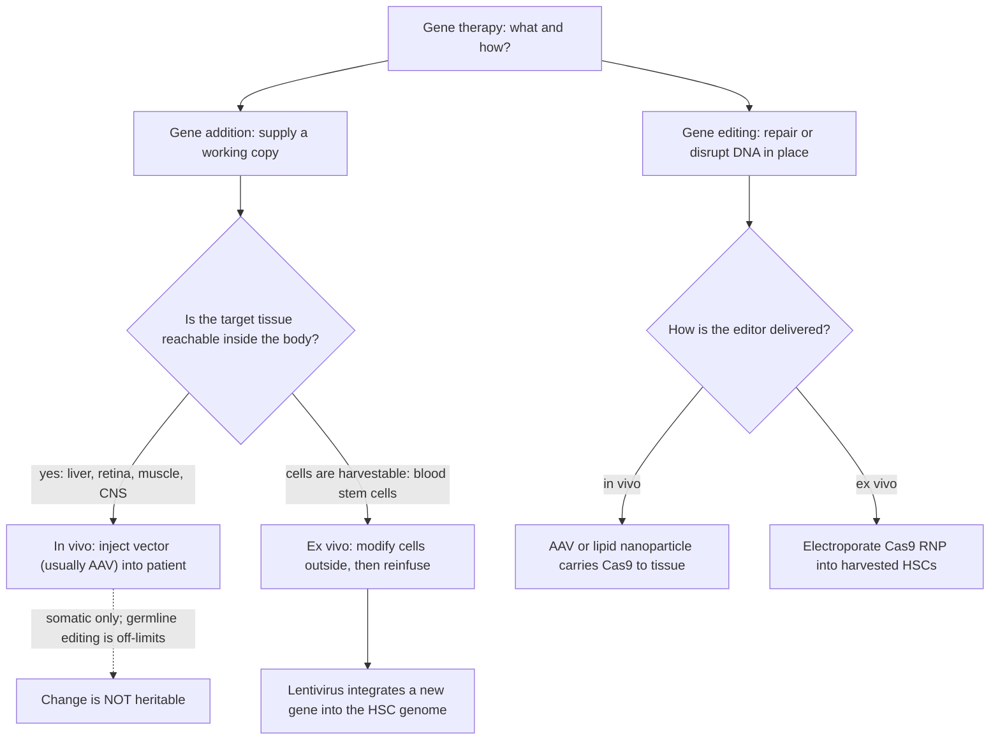
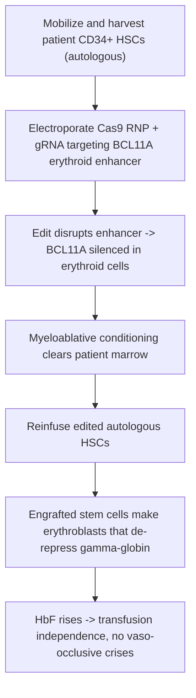

# 인간유전학 — 유전자 치료

**강의:** BME333 / BIO333 유전학 (UNIST, 2026 가을) · 26강 · 약 60분
**강의계획서:** [← 강의계획서](../../lectures/2026.BME333-BIO333-Syllabus.md) — 15주차 수요일, 2026-12-09
**언어:** [English](../../en/lectures/lec26_Human-Gene-Therapy.md) · 한국어

## 학습 목표
이 강의를 마치면 학생들은 다음을 할 수 있어야 한다:
- 유전자 치료를 정의하고 그 주요 양식을 구별한다: 유전자 추가(gene addition) 대 유전자 편집(gene editing), 생체 내(in vivo) 대 생체 외(ex vivo) 전달, 그리고 체세포(somatic) 대 생식세포(germline)(그리고 생식세포 편집이 왜 임상적으로 금지되는지).
- 주요 전달 매개체(AAV, 렌티바이러스, 생체 외 HSC로의 CRISPR-Cas9 전기천공)를 비교하고, 각각을 질병 맥락(조직, 세포 유형, 일시적 대 영구적)에 대응시킨다.
- 대조적인 두 획기적 임상시험 — 생체 내 AAV 유전자 전달(혈우병 B, RPE65 망막 이영양증)과 생체 외 CRISPR 편집(겸형적혈구병/β-지중해빈혈) — 을 추적하고, 각 설계가 왜 그 표적에 적합한지 설명한다.
- 주요 위험과 미해결 문제를 명확히 서술한다: 벡터/캡시드에 대한 면역반응, 삽입성 돌연변이(insertional mutagenesis), 표적 이탈 편집(off-target editing), 지속성, 그리고 비용/접근성.
- 유전자 치료를 강의 앞부분에서 다룬 유전체 조작 도구(CRISPR/Cas9, dCas9)와 연결한다.

## 강의

### 1. 유전자 치료란 무엇인가? (~8분)

**유전자 치료(gene therapy)**는 환자 세포의 유전물질을 변경하여 질병을 치료하는 것이다 — 즉 결손된 기능을 *공급*하거나 DNA 서열 자체를 *다시 쓰는* 것이다. 이는 이 강의가 쌓아 올린 모든 것의 임상적 결실이다: 인과 유전자를 아는 것(멘델 유전학, GWAS), 그리고 그것을 조작하는 도구를 갖추는 것(재조합 DNA, 바이러스 벡터, CRISPR/Cas9). 수십 년의 헛발질 끝에, 이제는 실제로 작동한다: 2020년대 중반 기준으로 여러 일회성 유전자 치료가 FDA 승인을 받았으며, 일부 경우에는 사실상 완치적이다(참조 PubMed: Anguela & High 2019).

세 가지 직교적(orthogonal) 설계 선택이 모든 유전자 치료를 규정하며, 모든 실제 임상시험은 이들의 특정한 조합이다.

**유전자 추가 대 유전자 편집.** **유전자 추가(gene addition)**에서는 기능하는 유전자 사본을 세포에 전달하여 결손 단백질을 생산하게 하며 — 손상된 내인성 사본은 결코 건드리지 않는다. 이는 단순히 단백질을 복원하는 것만으로 충분한 **기능상실(loss-of-function), 열성** 질환(혈우병, RPE65 실명)에 이상적이다. **유전자 편집(gene editing)**에서는 프로그래밍 가능한 핵산가수분해효소(nuclease) — **CRISPR/Cas9** — 를 사용하여 정확한 유전체 부위를 절단하고 *그 자리에서 서열을 수리하거나 파괴*한다. 편집은 **우성-음성(dominant-negative)** 대립유전자를 고쳐야 할 때, 또는 특정 조절 요소를 파괴하는 것이 치료 목표일 때(아래의 태아 헤모글로빈 전략처럼) 필요하다.

**생체 내 대 생체 외.** **생체 내(in vivo)** 치료에서는 벡터를 환자에게 직접 투여하여(정맥 주입, 또는 망막 아래 주사) 체내에서 작용하게 한다 — 간이나 망막처럼 제거할 수 없는 조직에는 이것이 유일한 선택지다. **생체 외(ex vivo)** 치료에서는 표적 세포(전형적으로 **CD34⁺ 조혈모세포, hematopoietic stem cell, HSC**)를 채취하여, 조건이 통제되고 편집을 품질 검사할 수 있는 실험실에서 변형한 뒤 다시 주입한다. 생체 외 방식은 HSC가 접근 가능하고 자가재생하기 때문에 혈액 및 면역 질환에 적합하다.

**체세포 대 생식세포.** 승인된 모든 유전자 치료는 **체세포(somatic)** 방식이다 — 환자의 몸세포만을 변형하므로 그 변화는 유전되지 않는다. **생식세포(germline)** 편집(난자, 정자, 배아를 변경)은 후손에게 전달*될* 것이며, 과학적·규제적 합의에 따라 **임상적으로 금지**되어 있다: 그 위험은 돌이킬 수 없고, 결코 동의한 적 없는 사람들에게 전파되며, 심대한 윤리적 우려를 일으킨다. 이것은 기술적 경계선이 아니라 확고한 윤리적 경계선이다.

**그림 — 유전자 치료 전략 선택하기(결정 나무).**


### 2. 전달 도구상자 (~12분)

유전자 치료의 성패는 **전달(delivery)**에 달려 있다 — 즉 치료용 화물(cargo)을 올바른 세포에, 올바른 수준으로, 올바른 기간 동안, 위험한 면역반응을 유발하지 않고 넣는 것이다. 세 가지 플랫폼이 주를 이루며, 각각 뚜렷이 다른 물리학과 뚜렷이 다른 절충 관계를 지닌다(참조 PubMed: Anguela & High 2019).

**아데노-관련 바이러스(adeno-associated virus, AAV)**는 *생체 내* 유전자 추가의 주력이다. AAV는 작고 비병원성인 바이러스로, 일단 전달되면 그 유전체가 대체로 **에피솜(episomal)** 상태로 남는다(즉 염색체에 통합되지 않고 핵 안에서 자유로운 원형으로 머문다). 에피솜 거주는 **삽입성 돌연변이 위험이 낮음**을 뜻하지만, 동시에 치료용 DNA가 **세포가 분열함에 따라 희석되어 사라짐**을 뜻하기도 한다 — 그래서 AAV는 **수명이 길고 분열하지 않는 세포**(간세포, 광수용체, 신경세포, 근육)에서 가장 잘 작동한다. 자연적 및 조작된 여러 **혈청형(serotype)**(AAV2, AAV8, AAV9, …)은 서로 다른 **조직 지향성(tissue tropism)**을 지닌다: AAV8은 간으로 향하고, AAV2는 망막에 쓰이며, AAV9는 중추신경계로 넘어간다. 두 가지 큰 한계는 **작은 적재량(payload)**(약 4.7 kb로, 큰 유전자에는 너무 작다)과 **캡시드 면역(capsid immunity)**이다 — 많은 사람이 기존 항-AAV 항체를 지니고 있으며, 캡시드에 대한 면역반응이 핵심 임상 과제다(3번 세그먼트).

**렌티바이러스(lentivirus)**(HIV의 조작된 복제결손 근연종)는 *생체 외* 유전자 추가의 주력이다. AAV와 달리 렌티바이러스는 그 화물을 숙주 유전체에 **통합(integrate)**하므로, 추가된 유전자가 **모든 딸세포에 영구적으로 유전**된다 — 자손이 평생 그 유전자를 지녀야 하는 **분열하는 HSC**를 변형할 때 바로 원하는 바다. 또한 **더 큰 적재량**을 받아들인다. 통합의 대가는 실질적이며, 지금은 많이 줄었지만 여전히 존재하는 **삽입성 돌연변이** 위험이다(5번 세그먼트).

**Cas9 리보핵단백질(ribonucleoprotein, RNP)의 비바이러스성 전기천공(electroporation)**은 *생체 외* 유전자 편집의 주력이다. 여기에는 바이러스가 전혀 없다: 짧은 전기 펄스가 채취된 세포에 일시적인 구멍을 열어, 미리 조립된 **Cas9 단백질 + 가이드 RNA 복합체**가 들어갈 수 있게 한다. RNP는 며칠 안에 분해되는 *단백질*이므로, 편집은 **일시적이고 치고 빠지는(hit-and-run)** 방식이다 — 핵산가수분해효소가 절단하면 세포가 수리하고, 외래 DNA는 남지 않는다. 이는 **표적 이탈 편집을 최소화하고 통합 위험을 제거**하며, 최초로 승인된 CRISPR 치료제의 배경이 된 접근법이다.

**그림 — 작업에 맞는 전달 매개체 대응시키기.**

| 특성 | **AAV** | **렌티바이러스** | **Cas9 RNP (전기천공)** |
|---|---|---|---|
| 전형적 용도 | 생체 내 유전자 추가 | 생체 외 유전자 추가 | 생체 외 유전자 편집 |
| 유전체에 통합되는가? | 아니오 (에피솜형) | **예** | 아니오 (일시적 단백질) |
| 분열 세포에서 지속되는가? | 아니오 — 희석되어 사라짐 | **예** — 딸세포에 유전됨 | 편집은 영구적; 편집기는 아님 |
| 적재 용량 | 작음 (~4.7 kb) | 더 큼 | 해당 없음 (유전자가 아니라 편집기를 전달) |
| 삽입성 돌연변이 위험 | 낮음 | 존재함 (오늘날 크게 감소) | 없음 |
| 주요 취약점 | 캡시드/기존 면역 | 통합 부위 위험 | 표적 이탈 절단; 생체 외 전용 |
| 최적 세포 | 간, 망막, 신경세포, 근육 | 혈액/면역 줄기세포 (HSC) | 채취 가능한 HSC |

그 논리는 가차 없으며 외워 둘 가치가 있다: **제거할 수 없는 비분열 조직 → 생체 내 AAV; 채취할 수 있는 분열하는 혈액 줄기세포 → 생체 외 렌티바이러스(추가) 또는 Cas9 RNP(편집).** 뒤이어 나오는 두 획기적 사례 연구는 이 표의 양 극단이다.

편집 화학 자체는 강의 앞부분에서 개발한 CRISPR 도구 모음에서 유래한다. 프로그래밍 가능한 *동원(recruitment)* 및 탐색 플랫폼으로 재목적화되었던 바로 그 **dCas9**("죽은" Cas9, 촉매 비활성)(참조 [en](../../en/article/Kuhl2020_Genetics_dCas9+Ctf19+Recombination.md) · [ko](../../ko/article/Kuhl2020_Genetics_dCas9+Ctf19+Recombination.md))는 치료에 쓰이는 활성 Cas9 핵산가수분해효소의 분자적 사촌이다 — 하나의 단백질 골격이 기초과학 도구와 임상적 완치 양쪽의 기반이 됨을 일깨워 준다.

### 3. 생체 내 AAV 유전자 추가 — 획기적 임상시험 (~12분)

**혈우병 B — 한 번의 주입, 지속되는 응고.** 혈우병 B는 **응고인자 IX(coagulation factor IX, FIX)**의 결핍으로 인한 X-연관 출혈성 질환이다. 이는 생체 내 AAV의 이상적인 첫 표적이다: 간이 자연적으로 FIX를 만들고, 간세포는 수명이 길며(따라서 에피솜 AAV가 지속됨), 순환 FIX가 정상의 <1%에서 몇 퍼센트로 완만하게 상승하기만 해도 중증 질환이 경증으로 전환된다. 획기적인 임상시험에서, **FIX 유전자를 실은 AAV8의 단회 정맥 주입**이 간세포를 형질도입(transduce)하여 FIX를 치료 수준으로 끌어올렸으며, 자발적 출혈과 인자 농축제 사용을 줄였다(참조 PubMed: Nathwani et al. 2011). AAV8의 간 지향성이 바로 정맥 투여량이 필요한 곳에 도달하게 만드는 요인이다.

**RPE65 망막 이영양증 — 최초로 FDA 승인을 받은 생체 내 유전자 치료.** 양대립유전자(biallelic) **RPE65** 돌연변이로 인한 유전성 망막 이영양증은 망막색소상피(retinal pigment epithelium)가 시각 색소를 재생하지 못하기 때문에 환자를 실명시킨다. **보레티진 네파르보벡(voretigene neparvovec, Luxturna)** 치료제는 기능하는 *RPE65* 유전자를 **AAV2** 벡터에 실어 **망막하 주사(subretinal injection)**로 — 표적 세포에 직접 맞닿게 — 전달한다. 그 3상 임상시험은 (어두운 빛에서의 이동성 검사로 측정한) 기능적 시력의 개선을 보였고, **최초로 FDA 승인을 받은 생체 내 유전자 치료**가 되었다(참조 PubMed: Russell et al. 2017). 눈은 작고(작은 벡터 용량으로 충분함), 접근 가능하며, **면역 특권(immune-privileged)** 부위여서 캡시드 면역 문제를 제한하기 때문에 특히 유리한 생체 내 표적이다.

**그림 — 한눈에 보는 두 가지 생체 내 AAV 성공 사례.**

| 임상시험 | 질병 | 벡터 / 혈청형 | 경로 | 전략 | 획기적 지위 |
|---|---|---|---|---|---|
| Nathwani 2011 | 혈우병 B (FIX 결핍) | AAV8-FIX | 단회 정맥 주입 | 간세포로의 유전자 추가 | 최초의 지속적 생체 내 AAV 응고인자 복원 |
| Russell 2017 | RPE65 망막 이영양증 | AAV2-hRPE65v2 (voretigene) | 망막하 주사 | 망막색소상피로의 유전자 추가 | **최초로 FDA 승인을 받은 생체 내 유전자 치료 (Luxturna)** |

**캡시드 면역 문제.** AAV의 반복적인 임상적 난점은 **바이러스 캡시드**에 대한 면역반응이다. 혈우병 B 임상시험에서 일부 환자는 **일시적 트랜스아미나제(transaminase) 상승**을 보였다 — 이는 세포독성 T세포가 캡시드 조각을 제시하는 형질도입된 간세포를 인식해 공격하고 있다는 신호로, 치료 효과를 지워 버릴 위협이었다. 표준 완화책은 T세포 반응을 억누르고 형질도입된 세포를 보존하기 위한 **단기 코르티코스테로이드(corticosteroid) 투여**("트랜스아미나제/스테로이드 문제")다(참조 PubMed: Nathwani et al. 2011). 흔한 AAV 혈청형에 대한 기존 중화 항체 역시 환자를 아예 배제할 수 있다 — 캡시드 공학이 활발한 분야인 주요 이유다.

### 4. 생체 외 유전자 편집 — 혈색소병증을 위한 CRISPR (~14분)

표의 반대쪽 끝 — 혈액 줄기세포의 생체 외 편집 — 은 최초로 승인된 **CRISPR** 치료제를 낳았으며, 그 질병은 우리가 3강 이래 따라온 것이다: **겸형적혈구병(sickle cell disease)**.

**질병.** 겸형적혈구병(sickle cell disease, SCD)은 교과서적인 **멘델 질환**이다: β-글로빈 유전자 **HBB(E6V, 6번 코돈에서 Glu→Val)**의 단일 점 돌연변이가 **겸형 헤모글로빈(sickle hemoglobin, HbS)**을 만들어낸다(참조 [en](../../en/review/Makani2022_NatRevGenet_MendelianDisorder.md) · [ko](../../ko/review/Makani2022_NatRevGenet_MendelianDisorder.md)). 탈산소화되면 HbS는 중합(polymerize)하여 적혈구를 뻣뻣한 낫 모양으로 변형시키고, 이는 혈관을 폐색하며(**혈관폐색성 위기, vaso-occlusive crisis**) 용혈(hemolysis)을 일으켜 — 평생의 통증, 장기 손상, 조기 사망을 초래한다. **SS 동형접합체(homozygote)**에서는 열성이며, 이형접합체(heterozygote)는 중증 말라리아로부터 보호받는다(우성이 형질을 어떻게 채점하느냐에 달려 있음을 아름답게 보여 주는 사례). SCD는 약 500만 명에게 영향을 미치며, 압도적으로 아프리카에 몰려 있다 — 여전히 유전체 데이터에서 과소대표되는 집단이다(참조 [en](../../en/review/Makani2022_NatRevGenet_MendelianDisorder.md) · [ko](../../ko/review/Makani2022_NatRevGenet_MendelianDisorder.md)).

**치료적 묘수 — 태아 헤모글로빈을 다시 깨우기.** *HBB* 돌연변이를 직접 수리하는 대신, 승인된 치료법은 발생학적 스위치를 활용한다. 출생 전 우리는 **태아 헤모글로빈(fetal hemoglobin, HbF, α₂γ₂)**을 만든다; 출생 후에는 억제자(repressor) **BCL11A**가 γ-글로빈 유전자를 침묵시키고 우리를 성인 헤모글로빈으로 전환한다. **BCL11A**는 HbF를 높이고 SCD를 완화한다고 오래전부터 알려진 바로 그 *변경 유전자(modifier gene)*다(참조 [en](../../en/review/Makani2022_NatRevGenet_MendelianDisorder.md) · [ko](../../ko/review/Makani2022_NatRevGenet_MendelianDisorder.md)). 전략은 다음과 같다: CRISPR를 사용하여 환자 자신의 HSC에서 *BCL11A*의 **적혈구계-특이적 인핸서(erythroid-specific enhancer)**를 파괴한다. 이는 BCL11A를 **적혈구 계통에서만** 꺼서 γ-글로빈의 억제를 풀고, 적혈구를 HbF로 채운다 — HbF는 낫 모양을 만들지 않고 HbS를 희석한다. (코딩 유전자가 아니라) 인핸서를 편집하는 것은 그 효과를 적혈구계 세포에 국한시켜, BCL11A의 다른 필수 역할들을 온전히 남긴다.

**그림 — 겸형적혈구병과 태아 헤모글로빈 해법.**
```
NORMAL   HBB (Glu6) --> beta-globin --> HbA (alpha2 beta2), stays soluble
SICKLE   HBB E6V (Val6) --> HbS --> polymerizes when deoxygenated
         --> rigid sickled red cell --> vaso-occlusion, hemolysis, pain crises

THERAPY  BCL11A normally silences gamma-globin (HBG) after birth.
         CRISPR cut of the BCL11A ERYTHROID ENHANCER
            --> BCL11A OFF only in red-cell lineage
            --> gamma-globin ON --> fetal hemoglobin HbF (alpha2 gamma2) returns
            --> HbF does not sickle, dilutes HbS --> disease relieved
```

**그림 — 생체 외 CRISPR 워크플로 (exa-cel / Casgevy).**


**결과.** 획기적인 임상시험에서, 자가 CD34⁺ HSC의 BCL11A 적혈구계 인핸서를 편집하자 환자들은 **수혈 비의존성**(β-지중해빈혈)과 **혈관폐색성 위기로부터의 자유**(겸형적혈구병)를 얻었다(참조 PubMed: Frangoul et al. 2021). 이 치료제 — **엑사감글로진 오토템셀(exagamglogene autotemcel, exa-cel / Casgevy)** — 는 **최초로 승인된 CRISPR 기반 의약품**이 되어, 멘델의 완두콩에서 SCD의 분자적 정의를 거쳐 유전체 편집 완치에 이르는 호를 완성했다(참조 [en](../../en/review/Makani2022_NatRevGenet_MendelianDisorder.md) · [ko](../../ko/review/Makani2022_NatRevGenet_MendelianDisorder.md)). 이 설계가 왜 적합한지 유의하라: HSC는 채취 가능하고 자가재생하므로(따라서 생체 외 방식이 가능하고 그 교정이 평생 지속됨), RNP 전기천공은 통합되는 벡터를 뒤에 남기지 않는다.

### 5. 위험, 지속성, 접근성 (~8분)

유전자 치료의 힘에는 독특한 위험 프로파일이 따르며, 그에 대한 정직함은 이 분야가 성숙해 가는 과정의 일부다(참조 PubMed: Anguela & High 2019).

- **삽입성 돌연변이.** 통합형 벡터는 원종양유전자(proto-oncogene) 안이나 근처에 자리 잡아 그것을 켤 수 있다. 이는 가설이 아니다: 초기 **SCID-X1**("버블 보이" 면역결핍) 임상시험은 질병을 완치했지만 레트로바이러스 벡터가 *LMO2* 종양유전자를 활성화하면서 **백혈병**을 일으켰다. 현대의 **자기 불활성화(self-inactivating) 렌티바이러스** 벡터와 비통합 전략(AAV, RNP 편집)은 주로 이에 대한 대응으로 개발되었다.
- **표적 이탈 편집.** CRISPR는 유전체 다른 곳에서 자신의 표적과 유사한 서열을 절단할 수 있다. 생체 외 편집은 편집된 세포를 재주입 전에 **서열분석하고 품질 검사할 수 있기** 때문에 도움이 된다 — 생체 외 경로의 안전상 이점이다.
- **면역반응.** 혈우병 B에서처럼, **항-캡시드 면역**(기존 항체, 또는 형질도입된 세포를 공격하는 T세포)은 생체 내 투여량을 중화하거나 그것을 흡수한 세포를 파괴할 수 있다 — 즉 트랜스아미나제/스테로이드 문제다.
- **지속성.** **에피솜 AAV**의 경우, 세포가 교체되거나 프로모터가 침묵함에 따라 발현이 **약해질 수 있다**; 그리고 항-캡시드 면역이 같은 혈청형의 재투여를 막기 때문에, 사그라드는 생체 내 치료는 보충하기 어렵다. 통합형 및 생체 외 줄기세포 접근법은 본질적으로 더 지속성이 높다.
- **비용과 접근성.** 일회성 완치에는 엄청난 가격표(흔히 환자당 100만~200만 달러 초과)가 붙어, 첨예한 형평성 문제를 제기한다 — 그 부담이 압도적으로 아프리카의 저자원 환경에 떨어지는 겸형적혈구병에서 가장 날카롭다(참조 [en](../../en/review/Makani2022_NatRevGenet_MendelianDisorder.md) · [ko](../../ko/review/Makani2022_NatRevGenet_MendelianDisorder.md)).

**그림 — 위험이 전달 선택에 대응한다.**

| 위험 | 어느 플랫폼 | 완화책 |
|---|---|---|
| 삽입성 돌연변이 (종양유전자 활성화) | 통합형 렌티바이러스 (역사적으로 레트로바이러스, SCID-X1) | 자기 불활성화 벡터; 비통합형 AAV/RNP |
| 표적 이탈 편집 | CRISPR 편집 | 재주입 전 생체 외 QC/서열분석; 고정밀 Cas9 |
| 캡시드 면역 / 트랜스아미나제 상승 | 생체 내 AAV | 코르티코스테로이드 투여; 캡시드 공학; 항체 선별검사 |
| 시간 경과에 따른 발현 소실 | 분열 세포 내 에피솜 AAV | 비분열 세포 표적화; 생체 외 줄기세포 접근법 |
| 비용 / 불평등 | 모든 일회성 완치 | 제조 및 접근 모델, 특히 아프리카의 SCD를 위한 |

### 6. 이 분야와 그 향방 (~6분)

수십 년의 실망 끝에 유전자 치료가 왜 마침내 작동하는가? **Anguela & High (2019)**의 종합 리뷰는 이를 더 나은 **벡터**(더 안전하고 조직 표적화된 AAV와 자기 불활성화 렌티바이러스), 정밀 편집에서의 **CRISPR 혁명**, 그리고 힘겹게 얻은 임상 노하우(면역 관리, 전처치 요법)의 수렴 덕으로 돌린다 — 일련의 실패를 승인된 완치로 바꾼 것이다(참조 PubMed: Anguela & High 2019).

근시일 내 최전선은 **더 정밀한 생체 내 편집**이다. **염기 편집(base editing)**과 **프라임 편집(prime editing)** — 촉매 능력이 손상된 Cas9를 효소와 융합하여 이중가닥 절단 *없이* 단일 염기(또는 짧은 서열)를 다시 쓰는 CRISPR 파생물 — 은 표적 이탈 및 의도치 않은 재배열 위험을 줄일 것을 약속한다. 더 큰 상은 편집을 **생체 내로** 옮기는 것(예: 지질 나노입자로 전달되는 Cas9를 간으로)이며, 이는 생체 외 HSC 치료가 요구하는 비싸고 독성이 있는 골수제거성(myeloablative) 전처치를 없애고 접근성을 극적으로 넓힐 것이다. 이와 함께, 캡시드 공학은 기존 면역을 물리치고 치료 가능한 조직의 범위를 넓히는 것을 목표로 한다. 이 강의를 연 유전학 원리들 — 멘델의 입자적 유전, 돌연변이의 분자적 정의, CRISPR 도구 모음 — 이 이제 임상 현실로서 강의를 닫는다(참조 [en](../../en/review/Makani2022_NatRevGenet_MendelianDisorder.md) · [ko](../../ko/review/Makani2022_NatRevGenet_MendelianDisorder.md), [en](../../en/article/Kuhl2020_Genetics_dCas9+Ctf19+Recombination.md) · [ko](../../ko/article/Kuhl2020_Genetics_dCas9+Ctf19+Recombination.md)).

## 핵심 정리
- **유전자 치료**는 환자의 DNA를 변경하여 질병을 치료하며, 세 가지 축을 따른다: **유전자 추가 대 편집**, **생체 내 대 생체 외**, 그리고 **체세포 대 생식세포** — 생식세포 편집은 변화가 유전되고 돌이킬 수 없기에 임상적으로 금지된다.
- **전달이 설계를 결정한다:** **AAV** = 비통합, 조직 지향성, 작은 적재량, 면역원성 → 비분열 조직으로의 *생체 내* 유전자 추가; **렌티바이러스** = 통합, 지속성 → 분열하는 HSC로의 *생체 외* 유전자 추가; **Cas9 RNP 전기천공** = 일시적, 비통합 → *생체 외* 편집.
- **생체 내 AAV 이정표:** 단회 정맥 **AAV8-FIX** 주입이 **혈우병 B**에서 응고를 복원한다(Nathwani 2011); **RPE65** 이영양증에 대한 망막하 **AAV2 voretigene (Luxturna)**는 최초로 FDA 승인을 받은 생체 내 유전자 치료다(Russell 2017); **캡시드 면역 / 트랜스아미나제 상승**을 주시하며 스테로이드로 관리한다.
- **생체 외 CRISPR 이정표:** 자가 CD34⁺ HSC에서 **BCL11A 적혈구계 인핸서**를 파괴하면 **태아 헤모글로빈(HbF)**이 재활성화되어 겸형적혈구병과 β-지중해빈혈을 완치한다 — 최초로 승인된 CRISPR 치료제 **exa-cel/Casgevy**(Frangoul 2021).
- **겸형적혈구병** — 단일 *HBB* E6V 돌연변이 — 은 멘델에서 유전체 편집 완치에 이르는 관통선이며, 그 아프리카 질병 부담이 **비용/접근성**을 핵심 형평성 문제로 만든다.
- **주요 위험:** 삽입성 돌연변이(SCID-X1 백혈병), 표적 이탈 편집, 면역 제거, 사그라드는 지속성, 그리고 극심한 비용; 이 분야는 **염기/프라임 편집과 생체 내 편집**을 향해 나아간다(Anguela & High 2019).

## 교재 참고
- **Genetics: From Genes to Genomes (8e)** — 21장 진핵생물의 유전체 조작(Manipulating the Genomes of Eukaryotes). → [textbook ref](../../lectures/ref.Genetics-FromGenesToGenomes.md)

## 이 저장소의 노트
수업에서 소개할 리뷰 및 논문(각각 en/ko 이중언어 쌍이 있음):
- `Makani2022_NatRevGenet_MendelianDisorder` — 멘델 질환에서 완치를 향해 나아가는 겸형적혈구병; CRISPR 혈색소병증 사례를 설정한다. · [en](../../en/review/Makani2022_NatRevGenet_MendelianDisorder.md) · [ko](../../ko/review/Makani2022_NatRevGenet_MendelianDisorder.md)
- `Kuhl2020_Genetics_dCas9+Ctf19+Recombination` — 프로그래밍 가능한 표적화 도구로서의 dCas9; 편집 화학을 치료적 편집과 연결한다. · [en](../../en/article/Kuhl2020_Genetics_dCas9+Ctf19+Recombination.md) · [ko](../../ko/article/Kuhl2020_Genetics_dCas9+Ctf19+Recombination.md)

## 추가 읽기 (PubMed)
*다음 자료는 PubMed에서 가져온 것이며, 출처 표기 요건에 따라 DOI 링크를 포함한다.*
- Nathwani AC, et al. Adenovirus-associated virus vector-mediated gene transfer in hemophilia B. N Engl J Med 2011. [DOI](https://doi.org/10.1056/NEJMoa1108046) · PMID 22149959 — 획기적인 생체 내 AAV 유전자 추가 임상시험(단회 정맥주사로 인자 IX를 회복).
- Russell S, et al. Efficacy and safety of voretigene neparvovec (AAV2-hRPE65v2) in patients with RPE65-mediated inherited retinal dystrophy: a randomised, controlled, open-label, phase 3 trial. Lancet 2017. [DOI](https://doi.org/10.1016/S0140-6736(17)31868-8) · PMID 28712537 — 최초로 FDA 승인을 받은 생체 내 유전자 치료(Luxturna)의 근거가 된 결정적 임상시험.
- Frangoul H, et al. CRISPR-Cas9 gene editing for sickle cell disease and β-thalassemia. N Engl J Med 2021. [DOI](https://doi.org/10.1056/NEJMoa2031054) · PMID 33283989 — exa-cel/Casgevy(최초로 승인된 CRISPR 치료제)의 기반이 된 획기적인 생체 외 CRISPR 편집(BCL11A 인핸서).
- Anguela XM, High KA. Entering the modern era of gene therapy. Annu Rev Med 2019. [DOI](https://doi.org/10.1146/annurev-med-012017-043332) · PMID 30477394 — 벡터, 성공 사례, 그리고 과제에 대한 권위 있는 분야 리뷰.

## 토론 문제
1. 한 환자는 혈우병 B(간에서 만드는 응고인자가 결손됨)를, 다른 환자는 겸형적혈구병(혈액세포 유전자의 점 돌연변이)을 앓고 있다. 유전자 추가/편집 축과 생체 내/생체 외 축을 사용하여, 왜 하나는 생체 내 AAV 주입으로, 다른 하나는 채취한 줄기세포의 생체 외 CRISPR 편집으로 치료되는지 설명하라. 각 표적 조직의 어떤 특성이 그 선택을 이끄는가?
2. AAV는 비통합형이고 렌티바이러스는 통합형이다. (a) 망막의 광수용체와 (b) 자가재생하는 혈액 줄기세포 각각에 대해, 어떤 특성이 이점이고 어떤 특성이 취약점인지 논하고, 그 답을 지속성 및 삽입성 돌연변이 위험과 연결하라.
3. 겸형적혈구병 치료는 *HBB* 돌연변이를 수리하지 *않고*, *BCL11A*의 적혈구계 인핸서를 파괴하여 태아 헤모글로빈을 다시 깨운다. 이 "우회"의 발생학적 논리를 설명하고, 코딩 유전자가 아니라 인핸서를 편집하는 것이 효과를 적혈구에 국한하는 데 왜 중요한지 설명하라.
4. 초기 SCID-X1 유전자 치료는 면역 질환을 완치했지만 백혈병을 일으켰다. 기전적으로 무엇이 잘못되었으며, 현대의 벡터 설계(자기 불활성화 렌티바이러스)와 비통합 전략(AAV, Cas9 RNP)이 어떻게 그 위험을 줄이는가? CRISPR 편집에는 어떤 잔여 위험이 남아 있는가?
5. 겸형적혈구병은 약 500만 명, 주로 아프리카에 영향을 미치지만, 승인된 완치법은 환자당 100만~200만 달러 수준의 비용이 들고 골수제거성 전처치를 요구한다. 생체 내 편집(나노입자로 전달되는 염기/프라임 편집)이 접근성 방정식을 어떻게 바꿀 수 있을지, 그리고 어떤 비기술적 장벽이 남을지 논하라.
